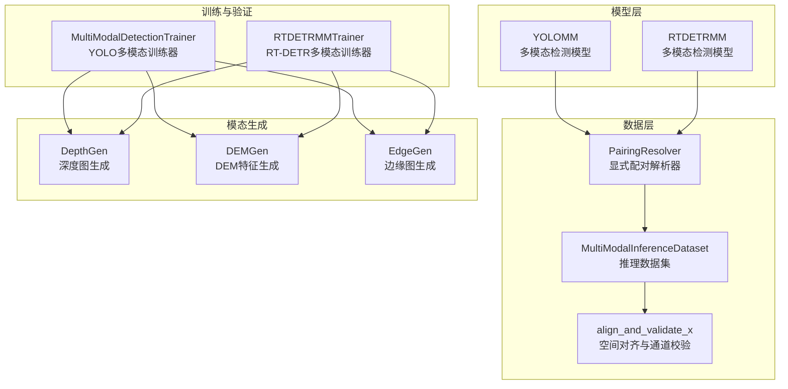
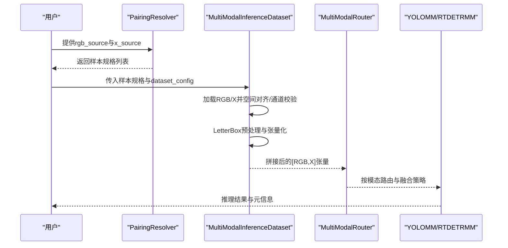
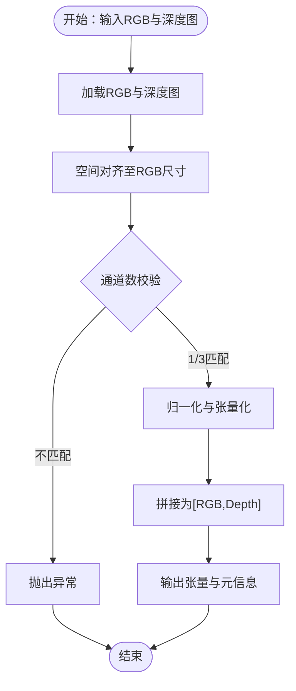
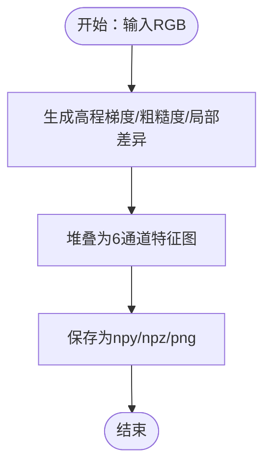
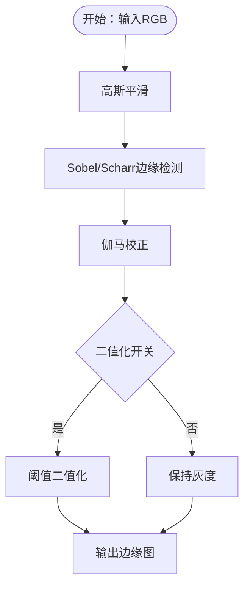
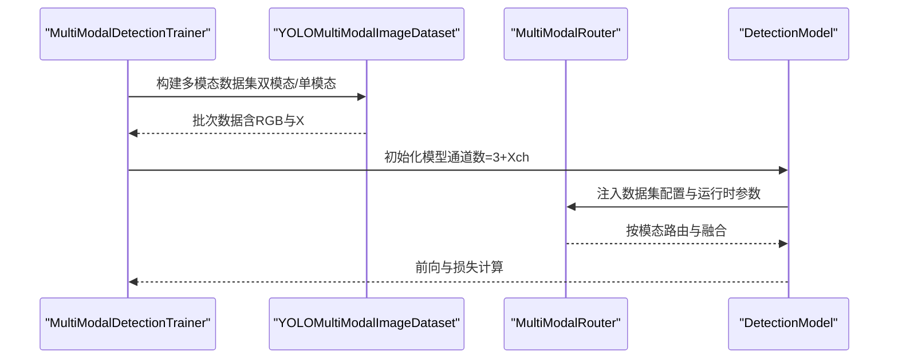
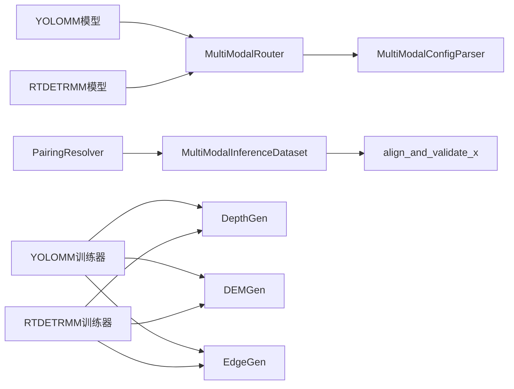

# 模态处理技术

<cite>
**本文档引用的文件**
- [ultralytics/__init__.py](file://ultralytics/__init__.py)
- [ultralytics/nanomodels/rtdetrmm/model.py](file://ultralytics/models/rtdetrmm/model.py)
- [ultralytics/models/yolo/multimodal/__init__.py](file://ultralytics/models/yolo/multimodal/__init__.py)
- [ultralytics/data/multimodal/__init__.py](file://ultralytics/data/multimodal/__init__.py)
- [ultralytics/data/multimodal/inference_dataset.py](file://ultralytics/data/multimodal/inference_dataset.py)
- [ultralytics/data/multimodal/pairing.py](file://ultralytics/data/multimodal/pairing.py)
- [ultralytics/data/multimodal/utils.py](file://ultralytics/data/multimodal/utils.py)
- [ultralytics/nn/mm/__init__.py](file://ultralytics/nn/mm/__init__.py)
- [ultralytics/nn/mm/filling.py](file://ultralytics/nn/mm/filling.py)
- [ultralytics/nn/mm/generators/__init__.py](file://ultralytics/nn/mm/generators/__init__.py)
- [depthGen.py](file://depthGen.py)
- [edgeGen.py](file://edgeGen.py)
- [DEMGen.py](file://DEMGen.py)
- [trainMM.py](file://trainMM.py)
- [ultralytics/models/yolo/multimodal/train.py](file://ultralytics/models/yolo/multimodal/train.py)
- [ultralytics/models/rtdetrmm/train.py](file://ultralytics/models/rtdetrmm/train.py)
</cite>

## 目录
1. [简介](#简介)
2. [项目结构](#项目结构)
3. [核心组件](#核心组件)
4. [架构总览](#架构总览)
5. [详细组件分析](#详细组件分析)
6. [依赖关系分析](#依赖关系分析)
7. [性能考虑](#性能考虑)
8. [故障排查指南](#故障排查指南)
9. [结论](#结论)
10. [附录](#附录)

## 简介
本文件面向多模态处理技术的专业文档，围绕以下目标展开：
- 深度模态处理：深度估计算法、深度图质量评估与深度数据增强方法
- 地理信息处理：DEM数据处理、高程特征提取与地形分析方法
- 边缘特征处理：边缘检测算法、边缘特征增强与边缘数据融合策略

文档将结合代码库中的多模态框架（YOLOMM/RTDETRMM）、模态生成器（DepthGen/DEMGen/EdgeGen）、推理与训练管线，系统阐述各模态的算法原理、实现细节、参数调优与质量控制方法。

## 项目结构
该代码库采用模块化组织，核心围绕多模态检测框架与模态生成工具：
- 模型层：YOLOMM/RTDETRMM两类多模态检测模型
- 数据层：多模态推理数据集与配对解析器
- 模态生成：深度图、边缘图、DEM特征离线生成器
- 训练/验证/推理：统一的训练器、验证器与可视化接口

**图表来源**
- [ultralytics/models/yolo/multimodal/train.py:16-757](file://ultralytics/models/yolo/multimodal/train.py#L16-L757)
- [ultralytics/models/rtdetrmm/train.py:24-568](file://ultralytics/models/rtdetrmm/train.py#L24-L568)
- [ultralytics/data/multimodal/inference_dataset.py:16-252](file://ultralytics/data/multimodal/inference_dataset.py#L16-L252)
- [ultralytics/data/multimodal/pairing.py:11-203](file://ultralytics/data/multimodal/pairing.py#L11-L203)
- [ultralytics/data/multimodal/utils.py:13-180](file://ultralytics/data/multimodal/utils.py#L13-L180)
- [ultralytics/nn/mm/generators/__init__.py:1-15](file://ultralytics/nn/mm/generators/__init__.py#L1-L15)

**章节来源**
- [ultralytics/models/yolo/multimodal/train.py:16-757](file://ultralytics/models/yolo/multimodal/train.py#L16-L757)
- [ultralytics/models/rtdetrmm/train.py:24-568](file://ultralytics/models/rtdetrmm/train.py#L24-L568)
- [ultralytics/data/multimodal/inference_dataset.py:16-252](file://ultralytics/data/multimodal/inference_dataset.py#L16-L252)
- [ultralytics/data/multimodal/pairing.py:11-203](file://ultralytics/data/multimodal/pairing.py#L11-L203)
- [ultralytics/data/multimodal/utils.py:13-180](file://ultralytics/data/multimodal/utils.py#L13-L180)
- [ultralytics/nn/mm/generators/__init__.py:1-15](file://ultralytics/nn/mm/generators/__init__.py#L1-L15)

## 核心组件
- 多模态路由器与配置解析：负责基于YAML/权重内容识别多模态结构，动态推断输入通道与可用模态集合，确保RGB+X数据流的零拷贝路由与配置驱动。
- 模态填充器：提供复制、噪声、通道重复、边缘模糊、混合等策略，实现缺失模态的合成与通道适配。
- 多模态推理数据集：严格校验RGB与X的空间对齐与通道一致性，支持单模态零填充与批量推理。
- 模态生成器：深度图（DepthGen）、DEM特征（DEMGen）、边缘图（EdgeGen）离线生成，支持多种保存格式与参数调优。
- 训练器：YOLOMM与RTDETRMM训练器，支持双模态与单模态消融训练，统一损失与可视化。

**章节来源**
- [ultralytics/nn/mm/__init__.py:1-78](file://ultralytics/nn/mm/__init__.py#L1-L78)
- [ultralytics/nn/mm/filling.py:14-175](file://ultralytics/nn/mm/filling.py#L14-L175)
- [ultralytics/data/multimodal/inference_dataset.py:16-252](file://ultralytics/data/multimodal/inference_dataset.py#L16-L252)
- [ultralytics/nn/mm/generators/__init__.py:1-15](file://ultralytics/nn/mm/generators/__init__.py#L1-L15)
- [ultralytics/models/yolo/multimodal/train.py:16-757](file://ultralytics/models/yolo/multimodal/train.py#L16-L757)
- [ultralytics/models/rtdetrmm/train.py:24-568](file://ultralytics/models/rtdetrmm/train.py#L24-L568)

## 架构总览
多模态处理的整体架构分为三层：
- 模型层：YOLOMM/RTDETRMM通过路由器识别多模态结构，支持RGB+X输入与不同融合阶段。
- 数据层：PairingResolver将显式RGB/X源解析为样本规格，InferenceDataset完成加载、对齐、预处理与拼接。
- 生成层：DepthGen/DEMGen/EdgeGen离线生成各模态数据，支持批量与多格式保存。

**图表来源**
- [ultralytics/data/multimodal/pairing.py:37-125](file://ultralytics/data/multimodal/pairing.py#L37-L125)
- [ultralytics/data/multimodal/inference_dataset.py:94-183](file://ultralytics/data/multimodal/inference_dataset.py#L94-L183)
- [ultralytics/nn/mm/__init__.py:29-43](file://ultralytics/nn/mm/__init__.py#L29-L43)

**章节来源**
- [ultralytics/data/multimodal/pairing.py:11-203](file://ultralytics/data/multimodal/pairing.py#L11-L203)
- [ultralytics/data/multimodal/inference_dataset.py:16-252](file://ultralytics/data/multimodal/inference_dataset.py#L16-L252)
- [ultralytics/nn/mm/__init__.py:1-78](file://ultralytics/nn/mm/__init__.py#L1-L78)

## 详细组件分析

### 深度模态处理技术
- 深度估计算法
  - 使用深度估计模型生成深度图，支持CUDA设备与批量处理。
  - 生成器支持对比图、彩色图、原始16位图等多种保存选项。
- 深度图质量评估
  - 通过空间对齐与通道一致性校验，确保深度图与RGB图像分辨率与通道数匹配。
  - 支持TIFF/16位深度图格式，便于高精度存储与后续分析。
- 深度数据增强
  - 模态填充器提供噪声、边缘模糊、通道重复等策略，实现缺失深度模态的合成与通道适配。

**图表来源**
- [ultralytics/data/multimodal/utils.py:13-83](file://ultralytics/data/multimodal/utils.py#L13-L83)
- [ultralytics/data/multimodal/inference_dataset.py:132-160](file://ultralytics/data/multimodal/inference_dataset.py#L132-L160)

**章节来源**
- [depthGen.py:1-24](file://depthGen.py#L1-L24)
- [ultralytics/data/multimodal/utils.py:13-180](file://ultralytics/data/multimodal/utils.py#L13-L180)
- [ultralytics/nn/mm/filling.py:14-175](file://ultralytics/nn/mm/filling.py#L14-L175)

### 地理信息处理技术
- DEM数据处理
  - DEMGen离线生成6通道地形特征，支持npy/npz/png格式。
  - 参数包括高斯核、Sobel核、粗糙度与局部差异核大小等。
- 高程特征提取与地形分析
  - 通过多核卷积提取高程梯度、粗糙度与局部差异，形成多尺度地形特征图。
  - 支持与RGB融合进行语义-几何联合分析。

**图表来源**
- [DEMGen.py:19-42](file://DEMGen.py#L19-L42)
- [ultralytics/nn/mm/generators/__init__.py:6-8](file://ultralytics/nn/mm/generators/__init__.py#L6-L8)

**章节来源**
- [DEMGen.py:1-42](file://DEMGen.py#L1-L42)
- [ultralytics/nn/mm/generators/__init__.py:1-15](file://ultralytics/nn/mm/generators/__init__.py#L1-L15)

### 边缘特征处理技术
- 边缘检测算法
  - EdgeGen支持Sobel/Scharr边缘检测，可选高斯平滑、伽马校正、二值化等参数。
  - 支持输出1通道或3通道边缘图，适应不同下游任务。
- 边缘特征增强
  - 模态填充器的边缘模糊策略利用Sobel核提取边缘并进行高斯平滑，提升鲁棒性。
- 边缘数据融合策略
  - 在推理阶段，边缘图与RGB按通道拼接；在训练阶段，可通过单模态消融与对比学习增强跨模态一致性。

**图表来源**
- [edgeGen.py:20-46](file://edgeGen.py#L20-L46)
- [ultralytics/nn/mm/filling.py:84-98](file://ultralytics/nn/mm/filling.py#L84-L98)

**章节来源**
- [edgeGen.py:1-46](file://edgeGen.py#L1-L46)
- [ultralytics/nn/mm/filling.py:14-175](file://ultralytics/nn/mm/filling.py#L14-L175)

### 多模态训练与推理
- 双模态与单模态训练
  - 训练器支持RGB+X双模态与单模态消融（如仅RGB或仅X），通过路由器在运行时设置参数。
- 损失与可视化
  - YOLOMM训练器扩展对比学习损失；统一训练样本可视化，支持RGB、X与并排对比图。
- 推理数据流
  - PairingResolver显式配对RGB与X；InferenceDataset完成严格校验与预处理，输出[1,3+Xch,H,W]张量。

**图表来源**
- [ultralytics/models/yolo/multimodal/train.py:472-509](file://ultralytics/models/yolo/multimodal/train.py#L472-L509)
- [ultralytics/models/yolo/multimodal/train.py:647-713](file://ultralytics/models/yolo/multimodal/train.py#L647-L713)
- [ultralytics/models/rtdetrmm/train.py:116-170](file://ultralytics/models/rtdetrmm/train.py#L116-L170)

**章节来源**
- [ultralytics/models/yolo/multimodal/train.py:16-757](file://ultralytics/models/yolo/multimodal/train.py#L16-L757)
- [ultralytics/models/rtdetrmm/train.py:24-568](file://ultralytics/models/rtdetrmm/train.py#L24-L568)
- [ultralytics/data/multimodal/inference_dataset.py:94-183](file://ultralytics/data/multimodal/inference_dataset.py#L94-L183)

## 依赖关系分析
- 模块耦合
  - 模型层依赖路由器与配置解析，确保多模态结构识别与通道配置一致性。
  - 数据层依赖配对解析器与预处理工具，保证输入数据的严格契约。
  - 生成层独立于训练/推理，通过统一的保存接口与格式规范接入。
- 外部依赖
  - OpenCV用于图像读取与几何变换；NumPy/Torch用于数值计算与张量化。
  - CUDA设备加速深度/边缘/DEM生成与模型训练。

**图表来源**
- [ultralytics/models/yolo/multimodal/train.py:647-713](file://ultralytics/models/yolo/multimodal/train.py#L647-L713)
- [ultralytics/models/rtdetrmm/train.py:173-254](file://ultralytics/models/rtdetrmm/train.py#L173-L254)
- [ultralytics/data/multimodal/pairing.py:37-125](file://ultralytics/data/multimodal/pairing.py#L37-L125)
- [ultralytics/data/multimodal/inference_dataset.py:94-183](file://ultralytics/data/multimodal/inference_dataset.py#L94-L183)
- [ultralytics/nn/mm/__init__.py:29-43](file://ultralytics/nn/mm/__init__.py#L29-L43)

**章节来源**
- [ultralytics/models/yolo/multimodal/train.py:16-757](file://ultralytics/models/yolo/multimodal/train.py#L16-L757)
- [ultralytics/models/rtdetrmm/train.py:24-568](file://ultralytics/models/rtdetrmm/train.py#L24-L568)
- [ultralytics/data/multimodal/pairing.py:11-203](file://ultralytics/data/multimodal/pairing.py#L11-L203)
- [ultralytics/data/multimodal/inference_dataset.py:16-252](file://ultralytics/data/multimodal/inference_dataset.py#L16-L252)
- [ultralytics/nn/mm/__init__.py:1-78](file://ultralytics/nn/mm/__init__.py#L1-L78)

## 性能考虑
- 训练效率
  - 训练器在构建模型前注入数据集配置，确保路由器在解析期即可识别X模态，减少运行时开销。
  - 支持GFLOPs统计（架构级与路由感知），便于模型规模与路由影响的量化评估。
- 推理效率
  - 推理数据集采用LetterBox居中对齐与固定填充，避免缩放放大，提高坐标还原精度与速度。
  - 模态填充策略轻量化，避免在路由路径引入重型依赖。
- 存储与I/O
  - 深度图支持16位TIFF存储，DEM特征支持npy/npz压缩存储，平衡精度与存储成本。

**章节来源**
- [ultralytics/models/yolo/multimodal/train.py:94-105](file://ultralytics/models/yolo/multimodal/train.py#L94-L105)
- [ultralytics/models/rtdetrmm/train.py:241-252](file://ultralytics/models/rtdetrmm/train.py#L241-L252)
- [ultralytics/data/multimodal/inference_dataset.py:69-77](file://ultralytics/data/multimodal/inference_dataset.py#L69-L77)
- [ultralytics/nn/mm/filling.py:14-33](file://ultralytics/nn/mm/filling.py#L14-L33)

## 故障排查指南
- 模态通道不匹配
  - 现象：X模态通道数与预期不符或无法在1/3之间转换。
  - 处理：检查X模态文件格式与通道数；对于Xch>3需提供严格匹配通道数的多通道文件（如.tif/.npy/.npz）。
- 空间尺寸不一致
  - 现象：RGB与X模态分辨率不一致导致对齐失败。
  - 处理：确保X模态与RGB同分辨率；若为深度图，确认深度图与RGB一一对应。
- 单模态消融参数冲突
  - 现象：单模态训练时X路径缺失或配置不一致。
  - 处理：通过路由器运行时参数设置，确保仅使用有效模态；必要时启用模态填充策略。
- 训练器初始化失败
  - 现象：模型未识别为多模态结构或通道数不支持。
  - 处理：检查模型YAML/权重内容判据；确保输入通道数为3或6。

**章节来源**
- [ultralytics/data/multimodal/utils.py:32-83](file://ultralytics/data/multimodal/utils.py#L32-L83)
- [ultralytics/data/multimodal/inference_dataset.py:132-157](file://ultralytics/data/multimodal/inference_dataset.py#L132-L157)
- [ultralytics/models/yolo/multimodal/train.py:430-471](file://ultralytics/models/yolo/multimodal/train.py#L430-L471)
- [ultralytics/models/rtdetrmm/train.py:106-115](file://ultralytics/models/rtdetrmm/train.py#L106-L115)

## 结论
本多模态处理框架通过路由器与配置解析实现RGB+X数据流的零拷贝路由与灵活融合，结合深度、边缘与DEM等多模态生成器，提供了从数据生成到训练/推理的完整链路。针对深度、地理与边缘特征，框架分别提供了高质量生成、严格校验与稳健增强策略，适用于复杂场景下的多源信息融合与目标检测任务。

## 附录
- 快速开始
  - 训练：使用YOLOMM/RTDETRMM训练器，配置data.yaml中的模态组合与Xch，启动训练。
  - 推理：使用PairingResolver显式配对RGB与X，经InferenceDataset预处理后送入模型。
  - 数据生成：使用DepthGen/DEMGen/EdgeGen离线生成各模态数据，按需调整参数与保存格式。

**章节来源**
- [trainMM.py:1-15](file://trainMM.py#L1-L15)
- [ultralytics/data/multimodal/pairing.py:37-125](file://ultralytics/data/multimodal/pairing.py#L37-L125)
- [ultralytics/data/multimodal/inference_dataset.py:94-183](file://ultralytics/data/multimodal/inference_dataset.py#L94-L183)
- [depthGen.py:1-24](file://depthGen.py#L1-L24)
- [DEMGen.py:1-42](file://DEMGen.py#L1-L42)
- [edgeGen.py:1-46](file://edgeGen.py#L1-L46)