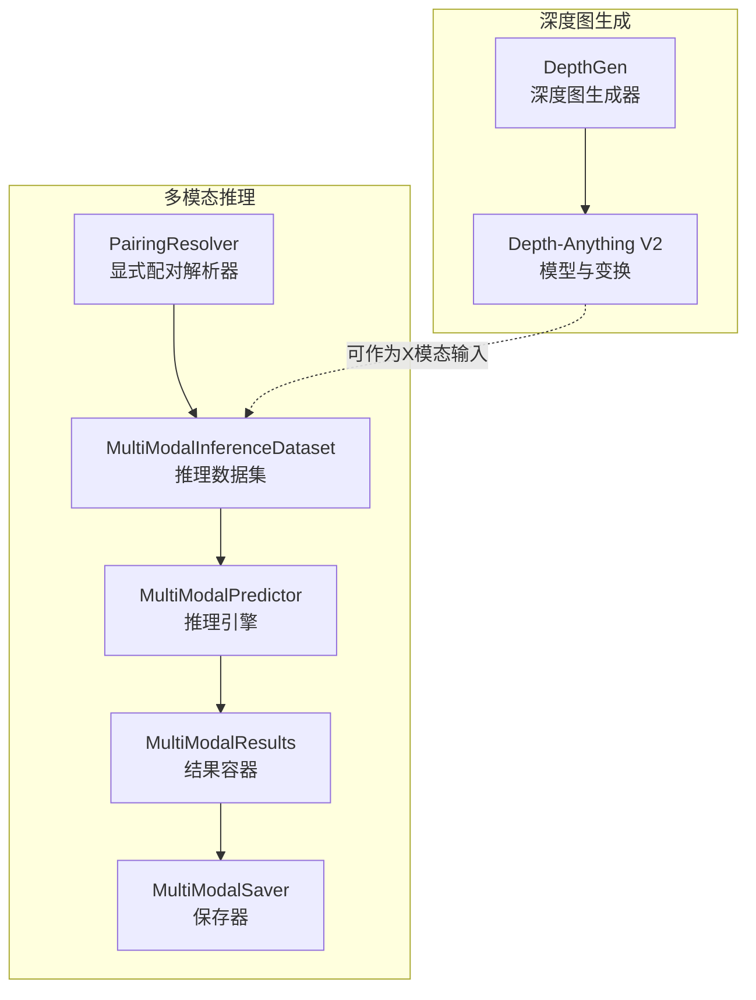
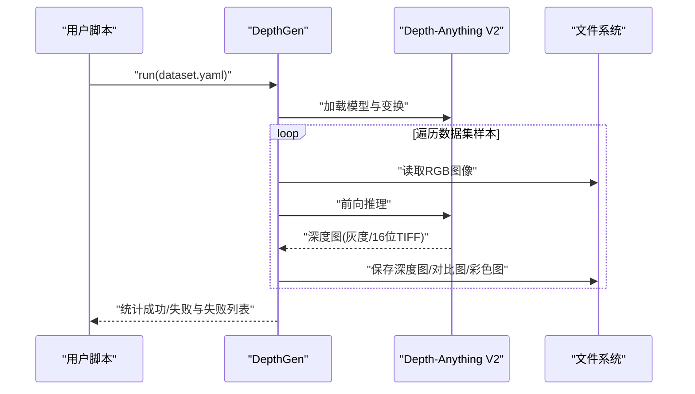
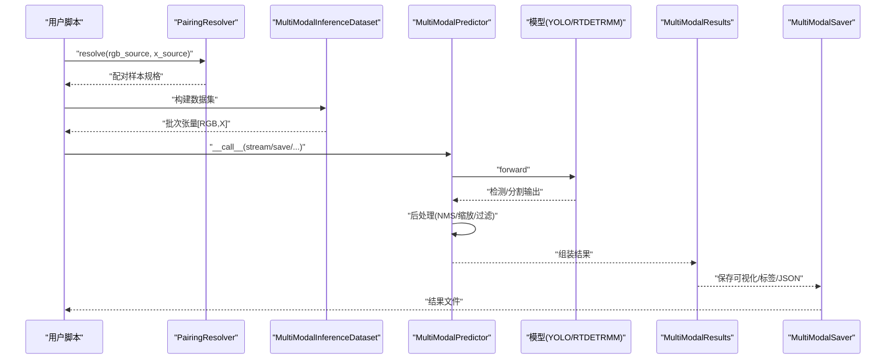
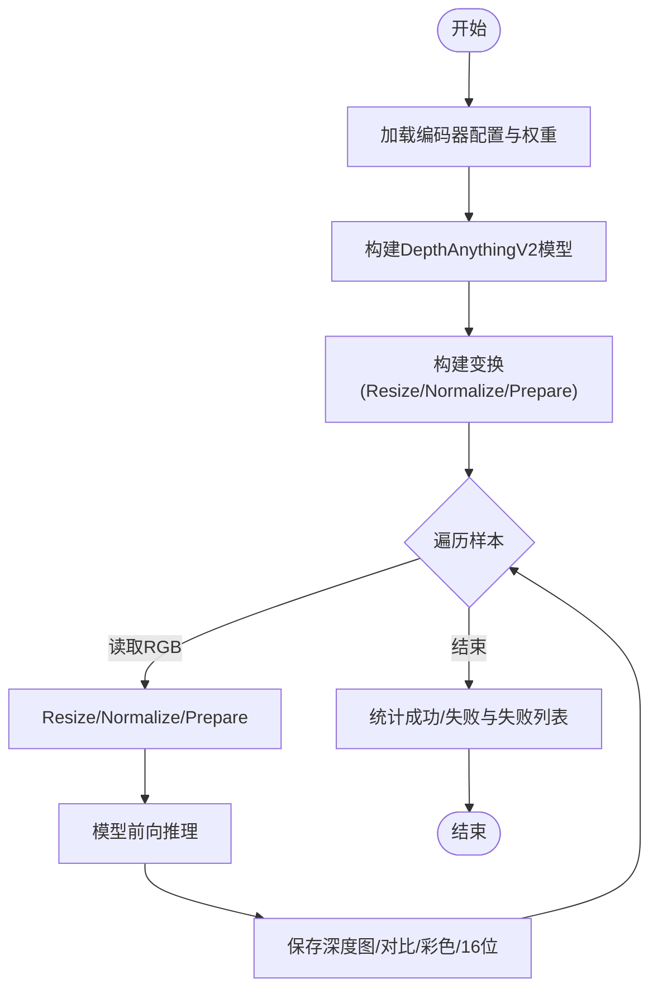
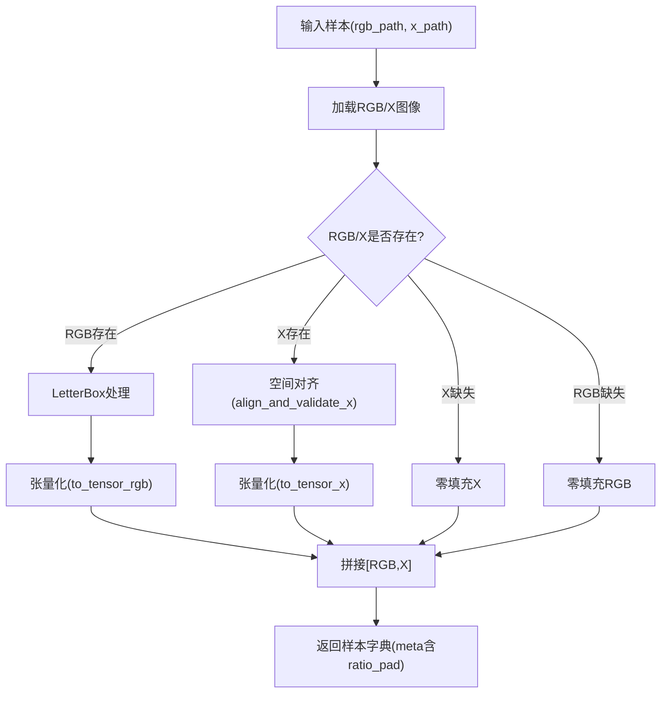
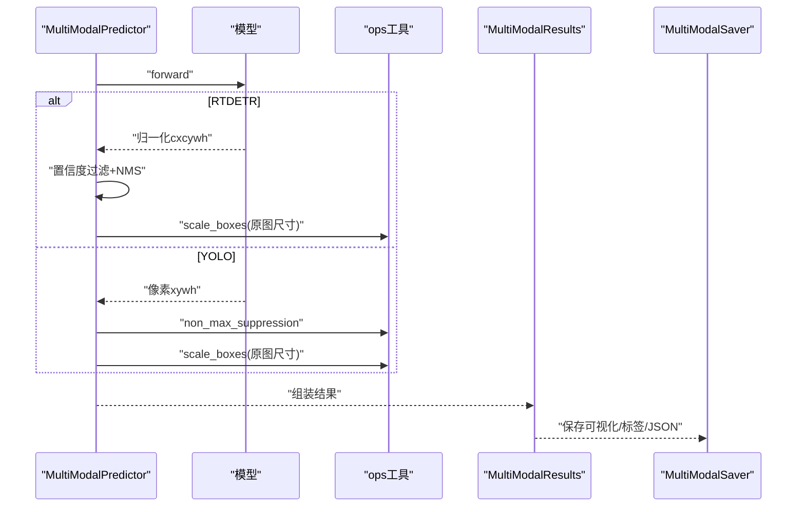
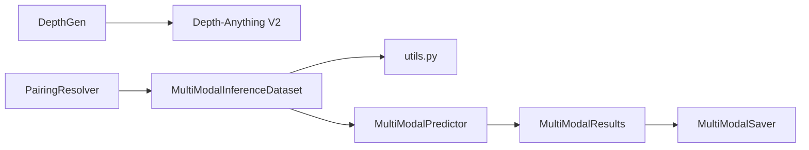

# 深度模态处理

<cite>
**本文引用的文件**
- [depthGen.py](file://depthGen.py)
- [predictMM.py](file://predictMM.py)
- [trainMM.py](file://trainMM.py)
- [inference_dataset.py](file://ultralytics/data/multimodal/inference_dataset.py)
- [predictor.py](file://ultralytics/engine/multimodal/predictor.py)
- [utils.py](file://ultralytics/data/multimodal/utils.py)
- [pairing.py](file://ultralytics/data/multimodal/pairing.py)
- [results.py](file://ultralytics/engine/multimodal/results.py)
- [saver.py](file://ultralytics/engine/multimodal/saver.py)
- [depth_anything_v2.py](file://ultralytics/nn/mm/generators/depth_anything_v2.py)
- [model.py](file://ultralytics/models/rtdetrmm/model.py)
</cite>

## 目录
1. [简介](#简介)
2. [项目结构](#项目结构)
3. [核心组件](#核心组件)
4. [架构总览](#架构总览)
5. [详细组件分析](#详细组件分析)
6. [依赖分析](#依赖分析)
7. [性能考虑](#性能考虑)
8. [故障排除指南](#故障排除指南)
9. [结论](#结论)
10. [附录](#附录)

## 简介
本文件系统性梳理深度模态处理技术在该代码库中的实现与应用，重点围绕以下目标展开：
- 深度估计算法原理与Depth-Anything V2模型工作机制
- 从RGB图像到深度图的生成流程与质量控制
- 深度图质量评估方法与误差分析
- 深度数据增强与预处理/后处理优化策略
- 完整配置参数说明、使用示例与故障排除

本项目提供从“深度图生成”到“多模态推理”的完整链路，既可用于离线深度图生成，也可作为多模态视觉任务（如检测、分割）的X模态输入。

## 项目结构
该项目采用模块化组织，围绕“数据加载与预处理”“推理引擎”“结果保存与可视化”“模态生成器（深度/边缘/高程）”四大板块构建。与深度模态直接相关的关键模块如下：
- 深度图生成：通过DepthGen接口调用Depth-Anything V2，实现从RGB到深度图的在线/离线生成
- 多模态推理：MultiModalPredictor负责将RGB与X模态（含深度图）拼接后进行检测/分割等任务
- 数据预处理：MultiModalInferenceDataset与工具函数保证RGB与X模态的空间与通道对齐、归一化与LetterBox处理
- 结果保存：MultiModalSaver统一管理可视化图像、YOLO格式标签与JSON元数据的保存

**图表来源**
- [depth_anything_v2.py:72-346](file://ultralytics/nn/mm/generators/depth_anything_v2.py#L72-L346)
- [pairing.py:11-203](file://ultralytics/data/multimodal/pairing.py#L11-L203)
- [inference_dataset.py:16-252](file://ultralytics/data/multimodal/inference_dataset.py#L16-L252)
- [predictor.py:16-494](file://ultralytics/engine/multimodal/predictor.py#L16-L494)
- [results.py:14-357](file://ultralytics/engine/multimodal/results.py#L14-L357)
- [saver.py:12-112](file://ultralytics/engine/multimodal/saver.py#L12-L112)

**章节来源**
- [depthGen.py:1-24](file://depthGen.py#L1-L24)
- [predictMM.py:1-40](file://predictMM.py#L1-L40)
- [trainMM.py:1-15](file://trainMM.py#L1-L15)

## 核心组件
- 深度图生成器（DepthGen）
  - 通过Depth-Anything V2实现深度估计，支持不同编码器（vits/vitb/vitl/vitg），可配置输入尺寸、设备、保存选项等
  - 提供run接口，接收dataset.yaml路径，批量生成深度图并统计成功/失败情况
- 多模态推理引擎（MultiModalPredictor）
  - 从模型读取Router配置，构建推理数据集，执行forward与后处理（YOLO/NMS或RTDETR专用后处理），组装MultiModalResults并可保存
- 推理数据集（MultiModalInferenceDataset）
  - 加载RGB与X模态（支持缺失时零填充），执行LetterBox、通道对齐与归一化，拼接为[RGB,X]输入张量
- 工具函数（align_and_validate_x、to_tensor_*、letterbox_with_ratio_pad）
  - 空间对齐与通道校验、张量转换与归一化、LetterBox与ratio_pad计算
- 配对解析器（PairingResolver）
  - 将显式rgb_source与x_source解析为配对样本规格，支持单模态与双模态推理
- 结果容器与保存（MultiModalResults、MultiModalSaver）
  - 统一的检测结果封装、YOLO格式标签与JSON元数据保存、可视化图像输出

**章节来源**
- [depth_anything_v2.py:72-346](file://ultralytics/nn/mm/generators/depth_anything_v2.py#L72-L346)
- [predictor.py:16-494](file://ultralytics/engine/multimodal/predictor.py#L16-L494)
- [inference_dataset.py:16-252](file://ultralytics/data/multimodal/inference_dataset.py#L16-L252)
- [utils.py:13-180](file://ultralytics/data/multimodal/utils.py#L13-L180)
- [pairing.py:11-203](file://ultralytics/data/multimodal/pairing.py#L11-L203)
- [results.py:14-357](file://ultralytics/engine/multimodal/results.py#L14-L357)
- [saver.py:12-112](file://ultralytics/engine/multimodal/saver.py#L12-L112)

## 架构总览
下图展示从RGB到深度图生成，再到多模态推理的整体流程：

**图表来源**
- [depthGen.py:1-24](file://depthGen.py#L1-L24)
- [depth_anything_v2.py:72-346](file://ultralytics/nn/mm/generators/depth_anything_v2.py#L72-L346)

下图展示多模态推理流程（RGB与深度图作为X模态）：

**图表来源**
- [predictor.py:99-244](file://ultralytics/engine/multimodal/predictor.py#L99-L244)
- [inference_dataset.py:94-184](file://ultralytics/data/multimodal/inference_dataset.py#L94-L184)
- [results.py:48-131](file://ultralytics/engine/multimodal/results.py#L48-L131)
- [saver.py:54-112](file://ultralytics/engine/multimodal/saver.py#L54-L112)

## 详细组件分析

### 深度估计算法与Depth-Anything V2实现
- 模型加载与配置
  - 支持vits/vitb/vitl/vitg四种编码器，自动解析权重路径与状态字典，构建DepthAnythingV2模型并加载权重
  - 构建Resize、Normalize、PrepareForNet等变换，确保输入符合模型预期
- 前向推理
  - 将RGB图像按设定尺寸与比例进行Resize，归一化后送入模型，得到深度图
  - 支持保存对比图、彩色深度图、原始16位深度图等
- 生成流程要点
  - 通过DepthGen.run批量处理数据集，统计成功/失败样本并输出失败清单
  - 生成的深度图可作为X模态输入进入多模态推理流程

**图表来源**
- [depth_anything_v2.py:263-346](file://ultralytics/nn/mm/generators/depth_anything_v2.py#L263-L346)
- [depthGen.py:5-24](file://depthGen.py#L5-L24)

**章节来源**
- [depth_anything_v2.py:72-346](file://ultralytics/nn/mm/generators/depth_anything_v2.py#L72-L346)
- [depthGen.py:1-24](file://depthGen.py#L1-L24)

### 从RGB到深度图的生成流程
- 输入准备
  - 读取RGB图像，按LetterBox策略进行缩放与填充，保证推理尺寸一致
- 模型推理
  - 应用标准化与网络输入准备，执行深度估计
- 输出与保存
  - 可选保存对比图、彩色深度图、原始16位深度图（TIFF）
  - 统计运行状态，记录失败样本

**章节来源**
- [inference_dataset.py:111-160](file://ultralytics/data/multimodal/inference_dataset.py#L111-L160)
- [depthGen.py:1-24](file://depthGen.py#L1-L24)

### 多模态推理数据集与预处理
- 配对解析
  - PairingResolver将显式rgb_source与x_source解析为样本规格，支持单模态与双模态
- 数据集构建
  - MultiModalInferenceDataset加载RGB与X模态，执行空间对齐、通道校验、LetterBox与张量化
  - 支持X模态缺失时的零填充策略
- 预处理细节
  - align_and_validate_x：空间对齐与通道数校验（1↔3灰度/RGB转换）
  - to_tensor_rgb/to_tensor_x：BGR->RGB翻转与归一化（uint8/uint16）
  - letterbox_with_ratio_pad：计算ratio_pad用于后续坐标还原

**图表来源**
- [pairing.py:37-125](file://ultralytics/data/multimodal/pairing.py#L37-L125)
- [inference_dataset.py:94-184](file://ultralytics/data/multimodal/inference_dataset.py#L94-L184)
- [utils.py:13-180](file://ultralytics/data/multimodal/utils.py#L13-L180)

**章节来源**
- [pairing.py:11-203](file://ultralytics/data/multimodal/pairing.py#L11-L203)
- [inference_dataset.py:16-252](file://ultralytics/data/multimodal/inference_dataset.py#L16-L252)
- [utils.py:13-180](file://ultralytics/data/multimodal/utils.py#L13-L180)

### 推理引擎与后处理
- 模型类型检测
  - 自动识别RTDETR与YOLO输出格式，分别走RTDETR专用后处理或YOLO标准后处理（NMS）
- RTDETR后处理
  - 提取bbox与类别分数，按置信度阈值过滤，归一化坐标转像素坐标，应用NMS，再按ratio_pad还原到原图尺寸
- YOLO后处理
  - 执行NMS，使用ratio_pad与原图尺寸还原检测框坐标
- 结果封装与保存
  - MultiModalResults封装boxes、paths、orig_imgs、meta与names
  - MultiModalSaver按约定命名保存可视化图像、标签与JSON

**图表来源**
- [predictor.py:167-243](file://ultralytics/engine/multimodal/predictor.py#L167-L243)
- [results.py:48-131](file://ultralytics/engine/multimodal/results.py#L48-L131)
- [saver.py:54-112](file://ultralytics/engine/multimodal/saver.py#L54-L112)

**章节来源**
- [predictor.py:16-494](file://ultralytics/engine/multimodal/predictor.py#L16-L494)
- [results.py:14-357](file://ultralytics/engine/multimodal/results.py#L14-L357)
- [saver.py:12-112](file://ultralytics/engine/multimodal/saver.py#L12-L112)

### 深度图质量评估与误差分析
- 评估指标建议
  - 绝对相对误差（AbsRel）、平方根误差（RMSE）、对数误差（log10）、阈值命中率（δ>θ）
  - 尺度不变误差（SILog、SqRel）与中位数绝对百分比误差（MedAE）
- 误差分析
  - 分析不同场景（光照、纹理、遮挡）下的误差分布
  - 对比不同编码器（vits/vitb/vitl/vitg）与输入尺寸对精度的影响
- 质量控制
  - 通过对比图与彩色深度图进行人工核查
  - 对异常深度图（极值、噪声、空洞）进行剔除或重采样

说明：本节为通用评估方法论，不直接引用具体代码文件。

### 深度数据增强与预处理/后处理优化
- 数据预处理
  - LetterBox保持纵横比，避免形变引入的几何畸变
  - 归一化与张量化确保模型输入一致性
- 数据后处理
  - 使用ratio_pad还原检测框至原图坐标，保证定位精度
  - 对RTDETR输出进行置信度过滤与NMS，减少冗余框
- 质量提升策略
  - 多尺度测试（不同input_size）与集成策略
  - 深度图插值与平滑（如双边滤波）以降低噪声
  - 与边缘图/高程特征融合，提升多模态任务鲁棒性

说明：本节为通用优化策略，不直接引用具体代码文件。

## 依赖分析
- 模块耦合
  - DepthGen依赖Depth-Anything V2实现深度估计，输出可作为X模态接入多模态推理
  - MultiModalPredictor依赖模型Router配置（Xch、x_modality），通过PairingResolver与InferenceDataset构建输入
  - InferenceDataset依赖utils中的对齐与张量化函数，确保RGB与X模态一致性
- 外部依赖
  - OpenCV、NumPy、PyTorch、torchvision（NMS）
  - Depth-Anything V2（ref目录）

**图表来源**
- [depth_anything_v2.py:72-346](file://ultralytics/nn/mm/generators/depth_anything_v2.py#L72-L346)
- [pairing.py:11-203](file://ultralytics/data/multimodal/pairing.py#L11-L203)
- [inference_dataset.py:16-252](file://ultralytics/data/multimodal/inference_dataset.py#L16-L252)
- [utils.py:13-180](file://ultralytics/data/multimodal/utils.py#L13-L180)
- [predictor.py:16-494](file://ultralytics/engine/multimodal/predictor.py#L16-L494)
- [results.py:14-357](file://ultralytics/engine/multimodal/results.py#L14-L357)
- [saver.py:12-112](file://ultralytics/engine/multimodal/saver.py#L12-L112)

**章节来源**
- [predictor.py:60-98](file://ultralytics/engine/multimodal/predictor.py#L60-L98)
- [inference_dataset.py:32-82](file://ultralytics/data/multimodal/inference_dataset.py#L32-L82)

## 性能考虑
- 设备与批处理
  - 优先使用GPU（device='cuda:*'），合理设置batch_size与num_workers以平衡吞吐与内存占用
- 输入尺寸与LetterBox
  - 固定输入尺寸可提升批处理效率；LetterBox保持比例避免额外重采样开销
- 模型与编码器
  - vits速度最快但精度略低；vitb在速度与精度间折中；vitl/vitg适合高精度场景但计算成本更高
- I/O与保存
  - 控制保存项（如save_npy/save_raw16）以减少磁盘写入压力

说明：本节提供通用性能建议，不直接引用具体代码文件。

## 故障排除指南
- 深度图生成失败
  - 检查权重路径是否存在、编码器与权重是否匹配
  - 确认输入图像可读且尺寸合法
- 多模态推理报错
  - X模态通道数不匹配：确保Xch与模型期望一致，必要时进行1↔3通道转换
  - 空间尺寸不一致：使用align_and_validate_x对齐到RGB尺寸
  - 模型类型识别失败：确认使用YOLO或RTDETRMM模型并正确加载
- 保存结果异常
  - 检查保存目录权限与路径，确认保存开关（save_txt/save_json）配置
  - 若出现坐标异常，核对ratio_pad与原图尺寸是否一致

**章节来源**
- [depth_anything_v2.py:322-329](file://ultralytics/nn/mm/generators/depth_anything_v2.py#L322-L329)
- [utils.py:65-83](file://ultralytics/data/multimodal/utils.py#L65-L83)
- [predictor.py:66-68](file://ultralytics/engine/multimodal/predictor.py#L66-L68)
- [saver.py:40-53](file://ultralytics/engine/multimodal/saver.py#L40-L53)

## 结论
本项目提供了从深度图生成到多模态推理的完整技术栈。Depth-Anything V2作为深度估计的核心，配合严格的RGB-X模态对齐与归一化流程，能够稳定地为多模态任务提供高质量深度图输入。通过统一的结果容器与保存器，用户可以便捷地进行可视化、标签导出与JSON元数据管理。建议在实际部署中结合硬件资源与任务精度需求，选择合适的编码器与输入尺寸，并配套数据增强与后处理策略以进一步提升性能与鲁棒性。

## 附录

### 配置参数说明（节选）
- 深度图生成（DepthGen.run）
  - 权重路径、设备、保存目录、是否保存对比图/彩色图/16位图、数据划分、批大小、工作进程数
- 多模态推理（MultiModalPredictor.__call__）
  - RGB与X模态输入源、是否流式、是否保存、保存目录、置信度阈值、NMS IoU阈值、最大检测数、设备
- 数据集（MultiModalInferenceDataset）
  - 样本列表、推理尺寸、X模态通道数与类型、stride、padding比例
- 工具函数
  - align_and_validate_x：X模态与RGB的空间对齐与通道校验
  - to_tensor_rgb/to_tensor_x：张量化与归一化
  - letterbox_with_ratio_pad：LetterBox与ratio_pad计算

**章节来源**
- [depthGen.py:5-16](file://depthGen.py#L5-L16)
- [predictor.py:32-98](file://ultralytics/engine/multimodal/predictor.py#L32-L98)
- [inference_dataset.py:32-82](file://ultralytics/data/multimodal/inference_dataset.py#L32-L82)
- [utils.py:13-180](file://ultralytics/data/multimodal/utils.py#L13-L180)

### 使用示例
- 深度图生成
  - 初始化DepthGen并调用run，传入dataset.yaml路径，查看统计与失败列表
- 多模态推理
  - 使用YOLOMM/RTDETRMM模型，显式传入rgb_source与x_source，支持单模态与双模态
- 训练多模态模型
  - 通过YOLOMM/RTDETRMM训练接口，指定数据集与超参，进行端到端训练

**章节来源**
- [depthGen.py:1-24](file://depthGen.py#L1-L24)
- [predictMM.py:1-40](file://predictMM.py#L1-L40)
- [trainMM.py:1-15](file://trainMM.py#L1-L15)