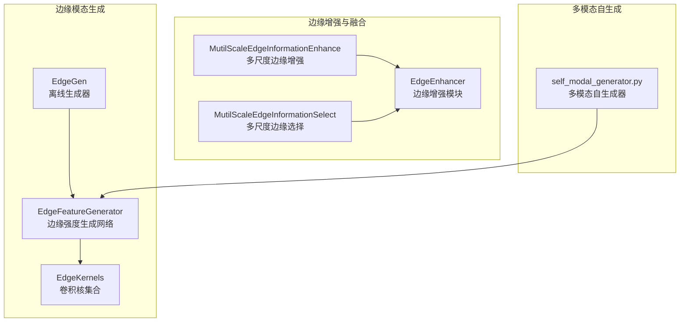
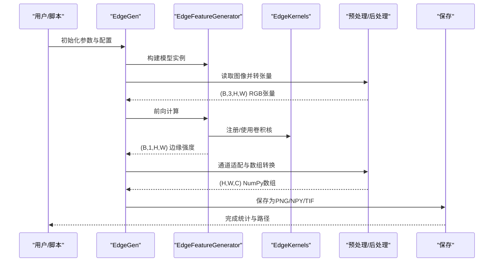
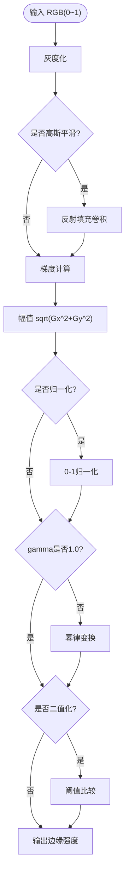
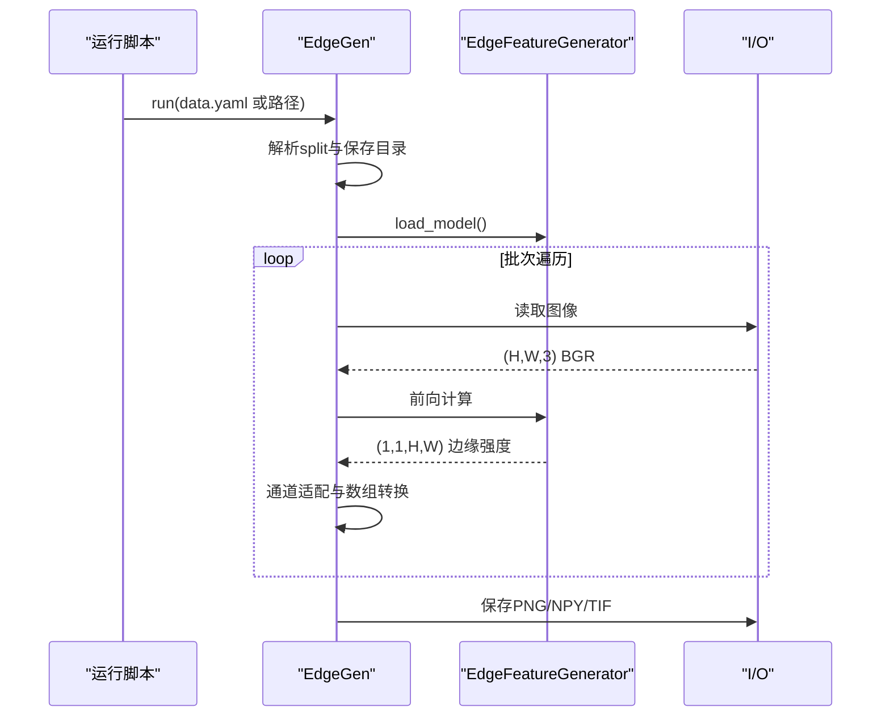
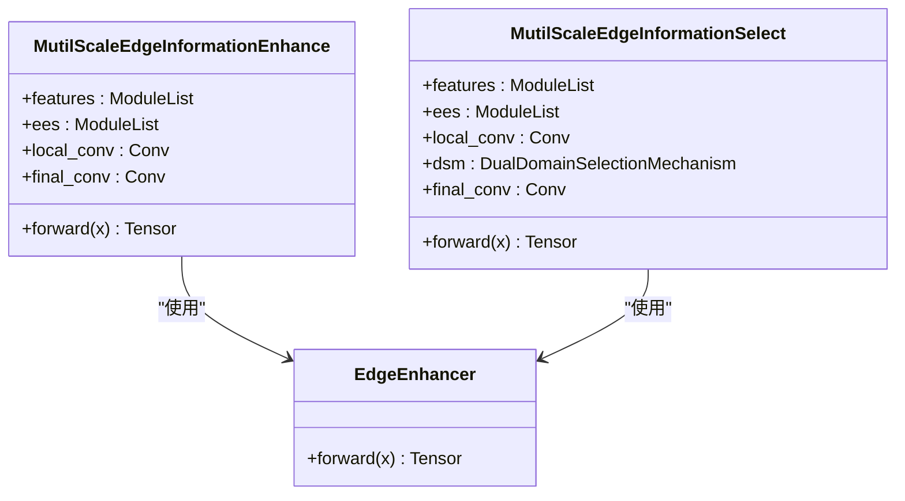
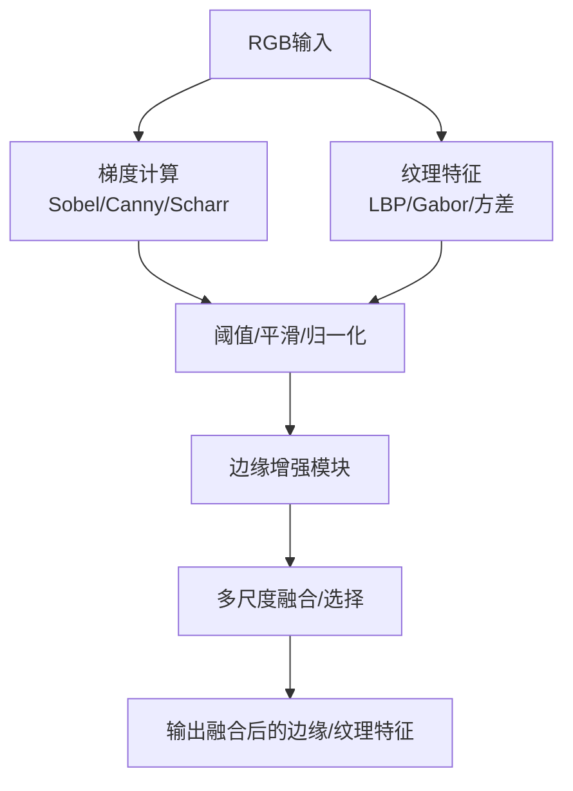
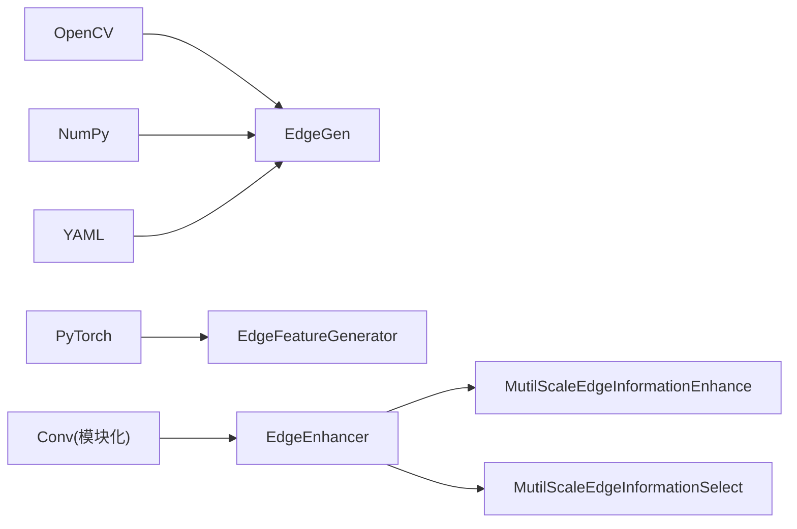

# 边缘特征处理

<cite>
**本文引用的文件**   
- [edgeGen.py](file://edgeGen.py)
- [edge.py](file://ultralytics/nn/mm/generators/edge.py)
- [edge_msie.py](file://ultralytics/nn/public/edge_msie.py)
- [self_modal_generator.py](file://ultralytics/models/yolo/multimodal/self_modal_generator.py)
- [args.yaml（示例）](file://ResTest/aifi-dattention-CSP-MutilScaleEdgeInformationEnhance-ASF-P2-lite-BackboneFreqFusion/args.yaml)
- [results.csv（示例）](file://ResTest/aifi-dattention-CSP-MutilScaleEdgeInformationEnhance-ASF-P2-lite-BackboneFreqFusion/results.csv)
</cite>

## 目录
1. [引言](#引言)
2. [项目结构](#项目结构)
3. [核心组件](#核心组件)
4. [架构总览](#架构总览)
5. [详细组件分析](#详细组件分析)
6. [依赖分析](#依赖分析)
7. [性能考虑](#性能考虑)
8. [故障排查指南](#故障排查指南)
9. [结论](#结论)
10. [附录](#附录)

## 引言
本文件系统性梳理该仓库中的边缘特征处理技术，覆盖以下主题：
- 边缘检测算法原理与实现：Sobel、Scharr、Canny、Laplacian等
- 边缘特征增强：细化、连接、噪声抑制、质量优化
- 多尺度边缘信息增强与选择模块
- 边缘模态与其他模态的融合策略
- 参数调优指南、质量评估方法与实证案例

## 项目结构
围绕边缘特征处理的关键代码分布在如下位置：
- 边缘模态生成器与推理管线：ultralytics/nn/mm/generators/edge.py
- 边缘特征增强与多尺度融合模块：ultralytics/nn/public/edge_msie.py
- 自研多模态模型中边缘/纹理/梯度生成与处理：ultralytics/models/yolo/multimodal/self_modal_generator.py
- 边缘模态离线生成脚本：edgeGen.py
- 实验配置与结果：ResTest 下各子实验的 args.yaml 与 results.csv

**图表来源**
- [edge.py:35-187](file://ultralytics/nn/mm/generators/edge.py#L35-L187)
- [edge_msie.py:14-75](file://ultralytics/nn/public/edge_msie.py#L14-L75)
- [self_modal_generator.py:238-295](file://ultralytics/models/yolo/multimodal/self_modal_generator.py#L238-L295)

**章节来源**
- [edgeGen.py:1-46](file://edgeGen.py#L1-L46)
- [edge.py:1-506](file://ultralytics/nn/mm/generators/edge.py#L1-L506)
- [edge_msie.py:1-76](file://ultralytics/nn/public/edge_msie.py#L1-L76)
- [self_modal_generator.py:200-399](file://ultralytics/models/yolo/multimodal/self_modal_generator.py#L200-L399)

## 核心组件
- 边缘强度生成网络（EdgeFeatureGenerator）
  - 支持高斯平滑、Sobel/Scharr梯度、伽马非线性映射、归一化与二值化
  - 输出单通道边缘强度图，便于后续增强与融合
- 边缘生成器（EdgeGen）
  - 提供统一的离线生成接口，支持 data.yaml 数据集与多 split 管理
  - 支持 PNG/NPY/TIF 等多种保存格式，通道自适应（1/3）
- 边缘增强与多尺度融合（EdgeEnhancer、MutilScaleEdgeInformationEnhance、MutilScaleEdgeInformationSelect）
  - 基于多尺度池化与卷积分支，结合边缘细化模块，实现边缘质量提升与选择
- 多模态自生成器（self_modal_generator.py）
  - 提供Sobel/Canny/Scharr/LBP/Gabor/方差纹理等多路特征生成与融合路径

**章节来源**
- [edge.py:86-187](file://ultralytics/nn/mm/generators/edge.py#L86-L187)
- [edge.py:190-503](file://ultralytics/nn/mm/generators/edge.py#L190-L503)
- [edge_msie.py:14-75](file://ultralytics/nn/public/edge_msie.py#L14-L75)
- [self_modal_generator.py:238-295](file://ultralytics/models/yolo/multimodal/self_modal_generator.py#L238-L295)

## 架构总览
下图展示边缘模态从生成到增强再到融合的整体流程。

**图表来源**
- [edgeGen.py:20-46](file://edgeGen.py#L20-L46)
- [edge.py:190-503](file://ultralytics/nn/mm/generators/edge.py#L190-L503)

## 详细组件分析

### 组件A：边缘强度生成网络（EdgeFeatureGenerator）
- 功能要点
  - 输入约定：0~1浮点RGB张量
  - 预处理：灰度化、可选高斯平滑
  - 梯度计算：Sobel或Scharr核，反射填充卷积
  - 后处理：归一化至[0,1]、伽马变换、二值化
- 关键参数
  - gaussian_ksize：平滑核大小
  - sobel_ksize/use_scharr：梯度核类型与尺寸
  - normalize/gamma/binarize/threshold：输出控制
- 复杂度与性能
  - 单通道前向复杂度近似 O(BCHW·k²)，k为核大小
  - 反射填充避免边界效应，数值稳定项防止除零

**图表来源**
- [edge.py:160-187](file://ultralytics/nn/mm/generators/edge.py#L160-L187)

**章节来源**
- [edge.py:86-187](file://ultralytics/nn/mm/generators/edge.py#L86-L187)

### 组件B：边缘生成器（EdgeGen）
- 功能要点
  - 统一入口：run(source)，支持 data.yaml 与路径/列表
  - split筛选：按 train/val/test 子集生成
  - 通道适配：1/3通道输出，保证下游兼容
  - 多格式保存：PNG/NPY/NPZ/TIF，TIFF默认16位存储
- 数据流
  - gather_sources → load_model → preprocess → infer → postprocess → save

**图表来源**
- [edgeGen.py:20-46](file://edgeGen.py#L20-L46)
- [edge.py:190-503](file://ultralytics/nn/mm/generators/edge.py#L190-L503)

**章节来源**
- [edgeGen.py:1-46](file://edgeGen.py#L1-L46)
- [edge.py:190-503](file://ultralytics/nn/mm/generators/edge.py#L190-L503)

### 组件C：边缘增强与多尺度融合（EdgeEnhancer/MSE/MSS）
- EdgeEnhancer
  - 通过局部均值池化与逐通道Sigmoid门控，突出边缘细节
- MutilScaleEdgeInformationEnhance
  - 多尺度自适应池化+卷积分支，结合边缘细化模块，拼接后经卷积融合
- MutilScaleEdgeInformationSelect
  - 在MSE基础上引入双域选择机制（Dual Domain Selection），进一步优化边缘选择

**图表来源**
- [edge_msie.py:14-75](file://ultralytics/nn/public/edge_msie.py#L14-L75)

**章节来源**
- [edge_msie.py:1-76](file://ultralytics/nn/public/edge_msie.py#L1-L76)

### 组件D：多模态自生成器中的边缘/纹理/梯度
- Sobel/Canny/Scharr/LBP/Gabor/方差纹理等多路特征生成
- 可配置阈值、平滑因子、方向/幅度加权、输出归一化
- 与边缘增强模块配合，形成端到端的多模态边缘特征管线

**图表来源**
- [self_modal_generator.py:200-399](file://ultralytics/models/yolo/multimodal/self_modal_generator.py#L200-L399)

**章节来源**
- [self_modal_generator.py:238-295](file://ultralytics/models/yolo/multimodal/self_modal_generator.py#L238-L295)
- [self_modal_generator.py:145-164](file://ultralytics/models/yolo/multimodal/self_modal_generator.py#L145-L164)

## 依赖分析
- 边缘生成器依赖
  - OpenCV/Pillow用于图像读写与格式转换
  - PyTorch用于卷积与张量运算
  - YAML解析用于data.yaml配置解析
- 边缘增强模块依赖
  - Conv层（来自模块化卷积组件）
  - 可选的双域选择机制（Dual Domain Selection）

**图表来源**
- [edge.py:1-506](file://ultralytics/nn/mm/generators/edge.py#L1-L506)
- [edge_msie.py:1-76](file://ultralytics/nn/public/edge_msie.py#L1-L76)

**章节来源**
- [edge.py:1-506](file://ultralytics/nn/mm/generators/edge.py#L1-L506)
- [edge_msie.py:1-76](file://ultralytics/nn/public/edge_msie.py#L1-L76)

## 性能考虑
- 计算开销
  - 梯度卷积与反射填充的计算成本与核大小k成正比；建议在保证精度前提下优先使用较小核（如k=3）
  - 多尺度分支会增加显存与计算量，可通过bins设置与通道压缩比平衡
- 内存与I/O
  - TIFF保存可保留更高动态范围，适合深度学习训练；PNG更通用但精度略低
  - 批处理与num_workers设置影响吞吐；GPU设备上建议适当增大batch_size
- 数值稳定性
  - 在幅值计算中加入小常数避免NaN；归一化时使用最小/最大值裁剪
  - 伽马变换前确保输入被限制在[0,1]区间

[本节为通用指导，无需特定文件来源]

## 故障排查指南
- 常见问题与定位
  - 无法读取图像：检查路径与格式是否在允许列表内
  - 通道不匹配：确认xch与期望一致（1或3）
  - 保存失败：检查保存目录权限与磁盘空间
  - 结果异常（全黑/全白）：检查输入是否在[0,1]范围、是否进行了必要的归一化
- 日志与调试
  - 生成器内部记录保存目录与关键参数，便于快速定位问题
  - 可开启调试日志查看每步处理状态

**章节来源**
- [edge.py:276-503](file://ultralytics/nn/mm/generators/edge.py#L276-L503)

## 结论
该体系以轻量化的边缘强度生成为核心，结合多尺度边缘增强与选择模块，实现了从边缘特征提取到高质量边缘模态的完整链路。通过与多模态自生成器的协同，可在检测/分割任务中显著提升边缘敏感区域的识别性能。建议在工程实践中根据数据分布与任务需求，合理选择梯度核、平滑与阈值策略，并利用多尺度融合模块进一步优化边缘质量。

[本节为总结性内容，无需特定文件来源]

## 附录

### A. 边缘检测算法原理与实现要点
- Sobel/Scharr梯度
  - 通过一阶导数近似边缘方向与强度；Scharr在边缘响应上更锐利
- Canny边缘检测
  - 高斯平滑 → 梯度计算 → 非极大值抑制 → 双阈值与滞后连接；本仓库提供简化版实现
- Laplacian算子
  - 二阶导数零交叉检测边缘，对噪声敏感，通常先做平滑
- 自定义边缘方法
  - 可基于梯度组合、阈值、平滑与归一化策略进行灵活定制

**章节来源**
- [edge.py:35-84](file://ultralytics/nn/mm/generators/edge.py#L35-L84)
- [self_modal_generator.py:252-277](file://ultralytics/models/yolo/multimodal/self_modal_generator.py#L252-L277)
- [self_modal_generator.py:279-295](file://ultralytics/models/yolo/multimodal/self_modal_generator.py#L279-L295)

### B. 边缘特征增强技术
- 边缘细化
  - 通过局部均值池化与逐通道门控，抑制背景、突出边缘
- 边缘连接
  - 简化版Canny的双阈值与弱边缘连接策略
- 噪声抑制
  - 高斯平滑与轻微模糊（如blur_kernel_size>1）
- 质量优化
  - 归一化、伽马变换、阈值二值化

**章节来源**
- [edge_msie.py:14-25](file://ultralytics/nn/public/edge_msie.py#L14-L25)
- [self_modal_generator.py:131-143](file://ultralytics/models/yolo/multimodal/self_modal_generator.py#L131-L143)
- [self_modal_generator.py:228-236](file://ultralytics/models/yolo/multimodal/self_modal_generator.py#L228-L236)

### C. 边缘数据融合方法
- 通道级融合
  - 通过逐通道门控（类似SE）对RGB与IR等模态进行加权融合
- 多尺度融合
  - 多尺度池化与卷积分支，结合边缘增强模块，提升多尺度边缘表达
- 双域选择机制
  - 在融合前引入选择性机制，自动选择更有利于任务的边缘/纹理特征

**章节来源**
- [edge_msie.py:27-75](file://ultralytics/nn/public/edge_msie.py#L27-L75)

### D. 参数调优指南
- 边缘强度生成
  - gaussian_ksize：先尝试3或5；若噪声大则增大
  - sobel_ksize/use_scharr：默认3×3 Sobel；对锐利边缘可试Scharr
  - normalize/gamma：normalize建议开启；gamma<1增亮，>1更尖锐
  - binarize/threshold：二值化时在[0,1]间搜索合适阈值
- 边缘增强与融合
  - bins设置多尺度感受野；通道压缩比平衡表达力与效率
  - blur_kernel_size：轻微模糊可抑制噪声
- 多模态自生成
  - gradient_threshold：过滤低梯度噪声
  - smooth_factor：与原始图像混合比例

**章节来源**
- [edge.py:93-121](file://ultralytics/nn/mm/generators/edge.py#L93-L121)
- [edge_msie.py:27-49](file://ultralytics/nn/public/edge_msie.py#L27-L49)
- [self_modal_generator.py:200-236](file://ultralytics/models/yolo/multimodal/self_modal_generator.py#L200-L236)

### E. 质量评估方法
- 定性评估
  - 观察边缘连续性、细碎噪声、伪影与真实边界一致性
- 定量评估
  - 使用与下游任务相关的指标（如检测mAP、分割IoU）作为间接指标
  - 若有真值边缘图，可计算F1分数或IoU
- 实验对比
  - 通过ResTest下的args.yaml与results.csv对比不同增强/融合策略的效果

**章节来源**
- [args.yaml（示例）](file://ResTest/aifi-dattention-CSP-MutilScaleEdgeInformationEnhance-ASF-P2-lite-BackboneFreqFusion/args.yaml)
- [results.csv（示例）](file://ResTest/aifi-dattention-CSP-MutilScaleEdgeInformationEnhance-ASF-P2-lite-BackboneFreqFusion/results.csv)

### F. 实际应用案例
- 离线边缘模态生成
  - 使用edgeGen.py对大规模数据集批量生成边缘模态，保存为PNG/NPY/TIF
- 多尺度边缘增强与融合
  - 在检测/分割网络中集成MSE/MSS模块，提升小目标与边界细节表现
- 多模态自生成
  - 将边缘/纹理/梯度等多路特征与主干网络融合，形成自适应边缘感知的多模态模型

**章节来源**
- [edgeGen.py:1-46](file://edgeGen.py#L1-L46)
- [edge_msie.py:27-75](file://ultralytics/nn/public/edge_msie.py#L27-L75)
- [self_modal_generator.py:238-295](file://ultralytics/models/yolo/multimodal/self_modal_generator.py#L238-L295)