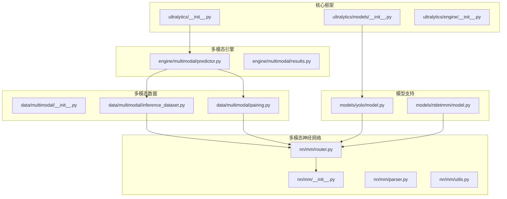
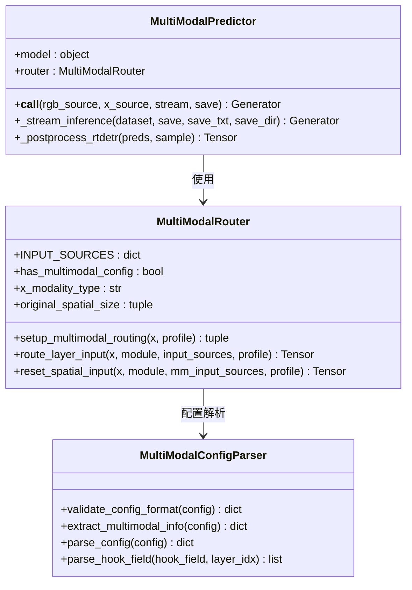
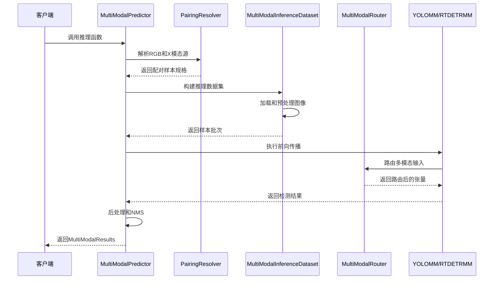
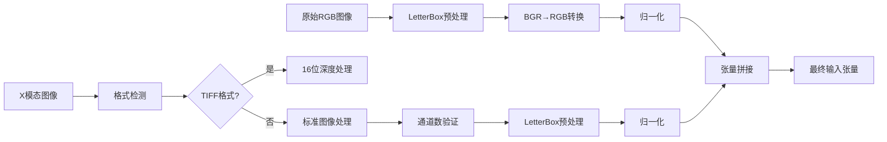
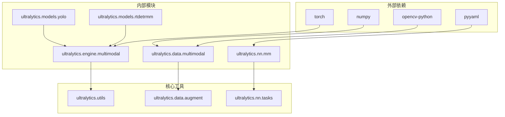

# UniRGB-IR融合框架

<cite>
**本文档引用的文件**
- [ultralytics/__init__.py](file://ultralytics/__init__.py)
- [ultralytics/models/__init__.py](file://ultralytics/models/__init__.py)
- [ultralytics/engine/multimodal/predictor.py](file://ultralytics/engine/multimodal/predictor.py)
- [ultralytics/engine/multimodal/results.py](file://ultralytics/engine/multimodal/results.py)
- [ultralytics/data/multimodal/__init__.py](file://ultralytics/data/multimodal/__init__.py)
- [ultralytics/data/multimodal/inference_dataset.py](file://ultralytics/data/multimodal/inference_dataset.py)
- [ultralytics/data/multimodal/pairing.py](file://ultralytics/data/multimodal/pairing.py)
- [ultralytics/nn/mm/__init__.py](file://ultralytics/nn/mm/__init__.py)
- [ultralytics/nn/mm/router.py](file://ultralytics/nn/mm/router.py)
- [ultralytics/nn/mm/parser.py](file://ultralytics/nn/mm/parser.py)
- [ultralytics/nn/mm/utils.py](file://ultralytics/nn/mm/utils.py)
- [ultralytics/models/yolo/model.py](file://ultralytics/models/yolo/model.py)
- [ultralytics/models/rtdetrmm/model.py](file://ultralytics/models/rtdetrmm/model.py)
</cite>

## 目录
1. [简介](#简介)
2. [项目结构](#项目结构)
3. [核心组件](#核心组件)
4. [架构概览](#架构概览)
5. [详细组件分析](#详细组件分析)
6. [依赖关系分析](#依赖关系分析)
7. [性能考虑](#性能考虑)
8. [故障排除指南](#故障排除指南)
9. [结论](#结论)

## 简介

UniRGB-IR融合框架是一个基于Ultralytics YOLO系列的多模态计算机视觉框架，专门设计用于RGB图像与红外(IR)热成像数据的融合分析。该框架支持YOLO和RT-DETR两种主流检测架构，通过智能的多模态路由器实现RGB与IR数据的无缝融合。

框架的核心特性包括：
- **零拷贝张量路由**：高效的内存管理机制
- **配置驱动的数据流**：灵活的模态路由策略
- **线程安全缓存机制**：优化的性能表现
- **X模态新输入起点重定向**：特殊的IR数据处理能力
- **通用的RGB+X多模态检测框架**：支持多种传感器模态

## 项目结构



**图表来源**
- [ultralytics/__init__.py:1-88](file://ultralytics/__init__.py#L1-L88)
- [ultralytics/models/__init__.py:1-30](file://ultralytics/models/__init__.py#L1-L30)
- [ultralytics/engine/multimodal/predictor.py:1-494](file://ultralytics/engine/multimodal/predictor.py#L1-L494)

**章节来源**
- [ultralytics/__init__.py:1-88](file://ultralytics/__init__.py#L1-L88)
- [ultralytics/models/__init__.py:1-30](file://ultralytics/models/__init__.py#L1-L30)

## 核心组件

### 多模态路由器 (MultiModalRouter)

MultiModalRouter是整个框架的核心组件，负责RGB与X模态数据的智能路由和融合。它支持三种输入模式：

- **RGB模式**：3通道可见光图像
- **X模式**：3通道统一的其他模态(深度/热成像/激光雷达等)
- **Dual模式**：6通道RGB+X拼接输入



**图表来源**
- [ultralytics/nn/mm/router.py:11-471](file://ultralytics/nn/mm/router.py#L11-L471)
- [ultralytics/nn/mm/parser.py:9-198](file://ultralytics/nn/mm/parser.py#L9-L198)
- [ultralytics/engine/multimodal/predictor.py:16-494](file://ultralytics/engine/multimodal/predictor.py#L16-L494)

### 多模态推理引擎

MultiModalPredictor提供了独立的推理引擎，完全不依赖基础预测器，支持真正的流式推理：

- **1样本→1结果**：不做中途变形
- **不解析YAML**：依赖路由器的前向行为
- **流式推理**：边迭代边yield
- **支持RTDETR和YOLO**：自动检测模型类型

**章节来源**
- [ultralytics/engine/multimodal/predictor.py:16-494](file://ultralytics/engine/multimodal/predictor.py#L16-L494)

## 架构概览



**图表来源**
- [ultralytics/engine/multimodal/predictor.py:99-244](file://ultralytics/engine/multimodal/predictor.py#L99-L244)
- [ultralytics/data/multimodal/pairing.py:37-125](file://ultralytics/data/multimodal/pairing.py#L37-L125)
- [ultralytics/data/multimodal/inference_dataset.py:94-183](file://ultralytics/data/multimodal/inference_dataset.py#L94-L183)

## 详细组件分析

### 模型初始化流程

```mermaid
flowchart TD
A[模型初始化] --> B{检查模型类型}
B --> |包含"-mm"| C[YOLOMM初始化]
B --> |RTDETRMM| D[RTDETRMM初始化]
B --> |标准YOLO| E[标准YOLO初始化]
C --> F[检测多模态层]
F --> G{检测到多模态层?}
G --> |是| H[配置输入通道数]
G --> |否| I[RGB-only模式]
H --> J[设置模态配置]
I --> J
J --> K[初始化MultiModalRouter]
K --> L[完成初始化]
D --> M[Fail-Fast内容判据]
M --> N[解析YAML结构]
N --> O[填充模态配置]
O --> K
```

**图表来源**
- [ultralytics/models/yolo/model.py:55-95](file://ultralytics/models/yolo/model.py#L55-L95)
- [ultralytics/models/rtdetrmm/model.py:28-47](file://ultralytics/models/rtdetrmm/model.py#L28-L47)

### 多模态路由机制

MultiModalRouter实现了智能的路由机制，支持以下特性：

1. **零拷贝张量视图路由**：避免不必要的内存复制
2. **配置驱动的数据流**：通过YAML配置实现灵活的路由策略
3. **X模态新输入起点重定向**：特殊处理IR数据的输入起点
4. **空间重置机制**：保持X模态的空间信息一致性

**章节来源**
- [ultralytics/nn/mm/router.py:157-240](file://ultralytics/nn/mm/router.py#L157-L240)
- [ultralytics/nn/mm/router.py:266-317](file://ultralytics/nn/mm/router.py#L266-L317)

### 数据预处理管道



**图表来源**
- [ultralytics/data/multimodal/inference_dataset.py:119-160](file://ultralytics/data/multimodal/inference_dataset.py#L119-L160)

**章节来源**
- [ultralytics/data/multimodal/inference_dataset.py:185-246](file://ultralytics/data/multimodal/inference_dataset.py#L185-L246)

## 依赖关系分析



**图表来源**
- [ultralytics/engine/multimodal/predictor.py:6-13](file://ultralytics/engine/multimodal/predictor.py#L6-L13)
- [ultralytics/data/multimodal/inference_dataset.py:6-13](file://ultralytics/data/multimodal/inference_dataset.py#L6-L13)

**章节来源**
- [ultralytics/nn/mm/__init__.py:29-78](file://ultralytics/nn/mm/__init__.py#L29-L78)

## 性能考虑

### 内存优化策略

1. **零拷贝张量路由**：MultiModalRouter使用张量视图而非数据复制
2. **线程安全缓存**：合理使用缓存机制避免重复计算
3. **流式推理**：支持真正的流式处理，减少内存占用

### 计算效率优化

1. **自动模型类型检测**：无需手动指定模型类型
2. **智能通道配置**：根据配置自动调整输入通道数
3. **批处理优化**：支持批量推理提高吞吐量

## 故障排除指南

### 常见问题及解决方案

1. **模型初始化失败**
   - 检查模型文件格式(YAML或PT)
   - 验证多模态配置的正确性
   - 确认输入通道数匹配

2. **推理结果异常**
   - 检查RGB和X模态图像的尺寸一致性
   - 验证多模态路由器配置
   - 确认后处理参数设置

3. **内存不足**
   - 减少批处理大小
   - 关闭不必要的可视化功能
   - 使用更小的输入尺寸

**章节来源**
- [ultralytics/nn/mm/utils.py:37-47](file://ultralytics/nn/mm/utils.py#L37-L47)
- [ultralytics/engine/multimodal/predictor.py:66-68](file://ultralytics/engine/multimodal/predictor.py#L66-L68)

## 结论

UniRGB-IR融合框架提供了一个强大而灵活的多模态计算机视觉解决方案。通过智能的多模态路由器和优化的推理引擎，该框架能够高效地处理RGB与IR热成像数据的融合分析，在保持高性能的同时提供了良好的可扩展性和易用性。

框架的主要优势包括：
- **模块化设计**：清晰的组件分离便于维护和扩展
- **性能优化**：零拷贝机制和流式处理提升效率
- **灵活性**：支持多种传感器模态和配置选项
- **易用性**：简洁的API和完善的错误处理

该框架为多模态计算机视觉应用提供了一个坚实的基础设施，特别适用于需要RGB与IR数据融合的工业检测、安防监控等场景。