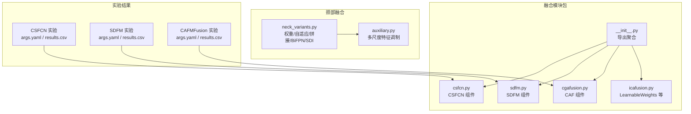
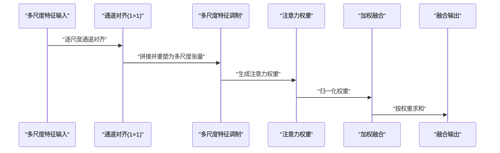
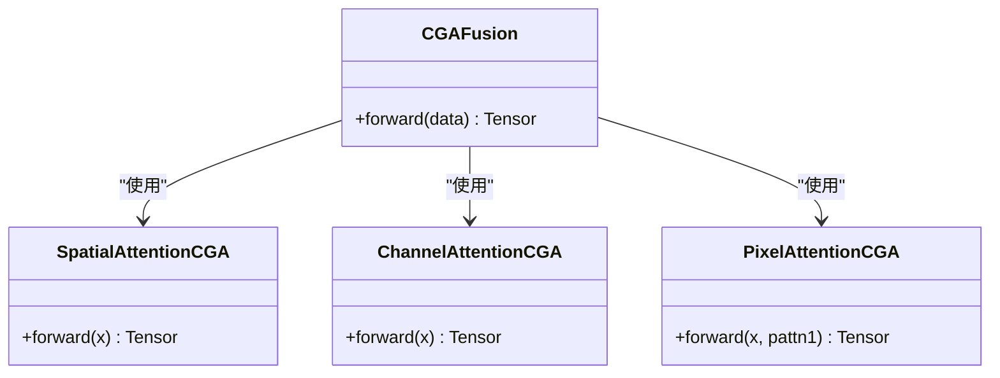
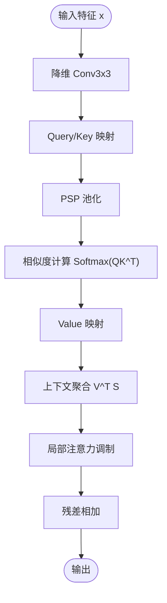
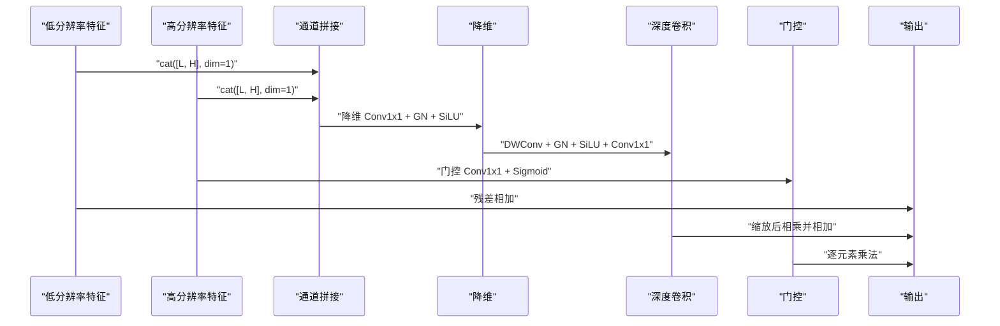
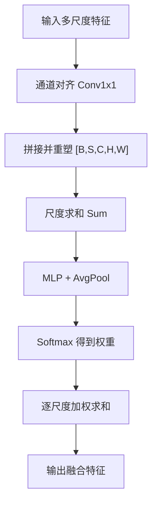
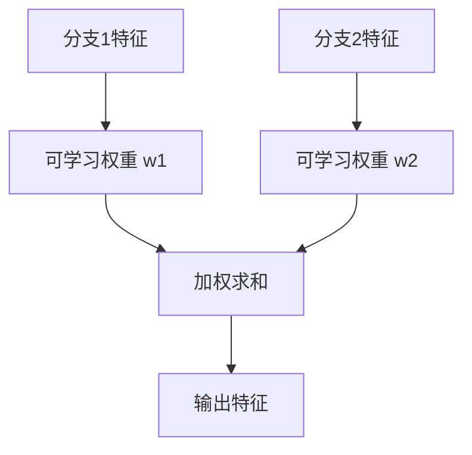
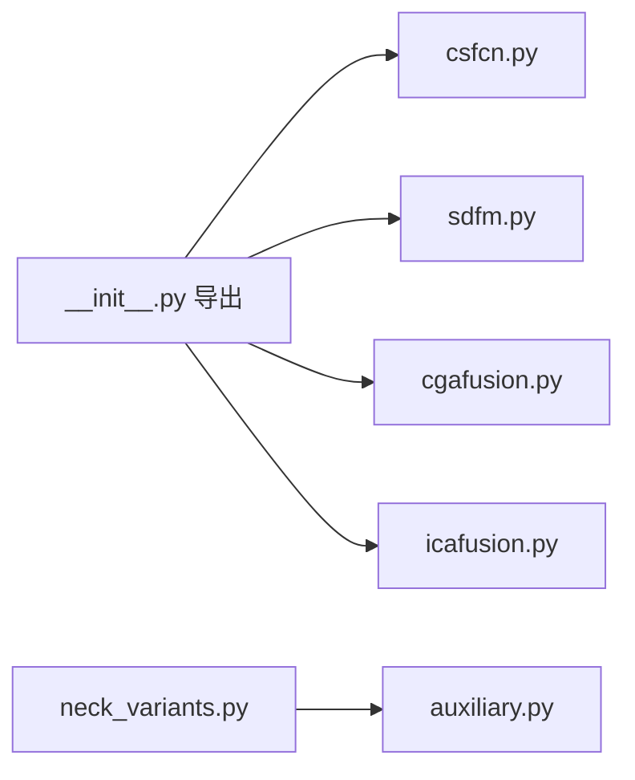

# 传统融合方法

<cite>
**本文引用的文件**
- [csfcn.py](file://ultralytics/nn/modules/fusion/csfcn.py)
- [sdfm.py](file://ultralytics/nn/modules/fusion/sdfm.py)
- [cgafusion.py](file://ultralytics/nn/modules/fusion/cgafusion.py)
- [auxiliary.py](file://ultralytics/nn/Neck/auxiliary.py)
- [neck_variants.py](file://ultralytics/nn/Neck/neck_variants.py)
- [__init__.py](file://ultralytics/nn/modules/fusion/__init__.py)
- [icafusion.py](file://ultralytics/nn/modules/fusion/icafusion.py)
- [args.yaml](file://ResTest/aifi-dattention-CSP-MutilScaleEdgeInformationEnhance-CSFCN/args.yaml)
- [results.csv](file://ResTest/aifi-dattention-CSP-MutilScaleEdgeInformationEnhance-CSFCN/results.csv)
- [args.yaml](file://ResTest/aifi-dattention-CSP-MutilScaleEdgeInformationEnhance-SDFM/args.yaml)
- [results.csv](file://ResTest/aifi-dattention-CSP-MutilScaleEdgeInformationEnhance-SDFM/results.csv)
- [args.yaml](file://ResTest/aifi-dattention-CSP-MutilScaleEdgeInformationEnhance-CAFMFusion/args.yaml)
- [results.csv](file://ResTest/aifi-dattention-CSP-MutilScaleEdgeInformationEnhance-CAFMFusion/results.csv)
</cite>

## 目录
1. [引言](#引言)
2. [项目结构](#项目结构)
3. [核心组件](#核心组件)
4. [架构总览](#架构总览)
5. [详细组件分析](#详细组件分析)
6. [依赖分析](#依赖分析)
7. [性能考虑](#性能考虑)
8. [故障排除指南](#故障排除指南)
9. [结论](#结论)
10. [附录](#附录)

## 引言
本技术文档聚焦于传统特征融合方法，系统梳理并解析以下经典与代表性融合模块的原理、实现与工程化要点：
- 经典融合策略：加权求和、最大值融合、平均值融合
- 注意力引导融合：通道注意力融合（CAF）、交叉尺度特征融合（CSFCN）
- 空间深度特征融合（SDFM）：稳定数值实现与混合精度鲁棒性
- 其他传统融合：可学习权重融合（LearnableWeights）

文档提供数学公式、代码实现路径、流程图与序列图，并给出融合权重计算、通道选择与融合策略优化的实践建议。

## 项目结构
本仓库围绕多模态目标检测与融合展开，传统融合方法主要分布在以下位置：
- 融合模块包：ultralytics/nn/modules/fusion/
- 颈部融合变体：ultralytics/nn/Neck/neck_variants.py、ultralytics/nn/Neck/auxiliary.py
- 实验配置与结果：ResTest/.../args.yaml、results.csv

**图表来源**
- [__init__.py:1-58](file://ultralytics/nn/modules/fusion/__init__.py#L1-L58)
- [csfcn.py:1-111](file://ultralytics/nn/modules/fusion/csfcn.py#L1-L111)
- [sdfm.py:1-83](file://ultralytics/nn/modules/fusion/sdfm.py#L1-L83)
- [cgafusion.py:1-64](file://ultralytics/nn/modules/fusion/cgafusion.py#L1-L64)
- [icafusion.py:97-137](file://ultralytics/nn/modules/fusion/icafusion.py#L97-L137)
- [neck_variants.py:161-240](file://ultralytics/nn/Neck/neck_variants.py#L161-L240)
- [auxiliary.py:160-187](file://ultralytics/nn/Neck/auxiliary.py#L160-L187)

**章节来源**
- [__init__.py:1-58](file://ultralytics/nn/modules/fusion/__init__.py#L1-L58)
- [neck_variants.py:161-240](file://ultralytics/nn/Neck/neck_variants.py#L161-L240)
- [auxiliary.py:160-187](file://ultralytics/nn/Neck/auxiliary.py#L160-L187)

## 核心组件
本节概述传统融合方法的关键实现与职责：
- 加权求和/自适应融合：在颈部融合中以参数化权重或softmax归一化实现
- 多尺度特征调制：通过通道对齐与注意力权重实现跨尺度融合
- 注意力引导融合：基于空间/通道/像素注意力的加权融合
- 稳定融合：SDFM 的数值稳定实现与混合精度支持
- 可学习权重：为双分支特征提供可学习的线性融合

**章节来源**
- [neck_variants.py:161-189](file://ultralytics/nn/Neck/neck_variants.py#L161-L189)
- [auxiliary.py:160-187](file://ultralytics/nn/Neck/auxiliary.py#L160-L187)
- [cgafusion.py:46-63](file://ultralytics/nn/modules/fusion/cgafusion.py#L46-L63)
- [sdfm.py:55-83](file://ultralytics/nn/modules/fusion/sdfm.py#L55-L83)
- [icafusion.py:97-137](file://ultralytics/nn/modules/fusion/icafusion.py#L97-L137)

## 架构总览
下图展示传统融合方法在多模态检测中的典型交互：输入多尺度特征经通道对齐后，通过注意力或权重机制进行融合，再进入后续检测头。

**图表来源**
- [auxiliary.py:166-186](file://ultralytics/nn/Neck/auxiliary.py#L166-L186)

## 详细组件分析

### 经典融合策略：加权求和、最大值融合、平均值融合
- 加权求和（Weight Fusion）
  - 原理：对多个输入特征施以可学习或预设权重并求和
  - 实现：在颈部融合中通过参数化权重或softmax归一化实现
  - 数学表达：$ y = \sum_i w_i \cdot x_i $，其中 $ \sum_i w_i = 1 $
  - 工程要点：注意通道对齐与维度一致性；可加入ReLU/LayerNorm稳定训练
- 最大值融合（Max Fusion）
  - 原理：沿通道维取各尺度特征的最大响应
  - 实现：torch.max 或逐通道比较
  - 数学表达：$ y_c = \max_{i} (x_i)_c $
  - 工程要点：适合强调显著特征，但可能丢失细粒度信息
- 平均值融合（Mean Fusion）
  - 原理：对多尺度特征沿通道维取均值
  - 实现：torch.mean
  - 数学表达：$ y_c = \frac{1}{N}\sum_i (x_i)_c $
  - 工程要点：平滑噪声，但可能稀释强信号

**章节来源**
- [neck_variants.py:172-189](file://ultralytics/nn/Neck/neck_variants.py#L172-L189)

### 通道注意力融合（CAF）
CAF 通过空间注意力、通道注意力与像素注意力联合指导两输入特征的加权融合，形成“注意力引导”的稳定融合路径。

- 组件构成
  - 空间注意力模块：基于通道拼接的7×7卷积
  - 通道注意力模块：全局平均池化+MLP
  - 像素注意力模块：结合初始特征与空间/通道注意力的7×7分组卷积
  - 输出：经1×1卷积映射回原通道数
- 数学公式
  - 初始和：$ z = x + y $
  - 空间注意力：$ a_s = \text{Conv}_{7\times7}([z_{\text{mean}}; z_{\text{max}}]) $
  - 通道注意力：$ a_c = \text{Conv}_{1\times1}(\text{ReLU}(\text{Conv}_{1\times1}(z))) $
  - 像素注意力：$ a_p = \sigma(\text{Conv}_{7\times7}^{(g)}([z; a_s + a_c])) $
  - 融合输出：$ y = z + a_p \cdot x + (1 - a_p) \cdot y $

**图表来源**
- [cgafusion.py:46-63](file://ultralytics/nn/modules/fusion/cgafusion.py#L46-L63)
- [cgafusion.py:6-44](file://ultralytics/nn/modules/fusion/cgafusion.py#L6-L44)

**章节来源**
- [cgafusion.py:46-63](file://ultralytics/nn/modules/fusion/cgafusion.py#L46-L63)

### 交叉尺度特征融合（CSFCN）
CSFCN 通过金字塔池化（PSP）与相似度映射（Similarity Map）实现跨尺度上下文建模，并结合局部注意力进行精细调制。

- 组件构成
  - PSPModule：按不同网格大小自适应池化并拼接
  - CFC_CRB：降维、查询/键/值映射、PSP增强、相似度计算与上下文聚合
  - SFC_G2：双尺度特征偏移采样与加权融合
- 数学公式（CFC_CRB）
  - 降维：$ f = \text{Conv}_{3\times3}(x) $
  - 查询/键/值：$ Q = \text{Conv}_{1\times1}(f) $，$ K = \text{Conv}_{1\times1}(\text{PSP}(f)) $，$ V = \text{Conv}_{1\times1}(\text{PSP}(f)) $
  - 相似度图：$ S = \text{Softmax}(Q^T K) $
  - 上下文：$ C = V S^T $
  - 局部注意力调制：$ y = x + \text{LocalAtten}(C) $

**图表来源**
- [csfcn.py:40-63](file://ultralytics/nn/modules/fusion/csfcn.py#L40-L63)

**章节来源**
- [csfcn.py:8-22](file://ultralytics/nn/modules/fusion/csfcn.py#L8-L22)
- [csfcn.py:25-38](file://ultralytics/nn/modules/fusion/csfcn.py#L25-L38)
- [csfcn.py:40-63](file://ultralytics/nn/modules/fusion/csfcn.py#L40-L63)
- [csfcn.py:66-111](file://ultralytics/nn/modules/fusion/csfcn.py#L66-L111)

### 空间深度特征融合（SDFM）
SDFM 提供稳定的双输入融合路径，强调数值稳定性与混合精度训练鲁棒性。

- 核心思想
  - 输入双尺度特征（通常为相同分辨率），先通道拼接，经降维与深度卷积，再通过门控机制融合
  - 使用 SiLU/GN/GroupConv 等稳定算子，避免混合精度下的数值问题
- 数学公式
  - 拼接与降维：$ u = \text{Reduce}([x_{\text{low}}, x_{\text{high}}]) $
  - 深度卷积：$ v = \text{DWConv}(u) $
  - 门控：$ g = \sigma(x_{\text{high}} - x_{\text{low}}) $
  - 融合：$ y = x_{\text{low}} + s \cdot v \odot g $，其中 $ s $ 为缩放因子
- 数值稳定性
  - 在 autocast 外执行关键算子，防止混合精度导致的不稳定
  - nan_to_num 处理异常值

**图表来源**
- [sdfm.py:55-83](file://ultralytics/nn/modules/fusion/sdfm.py#L55-L83)

**章节来源**
- [sdfm.py:13-46](file://ultralytics/nn/modules/fusion/sdfm.py#L13-L46)
- [sdfm.py:55-83](file://ultralytics/nn/modules/fusion/sdfm.py#L55-L83)

### 多尺度特征调制（Auxiliary Neck）
该模块通过通道对齐与注意力权重实现多尺度特征的动态融合。

- 步骤
  - 通道对齐：逐尺度用1×1卷积对齐通道数
  - 拼接与重塑：将多尺度特征拼接并重塑为[B, S, C, H, W]
  - 生成注意力：对每个尺度求和后经MLP与softmax得到权重
  - 加权融合：按注意力权重对尺度张量求和
- 数学公式
  - 对齐：$ x_i' = \text{Conv}_{1\times1}(x_i) $
  - 聚合：$ Z = \sum_{i=1}^S x_i' $
  - 权重：$ w_i = \text{Softmax}(\text{MLP}(\text{AvgPool}(Z))) $
  - 输出：$ y = \sum_{i=1}^S w_i \cdot x_i' $

**图表来源**
- [auxiliary.py:166-186](file://ultralytics/nn/Neck/auxiliary.py#L166-L186)

**章节来源**
- [auxiliary.py:160-187](file://ultralytics/nn/Neck/auxiliary.py#L160-L187)

### 可学习权重融合（LearnableWeights）
为双分支特征提供可学习的线性加权融合，体现自适应融合思想。

- 数学公式
  - $ y = w_1 \cdot x_1 + w_2 \cdot x_2 $，其中 $ w_1, w_2 $ 为可学习标量参数
- 工程要点
  - 参数初始化为0.5，通过反向传播自适应调整
  - 适用于任意同形状特征的快速融合

**图表来源**
- [icafusion.py:131-137](file://ultralytics/nn/modules/fusion/icafusion.py#L131-L137)

**章节来源**
- [icafusion.py:97-137](file://ultralytics/nn/modules/fusion/icafusion.py#L97-L137)

## 依赖分析
- 导出聚合：融合模块通过 fusion/__init__.py 统一导出，便于上层模型引用
- 组件耦合：CSFCN 与 SDFM 独立实现，CAF 作为注意力引导模块可复用；多尺度调制模块与颈部融合策略解耦
- 外部依赖：torch、torch.nn.functional、einops（用于像素注意力的重排）

**图表来源**
- [__init__.py:19-36](file://ultralytics/nn/modules/fusion/__init__.py#L19-L36)
- [neck_variants.py:161-189](file://ultralytics/nn/Neck/neck_variants.py#L161-L189)
- [auxiliary.py:160-187](file://ultralytics/nn/Neck/auxiliary.py#L160-L187)

**章节来源**
- [__init__.py:19-36](file://ultralytics/nn/modules/fusion/__init__.py#L19-L36)
- [neck_variants.py:161-189](file://ultralytics/nn/Neck/neck_variants.py#L161-L189)
- [auxiliary.py:160-187](file://ultralytics/nn/Neck/auxiliary.py#L160-L187)

## 性能考虑
- 计算复杂度
  - 加权求和/自适应融合：O(N×C×H×W)，N为尺度数，C为通道数
  - CAF：引入额外卷积与注意力计算，但通道数通常较小，整体开销可控
  - CSFCN：PSP与相似度矩阵乘法带来额外计算，适合多尺度场景
  - SDFM：深度卷积与门控操作成本适中，数值稳定处理略有额外开销
- 内存占用
  - 多尺度拼接与中间特征存储是主要内存消耗点，可通过通道对齐与合理的中间张量尺寸控制
- 训练稳定性
  - SDFM 的 autocast 外部计算与 nan_to_num 处理显著提升混合精度训练鲁棒性
  - CAF 的残差连接与门控有助于梯度稳定传播

[本节为通用性能讨论，不直接分析具体文件]

## 故障排除指南
- 形状不匹配
  - 症状：通道对齐或拼接时报错
  - 排查：确认各尺度通道数是否一致，必要时使用1×1卷积对齐
  - 参考：多尺度特征调制的通道对齐逻辑
- 尺寸不整除
  - 症状：SDFM 报告 H/W 不整除 patch
  - 排查：确保输入特征尺寸满足 patch 整除条件，或调整网络下采样策略
- 混合精度异常
  - 症状：NaN/Inf 导致训练不稳定
  - 处理：使用 SDFM 的 autocast 外部计算与 nan_to_num 保护
- 权重初始化不当
  - 症状：融合权重收敛缓慢或偏向某一分支
  - 处理：检查可学习权重初始化与学习率设置；对自适应融合采用合适的正则化

**章节来源**
- [auxiliary.py:160-187](file://ultralytics/nn/Neck/auxiliary.py#L160-L187)
- [sdfm.py:55-83](file://ultralytics/nn/modules/fusion/sdfm.py#L55-L83)
- [icafusion.py:131-137](file://ultralytics/nn/modules/fusion/icafusion.py#L131-L137)

## 结论
传统融合方法在多模态与多尺度检测中具有广泛适用性。本文梳理了加权求和、注意力引导、多尺度调制与稳定融合等关键技术，并提供了实现路径与工程化建议。实践中应结合任务特性选择融合策略：强调稳定性与数值鲁棒性时优先 SDFM；追求跨尺度上下文建模时可选 CSFCN；需要轻量注意力引导时可选 CAF；对双分支特征快速融合时可用 LearnableWeights。

[本节为总结性内容，不直接分析具体文件]

## 附录
- 实验配置与结果定位
  - CSFCN 实验：ResTest/aifi-dattention-CSP-MutilScaleEdgeInformationEnhance-CSFCN/args.yaml、results.csv
  - SDFM 实验：ResTest/aifi-dattention-CSP-MutilScaleEdgeInformationEnhance-SDFM/args.yaml、results.csv
  - CAFMFusion 实验：ResTest/aifi-dattention-CSP-MutilScaleEdgeInformationEnhance-CAFMFusion/args.yaml、results.csv

**章节来源**
- [args.yaml](file://ResTest/aifi-dattention-CSP-MutilScaleEdgeInformationEnhance-CSFCN/args.yaml)
- [results.csv](file://ResTest/aifi-dattention-CSP-MutilScaleEdgeInformationEnhance-CSFCN/results.csv)
- [args.yaml](file://ResTest/aifi-dattention-CSP-MutilScaleEdgeInformationEnhance-SDFM/args.yaml)
- [results.csv](file://ResTest/aifi-dattention-CSP-MutilScaleEdgeInformationEnhance-SDFM/results.csv)
- [args.yaml](file://ResTest/aifi-dattention-CSP-MutilScaleEdgeInformationEnhance-CAFMFusion/args.yaml)
- [results.csv](file://ResTest/aifi-dattention-CSP-MutilScaleEdgeInformationEnhance-CAFMFusion/results.csv)