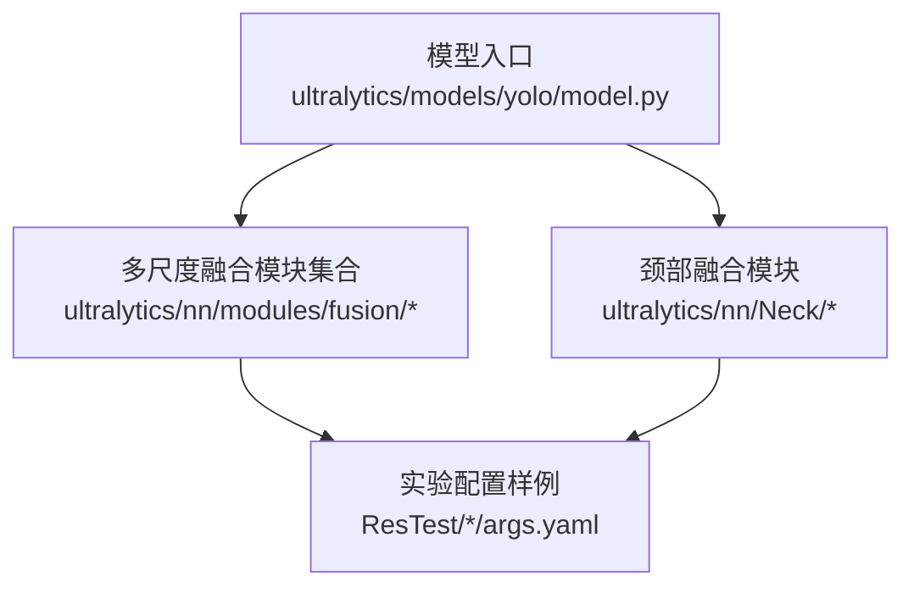
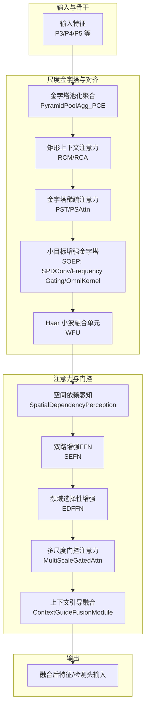
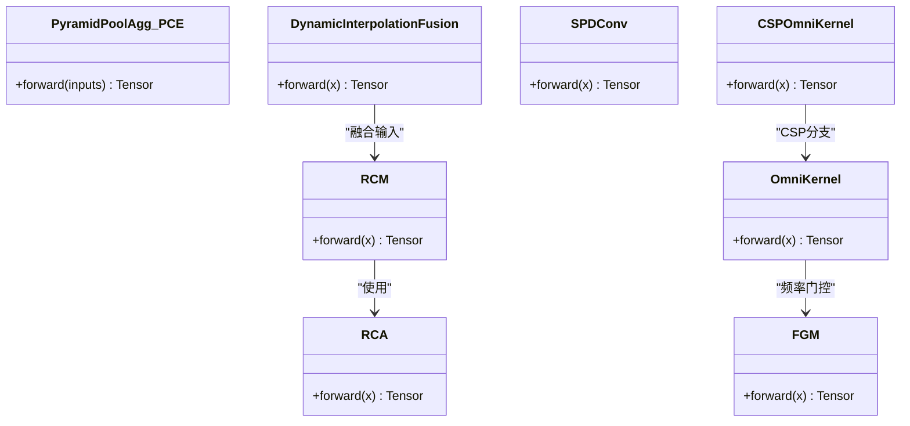
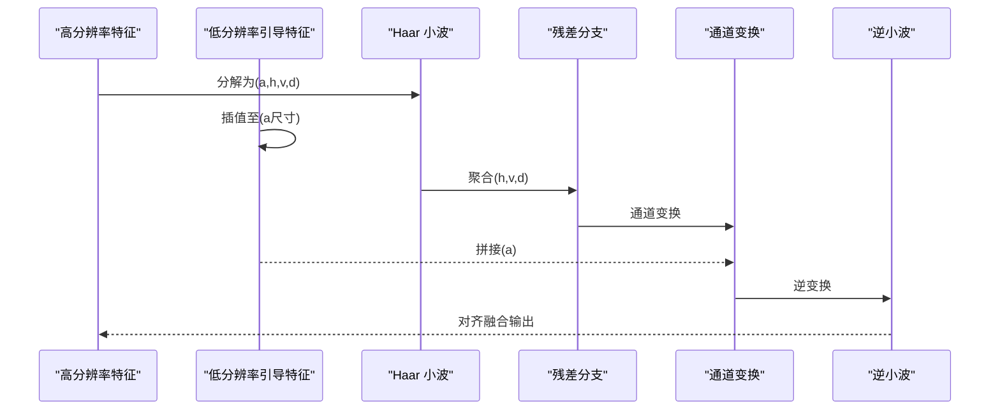
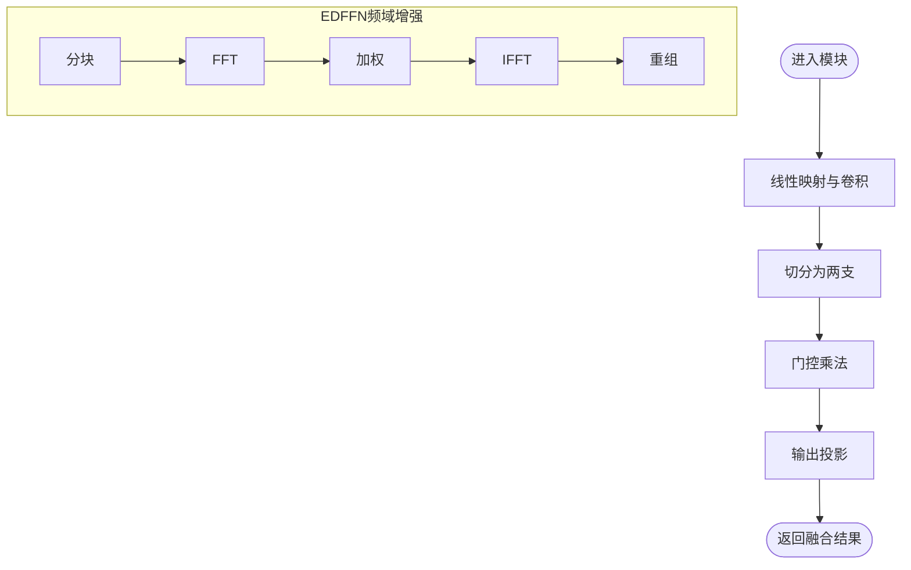
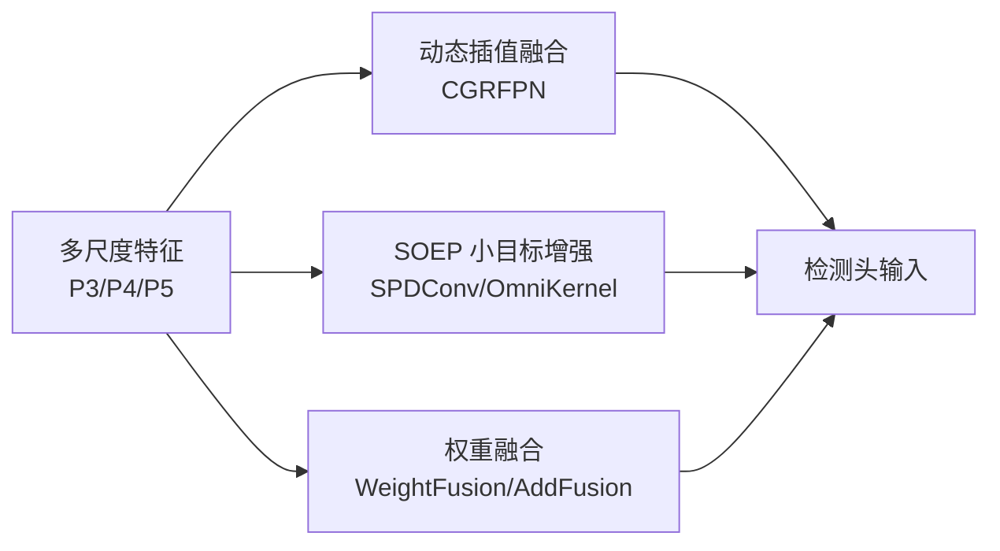
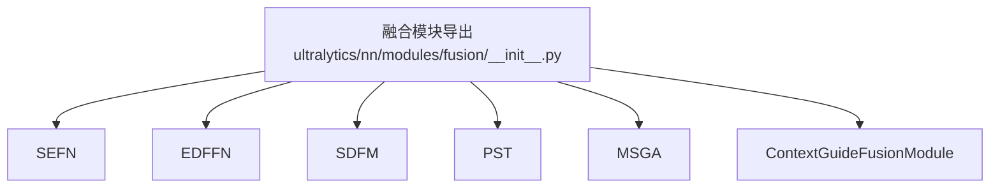

# 多尺度特征融合

<cite>
**本文引用的文件**
- [ultralytics/models/yolo/model.py](file://ultralytics/models/yolo/model.py)
- [ultralytics/nn/Neck/soep.py](file://ultralytics/nn/Neck/soep.py)
- [ultralytics/nn/Neck/wfu.py](file://ultralytics/nn/Neck/wfu.py)
- [ultralytics/nn/Neck/cgrfpn.py](file://ultralytics/nn/Neck/cgrfpn.py)
- [ultralytics/nn/Neck/contextguide.py](file://ultralytics/nn/Neck/contextguide.py)
- [ultralytics/nn/modules/fusion/__init__.py](file://ultralytics/nn/modules/fusion/__init__.py)
- [ultralytics/nn/modules/fusion/sefn.py](file://ultralytics/nn/modules/fusion/sefn.py)
- [ultralytics/nn/modules/fusion/edffn.py](file://ultralytics/nn/modules/fusion/edffn.py)
- [ultralytics/nn/modules/fusion/sdfm.py](file://ultralytics/nn/modules/fusion/sdfm.py)
- [ultralytics/nn/modules/fusion/pst.py](file://ultralytics/nn/modules/fusion/pst.py)
- [ultralytics/nn/modules/fusion/msga.py](file://ultralytics/nn/modules/fusion/msga.py)
- [ResTest/aifi-dattention-CSP-MutilScaleEdgeInformationEnhance-ASF-P2-lite-WeightFusion/args.yaml](file://ResTest/aifi-dattention-CSP-MutilScaleEdgeInformationEnhance-ASF-P2-lite-WeightFusion/args.yaml)
- [ResTest/aifi-dattention-CSP-MutilScaleEdgeInformationEnhance-ASF-P2-lite-AddFusion/args.yaml](file://ResTest/aifi-dattention-CSP-MutilScaleEdgeInformationEnhance-ASF-P2-lite-AddFusion/args.yaml)
- [ResTest/aifi-dattention-CSP-MutilScaleEdgeInformationEnhance-ASF-P2-lite-BackboneFreqFusion/args.yaml](file://ResTest/aifi-dattention-CSP-MutilScaleEdgeInformationEnhance-ASF-P2-lite-BackboneFreqFusion/args.yaml)
</cite>

## 目录
1. [引言](#引言)
2. [项目结构](#项目结构)
3. [核心组件](#核心组件)
4. [架构总览](#架构总览)
5. [详细组件分析](#详细组件分析)
6. [依赖分析](#依赖分析)
7. [性能考虑](#性能考虑)
8. [故障排查指南](#故障排查指南)
9. [结论](#结论)
10. [附录](#附录)

## 引言
本技术文档围绕“多尺度特征融合”主题，系统梳理并阐释仓库中实现的多种融合策略与模块，包括但不限于：
- 特征金字塔融合与尺度感知融合
- 跨尺度特征对齐与尺度不变性处理
- 辅助检测头融合、SOEP融合、权重特征融合等专用融合策略
- 多尺度信息互补与融合效果评估方法

通过对核心模块与训练配置的解析，帮助读者快速理解从骨干到颈部再到融合模块的完整流水线，并掌握如何在实际任务中选择与组合合适的融合策略。

## 项目结构
该仓库以 Ultralytics 框架为基础，围绕多模态与多尺度特征融合展开，主要涉及以下目录与文件：
- 模型入口与任务映射：ultralytics/models/yolo/model.py
- 颈部融合模块：ultralytics/nn/Neck/*.py
- 融合模块集合：ultralytics/nn/modules/fusion/*.py
- 实验配置样例：ResTest/*/args.yaml

**图示来源**
- [ultralytics/models/yolo/model.py:1-135](file://ultralytics/models/yolo/model.py#L1-L135)
- [ultralytics/nn/modules/fusion/__init__.py:1-58](file://ultralytics/nn/modules/fusion/__init__.py#L1-L58)
- [ultralytics/nn/Neck/soep.py:1-196](file://ultralytics/nn/Neck/soep.py#L1-L196)

**章节来源**
- [ultralytics/models/yolo/model.py:1-135](file://ultralytics/models/yolo/model.py#L1-L135)
- [ultralytics/nn/modules/fusion/__init__.py:1-58](file://ultralytics/nn/modules/fusion/__init__.py#L1-L58)

## 核心组件
本节聚焦于支撑多尺度特征融合的关键模块与接口，涵盖：
- 多尺度金字塔与尺度感知：SOEP、PST、CGRFPN
- 跨尺度对齐与融合：WFU、SDFM、ContextGuide
- 频域/空域注意力与门控：EDFFN、SEFN、MSGA
- 多模态与多尺度融合的统一导出接口：fusion/__init__.py

这些组件共同构成“特征提取 → 尺度对齐 → 注意力/门控 → 融合输出”的闭环。

**章节来源**
- [ultralytics/nn/Neck/soep.py:1-196](file://ultralytics/nn/Neck/soep.py#L1-L196)
- [ultralytics/nn/Neck/wfu.py:1-86](file://ultralytics/nn/Neck/wfu.py#L1-L86)
- [ultralytics/nn/Neck/cgrfpn.py:1-189](file://ultralytics/nn/Neck/cgrfpn.py#L1-L189)
- [ultralytics/nn/Neck/contextguide.py:1-48](file://ultralytics/nn/Neck/contextguide.py#L1-L48)
- [ultralytics/nn/modules/fusion/sefn.py:1-79](file://ultralytics/nn/modules/fusion/sefn.py#L1-L79)
- [ultralytics/nn/modules/fusion/edffn.py:1-63](file://ultralytics/nn/modules/fusion/edffn.py#L1-L63)
- [ultralytics/nn/modules/fusion/sdfm.py:1-83](file://ultralytics/nn/modules/fusion/sdfm.py#L1-L83)
- [ultralytics/nn/modules/fusion/pst.py:1-171](file://ultralytics/nn/modules/fusion/pst.py#L1-L171)
- [ultralytics/nn/modules/fusion/msga.py:1-95](file://ultralytics/nn/modules/fusion/msga.py#L1-L95)
- [ultralytics/nn/modules/fusion/__init__.py:1-58](file://ultralytics/nn/modules/fusion/__init__.py#L1-L58)

## 架构总览
下图展示了多尺度特征融合的典型架构：自下而上依次为骨干特征提取、尺度金字塔/对齐、注意力/门控与融合，最终输出融合后的多尺度特征或检测头输入。

**图示来源**
- [ultralytics/nn/Neck/cgrfpn.py:27-189](file://ultralytics/nn/Neck/cgrfpn.py#L27-L189)
- [ultralytics/nn/Neck/soep.py:13-196](file://ultralytics/nn/Neck/soep.py#L13-L196)
- [ultralytics/nn/Neck/wfu.py:45-86](file://ultralytics/nn/Neck/wfu.py#L45-L86)
- [ultralytics/nn/modules/fusion/sdfm.py:6-83](file://ultralytics/nn/modules/fusion/sdfm.py#L6-L83)
- [ultralytics/nn/modules/fusion/sefn.py:9-79](file://ultralytics/nn/modules/fusion/sefn.py#L9-L79)
- [ultralytics/nn/modules/fusion/edffn.py:9-63](file://ultralytics/nn/modules/fusion/edffn.py#L9-L63)
- [ultralytics/nn/modules/fusion/msga.py:57-95](file://ultralytics/nn/modules/fusion/msga.py#L57-L95)
- [ultralytics/nn/Neck/contextguide.py:29-48](file://ultralytics/nn/Neck/contextguide.py#L29-L48)

## 详细组件分析

### 特征金字塔与尺度感知融合
- CGRFPN（金字塔上下文提取与动态插值融合）：通过金字塔池化聚合多尺度上下文，结合矩形上下文注意力（RCA/RCM）与动态插值融合（DynamicInterpolationFusion），实现跨尺度信息互补与分辨率匹配。
- SOEP（小目标增强金字塔）：采用空间到深度卷积（SPDConv）压缩空间信息、频率门控（FGM）与全核（OmniKernel）多尺度卷积，提升小目标与边缘信息的表达能力；CSP-OmniKernel 在保持效率的同时引入通道分割比例控制。

**图示来源**
- [ultralytics/nn/Neck/cgrfpn.py:27-189](file://ultralytics/nn/Neck/cgrfpn.py#L27-L189)
- [ultralytics/nn/Neck/soep.py:13-196](file://ultralytics/nn/Neck/soep.py#L13-L196)

**章节来源**
- [ultralytics/nn/Neck/cgrfpn.py:27-189](file://ultralytics/nn/Neck/cgrfpn.py#L27-L189)
- [ultralytics/nn/Neck/soep.py:13-196](file://ultralytics/nn/Neck/soep.py#L13-L196)

### 跨尺度特征对齐与融合
- WFU（Haar 小波融合单元）：利用 Haar 小波变换将高分辨率特征分解为近似与细节分量，结合低分辨率引导特征进行通道变换与逆变换，实现跨尺度对齐与细节注入。
- SDFM（空间依赖感知）：在等分辨率前提下，通过分块门控融合与数值稳定策略，强调空间依赖与跨模态互补信息。
- ContextGuide（上下文引导融合）：基于 SE 注意力对双向特征进行加权融合，实现跨模态/跨层信息的显式交互。

**图示来源**
- [ultralytics/nn/Neck/wfu.py:45-86](file://ultralytics/nn/Neck/wfu.py#L45-L86)

**章节来源**
- [ultralytics/nn/Neck/wfu.py:45-86](file://ultralytics/nn/Neck/wfu.py#L45-L86)
- [ultralytics/nn/modules/fusion/sdfm.py:6-83](file://ultralytics/nn/modules/fusion/sdfm.py#L6-L83)
- [ultralytics/nn/Neck/contextguide.py:29-48](file://ultralytics/nn/Neck/contextguide.py#L29-L48)

### 频域/空域注意力与门控
- EDFFN（频域选择性增强）：在单路融合特征上进行分块 FFT，通过可学习权重抑制冗余并突出判别性纹理/结构。
- SEFN（双路增强前馈网络）：以辅路空间上下文引导主路门控，实现跨模态/跨层信息显式注入。
- MSGA（多尺度门控注意力）：对局部与全局上下文分别提取并融合，通过选择性门控实现尺度间的信息交互与加权。

**图示来源**
- [ultralytics/nn/modules/fusion/edffn.py:9-63](file://ultralytics/nn/modules/fusion/edffn.py#L9-L63)
- [ultralytics/nn/modules/fusion/sefn.py:9-79](file://ultralytics/nn/modules/fusion/sefn.py#L9-L79)
- [ultralytics/nn/modules/fusion/msga.py:57-95](file://ultralytics/nn/modules/fusion/msga.py#L57-L95)

**章节来源**
- [ultralytics/nn/modules/fusion/edffn.py:9-63](file://ultralytics/nn/modules/fusion/edffn.py#L9-L63)
- [ultralytics/nn/modules/fusion/sefn.py:9-79](file://ultralytics/nn/modules/fusion/sefn.py#L9-L79)
- [ultralytics/nn/modules/fusion/msga.py:57-95](file://ultralytics/nn/modules/fusion/msga.py#L57-L95)

### 辅助检测头融合、SOEP融合与权重特征融合
- 辅助检测头融合：通过颈部模块（如 CGRFPN 的动态插值融合）将多尺度特征对齐后送入检测头，实现多尺度监督与互补。
- SOEP 融合：在金字塔层级内利用 SPDConv 与 OmniKernel 提升小目标与边缘信息表达，配合 CSP 结构降低计算开销。
- 权重特征融合：通过可学习权重对多路特征进行加权融合（如 WeightFusion、AddFusion 等），在训练配置中体现为不同的融合策略与损失权重。

**图示来源**
- [ultralytics/nn/Neck/cgrfpn.py:181-189](file://ultralytics/nn/Neck/cgrfpn.py#L181-L189)
- [ultralytics/nn/Neck/soep.py:13-196](file://ultralytics/nn/Neck/soep.py#L13-L196)
- [ultralytics/nn/Neck/wfu.py:45-86](file://ultralytics/nn/Neck/wfu.py#L45-L86)

**章节来源**
- [ultralytics/nn/Neck/cgrfpn.py:181-189](file://ultralytics/nn/Neck/cgrfpn.py#L181-L189)
- [ultralytics/nn/Neck/soep.py:13-196](file://ultralytics/nn/Neck/soep.py#L13-L196)
- [ultralytics/nn/Neck/wfu.py:45-86](file://ultralytics/nn/Neck/wfu.py#L45-L86)

### 尺度不变性处理、特征分辨率匹配与多尺度信息互补
- 尺度不变性：通过 OmniKernel 的多核卷积与频率门控，以及 EDFFN 的分块频域增强，提升对尺度变化的鲁棒性。
- 分辨率匹配：使用动态插值融合（CGRFPN）、小波融合（WFU）与金字塔注意力（PST）实现跨分辨率特征的对齐与互补。
- 信息互补：结合上下文引导（ContextGuide）、空间依赖感知（SDFM）与多尺度门控（MSGA），在局部与全局尺度上实现互补与选择性增强。

**章节来源**
- [ultralytics/nn/Neck/soep.py:88-196](file://ultralytics/nn/Neck/soep.py#L88-L196)
- [ultralytics/nn/modules/fusion/edffn.py:9-63](file://ultralytics/nn/modules/fusion/edffn.py#L9-L63)
- [ultralytics/nn/Neck/cgrfpn.py:181-189](file://ultralytics/nn/Neck/cgrfpn.py#L181-L189)
- [ultralytics/nn/Neck/wfu.py:45-86](file://ultralytics/nn/Neck/wfu.py#L45-L86)
- [ultralytics/nn/Neck/contextguide.py:29-48](file://ultralytics/nn/Neck/contextguide.py#L29-L48)
- [ultralytics/nn/modules/fusion/msga.py:57-95](file://ultralytics/nn/modules/fusion/msga.py#L57-L95)

## 依赖分析
融合模块通过统一导出接口集中管理，便于在 YAML 配置中灵活组合与调用。

**图示来源**
- [ultralytics/nn/modules/fusion/__init__.py:1-58](file://ultralytics/nn/modules/fusion/__init__.py#L1-L58)

**章节来源**
- [ultralytics/nn/modules/fusion/__init__.py:1-58](file://ultralytics/nn/modules/fusion/__init__.py#L1-L58)

## 性能考虑
- 计算复杂度控制：CSP-OmniKernel 通过通道分割比例（e）降低计算量；RCM/RCM 中的 MLP 使用 1×1 卷积以减少参数。
- 数值稳定性：SDFM 在混合精度下使用 autocast 并进行 NaN/Inf 处理；EDFFN 分块 FFT 保证频域操作稳定。
- 内存与吞吐：动态插值融合避免额外上采样/下采样堆叠；PST 的稀疏注意力仅在推理阶段进行细粒度注意力，训练阶段保持高效。

[本节为通用指导，无需具体文件分析]

## 故障排查指南
- 形状不匹配：确保输入特征在融合前已对齐（分辨率一致）。若存在分辨率差异，优先使用动态插值或小波对齐。
- 训练不稳定：AMP 混合精度下建议启用 SDFM 的 autocast 保护；必要时检查频域模块的输入尺寸是否满足分块整除要求。
- 参数不一致：确认融合模块的通道数与 YAML 配置一致；若通道不等，使用 1×1 卷积对齐后再融合。
- 配置错误：检查实验配置中的融合策略（如 WeightFusion、AddFusion）与数据集路径、设备编号等参数。

**章节来源**
- [ultralytics/nn/modules/fusion/sdfm.py:68-83](file://ultralytics/nn/modules/fusion/sdfm.py#L68-L83)
- [ultralytics/nn/modules/fusion/edffn.py:47-48](file://ultralytics/nn/modules/fusion/edffn.py#L47-L48)
- [ultralytics/nn/Neck/wfu.py:67-81](file://ultralytics/nn/Neck/wfu.py#L67-L81)

## 结论
本仓库围绕多尺度特征融合提供了从金字塔构建、尺度对齐、注意力/门控到融合输出的完整方案。通过 SOEP、CGRFPN、WFU、SDFM、EDFFN、SEFN、MSGA 与 ContextGuide 等模块，实现了尺度不变性、分辨率匹配与多尺度信息互补。结合统一的融合模块导出与丰富的实验配置样例，用户可在多模态与多尺度场景中灵活选择与组合策略，以获得更优的检测性能。

[本节为总结性内容，无需具体文件分析]

## 附录
- 实验配置样例（训练参数与多模态增强开关）可参考以下文件，便于快速复现实验与对比不同融合策略：
  - [ResTest/aifi-dattention-CSP-MutilScaleEdgeInformationEnhance-ASF-P2-lite-WeightFusion/args.yaml](file://ResTest/aifi-dattention-CSP-MutilScaleEdgeInformationEnhance-ASF-P2-lite-WeightFusion/args.yaml)
  - [ResTest/aifi-dattention-CSP-MutilScaleEdgeInformationEnhance-ASF-P2-lite-AddFusion/args.yaml](file://ResTest/aifi-dattention-CSP-MutilScaleEdgeInformationEnhance-ASF-P2-lite-AddFusion/args.yaml)
  - [ResTest/aifi-dattention-CSP-MutilScaleEdgeInformationEnhance-ASF-P2-lite-BackboneFreqFusion/args.yaml](file://ResTest/aifi-dattention-CSP-MutilScaleEdgeInformationEnhance-ASF-P2-lite-BackboneFreqFusion/args.yaml)

**章节来源**
- [ResTest/aifi-dattention-CSP-MutilScaleEdgeInformationEnhance-ASF-P2-lite-WeightFusion/args.yaml:1-135](file://ResTest/aifi-dattention-CSP-MutilScaleEdgeInformationEnhance-ASF-P2-lite-WeightFusion/args.yaml#L1-L135)
- [ResTest/aifi-dattention-CSP-MutilScaleEdgeInformationEnhance-ASF-P2-lite-AddFusion/args.yaml:1-135](file://ResTest/aifi-dattention-CSP-MutilScaleEdgeInformationEnhance-ASF-P2-lite-AddFusion/args.yaml#L1-L135)
- [ResTest/aifi-dattention-CSP-MutilScaleEdgeInformationEnhance-ASF-P2-lite-BackboneFreqFusion/args.yaml:1-135](file://ResTest/aifi-dattention-CSP-MutilScaleEdgeInformationEnhance-ASF-P2-lite-BackboneFreqFusion/args.yaml#L1-L135)