# 注意力机制融合

<cite>
**本文引用的文件**
- [memory_attention.py](file://ultralytics/models/sam/modules/memory_attention.py)
- [smaformer.py](file://ultralytics/nan/public/smaformer.py)
- [msga.py](file://ultralytics/nan/modules/fusion/msga.py)
- [pst.py](file://ultralytics/nan/modules/fusion/pst.py)
- [c2f_variants.py](file://ultralytics/nan/extraction/c2f_variants.py)
- [neck_variants.py](file://ultralytics/nan/Neck/neck_variants.py)
- [auxiliary.py](file://ultralytics/nan/Neck/auxiliary.py)
- [fca.py](file://ultralytics/nan/public/fca.py)
- [fdconv.py](file://ultralytics/nan/public/fdconv.py)
- [mogablock.py](file://ultralytics/nan/public/mogablock.py)
- [fdt.py](file://ultralytics/nan/public/fdt.py)
</cite>

## 目录
1. [引言](#引言)
2. [项目结构](#项目结构)
3. [核心组件](#核心组件)
4. [架构总览](#架构总览)
5. [详细组件分析](#详细组件分析)
6. [依赖关系分析](#依赖关系分析)
7. [性能考量](#性能考量)
8. [故障排查指南](#故障排查指南)
9. [结论](#结论)
10. [附录](#附录)

## 引言
本技术文档围绕“基于注意力机制的特征融合”展开，系统梳理并阐释多头注意力融合、空间注意力融合与通道注意力融合的理论基础与实现细节；同时深入解析多尺度门控注意力(MSGA)、稀疏混合注意力(SHA/SMA)与可形变注意力(SMA)等先进融合方法。文档从数学推导、权重计算、特征重要性评估到自适应关注机制设计进行全链路阐述，并提供性能调优建议与常见问题排查路径，帮助读者在多模态与多尺度特征融合场景中高效落地。

## 项目结构
该仓库以Ultralytics框架为基础，围绕注意力与特征融合模块构建了丰富的变体与融合路径，涵盖：
- SAM相关记忆注意力层：MemoryAttention/MemoryAttentionLayer（用于序列/时序/跨模态注意力）
- 可形变注意力与SMAFormer块：SMA、SMAFormerBlock、SMAFormerBlock_CGLU
- 多尺度门控注意力(MSGA)：MSGA融合模块
- 稀疏混合注意力(SHA/SMA)：PST融合模块
- 通道/空间注意力与频率域注意力：FCA、FDConv、MoGA等
- 颈部多尺度融合：Auxiliary、Neck Variants等
- C2f系列变体：集成多种注意力/融合块的主干单元

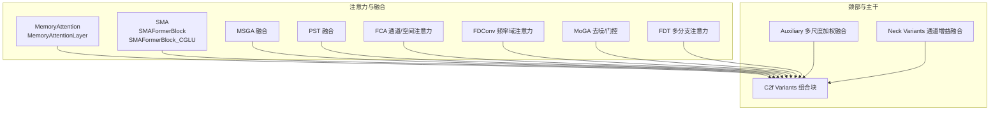

**图表来源**
- [memory_attention.py:12-312](file://ultralytics/models/sam/modules/memory_attention.py#L12-L312)
- [smaformer.py:105-178](file://ultralytics/nan/public/smaformer.py#L105-L178)
- [msga.py](file://ultralytics/nan/modules/fusion/msga.py)
- [pst.py:70-95](file://ultralytics/nan/modules/fusion/pst.py#L70-L95)
- [fca.py:352-365](file://ultralytics/nan/public/fca.py#L352-L365)
- [fdconv.py:87-174](file://ultralytics/nan/public/fdconv.py#L87-L174)
- [mogablock.py:105-115](file://ultralytics/nan/public/mogablock.py#L105-L115)
- [fdt.py:177-194](file://ultralytics/nan/public/fdt.py#L177-L194)
- [auxiliary.py:166-186](file://ultralytics/nan/Neck/auxiliary.py#L166-L186)
- [neck_variants.py:213-240](file://ultralytics/nan/Neck/neck_variants.py#L213-L240)
- [c2f_variants.py:173-209](file://ultralytics/nan/extraction/c2f_variants.py#L173-L209)

**章节来源**
- [memory_attention.py:12-312](file://ultralytics/models/sam/modules/memory_attention.py#L12-L312)
- [smaformer.py:105-178](file://ultralytics/nan/public/smaformer.py#L105-L178)
- [msga.py](file://ultralytics/nan/modules/fusion/msga.py)
- [pst.py:70-95](file://ultralytics/nan/modules/fusion/pst.py#L70-L95)
- [fca.py:352-365](file://ultralytics/nan/public/fca.py#L352-L365)
- [fdconv.py:87-174](file://ultralytics/nan/public/fdconv.py#L87-L174)
- [mogablock.py:105-115](file://ultralytics/nan/public/mogablock.py#L105-L115)
- [fdt.py:177-194](file://ultralytics/nan/public/fdt.py#L177-L194)
- [auxiliary.py:166-186](file://ultralytics/nan/Neck/auxiliary.py#L166-L186)
- [neck_variants.py:213-240](file://ultralytics/nan/Neck/neck_variants.py#L213-L240)
- [c2f_variants.py:173-209](file://ultralytics/nan/extraction/c2f_variants.py#L173-L209)

## 核心组件
- 多头注意力融合
  - 多头注意力通过并行投影与拼接实现多子空间建模，典型实现见SMAFormerBlock及其CGLU变体，负责将特征展平后经多头注意力与前馈网络，再还原回特征图。
  - 关键路径：[smaformer.py:141-178](file://ultralytics/nan/public/smaformer.py#L141-L178)
- 空间注意力融合
  - 空间注意力聚焦于像素/位置维度的权重分配，常见做法包括均值/最大池化后MLP生成权重，或基于频率域分解的空间分量建模。
  - 典型实现：FCA中的空间投影、FDConv的频率域分解与空间激活。
  - 关键路径：[fca.py:352-365](file://ultralytics/nan/public/fca.py#L352-L365)、[fdconv.py:87-174](file://ultralytics/nan/public/fdconv.py#L87-L174)
- 通道注意力融合
  - 通道注意力通过全局统计信息生成通道权重，常采用全局平均/最大池化+MLP的结构，实现通道级动态重标定。
  - 典型实现：Neck Variants中的通道增益模块、Auxiliary的多尺度通道加权。
  - 关键路径：[neck_variants.py:213-240](file://ultralytics/nan/Neck/neck_variants.py#L213-L240)、[auxiliary.py:166-186](file://ultralytics/nan/Neck/auxiliary.py#L166-L186)
- 多尺度门控注意力(MSGA)
  - MSGA通过多尺度输入的门控融合，结合粗粒度与细粒度特征，实现自适应尺度选择与加权。
  - 关键路径：[msga.py](file://ultralytics/nan/modules/fusion/msga.py)
- 稀疏混合注意力(SHA/SMA)
  - SHA/SMA通过稀疏采样与混合注意力，降低计算复杂度，提升长程依赖建模效率。
  - 关键路径：[pst.py:70-95](file://ultralytics/nan/modules/fusion/pst.py#L70-L95)
- 可形变注意力(SMA)
  - SMA在标准多头注意力基础上引入可形变调制器，增强对空间分布变化的适应能力。
  - 关键路径：[smaformer.py:105-148](file://ultralytics/nan/public/smaformer.py#L105-L148)
- 记忆注意力(Memory Attention)
  - MemoryAttention/MemoryAttentionLayer结合自注意力与交叉注意力，支持位置编码与RoPE，适用于序列/跨模态融合。
  - 关键路径：[memory_attention.py:12-312](file://ultralytics/models/sam/modules/memory_attention.py#L12-L312)

**章节来源**
- [smaformer.py:105-178](file://ultralytics/nan/public/smaformer.py#L105-L178)
- [fca.py:352-365](file://ultralytics/nan/public/fca.py#L352-L365)
- [fdconv.py:87-174](file://ultralytics/nan/public/fdconv.py#L87-L174)
- [neck_variants.py:213-240](file://ultralytics/nan/Neck/neck_variants.py#L213-L240)
- [auxiliary.py:166-186](file://ultralytics/nan/Neck/auxiliary.py#L166-L186)
- [msga.py](file://ultralytics/nan/modules/fusion/msga.py)
- [pst.py:70-95](file://ultralytics/nan/modules/fusion/pst.py#L70-L95)
- [memory_attention.py:12-312](file://ultralytics/models/sam/modules/memory_attention.py#L12-L312)

## 架构总览
下图展示注意力融合在主干与颈部之间的交互路径，以及与C2f变体的组合方式：

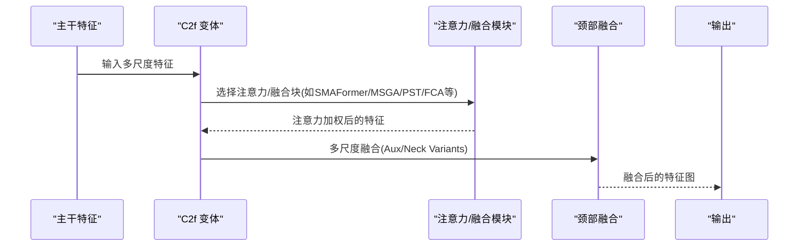

**图表来源**
- [c2f_variants.py:173-209](file://ultralytics/nan/extraction/c2f_variants.py#L173-L209)
- [smaformer.py:141-178](file://ultralytics/nan/public/smaformer.py#L141-L178)
- [msga.py](file://ultralytics/nan/modules/fusion/msga.py)
- [pst.py:70-95](file://ultralytics/nan/modules/fusion/pst.py#L70-L95)
- [fca.py:352-365](file://ultralytics/nan/public/fca.py#L352-L365)
- [auxiliary.py:166-186](file://ultralytics/nan/Neck/auxiliary.py#L166-L186)
- [neck_variants.py:213-240](file://ultralytics/nan/Neck/neck_variants.py#L213-L240)

## 详细组件分析

### 多头注意力融合（SMAFormer）
- 设计要点
  - 将特征展平为序列，经LayerNorm与多头注意力后残差连接，随后通过E_MLP或CGLU前馈模块，最后还原为特征图。
  - 支持两种变体：SMAFormerBlock（LN+MLP）与SMAFormerBlock_CGLU（LN+Convolutional GLU）。
- 数学与流程
  - 展平与线性映射：将特征图按通道展平为序列，Q/K/V一致。
  - 注意力权重：使用多头注意力计算注意力分数并加权求和。
  - 前馈与残差：残差连接后经前馈模块，再还原为特征图。
- 性能与稳定性
  - 使用LayerNorm与Dropout稳定训练；CGLU变体在保持线性复杂度的同时引入卷积增强非线性。

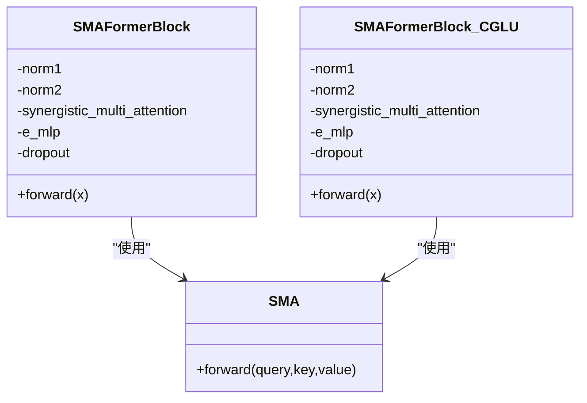

**图表来源**
- [smaformer.py:141-178](file://ultralytics/nan/public/smaformer.py#L141-L178)
- [smaformer.py:105-148](file://ultralytics/nan/public/smaformer.py#L105-L148)

**章节来源**
- [smaformer.py:105-178](file://ultralytics/nan/public/smaformer.py#L105-L178)

### 多尺度门控注意力(MSGA)
- 设计要点
  - 对多尺度输入进行门控融合，结合粗粒度与细粒度特征，实现自适应尺度选择与加权。
- 流程示意

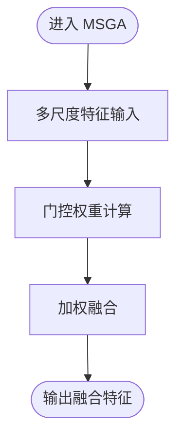

**图表来源**
- [msga.py](file://ultralytics/nan/modules/fusion/msga.py)

**章节来源**
- [msga.py](file://ultralytics/nan/modules/fusion/msga.py)

### 稀疏混合注意力(PST/SHA/SMA)
- 设计要点
  - 在粗粒度注意力基础上，对上层特征进行Top-K索引映射到当前分辨率，提取局部精细关键点，与粗粒度输出通过门控融合，实现稀疏高精度注意力。
- 关键步骤
  - 上层特征Top-K索引映射至当前分辨率，抽取K个关键位置的K/V。
  - 计算精细注意力与粗粒度注意力的softmax权重。
  - 通过1D门控卷积生成融合门，加权融合粗/细两路输出。
- 流程示意

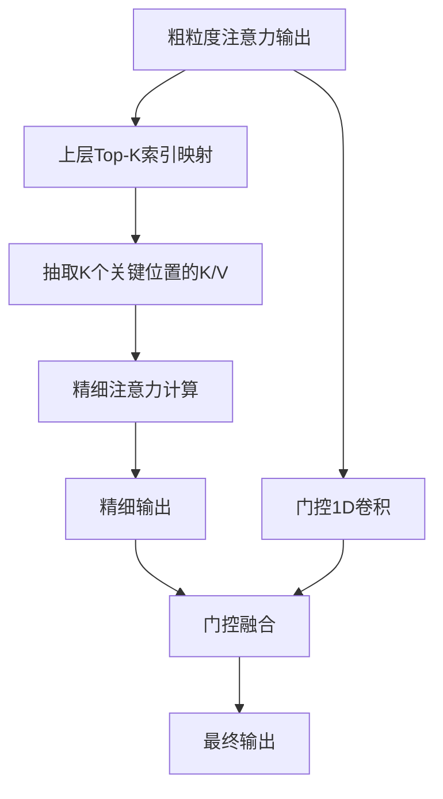

**图表来源**
- [pst.py:70-95](file://ultralytics/nan/modules/fusion/pst.py#L70-L95)

**章节来源**
- [pst.py:70-95](file://ultralytics/nan/modules/fusion/pst.py#L70-L95)

### 通道注意力融合（Neck Variants/Auxiliary）
- 设计要点
  - 通过通道对齐与多尺度拼接，利用全局池化与MLP生成通道权重，实现通道级加权融合。
- 流程示意

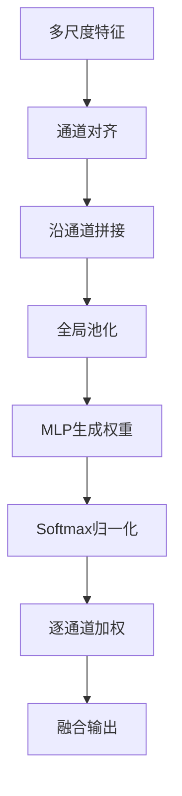

**图表来源**
- [auxiliary.py:166-186](file://ultralytics/nan/Neck/auxiliary.py#L166-L186)
- [neck_variants.py:213-240](file://ultralytics/nan/Neck/neck_variants.py#L213-L240)

**章节来源**
- [auxiliary.py:166-186](file://ultralytics/nan/Neck/auxiliary.py#L166-L186)
- [neck_variants.py:213-240](file://ultralytics/nan/Neck/neck_variants.py#L213-L240)

### 空间注意力融合（FCA）
- 设计要点
  - 通过通道投影与空间投影分别建模通道与空间注意力，结合Sigmoid/Softmax激活实现动态权重。
- 流程示意

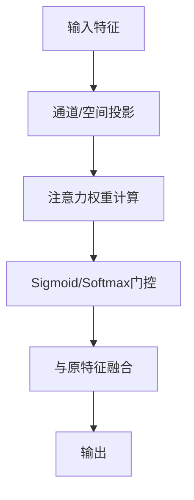

**图表来源**
- [fca.py:352-365](file://ultralytics/nan/public/fca.py#L352-L365)

**章节来源**
- [fca.py:352-365](file://ultralytics/nan/public/fca.py#L352-L365)

### 频率域注意力（FDConv）
- 设计要点
  - 在频率域分解的基础上，对通道、滤波器、空间与核数量分别建模注意力，支持Sigmoid/Tanh/Softmax等激活。
- 流程示意

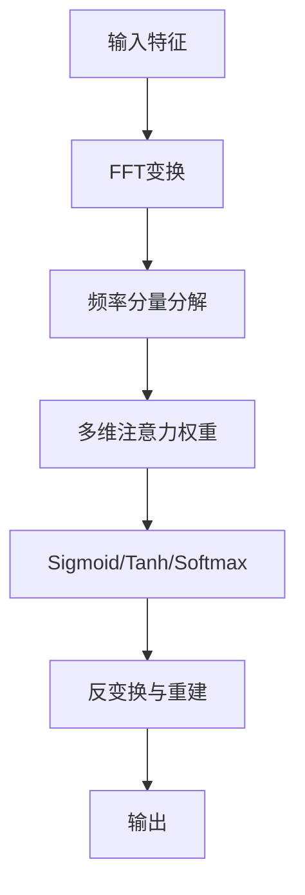

**图表来源**
- [fdconv.py:278-296](file://ultralytics/nan/public/fdconv.py#L278-L296)
- [fdconv.py:87-174](file://ultralytics/nan/public/fdconv.py#L87-L174)

**章节来源**
- [fdconv.py:87-174](file://ultralytics/nan/public/fdconv.py#L87-L174)
- [fdconv.py:278-296](file://ultralytics/nan/public/fdconv.py#L278-L296)

### 记忆注意力（Memory Attention）
- 设计要点
  - MemoryAttentionLayer包含自注意力与交叉注意力，配合RoPE位置编码与MLP前馈，MemoryAttention由多层堆叠组成。
- 流程示意

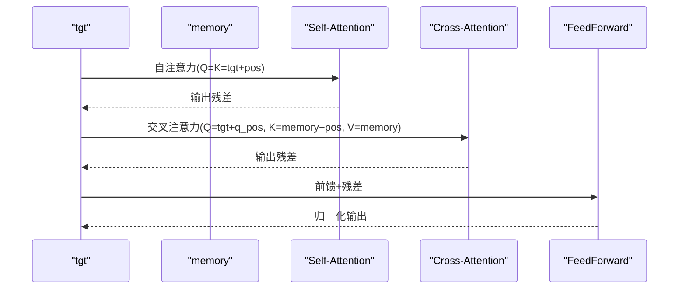

**图表来源**
- [memory_attention.py:139-166](file://ultralytics/models/sam/modules/memory_attention.py#L139-L166)

**章节来源**
- [memory_attention.py:12-312](file://ultralytics/models/sam/modules/memory_attention.py#L12-L312)

### MoGA去噪/门控
- 设计要点
  - 通过特征分解、门控与价值分支的乘加操作，实现自适应去噪与门控融合，支持强制FP32计算选项。
- 流程示意

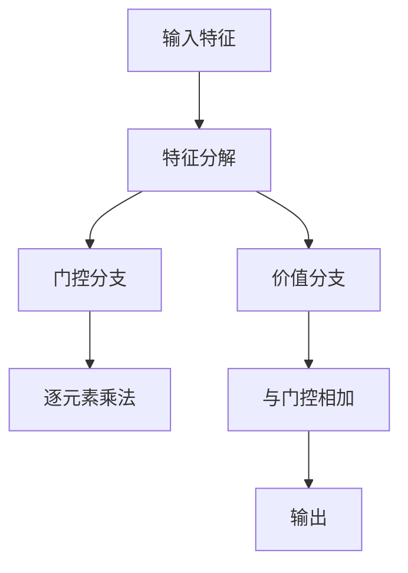

**图表来源**
- [mogablock.py:105-115](file://ultralytics/nan/public/mogablock.py#L105-L115)

**章节来源**
- [mogablock.py:105-115](file://ultralytics/nan/public/mogablock.py#L105-L115)

### FDT多分支注意力
- 设计要点
  - 多分支共享深度的注意力与前馈模块，交替执行自注意力与前馈，形成深层注意力网络。
- 流程示意

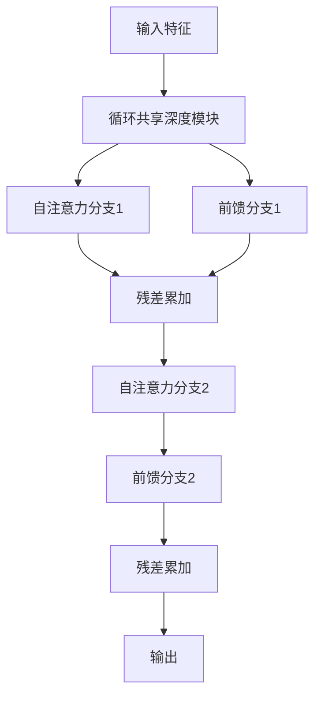

**图表来源**
- [fdt.py:177-194](file://ultralytics/nan/public/fdt.py#L177-L194)

**章节来源**
- [fdt.py:177-194](file://ultralytics/nan/public/fdt.py#L177-L194)

## 依赖关系分析
- 组件耦合
  - C2f变体通过统一接口组装各类注意力/融合块，降低模块间耦合度。
  - Neck与Auxiliary提供通用的多尺度融合接口，便于替换与扩展。
- 外部依赖
  - RoPEAttention作为位置编码注意力的基础组件，广泛用于MemoryAttention与SMAFormer。
- 循环依赖
  - 各模块以函数/类调用为主，未发现直接循环导入。

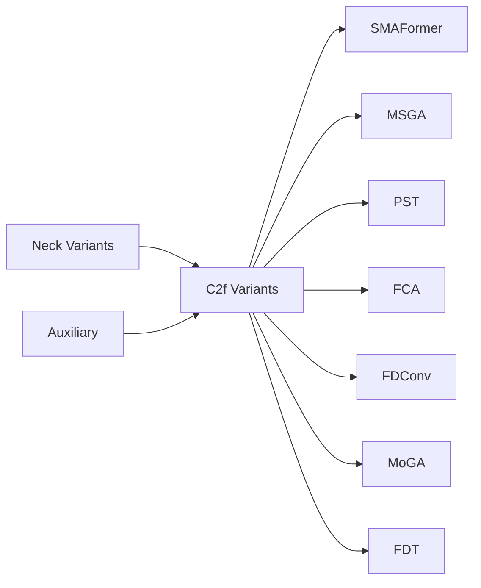

**图表来源**
- [c2f_variants.py:173-209](file://ultralytics/nan/extraction/c2f_variants.py#L173-L209)
- [smaformer.py:141-178](file://ultralytics/nan/public/smaformer.py#L141-L178)
- [msga.py](file://ultralytics/nan/modules/fusion/msga.py)
- [pst.py:70-95](file://ultralytics/nan/modules/fusion/pst.py#L70-L95)
- [fca.py:352-365](file://ultralytics/nan/public/fca.py#L352-L365)
- [fdconv.py:87-174](file://ultralytics/nan/public/fdconv.py#L87-L174)
- [mogablock.py:105-115](file://ultralytics/nan/public/mogablock.py#L105-L115)
- [fdt.py:177-194](file://ultralytics/nan/public/fdt.py#L177-L194)
- [auxiliary.py:166-186](file://ultralytics/nan/Neck/auxiliary.py#L166-L186)
- [neck_variants.py:213-240](file://ultralytics/nan/Neck/neck_variants.py#L213-L240)

**章节来源**
- [c2f_variants.py:173-209](file://ultralytics/nan/extraction/c2f_variants.py#L173-L209)
- [auxiliary.py:166-186](file://ultralytics/nan/Neck/auxiliary.py#L166-L186)
- [neck_variants.py:213-240](file://ultralytics/nan/Neck/neck_variants.py#L213-L240)

## 性能考量
- 复杂度与吞吐
  - 多头注意力的计算复杂度与头数呈线性关系，建议在保证效果的前提下适度减少头数或使用稀疏注意力（如PST）。
  - SMAFormer的CGLU变体在保持线性复杂度的同时引入卷积增强非线性，适合实时场景。
- 内存与显存
  - 频域注意力(FDConv)在FFT阶段会增加内存占用，建议根据输入尺寸与批大小合理设置温度参数与激活类型。
  - MSGA/PST通过稀疏采样显著降低计算与存储开销。
- 训练稳定性
  - 使用LayerNorm与Dropout有助于稳定多头注意力训练；FCA中Sigmoid/Softmax门控需注意数值稳定性。
- 推理优化
  - Neck/Auxiliary的通道对齐与加权融合可结合ONNX/TensorRT量化部署；SMAFormer的展平/还原过程可预分配张量以减少重复分配。

## 故障排查指南
- 注意力权重异常
  - 症状：注意力权重全为0或NaN。
  - 排查：检查温度参数是否过大导致软化过度；确认激活函数（Sigmoid/Tanh/Softmax）配置正确；检查输入归一化与梯度裁剪。
  - 参考路径：[fdconv.py:145-162](file://ultralytics/nan/public/fdconv.py#L145-L162)、[fca.py:352-365](file://ultralytics/nan/public/fca.py#L352-L365)
- 多尺度融合不生效
  - 症状：融合后特征无明显改善。
  - 排查：确认通道对齐与拼接维度；检查MLP权重初始化与Softmax归一化；验证不同尺度权重是否覆盖全部尺度。
  - 参考路径：[auxiliary.py:166-186](file://ultralytics/nan/Neck/auxiliary.py#L166-L186)、[neck_variants.py:213-240](file://ultralytics/nan/Neck/neck_variants.py#L213-L240)
- 稀疏注意力性能退化
  - 症状：Top-K采样导致细节丢失。
  - 排查：调整Top-K比例与映射尺度；检查门控卷积是否过强抑制粗粒度信息。
  - 参考路径：[pst.py:70-95](file://ultralytics/nan/modules/fusion/pst.py#L70-L95)
- 记忆注意力维度不匹配
  - 症状：自注意力与交叉注意力报错。
  - 排查：确保tgt与memory的batch一致；检查位置编码维度与模型维度匹配。
  - 参考路径：[memory_attention.py:274-290](file://ultralytics/models/sam/modules/memory_attention.py#L274-L290)

**章节来源**
- [fdconv.py:145-162](file://ultralytics/nan/public/fdconv.py#L145-L162)
- [fca.py:352-365](file://ultralytics/nan/public/fca.py#L352-L365)
- [auxiliary.py:166-186](file://ultralytics/nan/Neck/auxiliary.py#L166-L186)
- [neck_variants.py:213-240](file://ultralytics/nan/Neck/neck_variants.py#L213-L240)
- [pst.py:70-95](file://ultralytics/nan/modules/fusion/pst.py#L70-L95)
- [memory_attention.py:274-290](file://ultralytics/models/sam/modules/memory_attention.py#L274-L290)

## 结论
本文系统梳理了多头注意力、空间注意力与通道注意力的融合实现，并结合MSGA、PST/SMA、FCA、FDConv、MoGA与FDT等先进方法，给出了数学推导、代码路径与性能调优建议。通过C2f变体与Neck/Auxiliary的组合，可在多模态与多尺度任务中实现高效、稳定的特征融合。建议在实际工程中依据数据规模与硬件条件选择合适的注意力策略，并结合稀疏化与频域方法以平衡精度与效率。

## 附录
- 关键实现路径速览
  - 多头注意力：[smaformer.py:141-178](file://ultralytics/nan/public/smaformer.py#L141-L178)
  - 多尺度门控：[msga.py](file://ultralytics/nan/modules/fusion/msga.py)
  - 稀疏混合：[pst.py:70-95](file://ultralytics/nan/modules/fusion/pst.py#L70-L95)
  - 通道/空间注意力：[fca.py:352-365](file://ultralytics/nan/public/fca.py#L352-L365)、[neck_variants.py:213-240](file://ultralytics/nan/Neck/neck_variants.py#L213-L240)、[auxiliary.py:166-186](file://ultralytics/nan/Neck/auxiliary.py#L166-L186)
  - 频域注意力：[fdconv.py:87-174](file://ultralytics/nan/public/fdconv.py#L87-L174)
  - 记忆注意力：[memory_attention.py:12-312](file://ultralytics/models/sam/modules/memory_attention.py#L12-L312)
  - MoGA：[mogablock.py:105-115](file://ultralytics/nan/public/mogablock.py#L105-L115)
  - FDT：[fdt.py:177-194](file://ultralytics/nan/public/fdt.py#L177-L194)