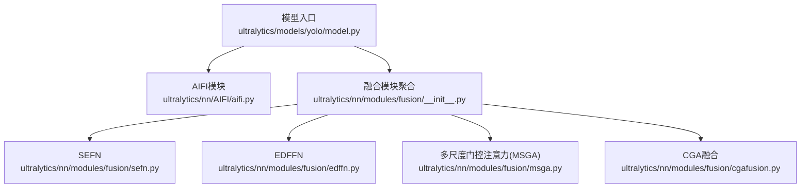
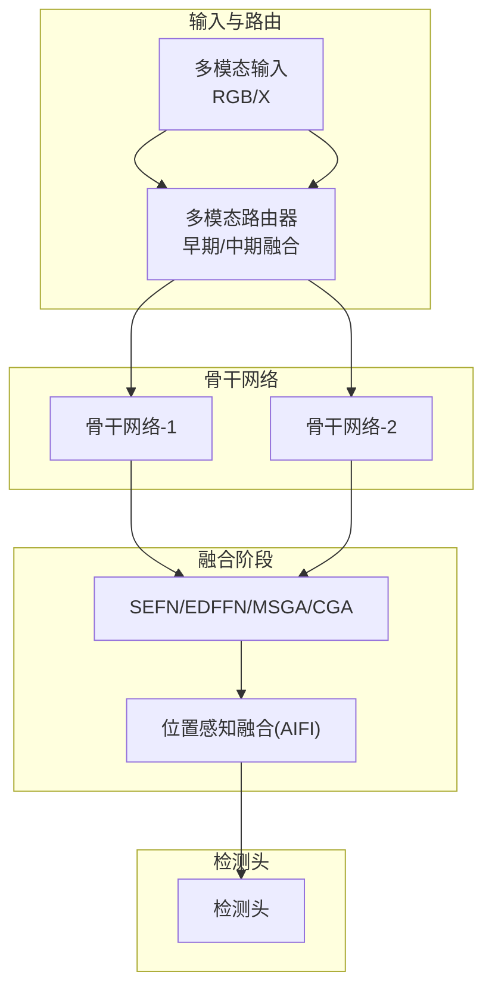
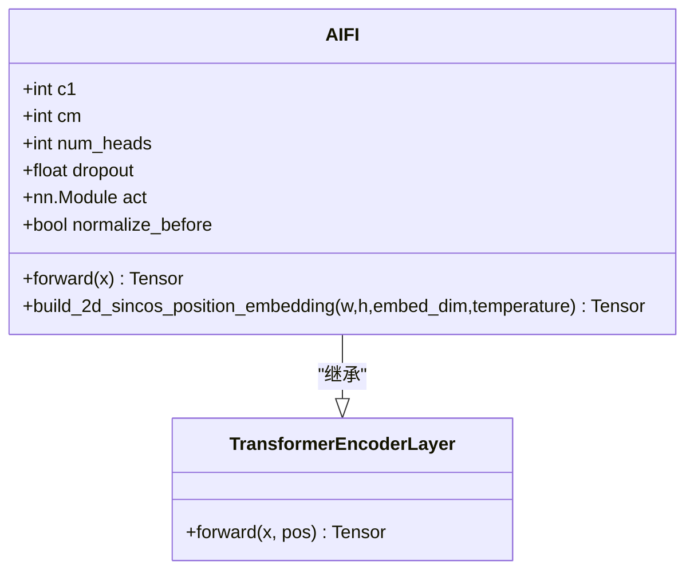
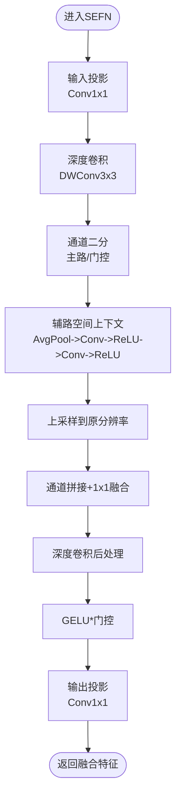
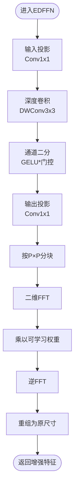
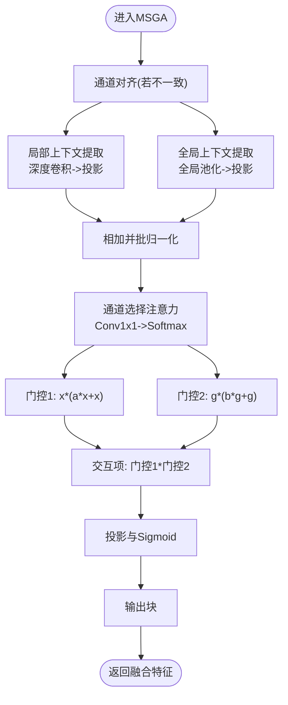
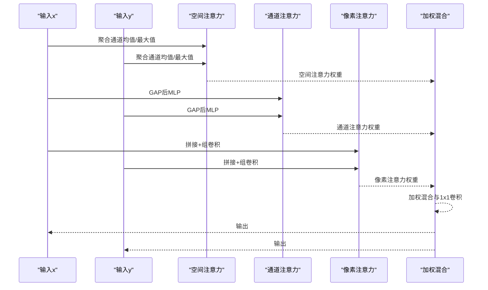
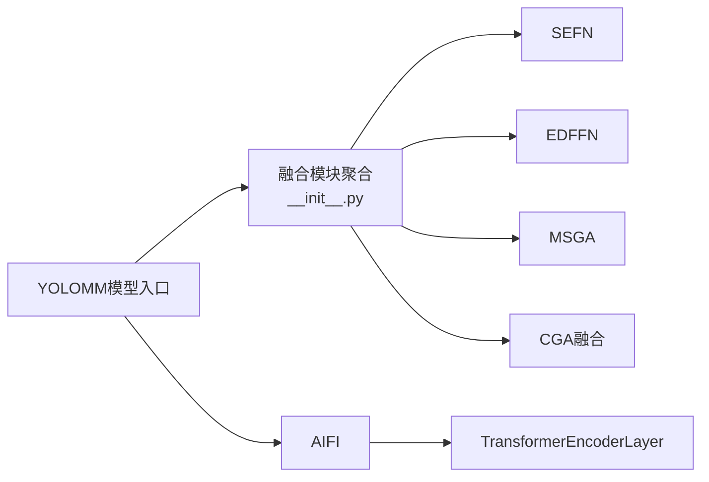

# 深度学习融合技术

<cite>
**本文引用的文件**
- [ultralytics/models/yolo/model.py](file://ultralytics/models/yolo/model.py)
- [ultralytics/nn/AIFI/aifi.py](file://ultralytics/nn/AIFI/aifi.py)
- [ultralytics/nn/modules/fusion/__init__.py](file://ultralytics/nn/modules/fusion/__init__.py)
- [ultralytics/nn/modules/fusion/sefn.py](file://ultralytics/nn/modules/fusion/sefn.py)
- [ultralytics/nn/modules/fusion/edffn.py](file://ultralytics/nn/modules/fusion/edffn.py)
- [ultralytics/nn/modules/fusion/msga.py](file://ultralytics/nn/modules/fusion/msga.py)
- [ultralytics/nn/modules/fusion/cgafusion.py](file://ultralytics/nn/modules/fusion/cgafusion.py)
</cite>

## 目录
1. [引言](#引言)
2. [项目结构](#项目结构)
3. [核心组件](#核心组件)
4. [架构总览](#架构总览)
5. [详细组件分析](#详细组件分析)
6. [依赖分析](#依赖分析)
7. [性能考虑](#性能考虑)
8. [故障排查指南](#故障排查指南)
9. [结论](#结论)
10. [附录](#附录)

## 引言
本技术文档围绕“深度学习驱动的特征融合”展开，聚焦于基于深度神经网络的融合方法，包括增强深度特征网络(EDFFN)、谱增强前馈网络(SEFN)以及AIFI模块的融合机制；深入解释频域特征融合、多尺度门控融合与动态特征混合等先进融合技术的实现原理；并提供深度融合网络的架构设计、训练策略与性能优化方法，涵盖融合层设计、激活函数选择与梯度传播优化的实践指导。

## 项目结构
该项目在Ultralytics框架下组织，多模态与融合相关代码主要位于以下位置：
- 模型入口与多模态适配：ultralytics/models/yolo/model.py
- AIFI模块：ultralytics/nn/AIFI/aifi.py
- 融合模块聚合：ultralytics/nn/modules/fusion/__init__.py
- 典型融合算子：ultralytics/nn/modules/fusion/sefn.py、ultralytics/nn/modules/fusion/edffn.py、ultralytics/nn/modules/fusion/msga.py、ultralytics/nn/modules/fusion/cgafusion.py

**图示来源**
- [ultralytics/models/yolo/model.py:456-741](file://ultralytics/models/yolo/model.py#L456-L741)
- [ultralytics/nn/AIFI/aifi.py:9-84](file://ultralytics/nn/AIFI/aifi.py#L9-L84)
- [ultralytics/nn/modules/fusion/__init__.py:1-58](file://ultralytics/nn/modules/fusion/__init__.py#L1-L58)
- [ultralytics/nn/modules/fusion/sefn.py:9-79](file://ultralytics/nn/modules/fusion/sefn.py#L9-L79)
- [ultralytics/nn/modules/fusion/edffn.py:9-63](file://ultralytics/nn/modules/fusion/edffn.py#L9-L63)
- [ultralytics/nn/modules/fusion/msga.py:57-95](file://ultralytics/nn/modules/fusion/msga.py#L57-L95)
- [ultralytics/nn/modules/fusion/cgafusion.py:46-64](file://ultralytics/nn/modules/fusion/cgafusion.py#L46-L64)

**章节来源**
- [ultralytics/models/yolo/model.py:456-741](file://ultralytics/models/yolo/model.py#L456-L741)
- [ultralytics/nn/modules/fusion/__init__.py:1-58](file://ultralytics/nn/modules/fusion/__init__.py#L1-L58)

## 核心组件
- YOLOMM多模态模型：负责自动识别任务类型、检测所需输入通道数，并在多模态路由规则下适配RGB与X模态的早期/中期融合。
- AIFI模块：基于Transformer编码器层，为2D特征图添加二维正弦余弦位置嵌入，实现空间感知的自注意力融合。
- SEFN（谱增强前馈网络）：双路增强的前馈网络，辅路空间上下文引导主路门控，显式注入跨模态/跨层信息。
- EDFFN（增强深度特征网络）：在融合后的单路特征上执行频域选择性增强，抑制冗余并突出判别性纹理/结构。
- MSGA（多尺度门控注意力）：结合局部与全局上下文提取，通过多尺度融合与门控机制实现动态特征交互。
- CGA融合：通道/空间/像素级注意力引导的两路特征融合，实现自适应加权混合。

**章节来源**
- [ultralytics/models/yolo/model.py:456-741](file://ultralytics/models/yolo/model.py#L456-L741)
- [ultralytics/nn/AIFI/aifi.py:9-84](file://ultralytics/nn/AIFI/aifi.py#L9-L84)
- [ultralytics/nn/modules/fusion/sefn.py:9-79](file://ultralytics/nn/modules/fusion/sefn.py#L9-L79)
- [ultralytics/nn/modules/fusion/edffn.py:9-63](file://ultralytics/nn/modules/fusion/edffn.py#L9-L63)
- [ultralytics/nn/modules/fusion/msga.py:57-95](file://ultralytics/nn/modules/fusion/msga.py#L57-L95)
- [ultralytics/nn/modules/fusion/cgafusion.py:46-64](file://ultralytics/nn/modules/fusion/cgafusion.py#L46-L64)

## 架构总览
下图展示了多模态融合的整体流程：输入经由多模态路由器分配到RGB或X分支，随后在骨干网络中进行特征提取；在颈部或头部阶段，采用SEFN/EDFFN/MSGA/CGA等融合模块进行跨模态/跨尺度交互；最终送入检测头完成推理。

[此图为概念性架构示意，不直接映射具体源码文件，故不提供图示来源]

## 详细组件分析

### AIFI模块分析
AIFI在2D特征图上引入二维正弦余弦位置嵌入，将[B, C, H, W]展平为[B, H×W, C]，调用Transformer编码器层进行自注意力融合，再恢复为原形状。该模块适合在检测头或颈部引入空间位置先验，提升跨位置的语义关联能力。

**图示来源**
- [ultralytics/nn/AIFI/aifi.py:9-84](file://ultralytics/nn/AIFI/aifi.py#L9-L84)

**章节来源**
- [ultralytics/nn/AIFI/aifi.py:9-84](file://ultralytics/nn/AIFI/aifi.py#L9-L84)

### SEFN（谱增强前馈网络）分析
SEFN通过双路卷积与门控机制，利用辅路的空间上下文（经平均池化与双层卷积）引导主路门控，实现跨模态/跨层信息的显式注入。其前向流程包含：输入投影、深度卷积、融合与门控、激活与输出投影。

**图示来源**
- [ultralytics/nn/modules/fusion/sefn.py:53-79](file://ultralytics/nn/modules/fusion/sefn.py#L53-L79)

**章节来源**
- [ultralytics/nn/modules/fusion/sefn.py:9-79](file://ultralytics/nn/modules/fusion/sefn.py#L9-L79)

### EDFFN（增强深度特征网络）分析
EDFFN在单路特征上进行频域选择性增强：先通过线性投影与门控激活得到中间特征，再按patch大小分块，对每个patch执行二维FFT，乘以可学习权重后再逆变换重建，从而抑制冗余并突出判别性结构。

**图示来源**
- [ultralytics/nn/modules/fusion/edffn.py:43-63](file://ultralytics/nn/modules/fusion/edffn.py#L43-L63)

**章节来源**
- [ultralytics/nn/modules/fusion/edffn.py:9-63](file://ultralytics/nn/modules/fusion/edffn.py#L9-L63)

### MSGA（多尺度门控注意力）分析
MSGA结合局部上下文与全局上下文提取，通过多尺度融合模块生成注意力权重，采用双侧门控与交互项，最终以投影与批归一化输出融合特征。该模块适合在多尺度特征间进行动态混合。

**图示来源**
- [ultralytics/nn/modules/fusion/msga.py:71-95](file://ultralytics/nn/modules/fusion/msga.py#L71-L95)

**章节来源**
- [ultralytics/nn/modules/fusion/msga.py:57-95](file://ultralytics/nn/modules/fusion/msga.py#L57-L95)

### CGA融合分析
CGA融合通过空间注意力（通道维度聚合后卷积）、通道注意力（全局平均池化后MLP）与像素注意力（拼接后组卷积）共同生成像素级权重，对两路输入进行自适应加权混合。

**图示来源**
- [ultralytics/nn/modules/fusion/cgafusion.py:46-64](file://ultralytics/nn/modules/fusion/cgafusion.py#L46-L64)

**章节来源**
- [ultralytics/nn/modules/fusion/cgafusion.py:46-64](file://ultralytics/nn/modules/fusion/cgafusion.py#L46-L64)

## 依赖分析
- 融合模块聚合导出多个融合算子，包括SEFN、EDFFN、MSGA、CGA等，便于在模型配置中灵活组合。
- AIFI依赖公共Transformer编码器层，扩展为2D特征图的Transformer融合。
- 多模态模型入口负责自动识别任务类型与输入通道数，确保融合路径正确接入。

**图示来源**
- [ultralytics/nn/modules/fusion/__init__.py:1-58](file://ultralytics/nn/modules/fusion/__init__.py#L1-L58)
- [ultralytics/nn/AIFI/aifi.py:6-37](file://ultralytics/nn/AIFI/aifi.py#L6-L37)
- [ultralytics/models/yolo/model.py:456-741](file://ultralytics/models/yolo/model.py#L456-L741)

**章节来源**
- [ultralytics/nn/modules/fusion/__init__.py:1-58](file://ultralytics/nn/modules/fusion/__init__.py#L1-L58)
- [ultralytics/nn/AIFI/aifi.py:6-37](file://ultralytics/nn/AIFI/aifi.py#L6-L37)
- [ultralytics/models/yolo/model.py:456-741](file://ultralytics/models/yolo/model.py#L456-L741)

## 性能考虑
- 计算复杂度与内存占用：EDFFN在高频段进行FFT/IFFT，建议合理设置patch大小以平衡精度与速度；SEFN与MSGA的深度卷积与注意力计算需注意通道数与分辨率的乘积。
- 设备与精度：各模块在前向时会根据设备与自动混合精度状态对参数与输入进行对齐，避免dtype不匹配导致的性能下降。
- 梯度传播优化：建议在融合层后紧跟批归一化与合适的激活函数（如GELU），以稳定梯度流动；对于注意力模块，可采用小的学习率与权重衰减，防止过拟合。
- 激活函数选择：GELU在SEFN中用于门控与非线性增强；Sigmoid用于门控权重与注意力权重，有助于实现软选择与平滑混合。

[本节为通用性能建议，不直接分析具体文件，故不提供章节来源]

## 故障排查指南
- 输入形状与通道校验：EDFFN要求输入高宽能被patch整除；SEFN要求两路输入形状一致且均为张量；MSGA要求两路特征通道数可对齐或通过卷积对齐。
- 设备与dtype一致性：若出现设备不匹配或dtype不一致，可在前向中对齐至模块所在设备与权重dtype。
- 注意力数值稳定性：MSGA中的softmax与sigmoid应避免极端输入，必要时增加小常数以稳定数值。

**章节来源**
- [ultralytics/nn/modules/fusion/edffn.py:44-48](file://ultralytics/nn/modules/fusion/edffn.py#L44-L48)
- [ultralytics/nn/modules/fusion/sefn.py:56-59](file://ultralytics/nn/modules/fusion/sefn.py#L56-L59)
- [ultralytics/nn/modules/fusion/msga.py:71-95](file://ultralytics/nn/modules/fusion/msga.py#L71-L95)

## 结论
本文系统梳理了基于深度神经网络的特征融合技术，重点解析了SEFN、EDFFN、MSGA与CGA融合模块的实现原理与适用场景，并结合AIFI的位置感知融合能力与多模态模型入口的路由机制，给出了深度融合网络的架构设计、训练策略与性能优化建议。通过合理选择融合层、激活函数与梯度传播策略，可在多模态视觉任务中显著提升特征表达与检测性能。

[本节为总结性内容，不直接分析具体文件，故不提供章节来源]

## 附录
- 多模态融合路径：在多模态模型入口中，依据配置自动识别任务类型与所需输入通道数，确保融合路径正确接入骨干网络与检测头。
- 融合模块组合：可在骨干网络的不同阶段插入SEFN/EDFFN进行跨模态增强与频域选择性增强；在颈部或检测头阶段使用MSGA/CGA实现多尺度与通道/空间/像素级注意力融合；在需要位置先验时引入AIFI。

**章节来源**
- [ultralytics/models/yolo/model.py:456-741](file://ultralytics/models/yolo/model.py#L456-L741)
- [ultralytics/nn/modules/fusion/__init__.py:1-58](file://ultralytics/nn/modules/fusion/__init__.py#L1-L58)