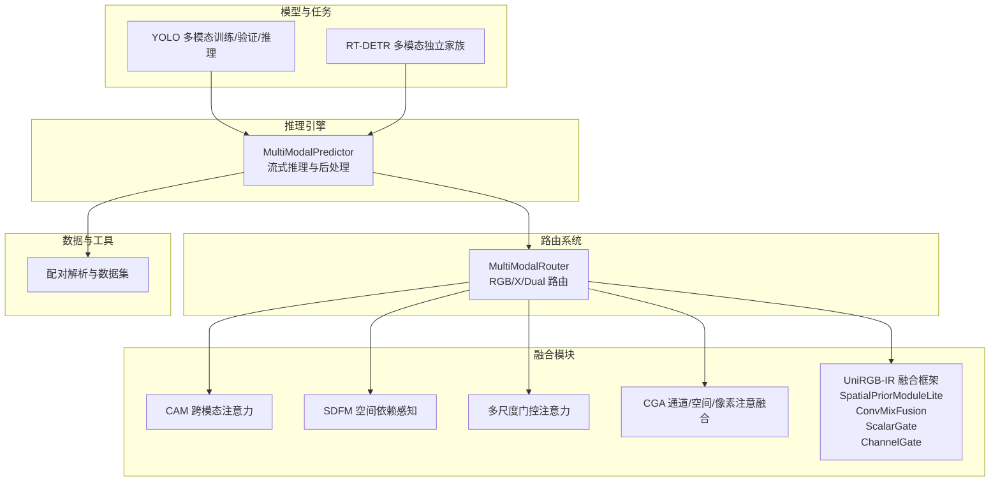
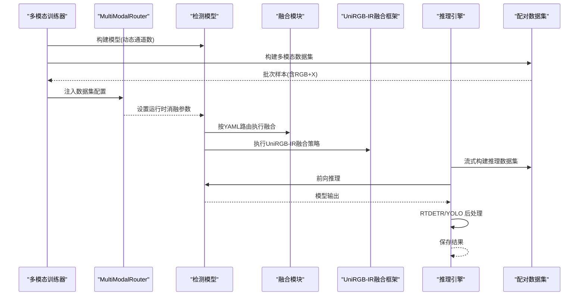
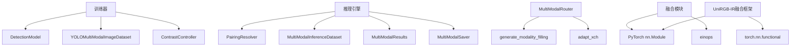

# 特征融合策略

<cite>
**本文档引用的文件**
- [ultralytics/models/yolo/multimodal/__init__.py](file://ultralytics/models/yolo/multimodal/__init__.py)
- [ultralytics/engine/multimodal/predictor.py](file://ultralytics/engine/multimodal/predictor.py)
- [ultralytics/models/yolo/multimodal/train.py](file://ultralytics/models/yolo/multimodal/train.py)
- [ultralytics/models/rtdetrmm/model.py](file://ultralytics/models/rtdetrmm/model.py)
- [ultralytics/nn/mm/router.py](file://ultralytics/nn/mm/router.py)
- [ultralytics/nn/modules/fusion/__init__.py](file://ultralytics/nn/modules/fusion/__init__.py)
- [ultralytics/nn/modules/fusion/cam.py](file://ultralytics/nn/modules/fusion/cam.py)
- [ultralytics/nn/modules/fusion/sdfm.py](file://ultralytics/nn/modules/fusion/sdfm.py)
- [ultralytics/nn/modules/fusion/msga.py](file://ultralytics/nn/modules/fusion/msga.py)
- [ultralytics/nn/modules/fusion/cgafusion.py](file://ultralytics/nn/modules/fusion/cgafusion.py)
- [ultralytics/nn/modules/fusion/UniRGB_IR.py](file://ultralytics/nn/modules/fusion/UniRGB_IR.py)
- [ultralytics/data/multimodal/__init__.py](file://ultralytics/data/multimodal/__init__.py)
- [ultralytics/nn/modules/__init__.py](file://ultralytics/nn/modules/__init__.py)
- [ultralytics/nn/tasks.py](file://ultralytics/nn/tasks.py)
- [ultralytics/cfg/models/rtmm/r18/aifi-dattention-CSP-MutilScaleEdgeInformationEnhance-ASF-P2-lite-ChannelGate.yaml](file://ultralytics/cfg/models/rtmm/r18/aifi-dattention-CSP-MutilScaleEdgeInformationEnhance-ASF-P2-lite-ChannelGate.yaml)
- [ultralytics/cfg/models/rtmm/r18/aifi-dattention-CSP-MutilScaleEdgeInformationEnhance-ASF-P2-lite-ScalarGate-SE.yaml](file://ultralytics/cfg/models/rtmm/r18/aifi-dattention-CSP-MutilScaleEdgeInformationEnhance-ASF-P2-lite-ScalarGate-SE.yaml)
</cite>

## 目录
1. [引言](#引言)
2. [项目结构](#项目结构)
3. [核心组件](#核心组件)
4. [架构总览](#架构总览)
5. [详细组件分析](#详细组件分析)
6. [依赖分析](#依赖分析)
7. [性能考量](#性能考量)
8. [故障排查指南](#故障排查指南)
9. [结论](#结论)
10. [附录](#附录)

## 引言
本文件面向多模态特征融合策略，系统梳理传统融合方法、深度学习融合技术与注意力机制融合的原理与实现，重点覆盖多尺度特征融合（特征金字塔融合、通道注意力融合、空间注意力融合）、自适应融合策略（动态权重分配、模态重要性评估、自适应参数调整）以及融合策略的性能评估与调优指南。文档以仓库中的多模态推理引擎、训练器、路由系统与融合模块为基础，结合 YAML 层面的"输入源"标记实现"配置驱动"的融合路径。

**更新** 新增UniRGB-IR融合框架相关内容，包括SpatialPriorModuleLite、ConvMixFusion、ScalarGate、ChannelGate等模块的详细说明。

## 项目结构
围绕多模态特征融合，项目的关键层次如下：
- 模型与任务层：YOLO 多模态训练/验证/推理与 RT-DETR 多模态独立家族
- 推理引擎层：独立的多模态推理器，负责数据集构建、流式推理与后处理
- 路由层：MultiModalRouter 基于 YAML 第五字段实现 RGB/X/Dual 的零拷贝路由
- 融合模块层：跨模态注意力、空间依赖感知、多尺度门控等融合块，**新增UniRGB-IR融合框架**
- 数据与工具层：配对解析、推理数据集、可视化与评估工具

**图表来源**
- [ultralytics/models/yolo/multimodal/train.py:16-107](file://ultralytics/models/yolo/multimodal/train.py#L16-L107)
- [ultralytics/models/rtdetrmm/model.py:25-57](file://ultralytics/models/rtdetrmm/model.py#L25-L57)
- [ultralytics/engine/multimodal/predictor.py:16-98](file://ultralytics/engine/multimodal/predictor.py#L16-L98)
- [ultralytics/nn/mm/router.py:11-63](file://ultralytics/nn/mm/router.py#L11-L63)
- [ultralytics/nn/modules/fusion/__init__.py:1-58](file://ultralytics/nn/modules/fusion/__init__.py#L1-L58)
- [ultralytics/nn/modules/fusion/UniRGB_IR.py:1-12](file://ultralytics/nn/modules/fusion/UniRGB_IR.py#L1-L12)

**章节来源**
- [ultralytics/models/yolo/multimodal/train.py:16-107](file://ultralytics/models/yolo/multimodal/train.py#L16-L107)
- [ultralytics/models/rtdetrmm/model.py:25-57](file://ultralytics/models/rtdetrmm/model.py#L25-L57)
- [ultralytics/engine/multimodal/predictor.py:16-98](file://ultralytics/engine/multimodal/predictor.py#L16-L98)
- [ultralytics/nn/mm/router.py:11-63](file://ultralytics/nn/mm/router.py#L11-L63)
- [ultralytics/nn/modules/fusion/__init__.py:1-58](file://ultralytics/nn/modules/fusion/__init__.py#L1-L58)

## 核心组件
- 多模态训练器：支持早期/中期/晚期融合的配置驱动路由，支持单模态与双模态训练，动态通道数与 GFLOPs 统计。
- 多模态推理引擎：独立于基础推理器，支持流式推理、RTDETR/YOLO 后处理分支、结果保存。
- 多模态路由器：基于 YAML 第五字段（RGB/X/Dual）实现零拷贝张量路由，支持运行时消融参数注入。
- 融合模块：提供 CAM、SDFM、MSGA、CGA 等融合块，覆盖跨模态注意力、空间依赖感知与多尺度门控，**新增UniRGB-IR融合框架**。
- 数据与工具：配对解析、推理数据集、可视化与评估工具。

**章节来源**
- [ultralytics/models/yolo/multimodal/train.py:16-107](file://ultralytics/models/yolo/multimodal/train.py#L16-L107)
- [ultralytics/engine/multimodal/predictor.py:16-98](file://ultralytics/engine/multimodal/predictor.py#L16-L98)
- [ultralytics/nn/mm/router.py:11-63](file://ultralytics/nn/mm/router.py#L11-L63)
- [ultralytics/nn/modules/fusion/__init__.py:1-58](file://ultralytics/nn/modules/fusion/__init__.py#L1-L58)

## 架构总览
多模态特征融合的总体流程：训练/验证阶段由训练器解析 YAML，构建模型与数据集；推理阶段由推理引擎加载模型，通过 MultiModalRouter 将 RGB 与 X 模态按配置路由到相应模块；融合模块在骨干网络的不同阶段进行特征交互与融合；最终输出检测框并进行后处理与保存。

**图表来源**
- [ultralytics/models/yolo/multimodal/train.py:472-509](file://ultralytics/models/yolo/multimodal/train.py#L472-L509)
- [ultralytics/nn/mm/router.py:64-69](file://ultralytics/nn/mm/router.py#L64-L69)
- [ultralytics/engine/multimodal/predictor.py:125-142](file://ultralytics/engine/multimodal/predictor.py#L125-L142)
- [ultralytics/nn/modules/fusion/UniRGB_IR.py:389-396](file://ultralytics/nn/modules/fusion/UniRGB_IR.py#L389-L396)

## 详细组件分析

### 传统融合方法
- 早期融合（Early Fusion）：在输入层将 RGB 与 X 按通道拼接，形成 3+X 的统一输入，随后共享骨干网络。该策略在训练器中通过"双模态"与"单模态"两种模式体现，通道数由数据集配置决定。
- 中期融合（Mid Fusion）：在骨干网络中间层分别提取 RGB 与 X 特征，再在特定层进行融合（如拼接、加权、注意力）。路由系统通过 YAML 第五字段标记实现按层路由。
- 晚期融合（Late Fusion）：在高层语义特征上进行融合，通常配合 NMS/后处理进行最终决策。推理引擎对 RTDETR/YOLO 分别提供后处理路径。

实现要点
- 训练器在构建模型时根据是否为双模态设置输入通道数，并在 GFLOPs 统计中区分"路由感知"与"架构级"。
- 推理引擎在流式推理中对 RTDETR 输出进行归一化坐标到像素坐标的转换与 NMS 去重。

**章节来源**
- [ultralytics/models/yolo/multimodal/train.py:664-713](file://ultralytics/models/yolo/multimodal/train.py#L664-L713)
- [ultralytics/engine/multimodal/predictor.py:196-243](file://ultralytics/engine/multimodal/predictor.py#L196-L243)

### 深度学习融合技术
- 特征金字塔融合：通过不同分辨率的特征进行对齐与融合，提升多尺度目标检测能力。在融合模块中，多尺度门控注意力（MSGA）对局部与全局上下文进行融合。
- 通道注意力融合：利用通道统计信息（均值、最大值）生成通道权重，对通道维度进行加权融合。
- 空间注意力融合：基于通道聚合的空间显著性，生成空间权重，实现空间维度的加权融合。

实现要点
- 多尺度门控注意力（MSGA）：包含局部上下文提取、全局显著性提取与门控融合，输出经 BN 与卷积投影。
- CGA 融合：结合空间注意力、通道注意力与像素注意力，对两路输入进行引导式融合。

**章节来源**
- [ultralytics/nn/modules/fusion/msga.py:57-95](file://ultralytics/nn/modules/fusion/msga.py#L57-L95)
- [ultralytics/nn/modules/fusion/cgafusion.py:46-64](file://ultralytics/nn/modules/fusion/cgafusion.py#L46-L64)

### 注意力机制融合
- 跨模态注意力（CAM）：将两路特征映射到公共维度，计算通道×通道的注意力矩阵，实现跨模态信息交互，残差融合并输出对齐左分支通道。
- 空间依赖感知（SDFM）：在混合精度下采用数值稳定的门控融合路径，对低分辨率与高分辨率特征进行加权融合。

实现要点
- CAM：要求两路输入空间尺寸一致，通道维度在首次前向时自适配。
- SDFM：要求输入形状可被 patch 整除，采用 autocast 保护数值稳定。

**章节来源**
- [ultralytics/nn/modules/fusion/cam.py:18-93](file://ultralytics/nn/modules/fusion/cam.py#L18-L93)
- [ultralytics/nn/modules/fusion/sdfm.py:6-83](file://ultralytics/nn/modules/fusion/sdfm.py#L6-L83)

### UniRGB-IR融合框架
**新增** UniRGB-IR融合框架是一套专为RGB-IR多模态设计的轻量化融合策略，包含以下核心模块：

#### SpatialPriorModuleLite（IR侧轻量金字塔）
- **功能**：为红外模态设计的空间先验提取器，通过渐进式下采样构建与YOLO标准尺度完全对齐的多层级特征表示。
- **工作机制**：输入红外图像通过stem_ir模块进行4倍下采样，然后依次通过conv2、conv3、conv4进行8倍、16倍、32倍渐进式下采样，最终输出三元组(T8, T16, T32)。
- **设计优势**：尺度对齐、轻量高效、渐进提取、模块化设计。

#### ConvMixFusion（分组局部卷积融合）
- **功能**：实现分组局部卷积与共享门控的同尺度多模态融合机制。
- **工作机制**：将通道维度分组，每组使用不同尺寸的卷积核进行RGB/IR特征的独立处理，然后通过组内共享的1x1门控网络自适应调节两个模态的融合权重。
- **设计优势**：多尺度感受野、精细化融合、形状保持、计算高效。

#### ScalarGate（标量门控）
- **功能**：实现全局标量门控的多模态融合机制，通过单一标量权重控制整个特征图的RGB-IR融合比例。
- **工作机制**：分别对RGB和IR特征进行全局平均池化(GAP)，得到每个模态的全局描述符，通过1x1卷积(等价于全连接)将联合特征映射为单一标量权重。
- **设计优势**：全局感知、计算高效、直观控制、广播机制。

#### ChannelGate（通道门控）
- **功能**：实现基于Squeeze-and-Excite风格的通道级门控多模态融合机制。
- **工作机制**：分别为每个通道独立学习模态融合权重，通过通道级的精细化控制实现RGB-IR特征的自适应融合。
- **设计优势**：通道级精细控制、SE注意力扩展、可配置压缩比、语义感知能力。

#### SEChannelAttention（单路SE通道注意力）
- **功能**：实现面向融合后特征的单路 SE（Squeeze-and-Excitation）通道注意力优化机制。
- **工作机制**：接收单路张量输入（如 Concat 后的融合特征），通过 SE 结构对各通道的重要性独立建模。
- **设计优势**：通道重要性建模、冗余通道抑制、语义显著通道增强。

实现要点
- **模块注册**：所有UniRGB-IR模块已在`__all__`列表中注册，可通过`ultralytics.nn.modules`直接导入。
- **YAML配置**：支持在YAML配置文件中直接使用，如`ChannelGate`和`ScalarGate`的配置示例。
- **通道推断**：在`tasks.py`中已实现通道数自动推断，无需手动指定通道数。

**章节来源**
- [ultralytics/nn/modules/fusion/UniRGB_IR.py:38-112](file://ultralytics/nn/modules/fusion/UniRGB_IR.py#L38-L112)
- [ultralytics/nn/modules/fusion/UniRGB_IR.py:115-183](file://ultralytics/nn/modules/fusion/UniRGB_IR.py#L115-L183)
- [ultralytics/nn/modules/fusion/UniRGB_IR.py:186-244](file://ultralytics/nn/modules/fusion/UniRGB_IR.py#L186-L244)
- [ultralytics/nn/modules/fusion/UniRGB_IR.py:247-310](file://ultralytics/nn/modules/fusion/UniRGB_IR.py#L247-L310)
- [ultralytics/nn/modules/fusion/UniRGB_IR.py:328-386](file://ultralytics/nn/modules/fusion/UniRGB_IR.py#L328-L386)
- [ultralytics/nn/modules/__init__.py:168-174](file://ultralytics/nn/modules/__init__.py#L168-L174)
- [ultralytics/nn/tasks.py:3316-3344](file://ultralytics/nn/tasks.py#L3316-L3344)

### 多尺度特征融合
- 特征金字塔融合：通过不同尺度的特征对齐与融合，增强对小目标与大目标的检测能力。MSGA 模块在局部与全局之间建立联系，实现多尺度门控融合。
- 通道注意力融合：通过通道统计（均值、最大值）生成通道权重，对通道维度进行加权融合，提升通道表达能力。
- 空间注意力融合：基于通道聚合的空间显著性，生成空间权重，实现空间维度的加权融合，提升空间一致性。

实现要点
- MSGA：包含局部上下文提取（空洞卷积）、全局显著性提取（全局平均池化）与门控融合，输出经 BN 与卷积投影。
- CGA：结合空间注意力、通道注意力与像素注意力，对两路输入进行引导式融合。

**章节来源**
- [ultralytics/nn/modules/fusion/msga.py:44-54](file://ultralytics/nn/modules/fusion/msga.py#L44-L54)
- [ultralytics/nn/modules/fusion/cgafusion.py:46-64](file://ultralytics/nn/modules/fusion/cgafusion.py#L46-L64)

### 自适应融合策略
- 动态权重分配：通过门控模块（如 MSGA 的 selection）对不同尺度或不同模态的特征进行动态加权，实现自适应融合。
- 模态重要性评估：在运行时注入消融参数（如 modality、strategy、seed），路由器据此选择 RGB 或 X 模态进行填充与拼接，实现模态重要性的动态评估与调整。
- 自适应参数调整：在训练器中，GFLOPs 统计支持"路由感知"，便于在不同融合策略下评估计算成本。

实现要点
- 路由器：通过 set_runtime_params 注入运行时参数，支持单模态训练场景下的 RGB/X 填充与通道对齐。
- 训练器：在构建模型前将数据集配置注入 YAML，确保路由器在解析期即可识别 x_modality。

**章节来源**
- [ultralytics/nn/mm/router.py:64-69](file://ultralytics/nn/mm/router.py#L64-L69)
- [ultralytics/models/yolo/multimodal/train.py:696-708](file://ultralytics/models/yolo/multimodal/train.py#L696-L708)

### 性能评估框架与调优指南
- 指标体系：结合 COCO 标准指标与多模态特定指标（如对比学习损失），在验证器中扩展损失项显示。
- 计算复杂度：通过 GFLOPs 统计区分"架构级"与"路由感知"，便于评估不同融合策略的计算成本。
- 推理效率：推理引擎支持流式返回与保存，RTDETR 与 YOLO 后处理路径分离，减少不必要的坐标变换与 NMS 开销。

调优建议
- 融合位置：中期融合通常在骨干网络中段进行，兼顾计算与信息融合；晚期融合适合高层语义融合。
- 注意力模块：在计算受限场景优先选择轻量模块（如 CAM、SDFM、ScalarGate），在资源充足场景可尝试 MSGA、CGA、ConvMixFusion。
- 路由策略：通过 YAML 第五字段精确控制融合层，避免无效融合与冗余计算。

**章节来源**
- [ultralytics/models/yolo/multimodal/train.py:61-67](file://ultralytics/models/yolo/multimodal/train.py#L61-L67)
- [ultralytics/models/yolo/multimodal/train.py:94-105](file://ultralytics/models/yolo/multimodal/train.py#L94-L105)
- [ultralytics/engine/multimodal/predictor.py:196-243](file://ultralytics/engine/multimodal/predictor.py#L196-L243)

## 依赖分析
- 训练器依赖：DetectionTrainer、DetectionModel、YOLOMultiModalImageDataset、ContrastController（可选）。
- 推理引擎依赖：PairingResolver、MultiModalInferenceDataset、MultiModalResults、MultiModalSaver。
- 路由系统依赖：generate_modality_filling、adapt_xch。
- 融合模块依赖：PyTorch nn.Module、einops（部分模块）。
- **新增** UniRGB-IR融合框架依赖：PyTorch nn.Module、torch.nn.functional。

**图表来源**
- [ultralytics/models/yolo/multimodal/train.py:6-13](file://ultralytics/models/yolo/multimodal/train.py#L6-L13)
- [ultralytics/engine/multimodal/predictor.py:10-13](file://ultralytics/engine/multimodal/predictor.py#L10-L13)
- [ultralytics/nn/mm/router.py:8-8](file://ultralytics/nn/mm/router.py#L8-L8)
- [ultralytics/nn/modules/fusion/UniRGB_IR.py:14-18](file://ultralytics/nn/modules/fusion/UniRGB_IR.py#L14-L18)

**章节来源**
- [ultralytics/models/yolo/multimodal/train.py:6-13](file://ultralytics/models/yolo/multimodal/train.py#L6-L13)
- [ultralytics/engine/multimodal/predictor.py:10-13](file://ultralytics/engine/multimodal/predictor.py#L10-L13)
- [ultralytics/nn/mm/router.py:8-8](file://ultralytics/nn/mm/router.py#L8-L8)

## 性能考量
- 计算复杂度：通过 GFLOPs 统计区分"架构级"与"路由感知"，便于在不同融合策略下评估计算成本。
- 数值稳定性：SDFM 在混合精度下采用 autocast 保护，避免 NaN 与 Inf。
- 推理吞吐：推理引擎支持流式返回，减少内存占用与等待时间；RTDETR 与 YOLO 后处理路径分离，降低坐标变换与 NMS 成本。
- **新增** UniRGB-IR融合框架优势：所有模块仅使用PyTorch原生组件，避免序列/注意力路径，便于在YOLO主干/Neck的P3/P4/P5等尺度以最小改动接入。

[本节为通用指导，无需列出具体文件来源]

## 故障排查指南
- 路由失败：确认 YAML 第五字段标记是否正确（RGB/X/Dual），以及输入张量通道数与预期一致。
- 形状不匹配：CAM 要求两路输入空间尺寸一致；SDFM 要求输入形状可被 patch 整除。
- 模态消融：检查运行时参数注入（modality、strategy、seed）是否正确设置。
- 后处理异常：RTDETR 后处理需注意 letterbox 尺寸与原图尺寸的 ratio_pad 传递。
- **新增** UniRGB-IR模块故障排查：
  - ConvMixFusion：确保输入通道数能被分组数整除，核函数数量与分组数相等。
  - ScalarGate/ChannelGate：检查输入张量形状是否一致，通道数是否正确推断。
  - SpatialPriorModuleLite：确认输入通道数与配置一致，输出尺度与YOLO标准对齐。

**章节来源**
- [ultralytics/nn/mm/router.py:266-317](file://ultralytics/nn/mm/router.py#L266-L317)
- [ultralytics/nn/modules/fusion/cam.py:67-70](file://ultralytics/nn/modules/fusion/cam.py#L67-L70)
- [ultralytics/nn/modules/fusion/sdfm.py:65-66](file://ultralytics/nn/modules/fusion/sdfm.py#L65-L66)
- [ultralytics/engine/multimodal/predictor.py:323-434](file://ultralytics/engine/multimodal/predictor.py#L323-L434)
- [ultralytics/nn/modules/fusion/UniRGB_IR.py:145-148](file://ultralytics/nn/modules/fusion/UniRGB_IR.py#L145-L148)
- [ultralytics/nn/modules/fusion/UniRGB_IR.py:233-234](file://ultralytics/nn/modules/fusion/UniRGB_IR.py#L233-L234)

## 结论
本项目通过配置驱动的多模态路由与丰富的融合模块，实现了从传统融合到深度学习融合与注意力机制融合的全谱系覆盖。**新增的UniRGB-IR融合框架**进一步丰富了多模态融合策略，提供了轻量化的IR侧特征提取、分组卷积融合、标量门控和通道门控等多种融合方案。借助运行时消融参数与 GFLOPs 统计，可在不同融合策略间进行高效评估与调优。建议在资源受限场景优先采用轻量模块（如 CAM、SDFM、ScalarGate），在追求精度场景引入多尺度门控与跨模态注意力（如 MSGA、CGA、ConvMixFusion）。

[本节为总结性内容，无需列出具体文件来源]

## 附录
- YAML 路由标记：通过第五字段（RGB/X/Dual）实现按层路由，零拷贝张量视图。
- 融合模块导出：融合模块统一在 fusion 子包中导出，便于在 YAML 中直接引用。
- 数据与工具：配对解析、推理数据集与可视化工具，支撑端到端的多模态工作流。
- **新增** UniRGB-IR模块使用示例：
  - ChannelGate配置：在YAML中使用`[[4, 9], 1, ChannelGate, []]`进行通道级门控融合。
  - ScalarGate配置：在YAML中使用`[-1, 1, ScalarGate, []]`进行全局标量门控。
  - SEChannelAttention配置：在YAML中使用`[-1, 1, SEChannelAttention, []]`进行通道注意力精炼。

**章节来源**
- [ultralytics/nn/mm/router.py:103-155](file://ultralytics/nn/mm/router.py#L103-L155)
- [ultralytics/nn/modules/fusion/__init__.py:1-58](file://ultralytics/nn/modules/fusion/__init__.py#L1-L58)
- [ultralytics/data/multimodal/__init__.py:4-20](file://ultralytics/data/multimodal/__init__.py#L4-L20)
- [ultralytics/cfg/models/rtmm/r18/aifi-dattention-CSP-MutilScaleEdgeInformationEnhance-ASF-P2-lite-ChannelGate.yaml:27](file://ultralytics/cfg/models/rtmm/r18/aifi-dattention-CSP-MutilScaleEdgeInformationEnhance-ASF-P2-lite-ChannelGate.yaml#L27)
- [ultralytics/cfg/models/rtmm/r18/aifi-dattention-CSP-MutilScaleEdgeInformationEnhance-ASF-P2-lite-ScalarGate-SE.yaml:27](file://ultralytics/cfg/models/rtmm/r18/aifi-dattention-CSP-MutilScaleEdgeInformationEnhance-ASF-P2-lite-ScalarGate-SE.yaml#L27)