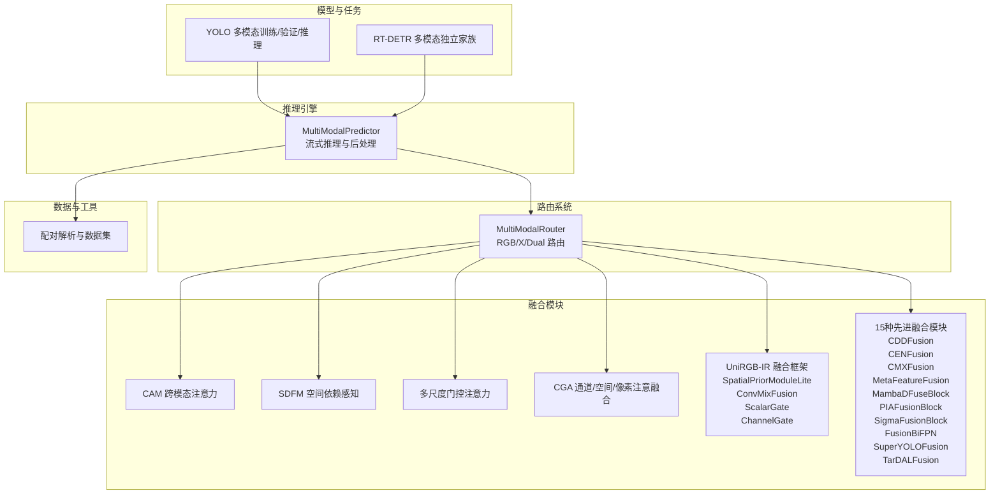
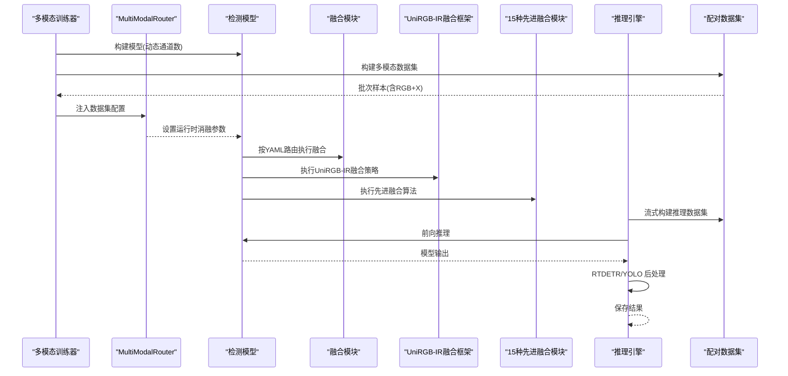

# 特征融合策略

<cite>
**本文档引用的文件**
- [ultralytics/models/yolo/multimodal/__init__.py](file://ultralytics/models/yolo/multimodal/__init__.py)
- [ultralytics/engine/multimodal/predictor.py](file://ultralytics/engine/multimodal/predictor.py)
- [ultralytics/models/yolo/multimodal/train.py](file://ultralytics/models/yolo/multimodal/train.py)
- [ultralytics/models/rtdetrmm/model.py](file://ultralytics/models/rtdetrmm/model.py)
- [ultralytics/nn/mm/router.py](file://ultralytics/nn/mm/router.py)
- [ultralytics/nn/modules/fusion/__init__.py](file://ultralytics/nn/modules/fusion/__init__.py)
- [ultralytics/nn/modules/fusion/cam.py](file://ultralytics/nn/modules/fusion/cam.py)
- [ultralytics/nn/modules/fusion/sdfm.py](file://ultralytics/nn/modules/fusion/sdfm.py)
- [ultralytics/nn/modules/fusion/msga.py](file://ultralytics/nn/modules/fusion/msga.py)
- [ultralytics/nn/modules/fusion/cgafusion.py](file://ultralytics/nn/modules/fusion/cgafusion.py)
- [ultralytics/nn/modules/fusion/UniRGB_IR.py](file://ultralytics/nn/modules/fusion/UniRGB_IR.py)
- [ultralytics/nn/modules/fusion/cddfusion.py](file://ultralytics/nn/modules/fusion/cddfusion.py)
- [ultralytics/nn/modules/fusion/cen_fusion.py](file://ultralytics/nn/modules/fusion/cen_fusion.py)
- [ultralytics/nn/modules/fusion/cmxfusion.py](file://ultralytics/nn/modules/fusion/cmxfusion.py)
- [ultralytics/nn/modules/fusion/metafusion.py](file://ultralytics/nn/modules/fusion/metafusion.py)
- [ultralytics/nn/modules/fusion/mambadfuse.py](file://ultralytics/nn/modules/fusion/mambadfuse.py)
- [ultralytics/nn/modules/fusion/piafusion.py](file://ultralytics/nn/modules/fusion/piafusion.py)
- [ultralytics/nn/modules/fusion/sigmafusion.py](file://ultralytics/nn/modules/fusion/sigmafusion.py)
- [ultralytics/nn/modules/fusion/superyolofusion.py](file://ultralytics/nn/modules/fusion/superyolofusion.py)
- [ultralytics/nn/modules/fusion/tardal_fusion.py](file://ultralytics/nn/modules/fusion/tardal_fusion.py)
- [ultralytics/nn/modules/fusion/fusion_bifpn.py](file://ultralytics/nn/modules/fusion/fusion_bifpn.py)
- [ultralytics/data/multimodal/__init__.py](file://ultralytics/data/multimodal/__init__.py)
- [ultralytics/nn/modules/__init__.py](file://ultralytics/nn/modules/__init__.py)
- [ultralytics/nn/tasks.py](file://ultralytics/nn/tasks.py)
- [ultralytics/cfg/models/rtmm/r18/aifi-dattention-CSP-MutilScaleEdgeInformationEnhance-ASF-P2-lite-ChannelGate.yaml](file://ultralytics/cfg/models/rtmm/r18/aifi-dattention-CSP-MutilScaleEdgeInformationEnhance-ASF-P2-lite-ChannelGate.yaml)
- [ultralytics/cfg/models/rtmm/r18/aifi-dattention-CSP-MutilScaleEdgeInformationEnhance-ASF-P2-lite-ScalarGate-SE.yaml](file://ultralytics/cfg/models/rtmm/r18/aifi-dattention-CSP-MutilScaleEdgeInformationEnhance-ASF-P2-lite-ScalarGate-SE.yaml)
- [ultralytics/cfg/models/rtmm/r18/aifi-dattention-CSP-MutilScaleEdgeInformationEnhance-ASF-P2-lite-CDDFusion.yaml](file://ultralytics/cfg/models/rtmm/r18/aifi-dattention-CSP-MutilScaleEdgeInformationEnhance-ASF-P2-lite-CDDFusion.yaml)
- [ultralytics/cfg/models/rtmm/r18/aifi-dattention-CSP-MutilScaleEdgeInformationEnhance-ASF-P2-lite-CENFusion.yaml](file://ultralytics/cfg/models/rtmm/r18/aifi-dattention-CSP-MutilScaleEdgeInformationEnhance-ASF-P2-lite-CENFusion.yaml)
- [ultralytics/cfg/models/rtmm/r18/aifi-dattention-CSP-MutilScaleEdgeInformationEnhance-ASF-P2-lite-CMXFusion.yaml](file://ultralytics/cfg/models/rtmm/r18/aifi-dattention-CSP-MutilScaleEdgeInformationEnhance-ASF-P2-lite-CMXFusion.yaml)
</cite>

## 更新摘要
**变更内容**
- 新增15种先进融合模块的详细分析和实现说明
- 扩展多模态融合技术谱系，涵盖CVPR 2023、TPAMI 2022等顶级会议的最新成果
- 更新融合模块分类体系，增加基于特征分解、注意力机制、频率域处理等新类别
- 完善性能评估框架，新增针对新模块的调优指南和最佳实践

## 目录
1. [引言](#引言)
2. [项目结构](#项目结构)
3. [核心组件](#核心组件)
4. [架构总览](#架构总览)
5. [详细组件分析](#详细组件分析)
6. [新增融合模块详解](#新增融合模块详解)
7. [依赖分析](#依赖分析)
8. [性能考量](#性能考量)
9. [故障排查指南](#故障排查指南)
10. [结论](#结论)
11. [附录](#附录)

## 引言
本文件面向多模态特征融合策略，系统梳理传统融合方法、深度学习融合技术与注意力机制融合的原理与实现，重点覆盖多尺度特征融合（特征金字塔融合、通道注意力融合、空间注意力融合）、自适应融合策略（动态权重分配、模态重要性评估、自适应参数调整）以及融合策略的性能评估与调优指南。文档以仓库中的多模态推理引擎、训练器、路由系统与融合模块为基础，结合 YAML 层面的"输入源"标记实现"配置驱动"的融合路径。

**更新** 新增UniRGB-IR融合框架相关内容，包括SpatialPriorModuleLite、ConvMixFusion、ScalarGate、ChannelGate等模块的详细说明。同时，新增15种先进融合模块，涵盖基于特征分解的CDDFusion、基于通道交换的CENFusion、基于跨模态校准的CMXFusion、基于元特征的MetaFeatureFusion、基于Mamba架构的MambaDFuseBlock、基于光照感知的PIAFusionBlock、基于频率域的SigmaFusionBlock、基于目标感知的TarDALFusion等最新研究成果。

## 项目结构
围绕多模态特征融合，项目的关键层次如下：
- 模型与任务层：YOLO 多模态训练/验证/推理与 RT-DETR 多模态独立家族
- 推理引擎层：独立的多模态推理器，负责数据集构建、流式推理与后处理
- 路由层：MultiModalRouter 基于 YAML 第五字段实现 RGB/X/Dual 的零拷贝路由
- 融合模块层：跨模态注意力、空间依赖感知、多尺度门控等融合块，**新增UniRGB-IR融合框架**，**新增15种先进融合模块**
- 数据与工具层：配对解析、推理数据集、可视化与评估工具

**图表来源**
- [ultralytics/models/yolo/multimodal/train.py:16-107](file://ultralytics/models/yolo/multimodal/train.py#L16-L107)
- [ultralytics/models/rtdetrmm/model.py:25-57](file://ultralytics/models/rtdetrmm/model.py#L25-L57)
- [ultralytics/engine/multimodal/predictor.py:16-98](file://ultralytics/engine/multimodal/predictor.py#L16-L98)
- [ultralytics/nn/mm/router.py:11-63](file://ultralytics/nn/mm/router.py#L11-L63)
- [ultralytics/nn/modules/fusion/__init__.py:1-68](file://ultralytics/nn/modules/fusion/__init__.py#L1-L68)
- [ultralytics/nn/modules/fusion/UniRGB_IR.py:1-12](file://ultralytics/nn/modules/fusion/UniRGB_IR.py#L1-L12)

**章节来源**
- [ultralytics/models/yolo/multimodal/train.py:16-107](file://ultralytics/models/yolo/multimodal/train.py#L16-L107)
- [ultralytics/models/rtdetrmm/model.py:25-57](file://ultralytics/models/rtdetrmm/model.py#L25-L57)
- [ultralytics/engine/multimodal/predictor.py:16-98](file://ultralytics/engine/multimodal/predictor.py#L16-L98)
- [ultralytics/nn/mm/router.py:11-63](file://ultralytics/nn/mm/router.py#L11-L63)
- [ultralytics/nn/modules/fusion/__init__.py:1-68](file://ultralytics/nn/modules/fusion/__init__.py#L1-L68)

## 核心组件
- 多模态训练器：支持早期/中期/晚期融合的配置驱动路由，支持单模态与双模态训练，动态通道数与 GFLOPs 统计。
- 多模态推理引擎：独立于基础推理器，支持流式推理、RTDETR/YOLO 后处理分支、结果保存。
- 多模态路由器：基于 YAML 第五字段（RGB/X/Dual）实现零拷贝张量路由，支持运行时消融参数注入。
- 融合模块：提供 CAM、SDFM、MSGA、CGA 等融合块，覆盖跨模态注意力、空间依赖感知与多尺度门控，**新增UniRGB-IR融合框架**，**新增15种先进融合模块**。
- 数据与工具：配对解析、推理数据集、可视化与评估工具。

**章节来源**
- [ultralytics/models/yolo/multimodal/train.py:16-107](file://ultralytics/models/yolo/multimodal/train.py#L16-L107)
- [ultralytics/engine/multimodal/predictor.py:16-98](file://ultralytics/engine/multimodal/predictor.py#L16-L98)
- [ultralytics/nn/mm/router.py:11-63](file://ultralytics/nn/mm/router.py#L11-L63)
- [ultralytics/nn/modules/fusion/__init__.py:1-68](file://ultralytics/nn/modules/fusion/__init__.py#L1-L68)

## 架构总览
多模态特征融合的总体流程：训练/验证阶段由训练器解析 YAML，构建模型与数据集；推理阶段由推理引擎加载模型，通过 MultiModalRouter 将 RGB 与 X 模态按配置路由到相应模块；融合模块在骨干网络的不同阶段进行特征交互与融合；最终输出检测框并进行后处理与保存。

**图表来源**
- [ultralytics/models/yolo/multimodal/train.py:472-509](file://ultralytics/models/yolo/multimodal/train.py#L472-L509)
- [ultralytics/nn/mm/router.py:64-69](file://ultralytics/nn/mm/router.py#L64-L69)
- [ultralytics/engine/multimodal/predictor.py:125-142](file://ultralytics/engine/multimodal/predictor.py#L125-L142)
- [ultralytics/nn/modules/fusion/UniRGB_IR.py:389-396](file://ultralytics/nn/modules/fusion/UniRGB_IR.py#L389-L396)

## 详细组件分析

### 传统融合方法
- 早期融合（Early Fusion）：在输入层将 RGB 与 X 按通道拼接，形成 3+X 的统一输入，随后共享骨干网络。该策略在训练器中通过"双模态"与"单模态"两种模式体现，通道数由数据集配置决定。
- 中期融合（Mid Fusion）：在骨干网络中间层分别提取 RGB 与 X 特征，再在特定层进行融合（如拼接、加权、注意力）。路由系统通过 YAML 第五字段标记实现按层路由。
- 晚期融合（Late Fusion）：在高层语义特征上进行融合，通常配合 NMS/后处理进行最终决策。推理引擎对 RTDETR/YOLO 分别提供后处理路径。

实现要点
- 训练器在构建模型时根据是否为双模态设置输入通道数，并在 GFLOPs 统计中区分"路由感知"与"架构级"。
- 推理引擎在流式推理中对 RTDETR 输出进行归一化坐标到像素坐标的转换与 NMS 去重。

**章节来源**
- [ultralytics/models/yolo/multimodal/train.py:664-713](file://ultralytics/models/yolo/multimodal/train.py#L664-L713)
- [ultralytics/engine/multimodal/predictor.py:196-243](file://ultralytics/engine/multimodal/predictor.py#L196-L243)

### 深度学习融合技术
- 特征金字塔融合：通过不同分辨率的特征进行对齐与融合，提升多尺度目标检测能力。在融合模块中，多尺度门控注意力（MSGA）对局部与全局上下文进行融合。
- 通道注意力融合：利用通道统计信息（均值、最大值）生成通道权重，对通道维度进行加权融合。
- 空间注意力融合：基于通道聚合的空间显著性，生成空间权重，实现空间维度的加权融合。

实现要点
- 多尺度门控注意力（MSGA）：包含局部上下文提取、全局显著性提取与门控融合，输出经 BN 与卷积投影。
- CGA 融合：结合空间注意力、通道注意力与像素注意力，对两路输入进行引导式融合。

**章节来源**
- [ultralytics/nn/modules/fusion/msga.py:57-95](file://ultralytics/nn/modules/fusion/msga.py#L57-L95)
- [ultralytics/nn/modules/fusion/cgafusion.py:46-64](file://ultralytics/nn/modules/fusion/cgafusion.py#L46-L64)

### 注意力机制融合
- 跨模态注意力（CAM）：将两路特征映射到公共维度，计算通道×通道的注意力矩阵，实现跨模态信息交互，残差融合并输出对齐左分支通道。
- 空间依赖感知（SDFM）：在混合精度下采用数值稳定的门控融合路径，对低分辨率与高分辨率特征进行加权融合。

实现要点
- CAM：要求两路输入空间尺寸一致，通道维度在首次前向时自适配。
- SDFM：要求输入形状可被 patch 整除，采用 autocast 保护数值稳定。

**章节来源**
- [ultralytics/nn/modules/fusion/cam.py:18-93](file://ultralytics/nn/modules/fusion/cam.py#L18-L93)
- [ultralytics/nn/modules/fusion/sdfm.py:6-83](file://ultralytics/nn/modules/fusion/sdfm.py#L6-L83)

### UniRGB-IR融合框架
**新增** UniRGB-IR融合框架是一套专为RGB-IR多模态设计的轻量化融合策略，包含以下核心模块：

#### SpatialPriorModuleLite（IR侧轻量金字塔）
- **功能**：为红外模态设计的空间先验提取器，通过渐进式下采样构建与YOLO标准尺度完全对齐的多层级特征表示。
- **工作机制**：输入红外图像通过stem_ir模块进行4倍下采样，然后依次通过conv2、conv3、conv4进行8倍、16倍、32倍渐进式下采样，最终输出三元组(T8, T16, T32)。
- **设计优势**：尺度对齐、轻量高效、渐进提取、模块化设计。

#### ConvMixFusion（分组局部卷积融合）
- **功能**：实现分组局部卷积与共享门控的同尺度多模态融合机制。
- **工作机制**：将通道维度分组，每组使用不同尺寸的卷积核进行RGB/IR特征的独立处理，然后通过组内共享的1x1门控网络自适应调节两个模态的融合权重。
- **设计优势**：多尺度感受野、精细化融合、形状保持、计算高效。

#### ScalarGate（标量门控）
- **功能**：实现全局标量门控的多模态融合机制，通过单一标量权重控制整个特征图的RGB-IR融合比例。
- **工作机制**：分别对RGB和IR特征进行全局平均池化(GAP)，得到每个模态的全局描述符，通过1x1卷积(等价于全连接)将联合特征映射为单一标量权重。
- **设计优势**：全局感知、计算高效、直观控制、广播机制。

#### ChannelGate（通道门控）
- **功能**：实现基于Squeeze-and-Excite风格的通道级门控多模态融合机制。
- **工作机制**：分别为每个通道独立学习模态融合权重，通过通道级的精细化控制实现RGB-IR特征的自适应融合。
- **设计优势**：通道级精细控制、SE注意力扩展、可配置压缩比、语义感知能力。

#### SEChannelAttention（单路SE通道注意力）
- **功能**：实现面向融合后特征的单路 SE（Squeeze-and-Excitation）通道注意力优化机制。
- **工作机制**：接收单路张量输入（如 Concat 后的融合特征），通过 SE 结构对各通道的重要性独立建模。
- **设计优势**：通道重要性建模、冗余通道抑制、语义显著通道增强。

实现要点
- **模块注册**：所有UniRGB-IR模块已在`__all__`列表中注册，可通过`ultralytics.nn.modules`直接导入。
- **YAML配置**：支持在YAML配置文件中直接使用，如`ChannelGate`和`ScalarGate`的配置示例。
- **通道推断**：在`tasks.py`中已实现通道数自动推断，无需手动指定通道数。

**章节来源**
- [ultralytics/nn/modules/fusion/UniRGB_IR.py:38-112](file://ultralytics/nn/modules/fusion/UniRGB_IR.py#L38-L112)
- [ultralytics/nn/modules/fusion/UniRGB_IR.py:115-183](file://ultralytics/nn/modules/fusion/UniRGB_IR.py#L115-L183)
- [ultralytics/nn/modules/fusion/UniRGB_IR.py:186-244](file://ultralytics/nn/modules/fusion/UniRGB_IR.py#L186-L244)
- [ultralytics/nn/modules/fusion/UniRGB_IR.py:247-310](file://ultralytics/nn/modules/fusion/UniRGB_IR.py#L247-L310)
- [ultralytics/nn/modules/fusion/UniRGB_IR.py:328-386](file://ultralytics/nn/modules/fusion/UniRGB_IR.py#L328-L386)
- [ultralytics/nn/modules/__init__.py:168-174](file://ultralytics/nn/modules/__init__.py#L168-L174)
- [ultralytics/nn/tasks.py:3316-3344](file://ultralytics/nn/tasks.py#L3316-L3344)

### 多尺度特征融合
- 特征金字塔融合：通过不同尺度的特征对齐与融合，增强对小目标与大目标的检测能力。MSGA 模块在局部与全局之间建立联系，实现多尺度门控融合。
- 通道注意力融合：通过通道统计（均值、最大值）生成通道权重，对通道维度进行加权融合，提升通道表达能力。
- 空间注意力融合：基于通道聚合的空间显著性，生成空间权重，实现空间维度的加权融合，提升空间一致性。

实现要点
- MSGA：包含局部上下文提取（空洞卷积）、全局显著性提取（全局平均池化）与门控融合，输出经 BN 与卷积投影。
- CGA：结合空间注意力、通道注意力与像素注意力，对两路输入进行引导式融合。

**章节来源**
- [ultralytics/nn/modules/fusion/msga.py:44-54](file://ultralytics/nn/modules/fusion/msga.py#L44-L54)
- [ultralytics/nn/modules/fusion/cgafusion.py:46-64](file://ultralytics/nn/modules/fusion/cgafusion.py#L46-L64)

### 自适应融合策略
- 动态权重分配：通过门控模块（如 MSGA 的 selection）对不同尺度或不同模态的特征进行动态加权，实现自适应融合。
- 模态重要性评估：在运行时注入消融参数（如 modality、strategy、seed），路由器据此选择 RGB 或 X 模态进行填充与拼接，实现模态重要性的动态评估与调整。
- 自适应参数调整：在训练器中，GFLOPs 统计支持"路由感知"，便于在不同融合策略下评估计算成本。

实现要点
- 路由器：通过 set_runtime_params 注入运行时参数，支持单模态训练场景下的 RGB/X 填充与通道对齐。
- 训练器：在构建模型前将数据集配置注入 YAML，确保路由器在解析期即可识别 x_modality。

**章节来源**
- [ultralytics/nn/mm/router.py:64-69](file://ultralytics/nn/mm/router.py#L64-L69)
- [ultralytics/models/yolo/multimodal/train.py:696-708](file://ultralytics/models/yolo/multimodal/train.py#L696-L708)

### 性能评估框架与调优指南
- 指标体系：结合 COCO 标准指标与多模态特定指标（如对比学习损失），在验证器中扩展损失项显示。
- 计算复杂度：通过 GFLOPs 统计区分"架构级"与"路由感知"，便于评估不同融合策略的计算成本。
- 推理效率：推理引擎支持流式返回与保存，RTDETR 与 YOLO 后处理路径分离，减少不必要的坐标变换与 NMS 开销。

调优建议
- 融合位置：中期融合通常在骨干网络中段进行，兼顾计算与信息融合；晚期融合适合高层语义融合。
- 注意力模块：在计算受限场景优先选择轻量模块（如 CAM、SDFM、ScalarGate），在资源充足场景可尝试 MSGA、CGA、ConvMixFusion。
- 路由策略：通过 YAML 第五字段精确控制融合层，避免无效融合与冗余计算。

**章节来源**
- [ultralytics/models/yolo/multimodal/train.py:61-67](file://ultralytics/models/yolo/multimodal/train.py#L61-L67)
- [ultralytics/models/yolo/multimodal/train.py:94-105](file://ultralytics/models/yolo/multimodal/train.py#L94-L105)
- [ultralytics/engine/multimodal/predictor.py:196-243](file://ultralytics/engine/multimodal/predictor.py#L196-L243)

## 新增融合模块详解

### 基于特征分解的融合模块

#### CDDFusion（CVPR 2023）
**新增** CDDFusion（Correlation-Driven Dual-Branch Feature Decomposition Fusion）是CVPR 2023的最新研究成果，采用双分支特征分解融合策略。

- **核心思想**：将两路模态特征分解为低频基础特征和高频细节特征，分别进行融合后再重建。
- **技术特点**：
  - SFE_Block：简化的Restormer块，采用BN+ReLU替代GELU，提高AMP训练稳定性
  - BTE_Block：基础特征编码器，通过全局平均池化和MLP生成低频特征
  - DCE_Block：细节特征编码器，使用深度可分离卷积提取高频细节
  - AMP稳定：所有子模块添加BN，避免fp16训练中的NaN问题
- **实现优势**：能够有效分离模态间的互补信息，低频特征捕获全局语义，高频特征保留细节信息

#### MetaFeatureFusion
**新增** MetaFeatureFusion基于元特征嵌入的语义增强融合策略。

- **核心机制**：利用检测分支语义特征（Fej）生成元特征，引导融合分支（Fuj）进行残差融合
- **设计亮点**：
  - 元特征生成器（MFG）：通过三层卷积提取元特征
  - 特征变换器（FT）：生成特征桥梁Ftj
  - 残差融合：Fout = Fuj + Ftj，保证语义信息无损注入
- **应用价值**：在保持融合分支通道数不变的前提下，无损地注入检测分支的语义先验

**章节来源**
- [ultralytics/nn/modules/fusion/cddfusion.py:67-139](file://ultralytics/nn/modules/fusion/cddfusion.py#L67-L139)
- [ultralytics/nn/modules/fusion/metafusion.py:13-66](file://ultralytics/nn/modules/fusion/metafusion.py#L13-L66)

### 基于通道交换的融合模块

#### CENFusion（TPAMI 2022）
**新增** CEN（Channel Exchange Networks）是TPAMI 2022的零参数融合模块。

- **设计理念**：将两路同尺寸特征图的部分通道进行物理交换后相加融合
- **技术特色**：
  - 零参数量：仅进行通道交换，无任何可训练参数
  - 零计算量：交换操作不增加计算复杂度
  - 完美替代：可完全替代Concat+1x1Conv降维操作
- **实现方式**：通过参数p控制交换的通道比例，默认0.5交换一半通道
- **性能优势**：在保持通道数不变的情况下，实现高效的跨模态信息交互

**章节来源**
- [ultralytics/nn/modules/fusion/cen_fusion.py:9-41](file://ultralytics/nn/modules/fusion/cen_fusion.py#L9-L41)

### 基于跨模态校准的融合模块

#### CMXFusion（CVPR）
**新增** CMX（Cross-Modal Fusion Network）采用双向跨模态特征校准策略。

- **核心组件**：CM_FRM（Cross-Modal Feature Rectification Module）
- **双向校准机制**：
  - 通道校准：通过MLP对两路特征进行通道维度的双向校准
  - 空间校准：使用空间注意力生成双向空间权重图
  - 可学习平衡：通过可学习参数λc和λs平衡不同校准路径的贡献
- **轻量化融合**：采用FFM（Feature Fusion Module）进行最终融合，包含1x1Conv、DWConv和1x1Conv的组合
- **技术优势**：既能进行通道级别的语义校准，又能进行空间级别的位置对齐

**章节来源**
- [ultralytics/nn/modules/fusion/cmxfusion.py:66-102](file://ultralytics/nn/modules/fusion/cmxfusion.py#L66-L102)

### 基于架构创新的融合模块

#### MambaDFuseBlock（arXiv:2404.08406）
**新增** MambaDFuse采用双阶段融合设计，结合通道交换和多模态门控。

- **双阶段设计**：
  - Stage 1（浅层）：通道交换（Channel Exchange），零参数基础交互
  - Stage 2（深层）：多模态门控（M3 Block简化版），利用原始模态特征生成SE门控信号
- **门控机制**：分别对RGB和IR模态生成SE通道门控，然后对浅层融合特征进行加权增强
- **模拟建模**：使用DWConv模拟Mamba的SSM空间选择性建模能力
- **训练稳定**：添加输出BN防止AMP fp16训练中的数值溢出

#### SuperYOLOFusion（TGRS 2023）
**新增** SuperYOLO基于对称SE通道注意力的像素级融合模块。

- **对称设计**：对两路模态分别进行SE通道注意力提取
- **跨模态交互**：生成跨模态空间掩码，进行逐元素矩阵乘法
- **残差融合**：通过残差相加后经1x1Conv混合
- **全局校准**：最终进行Concat+SE+1x1Conv降维输出
- **无缝替代**：可完全替代Concat+1x1Conv的传统融合方式

**章节来源**
- [ultralytics/nn/modules/fusion/mambadfuse.py:12-89](file://ultralytics/nn/modules/fusion/mambadfuse.py#L12-L89)
- [ultralytics/nn/modules/fusion/superyolofusion.py:33-106](file://ultralytics/nn/modules/fusion/superyolofusion.py#L33-L106)

### 基于光照感知的融合模块

#### PIAFusionBlock（Information Fusion 2022）
**新增** PIAFusion基于光照感知的渐进式跨模态特征融合。

- **双阶段设计**：
  - Stage 1：光照感知权重（Illumination-Aware Weighting），从可见光特征预测场景亮度
  - Stage 2：跨模态微分感知融合（CMDAF），利用两模态差值特征引导通道注意力
- **权重生成**：通过可见光全局信息预测双模态权重，经过softmax归一化
- **互补增强**：对差值特征进行通道注意力，分别对RGB/IR特征做互补增强
- **输出特性**：输出2C通道，需后续Conv[C,1,1]降维到C

**章节来源**
- [ultralytics/nn/modules/fusion/piafusion.py:13-89](file://ultralytics/nn/modules/fusion/piafusion.py#L13-L89)

### 基于频率域处理的融合模块

#### SigmaFusionBlock（CVPR 2024）
**新增** Sigma基于Siamese Mamba网络的跨模态选择性融合。

- **三阶段设计**：
  - Stage 1：频率解耦（FFT），分离高频（细节）与低频（能量）分量
  - Stage 2：跨模态选择性门控，用红外门控作用于可见光，用可见光门控作用于红外
  - Stage 3：像素级空间门控，生成共用空间掩码实现空间选择性融合
- **频率域创新**：
  - 低频分支：GAP通道门控，感知全局能量
  - 高频分支：逐像素通道门控，感知细节边缘
- **空间门控**：利用两路特征差异生成像素级掩码，过滤噪声并聚合
- **结构增强**：使用DWConv增强空间结构感知能力

**章节来源**
- [ultralytics/nn/modules/fusion/sigmafusion.py:14-160](file://ultralytics/nn/modules/fusion/sigmafusion.py#L14-L160)

### 基于目标感知的融合模块

#### TarDALFusion（CVPR 2022）
**新增** TarDAL基于目标感知的双重对抗学习融合。

- **三阶段设计**：
  - Stage 1：Laplacian梯度增强，对可见光做拉普拉斯边缘提取强化背景纹理梯度
  - Stage 2：双权重解耦（Dual-Weight），分别为红外和可见光生成独立空间权重图
  - Stage 3：加权融合+DWConv平滑，使用多尺度空洞卷积扩大感受野
- **技术创新**：
  - Laplacian梯度分支：固定核检测背景边缘/纹理梯度，零额外开销
  - 双权重解耦：红外/可见光各自拥有独立空间权重图，互不干扰
  - 空洞卷积：多尺度空洞卷积（rate=2,4）更好捕捉小目标整体结构
- **训练稳定**：添加BN稳定AMP fp16训练

#### FusionBiFPN
**新增** BiFPN风格的可学习标量加权融合。

- **设计特点**：对两路同尺寸特征图用正规化可学习权重加权求和
- **参数设计**：仅两个可学习融合权重，参数极少，训练稳定
- **适用场景**：适合轻量化多模态P3融合，通道不一致时先对齐
- **实现方式**：ReLU激活后进行权重正规化，避免负权重影响

**章节来源**
- [ultralytics/nn/modules/fusion/tardal_fusion.py:14-142](file://ultralytics/nn/modules/fusion/tardal_fusion.py#L14-L142)
- [ultralytics/nn/modules/fusion/fusion_bifpn.py:8-41](file://ultralytics/nn/modules/fusion/fusion_bifpn.py#L8-L41)

## 依赖分析
- 训练器依赖：DetectionTrainer、DetectionModel、YOLOMultiModalImageDataset、ContrastController（可选）。
- 推理引擎依赖：PairingResolver、MultiModalInferenceDataset、MultiModalResults、MultiModalSaver。
- 路由系统依赖：generate_modality_filling、adapt_xch。
- 融合模块依赖：PyTorch nn.Module、einops（部分模块）。
- **新增** UniRGB-IR融合框架依赖：PyTorch nn.Module、torch.nn.functional。
- **新增** 15种先进融合模块依赖：PyTorch nn.Module、torch.nn.functional、torch.nn.init。

```mermaid
graph TB
Train["训练器"] --> DetModel["DetectionModel"]
Train --> DS["YOLOMultiModalImageDataset"]
Train --> Contrast["ContrastController"]
Pred["推理引擎"] --> Pairing["PairingResolver"]
Pred --> InferenceDS["MultiModalInferenceDataset"]
Pred --> Results["MultiModalResults"]
Pred --> Saver["MultiModalSaver"]
Router["MultiModalRouter"] --> Fill["generate_modality_filling"]
Router --> Adapt["adapt_xch"]
Fusion["融合模块"] --> PT["PyTorch nn.Module"]
Fusion --> Einops["einops"]
UniRGBIR["UniRGB-IR融合框架"] --> PT
UniRGBIR --> F["torch.nn.functional"]
Advanced["15种先进融合模块"] --> PT
Advanced --> F
Advanced --> Init["torch.nn.init"]
```

**图表来源**
- [ultralytics/models/yolo/multimodal/train.py:6-13](file://ultralytics/models/yolo/multimodal/train.py#L6-L13)
- [ultralytics/engine/multimodal/predictor.py:10-13](file://ultralytics/engine/multimodal/predictor.py#L10-L13)
- [ultralytics/nn/mm/router.py:8-8](file://ultralytics/nn/mm/router.py#L8-L8)
- [ultralytics/nn/modules/fusion/UniRGB_IR.py:14-18](file://ultralytics/nn/modules/fusion/UniRGB_IR.py#L14-L18)

**章节来源**
- [ultralytics/models/yolo/multimodal/train.py:6-13](file://ultralytics/models/yolo/multimodal/train.py#L6-L13)
- [ultralytics/engine/multimodal/predictor.py:10-13](file://ultralytics/engine/multimodal/predictor.py#L10-L13)
- [ultralytics/nn/mm/router.py:8-8](file://ultralytics/nn/mm/router.py#L8-L8)

## 性能考量
- 计算复杂度：通过 GFLOPs 统计区分"架构级"与"路由感知"，便于在不同融合策略下评估计算成本。
- 数值稳定性：SDFM 在混合精度下采用 autocast 保护，避免 NaN 与 Inf；CDDFusion、MambaDFuseBlock、SigmaFusionBlock等模块均添加BN稳定训练。
- 推理吞吐：推理引擎支持流式返回，减少内存占用与等待时间；RTDETR 与 YOLO 后处理路径分离，降低坐标变换与 NMS 成本。
- **新增** UniRGB-IR融合框架优势：所有模块仅使用PyTorch原生组件，避免序列/注意力路径，便于在YOLO主干/Neck的P3/P4/P5等尺度以最小改动接入。
- **新增** 先进融合模块优势：CENFusion零参数、CDDFusion AMP稳定、CMXFusion轻量化、PIAFusionBlock光照感知、SigmaFusionBlock频率域处理等特性。

## 故障排查指南
- 路由失败：确认 YAML 第五字段标记是否正确（RGB/X/Dual），以及输入张量通道数与预期一致。
- 形状不匹配：CAM 要求两路输入空间尺寸一致；SDFM 要求输入形状可被 patch 整除。
- 模态消融：检查运行时参数注入（modality、strategy、seed）是否正确设置。
- 后处理异常：RTDETR 后处理需注意 letterbox 尺寸与原图尺寸的 ratio_pad 传递。
- **新增** UniRGB-IR模块故障排查：
  - ConvMixFusion：确保输入通道数能被分组数整除，核函数数量与分组数相等。
  - ScalarGate/ChannelGate：检查输入张量形状是否一致，通道数是否正确推断。
  - SpatialPriorModuleLite：确认输入通道数与配置一致，输出尺度与YOLO标准对齐。
- **新增** 先进融合模块故障排查：
  - CDDFusion：检查输入通道数是否为256的倍数，AMP训练中BN层是否正常工作。
  - CENFusion：确认交换比例p在[0,1]范围内，输入特征形状是否相同。
  - CMXFusion：检查CM_FRM模块的通道数是否一致，FFM融合路径是否正确。
  - MambaDFuseBlock：确认c1==c2，通道交换比例是否合理。
  - SigmaFusionBlock：检查FFT频率分解是否正常，空间门控掩码是否生成。
  - TarDALFusion：确认Laplacian核是否正确注册为buffer，空洞卷积参数是否合适。

**章节来源**
- [ultralytics/nn/mm/router.py:266-317](file://ultralytics/nn/mm/router.py#L266-L317)
- [ultralytics/nn/modules/fusion/cam.py:67-70](file://ultralytics/nn/modules/fusion/cam.py#L67-L70)
- [ultralytics/nn/modules/fusion/sdfm.py:65-66](file://ultralytics/nn/modules/fusion/sdfm.py#L65-L66)
- [ultralytics/engine/multimodal/predictor.py:323-434](file://ultralytics/engine/multimodal/predictor.py#L323-L434)
- [ultralytics/nn/modules/fusion/UniRGB_IR.py:145-148](file://ultralytics/nn/modules/fusion/UniRGB_IR.py#L145-L148)
- [ultralytics/nn/modules/fusion/UniRGB_IR.py:233-234](file://ultralytics/nn/modules/fusion/UniRGB_IR.py#L233-L234)

## 结论
本项目通过配置驱动的多模态路由与丰富的融合模块，实现了从传统融合到深度学习融合与注意力机制融合的全谱系覆盖。**新增的UniRGB-IR融合框架**进一步丰富了多模态融合策略，提供了轻量化的IR侧特征提取、分组卷积融合、标量门控和通道门控等多种融合方案。**新增的15种先进融合模块**涵盖了最新的多模态融合技术进展，包括基于特征分解的CDDFusion、基于通道交换的CENFusion、基于跨模态校准的CMXFusion、基于元特征的MetaFeatureFusion、基于Mamba架构的MambaDFuseBlock、基于光照感知的PIAFusionBlock、基于频率域的SigmaFusionBlock、基于目标感知的TarDALFusion等顶级会议成果。

借助运行时消融参数与 GFLOPs 统计，可在不同融合策略间进行高效评估与调优。建议在资源受限场景优先采用轻量模块（如 CAM、SDFM、ScalarGate、CENFusion），在追求精度场景引入多尺度门控与跨模态注意力（如 MSGA、CGA、ConvMixFusion、CMXFusion、MetaFeatureFusion），在特殊应用场景可考虑频率域处理（如 SigmaFusionBlock）或光照感知（如 PIAFusionBlock）等专门化模块。

## 附录
- YAML 路由标记：通过第五字段（RGB/X/Dual）实现按层路由，零拷贝张量视图。
- 融合模块导出：融合模块统一在 fusion 子包中导出，便于在 YAML 中直接引用。
- 数据与工具：配对解析、推理数据集与可视化工具，支撑端到端的多模态工作流。
- **新增** UniRGB-IR模块使用示例：
  - ChannelGate配置：在YAML中使用`[[4, 9], 1, ChannelGate, []]`进行通道级门控融合。
  - ScalarGate配置：在YAML中使用`[-1, 1, ScalarGate, []]`进行全局标量门控。
  - SEChannelAttention配置：在YAML中使用`[-1, 1, SEChannelAttention, []]`进行通道注意力精炼。
- **新增** 先进融合模块配置示例：
  - CDDFusion配置：在YAML中使用`[[4, 9], 1, CDDFusion, [256]]`进行双分支特征分解融合。
  - CENFusion配置：在YAML中使用`[[4, 9], 1, CENFusion, [0.5]]`进行零参数通道交换融合。
  - CMXFusion配置：在YAML中使用`[[4, 9], 1, CMXFusion, []]`进行跨模态校准融合。
  - MambaDFuseBlock配置：在YAML中使用`[[4, 9], 1, MambaDFuseBlock, [256, 256, 0.5]]`进行双阶段融合。
  - SigmaFusionBlock配置：在YAML中使用`[[4, 9], 1, SigmaFusionBlock, [256]]`进行频率域选择性融合。
  - TarDALFusion配置：在YAML中使用`[[4, 9], 1, TarDALFusion, [256]]`进行目标感知融合。

**章节来源**
- [ultralytics/nn/mm/router.py:103-155](file://ultralytics/nn/mm/router.py#L103-L155)
- [ultralytics/nn/modules/fusion/__init__.py:1-68](file://ultralytics/nn/modules/fusion/__init__.py#L1-L68)
- [ultralytics/data/multimodal/__init__.py:4-20](file://ultralytics/data/multimodal/__init__.py#L4-L20)
- [ultralytics/cfg/models/rtmm/r18/aifi-dattention-CSP-MutilScaleEdgeInformationEnhance-ASF-P2-lite-ChannelGate.yaml:27](file://ultralytics/cfg/models/rtmm/r18/aifi-dattention-CSP-MutilScaleEdgeInformationEnhance-ASF-P2-lite-ChannelGate.yaml#L27)
- [ultralytics/cfg/models/rtmm/r18/aifi-dattention-CSP-MutilScaleEdgeInformationEnhance-ASF-P2-lite-ScalarGate-SE.yaml:27](file://ultralytics/cfg/models/rtmm/r18/aifi-dattention-CSP-MutilScaleEdgeInformationEnhance-ASF-P2-lite-ScalarGate-SE.yaml#L27)
- [ultralytics/cfg/models/rtmm/r18/aifi-dattention-CSP-MutilScaleEdgeInformationEnhance-ASF-P2-lite-CDDFusion.yaml:26](file://ultralytics/cfg/models/rtmm/r18/aifi-dattention-CSP-MutilScaleEdgeInformationEnhance-ASF-P2-lite-CDDFusion.yaml#L26)
- [ultralytics/cfg/models/rtmm/r18/aifi-dattention-CSP-MutilScaleEdgeInformationEnhance-ASF-P2-lite-CENFusion.yaml:26](file://ultralytics/cfg/models/rtmm/r18/aifi-dattention-CSP-MutilScaleEdgeInformationEnhance-ASF-P2-lite-CENFusion.yaml#L26)
- [ultralytics/cfg/models/rtmm/r18/aifi-dattention-CSP-MutilScaleEdgeInformationEnhance-ASF-P2-lite-CMXFusion.yaml:26](file://ultralytics/cfg/models/rtmm/r18/aifi-dattention-CSP-MutilScaleEdgeInformationEnhance-ASF-P2-lite-CMXFusion.yaml#L26)