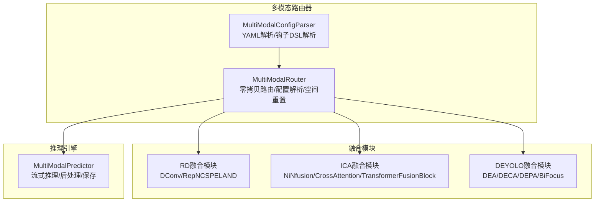
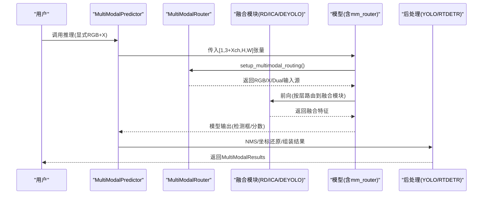
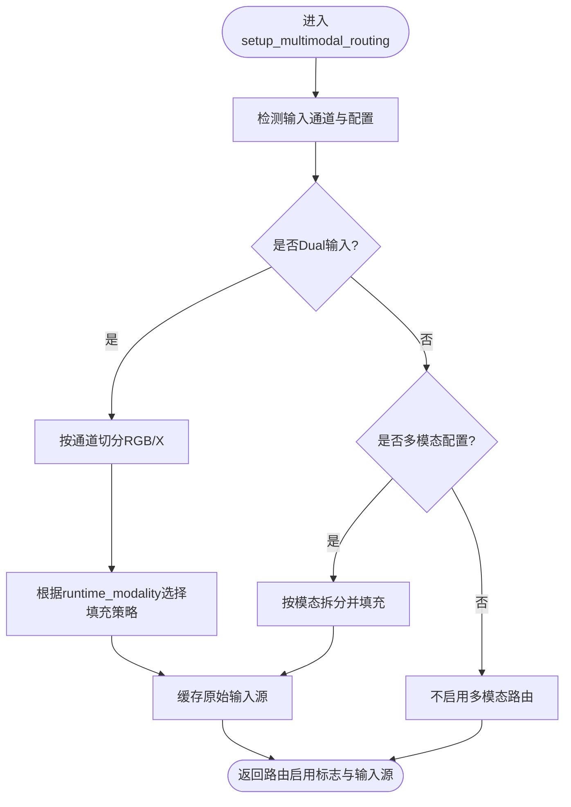
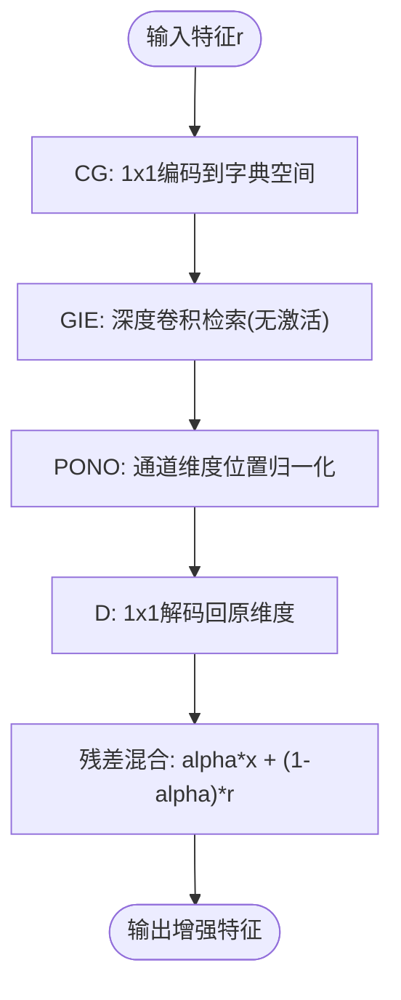
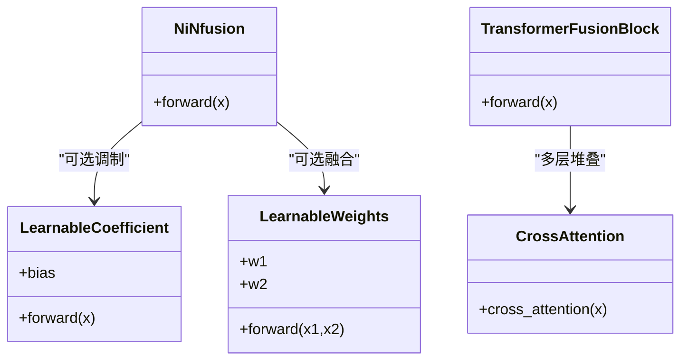
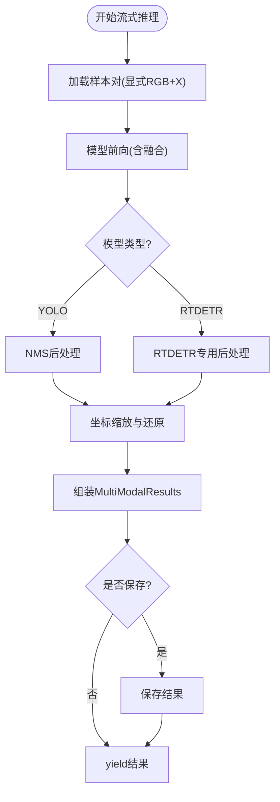
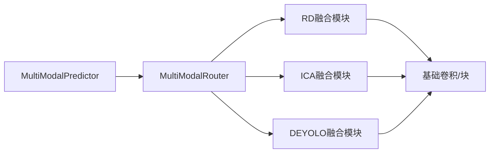

# 自适应融合策略

<cite>
**本文档引用的文件**
- [ultralytics/models/yolo/multimodal/__init__.py](file://ultralytics/models/yolo/multimodal/__init__.py)
- [ultralytics/nn/mm/__init__.py](file://ultralytics/nn/mm/__init__.py)
- [ultralytics/nn/modules/fusion/__init__.py](file://ultralytics/nn/modules/fusion/__init__.py)
- [ultralytics/nn/mm/router.py](file://ultralytics/nn/mm/router.py)
- [ultralytics/nn/mm/parser.py](file://ultralytics/nn/mm/parser.py)
- [ultralytics/nn/modules/fusion/RD.py](file://ultralytics/nn/modules/fusion/RD.py)
- [ultralytics/nn/modules/fusion/icafusion.py](file://ultralytics/nn/modules/fusion/icafusion.py)
- [ultralytics/nn/modules/fusion/deyolo.py](file://ultralytics/nn/modules/fusion/deyolo.py)
- [ultralytics/engine/multimodal/predictor.py](file://ultralytics/engine/multimodal/predictor.py)
</cite>

## 目录
1. [引言](#引言)
2. [项目结构](#项目结构)
3. [核心组件](#核心组件)
4. [架构总览](#架构总览)
5. [详细组件分析](#详细组件分析)
6. [依赖分析](#依赖分析)
7. [性能考量](#性能考量)
8. [故障排查指南](#故障排查指南)
9. [结论](#结论)
10. [附录](#附录)

## 引言
本技术文档聚焦于多模态目标检测中的“自适应特征融合策略”。围绕动态权重分配、模态重要性评估与自适应参数调整三大核心机制，系统阐述RD融合、DEYOLO融合与ICA融合等自适应融合方法的工作原理与实现要点；并给出融合策略的自学习能力、环境适应性与性能优化机制，以及融合策略选择、动态调整与效果评估的实践指南。

## 项目结构
该代码库以“多模态路由器 + 融合模块 + 推理引擎”的分层架构组织，支持RGB与X模态（如深度、热红外等）的零拷贝路由与配置驱动的数据流，提供多种融合策略模块以适配不同任务与场景。



图表来源
- [ultralytics/nn/mm/router.py:11-471](file://ultralytics/nn/mm/router.py#L11-L471)
- [ultralytics/nn/mm/parser.py:9-198](file://ultralytics/nn/mm/parser.py#L9-L198)
- [ultralytics/nn/modules/fusion/RD.py:30-149](file://ultralytics/nn/modules/fusion/RD.py#L30-L149)
- [ultralytics/nn/modules/fusion/icafusion.py:12-450](file://ultralytics/nn/modules/fusion/icafusion.py#L12-L450)
- [ultralytics/nn/modules/fusion/deyolo.py:20-502](file://ultralytics/nn/modules/fusion/deyolo.py#L20-L502)
- [ultralytics/engine/multimodal/predictor.py:16-494](file://ultralytics/engine/multimodal/predictor.py#L16-L494)

章节来源
- [ultralytics/models/yolo/multimodal/__init__.py:1-152](file://ultralytics/models/yolo/multimodal/__init__.py#L1-L152)
- [ultralytics/nn/mm/__init__.py:1-78](file://ultralytics/nn/mm/__init__.py#L1-L78)
- [ultralytics/nn/modules/fusion/__init__.py:1-58](file://ultralytics/nn/modules/fusion/__init__.py#L1-L58)

## 核心组件
- 多模态路由器（MultiModalRouter）：负责识别多模态配置、零拷贝拆分RGB与X输入、按层路由到指定模态、空间重置与缓存。
- 配置解析器（MultiModalConfigParser）：解析YAML配置，识别路由层与钩子规范，辅助构建路由器输入。
- 融合模块族：包含RD融合（字典检索+位置归一化）、ICA融合（NiN融合、交叉注意力、Transformer融合块）、DEYOLO融合（双增强注意力、双向焦点）等。
- 推理引擎（MultiModalPredictor）：流式执行推理，自动后处理（YOLO/NMS或RTDETR专用流程），组装结果并可选保存。

章节来源
- [ultralytics/nn/mm/router.py:11-471](file://ultralytics/nn/mm/router.py#L11-L471)
- [ultralytics/nn/mm/parser.py:9-198](file://ultralytics/nn/mm/parser.py#L9-L198)
- [ultralytics/nn/modules/fusion/RD.py:30-149](file://ultralytics/nn/modules/fusion/RD.py#L30-L149)
- [ultralytics/nn/modules/fusion/icafusion.py:12-450](file://ultralytics/nn/modules/fusion/icafusion.py#L12-L450)
- [ultralytics/nn/modules/fusion/deyolo.py:20-502](file://ultralytics/nn/modules/fusion/deyolo.py#L20-L502)
- [ultralytics/engine/multimodal/predictor.py:16-494](file://ultralytics/engine/multimodal/predictor.py#L16-L494)

## 架构总览
自适应融合策略通过“路由器感知 + 模块自适应 + 推理后处理”的闭环实现：
- 路由器在前向过程中根据配置与运行时参数，将RGB/X输入按层路由至相应融合模块；
- 融合模块内部通过可学习权重、注意力机制与自适应池化等手段实现动态权重分配与模态重要性评估；
- 推理引擎在模型内部完成融合与检测，后处理阶段进行坐标还原与NMS，最终输出统一的结果格式。



图表来源
- [ultralytics/engine/multimodal/predictor.py:99-244](file://ultralytics/engine/multimodal/predictor.py#L99-L244)
- [ultralytics/nn/mm/router.py:157-240](file://ultralytics/nn/mm/router.py#L157-L240)
- [ultralytics/nn/modules/fusion/RD.py:30-149](file://ultralytics/nn/modules/fusion/RD.py#L30-L149)
- [ultralytics/nn/modules/fusion/icafusion.py:310-426](file://ultralytics/nn/modules/fusion/icafusion.py#L310-L426)
- [ultralytics/nn/modules/fusion/deyolo.py:20-502](file://ultralytics/nn/modules/fusion/deyolo.py#L20-L502)

## 详细组件分析

### 多模态路由器（动态路由与空间重置）
- 功能要点
  - 零拷贝拆分：将输入张量按通道切分为RGB与X，或在配置允许时直接按层路由到RGB/X/Dual。
  - 运行时参数：支持在推理时通过runtime_modality选择“仅RGB”或“仅X”，并自动填充另一模态通道数与空间尺寸。
  - 层级路由：依据配置中的第5字段标识（RGB/X/Dual）为模块注入_mm_input_source等属性，实现按层路由。
  - 空间重置：对“X模态新输入起点”层，使用原始X输入进行空间重置，确保后续层在正确空间尺度上处理。
- 关键流程
  - setup_multimodal_routing：根据输入通道数与配置判定是否启用多模态路由，并缓存原始输入。
  - route_layer_input：根据模块的_mm_input_source属性返回对应模态输入。
  - reset_spatial_input：在需要时将X输入重置为原始空间尺寸。



图表来源
- [ultralytics/nn/mm/router.py:157-240](file://ultralytics/nn/mm/router.py#L157-L240)

章节来源
- [ultralytics/nn/mm/router.py:11-471](file://ultralytics/nn/mm/router.py#L11-L471)

### 配置解析器（YAML与钩子DSL）
- 功能要点
  - 验证与统计：统计RGB/X/Dual路由层数量，辅助路由决策。
  - 钩子解析：支持6字段钩子DSL，解析为规范化规格，用于特征采集与可视化。
- 使用建议
  - 在YAML中为需要路由的层添加第5字段（RGB/X/Dual）。
  - 如需特征采集，使用第6字段钩子规范。

章节来源
- [ultralytics/nn/mm/parser.py:9-198](file://ultralytics/nn/mm/parser.py#L9-L198)

### RD融合（字典检索与位置归一化）
- 工作原理
  - DConv：通过“编码-检索-归一化-解码”四阶段，将输入特征映射到高维字典空间进行检索，再经PONO稳定分布，最后与输入残差混合。
  - RepNCSPELAND：在ELAN高效结构基础上叠加DConv，实现结构化特征提取与字典增强的双阶段融合。
- 自适应机制
  - 字典原子数与残差混合因子alpha为可配置超参，可在不同任务中自适应调整。
- 适用场景
  - 需要全局上下文与稳定分布的场景，适合在骨干深层或颈部模块中使用。



图表来源
- [ultralytics/nn/modules/fusion/RD.py:30-91](file://ultralytics/nn/modules/fusion/RD.py#L30-L91)

章节来源
- [ultralytics/nn/modules/fusion/RD.py:30-149](file://ultralytics/nn/modules/fusion/RD.py#L30-L149)

### ICA融合（NiN融合、交叉注意力与Transformer融合块）
- NiNfusion：拼接后经1x1投影与激活，实现轻量级基础融合。
- CrossAttention：为RGB与IR分别构建Q/K/V，实现“你的查询关注我的键值”的交叉注意力，促进跨模态互补。
- TransformerFusionBlock：自适应池化降采样、位置编码、交叉Transformer多层处理、上采样与残差融合，形成端到端的跨模态融合框架。
- 自适应机制
  - 可学习系数与可学习权重模块，通过端到端训练自动学习分支权重与响应强度。
  - 自适应池化与多头注意力，按任务与数据特性自适应调整感受野与交互模式。
- 适用场景
  - 需要深度跨模态交互与结构化融合的场景，如可见光与红外融合。



图表来源
- [ultralytics/nn/modules/fusion/icafusion.py:12-450](file://ultralytics/nn/modules/fusion/icafusion.py#L12-L450)

章节来源
- [ultralytics/nn/modules/fusion/icafusion.py:12-450](file://ultralytics/nn/modules/fusion/icafusion.py#L12-L450)

### DEYOLO融合（双增强注意力与双向焦点）
- DEA：双阶段渐进式增强，先通道后空间，通过跨模态通道注意力（DECA）与空间注意力（DEPA）实现互补增强。
- DECA：全局上下文建模，通过MLP学习通道权重，跨模态交叉赋权。
- DEPA：多尺度空间特征提取，生成空间注意力掩码并通过全局门控调节。
- BiFocus：解耦的水平/垂直焦点分支，三路特征拼接后经深度可分离卷积融合，增强方向性特征表达。
- 自适应机制
  - 通道与空间注意力权重均来自跨模态学习，实现自适应权重分配与模态重要性评估。
  - BiFocus的深度可分离卷积在保持融合效果的同时降低计算开销。
- 适用场景
  - 道路缺陷等具有方向性与空间结构特征的多模态检测任务。

```mermaid
sequenceDiagram
participant RGB as "RGB特征"
participant IR as "IR特征"
participant DECA as "DECA(通道增强)"
participant DEPA as "DEPA(空间增强)"
RGB->>DECA : 全局上下文建模
IR->>DECA : 全局上下文建模
DECA-->>RGB : 跨模态通道权重(用于RGB)
DECA-->>IR : 跨模态通道权重(用于IR)
RGB->>DEPA : 多尺度空间特征
IR->>DEPA : 多尺度空间特征
DEPA-->>RGB : 空间注意力掩码(用于RGB)
DEPA-->>IR : 空间注意力掩码(用于IR)
RGB->>DEA : sigmoid融合
IR->>DEA : sigmoid融合
DEA-->>Out["统一融合特征"]
```

图表来源
- [ultralytics/nn/modules/fusion/deyolo.py:20-225](file://ultralytics/nn/modules/fusion/deyolo.py#L20-L225)

章节来源
- [ultralytics/nn/modules/fusion/deyolo.py:20-502](file://ultralytics/nn/modules/fusion/deyolo.py#L20-L502)

### 推理引擎（流式推理与后处理）
- 功能要点
  - 流式执行：边迭代边yield，支持大规模数据集的实时推理。
  - 模型类型检测：自动识别YOLO与RTDETR输出格式，分别进行后处理。
  - RTDETR后处理：从归一化cxcywh到像素xyxy再到原图坐标的完整流程，含置信度过滤、NMS与最大检测数限制。
  - 结果保存：可选保存可视化与文本标签。
- 自适应性体现
  - 通过Router与融合模块的组合，推理阶段无需额外策略选择，模型内部完成自适应融合。



图表来源
- [ultralytics/engine/multimodal/predictor.py:144-244](file://ultralytics/engine/multimodal/predictor.py#L144-L244)

章节来源
- [ultralytics/engine/multimodal/predictor.py:16-494](file://ultralytics/engine/multimodal/predictor.py#L16-L494)

## 依赖分析
- 组件耦合
  - 路由器与融合模块松耦合：路由器仅负责输入路由与空间重置，融合模块独立实现各自策略。
  - 推理引擎与路由器解耦：推理引擎通过模型属性访问mm_router，不直接依赖具体融合实现。
- 外部依赖
  - 融合模块依赖基础卷积与块模块（Conv、Bottleneck等），保持与主干框架的一致性。
- 循环依赖
  - 未发现循环依赖，模块职责清晰。



图表来源
- [ultralytics/engine/multimodal/predictor.py:16-98](file://ultralytics/engine/multimodal/predictor.py#L16-L98)
- [ultralytics/nn/mm/router.py:11-90](file://ultralytics/nn/mm/router.py#L11-L90)
- [ultralytics/nn/modules/fusion/RD.py:24-26](file://ultralytics/nn/modules/fusion/RD.py#L24-L26)
- [ultralytics/nn/modules/fusion/icafusion.py](file://ultralytics/nn/modules/fusion/icafusion.py#L9)
- [ultralytics/nn/modules/fusion/deyolo.py:16-17](file://ultralytics/nn/modules/fusion/deyolo.py#L16-L17)

章节来源
- [ultralytics/nn/modules/fusion/__init__.py:1-58](file://ultralytics/nn/modules/fusion/__init__.py#L1-L58)

## 性能考量
- 计算效率
  - RD融合采用轻量1x1与深度卷积，RepNCSPELAND在ELAN基础上叠加DConv，整体开销可控。
  - ICA融合的NiNfusion仅拼接+1x1，计算量极小；Transformer融合块通过自适应池化降低复杂度。
  - DEYOLO的BiFocus使用深度可分离卷积融合，显著降低参数与计算。
- 内存与带宽
  - 路由器实现零拷贝拆分，避免重复内存分配；空间重置仅引用原始X输入，减少内存占用。
- 可扩展性
  - 通过可学习权重与注意力机制，融合模块可随任务复杂度自适应调整。

## 故障排查指南
- 路由器未启用
  - 检查YAML中是否存在第5字段（RGB/X/Dual）；确认输入通道数与Xch配置一致。
  - 查看setup_multimodal_routing返回值与日志提示。
- 空间重置异常
  - 确认“X模态新输入起点”层的_mm_new_input_start标记与original_spatial_size缓存正常。
  - 核对X输入通道数与预期一致。
- 推理输出格式异常
  - 自动检测模型类型（YOLO/RTDETR），若输出格式不符合预期，检查模型构建与头层配置。
  - RTDETR后处理需确保最后一维为4+nc，查询数在合理范围。

章节来源
- [ultralytics/nn/mm/router.py:157-240](file://ultralytics/nn/mm/router.py#L157-L240)
- [ultralytics/nn/mm/router.py:365-404](file://ultralytics/nn/mm/router.py#L365-L404)
- [ultralytics/engine/multimodal/predictor.py:245-322](file://ultralytics/engine/multimodal/predictor.py#L245-L322)

## 结论
该自适应融合策略通过“路由器感知 + 模块自适应 + 推理后处理”的一体化设计，实现了动态权重分配、模态重要性评估与自适应参数调整的闭环。RD融合强调全局检索与稳定分布，ICA融合强调跨模态交互与结构化融合，DEYOLO融合强调渐进式通道-空间增强与方向性特征建模。配合零拷贝路由与流式推理，整体具备良好的环境适应性与性能表现。

## 附录
- 实践指南
  - 策略选择：复杂跨模态交互优先ICA；需要全局上下文与稳定分布优先RD；方向性特征为主优先DEYOLO。
  - 动态调整：通过可学习权重与注意力机制在训练中自动优化；必要时调整alpha、池化锚点、多头数等超参。
  - 效果评估：结合检测精度、推理速度与内存占用，综合评估融合策略在目标场景下的性价比。
- 参数调优
  - 融合模块超参：alpha、atoms、vert_anchors×horz_anchors、多头数h、层数n等。
  - 路由器参数：runtime_modality（rgb/x）与strategy（填充策略），在推理时动态切换。
- 性能监控
  - 利用推理引擎的日志与钩子（第6字段）采集中间特征，观察各融合模块的响应强度与注意力分布。