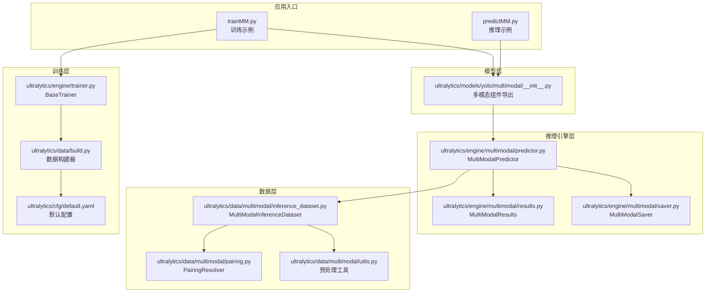
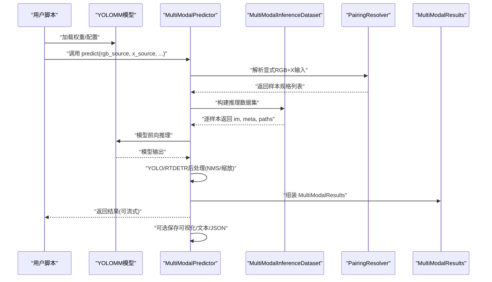
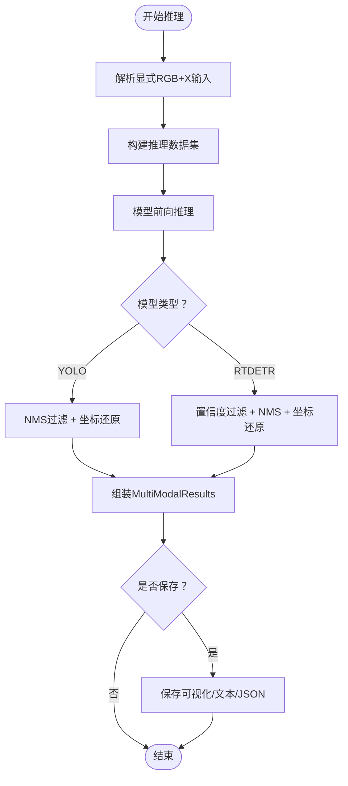
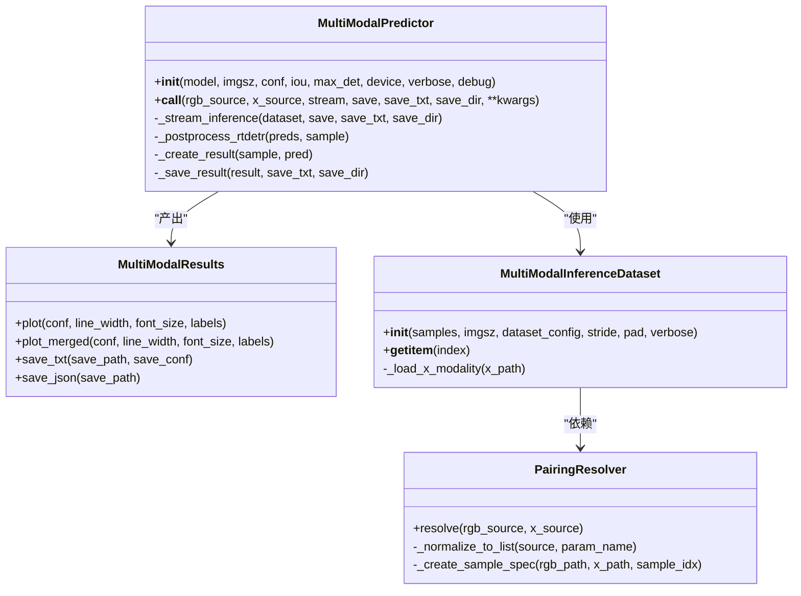
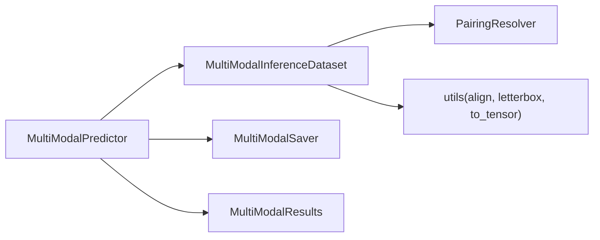

# 基础使用示例

<cite>
**本文引用的文件**
- [trainMM.py](file://trainMM.py)
- [predictMM.py](file://predictMM.py)
- [ultralytics/models/yolo/multimodal/__init__.py](file://ultralytics/models/yolo/multimodal/__init__.py)
- [ultralytics/engine/multimodal/predictor.py](file://ultralytics/engine/multimodal/predictor.py)
- [ultralytics/engine/multimodal/results.py](file://ultralytics/engine/multimodal/results.py)
- [ultralytics/data/multimodal/inference_dataset.py](file://ultralytics/data/multimodal/inference_dataset.py)
- [ultralytics/data/multimodal/pairing.py](file://ultralytics/data/multimodal/pairing.py)
- [ultralytics/data/multimodal/utils.py](file://ultralytics/data/multimodal/utils.py)
- [ultralytics/data/build.py](file://ultralytics/data/build.py)
- [ultralytics/engine/trainer.py](file://ultralytics/engine/trainer.py)
- [ultralytics/cfg/default.yaml](file://ultralytics/cfg/default.yaml)
</cite>

## 目录
1. [简介](#简介)
2. [项目结构](#项目结构)
3. [核心组件](#核心组件)
4. [架构总览](#架构总览)
5. [详细组件分析](#详细组件分析)
6. [依赖关系分析](#依赖关系分析)
7. [性能考虑](#性能考虑)
8. [故障排查指南](#故障排查指南)
9. [结论](#结论)
10. [附录](#附录)

## 简介
本文件面向初学者与实践者，提供多模态检测系统（YOLOMM）的基础使用示例与实操指南。内容覆盖：
- RGB+X 模态联合训练示例
- 单模态训练示例（仅RGB或仅X）
- 多任务推理示例（目标检测、实例分割、旋转框检测）
- 数据集配置、模型加载、训练参数设置、推理结果处理的关键步骤
- 完整可运行的示例脚本路径与参数说明

## 项目结构
围绕多模态推理与训练，系统主要由以下层次构成：
- 模型层：YOLOMM 推理入口与多模态组件导出
- 推理引擎层：独立的多模态推理器、结果容器与数据集
- 数据层：显式配对解析器、推理数据集与预处理工具
- 训练层：通用训练器与数据构建器

**图表来源**
- [trainMM.py:1-15](file://trainMM.py#L1-L15)
- [predictMM.py:1-40](file://predictMM.py#L1-L40)
- [ultralytics/models/yolo/multimodal/__init__.py:1-152](file://ultralytics/models/yolo/multimodal/__init__.py#L1-L152)
- [ultralytics/engine/multimodal/predictor.py:1-494](file://ultralytics/engine/multimodal/predictor.py#L1-L494)
- [ultralytics/engine/multimodal/results.py:1-357](file://ultralytics/engine/multimodal/results.py#L1-L357)
- [ultralytics/data/multimodal/inference_dataset.py:1-252](file://ultralytics/data/multimodal/inference_dataset.py#L1-L252)
- [ultralytics/data/multimodal/pairing.py:1-203](file://ultralytics/data/multimodal/pairing.py#L1-L203)
- [ultralytics/data/multimodal/utils.py:1-180](file://ultralytics/data/multimodal/utils.py#L1-L180)
- [ultralytics/data/build.py:1-200](file://ultralytics/data/build.py#L1-L200)
- [ultralytics/engine/trainer.py:1-200](file://ultralytics/engine/trainer.py#L1-L200)
- [ultralytics/cfg/default.yaml:1-168](file://ultralytics/cfg/default.yaml#L1-L168)

**章节来源**
- [trainMM.py:1-15](file://trainMM.py#L1-L15)
- [predictMM.py:1-40](file://predictMM.py#L1-L40)
- [ultralytics/models/yolo/multimodal/__init__.py:1-152](file://ultralytics/models/yolo/multimodal/__init__.py#L1-L152)

## 核心组件
- 多模态组件导出：提供训练器、验证器、预测器与多模态填充/自体模态生成器的公开API。
- MultiModalPredictor：独立的多模态推理引擎，支持显式RGB+X输入、流式推理、YOLO/RTDETR后处理。
- MultiModalResults：推理结果容器，支持绘制、合并与保存为文本/JSON。
- PairingResolver：显式配对解析器，将rgb_source/x_source解析为样本规格。
- MultiModalInferenceDataset：推理专用数据集，负责加载与预处理RGB/X图像。
- 预处理工具：空间对齐、LetterBox与张量化。
- 训练器与数据构建器：通用训练流程与多模态数据集构建。

**章节来源**
- [ultralytics/models/yolo/multimodal/__init__.py:32-77](file://ultralytics/models/yolo/multimodal/__init__.py#L32-L77)
- [ultralytics/engine/multimodal/predictor.py:16-98](file://ultralytics/engine/multimodal/predictor.py#L16-L98)
- [ultralytics/engine/multimodal/results.py:14-60](file://ultralytics/engine/multimodal/results.py#L14-L60)
- [ultralytics/data/multimodal/pairing.py:11-36](file://ultralytics/data/multimodal/pairing.py#L11-L36)
- [ultralytics/data/multimodal/inference_dataset.py:16-92](file://ultralytics/data/multimodal/inference_dataset.py#L16-L92)
- [ultralytics/data/multimodal/utils.py:13-83](file://ultralytics/data/multimodal/utils.py#L13-L83)
- [ultralytics/engine/trainer.py:59-108](file://ultralytics/engine/trainer.py#L59-L108)
- [ultralytics/data/build.py:115-200](file://ultralytics/data/build.py#L115-L200)

## 架构总览
下图展示了从调用到推理再到结果保存的整体流程。

**图表来源**
- [predictMM.py:7-40](file://predictMM.py#L7-L40)
- [ultralytics/engine/multimodal/predictor.py:99-243](file://ultralytics/engine/multimodal/predictor.py#L99-L243)
- [ultralytics/data/multimodal/inference_dataset.py:94-183](file://ultralytics/data/multimodal/inference_dataset.py#L94-L183)
- [ultralytics/data/multimodal/pairing.py:37-125](file://ultralytics/data/multimodal/pairing.py#L37-L125)
- [ultralytics/engine/multimodal/results.py:436-464](file://ultralytics/engine/multimodal/results.py#L436-L464)

## 详细组件分析

### 训练示例（RGB+X 联合训练）
- 示例脚本：[trainMM.py:1-15](file://trainMM.py#L1-L15)
- 关键点
  - 使用 YOLOMM 初始化模型，加载多模态配置文件
  - 指定数据集路径、训练轮次、批大小等超参
  - 可选启用缓存、断点续训、项目与实验命名
- 数据集配置要点
  - 使用多模态数据集时，需在数据配置中声明RGB与X模态的路径与类别信息
  - 默认配置项可参考：[ultralytics/cfg/default.yaml:134-168](file://ultralytics/cfg/default.yaml#L134-L168)
- 数据集构建
  - 通过数据构建器选择多模态图像数据集类型，支持异步几何扰动、模态擦除等增强策略
  - 参考：[ultralytics/data/build.py:115-200](file://ultralytics/data/build.py#L115-L200)
- 训练器
  - 通用训练器负责训练循环、验证、早停、学习率调度等
  - 参考：[ultralytics/engine/trainer.py:191-200](file://ultralytics/engine/trainer.py#L191-L200)

**章节来源**
- [trainMM.py:1-15](file://trainMM.py#L1-L15)
- [ultralytics/cfg/default.yaml:134-168](file://ultralytics/cfg/default.yaml#L134-L168)
- [ultralytics/data/build.py:115-200](file://ultralytics/data/build.py#L115-L200)
- [ultralytics/engine/trainer.py:191-200](file://ultralytics/engine/trainer.py#L191-L200)

### 单模态训练示例（仅RGB或仅X）
- 适用场景
  - 仅具备RGB图像或仅具备X模态图像时的训练
- 实现思路
  - 在数据配置中仅声明对应模态的数据路径
  - 训练器将根据数据集类型自动切换为单模态训练
- 参考
  - 数据构建器对多模态与单模态的区分：[ultralytics/data/build.py:170-176](file://ultralytics/data/build.py#L170-L176)

**章节来源**
- [ultralytics/data/build.py:170-176](file://ultralytics/data/build.py#L170-L176)

### 推理示例（目标检测、实例分割、旋转框检测）
- 示例脚本：[predictMM.py:1-40](file://predictMM.py#L1-L40)
- 双模态推理（显式RGB+X）
  - 通过 rgb_source 与 x_source 显式传入图像路径
  - 支持流式返回与批量结果
- 单模态推理
  - 仅提供RGB：x_source=None
  - 仅提供X模态：rgb_source=None
- 推理后处理
  - YOLO：使用非极大值抑制（NMS），按元数据还原坐标
  - RTDETR：对查询输出进行置信度过滤、NMS与坐标还原
- 结果保存
  - 可保存可视化图像、YOLO格式文本标签与JSON结果
  - 参考：[ultralytics/engine/multimodal/results.py:235-357](file://ultralytics/engine/multimodal/results.py#L235-L357)

**图表来源**
- [predictMM.py:9-18](file://predictMM.py#L9-L18)
- [ultralytics/engine/multimodal/predictor.py:144-243](file://ultralytics/engine/multimodal/predictor.py#L144-L243)
- [ultralytics/engine/multimodal/results.py:235-357](file://ultralytics/engine/multimodal/results.py#L235-L357)

**章节来源**
- [predictMM.py:1-40](file://predictMM.py#L1-L40)
- [ultralytics/engine/multimodal/predictor.py:144-243](file://ultralytics/engine/multimodal/predictor.py#L144-L243)
- [ultralytics/engine/multimodal/results.py:14-60](file://ultralytics/engine/multimodal/results.py#L14-L60)

### 多模态推理核心类关系

**图表来源**
- [ultralytics/engine/multimodal/predictor.py:16-98](file://ultralytics/engine/multimodal/predictor.py#L16-L98)
- [ultralytics/engine/multimodal/results.py:14-60](file://ultralytics/engine/multimodal/results.py#L14-L60)
- [ultralytics/data/multimodal/inference_dataset.py:16-92](file://ultralytics/data/multimodal/inference_dataset.py#L16-L92)
- [ultralytics/data/multimodal/pairing.py:11-36](file://ultralytics/data/multimodal/pairing.py#L11-L36)

## 依赖关系分析
- 组件耦合
  - MultiModalPredictor 与 MultiModalInferenceDataset 强耦合，前者驱动后者迭代样本
  - MultiModalResults 与绘图/保存模块解耦，便于扩展
- 外部依赖
  - 图像读取与LetterBox依赖OpenCV与自定义工具
  - 模型类型识别依赖模型类名与head类型
- 潜在环路
  - 未发现直接循环依赖；推理链路自上而下

**图表来源**
- [ultralytics/engine/multimodal/predictor.py:16-98](file://ultralytics/engine/multimodal/predictor.py#L16-L98)
- [ultralytics/data/multimodal/inference_dataset.py:16-92](file://ultralytics/data/multimodal/inference_dataset.py#L16-L92)
- [ultralytics/data/multimodal/pairing.py:11-36](file://ultralytics/data/multimodal/pairing.py#L11-L36)
- [ultralytics/data/multimodal/utils.py:13-83](file://ultralytics/data/multimodal/utils.py#L13-L83)

**章节来源**
- [ultralytics/engine/multimodal/predictor.py:16-98](file://ultralytics/engine/multimodal/predictor.py#L16-L98)
- [ultralytics/data/multimodal/inference_dataset.py:16-92](file://ultralytics/data/multimodal/inference_dataset.py#L16-L92)
- [ultralytics/data/multimodal/pairing.py:11-36](file://ultralytics/data/multimodal/pairing.py#L11-L36)
- [ultralytics/data/multimodal/utils.py:13-83](file://ultralytics/data/multimodal/utils.py#L13-L83)

## 性能考虑
- 推理性能
  - 使用流式推理（stream=True）可边迭代边产出，降低内存峰值
  - 适当调整 imgsz 与 batch 以平衡精度与速度
- 数据预处理
  - LetterBox 与通道对齐尽量在CPU侧完成，减少GPU压力
  - X模态通道数严格校验，避免运行时错误导致的重复尝试
- 训练性能
  - 合理设置 AMP、冻结层与早停策略，提升收敛稳定性
  - 多模态增强（异步几何扰动、模态擦除）会增加数据准备时间，可根据场景关闭

## 故障排查指南
- 常见问题
  - X模态通道数不匹配：检查实际通道数与Router配置是否一致
    - 参考：[ultralytics/data/multimodal/utils.py:54-83](file://ultralytics/data/multimodal/utils.py#L54-L83)
  - 文件不存在或路径非法：确认 rgb_source/x_source 与文件存在性
    - 参考：[ultralytics/data/multimodal/pairing.py:175-187](file://ultralytics/data/multimodal/pairing.py#L175-L187)
  - 模型类型识别失败：确保使用 YOLOMM/RTDETRMM 模型
    - 参考：[ultralytics/engine/multimodal/predictor.py:279-321](file://ultralytics/engine/multimodal/predictor.py#L279-L321)
- 调试建议
  - 启用 debug 参数查看中间张量形状与坐标变换过程
    - 参考：[ultralytics/engine/multimodal/predictor.py:58](file://ultralytics/engine/multimodal/predictor.py#L58)

**章节来源**
- [ultralytics/data/multimodal/utils.py:54-83](file://ultralytics/data/multimodal/utils.py#L54-L83)
- [ultralytics/data/multimodal/pairing.py:175-187](file://ultralytics/data/multimodal/pairing.py#L175-L187)
- [ultralytics/engine/multimodal/predictor.py:279-321](file://ultralytics/engine/multimodal/predictor.py#L279-L321)

## 结论
本文提供了多模态检测系统（YOLOMM）从训练到推理的完整基础使用示例，涵盖RGB+X联合训练、单模态训练与多任务推理（目标检测、实例分割、旋转框检测）。通过显式配对解析、独立推理引擎与结果容器，系统实现了高可扩展性与易用性。建议在实际部署中结合硬件资源与任务需求，合理设置 imgsz、batch、增强策略与后处理参数，以获得最佳性能与精度。

## 附录
- 快速开始
  - 训练：参考 [trainMM.py:1-15](file://trainMM.py#L1-L15)
  - 推理：参考 [predictMM.py:1-40](file://predictMM.py#L1-L40)
- 关键参数说明（来自默认配置）
  - 训练相关：epochs、batch、imgsz、device、workers、project、name、exist_ok、pretrained、optimizer、amp、freeze、multi_scale、rect、cos_lr、close_mosaic、resume、fraction、profile、seed、deterministic、single_cls、patience
  - 验证/测试相关：val、split、save_json、conf、iou、max_det、half、dnn、plots
  - 推理相关：source、vid_stride、stream_buffer、visualize、augment、agnostic_nms、classes、retina_masks、embed、show、save_frames、save_txt、save_conf、save_crop、show_labels、show_conf、show_boxes、line_width
  - 多模态扩展：modality、use_multimodal_aug、mm_rgb_albu_enable、mm_rgb_albu_cfg、mm_async_geo_p、mm_async_geo_translate_px、mm_async_geo_rotate_deg、mm_async_geo_target、mm_async_geo_border、mm_modal_dropout_p、mm_modal_dropout_area、mm_modal_dropout_ratio、mm_modal_dropout_target、mm_modal_dropout_fill、mm_modal_dropout_fill_const、mm_x_non_geo_enable、mm_x_non_geo_cfg
  - 参考：[ultralytics/cfg/default.yaml:6-168](file://ultralytics/cfg/default.yaml#L6-L168)