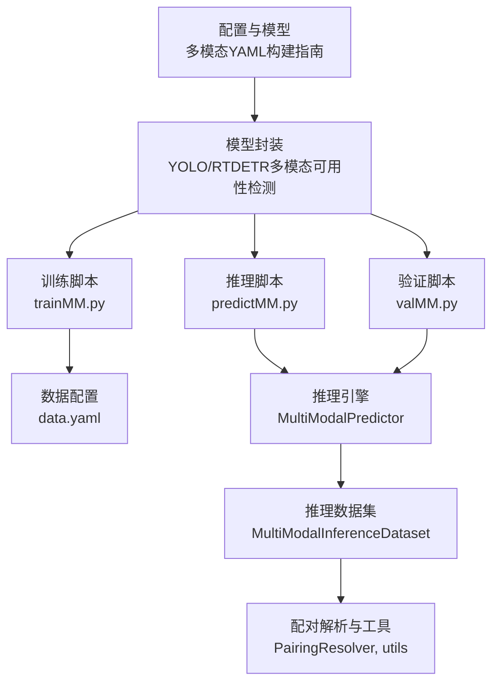
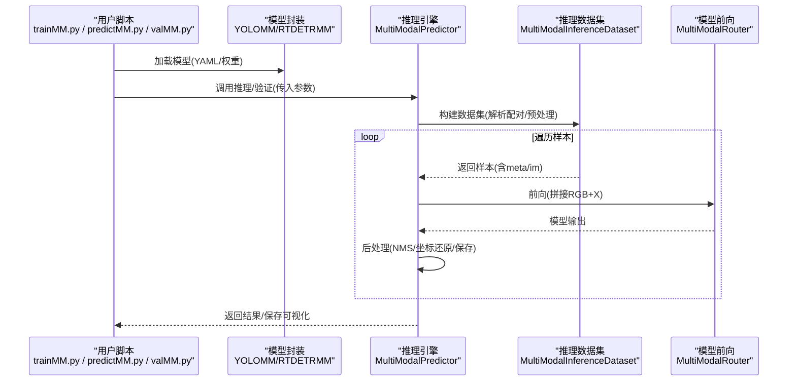
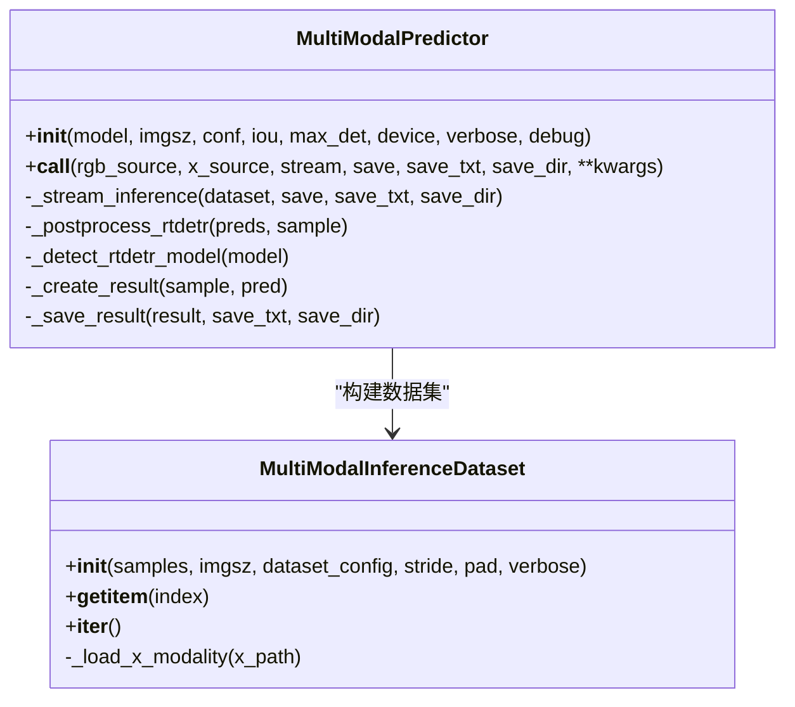
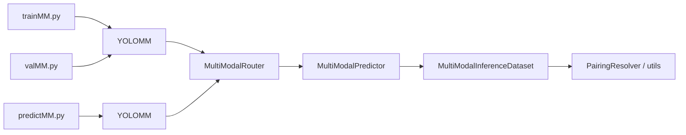

# 示例与教程

<cite>
**本文引用的文件**   
- [ultralytics/__init__.py](file://ultralytics/__init__.py)
- [trainMM.py](file://trainMM.py)
- [predictMM.py](file://predictMM.py)
- [valMM.py](file://valMM.py)
- [data(参考性质).yaml](file://data(参考性质).yaml)
- [ultralytics/cfg/models/多模态YAML构建指点.md](file://ultralytics/cfg/models/多模态YAML构建指点.md)
- [ultralytics/cfg/models/mm/yolo11n-mm-mid.yaml](file://ultralytics/cfg/models/mm/yolo11n-mm-mid.yaml)
- [ultralytics/engine/multimodal/predictor.py](file://ultralytics/engine/multimodal/predictor.py)
- [ultralytics/data/multimodal/inference_dataset.py](file://ultralytics/data/multimodal/inference_dataset.py)
- [ultralytics/data/multimodal/__init__.py](file://ultralytics/data/multimodal/__init__.py)
- [ultralytics/models/yolo/multimodal/__init__.py](file://ultralytics/models/yolo/multimodal/__init__.py)
</cite>

## 目录
1. [简介](#简介)
2. [项目结构](#项目结构)
3. [核心组件](#核心组件)
4. [架构总览](#架构总览)
5. [详细组件分析](#详细组件分析)
6. [依赖分析](#依赖分析)
7. [性能考虑](#性能考虑)
8. [故障排查指南](#故障排查指南)
9. [结论](#结论)
10. [附录](#附录)

## 简介
本教程面向多模态检测系统（RGB+X）的使用者与研究者，提供从基础使用到高级调优的完整示例与实践指南。内容覆盖：
- 基础使用：训练、推理、验证的示例代码与配置说明
- 高级技巧：自定义模态生成、融合策略调优、性能优化
- 端到端案例：从数据准备到模型部署的全流程
- 场景化方案：针对不同应用的定制化建议与最佳实践
- 注释与运行说明：所有示例均提供路径与说明，便于快速上手

## 项目结构
该仓库围绕“配置驱动 + 多模态路由器（MultiModalRouter）”组织，核心模块包括：
- 配置与模型：多模态 YAML 构建指南与标准范式
- 引擎与数据：独立的多模态推理引擎与推理数据集
- 模型封装：YOLOMM/RTDETRMM 的可用性检测与导出
- 示例脚本：训练、推理、验证的参考用法

**图表来源**
- [ultralytics/cfg/models/多模态YAML构建指点.md:1-239](file://ultralytics/cfg/models/多模态YAML构建指点.md#L1-L239)
- [ultralytics/__init__.py:14-85](file://ultralytics/__init__.py#L14-L85)
- [trainMM.py:1-15](file://trainMM.py#L1-L15)
- [predictMM.py:1-40](file://predictMM.py#L1-L40)
- [valMM.py:1-22](file://valMM.py#L1-L22)
- [ultralytics/engine/multimodal/predictor.py:16-98](file://ultralytics/engine/multimodal/predictor.py#L16-L98)
- [ultralytics/data/multimodal/inference_dataset.py:16-90](file://ultralytics/data/multimodal/inference_dataset.py#L16-L90)
- [ultralytics/data/multimodal/__init__.py:4-20](file://ultralytics/data/multimodal/__init__.py#L4-L20)

**章节来源**
- [ultralytics/cfg/models/多模态YAML构建指点.md:1-239](file://ultralytics/cfg/models/多模态YAML构建指点.md#L1-L239)
- [ultralytics/__init__.py:14-85](file://ultralytics/__init__.py#L14-L85)

## 核心组件
- 模型封装与可用性检测：动态导入 YOLOMM/RTDETRMM 与多模态生成器，提供条件可用性与导出清单
- 多模态推理引擎：独立于通用预测器，负责数据集构建、前向、后处理与结果保存
- 推理数据集：严格校验输入，统一 LetterBox 预处理，支持单模态零填充
- 多模态 YAML 构建指南：统一范式、分支书写规范、常见融合模板与验证排查清单

**章节来源**
- [ultralytics/__init__.py:14-85](file://ultralytics/__init__.py#L14-L85)
- [ultralytics/engine/multimodal/predictor.py:16-98](file://ultralytics/engine/multimodal/predictor.py#L16-L98)
- [ultralytics/data/multimodal/inference_dataset.py:16-90](file://ultralytics/data/multimodal/inference_dataset.py#L16-L90)
- [ultralytics/cfg/models/多模态YAML构建指点.md:9-64](file://ultralytics/cfg/models/多模态YAML构建指点.md#L9-L64)

## 架构总览
下图展示了多模态检测的端到端流程：从脚本入口到推理引擎与数据集，再到模型前向与后处理。

**图表来源**
- [trainMM.py:6-14](file://trainMM.py#L6-L14)
- [predictMM.py:7-18](file://predictMM.py#L7-L18)
- [valMM.py:9-18](file://valMM.py#L9-L18)
- [ultralytics/engine/multimodal/predictor.py:99-143](file://ultralytics/engine/multimodal/predictor.py#L99-L143)
- [ultralytics/data/multimodal/inference_dataset.py:94-183](file://ultralytics/data/multimodal/inference_dataset.py#L94-L183)

## 详细组件分析

### 训练示例：YOLOMM 基础训练
- 目标：使用 YOLOMM 训练多模态检测模型
- 关键点：
  - 指定 YAML 模型配置与数据集配置路径
  - 可选参数：epochs、batch、缓存、项目与实验名
  - 模态消融参数（如需）谨慎启用
- 运行说明：
  - 修改脚本中的 YAML 与 data.yaml 路径
  - 确保 GPU/CPU 设备可用
  - 训练完成后在指定项目目录下查看日志与权重

**章节来源**
- [trainMM.py:1-15](file://trainMM.py#L1-L15)

### 推理示例：多模态与单模态
- 目标：演示双模态与单模态（RGB/红外）推理
- 关键点：
  - 新版 API 显式传入 rgb_source 与 x_source
  - 支持流式返回与结果保存
  - 单模态可通过将另一模态置空实现零填充
- 运行说明：
  - 替换脚本中的图像路径
  - 可开启 debug 查看中间日志
  - 结果保存在指定项目/名称目录

**章节来源**
- [predictMM.py:1-40](file://predictMM.py#L1-L40)

### 验证示例：多模态验证
- 目标：对已训练模型进行验证
- 关键点：
  - 指定 data.yaml 与验证集划分
  - 可指定设备（CPU/GPU）
  - 可选 modality 参数进行单模态验证
- 运行说明：
  - 准备验证数据集与 YAML
  - 指定权重路径与验证集 split
  - 查看指标与日志

**章节来源**
- [valMM.py:1-22](file://valMM.py#L1-L22)

### 数据配置：多模态数据集
- 目标：定义多模态数据集路径与类别
- 关键点：
  - path 为根目录，train/val/test 为相对路径
  - modality 定义各模态子目录
  - modality_used 指定本次训练使用的模态组合
  - names 定义类别映射
- 运行说明：
  - 确保图像与标注路径正确
  - 与 YAML 的 Xch 保持一致

**章节来源**
- [data(参考性质).yaml](file://data(参考性质).yaml#L1-L28)

### 多模态 YAML 构建指南
- 目标：指导按“配置驱动 + 第5字段路由”编写多模态 YAML
- 关键点：
  - 第5字段：'RGB' | 'X' | 'Dual'
  - 通道规则：RGB 固定3通道，X 由 Xch 决定，Dual=3+Xch
  - 分支书写规范：先连续写完RGB分支，再连续写X分支，融合点明确
  - 常见融合范式：早期融合、中期融合、晚期融合
  - 与 data.yaml 配合：modality_used、modality、Xch
- 运行说明：
  - 按模板修改 backbone/head
  - 使用 model.info()/profile=True 检查形状与路由
  - 遵循最小可用清单逐项核对

**章节来源**
- [ultralytics/cfg/models/多模态YAML构建指点.md:9-64](file://ultralytics/cfg/models/多模态YAML构建指点.md#L9-L64)
- [ultralytics/cfg/models/多模态YAML构建指点.md:165-178](file://ultralytics/cfg/models/多模态YAML构建指点.md#L165-L178)
- [ultralytics/cfg/models/多模态YAML构建指点.md:206-235](file://ultralytics/cfg/models/多模态YAML构建指点.md#L206-L235)

### 标准中期融合 YAML 示例
- 目标：提供可直接使用的中期融合 YAML 模板
- 关键点：
  - 双路独立骨干至 P5
  - 在 P4/P5 层进行 Concat + C3k2/C2PSA 融合
  - 标准检测头（FPN/PAN + Detect）
- 运行说明：
  - 作为多模态基准模型，适用于多数互补模态任务
  - 可据此调整 scales 与网络深度宽度

**章节来源**
- [ultralytics/cfg/models/mm/yolo11n-mm-mid.yaml:1-75](file://ultralytics/cfg/models/mm/yolo11n-mm-mid.yaml#L1-L75)

### 多模态推理引擎（核心）
- 目标：独立的多模态推理引擎，负责数据集构建、前向、后处理与保存
- 关键点：
  - 从模型读取 Router 配置（Xch、X 模态类型）
  - 支持 YOLO 与 RTDETR 后处理分支
  - 流式推理：边迭代边 yield
  - 可选保存 txt/json 与可视化
- 运行说明：
  - 传入 rgb_source/x_source 与推理参数
  - 可开启 debug 查看模型输出与坐标变换过程

**图表来源**
- [ultralytics/engine/multimodal/predictor.py:16-98](file://ultralytics/engine/multimodal/predictor.py#L16-L98)
- [ultralytics/engine/multimodal/predictor.py:144-244](file://ultralytics/engine/multimodal/predictor.py#L144-L244)
- [ultralytics/data/multimodal/inference_dataset.py:16-90](file://ultralytics/data/multimodal/inference_dataset.py#L16-L90)
- [ultralytics/data/multimodal/inference_dataset.py:94-183](file://ultralytics/data/multimodal/inference_dataset.py#L94-L183)

**章节来源**
- [ultralytics/engine/multimodal/predictor.py:16-98](file://ultralytics/engine/multimodal/predictor.py#L16-L98)
- [ultralytics/engine/multimodal/predictor.py:144-244](file://ultralytics/engine/multimodal/predictor.py#L144-L244)
- [ultralytics/data/multimodal/inference_dataset.py:16-90](file://ultralytics/data/multimodal/inference_dataset.py#L16-L90)
- [ultralytics/data/multimodal/inference_dataset.py:94-183](file://ultralytics/data/multimodal/inference_dataset.py#L94-L183)

### 推理数据集（细节）
- 目标：严格校验输入，统一预处理，支持单模态零填充
- 关键点：
  - LetterBox 预处理（推理模式不放大）
  - RGB 通道顺序转换与归一化
  - X 模态通道数校验与空间对齐
  - 拼接为 [1, 3+Xch, H, W]
- 运行说明：
  - 支持多种 X 模态文件格式（npy/npz/tiff/png/jpg 等）
  - 若某模态缺失，使用零填充并记录 ratio_pad

**章节来源**
- [ultralytics/data/multimodal/inference_dataset.py:16-90](file://ultralytics/data/multimodal/inference_dataset.py#L16-L90)
- [ultralytics/data/multimodal/inference_dataset.py:94-183](file://ultralytics/data/multimodal/inference_dataset.py#L94-L183)
- [ultralytics/data/multimodal/inference_dataset.py:185-246](file://ultralytics/data/multimodal/inference_dataset.py#L185-L246)

### 多模态数据组件导出
- 目标：统一导出配对解析、推理数据集与工具函数
- 关键点：
  - PairingResolver：解析 rgb/x 源配对
  - MultiModalInferenceDataset：推理数据集
  - to_tensor_rgb/to_tensor_x/letterbox_with_ratio_pad 等工具

**章节来源**
- [ultralytics/data/multimodal/__init__.py:4-20](file://ultralytics/data/multimodal/__init__.py#L4-L20)

### 模型封装与可用性检测
- 目标：动态导入 YOLOMM/RTDETRMM 与多模态生成器
- 关键点：
  - 条件导入失败时设置为 None
  - 动态生成 __all__ 清单
  - 提供 YOLO/RTDETR 等标准模型入口

**章节来源**
- [ultralytics/__init__.py:14-85](file://ultralytics/__init__.py#L14-L85)

### 多模态组件总览（模型侧）
- 目标：提供多模态训练/验证/预测器与模态填充、自体模态生成能力
- 关键点：
  - MultiModalDetectionTrainer/Validator/Predictor
  - ModalityFiller/generate_modality_filling
  - SelfModalGenerator/generate_self_modality/default_self_modal_generator
- 运行说明：
  - 通过 __init__.py 统一导出，便于直接使用

**章节来源**
- [ultralytics/models/yolo/multimodal/__init__.py:19-77](file://ultralytics/models/yolo/multimodal/__init__.py#L19-L77)

## 依赖分析
- 模块耦合：
  - 推理引擎与数据集解耦，便于替换与扩展
  - 模型封装与 YAML/数据配置解耦，通过 Router 驱动
- 外部依赖：
  - OpenCV、NumPy、PyTorch、torchvision（NMS）
- 潜在风险：
  - 模块导入失败时的降级处理
  - YAML 第5字段标注错误导致通道不匹配

**图表来源**
- [trainMM.py:4-14](file://trainMM.py#L4-L14)
- [predictMM.py:6-18](file://predictMM.py#L6-L18)
- [valMM.py:9-18](file://valMM.py#L9-L18)
- [ultralytics/engine/multimodal/predictor.py:60-68](file://ultralytics/engine/multimodal/predictor.py#L60-L68)
- [ultralytics/data/multimodal/inference_dataset.py:125-136](file://ultralytics/data/multimodal/inference_dataset.py#L125-L136)
- [ultralytics/data/multimodal/__init__.py:4-11](file://ultralytics/data/multimodal/__init__.py#L4-L11)

**章节来源**
- [ultralytics/engine/multimodal/predictor.py:60-68](file://ultralytics/engine/multimodal/predictor.py#L60-L68)
- [ultralytics/data/multimodal/inference_dataset.py:125-136](file://ultralytics/data/multimodal/inference_dataset.py#L125-L136)

## 性能考虑
- 推理性能：
  - 使用合适的 imgsz 与 batch
  - 启用流式推理以降低内存峰值
  - 在 GPU 上运行并合理设置设备
- 训练性能：
  - 合理设置 epochs 与学习率调度
  - 使用缓存（cache）减少 I/O
  - 选择合适融合策略以平衡精度与速度
- 数据预处理：
  - 统一 LetterBox 预处理，避免重复缩放
  - X 模态通道数与 YAML/Xch 保持一致，减少校验开销

## 故障排查指南
- 通道不匹配：
  - 现象：报错提示期望 X 通道但得到 Y
  - 排查：检查 data.yaml 的 Xch 与 YAML 第5字段标注
- 模块未导入：
  - 现象：ImportError 指示 YAML 中使用了未找到模块
  - 排查：确认模块在相应 __init__.py 导出
- 结果融合：
  - 说明：示例中晚期融合的 DecisionFusion 为占位注释，需自行实现或外部融合
- 运行确认：
  - 使用 profile=True 查看 Router 路由日志
  - 在 debug 模式下观察模型输出与坐标变换

**章节来源**
- [ultralytics/cfg/models/多模态YAML构建指点.md:206-217](file://ultralytics/cfg/models/多模态YAML构建指点.md#L206-L217)

## 结论
本教程提供了多模态检测系统从入门到进阶的完整示例与实践指南。通过配置驱动与多模态路由器机制，系统实现了灵活的融合策略与稳定的推理流程。建议读者结合自身数据与任务，按 YAML 构建指南与示例脚本进行定制化开发，并在调试与验证阶段充分利用 debug/profile 能力进行问题定位与性能优化。

## 附录

### 端到端案例：从数据准备到模型部署
- 数据准备：
  - 准备 RGB 与 X 模态图像与标注
  - 编写 data.yaml，设置 path/modality/modality_used/Xch/names
- 模型设计：
  - 参考多模态 YAML 构建指南，选择早期/中期/晚期融合策略
  - 使用 yolo11n-mm-mid.yaml 作为基准模板
- 训练：
  - 使用 trainMM.py 指定 YAML 与 data.yaml 路径
  - 设置 epochs/batch/exist_ok/project/name
- 推理：
  - 使用 predictMM.py 指定权重路径与 rgb/x 源
  - 支持双模态与单模态推理，可开启 debug 与保存
- 验证：
  - 使用 valMM.py 指定验证集与设备
- 部署：
  - 保存 best.pt 权重并在生产环境加载
  - 可结合流式推理实现实时检测

**章节来源**
- [data(参考性质).yaml](file://data(参考性质).yaml#L1-L28)
- [ultralytics/cfg/models/多模态YAML构建指点.md:181-191](file://ultralytics/cfg/models/多模态YAML构建指点.md#L181-L191)
- [trainMM.py:6-14](file://trainMM.py#L6-L14)
- [predictMM.py:7-18](file://predictMM.py#L7-L18)
- [valMM.py:9-18](file://valMM.py#L9-L18)