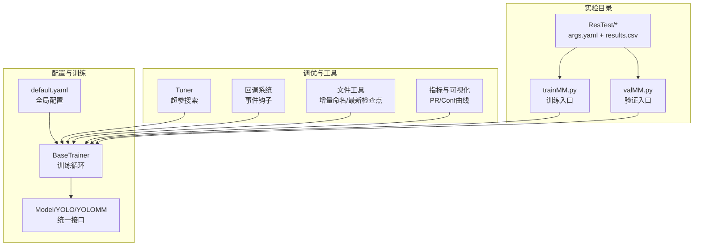
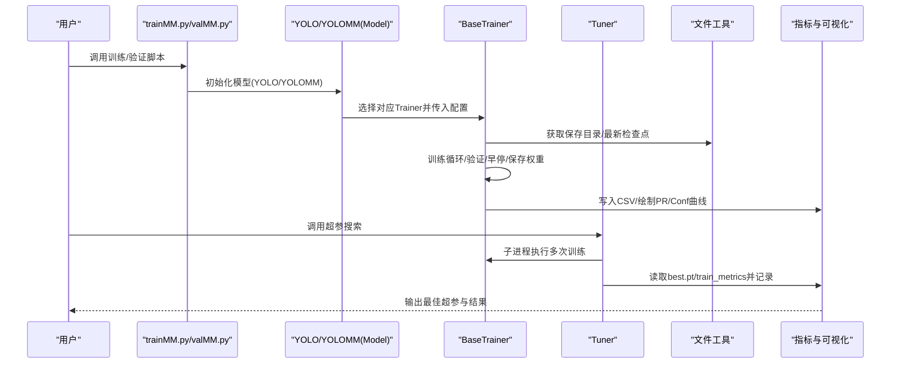
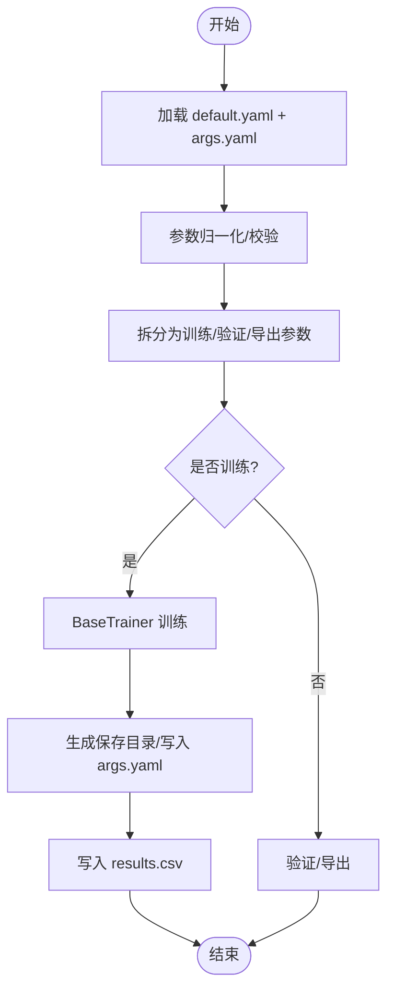
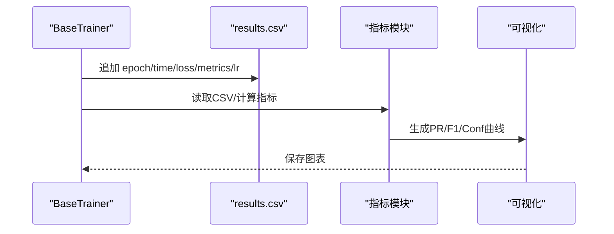
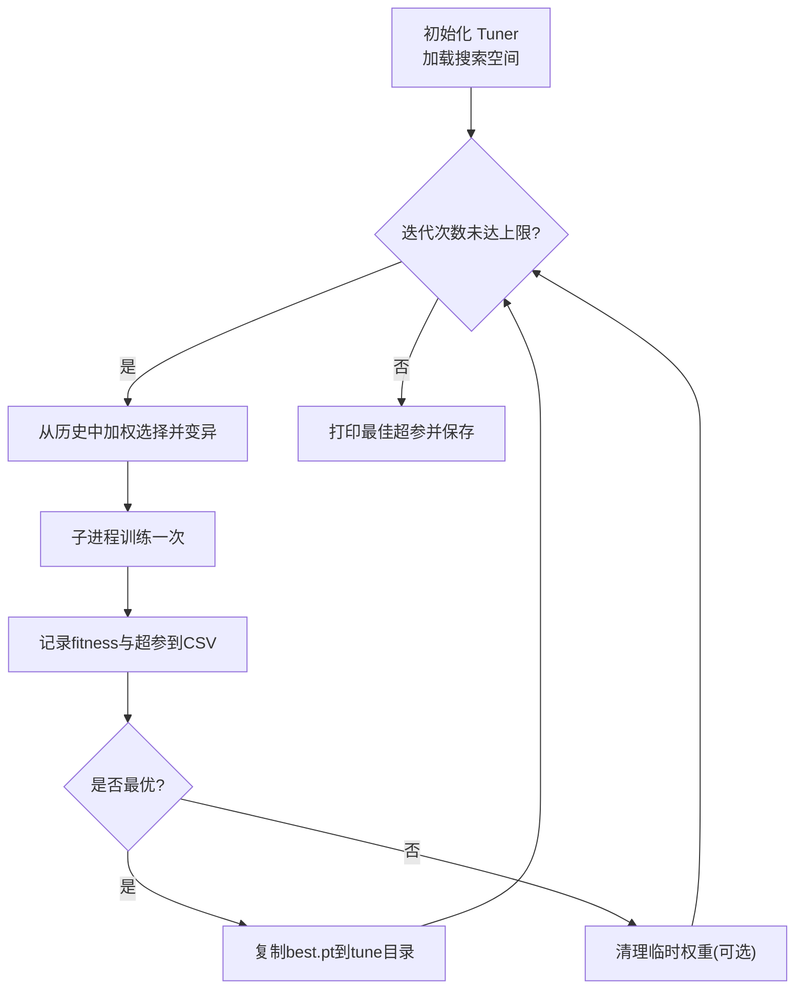
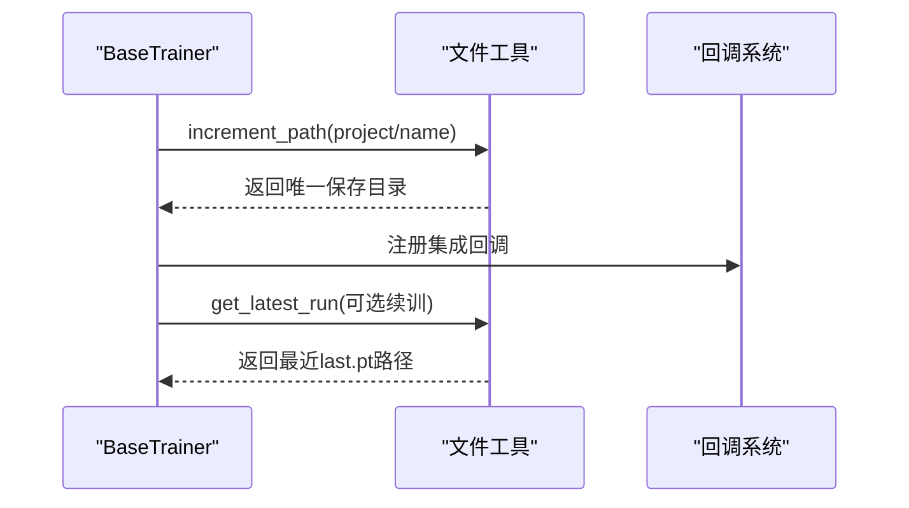
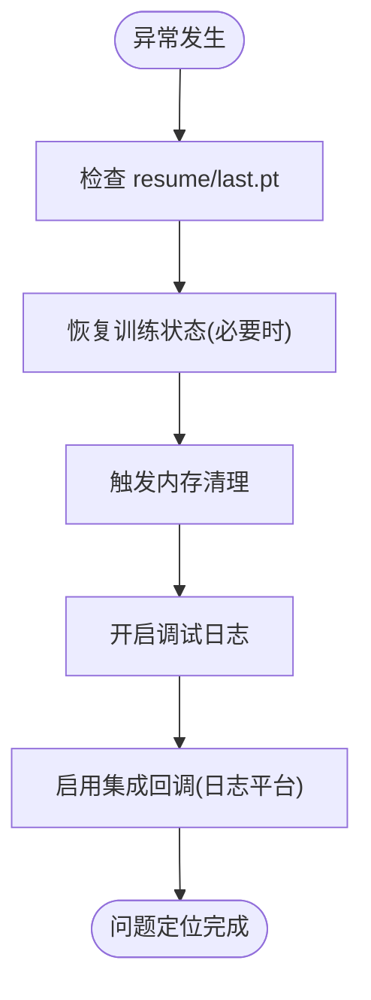
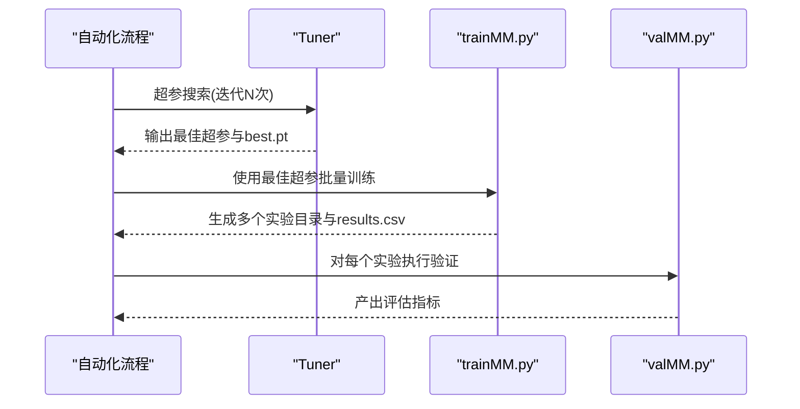
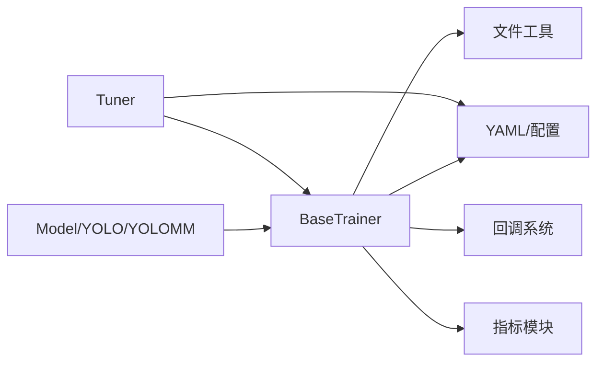

# 实验管理最佳实践

<cite>
**本文档引用的文件**
- [ultralytics/cfg/default.yaml](file://ultralytics/cfg/default.yaml)
- [ultralytics/engine/trainer.py](file://ultralytics/engine/trainer.py)
- [ultralytics/engine/tuner.py](file://ultralytics/engine/tuner.py)
- [ultralytics/engine/model.py](file://ultralytics/engine/model.py)
- [ultralytics/models/yolo/model.py](file://ultralytics/models/yolo/model.py)
- [ultralytics/utils/callbacks/base.py](file://ultralytics/utils/callbacks/base.py)
- [ultralytics/utils/files.py](file://ultralytics/utils/files.py)
- [ultralytics/utils/metrics.py](file://ultralytics/utils/metrics.py)
- [trainMM.py](file://trainMM.py)
- [valMM.py](file://valMM.py)
- [ResTest/aifi-dattention-CSP-MutilScaleEdgeInformationEnhance-ASF-P2-lite-BackboneFreqFusion/args.yaml](file://ResTest/aifi-dattention-CSP-MutilScaleEdgeInformationEnhance-ASF-P2-lite-BackboneFreqFusion/args.yaml)
</cite>

## 目录
1. [引言](#引言)
2. [项目结构](#项目结构)
3. [核心组件](#核心组件)
4. [架构总览](#架构总览)
5. [详细组件分析](#详细组件分析)
6. [依赖关系分析](#依赖关系分析)
7. [性能考虑](#性能考虑)
8. [故障诊断指南](#故障诊断指南)
9. [结论](#结论)
10. [附录](#附录)

## 引言
本指南面向多模态目标检测实验的全生命周期管理，结合仓库中的训练框架、超参数调优工具与实验目录结构，总结出一套可复用的最佳实践。内容覆盖实验配置设计、参数组织、配置文件结构、实验标识、结果记录与分析、超参数搜索策略、版本与跟踪机制、失败诊断与调试、以及自动化实验流程设计。

## 项目结构
该仓库围绕 Ultralytics 多模态（YOLOMM）训练框架组织，包含：
- 配置与训练核心：ultralytics/cfg/default.yaml、ultralytics/engine/trainer.py、ultralytics/engine/model.py
- 超参数调优：ultralytics/engine/tuner.py
- 模型封装与多模态能力：ultralytics/models/yolo/model.py（含 YOLOMM 类）
- 回调与文件工具：ultralytics/utils/callbacks/base.py、ultralytics/utils/files.py
- 实战脚本与样例配置：trainMM.py、valMM.py、ResTest 下的 args.yaml
- 指标与可视化：ultralytics/utils/metrics.py

**图表来源**
- [ultralytics/cfg/default.yaml:1-168](file://ultralytics/cfg/default.yaml#L1-L168)
- [ultralytics/engine/trainer.py:110-177](file://ultralytics/engine/trainer.py#L110-L177)
- [ultralytics/engine/tuner.py:62-108](file://ultralytics/engine/tuner.py#L62-L108)
- [ultralytics/engine/model.py:238-271](file://ultralytics/engine/model.py#L238-L271)
- [ultralytics/models/yolo/model.py:456-741](file://ultralytics/models/yolo/model.py#L456-L741)
- [ultralytics/utils/callbacks/base.py:144-191](file://ultralytics/utils/callbacks/base.py#L144-L191)
- [ultralytics/utils/files.py:108-153](file://ultralytics/utils/files.py#L108-L153)
- [ultralytics/utils/metrics.py:552-640](file://ultralytics/utils/metrics.py#L552-L640)
- [trainMM.py:1-15](file://trainMM.py#L1-L15)
- [valMM.py:1-22](file://valMM.py#L1-L22)

**章节来源**
- [ultralytics/cfg/default.yaml:1-168](file://ultralytics/cfg/default.yaml#L1-L168)
- [ultralytics/engine/trainer.py:110-177](file://ultralytics/engine/trainer.py#L110-L177)
- [ultralytics/engine/model.py:238-271](file://ultralytics/engine/model.py#L238-L271)
- [ultralytics/models/yolo/model.py:456-741](file://ultralytics/models/yolo/model.py#L456-L741)
- [ultralytics/engine/tuner.py:62-108](file://ultralytics/engine/tuner.py#L62-L108)
- [ultralytics/utils/callbacks/base.py:144-191](file://ultralytics/utils/callbacks/base.py#L144-L191)
- [ultralytics/utils/files.py:108-153](file://ultralytics/utils/files.py#L108-L153)
- [ultralytics/utils/metrics.py:552-640](file://ultralytics/utils/metrics.py#L552-L640)
- [trainMM.py:1-15](file://trainMM.py#L1-L15)
- [valMM.py:1-22](file://valMM.py#L1-L22)

## 核心组件
- 统一模型接口 Model/YOLO/YOLOMM：负责任务推断、训练、验证、导出与基准测试，支持多模态输入与 C++/ONNX/TensorRT 等导出格式。
- 训练器 BaseTrainer：封装训练循环、验证、早停、学习率调度、权重保存、CSV 指标记录、回调系统集成。
- 超参数调优 Tuner：基于进化策略的超参搜索，支持自定义搜索空间、迭代运行、CSV 日志与最佳超参导出。
- 回调系统：在训练/验证/预测/导出各阶段注入扩展逻辑（TensorBoard、MLflow、Weights & Biases 等）。
- 文件工具：实验目录增量命名、最新检查点查找、模型更新等。

**章节来源**
- [ultralytics/engine/model.py:238-271](file://ultralytics/engine/model.py#L238-L271)
- [ultralytics/models/yolo/model.py:456-741](file://ultralytics/models/yolo/model.py#L456-L741)
- [ultralytics/engine/trainer.py:110-177](file://ultralytics/engine/trainer.py#L110-L177)
- [ultralytics/engine/tuner.py:62-108](file://ultralytics/engine/tuner.py#L62-L108)
- [ultralytics/utils/callbacks/base.py:144-191](file://ultralytics/utils/callbacks/base.py#L144-L191)
- [ultralytics/utils/files.py:108-153](file://ultralytics/utils/files.py#L108-L153)

## 架构总览
下图展示了从配置到训练、验证、导出与调优的整体流程，以及关键组件间的交互。

**图表来源**
- [trainMM.py:1-15](file://trainMM.py#L1-L15)
- [valMM.py:1-22](file://valMM.py#L1-L22)
- [ultralytics/engine/model.py:791-800](file://ultralytics/engine/model.py#L791-L800)
- [ultralytics/engine/trainer.py:191-503](file://ultralytics/engine/trainer.py#L191-L503)
- [ultralytics/engine/tuner.py:158-247](file://ultralytics/engine/tuner.py#L158-L247)
- [ultralytics/utils/files.py:180-183](file://ultralytics/utils/files.py#L180-L183)
- [ultralytics/utils/metrics.py:552-640](file://ultralytics/utils/metrics.py#L552-L640)

## 详细组件分析

### 实验配置设计与参数组织
- 全局配置 default.yaml：集中定义训练/验证/预测/导出的默认参数，包含任务类型、设备、批大小、学习率、数据增强、多模态扩展等。
- 实验配置 args.yaml：每个实验在 ResTest/* 下独立维护，包含 model、data、epochs、imgsz、batch、device、project、name、多模态增强开关等，便于快速复制与对比。
- 训练入口 trainMM.py/valMM.py：通过 YOLO/YOLOMM 的 train/val 接口传入 overrides，实现参数覆盖与实验标识。

**图表来源**
- [ultralytics/cfg/default.yaml:1-168](file://ultralytics/cfg/default.yaml#L1-L168)
- [ResTest/aifi-dattention-CSP-MutilScaleEdgeInformationEnhance-ASF-P2-lite-BackboneFreqFusion/args.yaml:1-135](file://ResTest/aifi-dattention-CSP-MutilScaleEdgeInformationEnhance-ASF-P2-lite-BackboneFreqFusion/args.yaml#L1-L135)
- [ultralytics/engine/trainer.py:110-177](file://ultralytics/engine/trainer.py#L110-L177)
- [ultralytics/engine/model.py:791-800](file://ultralytics/engine/model.py#L791-L800)

**章节来源**
- [ultralytics/cfg/default.yaml:1-168](file://ultralytics/cfg/default.yaml#L1-L168)
- [ResTest/aifi-dattention-CSP-MutilScaleEdgeInformationEnhance-ASF-P2-lite-BackboneFreqFusion/args.yaml:1-135](file://ResTest/aifi-dattention-CSP-MutilScaleEdgeInformationEnhance-ASF-P2-lite-BackboneFreqFusion/args.yaml#L1-L135)
- [ultralytics/engine/trainer.py:110-177](file://ultralytics/engine/trainer.py#L110-L177)
- [ultralytics/engine/model.py:791-800](file://ultralytics/engine/model.py#L791-L800)

### 结果记录与分析
- CSV 指标：BaseTrainer 在每次 epoch 结束后将损失、指标与学习率写入 results.csv，便于后续统计分析。
- 可视化：指标模块提供 PR 曲线、F1/精度/召回曲线与混淆矩阵等可视化工具；训练器可按需生成样本图与指标图。
- COCO 评估：YOLOMM 的 cocoval 方法提供标准 COCO 指标集合（AP/AP50/AP75/AR 等），适合论文与对比实验。

**图表来源**
- [ultralytics/engine/trainer.py:731-742](file://ultralytics/engine/trainer.py#L731-L742)
- [ultralytics/utils/metrics.py:552-640](file://ultralytics/utils/metrics.py#L552-L640)
- [ultralytics/utils/metrics.py:772-796](file://ultralytics/utils/metrics.py#L772-L796)

**章节来源**
- [ultralytics/engine/trainer.py:731-742](file://ultralytics/engine/trainer.py#L731-L742)
- [ultralytics/utils/metrics.py:552-640](file://ultralytics/utils/metrics.py#L552-L640)
- [ultralytics/utils/metrics.py:772-796](file://ultralytics/utils/metrics.py#L772-L796)

### 超参数搜索策略
- 策略选择：Tuner 支持基于历史结果的加权选择与高斯变异的进化搜索，可在固定迭代次数内探索学习率、权重衰减、数据增强强度等超参。
- 搜索空间：可通过 space 参数自定义范围与步长；默认包含学习率、Mosaic、MixUp、HSV 增强等。
- 结果追踪：每次迭代将 fitness 与超参写入 tune_results.csv，并复制 best.pt 到 tune 目录，便于后续分析。

**图表来源**
- [ultralytics/engine/tuner.py:62-108](file://ultralytics/engine/tuner.py#L62-L108)
- [ultralytics/engine/tuner.py:158-247](file://ultralytics/engine/tuner.py#L158-L247)

**章节来源**
- [ultralytics/engine/tuner.py:62-108](file://ultralytics/engine/tuner.py#L62-L108)
- [ultralytics/engine/tuner.py:158-247](file://ultralytics/engine/tuner.py#L158-L247)

### 实验版本管理与跟踪
- 目录命名：使用 increment_path 对 project/name 进行递增编号，避免覆盖；支持 exist_ok 控制覆盖行为。
- 最新检查点：get_latest_run 查找最近 run 的 last.pt，便于断点续训。
- 回调集成：add_integration_callbacks 注入多种日志平台（TensorBoard、MLflow、W&B 等），实现实验跟踪与可视化。

**图表来源**
- [ultralytics/utils/files.py:108-153](file://ultralytics/utils/files.py#L108-L153)
- [ultralytics/utils/files.py:180-183](file://ultralytics/utils/files.py#L180-L183)
- [ultralytics/utils/callbacks/base.py:194-235](file://ultralytics/utils/callbacks/base.py#L194-L235)

**章节来源**
- [ultralytics/utils/files.py:108-153](file://ultralytics/utils/files.py#L108-L153)
- [ultralytics/utils/files.py:180-183](file://ultralytics/utils/files.py#L180-L183)
- [ultralytics/utils/callbacks/base.py:194-235](file://ultralytics/utils/callbacks/base.py#L194-L235)

### 实验失败诊断与调试技巧
- 断点续训：当 resume=True 且存在 last.pt 时，自动恢复训练状态；若 data YAML 不存在则回退到当前 args。
- 内存清理：训练/验证间调用 _clear_memory 清空缓存，防止显存碎片导致 OOM。
- 调试开关：args.debug 控制多模态推理的 DEBUG 日志输出；predictor.args.debug 控制预测阶段的详细日志。
- 回调钩子：通过 add_integration_callbacks 注入日志平台，便于远程监控与问题定位。

**图表来源**
- [ultralytics/engine/trainer.py:765-800](file://ultralytics/engine/trainer.py#L765-L800)
- [ultralytics/engine/trainer.py:528-541](file://ultralytics/engine/trainer.py#L528-L541)
- [ultralytics/engine/model.py:520-580](file://ultralytics/engine/model.py#L520-L580)
- [ultralytics/utils/callbacks/base.py:194-235](file://ultralytics/utils/callbacks/base.py#L194-L235)

**章节来源**
- [ultralytics/engine/trainer.py:765-800](file://ultralytics/engine/trainer.py#L765-L800)
- [ultralytics/engine/trainer.py:528-541](file://ultralytics/engine/trainer.py#L528-L541)
- [ultralytics/engine/model.py:520-580](file://ultralytics/engine/model.py#L520-L580)
- [ultralytics/utils/callbacks/base.py:194-235](file://ultralytics/utils/callbacks/base.py#L194-L235)

### 自动化实验流程设计
- 训练脚本 trainMM.py：统一入口，支持多模态配置与项目/名称划分；通过 exist_ok 控制覆盖。
- 验证脚本 valMM.py：独立验证流程，支持指定设备与数据集切分。
- 组合策略：先用 Tuner 快速收敛关键超参，再以 args.yaml 固定超参批量训练多个变体，最后用 cocoval 进行标准化评估。

**图表来源**
- [trainMM.py:1-15](file://trainMM.py#L1-L15)
- [valMM.py:1-22](file://valMM.py#L1-L22)
- [ultralytics/engine/tuner.py:158-247](file://ultralytics/engine/tuner.py#L158-L247)

**章节来源**
- [trainMM.py:1-15](file://trainMM.py#L1-L15)
- [valMM.py:1-22](file://valMM.py#L1-L22)
- [ultralytics/engine/tuner.py:158-247](file://ultralytics/engine/tuner.py#L158-L247)

## 依赖关系分析
- 组件耦合：Model/YOLO/YOLOMM 作为统一入口，委托具体 Trainer/Validator/Predictor；Trainer 依赖 YAML、文件工具、回调系统与指标模块。
- 外部依赖：Tuner 通过子进程调用训练入口，避免 dataloader 悬挂；回调系统按需注入日志平台。
- 循环依赖：未发现直接循环导入；训练器与模型通过接口解耦。

**图表来源**
- [ultralytics/engine/model.py:238-271](file://ultralytics/engine/model.py#L238-L271)
- [ultralytics/engine/trainer.py:110-177](file://ultralytics/engine/trainer.py#L110-L177)
- [ultralytics/engine/tuner.py:62-108](file://ultralytics/engine/tuner.py#L62-L108)
- [ultralytics/utils/callbacks/base.py:194-235](file://ultralytics/utils/callbacks/base.py#L194-L235)
- [ultralytics/utils/files.py:108-153](file://ultralytics/utils/files.py#L108-L153)
- [ultralytics/utils/metrics.py:552-640](file://ultralytics/utils/metrics.py#L552-L640)

**章节来源**
- [ultralytics/engine/model.py:238-271](file://ultralytics/engine/model.py#L238-L271)
- [ultralytics/engine/trainer.py:110-177](file://ultralytics/engine/trainer.py#L110-L177)
- [ultralytics/engine/tuner.py:62-108](file://ultralytics/engine/tuner.py#L62-L108)
- [ultralytics/utils/callbacks/base.py:194-235](file://ultralytics/utils/callbacks/base.py#L194-L235)
- [ultralytics/utils/files.py:108-153](file://ultralytics/utils/files.py#L108-L153)
- [ultralytics/utils/metrics.py:552-640](file://ultralytics/utils/metrics.py#L552-L640)

## 性能考虑
- AMP 与混合精度：默认启用 AMP，显著降低显存占用并提升吞吐。
- 自适应批大小：AutoBatch 在单卡场景估算最优 batch，减少手动调参成本。
- 内存管理：训练/验证间清空缓存，避免长时间运行导致的显存碎片。
- 数据增强：谨慎设置增强强度，过强会增加训练时间与不稳定风险。
- 多模态输入：合理配置多模态增强与异步几何扰动，平衡鲁棒性与速度。

[本节为通用指导，无需特定文件引用]

## 故障诊断指南
- 训练中断/重启：使用 resume 自动恢复 last.pt；若 data YAML 丢失，回退到当前 args。
- OOM/显存不足：降低 batch、关闭部分增强、启用 AMP、定期清理缓存。
- 验证不收敛：检查学习率/权重衰减、早停 patience、数据分布与类别不平衡。
- 多模态推理异常：确认 RGB/X 模态通道匹配、模态路由配置正确、调试日志开启定位问题。

**章节来源**
- [ultralytics/engine/trainer.py:765-800](file://ultralytics/engine/trainer.py#L765-L800)
- [ultralytics/engine/trainer.py:528-541](file://ultralytics/engine/trainer.py#L528-L541)
- [ultralytics/engine/model.py:520-580](file://ultralytics/engine/model.py#L520-L580)

## 结论
通过 default.yaml 的统一配置、args.yaml 的实验隔离、BaseTrainer 的训练闭环、Tuner 的超参搜索、以及回调与文件工具的集成，本仓库形成了可复用的多模态实验管理框架。建议在实际项目中遵循“配置即代码”“实验即资产”的原则，配合自动化脚本与日志平台，实现高效、可追溯、可复现的实验管理。

## 附录
- 关键实现路径参考
  - 训练循环与指标写入：[ultralytics/engine/trainer.py:344-503](file://ultralytics/engine/trainer.py#L344-L503)
  - 超参搜索与结果记录：[ultralytics/engine/tuner.py:158-247](file://ultralytics/engine/tuner.py#L158-L247)
  - 多模态模型封装与验证：[ultralytics/models/yolo/model.py:456-741](file://ultralytics/models/yolo/model.py#L456-L741)
  - 统一模型接口与导出：[ultralytics/engine/model.py:791-800](file://ultralytics/engine/model.py#L791-L800)
  - 实验脚本入口：[trainMM.py:1-15](file://trainMM.py#L1-L15)、[valMM.py:1-22](file://valMM.py#L1-L22)
  - 示例实验配置：[ResTest/aifi-dattention-CSP-MutilScaleEdgeInformationEnhance-ASF-P2-lite-BackboneFreqFusion/args.yaml:1-135](file://ResTest/aifi-dattention-CSP-MutilScaleEdgeInformationEnhance-ASF-P2-lite-BackboneFreqFusion/args.yaml#L1-L135)