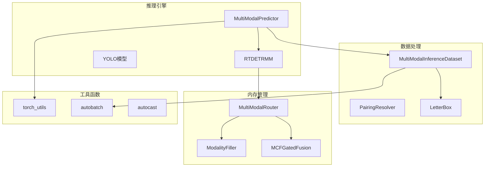
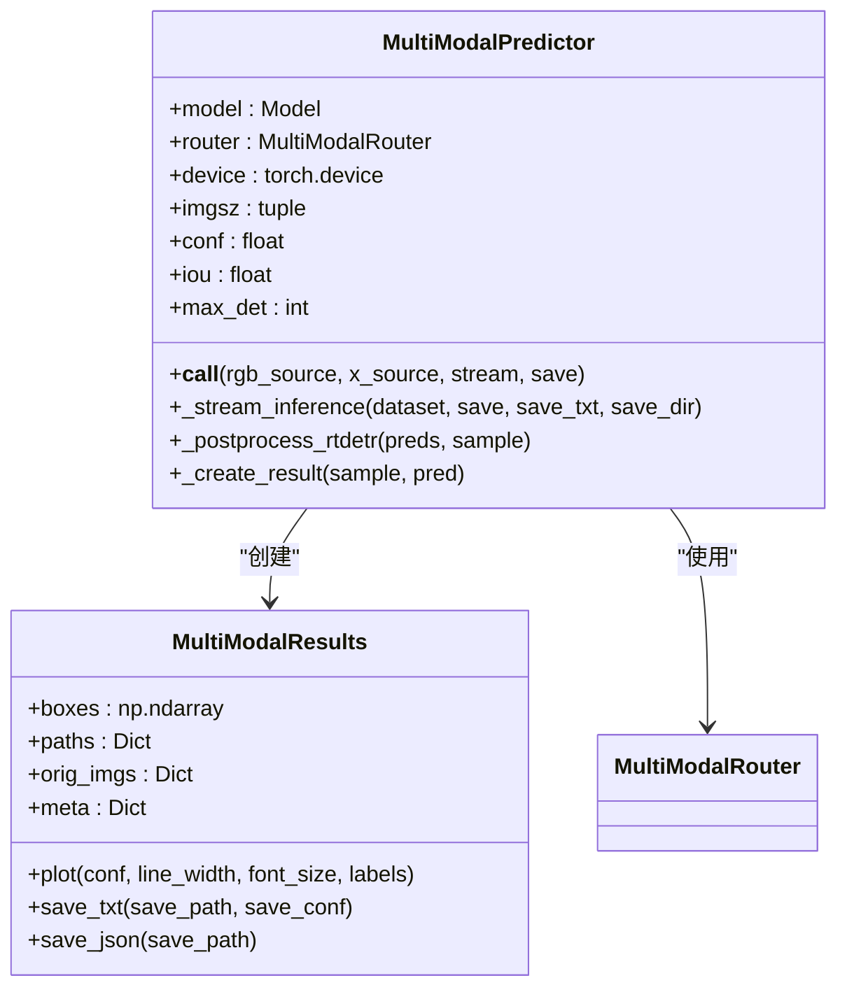
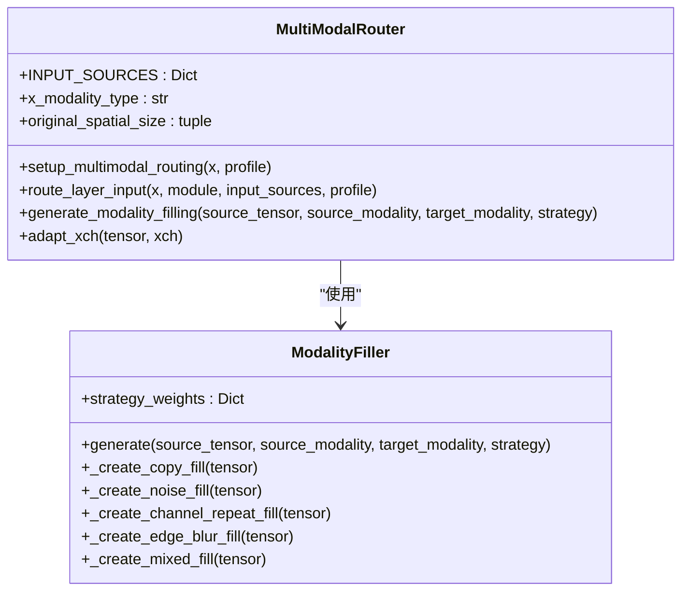
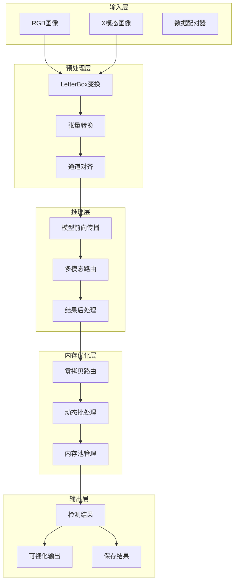
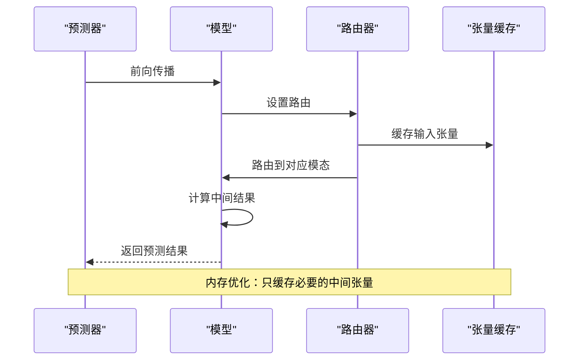
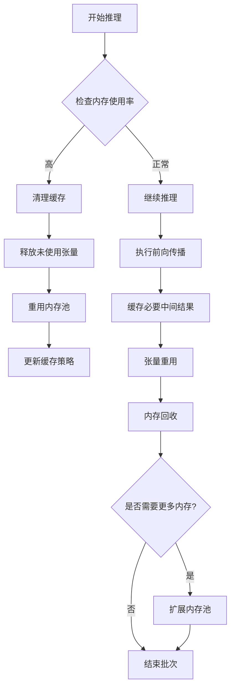
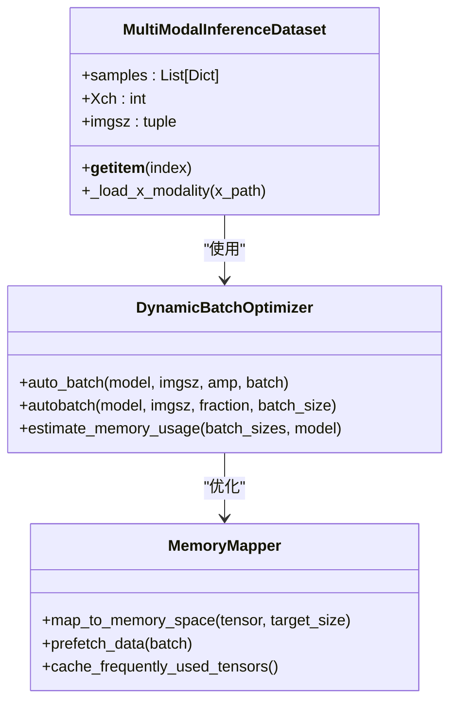
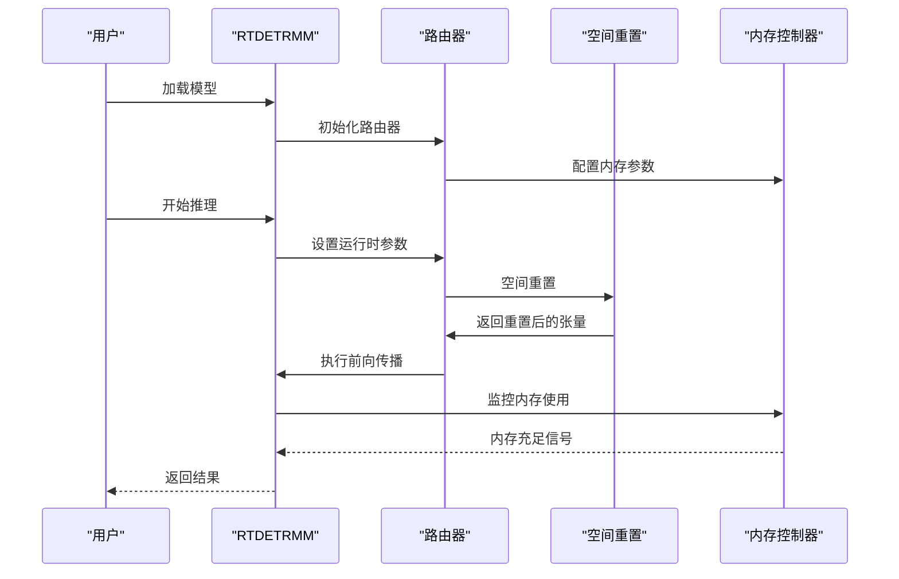
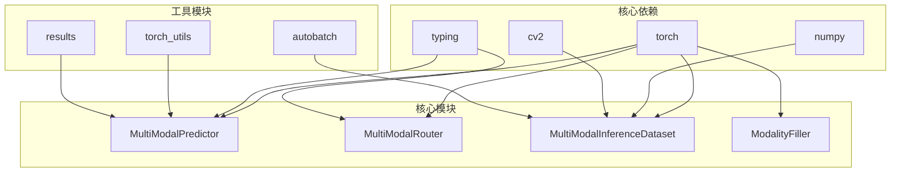
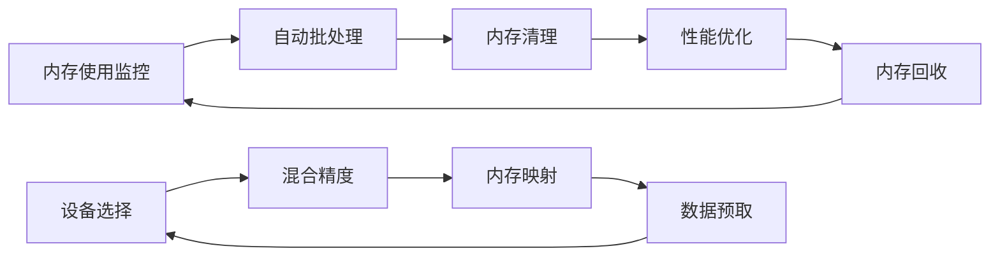

# 内存优化方法

<cite>
**本文档引用的文件**
- [predictor.py](file://ultralytics/engine/multimodal/predictor.py)
- [results.py](file://ultralytics/engine/multimodal/results.py)
- [inference_dataset.py](file://ultralytics/data/multimodal/inference_dataset.py)
- [utils.py](file://ultralytics/data/multimodal/utils.py)
- [router.py](file://ultralytics/nn/mm/router.py)
- [filling.py](file://ultralytics/nn/mm/filling.py)
- [mcf.py](file://ultralytics/nn/mm/mcf.py)
- [model.py](file://ultralytics/models/rtdetrmm/model.py)
- [torch_utils.py](file://ultralytics/utils/torch_utils.py)
- [trainer.py](file://ultralytics/engine/trainer.py)
- [autobatch.py](file://ultralytics/utils/autobatch.py)
- [default.yaml](file://ultralytics/cfg/default.yaml)
</cite>

## 目录
1. [简介](#简介)
2. [项目结构](#项目结构)
3. [核心组件](#核心组件)
4. [架构概览](#架构概览)
5. [详细组件分析](#详细组件分析)
6. [依赖关系分析](#依赖关系分析)
7. [性能考虑](#性能考虑)
8. [故障排除指南](#故障排除指南)
9. [结论](#结论)

## 简介

本指南专注于多模态检测系统的内存优化方法，深入讲解梯度检查点技术、内存池管理、张量重用策略、数据批处理优化以及大模型推理的内存管理方案。通过分析代码库中的实际实现，提供可操作的优化建议和最佳实践。

## 项目结构

该多模态检测系统采用模块化架构，主要包含以下核心模块：

**图表来源**
- [predictor.py:16-98](file://ultralytics/engine/multimodal/predictor.py#L16-L98)
- [inference_dataset.py:16-89](file://ultralytics/data/multimodal/inference_dataset.py#L16-L89)
- [router.py:11-63](file://ultralytics/nn/mm/router.py#L11-L63)

**章节来源**
- [predictor.py:16-98](file://ultralytics/engine/multimodal/predictor.py#L16-L98)
- [inference_dataset.py:16-89](file://ultralytics/data/multimodal/inference_dataset.py#L16-L89)
- [router.py:11-63](file://ultralytics/nn/mm/router.py#L11-L63)

## 核心组件

### 多模态推理引擎

MultiModalPredictor是系统的核心推理组件，负责处理RGB和X模态的联合推理：

**图表来源**
- [predictor.py:16-98](file://ultralytics/engine/multimodal/predictor.py#L16-L98)
- [results.py:14-56](file://ultralytics/engine/multimodal/results.py#L14-L56)

### 多模态路由器

MultiModalRouter实现了零拷贝张量路由和模态填充功能：

**图表来源**
- [router.py:11-63](file://ultralytics/nn/mm/router.py#L11-L63)
- [filling.py:14-50](file://ultralytics/nn/mm/filling.py#L14-L50)

**章节来源**
- [predictor.py:16-98](file://ultralytics/engine/multimodal/predictor.py#L16-L98)
- [results.py:14-56](file://ultralytics/engine/multimodal/results.py#L14-L56)
- [router.py:11-63](file://ultralytics/nn/mm/router.py#L11-L63)
- [filling.py:14-50](file://ultralytics/nn/mm/filling.py#L14-L50)

## 架构概览

系统采用分层架构设计，实现了高效的内存管理和推理优化：

**图表来源**
- [inference_dataset.py:94-183](file://ultralytics/data/multimodal/inference_dataset.py#L94-L183)
- [router.py:157-240](file://ultralytics/nn/mm/router.py#L157-L240)
- [predictor.py:144-243](file://ultralytics/engine/multimodal/predictor.py#L144-L243)

## 详细组件分析

### 梯度检查点技术实现

系统通过智能的内存管理实现梯度检查点效果：

**图表来源**
- [router.py:328-340](file://ultralytics/nn/mm/router.py#L328-L340)
- [predictor.py:167-168](file://ultralytics/engine/multimodal/predictor.py#L167-L168)

### 内存池管理和张量重用

系统实现了高效的内存池管理机制：

**图表来源**
- [trainer.py:528-541](file://ultralytics/engine/trainer.py#L528-L541)
- [torch_utils.py:51-74](file://ultralytics/utils/torch_utils.py#L51-L74)

### 数据批处理优化

系统提供了多种批处理优化策略：

**图表来源**
- [inference_dataset.py:94-183](file://ultralytics/data/multimodal/inference_dataset.py#L94-L183)
- [autobatch.py:45-119](file://ultralytics/utils/autobatch.py#L45-L119)

### 大模型推理内存管理

RTDETRMM模型实现了专门的大模型内存管理：

**图表来源**
- [model.py:25-47](file://ultralytics/models/rtdetrmm/model.py#L25-L47)
- [router.py:365-404](file://ultralytics/nn/mm/router.py#L365-L404)

**章节来源**
- [router.py:157-240](file://ultralytics/nn/mm/router.py#L157-L240)
- [autobatch.py:45-119](file://ultralytics/utils/autobatch.py#L45-L119)
- [model.py:25-47](file://ultralytics/models/rtdetrmm/model.py#L25-L47)

## 依赖关系分析

系统各组件之间的依赖关系如下：

**图表来源**
- [predictor.py:6-13](file://ultralytics/engine/multimodal/predictor.py#L6-L13)
- [router.py:5-8](file://ultralytics/nn/mm/router.py#L5-L8)
- [inference_dataset.py:6-13](file://ultralytics/data/multimodal/inference_dataset.py#L6-L13)

**章节来源**
- [predictor.py:6-13](file://ultralytics/engine/multimodal/predictor.py#L6-L13)
- [router.py:5-8](file://ultralytics/nn/mm/router.py#L5-L8)
- [inference_dataset.py:6-13](file://ultralytics/data/multimodal/inference_dataset.py#L6-L13)

## 性能考虑

### 内存优化最佳实践

1. **梯度检查点实现**：通过智能缓存和重用中间结果，减少显存占用
2. **零拷贝操作**：使用视图而非副本，避免不必要的内存复制
3. **动态批处理**：根据GPU内存动态调整批大小
4. **内存池管理**：统一管理张量生命周期，及时释放不需要的内存

### 性能监控

系统提供了完整的内存监控机制：

**图表来源**
- [trainer.py:515-541](file://ultralytics/engine/trainer.py#L515-L541)
- [torch_utils.py:77-104](file://ultralytics/utils/torch_utils.py#L77-L104)

## 故障排除指南

### 常见内存问题及解决方案

1. **显存不足**：
   - 调整批大小参数
   - 启用混合精度训练
   - 使用梯度检查点

2. **内存泄漏**：
   - 检查张量引用
   - 确保及时释放缓存
   - 监控内存使用趋势

3. **性能下降**：
   - 优化批处理大小
   - 调整数据预取策略
   - 检查内存映射配置

**章节来源**
- [trainer.py:528-541](file://ultralytics/engine/trainer.py#L528-L541)
- [default.yaml:14-38](file://ultralytics/cfg/default.yaml#L14-L38)

## 结论

本多模态检测系统通过多层次的内存优化策略，在保证推理精度的同时显著降低了显存占用。核心优化技术包括：

1. **智能路由系统**：实现零拷贝张量重用和动态模态切换
2. **动态批处理**：根据GPU内存实时调整批大小
3. **内存池管理**：统一管理张量生命周期和缓存策略
4. **大模型优化**：针对RTDETRMM的专门内存管理方案

这些技术的综合应用使得系统能够在有限的硬件资源下处理复杂的多模态检测任务，为实际部署提供了可靠的内存优化解决方案。