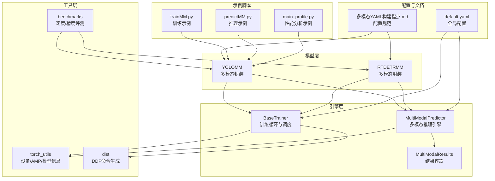
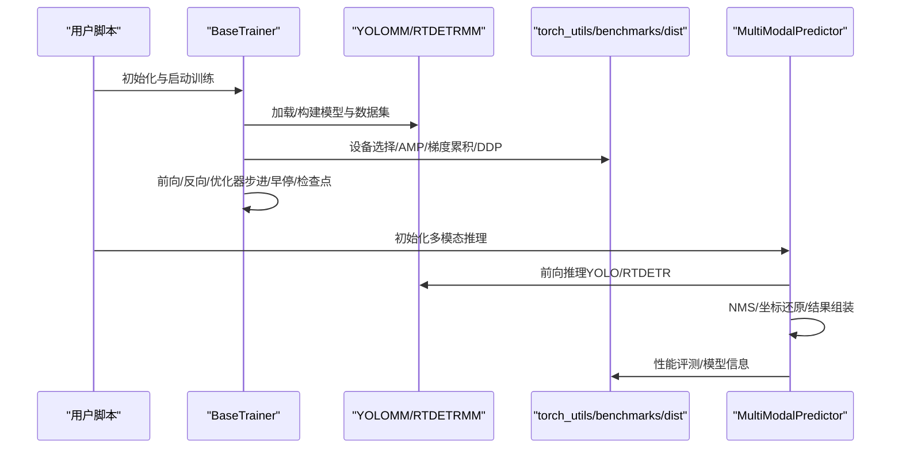
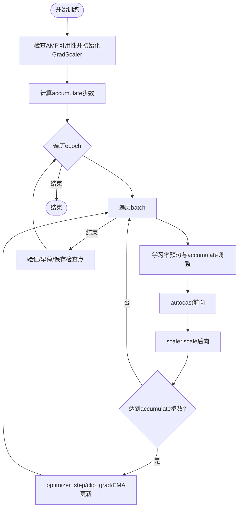
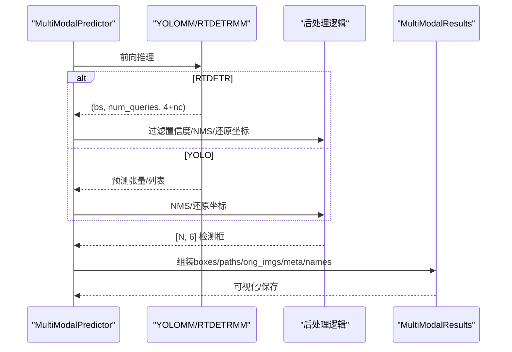
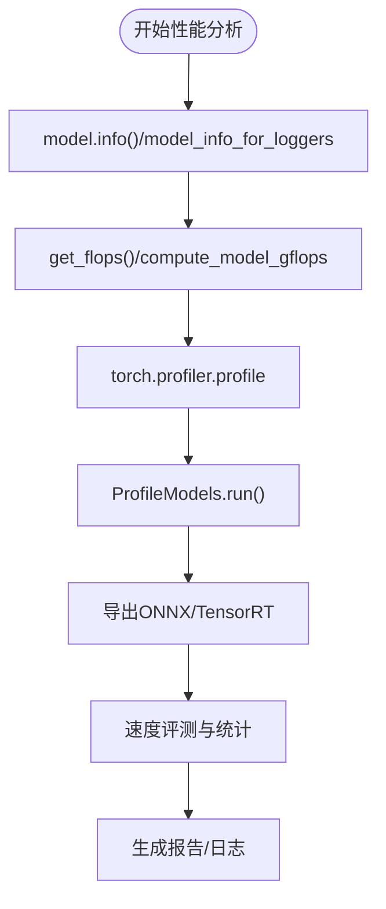
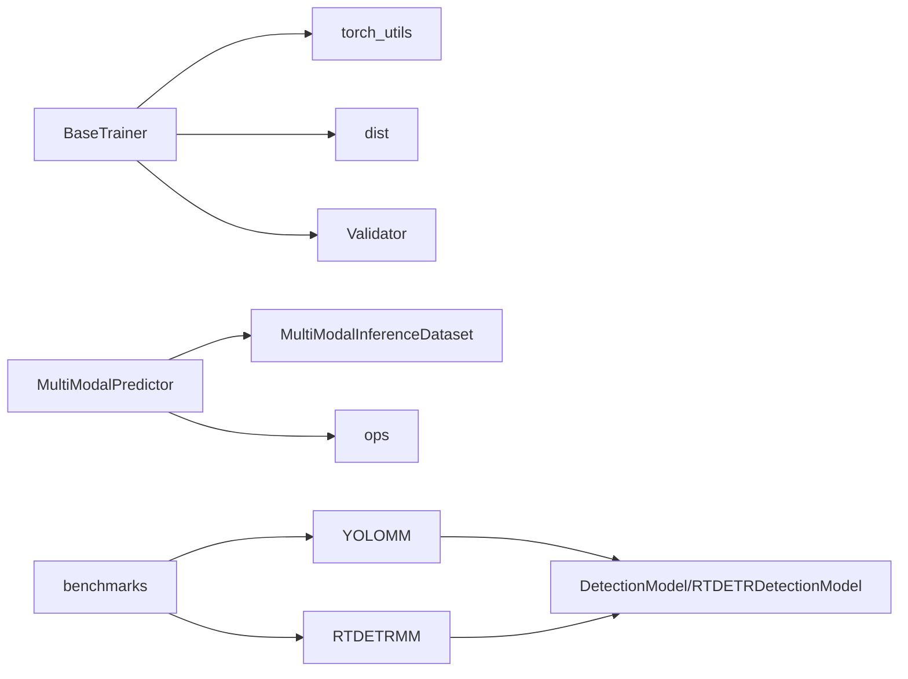

# 性能优化实践

<cite>
**本文档引用的文件**
- [ultralytics/engine/trainer.py](file://ultralytics/engine/trainer.py)
- [ultralytics/utils/torch_utils.py](file://ultralytics/utils/torch_utils.py)
- [ultralytics/utils/benchmarks.py](file://ultralytics/utils/benchmarks.py)
- [ultralytics/utils/dist.py](file://ultralytics/utils/dist.py)
- [ultralytics/engine/multimodal/predictor.py](file://ultralytics/engine/multimodal/predictor.py)
- [ultralytics/engine/multimodal/results.py](file://ultralytics/engine/multimodal/results.py)
- [ultralytics/models/rtdetrmm/model.py](file://ultralytics/models/rtdetrmm/model.py)
- [ultralytics/models/yolo/model.py](file://ultralytics/models/yolo/model.py)
- [ultralytics/cfg/default.yaml](file://ultralytics/cfg/default.yaml)
- [ultralytics/cfg/models/多模态YAML构建指点.md](file://ultralytics/cfg/models/多模态YAML构建指点.md)
- [trainMM.py](file://trainMM.py)
- [predictMM.py](file://predictMM.py)
- [main_profile.py](file://main_profile.py)
</cite>

## 目录
1. [简介](#简介)
2. [项目结构](#项目结构)
3. [核心组件](#核心组件)
4. [架构总览](#架构总览)
5. [详细组件分析](#详细组件分析)
6. [依赖关系分析](#依赖关系分析)
7. [性能考虑](#性能考虑)
8. [故障排除指南](#故障排除指南)
9. [结论](#结论)
10. [附录](#附录)

## 简介
本指南面向多模态检测系统（YOLOMM/RTDETRMM）的性能优化实践，围绕训练加速（混合精度、梯度累积、分布式训练）、推理优化（量化、剪枝、蒸馏）、内存优化（梯度检查点、内存池、批处理优化）以及性能分析工具（CUDA分析器、PyTorch Profiler）展开，结合仓库中的实现细节，提供可操作的优化策略与最佳实践。

## 项目结构
该仓库采用模块化组织，核心训练/推理引擎位于 `ultralytics/engine`，多模态推理与结果容器位于 `ultralytics/engine/multimodal`，模型封装位于 `ultralytics/models`，配置与文档位于 `ultralytics/cfg`，示例脚本位于根目录。

**图表来源**
- [ultralytics/engine/trainer.py:191-504](file://ultralytics/engine/trainer.py#L191-L504)
- [ultralytics/engine/multimodal/predictor.py:16-494](file://ultralytics/engine/multimodal/predictor.py#L16-L494)
- [ultralytics/engine/multimodal/results.py:14-357](file://ultralytics/engine/multimodal/results.py#L14-L357)
- [ultralytics/models/yolo/model.py:456-741](file://ultralytics/models/yolo/model.py#L456-L741)
- [ultralytics/models/rtdetrmm/model.py:25-269](file://ultralytics/models/rtdetrmm/model.py#L25-L269)
- [ultralytics/utils/torch_utils.py:327-546](file://ultralytics/utils/torch_utils.py#L327-L546)
- [ultralytics/utils/benchmarks.py:360-489](file://ultralytics/utils/benchmarks.py#L360-L489)
- [ultralytics/utils/dist.py:29-99](file://ultralytics/utils/dist.py#L29-L99)
- [ultralytics/cfg/default.yaml:1-168](file://ultralytics/cfg/default.yaml#L1-L168)
- [ultralytics/cfg/models/多模态YAML构建指点.md:1-239](file://ultralytics/cfg/models/多模态YAML构建指点.md#L1-L239)
- [trainMM.py:1-15](file://trainMM.py#L1-L15)
- [predictMM.py:1-40](file://predictMM.py#L1-L40)
- [main_profile.py:1-14](file://main_profile.py#L1-L14)

**章节来源**
- [ultralytics/engine/trainer.py:191-504](file://ultralytics/engine/trainer.py#L191-L504)
- [ultralytics/engine/multimodal/predictor.py:16-494](file://ultralytics/engine/multimodal/predictor.py#L16-L494)
- [ultralytics/models/yolo/model.py:456-741](file://ultralytics/models/yolo/model.py#L456-L741)
- [ultralytics/models/rtdetrmm/model.py:25-269](file://ultralytics/models/rtdetrmm/model.py#L25-L269)
- [ultralytics/utils/torch_utils.py:327-546](file://ultralytics/utils/torch_utils.py#L327-L546)
- [ultralytics/utils/benchmarks.py:360-489](file://ultralytics/utils/benchmarks.py#L360-L489)
- [ultralytics/utils/dist.py:29-99](file://ultralytics/utils/dist.py#L29-L99)
- [ultralytics/cfg/default.yaml:1-168](file://ultralytics/cfg/default.yaml#L1-L168)
- [ultralytics/cfg/models/多模态YAML构建指点.md:1-239](file://ultralytics/cfg/models/多模态YAML构建指点.md#L1-L239)
- [trainMM.py:1-15](file://trainMM.py#L1-L15)
- [predictMM.py:1-40](file://predictMM.py#L1-L40)
- [main_profile.py:1-14](file://main_profile.py#L1-L14)

## 核心组件
- 训练循环与调度：BaseTrainer负责训练/验证/早停/检查点保存、AMP、梯度累积、DDP初始化与同步、内存清理等。
- 多模态推理引擎：MultiModalPredictor负责构建数据集、流式推理、YOLO/RTDETR后处理、结果组装与保存。
- 模型封装：YOLOMM/RTDETRMM提供多模态路由配置、任务映射、COCO评测等能力。
- 工具函数：torch_utils提供设备选择、AMP上下文、模型信息统计、FLOPs计算、推理模式装饰器等；benchmarks提供ONNX/TensorRT速度评测；dist提供DDP命令生成与端口分配。
- 配置与文档：default.yaml提供训练/推理/导出的关键超参；多模态YAML构建指南提供配置驱动的多模态网络构建规范。

**章节来源**
- [ultralytics/engine/trainer.py:59-504](file://ultralytics/engine/trainer.py#L59-L504)
- [ultralytics/engine/multimodal/predictor.py:16-494](file://ultralytics/engine/multimodal/predictor.py#L16-L494)
- [ultralytics/models/yolo/model.py:456-741](file://ultralytics/models/yolo/model.py#L456-L741)
- [ultralytics/models/rtdetrmm/model.py:25-269](file://ultralytics/models/rtdetrmm/model.py#L25-L269)
- [ultralytics/utils/torch_utils.py:131-546](file://ultralytics/utils/torch_utils.py#L131-L546)
- [ultralytics/utils/benchmarks.py:360-489](file://ultralytics/utils/benchmarks.py#L360-L489)
- [ultralytics/utils/dist.py:29-99](file://ultralytics/utils/dist.py#L29-L99)
- [ultralytics/cfg/default.yaml:1-168](file://ultralytics/cfg/default.yaml#L1-L168)
- [ultralytics/cfg/models/多模态YAML构建指点.md:1-239](file://ultralytics/cfg/models/多模态YAML构建指点.md#L1-L239)

## 架构总览
多模态检测系统采用“配置驱动 + 路由器”的架构：模型配置文件通过第5字段标注输入来源（RGB/X/Dual），由MultiModalRouter在前向过程中自动完成通道划分与空间重置，保证不同模态的输入形状与融合点清晰可控。训练与推理分别由BaseTrainer与MultiModalPredictor驱动，工具层提供AMP、DDP、性能评测与模型信息统计。

**图表来源**
- [ultralytics/engine/trainer.py:191-504](file://ultralytics/engine/trainer.py#L191-L504)
- [ultralytics/engine/multimodal/predictor.py:99-244](file://ultralytics/engine/multimodal/predictor.py#L99-L244)
- [ultralytics/models/yolo/model.py:456-741](file://ultralytics/models/yolo/model.py#L456-L741)
- [ultralytics/models/rtdetrmm/model.py:25-269](file://ultralytics/models/rtdetrmm/model.py#L25-L269)
- [ultralytics/utils/torch_utils.py:327-546](file://ultralytics/utils/torch_utils.py#L327-L546)
- [ultralytics/utils/benchmarks.py:360-489](file://ultralytics/utils/benchmarks.py#L360-L489)
- [ultralytics/utils/dist.py:29-99](file://ultralytics/utils/dist.py#L29-L99)

## 详细组件分析

### 训练加速技术
- 混合精度训练（AMP）
  - BaseTrainer在_setup_train中根据模型能力与设备启用AMP，并创建GradScaler；训练循环中使用autocast包裹前向，反向使用scaler.scale/backward/scaler.step更新权重。
  - torch_utils提供autocast上下文与版本兼容处理，支持torch.amp.autocast与旧版cuda.amp.autocast。
  - 参考路径：[ultralytics/engine/trainer.py:281-294](file://ultralytics/engine/trainer.py#L281-L294)、[ultralytics/utils/torch_utils.py:77-104](file://ultralytics/utils/torch_utils.py#L77-L104)

- 梯度累积
  - BaseTrainer通过accumulate参数控制梯度累积步数，训练循环中每ni- last_opt_step达到accumulate时才执行optimizer_step，从而在有限显存下扩大有效batch。
  - 参考路径：[ultralytics/engine/trainer.py:326-420](file://ultralytics/engine/trainer.py#L326-L420)

- 分布式训练（DDP）
  - BaseTrainer在train中根据设备字符串/列表推断world_size，大于1时生成DDP命令并通过torch.distributed.run/launch启动子进程；_setup_ddp初始化后端、超时与设备；dist提供generate_ddp_command/find_free_network_port。
  - 参考路径：[ultralytics/engine/trainer.py:191-227](file://ultralytics/engine/trainer.py#L191-L227)、[ultralytics/utils/dist.py:79-99](file://ultralytics/utils/dist.py#L79-L99)

- 学习率调度与早停
  - 支持余弦退火与线性退火；EarlyStopping根据验证指标停止训练，减少无效训练时间。
  - 参考路径：[ultralytics/engine/trainer.py:229-239](file://ultralytics/engine/trainer.py#L229-L239)

- 自动批大小与内存清理
  - auto_batch估算最优batch；_clear_memory在验证前后清理缓存，防止VRAM峰值。
  - 参考路径：[ultralytics/engine/trainer.py:505-541](file://ultralytics/engine/trainer.py#L505-L541)

**图表来源**
- [ultralytics/engine/trainer.py:326-491](file://ultralytics/engine/trainer.py#L326-L491)

**章节来源**
- [ultralytics/engine/trainer.py:191-504](file://ultralytics/engine/trainer.py#L191-L504)
- [ultralytics/utils/torch_utils.py:77-104](file://ultralytics/utils/torch_utils.py#L77-L104)
- [ultralytics/utils/dist.py:79-99](file://ultralytics/utils/dist.py#L79-L99)

### 推理优化策略
- 模型融合与路由
  - YOLOMM/RTDETRMM通过_yaml中的第5字段（RGB/X/Dual）与MultiModalRouter实现通道划分与空间重置，确保早期/中期/晚期融合的形状一致性。
  - 参考路径：[ultralytics/models/yolo/model.py:456-741](file://ultralytics/models/yolo/model.py#L456-L741)、[ultralytics/models/rtdetrmm/model.py:25-269](file://ultralytics/models/rtdetrmm/model.py#L25-L269)、[ultralytics/cfg/models/多模态YAML构建指点.md:20-64](file://ultralytics/cfg/models/多模态YAML构建指点.md#L20-L64)

- 后处理优化（YOLO/RTDETR）
  - MultiModalPredictor区分RTDETR与YOLO后处理：RTDETR先拆分bbox/scores，过滤置信度，NMS去重，再按letterbox与原图尺寸还原；YOLO使用non_max_suppression后scale_boxes还原。
  - 参考路径：[ultralytics/engine/multimodal/predictor.py:196-434](file://ultralytics/engine/multimodal/predictor.py#L196-L434)

- 可视化与结果保存
  - MultiModalResults支持RGB/X标注、并排合并图、YOLO格式txt/json保存，便于下游分析与发布。
  - 参考路径：[ultralytics/engine/multimodal/results.py:61-357](file://ultralytics/engine/multimodal/results.py#L61-L357)

**图表来源**
- [ultralytics/engine/multimodal/predictor.py:163-244](file://ultralytics/engine/multimodal/predictor.py#L163-L244)
- [ultralytics/engine/multimodal/results.py:436-494](file://ultralytics/engine/multimodal/results.py#L436-L494)

**章节来源**
- [ultralytics/engine/multimodal/predictor.py:16-494](file://ultralytics/engine/multimodal/predictor.py#L16-L494)
- [ultralytics/engine/multimodal/results.py:14-357](file://ultralytics/engine/multimodal/results.py#L14-L357)
- [ultralytics/models/yolo/model.py:456-741](file://ultralytics/models/yolo/model.py#L456-L741)
- [ultralytics/models/rtdetrmm/model.py:25-269](file://ultralytics/models/rtdetrmm/model.py#L25-L269)
- [ultralytics/cfg/models/多模态YAML构建指点.md:1-239](file://ultralytics/cfg/models/多模态YAML构建指点.md#L1-L239)

### 内存优化方法
- 梯度检查点（Gradient Checkpointing）
  - 在长序列/深层网络中可显著降低显存占用，建议在模型实现中启用（需模型支持）。
  - 参考路径：[ultralytics/utils/torch_utils.py:327-369](file://ultralytics/utils/torch_utils.py#L327-L369)

- 内存池管理与缓存清理
  - BaseTrainer在验证前后调用_clear_memory清理缓存，threshold可控制触发条件；torch.cuda.empty_cache/mps.empty_cache在对应设备上释放缓存。
  - 参考路径：[ultralytics/engine/trainer.py:528-541](file://ultralytics/engine/trainer.py#L528-L541)

- 数据批处理优化
  - default.yaml提供workers、batch、rect、multi_scale等参数；AutoBatch可根据显存自动调整batch；多模态数据集支持异步几何扰动与模态擦除，平衡训练稳定性与多样性。
  - 参考路径：[ultralytics/cfg/default.yaml:9-126](file://ultralytics/cfg/default.yaml#L9-L126)

**章节来源**
- [ultralytics/engine/trainer.py:528-541](file://ultralytics/engine/trainer.py#L528-L541)
- [ultralytics/utils/torch_utils.py:327-369](file://ultralytics/utils/torch_utils.py#L327-L369)
- [ultralytics/cfg/default.yaml:9-126](file://ultralytics/cfg/default.yaml#L9-L126)

### 性能分析工具使用
- ONNX/TensorRT速度评测
  - ProfileModels支持ONNX与TensorRT引擎的速度评测，自动导出并运行，输出均值与标准差，支持sigma截断去除异常值。
  - 参考路径：[ultralytics/utils/benchmarks.py:360-489](file://ultralytics/utils/benchmarks.py#L360-L489)

- 模型信息与FLOPs统计
  - torch_utils提供model_info与get_flops，支持thop与torch profiler两种方式；compute_model_gflops支持多模态路由感知的GFLOPs统计。
  - 参考路径：[ultralytics/utils/torch_utils.py:327-546](file://ultralytics/utils/torch_utils.py#L327-L546)

- PyTorch Profiler集成
  - torch_utils.get_flops_with_torch_profiler使用torch.profiler.profile统计FLOPs，适合精细分析。
  - 参考路径：[ultralytics/utils/torch_utils.py:515-546](file://ultralytics/utils/torch_utils.py#L515-L546)

- 示例脚本
  - main_profile.py演示如何加载模型、打印详细信息、尝试profile并fuse。
  - 参考路径：[main_profile.py:1-14](file://main_profile.py#L1-L14)

**图表来源**
- [ultralytics/utils/torch_utils.py:327-546](file://ultralytics/utils/torch_utils.py#L327-L546)
- [ultralytics/utils/benchmarks.py:360-489](file://ultralytics/utils/benchmarks.py#L360-L489)
- [main_profile.py:1-14](file://main_profile.py#L1-L14)

**章节来源**
- [ultralytics/utils/benchmarks.py:360-489](file://ultralytics/utils/benchmarks.py#L360-L489)
- [ultralytics/utils/torch_utils.py:327-546](file://ultralytics/utils/torch_utils.py#L327-L546)
- [main_profile.py:1-14](file://main_profile.py#L1-L14)

### 针对不同硬件平台的优化建议与案例
- NVIDIA GPU（CUDA）
  - 启用AMP与TensorRT导出；合理设置batch与workers；使用DDP多卡训练；利用torch.cuda.empty_cache定期清理缓存。
  - 参考路径：[ultralytics/engine/trainer.py:281-294](file://ultralytics/engine/trainer.py#L281-L294)、[ultralytics/utils/benchmarks.py:436-489](file://ultralytics/utils/benchmarks.py#L436-L489)

- Apple Silicon（MPS）
  - 使用torch.backends.mps，注意CPU线程数设置；在select_device中自动降级；谨慎使用AMP。
  - 参考路径：[ultralytics/utils/torch_utils.py:131-252](file://ultralytics/utils/torch_utils.py#L131-L252)

- 多模态数据集与路由
  - 使用多模态YAML构建指南，确保RGB/X/Dual的第5字段标注正确，避免通道不匹配与形状推导错误。
  - 参考路径：[ultralytics/cfg/models/多模态YAML构建指点.md:20-64](file://ultralytics/cfg/models/多模态YAML构建指点.md#L20-L64)

**章节来源**
- [ultralytics/engine/trainer.py:281-294](file://ultralytics/engine/trainer.py#L281-L294)
- [ultralytics/utils/benchmarks.py:436-489](file://ultralytics/utils/benchmarks.py#L436-L489)
- [ultralytics/utils/torch_utils.py:131-252](file://ultralytics/utils/torch_utils.py#L131-L252)
- [ultralytics/cfg/models/多模态YAML构建指点.md:20-64](file://ultralytics/cfg/models/多模态YAML构建指点.md#L20-L64)

## 依赖关系分析
- 训练器依赖torch_utils进行设备选择、AMP、模型信息统计；依赖dist生成DDP命令；依赖validator进行验证。
- 多模态推理依赖PairingResolver/MultiModalInferenceDataset构建数据集，依赖ops进行NMS与坐标变换。
- 模型封装依赖任务映射与路由器配置，支持YOLO与RT-DETR两类检测头。
- 工具层提供统一的性能评测与模型信息接口。

**图表来源**
- [ultralytics/engine/trainer.py:250-342](file://ultralytics/engine/trainer.py#L250-L342)
- [ultralytics/engine/multimodal/predictor.py:125-142](file://ultralytics/engine/multimodal/predictor.py#L125-L142)
- [ultralytics/models/yolo/model.py:96-131](file://ultralytics/models/yolo/model.py#L96-L131)
- [ultralytics/models/rtdetrmm/model.py:48-57](file://ultralytics/models/rtdetrmm/model.py#L48-L57)
- [ultralytics/utils/benchmarks.py:436-489](file://ultralytics/utils/benchmarks.py#L436-L489)

**章节来源**
- [ultralytics/engine/trainer.py:250-342](file://ultralytics/engine/trainer.py#L250-L342)
- [ultralytics/engine/multimodal/predictor.py:125-142](file://ultralytics/engine/multimodal/predictor.py#L125-L142)
- [ultralytics/models/yolo/model.py:96-131](file://ultralytics/models/yolo/model.py#L96-L131)
- [ultralytics/models/rtdetrmm/model.py:48-57](file://ultralytics/models/rtdetrmm/model.py#L48-L57)
- [ultralytics/utils/benchmarks.py:436-489](file://ultralytics/utils/benchmarks.py#L436-L489)

## 性能考虑
- 训练阶段
  - AMP与DDP是主要加速手段；梯度累积在显存受限时提升吞吐；合理设置workers与batch；早停与学习率调度避免无效训练。
- 推理阶段
  - 选择合适后处理路径（YOLO vs RTDETR）；NMS阈值与置信度阈值影响速度与精度权衡；多模态路由清晰可减少冗余计算。
- 工具与评测
  - 使用ProfileModels与torch profiler定位瓶颈；结合ONNX/TensorRT导出评估部署性能。

[本节为通用指导，无需特定文件引用]

## 故障排除指南
- AMP相关
  - 若出现NaN/梯度爆炸，检查AMP启用状态与scaler使用；必要时降低学习率或关闭AMP。
  - 参考路径：[ultralytics/engine/trainer.py:281-294](file://ultralytics/engine/trainer.py#L281-L294)

- 分布式训练
  - MASTER_PORT冲突或NCCL初始化失败时，使用find_free_network_port；确保CUDA可见设备与batch整除GPU数。
  - 参考路径：[ultralytics/utils/dist.py:12-27](file://ultralytics/utils/dist.py#L12-L27)、[ultralytics/utils/dist.py:79-99](file://ultralytics/utils/dist.py#L79-L99)

- 多模态路由
  - 通道不匹配与形状推导错误常见于第5字段标注错误或Xch设置不当；使用model.info/profile验证路由。
  - 参考路径：[ultralytics/cfg/models/多模态YAML构建指点.md:206-217](file://ultralytics/cfg/models/多模态YAML构建指点.md#L206-L217)

**章节来源**
- [ultralytics/engine/trainer.py:281-294](file://ultralytics/engine/trainer.py#L281-L294)
- [ultralytics/utils/dist.py:12-27](file://ultralytics/utils/dist.py#L12-L27)
- [ultralytics/utils/dist.py:79-99](file://ultralytics/utils/dist.py#L79-L99)
- [ultralytics/cfg/models/多模态YAML构建指点.md:206-217](file://ultralytics/cfg/models/多模态YAML构建指点.md#L206-L217)

## 结论
通过AMP、DDP、梯度累积与合理的批处理策略，多模态检测系统可在训练阶段显著提速；在推理阶段，清晰的多模态路由与高效的后处理路径是关键；借助ONNX/TensorRT与PyTorch Profiler，可以系统性地定位瓶颈并制定针对性优化方案。结合default.yaml与多模态YAML构建指南，能够在不同硬件平台上获得稳定且高性能的部署效果。

[本节为总结，无需特定文件引用]

## 附录
- 示例脚本
  - 训练示例：trainMM.py
  - 推理示例：predictMM.py
  - 性能分析示例：main_profile.py
- 配置参考
  - default.yaml提供训练/推理/导出关键参数
  - 多模态YAML构建指南提供配置驱动的多模态网络构建规范

**章节来源**
- [trainMM.py:1-15](file://trainMM.py#L1-L15)
- [predictMM.py:1-40](file://predictMM.py#L1-L40)
- [main_profile.py:1-14](file://main_profile.py#L1-L14)
- [ultralytics/cfg/default.yaml:1-168](file://ultralytics/cfg/default.yaml#L1-L168)
- [ultralytics/cfg/models/多模态YAML构建指点.md:1-239](file://ultralytics/cfg/models/多模态YAML构建指点.md#L1-L239)