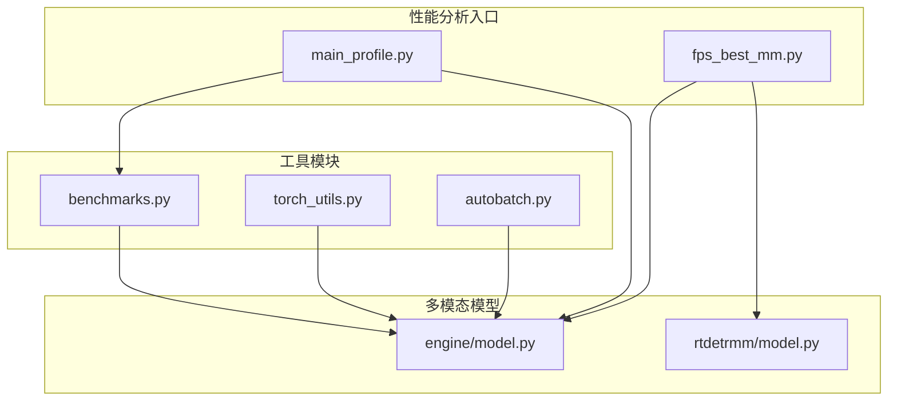
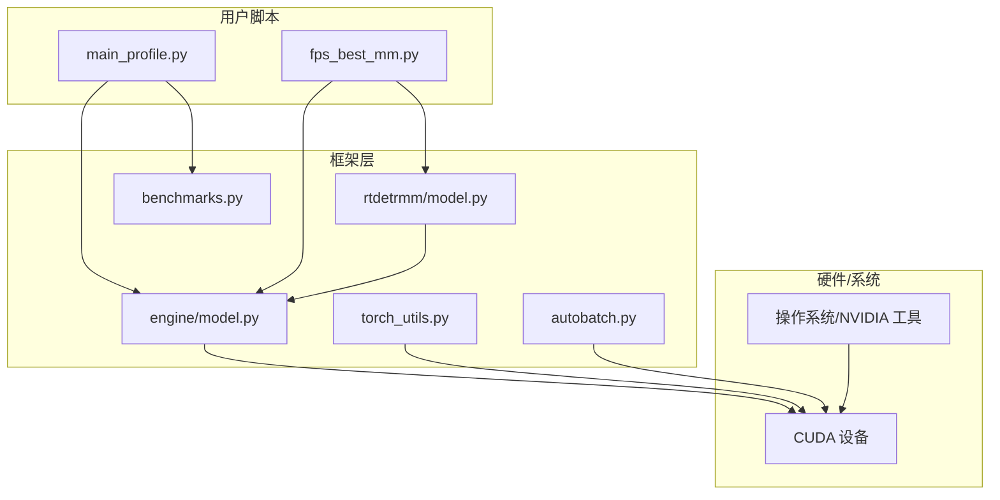
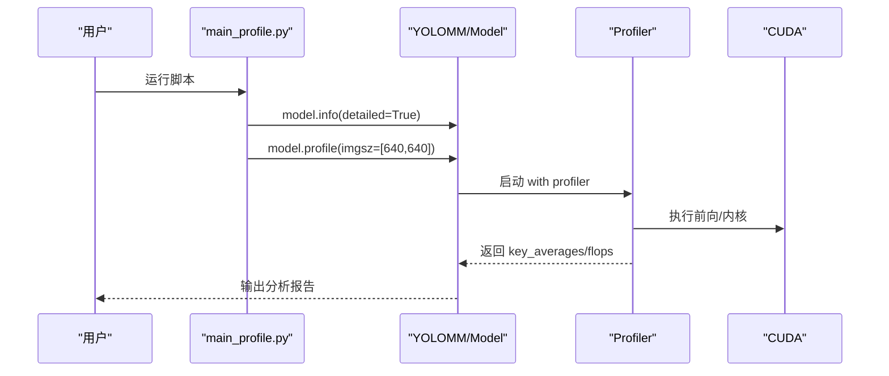
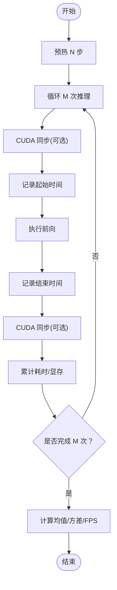
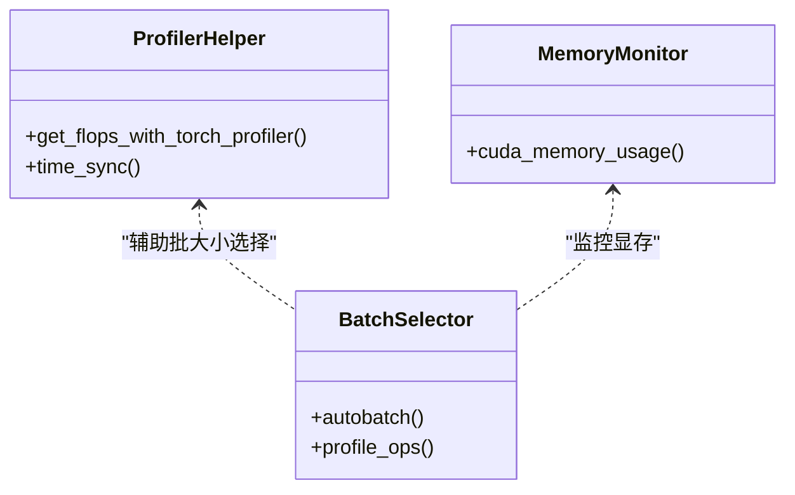
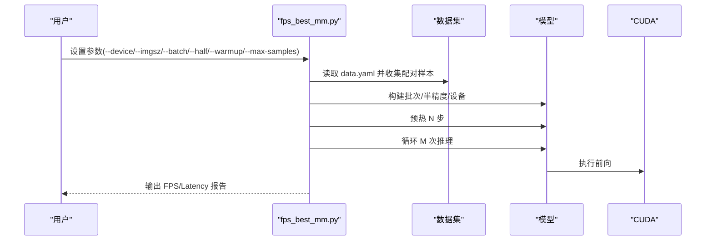
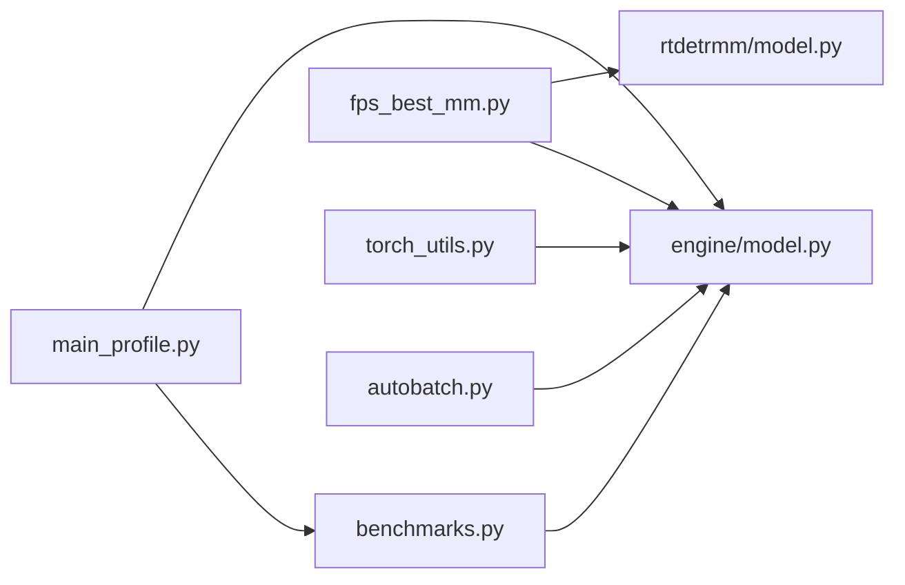

# 性能分析工具

<cite>
**本文引用的文件**   
- [main_profile.py](file://main_profile.py)
- [fps_best_mm.py](file://fps_best_mm.py)
- [ultralytics/utils/benchmarks.py](file://ultralytics/utils/benchmarks.py)
- [ultralytics/utils/torch_utils.py](file://ultralytics/utils/torch_utils.py)
- [ultralytics/engine/model.py](file://ultralytics/engine/model.py)
- [ultralytics/models/rtdetrmm/model.py](file://ultralytics/models/rtdetrmm/model.py)
- [ultralytics/utils/autobatch.py](file://ultralytics/utils/autobatch.py)
- [ResTest/aifi-dattention-CSP-MutilScaleEdgeInformationEnhance-ASF-P2-lite/args.yaml](file://ResTest/aifi-dattention-CSP-MutilScaleEdgeInformationEnhance-ASF-P2-lite/args.yaml)
</cite>

## 目录
1. [简介](#简介)
2. [项目结构](#项目结构)
3. [核心组件](#核心组件)
4. [架构总览](#架构总览)
5. [详细组件分析](#详细组件分析)
6. [依赖分析](#依赖分析)
7. [性能考量](#性能考量)
8. [故障排查指南](#故障排查指南)
9. [结论](#结论)
10. [附录](#附录)

## 简介
本指南面向多模态检测系统的性能分析与优化，围绕以下目标展开：
- 使用 PyTorch Profiler 进行端到端性能分析，掌握配置、数据采集与结果解读。
- 掌握 CUDA 分析器（Nsight Systems/Nsight Compute）的安装、配置与典型分析流程。
- 自定义性能分析工具：时间测量、内存监控、吞吐量统计。
- 多模态系统瓶颈定位：数据加载、模型计算、内存瓶颈的诊断方法。
- 性能基准测试：实施流程与结果分析技巧。

本仓库提供了多模态模型（如 RTDETRMM）与基准脚本，可直接用于性能分析与对比。

## 项目结构
该仓库包含多模态检测框架、模型实现、训练/验证/推理管线以及性能分析脚本。关键目录与文件如下：
- 性能分析入口与脚本
  - main_profile.py：调用 YOLOMM.info 与 model.profile，快速启动 PyTorch Profiler。
  - fps_best_mm.py：多模态端到端/纯前向基准脚本，支持预热、批量、半精度等参数化控制。
- 核心工具模块
  - ultralytics/utils/benchmarks.py：通用模型格式与速度/精度基准工具，含 ProfileModels 类。
  - ultralytics/utils/torch_utils.py：包含 FLOPs 计算（thop 与 torch.profiler 两种）、设备选择、CUDA 同步等。
  - ultralytics/utils/autobatch.py：自动批大小与 CUDA 内存占用检查、批大小性能曲线拟合。
- 多模态模型与任务
  - ultralytics/models/rtdetrmm/model.py：RTDETRMM 多模态模型入口，负责多模态路由与任务映射。
  - ultralytics/engine/model.py：统一的 Model 抽象，提供 predict/val/benchmark 等能力。
- 配置样例
  - ResTest/aifi-dattention-CSP-MutilScaleEdgeInformationEnhance-ASF-P2-lite/args.yaml：多模态训练/推理参数样例，包含多模态增强开关、设备、工作线程等。

**图表来源**
- [main_profile.py:1-14](file://main_profile.py#L1-L14)
- [fps_best_mm.py:367-468](file://fps_best_mm.py#L367-L468)
- [ultralytics/utils/benchmarks.py:52-212](file://ultralytics/utils/benchmarks.py#L52-L212)
- [ultralytics/utils/torch_utils.py:515-546](file://ultralytics/utils/torch_utils.py#L515-L546)
- [ultralytics/utils/autobatch.py:70-120](file://ultralytics/utils/autobatch.py#L70-L120)
- [ultralytics/models/rtdetrmm/model.py:25-58](file://ultralytics/models/rtdetrmm/model.py#L25-L58)
- [ultralytics/engine/model.py:29-80](file://ultralytics/engine/model.py#L29-L80)

**章节来源**
- [main_profile.py:1-14](file://main_profile.py#L1-L14)
- [fps_best_mm.py:367-468](file://fps_best_mm.py#L367-L468)
- [ultralytics/utils/benchmarks.py:52-212](file://ultralytics/utils/benchmarks.py#L52-L212)
- [ultralytics/utils/torch_utils.py:515-546](file://ultralytics/utils/torch_utils.py#L515-L546)
- [ultralytics/utils/autobatch.py:70-120](file://ultralytics/utils/autobatch.py#L70-L120)
- [ultralytics/models/rtdetrmm/model.py:25-58](file://ultralytics/models/rtdetrmm/model.py#L25-L58)
- [ultralytics/engine/model.py:29-80](file://ultralytics/engine/model.py#L29-L80)

## 核心组件
- PyTorch Profiler 集成
  - main_profile.py 中通过 model.profile 启动内置性能分析，结合 model.info(detailed=True) 输出模型结构与 FLOPs。
  - torch_utils.py 提供 get_flops_with_torch_profiler，展示如何使用 torch.profiler.profile(with_flops=True) 进行 FLOPs 统计。
- 基准测试工具
  - fps_best_mm.py 实现多模态端到端与纯前向两种模式的基准，支持设备、半精度、预热步数、最大采样数等参数。
  - benchmarks.py 提供通用模型格式（ONNX/TensorRT 等）的速度/精度对比工具，ProfileModels 类可用于 ONNX/TensorRT 的时延统计。
- CUDA 分析器
  - Nsight Systems/Nsight Compute 作为外部工具，建议在 main_profile.py 或 fps_best_mm.py 执行前后分别采集系统/内核级性能数据，以定位瓶颈。
- 自定义分析工具
  - torch_utils.py 提供 time_sync、cuda_memory_usage 上下文管理器等基础能力。
  - autobatch.py 展示了如何查询显存总量、保留/分配/空闲显存，并基于 profile_ops 对不同 batch 的性能进行拟合。

**章节来源**
- [main_profile.py:5-13](file://main_profile.py#L5-L13)
- [ultralytics/utils/torch_utils.py:255-259](file://ultralytics/utils/torch_utils.py#L255-L259)
- [ultralytics/utils/torch_utils.py:515-546](file://ultralytics/utils/torch_utils.py#L515-L546)
- [fps_best_mm.py:209-247](file://fps_best_mm.py#L209-L247)
- [fps_best_mm.py:249-291](file://fps_best_mm.py#L249-L291)
- [ultralytics/utils/benchmarks.py:360-490](file://ultralytics/utils/benchmarks.py#L360-L490)
- [ultralytics/utils/autobatch.py:70-120](file://ultralytics/utils/autobatch.py#L70-L120)

## 架构总览
下图展示了性能分析工具在多模态系统中的位置与交互：

**图表来源**
- [main_profile.py:1-14](file://main_profile.py#L1-L14)
- [fps_best_mm.py:367-468](file://fps_best_mm.py#L367-L468)
- [ultralytics/engine/model.py:29-80](file://ultralytics/engine/model.py#L29-L80)
- [ultralytics/models/rtdetrmm/model.py:25-58](file://ultralytics/models/rtdetrmm/model.py#L25-L58)
- [ultralytics/utils/benchmarks.py:52-212](file://ultralytics/utils/benchmarks.py#L52-L212)
- [ultralytics/utils/torch_utils.py:515-546](file://ultralytics/utils/torch_utils.py#L515-L546)
- [ultralytics/utils/autobatch.py:70-120](file://ultralytics/utils/autobatch.py#L70-L120)

## 详细组件分析

### PyTorch Profiler 使用指南
- 入口与配置
  - 在 main_profile.py 中，YOLOMM 加载后调用 model.info(detailed=True) 输出模型结构与 FLOPs；随后调用 model.profile(imgsz=[640, 640]) 启动内置性能分析。
  - torch_utils.py 提供 get_flops_with_torch_profiler，演示如何在 with torch.profiler.profile(with_flops=True) 上下文中执行前向，汇总 key_averages().flops。
- 数据采集
  - 使用 torch.cuda.synchronize 保证同步，避免异步导致的时间误差。
  - 支持半精度（fp16）与设备切换（cuda/cpu），在 fps_best_mm.py 中通过 --half 与 --device 控制。
- 结果解读
  - 关注关键指标：总耗时、每层算子耗时、FLOPs 占比、内存占用峰值。
  - 结合模型结构（model.info 输出）定位高耗算子与大参数层，优先优化瓶颈层。

**图表来源**
- [main_profile.py:5-13](file://main_profile.py#L5-L13)
- [ultralytics/utils/torch_utils.py:515-546](file://ultralytics/utils/torch_utils.py#L515-L546)

**章节来源**
- [main_profile.py:5-13](file://main_profile.py#L5-L13)
- [ultralytics/utils/torch_utils.py:515-546](file://ultralytics/utils/torch_utils.py#L515-L546)

### CUDA 分析器（Nsight Systems/Compute）使用技巧
- 安装与准备
  - 安装 NVIDIA Nsight Systems 与 Nsight Compute。
  - 确保驱动与 CUDA 版本匹配，具备足够权限运行 nsys/ncu。
- Nsight Systems（系统级）
  - 场景：整体系统资源占用、CPU/GPU 协同、I/O 与内存带宽。
  - 流程：启动 nsys capture，运行 main_profile.py 或 fps_best_mm.py，结束采集，查看 timeline、GPU 利用率、内存带宽、核函数占比。
- Nsight Compute（内核级）
  - 场景：单个算子/核函数的耗时、SM 利用率、寄存器/共享内存占用。
  - 流程：运行 ncu --kernel-name ... --print-gpu-trace，定位热点核函数，结合 PyTorch Profiler 的算子映射进行优化。
- 注意事项
  - 采集前关闭不必要的后台进程，避免干扰。
  - 多次运行取中位数/去极值，提高稳定性。

[本节为概念性指导，不直接分析具体文件]

### 自定义性能分析工具开发
- 时间测量
  - 使用 time.perf_counter 与 torch.cuda.synchronize 配合，避免异步误差。
  - 参考 fps_best_mm.py 的 benchmark_paper_forward 与 benchmark_e2e_predict，分别统计批内平均与单张平均耗时。
- 内存监控
  - 使用 torch.cuda.memory_reserved/allocated 查询显存占用，结合上下文管理器 cuda_memory_usage 进行前后对比。
  - 参考 autobatch.py 的内存查询逻辑，结合 profile_ops 对不同 batch 的内存-性能曲线拟合。
- 吞吐量统计
  - 以 FPS（帧/秒）与 Latency（毫秒/帧）为核心指标，关注 warmup 步数对稳定性的提升作用。

**图表来源**
- [fps_best_mm.py:209-247](file://fps_best_mm.py#L209-L247)
- [fps_best_mm.py:249-291](file://fps_best_mm.py#L249-L291)
- [ultralytics/utils/torch_utils.py:854-878](file://ultralytics/utils/torch_utils.py#L854-L878)
- [ultralytics/utils/autobatch.py:70-120](file://ultralytics/utils/autobatch.py#L70-L120)

**章节来源**
- [fps_best_mm.py:209-247](file://fps_best_mm.py#L209-L247)
- [fps_best_mm.py:249-291](file://fps_best_mm.py#L249-L291)
- [ultralytics/utils/torch_utils.py:854-878](file://ultralytics/utils/torch_utils.py#L854-L878)
- [ultralytics/utils/autobatch.py:70-120](file://ultralytics/utils/autobatch.py#L70-L120)

### 多模态系统瓶颈识别
- 数据加载瓶颈
  - 检查 workers、pin_memory、prefetch_factor 等 DataLoader 参数；观察 CPU 利用率与 GPU 空闲时间。
  - 使用 Nsight Systems 查看数据管道阶段（解码/预处理）耗时。
- 模型计算瓶颈
  - 结合 PyTorch Profiler 与 torch.profiler.profile(with_flops=True)，定位高耗算子与层。
  - 使用 get_flops_with_torch_profiler 获取 FLOPs 占比，识别计算密集层。
- 内存瓶颈
  - 使用 torch.cuda.memory_reserved/allocated 与 cuda_memory_usage 监控峰值与碎片。
  - 结合 autobatch.py 的批大小拟合，确定安全上限。

**图表来源**
- [ultralytics/utils/torch_utils.py:255-259](file://ultralytics/utils/torch_utils.py#L255-L259)
- [ultralytics/utils/torch_utils.py:515-546](file://ultralytics/utils/torch_utils.py#L515-L546)
- [ultralytics/utils/torch_utils.py:854-878](file://ultralytics/utils/torch_utils.py#L854-L878)
- [ultralytics/utils/autobatch.py:70-120](file://ultralytics/utils/autobatch.py#L70-L120)

**章节来源**
- [ultralytics/utils/torch_utils.py:515-546](file://ultralytics/utils/torch_utils.py#L515-L546)
- [ultralytics/utils/torch_utils.py:854-878](file://ultralytics/utils/torch_utils.py#L854-L878)
- [ultralytics/utils/autobatch.py:70-120](file://ultralytics/utils/autobatch.py#L70-L120)

### 性能基准测试实施与结果分析
- 实施流程
  - 选择模型与权重（支持 ResTest 下的 best.pt 或直接路径），指定数据集 split、设备、图像尺寸、批大小、半精度、预热步数与采样数。
  - 运行 fps_best_mm.py，分别输出 paper（纯前向）与 e2e（完整预测）两种模式的 FPS 与延迟。
- 结果分析
  - 关注 warmup 后的稳定 FPS 与单帧延迟；对比不同设备/精度/批大小下的变化。
  - 结合保存的文本报告，进行横向对比与趋势分析。

**图表来源**
- [fps_best_mm.py:113-141](file://fps_best_mm.py#L113-L141)
- [fps_best_mm.py:165-207](file://fps_best_mm.py#L165-L207)
- [fps_best_mm.py:209-247](file://fps_best_mm.py#L209-L247)
- [fps_best_mm.py:249-291](file://fps_best_mm.py#L249-L291)

**章节来源**
- [fps_best_mm.py:113-141](file://fps_best_mm.py#L113-L141)
- [fps_best_mm.py:165-207](file://fps_best_mm.py#L165-L207)
- [fps_best_mm.py:209-247](file://fps_best_mm.py#L209-L247)
- [fps_best_mm.py:249-291](file://fps_best_mm.py#L249-L291)

## 依赖分析
- 组件耦合
  - main_profile.py 依赖 engine/model.py 的 Model 接口与 info/profile 能力。
  - fps_best_mm.py 依赖 rtdetrmm/model.py 的 RTDETRMM 推理能力与 engine/model.py 的 predict/forward。
  - torch_utils.py 为通用工具，被多个模块复用（FLOPs、时间同步、显存监控）。
  - benchmarks.py 与 autobatch.py 作为独立工具，分别负责格式对比与批大小选择。
- 外部依赖
  - CUDA/PyTorch：用于 GPU 计算与同步。
  - Nsight 系列：用于系统/内核级性能分析。
  - thop：用于 FLOPs 计算（torch_utils.py 中的替代方案为 torch.profiler.profile）。

**图表来源**
- [main_profile.py:1-14](file://main_profile.py#L1-L14)
- [fps_best_mm.py:367-468](file://fps_best_mm.py#L367-L468)
- [ultralytics/engine/model.py:29-80](file://ultralytics/engine/model.py#L29-L80)
- [ultralytics/models/rtdetrmm/model.py:25-58](file://ultralytics/models/rtdetrmm/model.py#L25-L58)
- [ultralytics/utils/benchmarks.py:52-212](file://ultralytics/utils/benchmarks.py#L52-L212)
- [ultralytics/utils/torch_utils.py:515-546](file://ultralytics/utils/torch_utils.py#L515-L546)
- [ultralytics/utils/autobatch.py:70-120](file://ultralytics/utils/autobatch.py#L70-L120)

**章节来源**
- [main_profile.py:1-14](file://main_profile.py#L1-L14)
- [fps_best_mm.py:367-468](file://fps_best_mm.py#L367-L468)
- [ultralytics/engine/model.py:29-80](file://ultralytics/engine/model.py#L29-L80)
- [ultralytics/models/rtdetrmm/model.py:25-58](file://ultralytics/models/rtdetrmm/model.py#L25-L58)
- [ultralytics/utils/benchmarks.py:52-212](file://ultralytics/utils/benchmarks.py#L52-L212)
- [ultralytics/utils/torch_utils.py:515-546](file://ultralytics/utils/torch_utils.py#L515-L546)
- [ultralytics/utils/autobatch.py:70-120](file://ultralytics/utils/autobatch.py#L70-L120)

## 性能考量
- 设备与精度
  - 在 CUDA 可用时优先使用 --device cuda:0；半精度（--half）可显著提升吞吐，但需注意数值稳定性。
- 批大小策略
  - 使用 autobatch.py 的自动批大小选择，结合 profile_ops 的内存-性能拟合，避免 OOM。
- 预热与采样
  - warmup 步数影响稳定采样，建议至少几十步；采样数越多越稳定，但耗时越长。
- 多模态输入
  - RTDETRMM 支持 RGB/X 双模态输入，注意输入通道与路由配置（args.yaml 中的多模态增强参数）。

[本节提供通用指导，不直接分析具体文件]

## 故障排查指南
- CUDA 可用性与设备选择
  - 若请求 CUDA 设备但不可用，会抛出异常；检查 CUDA_VISIBLE_DEVICES 与 torch.cuda.is_available()。
- 半精度限制
  - --half 仅在 CUDA 设备上有效，非 CUDA 时会自动禁用并给出警告。
- 批大小不足
  - paper 模式要求至少 batch 张图像；不足时抛出异常，需增大配对样本或减小 batch。
- 显存不足
  - 使用 cuda_memory_usage 监控保留/分配显存；必要时降低批大小或关闭非必要功能。
- Nsight 工具问题
  - 确认驱动/CUDA 版本兼容；采集前清理缓存，避免干扰。

**章节来源**
- [fps_best_mm.py:375-391](file://fps_best_mm.py#L375-L391)
- [fps_best_mm.py:407-421](file://fps_best_mm.py#L407-L421)
- [ultralytics/utils/torch_utils.py:854-878](file://ultralytics/utils/torch_utils.py#L854-L878)
- [ultralytics/utils/autobatch.py:70-120](file://ultralytics/utils/autobatch.py#L70-L120)

## 结论
本指南基于仓库现有脚本与工具，给出了多模态检测系统性能分析的系统方法：从 PyTorch Profiler 的使用、CUDA 分析器的配合，到自定义时间/内存/吞吐工具的开发，再到多模态系统的瓶颈定位与基准测试实践。建议在实际工程中结合 Nsight 系列工具进行系统/内核级分析，并以 fps_best_mm.py 与 main_profile.py 为起点，逐步完善自动化与可视化流程。

[本节为总结性内容，不直接分析具体文件]

## 附录
- 关键参数速览
  - 设备：--device（cpu/cuda:0/0）
  - 图像尺寸：--imgsz
  - 批大小：--batch
  - 半精度：--half
  - 预热步数：--warmup
  - 最大采样数：--max-samples
  - 模式：--mode（paper/e2e/both）
  - 保存结果：--save-txt
- 多模态配置参考
  - args.yaml 中包含多模态增强开关、设备、工作线程、训练/验证参数等，便于对照不同配置的性能差异。

**章节来源**
- [ResTest/aifi-dattention-CSP-MutilScaleEdgeInformationEnhance-ASF-P2-lite/args.yaml:1-135](file://ResTest/aifi-dattention-CSP-MutilScaleEdgeInformationEnhance-ASF-P2-lite/args.yaml#L1-L135)