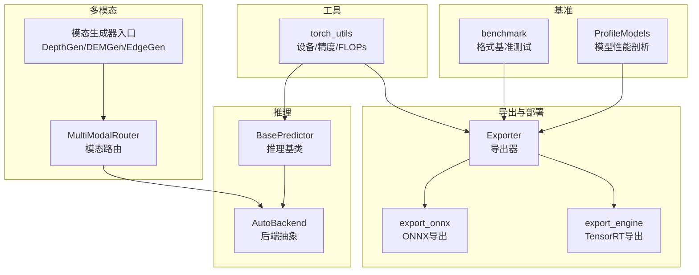
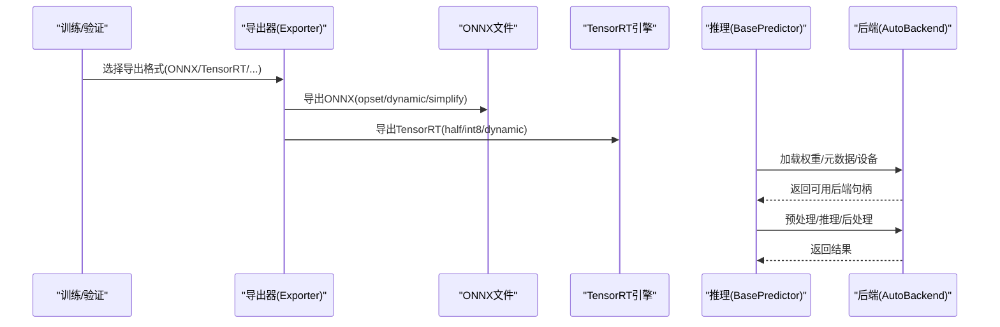
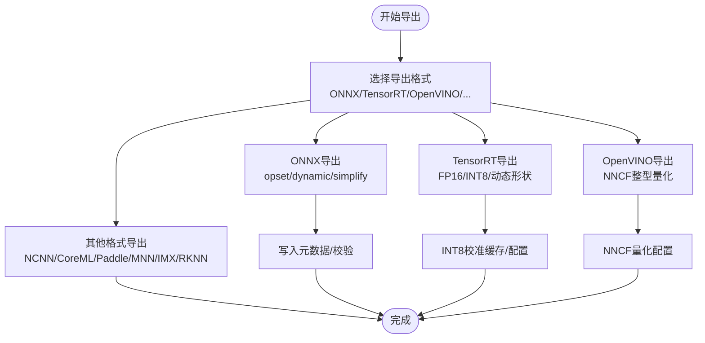
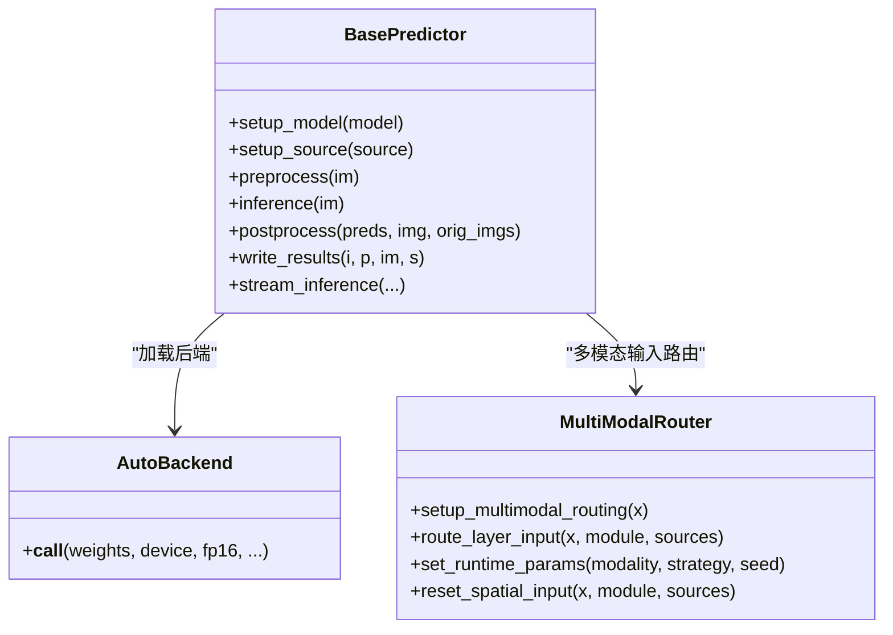
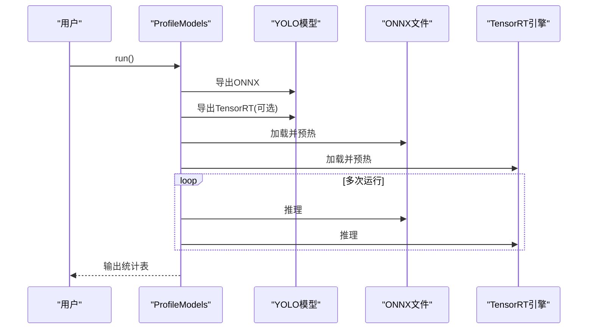
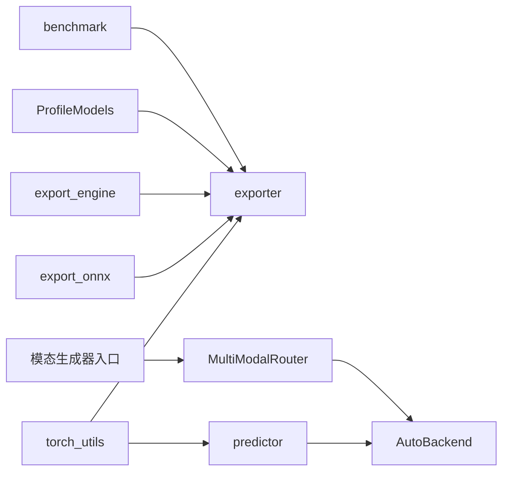

# 推理优化策略

<cite>
**本文档引用的文件**
- [ultralytics/engine/exporter.py](file://ultralytics/engine/exporter.py)
- [ultralytics/utils/export.py](file://ultralytics/utils/export.py)
- [ultralytics/utils/torch_utils.py](file://ultralytics/utils/torch_utils.py)
- [ultralytics/engine/predictor.py](file://ultralytics/engine/predictor.py)
- [ultralytics/models/yolo/model.py](file://ultralytics/models/yolo/model.py)
- [ultralytics/nn/mm/router.py](file://ultralytics/nn/mm/router.py)
- [ultralytics/utils/benchmarks.py](file://ultralytics/utils/benchmarks.py)
- [ultralytics/nn/mm/generators/__init__.py](file://ultralytics/nn/mm/generators/__init__.py)
</cite>

## 目录
1. [引言](#引言)
2. [项目结构](#项目结构)
3. [核心组件](#核心组件)
4. [架构总览](#架构总览)
5. [详细组件分析](#详细组件分析)
6. [依赖关系分析](#依赖关系分析)
7. [性能考量](#性能考量)
8. [故障排查指南](#故障排查指南)
9. [结论](#结论)
10. [附录](#附录)

## 引言
本指南围绕多模态检测系统的推理优化策略展开，结合仓库中的导出、推理与基准工具，系统阐述量化（动态/静态/QAT）、剪枝（结构化/通道剪枝）、蒸馏（知识蒸馏）以及部署（ONNX/TensorRT/OpenVINO/NCNN等）的关键方法与实践要点，并给出针对CPU/GPU/移动端的优化建议。文档同时提供代码级架构图与流程图，帮助读者快速定位实现位置与优化切入点。

## 项目结构
该仓库以Ultralytics框架为基础，提供多模态（RGB+X）检测模型的训练、验证、导出与推理能力。与推理优化相关的核心模块包括：
- 导出与部署：Exporter、export_onnx、export_engine
- 推理管线：BasePredictor、AutoBackend
- 多模态路由：MultiModalRouter
- 基准与性能：ProfileModels、benchmark
- 工具函数：设备选择、混合精度、FLOPs统计等

**图表来源**
- [ultralytics/engine/exporter.py](file://ultralytics/engine/exporter.py)
- [ultralytics/utils/export.py](file://ultralytics/utils/export.py)
- [ultralytics/utils/torch_utils.py](file://ultralytics/utils/torch_utils.py)
- [ultralytics/engine/predictor.py](file://ultralytics/engine/predictor.py)
- [ultralytics/nn/mm/router.py](file://ultralytics/nn/mm/router.py)
- [ultralytics/utils/benchmarks.py](file://ultralytics/utils/benchmarks.py)
- [ultralytics/nn/mm/generators/__init__.py](file://ultralytics/nn/mm/generators/__init__.py)

**章节来源**
- [ultralytics/engine/exporter.py](file://ultralytics/engine/exporter.py)
- [ultralytics/utils/export.py](file://ultralytics/utils/export.py)
- [ultralytics/utils/torch_utils.py](file://ultralytics/utils/torch_utils.py)
- [ultralytics/engine/predictor.py](file://ultralytics/engine/predictor.py)
- [ultralytics/nn/mm/router.py](file://ultralytics/nn/mm/router.py)
- [ultralytics/utils/benchmarks.py](file://ultralytics/utils/benchmarks.py)
- [ultralytics/nn/mm/generators/__init__.py](file://ultralytics/nn/mm/generators/__init__.py)

## 核心组件
- 导出器（Exporter）：统一管理多种格式导出，含ONNX、TensorRT、OpenVINO、NCNN等，支持半精度、整型精度、简化、动态形状等参数控制。
- ONNX导出工具（export_onnx）：封装torch.onnx.export，支持opset、动态轴、常量折叠等。
- TensorRT导出工具（export_engine）：封装TensorRT Builder/Parser/Config，支持INT8校准缓存、DNNL/DLA、动态形状优化。
- 推理基类（BasePredictor）：统一预处理、推理、后处理与结果写入流程，支持warmup、Profiler、AutoBackend自动选择后端。
- 多模态路由器（MultiModalRouter）：零拷贝视图路由，支持RGB/X/Dual三种输入模式，运行时可切换模态与填充策略。
- 基准工具（ProfileModels/benchmark）：批量导出与推理，统计速度与FLOPs，便于跨格式对比。

**章节来源**
- [ultralytics/engine/exporter.py](file://ultralytics/engine/exporter.py)
- [ultralytics/utils/export.py](file://ultralytics/utils/export.py)
- [ultralytics/utils/torch_utils.py](file://ultralytics/utils/torch_utils.py)
- [ultralytics/engine/predictor.py](file://ultralytics/engine/predictor.py)
- [ultralytics/nn/mm/router.py](file://ultralytics/nn/mm/router.py)
- [ultralytics/utils/benchmarks.py](file://ultralytics/utils/benchmarks.py)

## 架构总览
下图展示了从模型到多后端推理的整体流程，包括导出、部署与推理阶段的关键交互。

**图表来源**
- [ultralytics/engine/exporter.py](file://ultralytics/engine/exporter.py)
- [ultralytics/utils/export.py](file://ultralytics/utils/export.py)
- [ultralytics/utils/torch_utils.py](file://ultralytics/utils/torch_utils.py)
- [ultralytics/engine/predictor.py](file://ultralytics/engine/predictor.py)

## 详细组件分析

### 导出与部署组件
- ONNX导出
  - 关键点：opset选择、动态轴、简化（onnxslim）、元数据写入。
  - 适用场景：跨平台推理（ONNX Runtime、OpenVINO、TensorRT前端）。
- TensorRT导出
  - 关键点：Builder/Config/Parser、INT8校准缓存、DLA、动态形状优化、工作区限制。
  - 适用场景：GPU高吞吐推理，支持FP16/INT8混合精度。
- OpenVINO导出
  - 关键点：NNCF整型量化、忽略作用域、元数据写入。
  - 适用场景：Intel CPU/GPU加速推理。
- 其他格式
  - NCNN、CoreML、PaddlePaddle、MNN、IMX、RKNN等，按需启用。

**图表来源**
- [ultralytics/engine/exporter.py](file://ultralytics/engine/exporter.py)
- [ultralytics/utils/export.py](file://ultralytics/utils/export.py)

**章节来源**
- [ultralytics/engine/exporter.py](file://ultralytics/engine/exporter.py)
- [ultralytics/utils/export.py](file://ultralytics/utils/export.py)

### 推理组件与多模态路由
- 推理基类（BasePredictor）
  - 流程：setup_source → preprocess → inference → postprocess → write_results。
  - 特性：warmup、Profiler、AutoBackend自动选择、线程安全锁。
- 多模态路由器（MultiModalRouter）
  - 功能：RGB/X/Dual三模态零拷贝路由、运行时模态切换、空间重置、填充策略。
  - 应用：在多模态链路中按层配置选择输入来源，支持早期/中期融合。

**图表来源**
- [ultralytics/engine/predictor.py](file://ultralytics/engine/predictor.py)
- [ultralytics/nn/mm/router.py](file://ultralytics/nn/mm/router.py)

**章节来源**
- [ultralytics/engine/predictor.py](file://ultralytics/engine/predictor.py)
- [ultralytics/nn/mm/router.py](file://ultralytics/nn/mm/router.py)

### 基准与性能剖析
- ProfileModels
  - 功能：导出ONNX/TensorRT，多次运行统计均值与方差，输出表格。
  - 用途：对比不同格式/精度下的推理速度与FLOPs。
- benchmark
  - 功能：批量导出并验证，输出各格式的文件大小、指标与推理时间。
  - 用途：快速评估格式兼容性与性能。

**图表来源**
- [ultralytics/utils/benchmarks.py](file://ultralytics/utils/benchmarks.py)

**章节来源**
- [ultralytics/utils/benchmarks.py](file://ultralytics/utils/benchmarks.py)

## 依赖关系分析
- 导出器依赖工具函数（设备选择、opset、TensorRT/ONNX库）。
- 推理基类依赖AutoBackend与torch_utils（设备/精度/FLOPs）。
- 多模态路由器与模态生成器配合，为推理提供零拷贝路由与填充策略。
- 基准工具贯穿导出与推理流程，形成闭环性能评估。

**图表来源**
- [ultralytics/utils/torch_utils.py](file://ultralytics/utils/torch_utils.py)
- [ultralytics/engine/exporter.py](file://ultralytics/engine/exporter.py)
- [ultralytics/utils/export.py](file://ultralytics/utils/export.py)
- [ultralytics/engine/predictor.py](file://ultralytics/engine/predictor.py)
- [ultralytics/nn/mm/router.py](file://ultralytics/nn/mm/router.py)
- [ultralytics/utils/benchmarks.py](file://ultralytics/utils/benchmarks.py)
- [ultralytics/nn/mm/generators/__init__.py](file://ultralytics/nn/mm/generators/__init__.py)

**章节来源**
- [ultralytics/utils/torch_utils.py](file://ultralytics/utils/torch_utils.py)
- [ultralytics/engine/exporter.py](file://ultralytics/engine/exporter.py)
- [ultralytics/utils/export.py](file://ultralytics/utils/export.py)
- [ultralytics/engine/predictor.py](file://ultralytics/engine/predictor.py)
- [ultralytics/nn/mm/router.py](file://ultralytics/nn/mm/router.py)
- [ultralytics/utils/benchmarks.py](file://ultralytics/utils/benchmarks.py)
- [ultralytics/nn/mm/generators/__init__.py](file://ultralytics/nn/mm/generators/__init__.py)

## 性能考量
- 设备与精度
  - 设备选择：支持CPU/MPS/CUDA自动选择，多GPU批大小校验，环境变量控制可见设备。
  - 精度：FP16（CUDA）与INT8（TensorRT/OpenVINO）显著降低延迟与内存占用。
- 混合精度与FLOPs
  - autocast与inference_mode减少显存与提升吞吐。
  - FLOPs统计（thop/torch profiler）辅助模型复杂度评估。
- 导出参数
  - ONNX：动态形状、简化、opset选择影响跨平台兼容性与性能。
  - TensorRT：工作区、DLA、INT8校准缓存、动态形状优化。
- 推理流程
  - warmup、Profiler、批大小、预处理流水线（LetterBox/归一化）对端到端延迟有直接影响。

**章节来源**
- [ultralytics/utils/torch_utils.py](file://ultralytics/utils/torch_utils.py)
- [ultralytics/engine/predictor.py](file://ultralytics/engine/predictor.py)

## 故障排查指南
- 导出失败
  - 格式不支持/参数冲突：检查Exporter参数校验与格式支持列表。
  - TensorRT解析失败：确认ONNX文件有效、opset匹配、动态形状配置。
- INT8校准问题
  - 校准数据集不足：校验批大小与样本数量，必要时增加数据量。
  - 缓存命中：复用calibration cache，避免重复校准。
- 推理异常
  - 设备不匹配：确认CUDA可用性、多GPU批大小整除、设备可见性。
  - 预处理错误：核对输入尺寸、通道数、归一化方式。
- 多模态路由
  - 模态通道不一致：检查RGB/X通道数与配置，确保路由后输入形状匹配。
  - 空间重置：X模态新输入起点需保证空间维度一致。

**章节来源**
- [ultralytics/engine/exporter.py](file://ultralytics/engine/exporter.py)
- [ultralytics/engine/predictor.py](file://ultralytics/engine/predictor.py)
- [ultralytics/nn/mm/router.py](file://ultralytics/nn/mm/router.py)

## 结论
通过统一的导出与推理框架，本项目为多模态检测提供了从模型到多后端部署的完整优化路径。结合ONNX/TensorRT/OpenVINO等部署手段与设备/精度策略，可在不同硬件平台上取得稳定且高效的推理性能。建议以ProfileModels/benchmark为依据，逐步迭代量化、剪枝与蒸馏策略，最终实现精度与效率的平衡。

## 附录
- 多模态生成器入口：提供DepthGen、DEMGen、EdgeGen等生成器，用于构造X模态输入。
- YOLO多模态模型：支持RGB-only、X-only与Dual融合输入，自动检测与配置输入通道。

**章节来源**
- [ultralytics/nn/mm/generators/__init__.py](file://ultralytics/nn/mm/generators/__init__.py)
- [ultralytics/models/yolo/model.py](file://ultralytics/models/yolo/model.py)