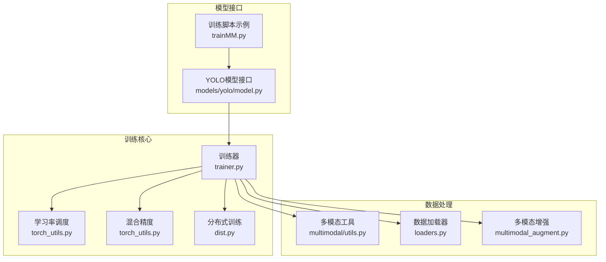
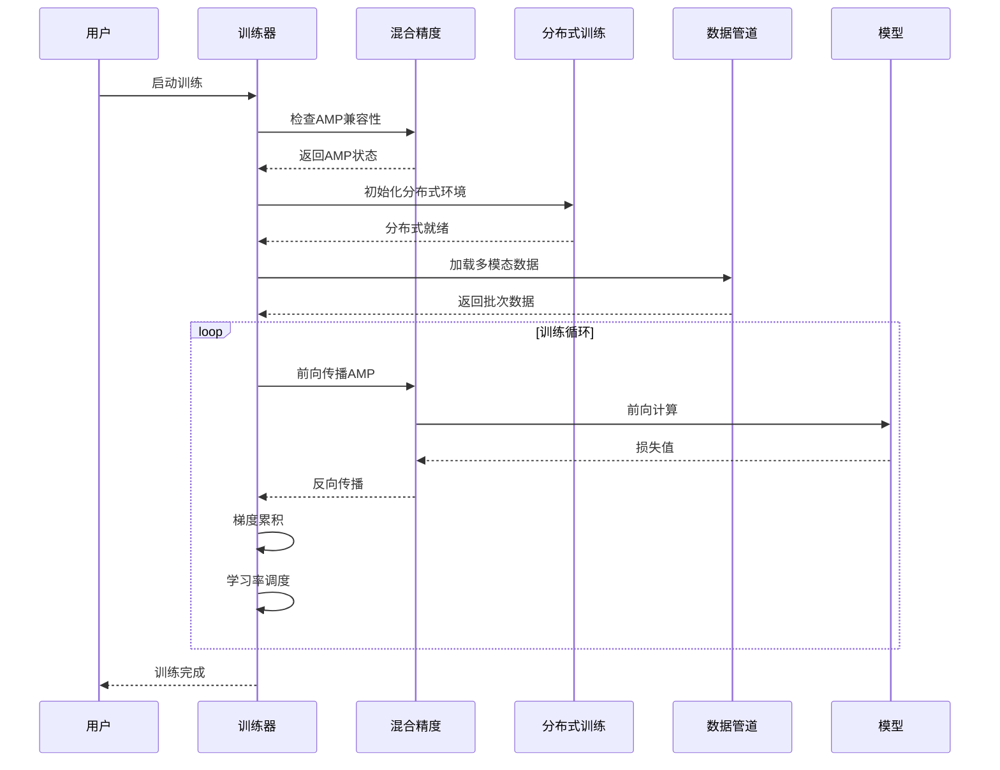
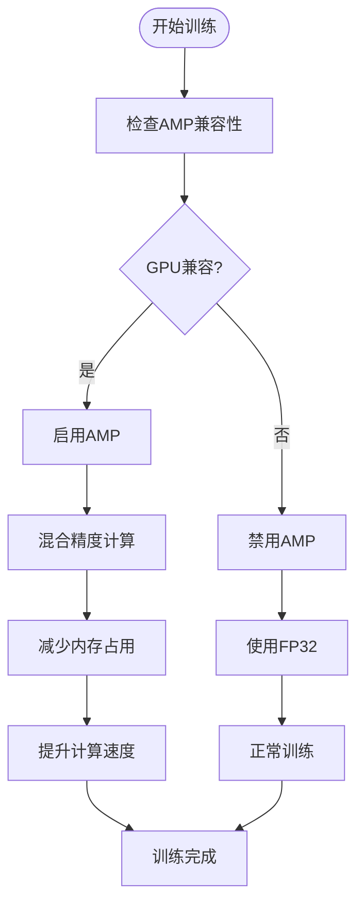
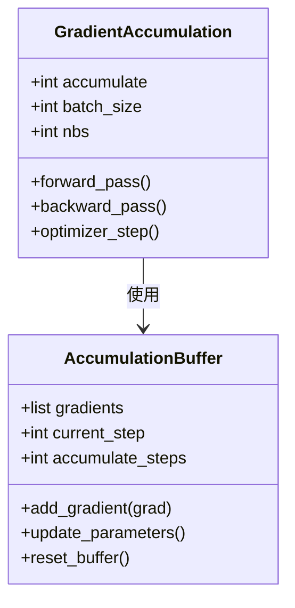
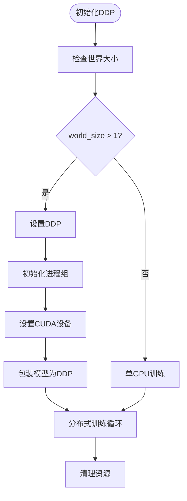
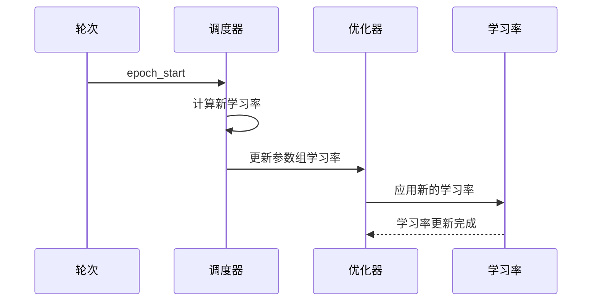
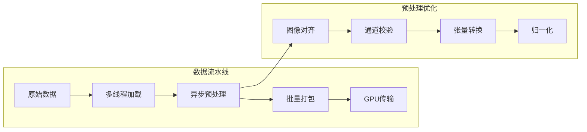
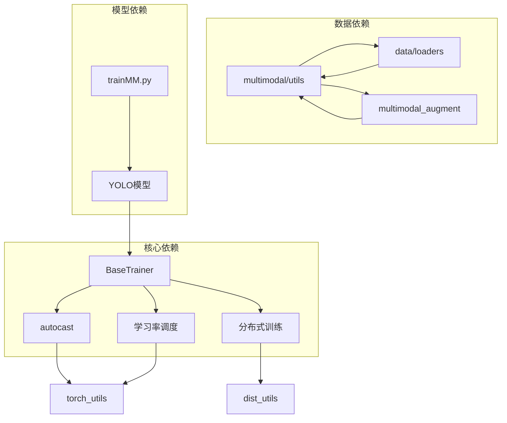

# 训练加速技术

<cite>
**本文档引用的文件**
- [ultralytics/engine/trainer.py](file://ultralytics/engine/trainer.py)
- [ultralytics/utils/torch_utils.py](file://ultralytics/utils/torch_utils.py)
- [ultralytics/utils/dist.py](file://ultralytics/utils/dist.py)
- [ultralytics/utils/checks.py](file://ultralytics/utils/checks.py)
- [ultralytics/data/multimodal/utils.py](file://ultralytics/data/multimodal/utils.py)
- [ultralytics/data/loaders.py](file://ultralytics/data/loaders.py)
- [ultralytics/data/multimodal_augment.py](file://ultralytics/data/multimodal_augment.py)
- [ultralytics/models/yolo/model.py](file://ultralytics/models/yolo/model.py)
- [trainMM.py](file://trainMM.py)
</cite>

## 目录
1. [简介](#简介)
2. [项目结构](#项目结构)
3. [核心组件](#核心组件)
4. [架构概览](#架构概览)
5. [详细组件分析](#详细组件分析)
6. [依赖分析](#依赖分析)
7. [性能考虑](#性能考虑)
8. [故障排除指南](#故障排除指南)
9. [结论](#结论)

## 简介

本指南专注于多模态检测系统的训练加速技术，基于Ultralytics YOLO框架的实现，深入讲解以下关键技术：

- **混合精度训练（AMP自动混合精度）**：实现原理、配置方法与性能提升效果
- **梯度累积技术**：在显存有限情况下提高有效批量大小
- **分布式训练策略（DDP）**：配置与优化技巧
- **学习率调度优化**：余弦退火、阶梯衰减等策略
- **多模态数据加速实践**：数据预取、异步加载等技术

这些技术在多模态场景下（如RGB+X模态融合）具有显著的性能优势，能够有效提升训练效率并降低资源消耗。

## 项目结构

该代码库采用模块化设计，围绕训练加速的关键技术分布在以下核心模块：



**图表来源**
- [ultralytics/engine/trainer.py](file://ultralytics/engine/trainer.py)
- [ultralytics/utils/torch_utils.py](file://ultralytics/utils/torch_utils.py)
- [ultralytics/utils/dist.py](file://ultralytics/utils/dist.py)
- [ultralytics/data/multimodal/utils.py](file://ultralytics/data/multimodal/utils.py)
- [ultralytics/data/loaders.py](file://ultralytics/data/loaders.py)
- [ultralytics/data/multimodal_augment.py](file://ultralytics/data/multimodal_augment.py)
- [ultralytics/models/yolo/model.py](file://ultralytics/models/yolo/model.py)
- [trainMM.py](file://trainMM.py)

**章节来源**
- [ultralytics/engine/trainer.py](file://ultralytics/engine/trainer.py)
- [ultralytics/utils/torch_utils.py](file://ultralytics/utils/torch_utils.py)
- [ultralytics/utils/dist.py](file://ultralytics/utils/dist.py)
- [ultralytics/data/multimodal/utils.py](file://ultralytics/data/multimodal/utils.py)
- [ultralytics/data/loaders.py](file://ultralytics/data/loaders.py)
- [ultralytics/data/multimodal_augment.py](file://ultralytics/data/multimodal_augment.py)
- [ultralytics/models/yolo/model.py](file://ultralytics/models/yolo/model.py)
- [trainMM.py](file://trainMM.py)

## 核心组件

### 训练器（BaseTrainer）

BaseTrainer是训练系统的核心控制器，负责：

- **训练流程管理**：完整的训练循环控制
- **分布式训练支持**：DDP初始化与进程管理
- **混合精度配置**：AMP自动混合精度检查与启用
- **学习率调度**：余弦退火与线性调度器
- **梯度累积**：有效批量大小扩展机制

关键特性：
- 自动设备选择与多GPU支持
- 智能批大小估算（AutoBatch）
- EMA模型指数移动平均
- 内存清理与垃圾回收

**章节来源**
- [ultralytics/engine/trainer.py](file://ultralytics/engine/trainer.py)

### 混合精度工具（autocast）

提供跨版本兼容的自动混合精度上下文管理器：

- **版本兼容性**：PyTorch 1.13+使用`torch.amp.autocast`
- **设备适配**：CUDA设备专用的AMP上下文
- **性能优化**：减少内存占用，提升计算速度

**章节来源**
- [ultralytics/utils/torch_utils.py](file://ultralytics/utils/torch_utils.py)

### 分布式训练（DDP）

实现高效的多GPU分布式训练：

- **进程组初始化**：NCCL后端优先，Gloo回退
- **命令生成**：动态生成分布式训练命令
- **端口管理**：自动寻找可用网络端口
- **资源清理**：训练完成后清理临时文件

**章节来源**
- [ultralytics/utils/dist.py](file://ultralytics/utils/dist.py)

### 多模态数据处理

专门针对多模态输入的数据预处理与增强：

- **图像对齐**：RGB与X模态的空间对齐
- **通道校验**：严格的通道数验证与转换
- **张量转换**：RGB与X模态的标准化转换
- **多格式支持**：TIFF、NPY、NPZ等多种格式

**章节来源**
- [ultralytics/data/multimodal/utils.py](file://ultralytics/data/multimodal/utils.py)

## 架构概览

多模态训练系统的整体架构采用分层设计，各组件协同工作：



**图表来源**
- [ultralytics/engine/trainer.py](file://ultralytics/engine/trainer.py)
- [ultralytics/utils/torch_utils.py](file://ultralytics/utils/torch_utils.py)
- [ultralytics/utils/dist.py](file://ultralytics/utils/dist.py)

## 详细组件分析

### 混合精度训练（AMP）实现

#### 实现原理

AMP通过动态混合数据类型来提升训练效率：



**图表来源**
- [ultralytics/utils/checks.py](file://ultralytics/utils/checks.py)
- [ultralytics/utils/torch_utils.py](file://ultralytics/utils/torch_utils.py)

#### 配置方法

在训练配置中启用AMP：

1. **自动检测**：系统自动检查GPU兼容性
2. **手动配置**：通过参数控制AMP启用
3. **版本适配**：自动适配不同PyTorch版本的API

#### 性能提升效果

- **内存节省**：约50%的显存占用减少
- **速度提升**：FP16计算比FP32快2-3倍
- **稳定性保证**：自动梯度缩放防止数值溢出

**章节来源**
- [ultralytics/utils/checks.py](file://ultralytics/utils/checks.py)
- [ultralytics/utils/torch_utils.py](file://ultralytics/utils/torch_utils.py)

### 梯度累积技术

梯度累积通过多次小批量更新来模拟大批次训练：



**图表来源**
- [ultralytics/engine/trainer.py](file://ultralytics/engine/trainer.py)

#### 实现机制

1. **累积步数计算**：`accumulate = max(round(nbs/batch_size), 1)`
2. **梯度累积**：在优化器步骤前累积梯度
3. **参数更新**：达到累积步数后执行优化器步骤

#### 显存优化策略

- **有效批量大小**：`effective_batch_size = batch_size × accumulate`
- **内存管理**：及时清理中间变量
- **梯度缩放**：防止梯度爆炸

**章节来源**
- [ultralytics/engine/trainer.py](file://ultralytics/engine/trainer.py)

### 分布式训练策略（DDP）

#### DDP配置流程



**图表来源**
- [ultralytics/engine/trainer.py](file://ultralytics/engine/trainer.py)
- [ultralytics/utils/dist.py](file://ultralytics/utils/dist.py)

#### 优化技巧

1. **进程组配置**：
   - NCCL后端优先（GPU环境）
   - Gloo后端回退（CPU环境）
   - 超时设置：3小时超时保障长时间训练

2. **通信优化**：
   - `TORCH_NCCL_BLOCKING_WAIT=1` 强制超时等待
   - 合理的批大小分配（每GPU批大小 = 总批大小/世界大小）

3. **资源管理**：
   - 自动端口选择
   - 临时文件清理
   - 进程同步与广播

**章节来源**
- [ultralytics/engine/trainer.py](file://ultralytics/engine/trainer.py)
- [ultralytics/utils/dist.py](file://ultralytics/utils/dist.py)

### 学习率调度优化

#### 调度器类型

系统支持两种主要的学习率调度策略：

1. **余弦退火调度**：
   ```python
   def one_cycle(y1=0.0, y2=1.0, steps=100):
       return lambda x: max((1 - cos(x * pi / steps)) / 2, 0) * (y2 - y1) + y1
   ```

2. **阶梯衰减调度**：
   ```python
   # 线性衰减：max(1 - x/epochs, 0) * (1-lrf) + lrf
   ```

#### 动态调整机制



**图表来源**
- [ultralytics/engine/trainer.py](file://ultralytics/engine/trainer.py)
- [ultralytics/utils/torch_utils.py](file://ultralytics/utils/torch_utils.py)

**章节来源**
- [ultralytics/engine/trainer.py](file://ultralytics/engine/trainer.py)
- [ultralytics/utils/torch_utils.py](file://ultralytics/utils/torch_utils.py)

### 多模态数据加速实践

#### 数据预取与异步加载



**图表来源**
- [ultralytics/data/loaders.py](file://ultralytics/data/loaders.py)
- [ultralytics/data/multimodal/utils.py](file://ultralytics/data/multimodal/utils.py)

#### 多模态增强策略

针对不同模态的定制化增强：

1. **RGB模态增强**：
   - HSV变换（仅RGB通道）
   - 几何变换（翻转、旋转）
   - 颜色抖动

2. **X模态增强**：
   - IR专用增强（CLAHE、Gamma、噪声）
   - 深度图专用增强（量化、标定漂移）
   - 非几何变换保护

3. **模态感知增强**：
   - 早期融合：6通道统一增强
   - 中期融合：模态独立增强后合并
   - 晚期融合：特征级增强

**章节来源**
- [ultralytics/data/multimodal/utils.py](file://ultralytics/data/multimodal/utils.py)
- [ultralytics/data/multimodal_augment.py](file://ultralytics/data/multimodal_augment.py)

## 依赖分析

训练加速技术之间的依赖关系：



**图表来源**
- [ultralytics/engine/trainer.py](file://ultralytics/engine/trainer.py)
- [ultralytics/utils/torch_utils.py](file://ultralytics/utils/torch_utils.py)
- [ultralytics/utils/dist.py](file://ultralytics/utils/dist.py)
- [ultralytics/data/multimodal/utils.py](file://ultralytics/data/multimodal/utils.py)
- [ultralytics/data/loaders.py](file://ultralytics/data/loaders.py)
- [ultralytics/data/multimodal_augment.py](file://ultralytics/data/multimodal_augment.py)
- [ultralytics/models/yolo/model.py](file://ultralytics/models/yolo/model.py)
- [trainMM.py](file://trainMM.py)

## 性能考虑

### 内存优化策略

1. **显存管理**：
   - 定期垃圾回收（`gc.collect()`）
   - CUDA缓存清理（`torch.cuda.empty_cache()`）
   - EMA模型内存优化

2. **批大小优化**：
   - AutoBatch自动估算最优批大小
   - 梯度累积扩展有效批量
   - 分布式训练的批大小分配

3. **数据加载优化**：
   - 多线程数据加载
   - 异步预处理
   - 内存映射文件支持

### 计算效率优化

1. **混合精度计算**：
   - FP16计算加速
   - 自动梯度缩放
   - 数值稳定性保障

2. **分布式计算**：
   - 数据并行优化
   - 梯度同步优化
   - 通信聚合策略

3. **算法优化**：
   - EMA模型平滑
   - 学习率自适应
   - 早停机制

## 故障排除指南

### 常见问题与解决方案

#### AMP相关问题

1. **GPU兼容性问题**：
   - 检测特定GPU型号的兼容性
   - 自动降级到FP32训练
   - 日志警告与用户提示

2. **数值不稳定**：
   - 梯度缩放参数调整
   - 梯度裁剪防止爆炸
   - 检查损失函数数值范围

#### 分布式训练问题

1. **进程启动失败**：
   - 端口冲突检测与重试
   - 环境变量检查
   - 权限问题排查

2. **通信异常**：
   - NCCL后端回退到Gloo
   - 超时时间调整
   - 网络连接测试

#### 数据加载问题

1. **内存不足**：
   - 减少批大小
   - 关闭数据缓存
   - 优化数据预处理

2. **数据不一致**：
   - 模态对齐验证
   - 通道数检查
   - 数据格式标准化

**章节来源**
- [ultralytics/utils/checks.py](file://ultralytics/utils/checks.py)
- [ultralytics/engine/trainer.py](file://ultralytics/engine/trainer.py)

## 结论

多模态检测系统的训练加速技术通过以下关键策略实现了显著的性能提升：

1. **混合精度训练**：在保证数值稳定性的前提下，实现2-3倍的计算加速和50%的显存节省
2. **梯度累积技术**：在显存限制下实现大批次训练效果，提高训练稳定性
3. **分布式训练优化**：通过DDP实现多GPU高效并行训练，线性扩展训练速度
4. **智能学习率调度**：自适应的学习率策略提升收敛性能
5. **多模态数据优化**：专门的预处理和增强策略提升数据质量

这些技术的综合应用使得多模态检测系统能够在保持高精度的同时，显著提升训练效率，为大规模多模态应用提供了坚实的技术基础。建议在实际部署中根据硬件配置和数据特点选择合适的加速策略组合，以获得最佳的性能表现。