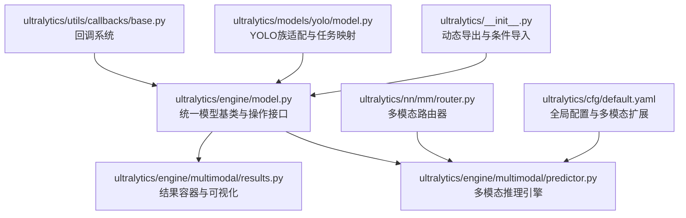
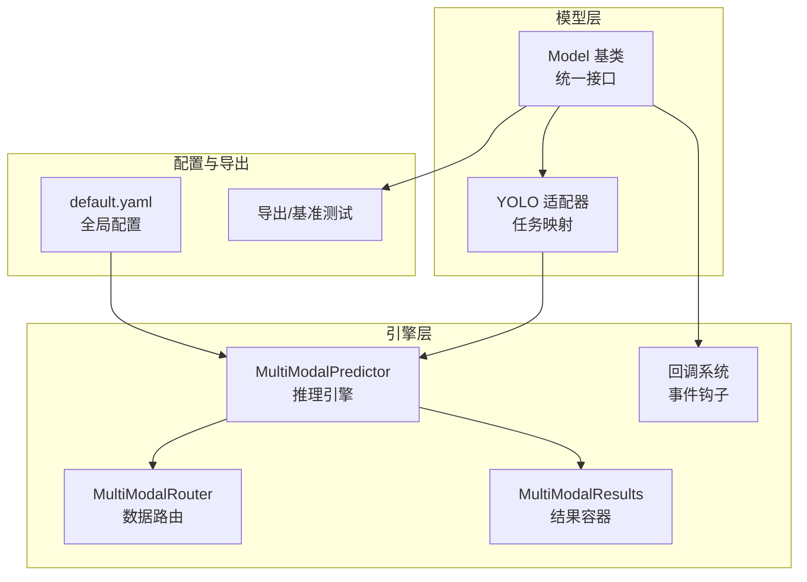
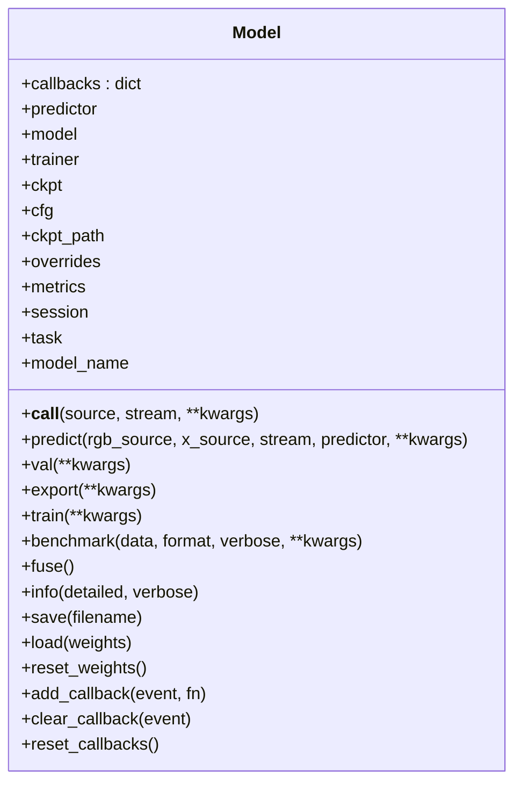
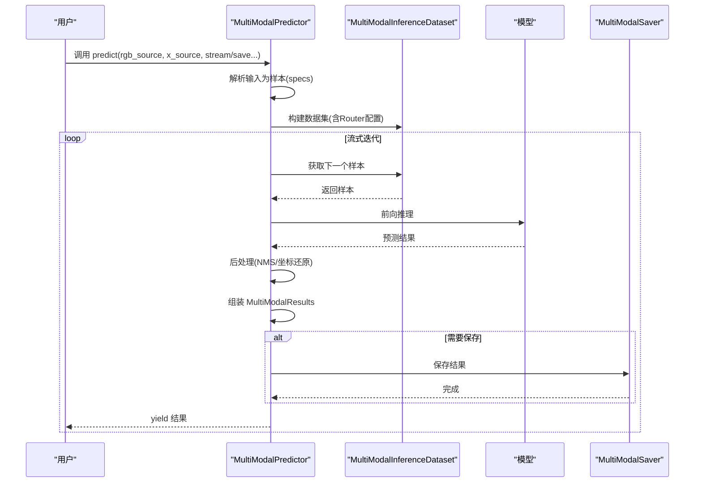
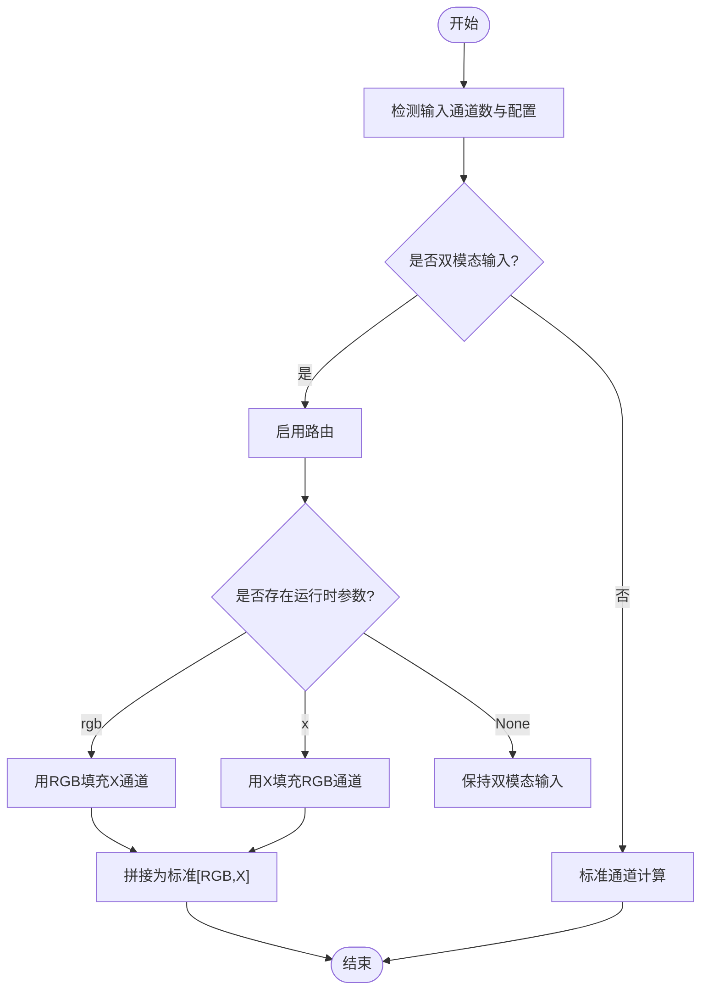
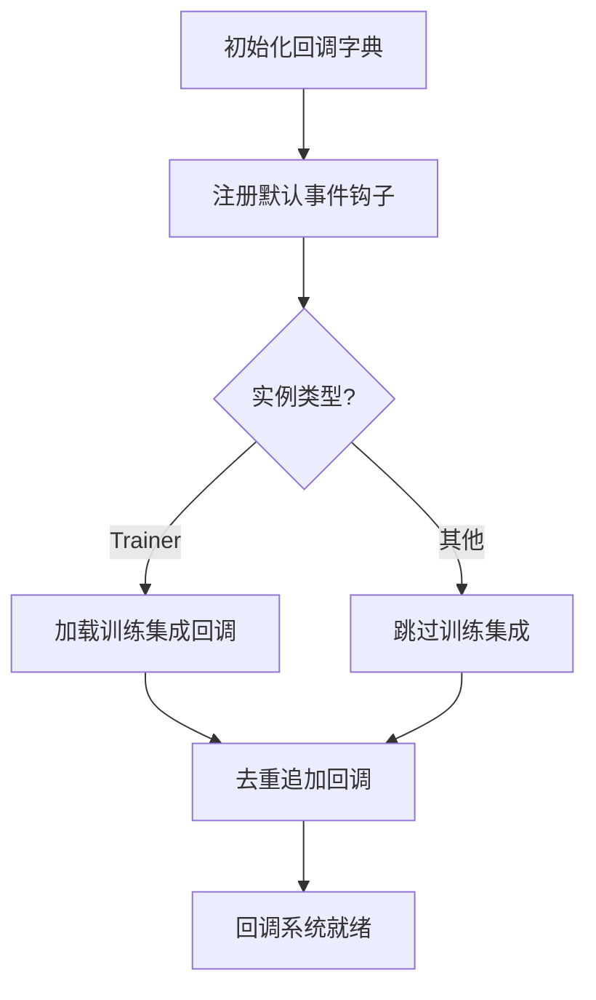
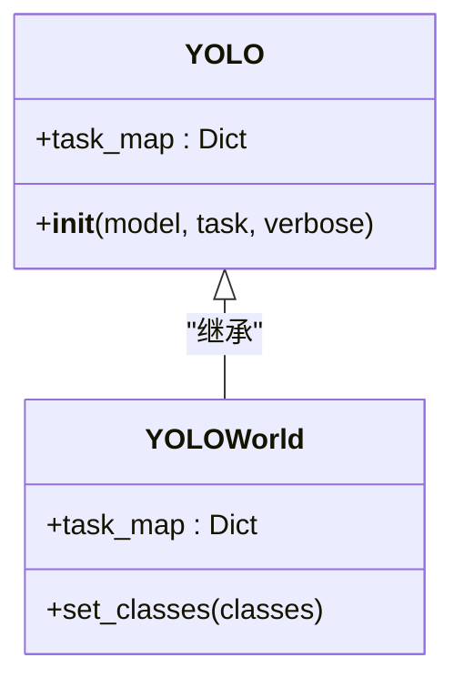
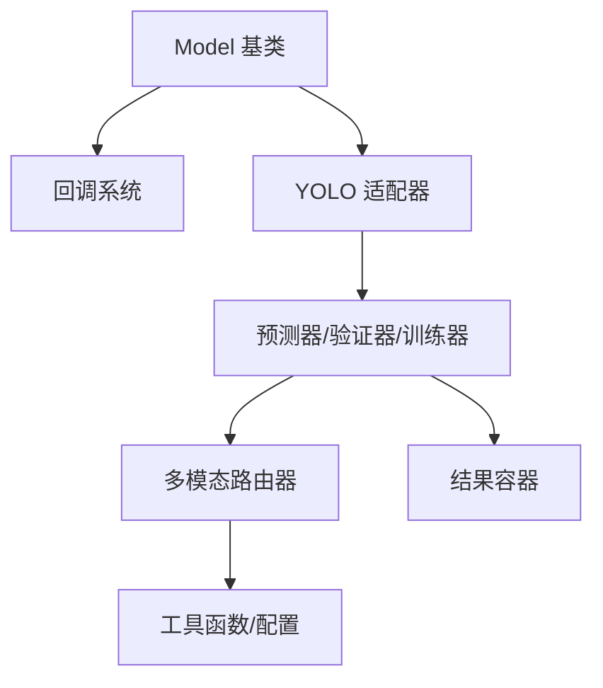

# 插件开发最佳实践

<cite>
**本文档引用的文件**
- [ultralytics/__init__.py](file://ultralytics/__init__.py)
- [ultralytics/engine/model.py](file://ultralytics/engine/model.py)
- [ultralytics/utils/callbacks/base.py](file://ultralytics/utils/callbacks/base.py)
- [ultralytics/utils/callbacks/__init__.py](file://ultralytics/utils/callbacks/__init__.py)
- [ultralytics/models/__init__.py](file://ultralytics/models/__init__.py)
- [ultralytics/models/yolo/model.py](file://ultralytics/models/yolo/model.py)
- [ultralytics/engine/multimodal/predictor.py](file://ultralytics/engine/multimodal/predictor.py)
- [ultralytics/engine/multimodal/results.py](file://ultralytics/engine/multimodal/results.py)
- [ultralytics/nn/mm/__init__.py](file://ultralytics/nn/mm/__init__.py)
- [ultralytics/nn/mm/router.py](file://ultralytics/nn/mm/router.py)
- [ultralytics/models/yolo/multimodal/__init__.py](file://ultralytics/models/yolo/multimodal/__init__.py)
- [ultralytics/cfg/default.yaml](file://ultralytics/cfg/default.yaml)
</cite>

## 目录
1. [引言](#引言)
2. [项目结构](#项目结构)
3. [核心组件](#核心组件)
4. [架构总览](#架构总览)
5. [详细组件分析](#详细组件分析)
6. [依赖关系分析](#依赖关系分析)
7. [性能考虑](#性能考虑)
8. [故障排除指南](#故障排除指南)
9. [结论](#结论)
10. [附录](#附录)

## 引言
本指南面向希望基于该代码库开发可插拔系统组件的工程师，聚焦于接口设计原则、模块化架构、兼容性保障、回调机制、事件处理、状态管理、生命周期与资源清理、代码规范、测试策略与部署方案。文档以多模态检测系统为背景，提炼出一套可迁移至其他任务领域的插件开发范式。

## 项目结构
该仓库采用“按功能域分层 + 按任务类型分包”的组织方式：
- 核心入口与导出：ultralytics/__init__.py 动态导出可用模型与模块，支持条件导入（如 YOLOMM、RTDETRMM、DepthGen 等）。
- 引擎层：ultralytics/engine/* 提供训练、验证、预测、导出、基准测试等通用能力，其中 multimodal 子模块提供独立的多模态推理引擎。
- 模型层：ultralytics/models/* 定义不同任务类型的模型族（YOLO、RTDETR、SAM 等），并提供多模态适配（YOLOMM、RTDETRMM）。
- 神经网络层：ultralytics/nn/* 提供骨干网络、颈部、头、模块与多模态路由器等基础构件。
- 工具与回调：ultralytics/utils/* 提供工具函数、回调系统、配置等。
- 配置：ultralytics/cfg/default.yaml 提供全局默认配置，包含多模态扩展项。

**图表来源**
- [ultralytics/__init__.py:1-88](file://ultralytics/__init__.py#L1-L88)
- [ultralytics/engine/model.py:29-130](file://ultralytics/engine/model.py#L29-L130)
- [ultralytics/engine/multimodal/predictor.py:16-98](file://ultralytics/engine/multimodal/predictor.py#L16-L98)
- [ultralytics/engine/multimodal/results.py:14-56](file://ultralytics/engine/multimodal/results.py#L14-L56)
- [ultralytics/models/yolo/model.py:27-95](file://ultralytics/models/yolo/model.py#L27-L95)
- [ultralytics/nn/mm/router.py:11-63](file://ultralytics/nn/mm/router.py#L11-L63)
- [ultralytics/utils/callbacks/base.py:144-191](file://ultralytics/utils/callbacks/base.py#L144-L191)
- [ultralytics/cfg/default.yaml:134-168](file://ultralytics/cfg/default.yaml#L134-L168)

**章节来源**
- [ultralytics/__init__.py:1-88](file://ultralytics/__init__.py#L1-L88)
- [ultralytics/engine/model.py:29-130](file://ultralytics/engine/model.py#L29-L130)
- [ultralytics/models/yolo/model.py:27-95](file://ultralytics/models/yolo/model.py#L27-L95)
- [ultralytics/nn/mm/router.py:11-63](file://ultralytics/nn/mm/router.py#L11-L63)
- [ultralytics/utils/callbacks/base.py:144-191](file://ultralytics/utils/callbacks/base.py#L144-L191)
- [ultralytics/cfg/default.yaml:134-168](file://ultralytics/cfg/default.yaml#L134-L168)

## 核心组件
- 统一模型基类：提供训练、验证、预测、导出、基准测试、回调注册等统一接口，支持从权重文件或配置文件加载模型。
- 多模态推理引擎：独立于通用预测器，负责从模型读取路由配置、构建数据集、执行前向、NMS、坐标还原与结果组装，并支持真正的流式推理。
- 回调系统：定义训练、验证、预测、导出各阶段的标准事件钩子，支持集成第三方日志与实验跟踪平台。
- 多模态路由器：根据配置与输入张量自动识别双模态输入，执行零拷贝视图路由、模态填充与通道适配，支持运行时策略切换。
- 结果容器：封装检测框、路径、原始图像、元数据与类别名称，提供统一的可视化与保存接口。

**章节来源**
- [ultralytics/engine/model.py:29-130](file://ultralytics/engine/model.py#L29-L130)
- [ultralytics/engine/multimodal/predictor.py:16-98](file://ultralytics/engine/multimodal/predictor.py#L16-L98)
- [ultralytics/utils/callbacks/base.py:144-191](file://ultralytics/utils/callbacks/base.py#L144-L191)
- [ultralytics/nn/mm/router.py:11-63](file://ultralytics/nn/mm/router.py#L11-L63)
- [ultralytics/engine/multimodal/results.py:14-56](file://ultralytics/engine/multimodal/results.py#L14-L56)

## 架构总览
下图展示了插件系统的关键交互：统一模型基类协调引擎与模型族；多模态推理引擎与路由器协同工作；回调系统贯穿训练/验证/预测/导出生命周期；配置驱动多模态行为。

**图表来源**
- [ultralytics/engine/model.py:29-130](file://ultralytics/engine/model.py#L29-L130)
- [ultralytics/models/yolo/model.py:27-95](file://ultralytics/models/yolo/model.py#L27-L95)
- [ultralytics/engine/multimodal/predictor.py:16-98](file://ultralytics/engine/multimodal/predictor.py#L16-L98)
- [ultralytics/nn/mm/router.py:11-63](file://ultralytics/nn/mm/router.py#L11-L63)
- [ultralytics/engine/multimodal/results.py:14-56](file://ultralytics/engine/multimodal/results.py#L14-L56)
- [ultralytics/utils/callbacks/base.py:144-191](file://ultralytics/utils/callbacks/base.py#L144-L191)
- [ultralytics/cfg/default.yaml:134-168](file://ultralytics/cfg/default.yaml#L134-L168)

## 详细组件分析

### 统一模型基类（Model）
- 职责：统一训练、验证、预测、导出、基准测试、回调注册等接口；支持从权重文件或配置文件加载；提供 fuse、info、save、load 等实用方法。
- 关键特性：
  - 条件导入与动态导出：通过 __all__ 动态聚合可用组件，支持 YOLOMM、RTDETRMM、DepthGen 等条件可用模块。
  - 任务映射：根据配置或权重推断任务类型，绑定对应模型/训练器/验证器/预测器。
  - 回调系统：内置默认回调字典，支持添加集成回调（如 HUB、TensorBoard、MLflow 等）。
- 生命周期：初始化 → 加载/新建模型 → 训练/验证/预测/导出 → 保存/清理。

**图表来源**
- [ultralytics/engine/model.py:29-130](file://ultralytics/engine/model.py#L29-L130)
- [ultralytics/utils/callbacks/base.py:144-191](file://ultralytics/utils/callbacks/base.py#L144-L191)
- [ultralytics/__init__.py:59-87](file://ultralytics/__init__.py#L59-L87)

**章节来源**
- [ultralytics/engine/model.py:29-130](file://ultralytics/engine/model.py#L29-L130)
- [ultralytics/utils/callbacks/base.py:144-191](file://ultralytics/utils/callbacks/base.py#L144-L191)
- [ultralytics/__init__.py:59-87](file://ultralytics/__init__.py#L59-L87)

### 多模态推理引擎（MultiModalPredictor）
- 职责：从模型读取 Router 配置，构建数据集，执行前向、NMS、坐标还原与结果组装，支持真正的流式推理。
- 关键特性：
  - 模型类型检测：自动识别 YOLO 与 RTDETR 输出格式，分别执行后处理。
  - 流式推理：边迭代边 yield，降低内存占用。
  - 结果保存：通过 MultiModalSaver 保存可视化与标注文件。
- 数据流：输入样本 → PairingResolver 解析 → MultiModalInferenceDataset 构建 → 模型前向 → 后处理 → MultiModalResults 组装 → 可视化/保存。

**图表来源**
- [ultralytics/engine/multimodal/predictor.py:99-143](file://ultralytics/engine/multimodal/predictor.py#L99-L143)
- [ultralytics/engine/multimodal/predictor.py:144-244](file://ultralytics/engine/multimodal/predictor.py#L144-L244)
- [ultralytics/engine/multimodal/results.py:14-56](file://ultralytics/engine/multimodal/results.py#L14-L56)

**章节来源**
- [ultralytics/engine/multimodal/predictor.py:16-98](file://ultralytics/engine/multimodal/predictor.py#L16-L98)
- [ultralytics/engine/multimodal/predictor.py:99-143](file://ultralytics/engine/multimodal/predictor.py#L99-L143)
- [ultralytics/engine/multimodal/predictor.py:144-244](file://ultralytics/engine/multimodal/predictor.py#L144-L244)
- [ultralytics/engine/multimodal/results.py:14-56](file://ultralytics/engine/multimodal/results.py#L14-L56)

### 多模态路由器（MultiModalRouter）
- 职责：根据配置与输入张量识别双模态输入，执行零拷贝视图路由、模态填充与通道适配，支持运行时策略切换。
- 关键特性：
  - 输入源映射：RGB(3)、X(Xch)、Dual(3+Xch)，支持从 YAML 层配置中读取 Xch。
  - 运行时参数：支持 runtime_modality、runtime_strategy、runtime_seed，实现运行时 ablation/filling。
  - 向后兼容：确保旧检查点反序列化后具备必要运行时字段。

**图表来源**
- [ultralytics/nn/mm/router.py:157-200](file://ultralytics/nn/mm/router.py#L157-L200)
- [ultralytics/nn/mm/router.py:11-63](file://ultralytics/nn/mm/router.py#L11-L63)

**章节来源**
- [ultralytics/nn/mm/router.py:11-63](file://ultralytics/nn/mm/router.py#L11-L63)
- [ultralytics/nn/mm/router.py:157-200](file://ultralytics/nn/mm/router.py#L157-L200)

### 回调系统（Callbacks）
- 职责：为训练、验证、预测、导出各阶段提供标准化事件钩子，支持集成第三方平台（如 TensorBoard、MLflow、ClearML 等）。
- 关键特性：
  - 默认回调字典：覆盖预训练、训练、验证、预测、导出全流程事件。
  - 动态集成：add_integration_callbacks 根据实例类型加载相应集成回调。
  - 事件扩展：支持自定义回调追加，避免重复注册。

**图表来源**
- [ultralytics/utils/callbacks/base.py:144-191](file://ultralytics/utils/callbacks/base.py#L144-L191)
- [ultralytics/utils/callbacks/base.py:194-235](file://ultralytics/utils/callbacks/base.py#L194-L235)

**章节来源**
- [ultralytics/utils/callbacks/base.py:144-191](file://ultralytics/utils/callbacks/base.py#L144-L191)
- [ultralytics/utils/callbacks/base.py:194-235](file://ultralytics/utils/callbacks/base.py#L194-L235)

### 多模态模型适配（YOLO 适配器）
- 职责：根据模型文件名自动切换到 YOLOWorld、YOLOE、YOLOMM 或 RTDETR 等具体实现，统一任务映射。
- 关键特性：
  - 文件名解析：通过 -world、yoloe、-mm 等关键字识别模型类型。
  - 任务映射：为 classify、detect、segment、pose、obb 等任务绑定对应的模型/训练器/验证器/预测器。

**图表来源**
- [ultralytics/models/yolo/model.py:27-95](file://ultralytics/models/yolo/model.py#L27-L95)
- [ultralytics/models/yolo/model.py:133-200](file://ultralytics/models/yolo/model.py#L133-L200)

**章节来源**
- [ultralytics/models/yolo/model.py:27-95](file://ultralytics/models/yolo/model.py#L27-L95)
- [ultralytics/models/yolo/model.py:133-200](file://ultralytics/models/yolo/model.py#L133-L200)

## 依赖关系分析
- 模块耦合：
  - Model 依赖回调系统与配置系统，向上提供统一接口，向下解耦具体任务实现。
  - MultiModalPredictor 依赖 Router 与 Dataset，结果容器与保存器解耦输出格式。
  - YOLO 适配器通过任务映射将高层调用分派到具体模型族。
- 外部依赖：
  - torch、numpy、PIL、torchvision 等深度学习与图像处理库。
  - 配置系统与工具函数提供参数校验、日志记录与设备管理。

**图表来源**
- [ultralytics/engine/model.py:29-130](file://ultralytics/engine/model.py#L29-L130)
- [ultralytics/utils/callbacks/base.py:144-191](file://ultralytics/utils/callbacks/base.py#L144-L191)
- [ultralytics/models/yolo/model.py:27-95](file://ultralytics/models/yolo/model.py#L27-L95)
- [ultralytics/nn/mm/router.py:11-63](file://ultralytics/nn/mm/router.py#L11-L63)
- [ultralytics/engine/multimodal/results.py:14-56](file://ultralytics/engine/multimodal/results.py#L14-L56)

**章节来源**
- [ultralytics/engine/model.py:29-130](file://ultralytics/engine/model.py#L29-L130)
- [ultralytics/utils/callbacks/base.py:144-191](file://ultralytics/utils/callbacks/base.py#L144-L191)
- [ultralytics/models/yolo/model.py:27-95](file://ultralytics/models/yolo/model.py#L27-L95)
- [ultralytics/nn/mm/router.py:11-63](file://ultralytics/nn/mm/router.py#L11-L63)
- [ultralytics/engine/multimodal/results.py:14-56](file://ultralytics/engine/multimodal/results.py#L14-L56)

## 性能考虑
- 推理优化：
  - 模型融合：Model.fuse 可融合卷积与批归一化层，减少前向计算开销。
  - 流式推理：MultiModalPredictor 的流式迭代可显著降低内存峰值。
  - 设备选择：优先使用 GPU/CUDA，合理设置 batch 与 imgsz。
- 训练优化：
  - 回调集成：利用 TensorBoard、MLflow 等集成回调进行性能监控与超参搜索。
  - 数据增强：多模态异步几何扰动与模态擦除策略需平衡性能与泛化。
- 导出与部署：
  - 导出格式：ONNX/TensorRT 等格式的选择需结合目标设备与精度要求。
  - 基准测试：使用 benchmark 接口评估不同格式的推理速度与精度。

[本节为通用指导，无需特定文件来源]

## 故障排除指南
- 模型类型错误：
  - 症状：调用非 PyTorch 模型的训练/验证/导出方法时报错。
  - 处理：确认模型为 .pt 或 PyTorch Module；使用 Model._check_is_pytorch_model 校验。
- 多模态输入异常：
  - 症状：推理时报错提示缺少 mm_router 或通道数不匹配。
  - 处理：确保使用 YOLOMM/RTDETRMM 模型；检查 Xch 与 x_modality 配置；确认运行时参数设置。
- 回调未生效：
  - 症状：自定义回调未执行。
  - 处理：确认通过 add_callback 注册；避免重复注册；检查回调事件名称是否正确。
- 配置冲突：
  - 症状：参数覆盖不符合预期。
  - 处理：核对 default.yaml 与 overrides 的优先级；确保 mode、imgsz、device 等关键参数一致。

**章节来源**
- [ultralytics/engine/model.py:310-337](file://ultralytics/engine/model.py#L310-L337)
- [ultralytics/engine/multimodal/predictor.py:60-69](file://ultralytics/engine/multimodal/predictor.py#L60-L69)
- [ultralytics/utils/callbacks/base.py:194-235](file://ultralytics/utils/callbacks/base.py#L194-L235)
- [ultralytics/cfg/default.yaml:134-168](file://ultralytics/cfg/default.yaml#L134-L168)

## 结论
该插件系统通过统一模型基类、多模态推理引擎、回调系统与路由器实现了高内聚、低耦合的可插拔架构。遵循本文档的接口设计原则、模块化组织、兼容性保障与生命周期管理建议，可在不破坏现有功能的前提下快速扩展新的任务类型、模态融合策略与实验平台集成。

## 附录

### 插件开发流程（从需求到测试）
- 需求分析：明确任务类型（检测/分割/分类/姿态/OBB）、模态组合（RGB/X/Dual）与性能指标。
- 接口设计：基于 Model 与 YOLO 适配器抽象统一接口，确保与回调系统兼容。
- 模块实现：实现预测器/验证器/训练器，必要时扩展 MultiModalRouter 以支持新的融合策略。
- 集成测试：使用 default.yaml 配置关键参数，编写单元与端到端测试，验证流式推理与结果保存。
- 部署验证：导出模型并进行基准测试，对比不同格式的性能与精度。

[本节为流程概述，无需特定文件来源]

### 代码规范与最佳实践
- 接口一致性：所有插件均应实现统一的 predict/val/train/export 接口，遵循 Model 的参数约定。
- 回调集成：通过 add_integration_callbacks 注册第三方平台回调，避免硬编码。
- 配置驱动：优先通过 YAML 配置控制行为，减少代码中的魔法数字。
- 错误处理：对输入参数与模型类型进行严格校验，提供清晰的错误信息与回退策略。

[本节为通用规范，无需特定文件来源]