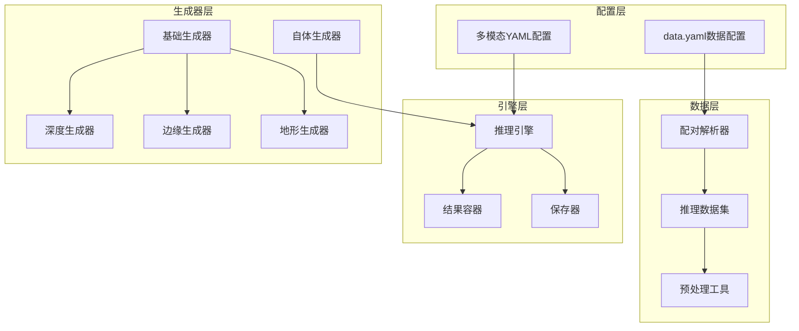
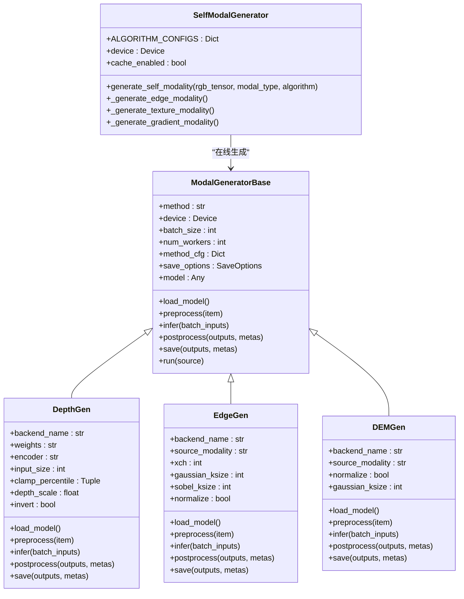
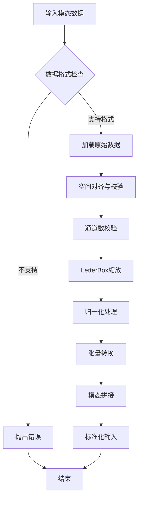
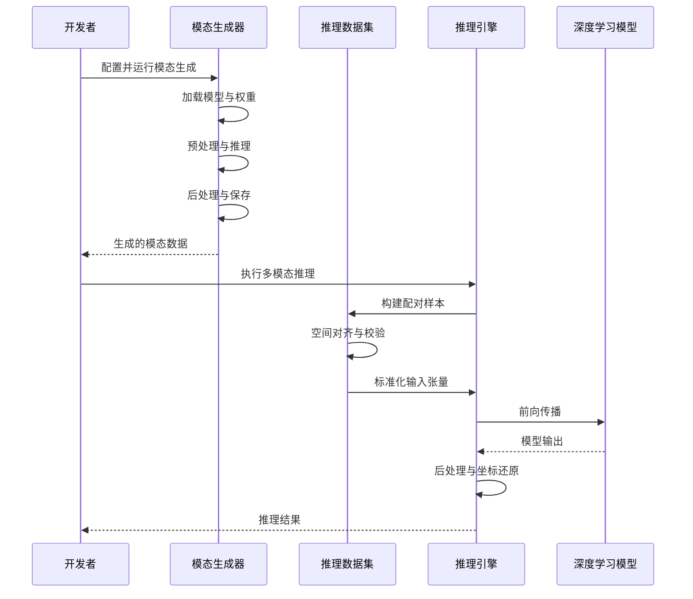
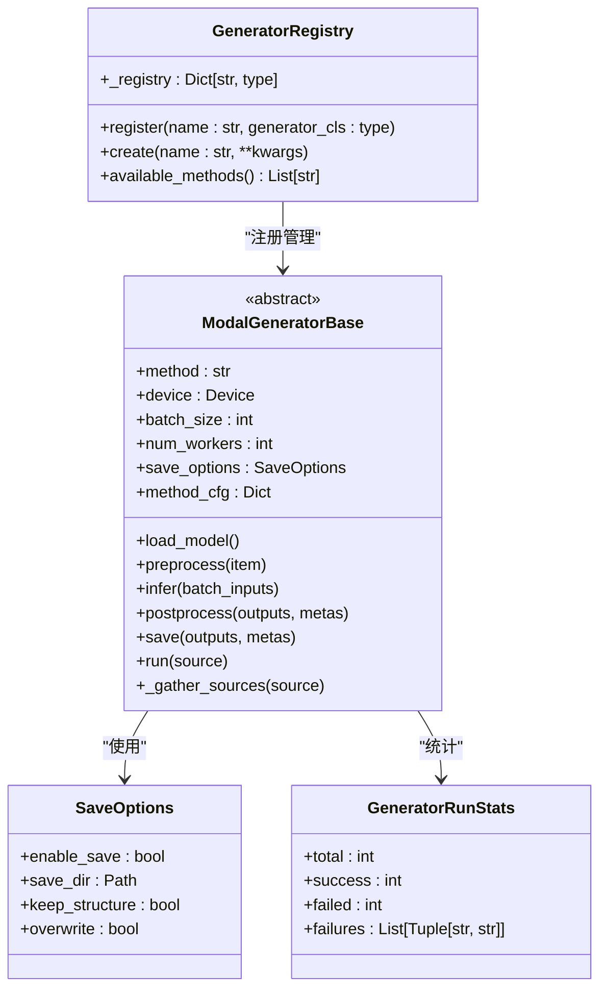
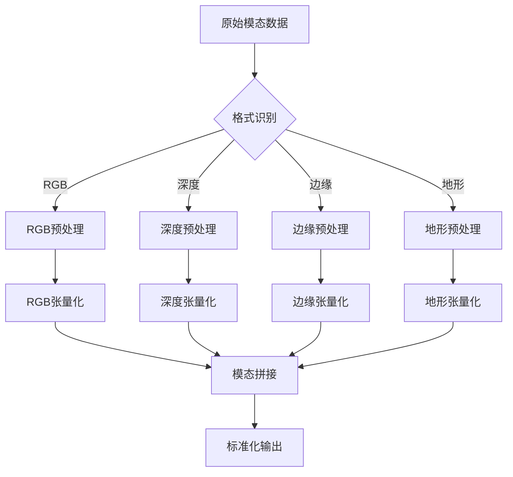
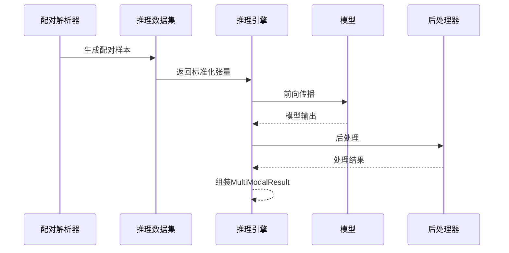
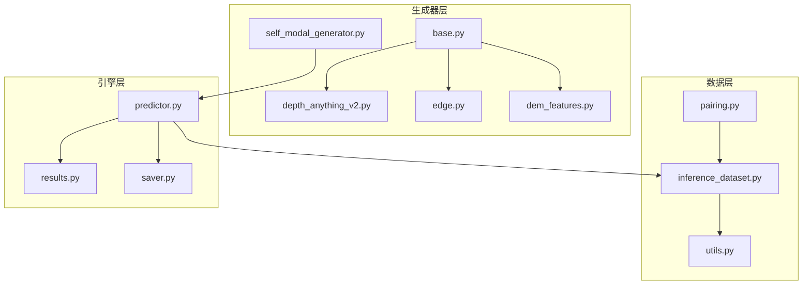

# 新模态支持开发

<cite>
**本文档引用的文件**
- [多模态YAML构建指点.md](file://ultralytics/cfg/models/多模态YAML构建指点.md)
- [__init__.py](file://ultralytics/data/multimodal/__init__.py)
- [inference_dataset.py](file://ultralytics/data/multimodal/inference_dataset.py)
- [pairing.py](file://ultralytics/data/multimodal/pairing.py)
- [utils.py](file://ultralytics/data/multimodal/utils.py)
- [__init__.py](file://ultralytics/engine/multimodal/__init__.py)
- [predictor.py](file://ultralytics/engine/multimodal/predictor.py)
- [results.py](file://ultralytics/engine/multimodal/results.py)
- [saver.py](file://ultralytics/engine/multimodal/saver.py)
- [base.py](file://ultralytics/nn/mm/generators/base.py)
- [dem_features.py](file://ultralytics/nn/mm/generators/dem_features.py)
- [depth_anything_v2.py](file://ultralytics/nn/mm/generators/depth_anything_v2.py)
- [edge.py](file://ultralytics/nn/mm/generators/edge.py)
- [self_modal_generator.py](file://ultralytics/models/yolo/multimodal/self_modal_generator.py)
</cite>

## 目录
1. [简介](#简介)
2. [项目结构](#项目结构)
3. [核心组件](#核心组件)
4. [架构概览](#架构概览)
5. [详细组件分析](#详细组件分析)
6. [依赖分析](#依赖分析)
7. [性能考虑](#性能考虑)
8. [故障排除指南](#故障排除指南)
9. [结论](#结论)
10. [附录](#附录)

## 简介

本指南面向开发者，详细介绍如何为多模态系统添加新的模态类型。系统采用"配置驱动 + 第5字段路由"的设计理念，支持深度估计、地形分析、边缘检测等多种模态的集成。通过统一的模态生成器接口、灵活的路由配置和标准化的数据预处理流程，开发者可以快速扩展新的模态类型。

## 项目结构

多模态系统采用分层架构设计，主要包含以下核心模块：



**图表来源**
- [多模态YAML构建指点.md:1-239](file://ultralytics/cfg/models/多模态YAML构建指点.md#L1-L239)
- [inference_dataset.py:1-252](file://ultralytics/data/multimodal/inference_dataset.py#L1-L252)
- [predictor.py:1-494](file://ultralytics/engine/multimodal/predictor.py#L1-L494)

**章节来源**
- [多模态YAML构建指点.md:1-239](file://ultralytics/cfg/models/多模态YAML构建指点.md#L1-L239)
- [__init__.py:1-21](file://ultralytics/data/multimodal/__init__.py#L1-L21)

## 核心组件

### 模态生成器体系

系统提供了完整的模态生成器基础设施，支持离线模态生成和在线模态生成两种模式：



**图表来源**
- [base.py:77-225](file://ultralytics/nn/mm/generators/base.py#L77-L225)
- [depth_anything_v2.py:72-520](file://ultralytics/nn/mm/generators/depth_anything_v2.py#L72-L520)
- [edge.py:190-506](file://ultralytics/nn/mm/generators/edge.py#L190-L506)
- [dem_features.py:212-470](file://ultralytics/nn/mm/generators/dem_features.py#L212-L470)
- [self_modal_generator.py:10-505](file://ultralytics/models/yolo/multimodal/self_modal_generator.py#L10-L505)

### 数据预处理管道

系统实现了标准化的数据预处理流程，确保不同模态数据的一致性：



**图表来源**
- [utils.py:13-180](file://ultralytics/data/multimodal/utils.py#L13-L180)
- [inference_dataset.py:185-246](file://ultralytics/data/multimodal/inference_dataset.py#L185-L246)

**章节来源**
- [base.py:1-225](file://ultralytics/nn/mm/generators/base.py#L1-L225)
- [utils.py:1-180](file://ultralytics/data/multimodal/utils.py#L1-L180)

## 架构概览

多模态系统采用模块化设计，各组件职责清晰，耦合度低：



**图表来源**
- [predictor.py:99-244](file://ultralytics/engine/multimodal/predictor.py#L99-L244)
- [inference_dataset.py:94-183](file://ultralytics/data/multimodal/inference_dataset.py#L94-L183)

## 详细组件分析

### 模态生成器接口规范

#### 基础接口定义

所有模态生成器必须实现以下核心接口：



**图表来源**
- [base.py:51-225](file://ultralytics/nn/mm/generators/base.py#L51-L225)

#### 深度模态生成器实现

深度生成器基于Depth Anything V2框架，支持多种编码器变体：

**章节来源**
- [depth_anything_v2.py:72-520](file://ultralytics/nn/mm/generators/depth_anything_v2.py#L72-L520)

#### 边缘模态生成器实现

边缘生成器提供多种边缘检测算法，支持单通道和三通道输出：

**章节来源**
- [edge.py:190-506](file://ultralytics/nn/mm/generators/edge.py#L190-L506)

#### 地形模态生成器实现

地形生成器提取六通道地形特征，包括坡度、坡向、曲率等：

**章节来源**
- [dem_features.py:212-470](file://ultralytics/nn/mm/generators/dem_features.py#L212-L470)

### 数据预处理与后处理

#### 预处理流水线

系统实现了完整的预处理流水线，确保输入数据的一致性：



**图表来源**
- [utils.py:86-180](file://ultralytics/data/multimodal/utils.py#L86-L180)
- [inference_dataset.py:132-161](file://ultralytics/data/multimodal/inference_dataset.py#L132-L161)

#### 后处理流程

推理后处理针对不同模型类型采用不同的处理策略：

**章节来源**
- [predictor.py:183-434](file://ultralytics/engine/multimodal/predictor.py#L183-L434)

### 推理引擎架构

#### 多模态推理流程



**图表来源**
- [predictor.py:144-244](file://ultralytics/engine/multimodal/predictor.py#L144-L244)

**章节来源**
- [predictor.py:16-494](file://ultralytics/engine/multimodal/predictor.py#L16-L494)

## 依赖分析

### 模块间依赖关系



**图表来源**
- [base.py:1-225](file://ultralytics/nn/mm/generators/base.py#L1-L225)
- [predictor.py:1-494](file://ultralytics/engine/multimodal/predictor.py#L1-L494)

### 外部依赖管理

系统通过注册表机制管理外部依赖：

**章节来源**
- [base.py:51-71](file://ultralytics/nn/mm/generators/base.py#L51-L71)

## 性能考虑

### 计算优化策略

1. **批处理优化**: 生成器支持批量处理，提高GPU利用率
2. **内存管理**: 合理的张量释放和缓存机制
3. **设备选择**: 自动选择最优计算设备
4. **预计算**: 卷积核等静态参数的预计算

### 存储优化策略

1. **格式选择**: 根据模态特性选择最优存储格式
2. **压缩策略**: 合理使用压缩以平衡存储和速度
3. **增量生成**: 支持断点续传和增量处理

## 故障排除指南

### 常见问题诊断

#### 模态配置问题

- **通道数不匹配**: 检查`Xch`配置与实际数据通道数
- **路径配置错误**: 验证`data.yaml`中的模态路径映射
- **格式不支持**: 确认输入文件格式在支持列表中

#### 推理问题

- **内存不足**: 调整`batch_size`和`device`配置
- **模型加载失败**: 检查权重文件完整性和兼容性
- **输出格式异常**: 验证后处理流程配置

#### 生成器问题

- **依赖缺失**: 确认第三方库正确安装
- **参数错误**: 检查生成器配置参数的有效性
- **性能问题**: 优化批处理大小和设备配置

**章节来源**
- [多模态YAML构建指点.md:206-239](file://ultralytics/cfg/models/多模态YAML构建指点.md#L206-L239)

## 结论

多模态系统提供了完整的模态扩展框架，通过标准化的接口设计和灵活的配置机制，开发者可以快速集成新的模态类型。系统的核心优势包括：

1. **统一接口**: 所有模态生成器遵循相同的接口规范
2. **灵活配置**: 支持复杂的模态组合和路由策略
3. **高效实现**: 优化的计算和存储策略
4. **易于扩展**: 清晰的架构设计便于功能扩展

通过遵循本指南的开发流程和最佳实践，开发者可以高效地为系统添加新的模态支持。

## 附录

### 开发流程清单

1. **需求分析**: 确定模态特性和应用场景
2. **接口设计**: 参考现有生成器接口规范
3. **实现开发**: 编写模态生成器实现
4. **配置编写**: 创建相应的YAML配置文件
5. **测试验证**: 执行单元测试和集成测试
6. **性能优化**: 进行性能调优和优化
7. **文档完善**: 更新相关技术文档

### 配置文件示例

#### 基础配置模板

```yaml
# 模态组合定义
modality_used: [rgb, depth]
modality:
  rgb: images
  depth: images_depth
Xch: 3

# 模型配置
backbone:
  - [-1, 1, Conv, [64, 3, 2], 'RGB']
  - [-1, 1, Conv, [64, 3, 2], 'X']
  - [[0, 1], 1, Concat, [1]]
  - [-1, 2, C3k2, [128, False, 0.25]]

head:
  - [[P3, P4, P5], 1, Detect, [nc]]
```

**章节来源**
- [多模态YAML构建指点.md:165-239](file://ultralytics/cfg/models/多模态YAML构建指点.md#L165-L239)