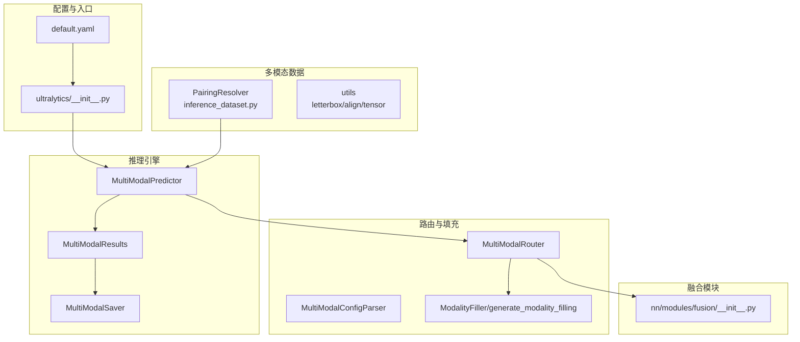
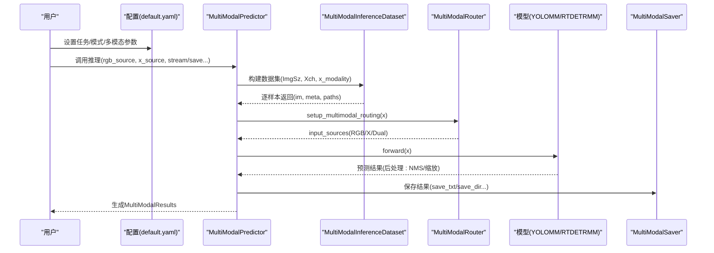
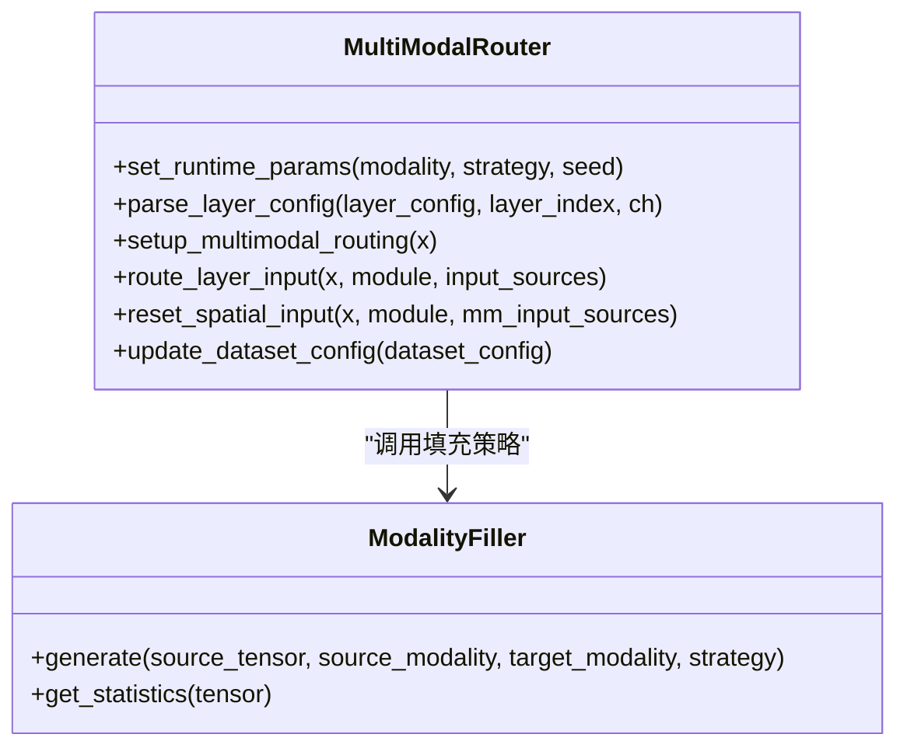
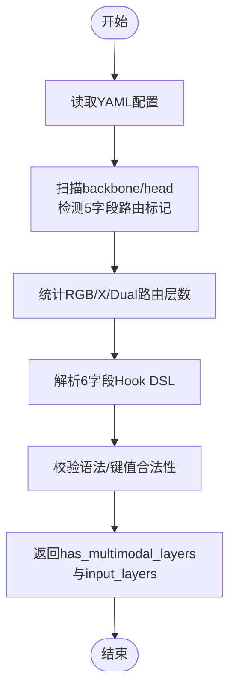
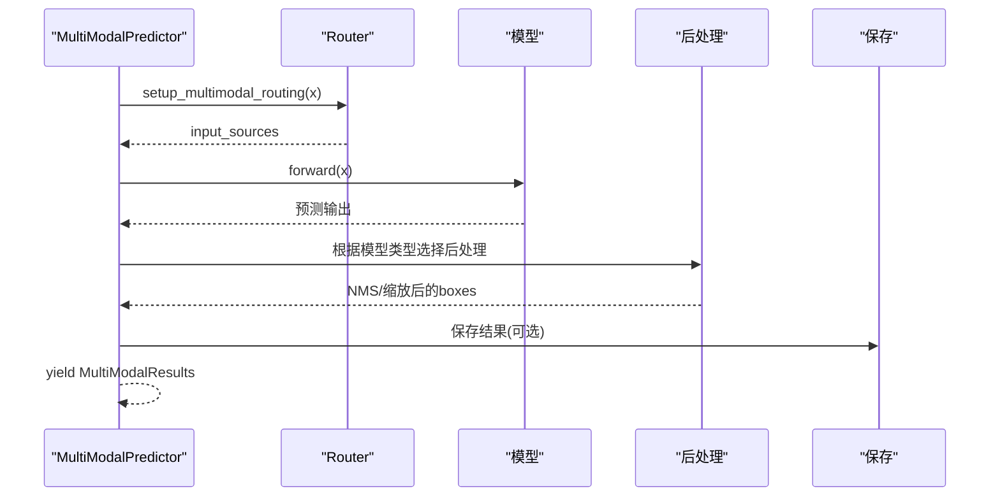
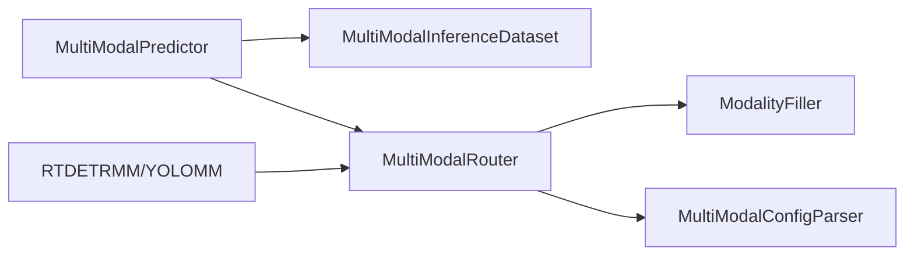

# 系统定制与扩展

<cite>
**本文引用的文件**
- [ultralytics/__init__.py](file://ultralytics/__init__.py)
- [ultralytics/cfg/default.yaml](file://ultralytics/cfg/default.yaml)
- [ultralytics/data/multimodal/__init__.py](file://ultralytics/data/multimodal/__init__.py)
- [ultralytics/engine/multimodal/__init__.py](file://ultralytics/engine/multimodal/__init__.py)
- [ultralytics/models/rtdetrmm/model.py](file://ultralytics/models/rtdetrmm/model.py)
- [ultralytics/nn/mm/router.py](file://ultralytics/nn/mm/router.py)
- [ultralytics/nn/mm/parser.py](file://ultralytics/nn/mm/parser.py)
- [ultralytics/data/multimodal/inference_dataset.py](file://ultralytics/data/multimodal/inference_dataset.py)
- [ultralytics/engine/multimodal/predictor.py](file://ultralytics/engine/multimodal/predictor.py)
- [ultralytics/nn/mm/filling.py](file://ultralytics/nn/mm/filling.py)
- [ultralytics/nn/modules/fusion/__init__.py](file://ultralytics/nn/modules/fusion/__init__.py)
</cite>

## 目录
1. [简介](#简介)
2. [项目结构](#项目结构)
3. [核心组件](#核心组件)
4. [架构总览](#架构总览)
5. [详细组件分析](#详细组件分析)
6. [依赖分析](#依赖分析)
7. [性能考虑](#性能考虑)
8. [故障排查指南](#故障排查指南)
9. [结论](#结论)
10. [附录](#附录)

## 简介
本指南面向希望扩展多模态检测系统（YOLOMM/RTDETRMM）的开发者，围绕以下目标展开：
- 如何新增模态（如IR、LiDAR等）与新融合策略
- 如何实现新的路由规则与数据流
- 如何定制配置系统（YAML扩展、参数校验、默认值）
- 插件开发最佳实践（接口设计、模块化、兼容性）
- 系统扩展点与集成方法
- 提供可落地的定制案例与代码定位路径

## 项目结构
系统采用“模型-路由-数据-推理-融合”分层组织，关键模块如下：
- 配置与入口：default.yaml、ultralytics/__init__.py
- 多模态数据管线：data/multimodal/*
- 多模态推理引擎：engine/multimodal/*
- 路由与填充：nn/mm/*
- 融合模块：nn/modules/fusion/*

**图表来源**
- [ultralytics/cfg/default.yaml:1-168](file://ultralytics/cfg/default.yaml#L1-L168)
- [ultralytics/__init__.py:1-88](file://ultralytics/__init__.py#L1-L88)
- [ultralytics/data/multimodal/inference_dataset.py:1-252](file://ultralytics/data/multimodal/inference_dataset.py#L1-L252)
- [ultralytics/engine/multimodal/predictor.py:1-494](file://ultralytics/engine/multimodal/predictor.py#L1-L494)
- [ultralytics/nn/mm/router.py:1-471](file://ultralytics/nn/mm/router.py#L1-L471)
- [ultralytics/nn/mm/parser.py:1-198](file://ultralytics/nn/mm/parser.py#L1-L198)
- [ultralytics/nn/mm/filling.py:1-175](file://ultralytics/nn/mm/filling.py#L1-L175)
- [ultralytics/nn/modules/fusion/__init__.py:1-58](file://ultralytics/nn/modules/fusion/__init__.py#L1-L58)

**章节来源**
- [ultralytics/cfg/default.yaml:1-168](file://ultralytics/cfg/default.yaml#L1-L168)
- [ultralytics/__init__.py:1-88](file://ultralytics/__init__.py#L1-L88)

## 核心组件
- 配置系统：default.yaml提供全局与多模态专属参数，支持训练/推理/导出等阶段的参数覆盖。
- 数据管线：MultiModalInferenceDataset负责RGB/X样本加载、空间对齐、通道校验与统一预处理。
- 推理引擎：MultiModalPredictor独立于基础Predictor，完成样本解析、流式推理、后处理与结果组装。
- 路由系统：MultiModalRouter解析模型层定义中的第5字段路由标记，实现RGB/X/Dual三路输入的零拷贝路由与空间重置。
- 配置解析：MultiModalConfigParser解析YAML中的5/6字段（路由/钩子），提供校验与统计。
- 填充策略：ModalityFiller与generate_modality_filling提供复制、噪声、通道重复、边缘模糊、混合等策略，适配不同X模态通道数。
- 融合模块：nn/modules/fusion导出各类跨模态/多尺度融合模块，便于在模型中直接复用。

**章节来源**
- [ultralytics/data/multimodal/inference_dataset.py:1-252](file://ultralytics/data/multimodal/inference_dataset.py#L1-L252)
- [ultralytics/engine/multimodal/predictor.py:1-494](file://ultralytics/engine/multimodal/predictor.py#L1-L494)
- [ultralytics/nn/mm/router.py:1-471](file://ultralytics/nn/mm/router.py#L1-L471)
- [ultralytics/nn/mm/parser.py:1-198](file://ultralytics/nn/mm/parser.py#L1-L198)
- [ultralytics/nn/mm/filling.py:1-175](file://ultralytics/nn/mm/filling.py#L1-L175)
- [ultralytics/nn/modules/fusion/__init__.py:1-58](file://ultralytics/nn/modules/fusion/__init__.py#L1-L58)

## 架构总览
系统通过“配置驱动 + 路由标记 + 数据预处理 + 推理引擎 + 融合模块”的组合实现多模态扩展。核心扩展点包括：
- 模型层定义：在backbone/head中增加第5字段标识RGB/X/Dual，启用路由。
- 数据集配置：通过dataset_config提供Xch与x_modality，驱动Router与Dataset行为。
- 推理参数：conf/iou/max_det/imgsz等在default.yaml中集中管理，支持运行时覆盖。
- 融合策略：在模型中引入融合模块，结合路由标记实现跨模态交互。

**图表来源**
- [ultralytics/cfg/default.yaml:1-168](file://ultralytics/cfg/default.yaml#L1-L168)
- [ultralytics/engine/multimodal/predictor.py:1-494](file://ultralytics/engine/multimodal/predictor.py#L1-L494)
- [ultralytics/data/multimodal/inference_dataset.py:1-252](file://ultralytics/data/multimodal/inference_dataset.py#L1-L252)
- [ultralytics/nn/mm/router.py:1-471](file://ultralytics/nn/mm/router.py#L1-L471)

## 详细组件分析

### 组件A：多模态路由器（MultiModalRouter）
- 功能要点
  - 解析模型层定义中的第5字段（RGB/X/Dual），为模块注入_mm_input_source等属性。
  - 支持RGB/X/Dual三种输入源，零拷贝拼接与路由，动态适配X通道数。
  - 支持X模态“新输入起点”与空间重置，保证跨模态特征对齐。
  - 运行时参数（modality、strategy、seed）可影响填充策略与输入拼接。
- 关键流程
  - setup_multimodal_routing：根据输入通道数判断是否启用多模态，缓存原始输入，生成RGB/X/Dual视图。
  - route_layer_input：依据模块的_mm_input_source进行路由，支持X起点特殊处理。
  - reset_spatial_input：在X新输入起点处强制使用原始空间尺寸，避免上采样/下采样误差累积。
- 扩展建议
  - 新增路由标记：在模型YAML的backbone/head层配置中加入新的第5字段标识，配合MultiModalConfigParser校验。
  - 新增填充策略：在ModalityFiller中扩展策略权重与生成函数，通过runtime_strategy传递。
  - 新增空间重置：在特定层设置_mm_new_input_start与_mm_spatial_reset，确保后续X特征使用原始分辨率。

**图表来源**
- [ultralytics/nn/mm/router.py:1-471](file://ultralytics/nn/mm/router.py#L1-L471)
- [ultralytics/nn/mm/filling.py:1-175](file://ultralytics/nn/mm/filling.py#L1-L175)

**章节来源**
- [ultralytics/nn/mm/router.py:1-471](file://ultralytics/nn/mm/router.py#L1-L471)
- [ultralytics/nn/mm/filling.py:1-175](file://ultralytics/nn/mm/filling.py#L1-L175)

### 组件B：配置解析器（MultiModalConfigParser）
- 功能要点
  - 校验YAML中是否存在5字段路由标记，统计RGB/X/Dual路由层数。
  - 解析6字段Hook DSL，标准化为规范化的规格列表，支持tap/action/detach/normalize等键。
- 使用场景
  - 在模型构建前对YAML进行静态校验，提前发现路由/钩子语法问题。
  - 为可视化/特征捕获提供规范化的Hook配置。

**图表来源**
- [ultralytics/nn/mm/parser.py:1-198](file://ultralytics/nn/mm/parser.py#L1-L198)

**章节来源**
- [ultralytics/nn/mm/parser.py:1-198](file://ultralytics/nn/mm/parser.py#L1-L198)

### 组件C：推理引擎（MultiModalPredictor）
- 功能要点
  - 从模型读取mm_router配置，确定X通道数与X模态类型。
  - 通过PairingResolver解析RGB/X输入源，构建MultiModalInferenceDataset。
  - 支持RTDETR与YOLO两类后处理路径，自动识别输出格式并做坐标还原。
  - 流式推理：边迭代边yield，降低内存占用。
- 扩展建议
  - 新增后处理分支：在_is_rtdetr_model与_postprocess_rtdetr基础上扩展新模型类型。
  - 新增保存策略：在MultiModalSaver中扩展保存格式与命名规则。

**图表来源**
- [ultralytics/engine/multimodal/predictor.py:1-494](file://ultralytics/engine/multimodal/predictor.py#L1-L494)
- [ultralytics/nn/mm/router.py:1-471](file://ultralytics/nn/mm/router.py#L1-L471)

**章节来源**
- [ultralytics/engine/multimodal/predictor.py:1-494](file://ultralytics/engine/multimodal/predictor.py#L1-L494)

### 组件D：数据集（MultiModalInferenceDataset）
- 功能要点
  - 严格校验RGB/X的存在性与可读性，X通道数与dataset_config一致。
  - 对RGB/X分别进行LetterBox、转tensor与归一化，支持单模态零填充。
  - 支持TIFF/NPY/NPX等多格式X模态加载。
- 扩展建议
  - 新增X模态格式：在_load_x_modality中扩展支持的后缀与加载逻辑。
  - 新增对齐策略：在align_and_validate_x中扩展空间/通道对齐规则。

**章节来源**
- [ultralytics/data/multimodal/inference_dataset.py:1-252](file://ultralytics/data/multimodal/inference_dataset.py#L1-L252)

### 组件E：模型入口（RTDETRMM）
- 功能要点
  - 基于模型内容判据Fail-Fast识别多模态结构，解析YAML并填充modality_config。
  - 确保底层模型持有mm_router，支持RGB/X/Dual输入通道与默认模态。
  - 提供vis可视化入口与cocoval评估入口。
- 扩展建议
  - 新增模型家族：仿照RTDETRMM实现自定义模型类，重写task_map与路由配置逻辑。

**章节来源**
- [ultralytics/models/rtdetrmm/model.py:1-269](file://ultralytics/models/rtdetrmm/model.py#L1-L269)

## 依赖分析
- 模块耦合
  - MultiModalPredictor依赖MultiModalInferenceDataset与MultiModalRouter，形成“数据-路由-模型”的清晰边界。
  - MultiModalRouter依赖ModalityFiller与Dataset配置（Xch/x_modality），实现零拷贝路由与动态适配。
  - MultiModalConfigParser为模型构建提供静态校验，降低运行期错误。
- 外部依赖
  - 推理引擎依赖torch与torchvision（NMS），数据集依赖OpenCV与NumPy。
- 循环依赖
  - 未见循环导入；各模块职责单一，通过接口解耦。

**图表来源**
- [ultralytics/engine/multimodal/predictor.py:1-494](file://ultralytics/engine/multimodal/predictor.py#L1-L494)
- [ultralytics/data/multimodal/inference_dataset.py:1-252](file://ultralytics/data/multimodal/inference_dataset.py#L1-L252)
- [ultralytics/nn/mm/router.py:1-471](file://ultralytics/nn/mm/router.py#L1-L471)
- [ultralytics/nn/mm/parser.py:1-198](file://ultralytics/nn/mm/parser.py#L1-L198)
- [ultralytics/nn/mm/filling.py:1-175](file://ultralytics/nn/mm/filling.py#L1-L175)
- [ultralytics/models/rtdetrmm/model.py:1-269](file://ultralytics/models/rtdetrmm/model.py#L1-L269)

**章节来源**
- [ultralytics/engine/multimodal/predictor.py:1-494](file://ultralytics/engine/multimodal/predictor.py#L1-L494)
- [ultralytics/nn/mm/router.py:1-471](file://ultralytics/nn/mm/router.py#L1-L471)

## 性能考虑
- 零拷贝路由：MultiModalRouter通过切片与拼接实现零拷贝，减少内存分配与拷贝开销。
- 流式推理：MultiModalPredictor支持边迭代边yield，显著降低峰值内存。
- 填充策略：ModalityFiller提供轻量策略（复制/噪声/通道重复/边缘模糊/混合），避免复杂依赖。
- 后处理优化：RTDETR路径使用torchvision NMS，YOLO路径使用NMS库，均针对批量推理优化。

[本节为通用指导，无需具体文件分析]

## 故障排查指南
- 路由失败
  - 症状：模块路由到的输入源不存在或通道数不匹配。
  - 排查：确认模型YAML中第5字段是否正确，Xch与x_modality是否与dataset_config一致。
  - 参考：[ultralytics/nn/mm/router.py:255-317](file://ultralytics/nn/mm/router.py#L255-L317)
- 填充异常
  - 症状：RGB->X或X->RGB填充后通道数不一致。
  - 排查：检查ModalityFiller策略与adapt_xch逻辑，确保X通道数正确。
  - 参考：[ultralytics/nn/mm/filling.py:141-175](file://ultralytics/nn/mm/filling.py#L141-L175)
- 数据加载错误
  - 症状：X模态文件不存在或读取失败。
  - 排查：检查路径、后缀与数据格式，TIFF/NPY/NPX的键名。
  - 参考：[ultralytics/data/multimodal/inference_dataset.py:185-246](file://ultralytics/data/multimodal/inference_dataset.py#L185-L246)
- 后处理坐标错位
  - 症状：检测框坐标与原图不对应。
  - 排查：确认ratio_pad与ori_shape是否正确传递，scale_boxes参数格式。
  - 参考：[ultralytics/engine/multimodal/predictor.py:214-234](file://ultralytics/engine/multimodal/predictor.py#L214-L234)

**章节来源**
- [ultralytics/nn/mm/router.py:255-317](file://ultralytics/nn/mm/router.py#L255-L317)
- [ultralytics/nn/mm/filling.py:141-175](file://ultralytics/nn/mm/filling.py#L141-L175)
- [ultralytics/data/multimodal/inference_dataset.py:185-246](file://ultralytics/data/multimodal/inference_dataset.py#L185-L246)
- [ultralytics/engine/multimodal/predictor.py:214-234](file://ultralytics/engine/multimodal/predictor.py#L214-L234)

## 结论
该系统通过“配置驱动 + 路由标记 + 数据预处理 + 推理引擎 + 融合模块”的架构，提供了清晰的扩展点。新增模态、融合策略与路由规则均可在不破坏现有结构的前提下实现。建议遵循模块化与向后兼容原则，利用配置解析与运行时参数实现灵活定制。

[本节为总结，无需具体文件分析]

## 附录

### A. 新增模态支持（以IR为例）
- 步骤
  - 在模型YAML的backbone/head层配置中，为需要接收IR的层增加第5字段标识（如X或自定义标记）。
  - 在dataset_config中设置x_modality为ir，Xch为IR模态通道数。
  - 若IR为单通道，可通过ModalityFiller的通道适配策略（adapt_xch）映射到3通道。
- 参考
  - [ultralytics/nn/mm/router.py:406-447](file://ultralytics/nn/mm/router.py#L406-L447)
  - [ultralytics/nn/mm/filling.py:151-175](file://ultralytics/nn/mm/filling.py#L151-L175)
  - [ultralytics/data/multimodal/inference_dataset.py:57-58](file://ultralytics/data/multimodal/inference_dataset.py#L57-L58)

### B. 新增融合策略（以新型跨模态注意力为例）
- 步骤
  - 在nn/modules/fusion中新增模块文件，导出至__all__。
  - 在模型YAML中将新模块作为head/backbone层使用，并在第5字段标注输入模态。
  - 使用MultiModalConfigParser校验路由标记，确保正确解析。
- 参考
  - [ultralytics/nn/modules/fusion/__init__.py:1-58](file://ultralytics/nn/modules/fusion/__init__.py#L1-L58)
  - [ultralytics/nn/mm/parser.py:67-86](file://ultralytics/nn/mm/parser.py#L67-L86)

### C. 新增路由规则（以“空间重置”为例）
- 步骤
  - 在模型YAML中，将X新输入起点层的from=-1并设置第5字段为X，触发_mm_new_input_start与_mm_spatial_reset。
  - 在MultiModalRouter中确保reset_spatial_input被调用，保证后续X特征使用原始空间尺寸。
- 参考
  - [ultralytics/nn/mm/router.py:126-142](file://ultralytics/nn/mm/router.py#L126-L142)
  - [ultralytics/nn/mm/router.py:365-404](file://ultralytics/nn/mm/router.py#L365-L404)

### D. 配置系统定制（YAML扩展、参数校验、默认值）
- 步骤
  - 在default.yaml中新增/调整多模态相关参数（如use_multimodal_aug、mm_x_non_geo_cfg等）。
  - 通过MultiModalConfigParser.validate_config_format进行静态校验。
  - 在模型初始化时读取overrides，确保运行时参数覆盖生效。
- 参考
  - [ultralytics/cfg/default.yaml:134-168](file://ultralytics/cfg/default.yaml#L134-L168)
  - [ultralytics/nn/mm/parser.py:20-46](file://ultralytics/nn/mm/parser.py#L20-L46)
  - [ultralytics/models/rtdetrmm/model.py:256-268](file://ultralytics/models/rtdetrmm/model.py#L256-L268)

### E. 插件开发最佳实践
- 接口设计
  - 保持模块最小接口，仅暴露必要的forward与属性（如_mm_input_source）。
- 模块化原则
  - 将路由、填充、融合、数据加载拆分为独立模块，通过配置驱动组合。
- 兼容性保证
  - 保留backward-compat字段（如runtime_modality/runtime_strategy/runtime_seed），确保旧检查点可恢复。
  - 在MultiModalRouter中提供update_dataset_config与set_runtime_params，动态更新配置。

**章节来源**
- [ultralytics/nn/mm/router.py:71-89](file://ultralytics/nn/mm/router.py#L71-L89)
- [ultralytics/nn/mm/router.py:406-447](file://ultralytics/nn/mm/router.py#L406-L447)