# 融合策略扩展开发

<cite>
**本文引用的文件**
- [ultralytics/nn/modules/fusion/__init__.py](file://ultralytics/nn/modules/fusion/__init__.py)
- [ultralytics/nn/modules/fusion/FCM_FFN.py](file://ultralytics/nn/modules/fusion/FCM_FFN.py)
- [ultralytics/nn/modules/fusion/CAM.py](file://ultralytics/nn/modules/fusion/CAM.py)
- [ultralytics/nn/modules/fusion/SEFN.py](file://ultralytics/nn/modules/fusion/SEFN.py)
- [ultralytics/nn/modules/fusion/CGAFusion.py](file://ultralytics/nn/modules/fusion/CGAFusion.py)
- [ultralytics/nn/modules/fusion/EDFFN.py](file://ultralytics/nn/modules/fusion/EDFFN.py)
- [ultralytics/nn/modules/fusion/MSAA.py](file://ultralytics/nn/modules/fusion/MSAA.py)
- [ultralytics/nn/modules/fusion/IIA.py](file://ultralytics/nn/modules/fusion/IIA.py)
- [ultralytics/nn/modules/fusion/HFP.py](file://ultralytics/nn/modules/fusion/HFP.py)
- [ultralytics/nn/modules/fusion/SDFM.py](file://ultralytics/nn/modules/fusion/SDFM.py)
- [ultralytics/engine/multimodal/predictor.py](file://ultralytics/engine/multimodal/predictor.py)
</cite>

## 目录
1. [引言](#引言)
2. [项目结构](#项目结构)
3. [核心组件](#核心组件)
4. [架构总览](#架构总览)
5. [详细组件分析](#详细组件分析)
6. [依赖分析](#依赖分析)
7. [性能考虑](#性能考虑)
8. [故障排查指南](#故障排查指南)
9. [结论](#结论)
10. [附录](#附录)

## 引言
本指南面向希望在多模态视觉任务中扩展与定制特征融合策略的开发者。文档聚焦以下目标：
- 如何实现新的特征融合算法（注意力机制融合、多尺度特征融合、自适应权重融合等）
- 融合模块的接口设计与实现方法（通道注意力、空间注意力、混合注意力等）
- 数学原理与代码实现示例的对应关系
- 融合策略的配置方法与参数调优技巧
- 性能优化与内存管理最佳实践

本指南以仓库中的融合模块为蓝本，提供可复用的接口范式与实现模板，帮助你在不破坏现有架构的前提下，快速集成新的融合策略。

## 项目结构
融合模块位于 ultralytics/nn/modules/fusion 下，提供多种融合与注意力组件，覆盖通道、空间、频域、多尺度等多个维度。这些模块通过统一的导出入口集中暴露给上层模型使用。

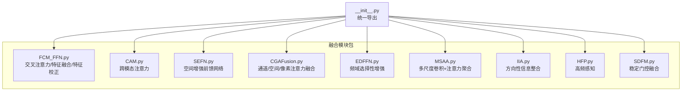

**图表来源**
- [ultralytics/nn/modules/fusion/__init__.py:1-58](file://ultralytics/nn/modules/fusion/__init__.py#L1-L58)
- [ultralytics/nn/modules/fusion/FCM_FFN.py:1-921](file://ultralytics/nn/modules/fusion/FCM_FFN.py#L1-L921)
- [ultralytics/nn/modules/fusion/CAM.py:1-93](file://ultralytics/nn/modules/fusion/CAM.py#L1-L93)
- [ultralytics/nn/modules/fusion/SEFN.py:1-79](file://ultralytics/nn/modules/fusion/SEFN.py#L1-L79)
- [ultralytics/nn/modules/fusion/CGAFusion.py:1-64](file://ultralytics/nn/modules/fusion/CGAFusion.py#L1-L64)
- [ultralytics/nn/modules/fusion/EDFFN.py:1-63](file://ultralytics/nn/modules/fusion/EDFFN.py#L1-L63)
- [ultralytics/nn/modules/fusion/MSAA.py:1-102](file://ultralytics/nn/modules/fusion/MSAA.py#L1-L102)
- [ultralytics/nn/modules/fusion/IIA.py:1-49](file://ultralytics/nn/modules/fusion/IIA.py#L1-L49)
- [ultralytics/nn/modules/fusion/HFP.py:1-67](file://ultralytics/nn/modules/fusion/HFP.py#L1-L67)
- [ultralytics/nn/modules/fusion/SDFM.py:1-83](file://ultralytics/nn/modules/fusion/SDFM.py#L1-L83)

**章节来源**
- [ultralytics/nn/modules/fusion/__init__.py:1-58](file://ultralytics/nn/modules/fusion/__init__.py#L1-L58)

## 核心组件
本节概述融合模块的通用接口与实现要点，便于扩展新策略时遵循一致的契约。

- 输入接口约定
  - 双输入形态：多数模块支持 forward(x1, x2=None) 或 forward([x1, x2])，用于接收两路特征。
  - 形状约束：通常要求两路输入的空间尺寸一致，通道数可经投影对齐。
  - 设备与精度：模块内部会根据输入设备与精度对齐参数，确保混合精度训练稳定。

- 输出约定
  - 单路输出：多数融合模块输出与左分支通道一致的特征图，便于后续网络继续堆叠。
  - 可选返回：部分模块提供 return_pair 或调试开关，返回中间增强特征以便分析。

- 惰性构建
  - 通道/内核维度在首次前向时按输入通道动态构建，避免硬编码带来的耦合。

- 权重与门控
  - 通过可学习参数（如权重向量、Sigmoid门）实现自适应融合强度控制。
  - 注意力模块通常包含通道/空间/像素等多级注意力图，用于加权融合。

**章节来源**
- [ultralytics/nn/modules/fusion/CAM.py:18-93](file://ultralytics/nn/modules/fusion/CAM.py#L18-L93)
- [ultralytics/nn/modules/fusion/SEFN.py:9-79](file://ultralytics/nn/modules/fusion/SEFN.py#L9-L79)
- [ultralytics/nn/modules/fusion/CGAFusion.py:46-64](file://ultralytics/nn/modules/fusion/CGAFusion.py#L46-L64)
- [ultralytics/nn/modules/fusion/MSAA.py:43-102](file://ultralytics/nn/modules/fusion/MSAA.py#L43-L102)
- [ultralytics/nn/modules/fusion/IIA.py:9-49](file://ultralytics/nn/modules/fusion/IIA.py#L9-L49)
- [ultralytics/nn/modules/fusion/HFP.py:9-67](file://ultralytics/nn/modules/fusion/HFP.py#L9-L67)
- [ultralytics/nn/modules/fusion/SDFM.py:6-83](file://ultralytics/nn/modules/fusion/SDFM.py#L6-L83)

## 架构总览
多模态推理引擎负责从模型读取路由配置，构造数据集，执行前向、后处理与结果组装。融合模块作为模型内部的可插拔组件，通过 Router 的 forward 行为参与特征交互。

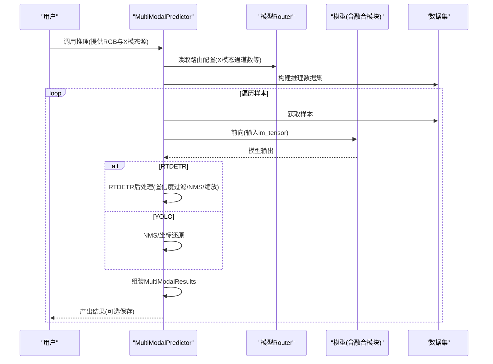

**图表来源**
- [ultralytics/engine/multimodal/predictor.py:16-494](file://ultralytics/engine/multimodal/predictor.py#L16-L494)

**章节来源**
- [ultralytics/engine/multimodal/predictor.py:16-494](file://ultralytics/engine/multimodal/predictor.py#L16-L494)

## 详细组件分析

### 交叉注意力与特征融合（FCM_FFN）
- CrossAttention：双向交叉注意力，q1关注x2，q2关注x1；支持空间缩减sr_ratio以降低复杂度。
- FeatureInteraction：将特征分为直通与交互两路，交叉注意力增强后在通道维拼接，残差连接与LayerNorm。
- ChannelEmbed：序列到特征图的转换，深度可分离卷积进行特征变换，残差+嵌入路径融合。
- FeatureFusion：端到端流程，序列展平→交叉交互→拼接→通道嵌入→输出。
- FCM：两阶段校正（空间→通道），可学习融合权重，跨模态自适应加权。
- FCMFeatureFusion：FCM+FeatureFusion串联封装，提供便捷的“纠偏→融合”。

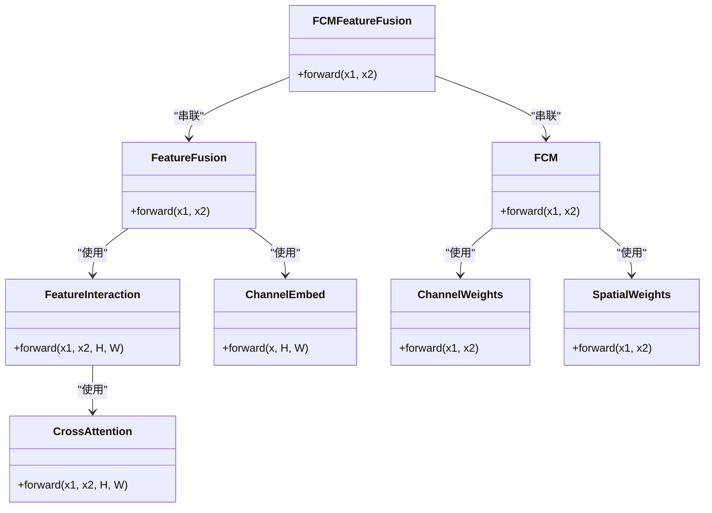

**图表来源**
- [ultralytics/nn/modules/fusion/FCM_FFN.py:18-471](file://ultralytics/nn/modules/fusion/FCM_FFN.py#L18-L471)
- [ultralytics/nn/modules/fusion/FCM_FFN.py:485-796](file://ultralytics/nn/modules/fusion/FCM_FFN.py#L485-L796)

**章节来源**
- [ultralytics/nn/modules/fusion/FCM_FFN.py:18-921](file://ultralytics/nn/modules/fusion/FCM_FFN.py#L18-L921)

### 跨模态注意力（CAM）
- 接口：forward(x1, x2=None)，支持双输入列表。
- 通道自适配：将两路特征投影到公共维度，执行C×C跨模态注意力，输出对齐左分支通道。
- 形状约束：两路输入空间尺寸一致，batch一致。

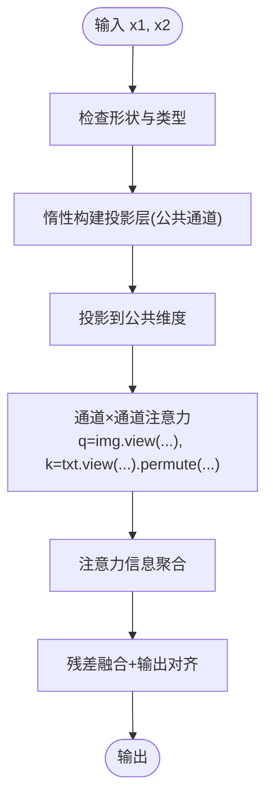

**图表来源**
- [ultralytics/nn/modules/fusion/CAM.py:57-93](file://ultralytics/nn/modules/fusion/CAM.py#L57-L93)

**章节来源**
- [ultralytics/nn/modules/fusion/CAM.py:18-93](file://ultralytics/nn/modules/fusion/CAM.py#L18-L93)

### 空间增强前馈网络（SEFN）
- 双路增强：主路经深度卷积与门控，辅路提供空间上下文引导。
- 空间卷积：对辅路进行下采样→空间卷积→上采样，与主路融合后进一步卷积。
- 输出：单路特征，显式注入跨模态/跨层信息。

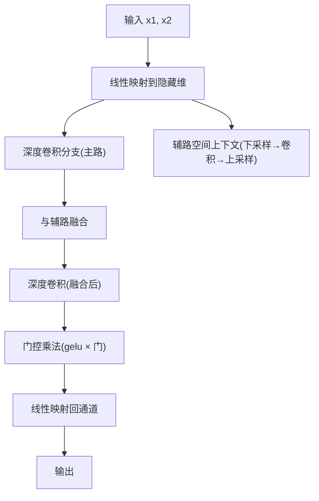

**图表来源**
- [ultralytics/nn/modules/fusion/SEFN.py:53-79](file://ultralytics/nn/modules/fusion/SEFN.py#L53-L79)

**章节来源**
- [ultralytics/nn/modules/fusion/SEFN.py:9-79](file://ultralytics/nn/modules/fusion/SEFN.py#L9-L79)

### 通道/空间/像素注意力融合（CGAFusion）
- 模块组成：空间注意力、通道注意力、像素注意力（基于通道与空间注意力的组合）。
- 融合策略：初始和差加权，像素注意力生成门控，输出经1×1卷积。

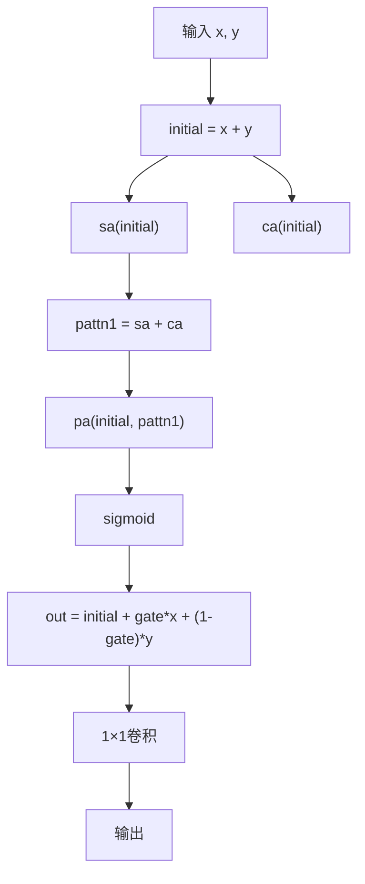

**图表来源**
- [ultralytics/nn/modules/fusion/CGAFusion.py:46-64](file://ultralytics/nn/modules/fusion/CGAFusion.py#L46-L64)

**章节来源**
- [ultralytics/nn/modules/fusion/CGAFusion.py:6-64](file://ultralytics/nn/modules/fusion/CGAFusion.py#L6-L64)

### 频域选择性增强（EDFFN）
- 输入：单路特征[B, C, H, W]，要求H、W能被patch整除。
- 流程：线性映射→深度卷积→门控→线性映射回通道；随后按patch切分，进行FFT→加权→逆FFT重建。
- 目的：抑制跨模态冗余，突出判别性纹理/结构。

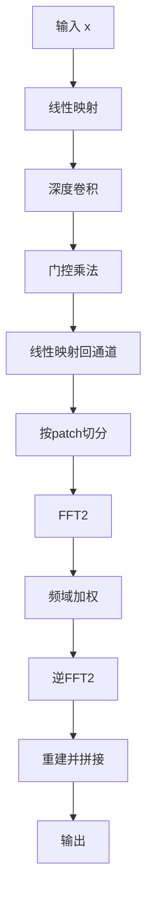

**图表来源**
- [ultralytics/nn/modules/fusion/EDFFN.py:43-63](file://ultralytics/nn/modules/fusion/EDFFN.py#L43-L63)

**章节来源**
- [ultralytics/nn/modules/fusion/EDFFN.py:9-63](file://ultralytics/nn/modules/fusion/EDFFN.py#L9-L63)

### 多尺度卷积与注意力聚合（MSAA）
- 输入：两路特征，拼接后经降维，多尺度卷积（3×3/5×5/7×7）融合。
- 注意力：通道注意力与空间注意力分别加权，最终上采样输出单路特征。

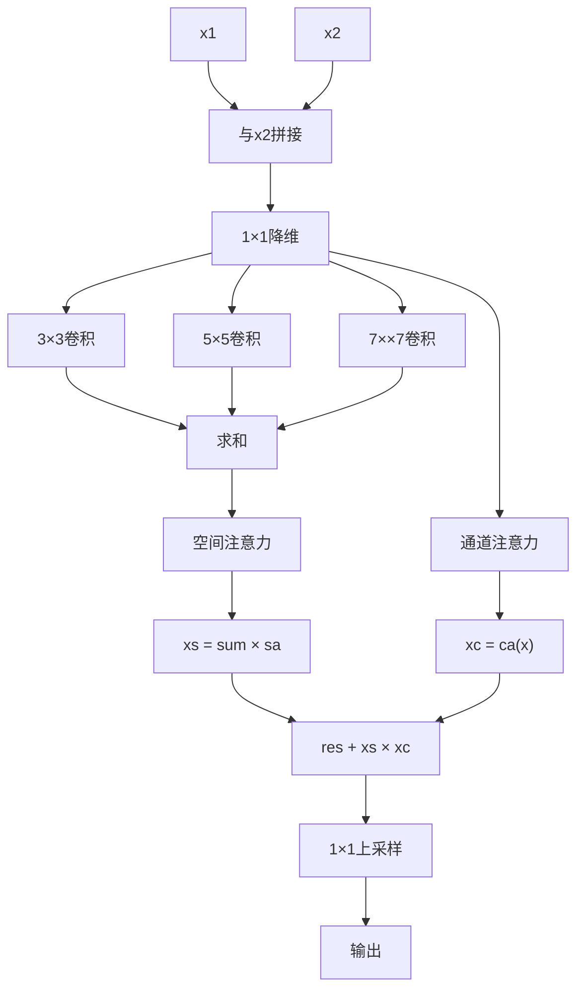

**图表来源**
- [ultralytics/nn/modules/fusion/MSAA.py:43-102](file://ultralytics/nn/modules/fusion/MSAA.py#L43-L102)

**章节来源**
- [ultralytics/nn/modules/fusion/MSAA.py:9-102](file://ultralytics/nn/modules/fusion/MSAA.py#L9-L102)

### 方向性信息整合（IIA）
- 思路：对通道维做均值与最大值池化，得到2通道空间描述，再用(1,k)与(k,1)卷积注入方向先验，分别沿W与H方向增强，最终与原特征相加。

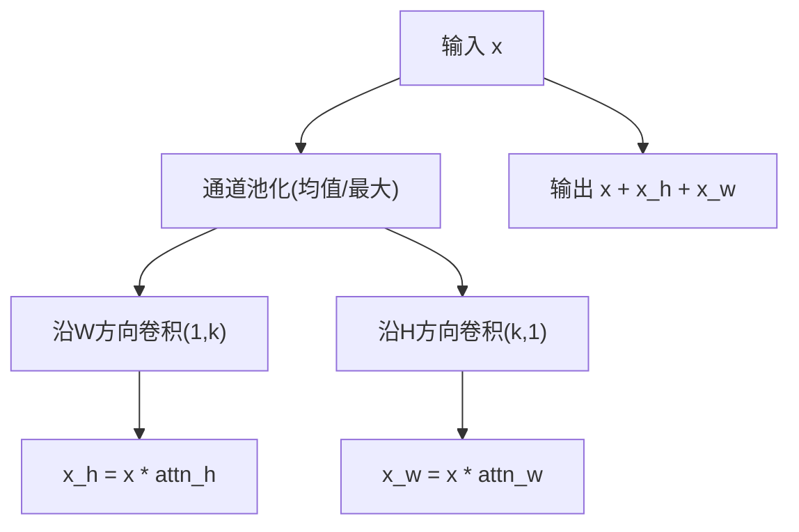

**图表来源**
- [ultralytics/nn/modules/fusion/IIA.py:35-49](file://ultralytics/nn/modules/fusion/IIA.py#L35-L49)

**章节来源**
- [ultralytics/nn/modules/fusion/IIA.py:9-49](file://ultralytics/nn/modules/fusion/IIA.py#L9-L49)

### 高频感知（HFP）
- 思路：对特征进行FFT，保留高频区域（由ratio控制），再与原特征做空间门控与通道门控，最终经卷积输出。
- 适用：突出细粒度目标与边缘信息，抑制低频冗余。

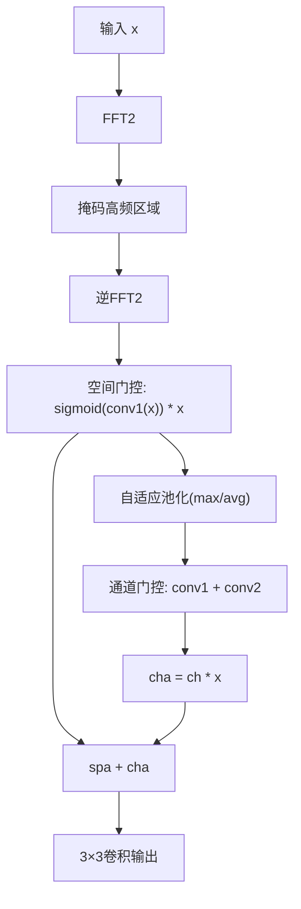

**图表来源**
- [ultralytics/nn/modules/fusion/HFP.py:51-67](file://ultralytics/nn/modules/fusion/HFP.py#L51-L67)

**章节来源**
- [ultralytics/nn/modules/fusion/HFP.py:9-67](file://ultralytics/nn/modules/fusion/HFP.py#L9-L67)

### 稳定门控融合（SDFM）
- 思路：拼接两路特征→降维→深度卷积→门控（基于两路差值的Sigmoid），残差融合；在混合精度下禁用autocast以提升数值稳定性。
- 适用：等尺寸特征融合，强调门控与数值稳健性。

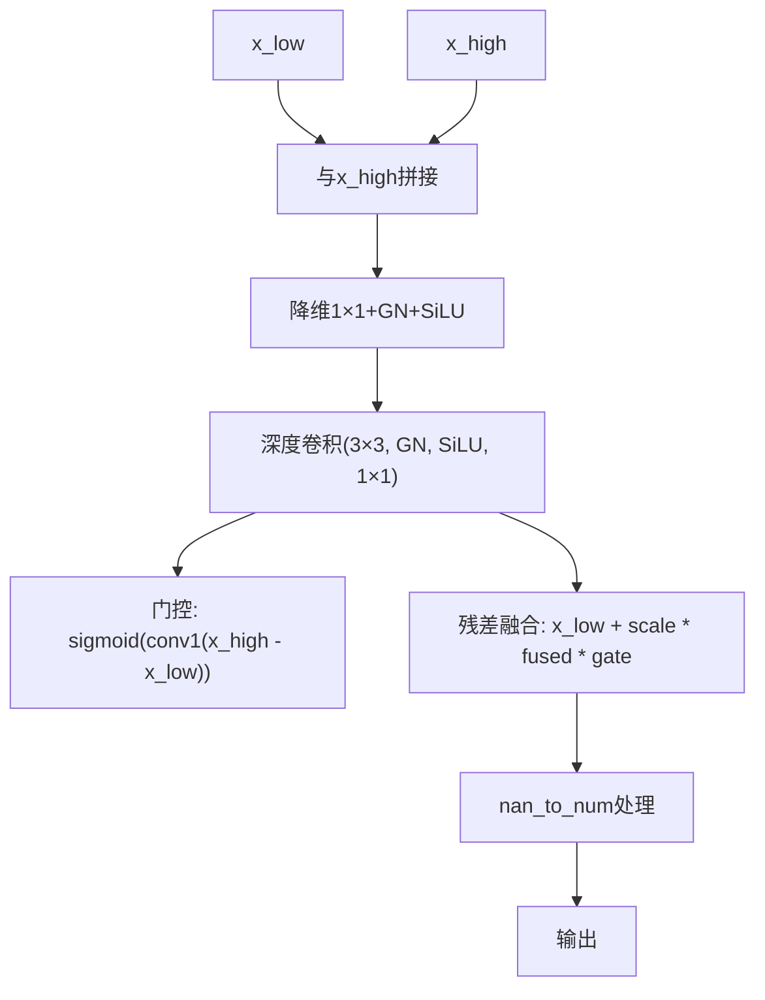

**图表来源**
- [ultralytics/nn/modules/fusion/SDFM.py:55-83](file://ultralytics/nn/modules/fusion/SDFM.py#L55-L83)

**章节来源**
- [ultralytics/nn/modules/fusion/SDFM.py:6-83](file://ultralytics/nn/modules/fusion/SDFM.py#L6-L83)

## 依赖分析
- 导出入口：融合模块通过统一的导出文件集中暴露，便于上层模型按需导入。
- 模块内聚：各融合模块相对独立，仅依赖torch与常用nn组件，耦合度低。
- 与推理引擎协作：MultiModalPredictor不解析YAML中的融合策略，而是依赖模型内部Router的forward行为，融合模块作为模型子模块参与推理。

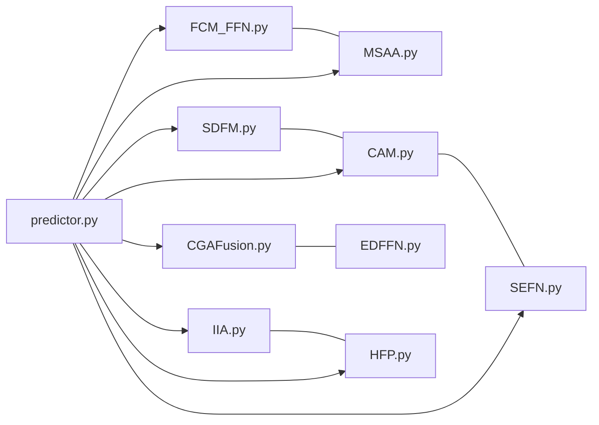

**图表来源**
- [ultralytics/nn/modules/fusion/__init__.py:7-58](file://ultralytics/nn/modules/fusion/__init__.py#L7-L58)
- [ultralytics/engine/multimodal/predictor.py:16-494](file://ultralytics/engine/multimodal/predictor.py#L16-L494)

**章节来源**
- [ultralytics/nn/modules/fusion/__init__.py:1-58](file://ultralytics/nn/modules/fusion/__init__.py#L1-L58)
- [ultralytics/engine/multimodal/predictor.py:16-494](file://ultralytics/engine/multimodal/predictor.py#L16-L494)

## 性能考虑
- 计算复杂度控制
  - CrossAttention支持sr_ratio空间缩减，显著降低注意力复杂度。
  - MSAA多尺度卷积与注意力聚合在降维后进行，减少参数量与计算量。
- 内存与精度
  - SDFM在混合精度下禁用autocast，避免NaN与Inf，随后进行nan_to_num处理。
  - FCMFeatureFusion提供detach_fcm选项，便于消融实验时断开梯度。
- 设备与dtype对齐
  - 各模块在前向开始时对齐参数设备与精度，确保AMP稳定性。
- 频域处理
  - EDFFN与HFP涉及FFT/IFFT，建议确保H、W可被patch整除，避免额外填充带来的开销。

[本节为通用指导，无需特定文件来源]

## 故障排查指南
- 形状错误
  - CAM/SEFN/MSAA/IIA/SDFM均要求两路输入形状一致；请检查特征金字塔层级或上采样/下采样链路。
- 尺寸不整除
  - EDFFN/HFP要求H、W能被patch整除；SDFM要求H、W能被patch整除；请调整输入尺寸或网络结构。
- 设备/精度不匹配
  - 各模块会在前向时对齐参数设备与精度；若仍报错，请确认模型整体AMP设置与模块设备一致。
- 数值不稳定
  - SDFM已内置nan_to_num处理；若仍出现异常，请检查输入特征范围与门控权重初始化。

**章节来源**
- [ultralytics/nn/modules/fusion/CAM.py:65-71](file://ultralytics/nn/modules/fusion/CAM.py#L65-L71)
- [ultralytics/nn/modules/fusion/SEFN.py:56-59](file://ultralytics/nn/modules/fusion/SEFN.py#L56-L59)
- [ultralytics/nn/modules/fusion/MSAA.py:82-89](file://ultralytics/nn/modules/fusion/MSAA.py#L82-L89)
- [ultralytics/nn/modules/fusion/IIA.py:35-49](file://ultralytics/nn/modules/fusion/IIA.py#L35-L49)
- [ultralytics/nn/modules/fusion/SDFM.py:64-67](file://ultralytics/nn/modules/fusion/SDFM.py#L64-L67)
- [ultralytics/nn/modules/fusion/EDFFN.py:47-49](file://ultralytics/nn/modules/fusion/EDFFN.py#L47-L49)
- [ultralytics/nn/modules/fusion/HFP.py:51-54](file://ultralytics/nn/modules/fusion/HFP.py#L51-L54)

## 结论
本指南提供了多模态融合策略扩展的系统化方法：以统一接口为契约，遵循惰性构建与设备/精度对齐的实现范式，结合注意力、多尺度、频域与门控等技术手段，快速实现并集成新的融合模块。通过MultiModalPredictor的路由机制，融合模块可无缝融入现有模型，满足不同任务的特征交互需求。

[本节为总结，无需特定文件来源]

## 附录
- 配置与调优建议
  - 注意力头数与sr_ratio：在CrossAttention中平衡精度与速度。
  - 通道/空间注意力权重：通过可学习参数或外部权重控制融合强度。
  - patch大小：EDFFN/HFP中影响频域分辨率与计算量，需与输入尺寸匹配。
  - 门控强度：SDFM/CGAFusion中的Sigmoid门控可调，建议从较小值开始搜索。
- 最佳实践
  - 优先使用惰性构建，避免硬编码通道数。
  - 在混合精度场景下，必要时禁用autocast或进行数值保护。
  - 保持输出通道与左分支一致，便于下游网络堆叠。

[本节为通用指导，无需特定文件来源]