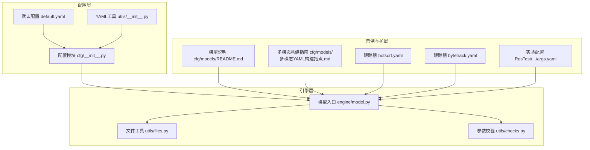
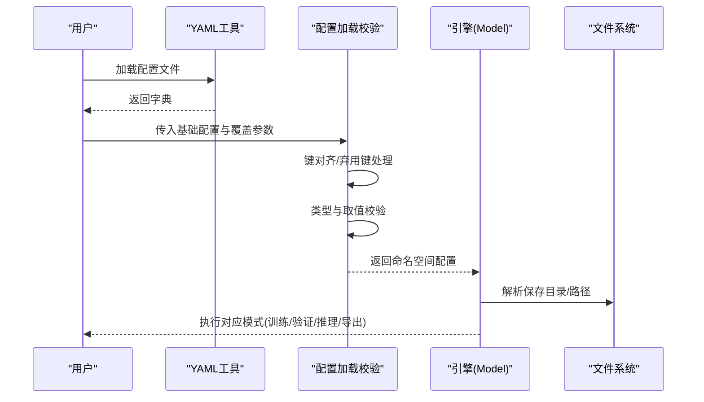
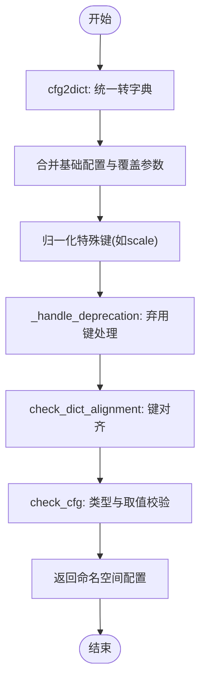
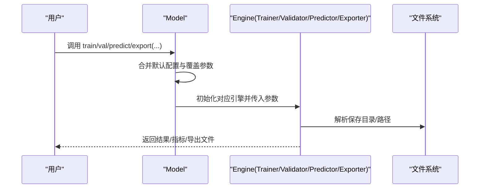
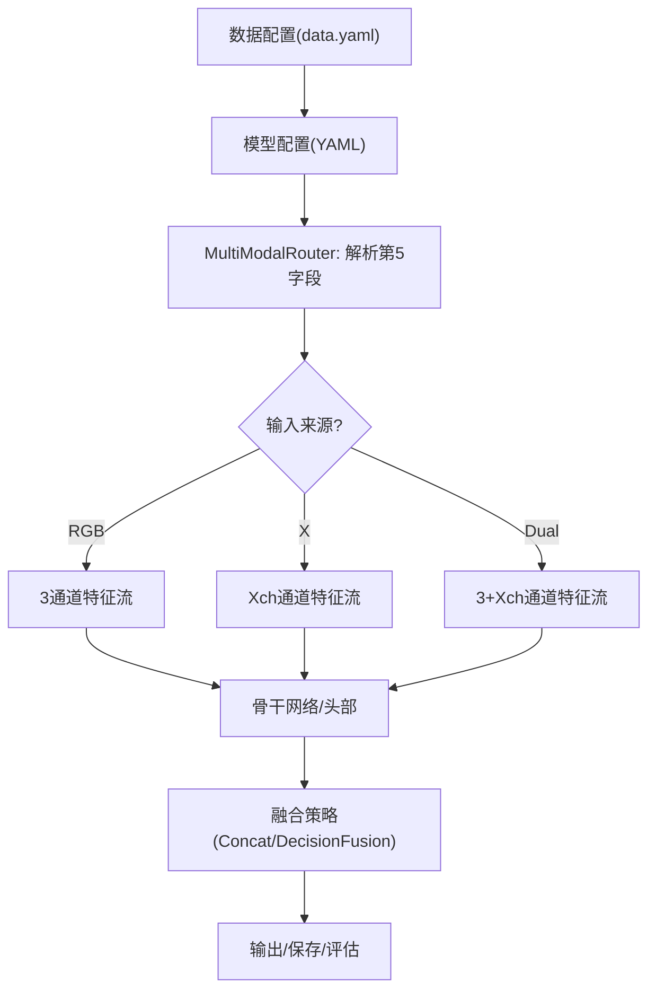
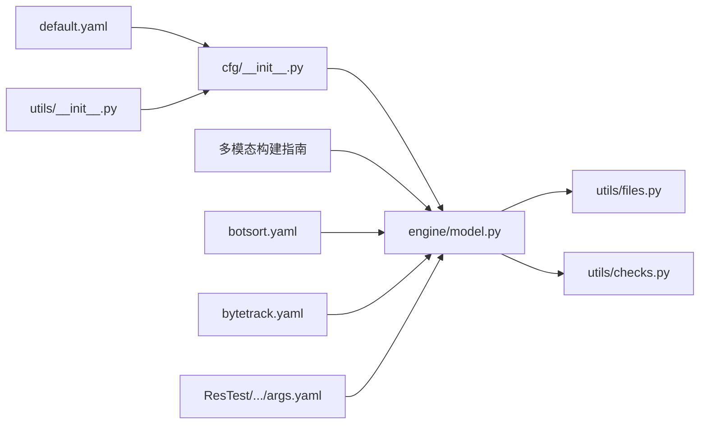

# 配置系统定制

<cite>
**本文档引用的文件**
- [ultralytics/cfg/default.yaml](file://ultralytics/cfg/default.yaml)
- [ultralytics/cfg/__init__.py](file://ultralytics/cfg/__init__.py)
- [ultralytics/utils/__init__.py](file://ultralytics/utils/__init__.py)
- [ultralytics/engine/model.py](file://ultralytics/engine/model.py)
- [ultralytics/utils/files.py](file://ultralytics/utils/files.py)
- [ultralytics/utils/checks.py](file://ultralytics/utils/checks.py)
- [ultralytics/cfg/models/README.md](file://ultralytics/cfg/models/README.md)
- [ultralytics/cfg/models/多模态YAML构建指点.md](file://ultralytics/cfg/models/多模态YAML构建指点.md)
- [ultralytics/cfg/trackers/botsort.yaml](file://ultralytics/cfg/trackers/botsort.yaml)
- [ultralytics/cfg/trackers/bytetrack.yaml](file://ultralytics/cfg/trackers/bytetrack.yaml)
- [ResTest/aifi-dattention-CSP-MutilScaleEdgeInformationEnhance-ASF-P2-lite-AddFusion2/args.yaml](file://ResTest/aifi-dattention-CSP-MutilScaleEdgeInformationEnhance-ASF-P2-lite-AddFusion2/args.yaml)
- [ResTest/aifi-dattention-CSP-MutilScaleEdgeInformationEnhance-ASF-P2-lite-BackboneFeatureFusion3/args.yaml](file://ResTest/aifi-dattention-CSP-MutilScaleEdgeInformationEnhance-ASF-P2-lite-BackboneFeatureFusion3/args.yaml)
</cite>

## 目录
1. [简介](#简介)
2. [项目结构](#项目结构)
3. [核心组件](#核心组件)
4. [架构总览](#架构总览)
5. [详细组件分析](#详细组件分析)
6. [依赖分析](#依赖分析)
7. [性能考虑](#性能考虑)
8. [故障排除指南](#故障排除指南)
9. [结论](#结论)
10. [附录](#附录)

## 简介
本指南面向需要扩展与定制配置系统的开发者，系统性讲解如何基于现有YAML配置体系进行参数扩展、类型与取值校验、默认值设置、配置继承与覆盖、以及多模态配置的结构化设计与解析流程。文档结合仓库中的默认配置、配置加载与校验工具、模型训练/验证/推理入口、以及多模态配置构建指引，提供从概念到实操的完整路径。

## 项目结构
配置系统主要分布在以下模块：
- 默认配置与键约束：ultralytics/cfg/default.yaml、ultralytics/cfg/__init__.py
- YAML工具与默认配置装载：ultralytics/utils/__init__.py
- 模型入口与配置应用：ultralytics/engine/model.py
- 文件与路径辅助：ultralytics/utils/files.py
- 参数校验与环境检查：ultralytics/utils/checks.py
- 模型配置与多模态构建指引：ultralytics/cfg/models/README.md、ultralytics/cfg/models/多模态YAML构建指点.md
- 跟踪器配置样例：ultralytics/cfg/trackers/*.yaml
- 实际实验配置样例：ResTest 下各子目录的 args.yaml

**图表来源**
- [ultralytics/cfg/default.yaml:1-168](file://ultralytics/cfg/default.yaml#L1-L168)
- [ultralytics/cfg/__init__.py:145-238](file://ultralytics/cfg/__init__.py#L145-L238)
- [ultralytics/utils/__init__.py:625-762](file://ultralytics/utils/__init__.py#L625-L762)
- [ultralytics/engine/model.py:1-120](file://ultralytics/engine/model.py#L1-L120)
- [ultralytics/utils/files.py:108-153](file://ultralytics/utils/files.py#L108-L153)
- [ultralytics/utils/checks.py:115-166](file://ultralytics/utils/checks.py#L115-L166)
- [ultralytics/cfg/models/README.md:1-66](file://ultralytics/cfg/models/README.md#L1-L66)
- [ultralytics/cfg/models/多模态YAML构建指点.md:1-239](file://ultralytics/cfg/models/多模态YAML构建指点.md#L1-L239)
- [ultralytics/cfg/trackers/botsort.yaml:1-23](file://ultralytics/cfg/trackers/botsort.yaml#L1-L23)
- [ultralytics/cfg/trackers/bytetrack.yaml:1-15](file://ultralytics/cfg/trackers/bytetrack.yaml#L1-L15)
- [ResTest/aifi-dattention-CSP-MutilScaleEdgeInformationEnhance-ASF-P2-lite-AddFusion2/args.yaml:1-135](file://ResTest/aifi-dattention-CSP-MutilScaleEdgeInformationEnhance-ASF-P2-lite-AddFusion2/args.yaml#L1-L135)

**章节来源**
- [ultralytics/cfg/default.yaml:1-168](file://ultralytics/cfg/default.yaml#L1-L168)
- [ultralytics/cfg/__init__.py:145-238](file://ultralytics/cfg/__init__.py#L145-L238)
- [ultralytics/utils/__init__.py:625-762](file://ultralytics/utils/__init__.py#L625-L762)

## 核心组件
- 默认配置与键约束
  - 默认配置文件提供全局参数与超参的完整清单，并标注类型与取值范围。
  - 键约束集合定义了哪些键属于浮点、分数、整数、布尔类型，用于运行时校验与自动转换。
- YAML工具
  - 提供安全加载、保存、打印YAML的能力，支持编码容错与None字符串修正。
  - 默认配置字典与键集合在模块初始化时加载，供后续校验与应用。
- 配置加载与校验
  - 将传入的配置（文件/字典/命名空间）统一转为字典，执行键对齐与弃用键处理，随后进行类型与取值范围校验。
  - 支持覆盖参数优先于基础配置，特殊键（如scale）存在别名与归一化逻辑。
- 模型入口与配置应用
  - 模型类在不同模式（train/val/predict/export/track/benchmark）下合并默认配置、覆盖参数与方法默认，形成最终参数命名空间。
  - 训练/验证/推理/导出等流程均通过统一的配置对象驱动。

**章节来源**
- [ultralytics/cfg/default.yaml:9-168](file://ultralytics/cfg/default.yaml#L9-L168)
- [ultralytics/cfg/__init__.py:145-238](file://ultralytics/cfg/__init__.py#L145-L238)
- [ultralytics/utils/__init__.py:625-762](file://ultralytics/utils/__init__.py#L625-L762)
- [ultralytics/engine/model.py:791-800](file://ultralytics/engine/model.py#L791-L800)

## 架构总览
配置系统采用“默认配置 + 键约束 + YAML工具 + 加载校验 + 引擎应用”的分层架构。默认配置提供骨架，键约束保证类型一致性，YAML工具负责容错加载，加载校验模块完成对齐、弃用键迁移与数值范围检查，最终由引擎层在各模式下应用。

**图表来源**
- [ultralytics/utils/__init__.py:625-762](file://ultralytics/utils/__init__.py#L625-L762)
- [ultralytics/cfg/__init__.py:279-358](file://ultralytics/cfg/__init__.py#L279-L358)
- [ultralytics/engine/model.py:791-800](file://ultralytics/engine/model.py#L791-L800)
- [ultralytics/utils/files.py:108-153](file://ultralytics/utils/files.py#L108-L153)

## 详细组件分析

### 组件A：配置加载与校验（get_cfg、check_cfg、check_dict_alignment）
- 功能要点
  - cfg2dict：统一将文件/字符串/命名空间/字典转换为字典格式。
  - get_cfg：合并基础配置与覆盖参数，处理模型规模别名、数值项目名称、弃用键迁移与对齐，执行类型与取值校验，返回可迭代命名空间。
  - check_cfg：依据键集合对配置项进行类型与取值范围校验，必要时进行自动转换。
  - check_dict_alignment：对齐自定义配置与基础配置，处理弃用键并给出相似键提示。
- 关键流程
  - 覆盖参数优先，特殊键（如scale）存在别名与归一化逻辑。
  - 对于None值忽略校验，避免影响可选参数。
  - 弃用键映射到新键并发出警告，移除不再支持的键。

**图表来源**
- [ultralytics/cfg/__init__.py:241-358](file://ultralytics/cfg/__init__.py#L241-L358)
- [ultralytics/cfg/__init__.py:360-420](file://ultralytics/cfg/__init__.py#L360-L420)
- [ultralytics/cfg/__init__.py:498-536](file://ultralytics/cfg/__init__.py#L498-L536)

**章节来源**
- [ultralytics/cfg/__init__.py:241-358](file://ultralytics/cfg/__init__.py#L241-L358)
- [ultralytics/cfg/__init__.py:360-420](file://ultralytics/cfg/__init__.py#L360-L420)
- [ultralytics/cfg/__init__.py:498-536](file://ultralytics/cfg/__init__.py#L498-L536)

### 组件B：YAML工具与默认配置（YAML类、DEFAULT_CFG_DICT）
- 功能要点
  - YAML类提供安全加载、保存、打印能力，自动选择C实现以提升性能，并具备字符编码容错。
  - DEFAULT_CFG_DICT与DEFAULT_CFG_KEYS在模块初始化时从默认配置文件加载，作为所有校验与应用的基础。
- 使用建议
  - 保存配置时注意序列化非原生类型为字符串，避免写入失败。
  - 加载时利用append_filename选项便于定位来源文件。

**章节来源**
- [ultralytics/utils/__init__.py:625-762](file://ultralytics/utils/__init__.py#L625-L762)

### 组件C：模型入口与配置应用（Model.train/val/predict/export）
- 功能要点
  - 不同模式下合并默认配置、方法默认与用户覆盖，形成最终参数命名空间。
  - 训练/验证/推理/导出均通过统一的配置对象驱动，确保行为一致。
- 关键流程
  - 训练：调用trainer，传入合并后的参数。
  - 验证：支持标准与COCO两种模式，默认设置不同。
  - 推理：支持双模态输入（RGB与X），参数校验与保存目录计算。
  - 导出：根据格式与设备等参数生成导出文件路径。

**图表来源**
- [ultralytics/engine/model.py:791-800](file://ultralytics/engine/model.py#L791-L800)
- [ultralytics/engine/model.py:625-690](file://ultralytics/engine/model.py#L625-L690)
- [ultralytics/engine/model.py:498-580](file://ultralytics/engine/model.py#L498-L580)
- [ultralytics/engine/model.py:743-790](file://ultralytics/engine/model.py#L743-L790)
- [ultralytics/utils/files.py:108-153](file://ultralytics/utils/files.py#L108-L153)

**章节来源**
- [ultralytics/engine/model.py:791-800](file://ultralytics/engine/model.py#L791-L800)
- [ultralytics/engine/model.py:625-690](file://ultralytics/engine/model.py#L625-L690)
- [ultralytics/engine/model.py:498-580](file://ultralytics/engine/model.py#L498-L580)
- [ultralytics/engine/model.py:743-790](file://ultralytics/engine/model.py#L743-L790)
- [ultralytics/utils/files.py:108-153](file://ultralytics/utils/files.py#L108-L153)

### 组件D：多模态配置结构与解析（多模态YAML构建指南）
- 功能要点
  - 多模态YAML采用五元组语法，第四元为模块参数，第五元为输入来源（'RGB' | 'X' | 'Dual'）。
  - 通道规则：RGB固定3通道，X由数据配置Xch决定，Dual=3+Xch。
  - 路由策略：早期融合（Dual输入）、中期融合（P3/P4后Concat）、晚期融合（各自Detect后推理融合）。
- 关键流程
  - 数据配置与模型配置联动，训练/验证时可通过--modality选择单模态。
  - Router会根据输入来源与通道数自动推导形状，支持profile查看路由日志。

**图表来源**
- [ultralytics/cfg/models/多模态YAML构建指点.md:20-120](file://ultralytics/cfg/models/多模态YAML构建指点.md#L20-L120)
- [ultralytics/cfg/models/多模态YAML构建指点.md:165-178](file://ultralytics/cfg/models/多模态YAML构建指点.md#L165-L178)
- [ultralytics/cfg/models/多模态YAML构建指点.md:206-217](file://ultralytics/cfg/models/多模态YAML构建指点.md#L206-L217)

**章节来源**
- [ultralytics/cfg/models/多模态YAML构建指点.md:20-120](file://ultralytics/cfg/models/多模态YAML构建指点.md#L20-L120)
- [ultralytics/cfg/models/多模态YAML构建指点.md:165-178](file://ultralytics/cfg/models/多模态YAML构建指点.md#L165-L178)
- [ultralytics/cfg/models/多模态YAML构建指点.md:206-217](file://ultralytics/cfg/models/多模态YAML构建指点.md#L206-L217)

### 组件E：配置示例与最佳实践（ResTest args.yaml）
- 示例要点
  - ResTest下的args.yaml展示了典型训练配置：任务类型、模式、模型路径、数据集、训练轮次、批大小、图像尺寸、优化器、随机种子、早停、AMP、冻结层、多尺度训练、验证与绘图、导出格式等。
  - 多模态相关键（如use_multimodal_aug、mm_*）在默认配置中定义，可在args.yaml中按需启用或调整。
- 最佳实践
  - 使用相对路径或明确绝对路径，确保在不同环境下可复现。
  - 通过project与name控制实验目录层级，结合exist_ok避免覆盖。
  - 验证配置有效性：先在小数据集上跑通，再逐步扩大规模。

**章节来源**
- [ResTest/aifi-dattention-CSP-MutilScaleEdgeInformationEnhance-ASF-P2-lite-AddFusion2/args.yaml:1-135](file://ResTest/aifi-dattention-CSP-MutilScaleEdgeInformationEnhance-ASF-P2-lite-AddFusion2/args.yaml#L1-L135)
- [ResTest/aifi-dattention-CSP-MutilScaleEdgeInformationEnhance-ASF-P2-lite-BackboneFeatureFusion3/args.yaml:1-135](file://ResTest/aifi-dattention-CSP-MutilScaleEdgeInformationEnhance-ASF-P2-lite-BackboneFeatureFusion3/args.yaml#L1-L135)

## 依赖分析
- 配置层依赖
  - default.yaml为基础配置来源，cfg/__init__.py定义键约束与校验逻辑，utils/__init__.py提供YAML工具与默认配置装载。
- 引擎层依赖
  - engine/model.py在不同模式下调用配置加载与校验，依赖utils/files.py解析保存目录，依赖utils/checks.py进行参数校验。
- 示例与扩展依赖
  - 多模态构建指南与跟踪器配置为扩展样例，实际使用时需与默认配置保持键一致。

**图表来源**
- [ultralytics/cfg/default.yaml:1-168](file://ultralytics/cfg/default.yaml#L1-L168)
- [ultralytics/cfg/__init__.py:145-238](file://ultralytics/cfg/__init__.py#L145-L238)
- [ultralytics/utils/__init__.py:625-762](file://ultralytics/utils/__init__.py#L625-L762)
- [ultralytics/engine/model.py:1-120](file://ultralytics/engine/model.py#L1-L120)
- [ultralytics/utils/files.py:108-153](file://ultralytics/utils/files.py#L108-L153)
- [ultralytics/utils/checks.py:115-166](file://ultralytics/utils/checks.py#L115-L166)
- [ultralytics/cfg/models/多模态YAML构建指点.md:1-239](file://ultralytics/cfg/models/多模态YAML构建指点.md#L1-L239)
- [ultralytics/cfg/trackers/botsort.yaml:1-23](file://ultralytics/cfg/trackers/botsort.yaml#L1-L23)
- [ultralytics/cfg/trackers/bytetrack.yaml:1-15](file://ultralytics/cfg/trackers/bytetrack.yaml#L1-L15)
- [ResTest/aifi-dattention-CSP-MutilScaleEdgeInformationEnhance-ASF-P2-lite-AddFusion2/args.yaml:1-135](file://ResTest/aifi-dattention-CSP-MutilScaleEdgeInformationEnhance-ASF-P2-lite-AddFusion2/args.yaml#L1-L135)

**章节来源**
- [ultralytics/cfg/__init__.py:145-238](file://ultralytics/cfg/__init__.py#L145-L238)
- [ultralytics/engine/model.py:1-120](file://ultralytics/engine/model.py#L1-L120)

## 性能考虑
- YAML加载性能
  - 优先使用C实现的SafeLoader/SafeDumper，减少Python层开销。
  - 对于大型配置文件，建议拆分为多个模块化配置，按需加载。
- 校验与转换
  - 类型与取值校验在加载阶段集中完成，避免运行时重复校验。
  - 对于频繁覆盖的参数，尽量使用字典合并而非逐项赋值。
- 路径与目录
  - 使用increment_path避免重复目录，减少文件系统IO。
  - 在分布式或多进程环境中，合理设置workers与device，避免资源争用。

[本节为通用指导，无需特定文件引用]

## 故障排除指南
- 常见错误与处理
  - 键不存在或拼写错误：check_dict_alignment会给出相似键提示，按提示修正。
  - 类型不匹配：check_cfg会在hard模式抛出异常，非hard模式尝试自动转换。
  - 弃用键：_handle_deprecation会映射到新键并发出警告，建议尽快更新配置。
  - 路径问题：spaces_in_path与increment_path可帮助处理路径包含空格与重复目录。
  - 图像尺寸不合法：check_imgsz会将尺寸对齐到stride倍数并给出警告。
- 多模态问题
  - 通道不匹配：核对data.yaml的Xch与YAML第5字段标注，确保Dual仅在输入起点使用。
  - 模块未导入：确认模块在相应__init__.py中导出。
  - 结果融合：晚期融合需在推理或后处理阶段自行合并。

**章节来源**
- [ultralytics/cfg/__init__.py:498-536](file://ultralytics/cfg/__init__.py#L498-L536)
- [ultralytics/cfg/__init__.py:360-420](file://ultralytics/cfg/__init__.py#L360-L420)
- [ultralytics/utils/files.py:56-105](file://ultralytics/utils/files.py#L56-L105)
- [ultralytics/utils/checks.py:115-166](file://ultralytics/utils/checks.py#L115-L166)
- [ultralytics/cfg/models/多模态YAML构建指点.md:206-217](file://ultralytics/cfg/models/多模态YAML构建指点.md#L206-L217)

## 结论
本配置系统通过默认配置、键约束、YAML工具与加载校验的协同，实现了参数的标准化、可扩展与可维护。结合模型入口的统一应用与多模态构建指南，开发者可以高效地扩展新参数、定义新的配置类型，并在训练、验证、推理与导出全生命周期中稳定运行。建议在扩展时遵循键命名规范、类型与取值范围约束，并充分利用弃用键迁移与相似键提示，确保配置的长期可维护性。

[本节为总结性内容，无需特定文件引用]

## 附录

### A. 配置API与使用方法
- 配置加载
  - cfg2dict：将文件/字符串/命名空间/字典统一转为字典。
  - get_cfg：合并基础配置与覆盖参数，执行键对齐、弃用键处理与类型/取值校验。
- 配置验证
  - check_cfg：按键集合进行类型与取值范围校验。
  - check_dict_alignment：对齐自定义配置与基础配置，处理弃用键。
- 配置应用
  - Model.train/val/predict/export：在各模式下合并默认配置、方法默认与用户覆盖，形成最终参数命名空间。

**章节来源**
- [ultralytics/cfg/__init__.py:241-358](file://ultralytics/cfg/__init__.py#L241-L358)
- [ultralytics/cfg/__init__.py:360-420](file://ultralytics/cfg/__init__.py#L360-L420)
- [ultralytics/cfg/__init__.py:498-536](file://ultralytics/cfg/__init__.py#L498-L536)
- [ultralytics/engine/model.py:791-800](file://ultralytics/engine/model.py#L791-L800)

### B. 配置继承与覆盖机制
- 继承
  - 默认配置作为基础骨架，其他配置文件通过键覆盖实现扩展。
- 覆盖优先级
  - 用户覆盖参数优先于默认配置；特殊键（如scale）存在别名与归一化逻辑。
- 键对齐与弃用键
  - 通过check_dict_alignment与_handle_deprecation确保键一致性与向后兼容。

**章节来源**
- [ultralytics/cfg/__init__.py:279-358](file://ultralytics/cfg/__init__.py#L279-L358)
- [ultralytics/cfg/__init__.py:454-495](file://ultralytics/cfg/__init__.py#L454-L495)

### C. 多模态配置示例与数据联动
- 数据配置
  - modality_used/modality/Xch决定模态组合与通道数。
- 模型配置
  - YAML第5字段标注输入来源，Router根据来源与通道数推导形状。
- 训练/验证
  - 可通过--modality选择单模态训练/验证，框架会校验并映射到真实X。

**章节来源**
- [ultralytics/cfg/models/多模态YAML构建指点.md:165-178](file://ultralytics/cfg/models/多模态YAML构建指点.md#L165-L178)
- [ultralytics/cfg/models/多模态YAML构建指点.md:20-120](file://ultralytics/cfg/models/多模态YAML构建指点.md#L20-L120)