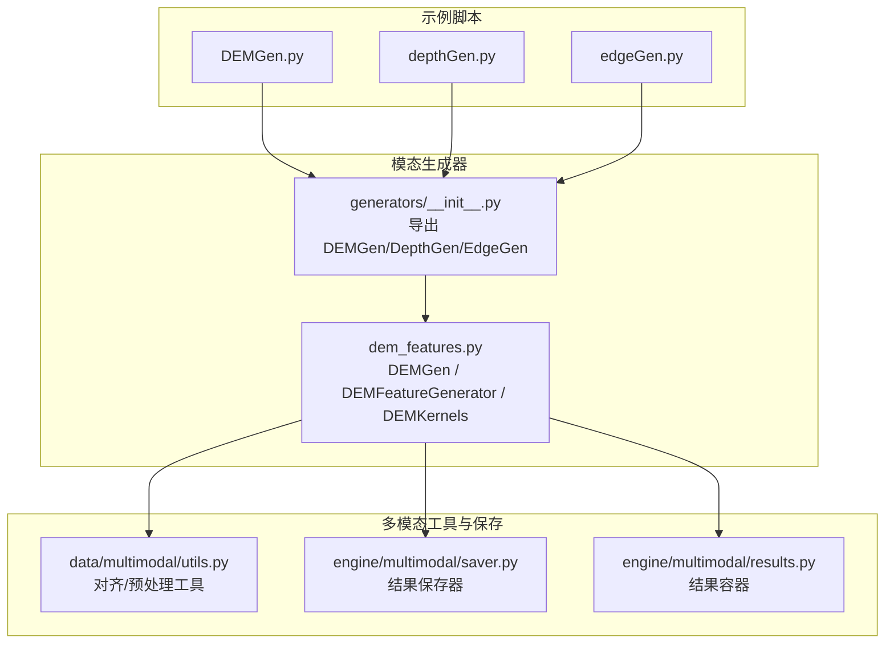
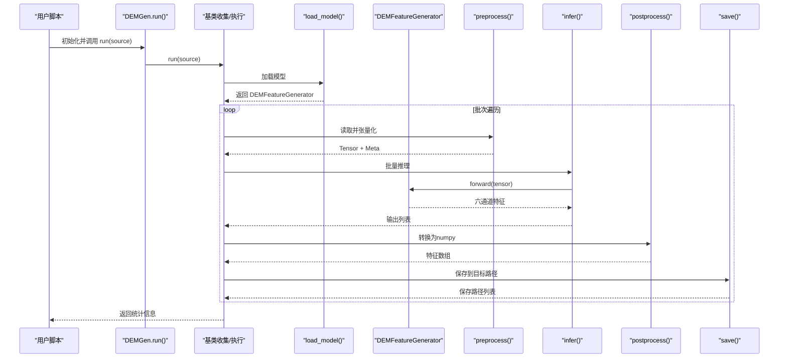
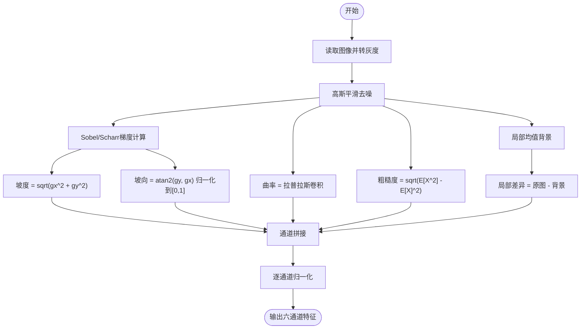
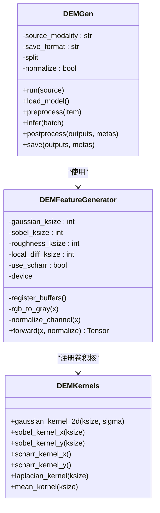
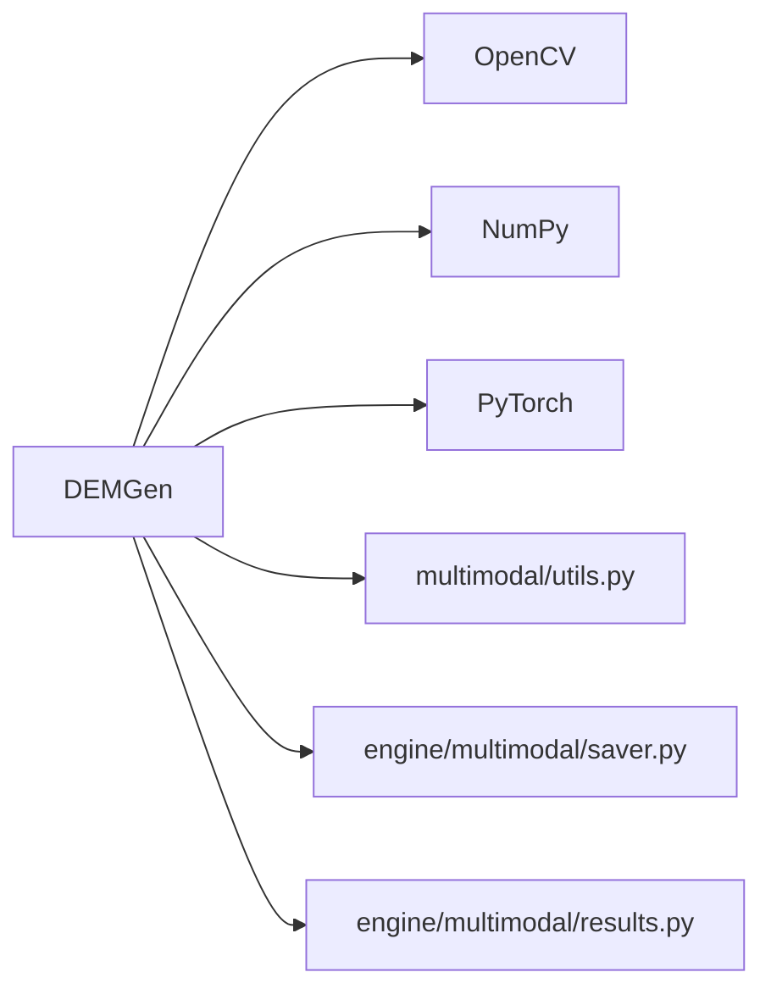

# DEM模态生成器

<cite>
**本文引用的文件**
- [DEMGen.py](file://DEMGen.py)
- [depthGen.py](file://depthGen.py)
- [edgeGen.py](file://edgeGen.py)
- [dem_features.py](file://ultralytics/nn/mm/generators/dem_features.py)
- [__init__.py（模态生成器入口）](file://ultralytics/nn/mm/generators/__init__.py)
- [utils.py（多模态工具）](file://ultralytics/data/multimodal/utils.py)
- [saver.py（多模态保存器）](file://ultralytics/engine/multimodal/saver.py)
- [results.py（多模态结果容器）](file://ultralytics/engine/multimodal/results.py)
</cite>

## 目录
1. [简介](#简介)
2. [项目结构](#项目结构)
3. [核心组件](#核心组件)
4. [架构概览](#架构概览)
5. [详细组件分析](#详细组件分析)
6. [依赖分析](#依赖分析)
7. [性能考虑](#性能考虑)
8. [故障排查指南](#故障排查指南)
9. [结论](#结论)
10. [附录](#附录)

## 简介
本开发指南面向需要基于数字高程模型（DEM）进行遥感与地理空间分析的开发者，系统讲解如何使用项目中的DEM模态生成器，完成高程数据的离线特征提取与生成。文档涵盖以下要点：
- DEM特征提取算法实现：坡度、坡向、粗糙度、曲率、局部差异等六通道特征的计算流程
- DEM生成器的代码实现示例：如何处理地理空间数据、参数配置与批量生成
- 数据质量控制与精度评估：通道一致性、归一化策略与可视化方法
- GIS数据处理最佳实践与性能优化建议：内存管理、批处理与设备选择

## 项目结构
该项目围绕“多模态”能力组织，DEM生成器位于模态生成器子模块中，与深度（Depth）与边缘（Edge）生成器共享统一的运行框架与保存策略。

图表来源
- [DEMGen.py:19-42](file://DEMGen.py#L19-L42)
- [dem_features.py:212-470](file://ultralytics/nn/mm/generators/dem_features.py#L212-L470)
- [__init__.py（模态生成器入口）:6-14](file://ultralytics/nn/mm/generators/__init__.py#L6-L14)
- [utils.py:13-180](file://ultralytics/data/multimodal/utils.py#L13-L180)
- [saver.py:12-112](file://ultralytics/engine/multimodal/saver.py#L12-L112)
- [results.py:14-357](file://ultralytics/engine/multimodal/results.py#L14-L357)

章节来源
- [DEMGen.py:1-42](file://DEMGen.py#L1-L42)
- [dem_features.py:1-470](file://ultralytics/nn/mm/generators/dem_features.py#L1-L470)
- [__init__.py（模态生成器入口）:1-14](file://ultralytics/nn/mm/generators/__init__.py#L1-L14)
- [utils.py:1-180](file://ultralytics/data/multimodal/utils.py#L1-L180)
- [saver.py:1-112](file://ultralytics/engine/multimodal/saver.py#L1-L112)
- [results.py:1-357](file://ultralytics/engine/multimodal/results.py#L1-L357)

## 核心组件
- DEMGen：离线DEM特征生成器，负责批量读取RGB图像，调用DEM特征生成网络，输出六通道特征并保存。
- DEMFeatureGenerator：实现DEM特征提取的神经网络模块，包含卷积核注册、梯度计算、统计特征计算与通道拼接。
- DEMKernels：提供高斯平滑、Sobel/Scharr梯度、拉普拉斯二阶导与均值卷积核，用于不同地形特征的计算。
- 多模态工具：提供X模态与RGB图像的对齐、通道校验、LetterBox填充与张量化等通用预处理。
- 多模态保存器与结果容器：统一管理多模态推理结果的可视化与持久化。

章节来源
- [dem_features.py:39-210](file://ultralytics/nn/mm/generators/dem_features.py#L39-L210)
- [dem_features.py:212-470](file://ultralytics/nn/mm/generators/dem_features.py#L212-L470)
- [utils.py:13-180](file://ultralytics/data/multimodal/utils.py#L13-L180)
- [saver.py:12-112](file://ultralytics/engine/multimodal/saver.py#L12-L112)
- [results.py:14-357](file://ultralytics/engine/multimodal/results.py#L14-L357)

## 架构概览
DEM生成器遵循统一的“收集-加载-预处理-推理-后处理-保存”的流水线，与深度与边缘生成器保持一致的接口风格。

图表来源
- [dem_features.py:284-466](file://ultralytics/nn/mm/generators/dem_features.py#L284-L466)
- [dem_features.py:367-405](file://ultralytics/nn/mm/generators/dem_features.py#L367-L405)
- [dem_features.py:378-391](file://ultralytics/nn/mm/generators/dem_features.py#L378-L391)
- [dem_features.py:407-414](file://ultralytics/nn/mm/generators/dem_features.py#L407-L414)
- [dem_features.py:416-466](file://ultralytics/nn/mm/generators/dem_features.py#L416-L466)

## 详细组件分析

### DEM特征提取算法实现
- 输入约定：支持任意通道的RGB或灰度图像，内部自动转灰度并归一化至0-255范围。
- 高斯平滑：用于抑制噪声，提高梯度计算稳定性。
- 梯度计算：支持Sobel与Scharr算子，计算x/y方向梯度，得到坡度与坡向。
- 曲率：使用拉普拉斯卷积核近似二阶导，反映地形凹凸变化。
- 粗糙度：计算局部均值与平方均值，得到方差的平方根，衡量表面起伏。
- 局部差异：通过大窗口均值背景减除，突出局部高程差异。
- 归一化：对每个通道进行全局最小-最大归一化，保证通道间可比性。

图表来源
- [dem_features.py:111-210](file://ultralytics/nn/mm/generators/dem_features.py#L111-L210)
- [dem_features.py:162-183](file://ultralytics/nn/mm/generators/dem_features.py#L162-L183)

章节来源
- [dem_features.py:111-210](file://ultralytics/nn/mm/generators/dem_features.py#L111-L210)

### DEM生成器类结构

图表来源
- [dem_features.py:39-210](file://ultralytics/nn/mm/generators/dem_features.py#L39-L210)
- [dem_features.py:212-470](file://ultralytics/nn/mm/generators/dem_features.py#L212-L470)

章节来源
- [dem_features.py:39-210](file://ultralytics/nn/mm/generators/dem_features.py#L39-L210)
- [dem_features.py:212-470](file://ultralytics/nn/mm/generators/dem_features.py#L212-L470)

### 示例脚本与参数配置
- DEMGen示例脚本展示了如何初始化生成器、设置设备与保存格式、选择数据集切分以及运行批量生成。
- 关键参数包括：源模态（默认rgb）、设备、保存目录、切分（train/val/test）、保存格式（npy/npz/png）、各卷积核尺寸与是否使用Scharr。
- 输出特征通道：伪高程、坡度、坡向、曲率、粗糙度、局部高程差异。

章节来源
- [DEMGen.py:19-42](file://DEMGen.py#L19-L42)

### 多模态工具与对齐策略
- 对齐与校验：确保X模态（如DEM）与RGB图像在空间尺寸与通道数上一致；支持1通道与3通道之间的显式转换。
- LetterBox填充：提供带ratio_pad的填充策略，便于后续坐标还原。
- 张量化：RGB采用BGR->RGB转换并归一化；X模态按数据类型自动归一化。

章节来源
- [utils.py:13-180](file://ultralytics/data/multimodal/utils.py#L13-L180)

### 多模态保存器与结果容器
- 保存器：支持将RGB、X模态与并排合并图保存，并可选保存txt标签与json结果。
- 结果容器：封装检测框、路径、原始图像与元数据，提供统一的可视化与持久化接口。

章节来源
- [saver.py:12-112](file://ultralytics/engine/multimodal/saver.py#L12-L112)
- [results.py:14-357](file://ultralytics/engine/multimodal/results.py#L14-L357)

## 依赖分析
- DEM生成器依赖OpenCV进行图像读写，NumPy与PyTorch进行数值计算与卷积操作。
- 与多模态工具链解耦：通过统一的预处理与保存接口，支持与深度与边缘生成器协同工作。
- 与数据集配置（data.yaml）解耦：支持直接传入路径或YAML，自动解析模态目录与切分。

图表来源
- [dem_features.py:26-31](file://ultralytics/nn/mm/generators/dem_features.py#L26-L31)
- [utils.py:6-10](file://ultralytics/data/multimodal/utils.py#L6-L10)
- [saver.py:6-9](file://ultralytics/engine/multimodal/saver.py#L6-L9)
- [results.py:6-11](file://ultralytics/engine/multimodal/results.py#L6-L11)

章节来源
- [dem_features.py:26-31](file://ultralytics/nn/mm/generators/dem_features.py#L26-L31)
- [utils.py:6-10](file://ultralytics/data/multimodal/utils.py#L6-L10)
- [saver.py:6-9](file://ultralytics/engine/multimodal/saver.py#L6-L9)
- [results.py:6-11](file://ultralytics/engine/multimodal/results.py#L6-L11)

## 性能考虑
- 设备选择：优先使用CUDA设备；若显存不足，适当降低batch_size或num_workers。
- 批处理策略：当批次内图像尺寸一致时，可合并为单张大张量进行一次性推理，减少多次设备切换开销。
- 卷积核尺寸：较大的核会增加计算量与内存占用，建议根据场景权衡精度与速度。
- 归一化：逐通道归一化成本较低，但可结合数据分布调整以提升稳定性。
- I/O优化：PNG保存适合快速查看，npy/npz更利于后续训练加载；合理选择保存格式以平衡速度与存储。

## 故障排查指南
- 图像读取失败：检查输入路径是否存在、文件格式是否受支持（bmp/jpg/jpeg/png/tif/tiff/webp）。
- 通道不匹配：当X模态通道数不在{1,3}且无法转换时会抛出异常；请确保输入与期望通道一致或提供多通道文件。
- YAML配置错误：确认data.yaml中包含正确的模态目录映射与train/val/test切分配置。
- 设备不兼容：若指定设备不可用，将回退到CPU；请检查设备字符串与驱动状态。
- 保存冲突：启用覆盖选项或清理已有输出目录，避免重复保存导致的路径冲突。

章节来源
- [dem_features.py:378-391](file://ultralytics/nn/mm/generators/dem_features.py#L378-L391)
- [dem_features.py:416-466](file://ultralytics/nn/mm/generators/dem_features.py#L416-L466)
- [utils.py:13-83](file://ultralytics/data/multimodal/utils.py#L13-L83)

## 结论
本指南系统梳理了DEM模态生成器的实现原理与使用方法，强调了特征提取算法的数学基础与工程化落地。通过统一的多模态工具链与保存策略，开发者可以高效地将DEM特征融入多模态学习流程，并在保证质量的前提下获得良好的性能表现。

## 附录
- 示例脚本路径：[DEMGen.py:19-42](file://DEMGen.py#L19-L42)
- 相关生成器入口：[__init__.py（模态生成器入口）:6-14](file://ultralytics/nn/mm/generators/__init__.py#L6-L14)
- 多模态工具与保存器：[utils.py:13-180](file://ultralytics/data/multimodal/utils.py#L13-L180)、[saver.py:12-112](file://ultralytics/engine/multimodal/saver.py#L12-L112)、[results.py:14-357](file://ultralytics/engine/multimodal/results.py#L14-L357)