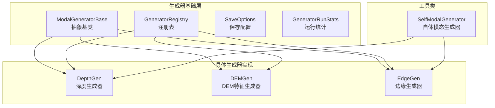
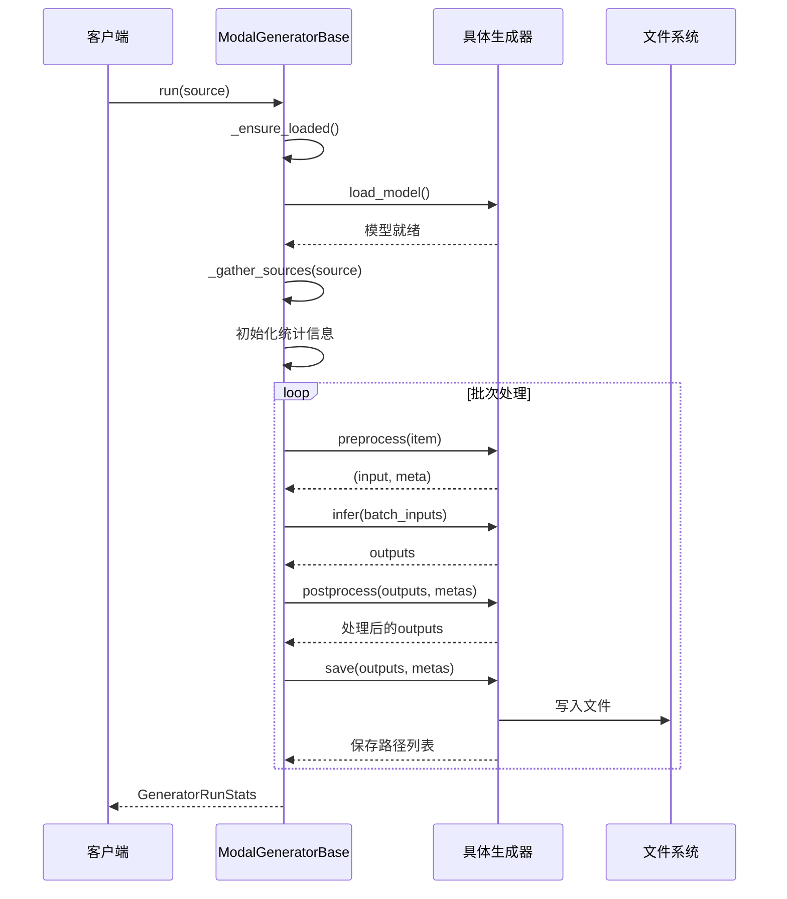
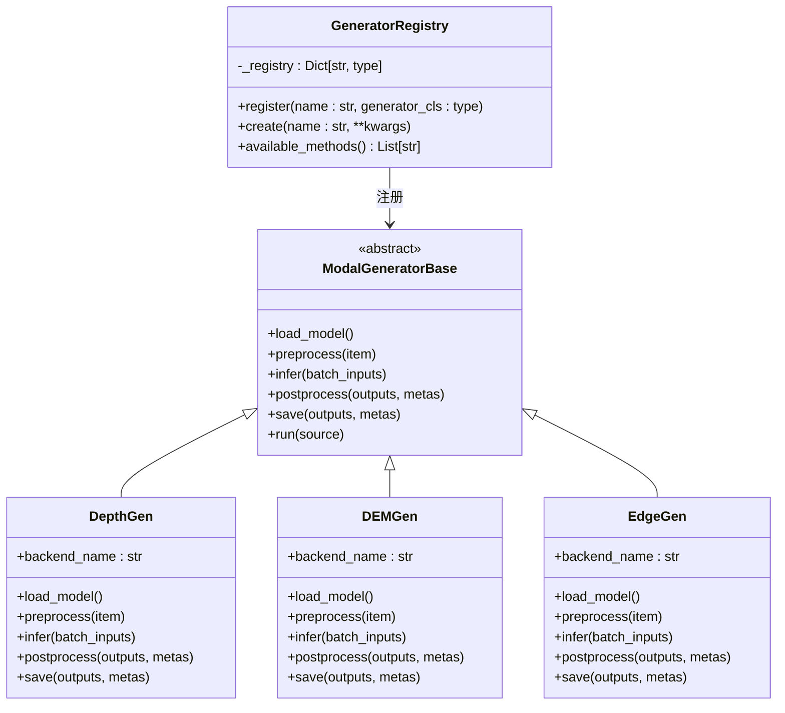
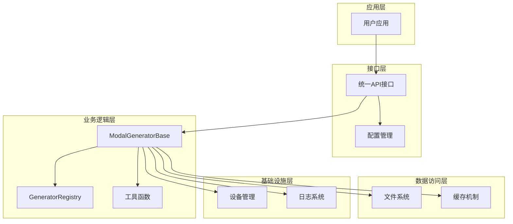
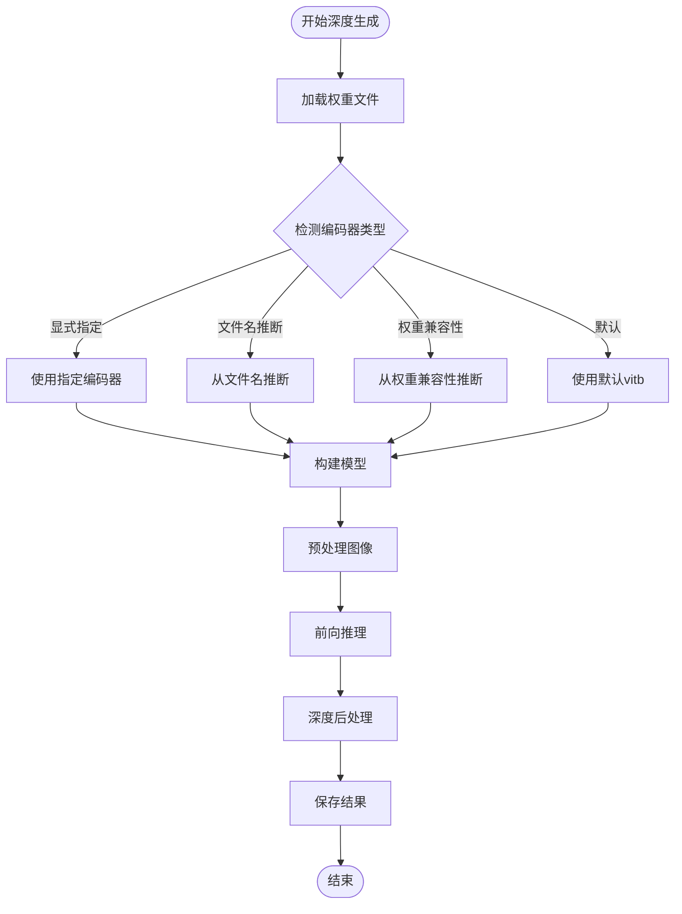
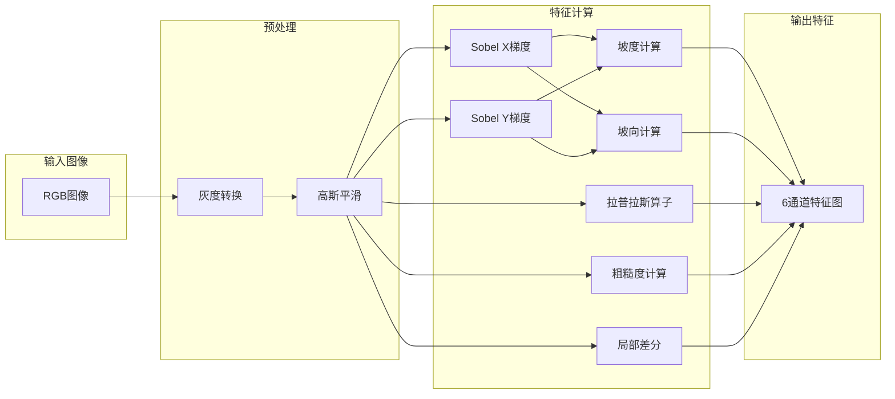
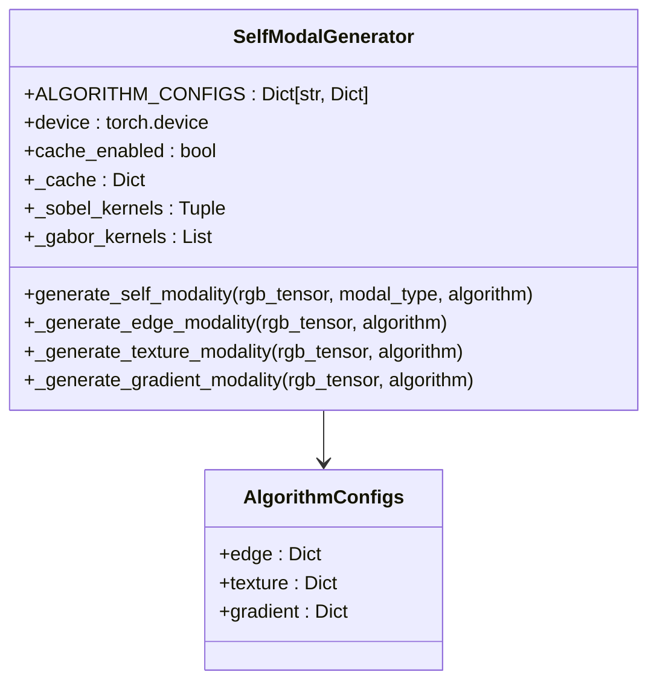
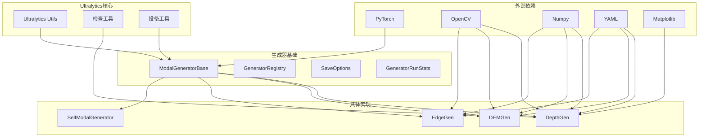

# 模态生成器基类设计

<cite>
**本文档引用的文件**
- [ultralytics\nn\mm\generators\base.py](file://ultralytics\nn\mm\generators\base.py)
- [ultralytics\nn\mm\generators\__init__.py](file://ultralytics\nn\mm\generators\__init__.py)
- [ultralytics\nn\mm\generators\depth_anything_v2.py](file://ultralytics\nn\mm\generators\depth_anything_v2.py)
- [ultralytics\nn\mm\generators\dem_features.py](file://ultralytics\nn\mm\generators\dem_features.py)
- [ultralytics\nn\mm\generators\edge.py](file://ultralytics\nn\mm\generators\edge.py)
- [ultralytics\nn\mm\__init__.py](file://ultralytics\nn\mm\__init__.py)
- [ultralytics\models\yolo\multimodal\self_modal_generator.py](file://ultralytics\models\yolo\multimodal\self_modal_generator.py)
</cite>

## 目录
1. [引言](#引言)
2. [项目结构](#项目结构)
3. [核心组件](#核心组件)
4. [架构概览](#架构概览)
5. [详细组件分析](#详细组件分析)
6. [依赖关系分析](#依赖关系分析)
7. [性能考虑](#性能考虑)
8. [故障排除指南](#故障排除指南)
9. [结论](#结论)

## 引言

本文档详细阐述了Ultralytics多模态系统中的模态生成器基类设计。该设计实现了完全离线的模态生成能力，支持深度估计、数字高程模型(DEM)特征提取和边缘检测等多种模态生成任务。

该系统的核心设计理念包括：
- **完全离线**：仅负责读取源数据、生成目标模态并保存，不与训练/推理管线耦合
- **可插拔设计**：通过注册表机制实现不同生成方法的统一管理
- **严格错误处理**：缺权重/设备/依赖即抛错，由调用方显式处理
- **统一接口**：所有生成器遵循相同的运行流程和配置规范

## 项目结构

多模态生成器系统采用模块化设计，主要包含以下核心组件：



**图表来源**
- [ultralytics\nn\mm\generators\base.py:77-216](file://ultralytics\nn\mm\generators\base.py#L77-L216)
- [ultralytics\nn\mm\generators\depth_anything_v2.py:72-519](file://ultralytics\nn\mm\generators\depth_anything_v2.py#L72-L519)
- [ultralytics\nn\mm\generators\dem_features.py:212-469](file://ultralytics\nn\mm\generators\dem_features.py#L212-L469)
- [ultralytics\nn\mm\generators\edge.py:190-505](file://ultralytics\nn\mm\generators\edge.py#L190-L505)

**章节来源**
- [ultralytics\nn\mm\generators\base.py:1-225](file://ultralytics\nn\mm\generators\base.py#L1-L225)
- [ultralytics\nn\mm\generators\__init__.py:1-15](file://ultralytics\nn\mm\generators\__init__.py#L1-L15)

## 核心组件

### ModalGeneratorBase 抽象基类

ModalGeneratorBase是所有模态生成器的抽象基类，定义了完整的离线生成流程和必需的接口方法。

#### 核心接口方法

1. **load_model()** - 模型加载与初始化
   - 负责加载权重和初始化模型
   - 设置到self.model属性
   - 必须在子类中实现

2. **preprocess(item)** - 数据预处理
   - 读取单个输入样本
   - 返回(input, meta)元组
   - meta至少包含源路径信息
   - 必须在子类中实现

3. **infer(batch_inputs)** - 前向推理
   - 对预处理后的批次进行推理
   - 返回处理后的输出列表
   - 必须在子类中实现

4. **postprocess(outputs, metas)** - 后处理
   - 对推理结果进行后处理
   - 可选实现，基类提供默认空实现
   - 可在子类中重写以添加特定后处理逻辑

5. **save(outputs, metas)** - 结果保存
   - 将生成的模态数据保存到磁盘
   - 返回保存路径列表
   - 必须在子类中实现

#### 运行流程



**图表来源**
- [ultralytics\nn\mm\generators\base.py:174-216](file://ultralytics\nn\mm\generators\base.py#L174-L216)

**章节来源**
- [ultralytics\nn\mm\generators\base.py:77-137](file://ultralytics\nn\mm\generators\base.py#L77-L137)

### GeneratorRegistry 注册表机制

GeneratorRegistry提供了统一的生成器实例化机制，支持按名称创建不同的模态生成器。

#### 注册表工作原理



**图表来源**
- [ultralytics\nn\mm\generators\base.py:51-71](file://ultralytics\nn\mm\generators\base.py#L51-L71)

#### 使用方法

注册表支持两种主要使用方式：

1. **直接创建实例**：
```python
# 通过注册表创建生成器
generator = GeneratorRegistry.create("depth_anything_v2", device="cuda")
```

2. **模块级导入**：
```python
# 直接从模块导入
from ultralytics.nn.mm.generators import DepthGen, DEMGen, EdgeGen
```

**章节来源**
- [ultralytics\nn\mm\generators\base.py:51-71](file://ultralytics\nn\mm\generators\base.py#L51-L71)
- [ultralytics\nn\mm\generators\__init__.py:1-15](file://ultralytics\nn\mm\generators\__init__.py#L1-L15)

### 配置类设计

#### SaveOptions 配置类

SaveOptions提供了统一的保存配置选项：

| 参数名 | 类型 | 默认值 | 描述 |
|--------|------|--------|------|
| enable_save | bool | True | 是否启用保存功能 |
| save_dir | Path/str | None | 基础输出目录，None表示由子类决定 |
| keep_structure | bool | True | 是否保持输入目录结构 |
| overwrite | bool | False | 已存在时是否覆盖 |

#### GeneratorRunStats 统计类

GeneratorRunStats记录生成过程的执行统计信息：

| 字段名 | 类型 | 描述 |
|--------|------|------|
| total | int | 总样本数 |
| success | int | 成功处理数 |
| failed | int | 失败处理数 |
| failures | List[Tuple[str, str]] | 失败详情列表[(路径, 错误信息)] |

**章节来源**
- [ultralytics\nn\mm\generators\base.py:27-45](file://ultralytics\nn\mm\generators\base.py#L27-L45)

## 架构概览

多模态生成器系统采用分层架构设计，确保了良好的可扩展性和维护性：



**图表来源**
- [ultralytics\nn\mm\generators\base.py:1-225](file://ultralytics\nn\mm\generators\base.py#L1-L225)

## 详细组件分析

### DepthGen 深度生成器

DepthGen实现了基于Depth Anything V2的深度估计功能，支持多种编码器变体。

#### 核心特性

1. **多编码器支持**：vits、vitb、vitl、vitg四种编码器
2. **灵活的数据源**：支持目录、文件列表和YAML配置文件
3. **丰富的后处理选项**：支持多种深度后处理算法
4. **多样化的保存格式**：支持彩色深度图、原始16位深度图和numpy数组

#### 深度生成流程



**图表来源**
- [ultralytics\nn\mm\generators\depth_anything_v2.py:263-347](file://ultralytics\nn\mm\generators\depth_anything_v2.py#L263-L347)

**章节来源**
- [ultralytics\nn\mm\generators\depth_anything_v2.py:72-519](file://ultralytics\nn\mm\generators\depth_anything_v2.py#L72-L519)

### DEMGen DEM特征生成器

DEMGen实现了数字高程模型的特征提取功能，生成6通道的地形特征图。

#### 特征通道

1. **Elevation（高程）**：伪高程/灰度信息
2. **Slope（坡度）**：梯度幅值
3. **Aspect（坡向）**：梯度方向
4. **Curvature（曲率）**：拉普拉斯二阶导
5. **Roughness（粗糙度）**：局部标准差
6. **Local Height Difference（局部高度差）**：高通局部差分

#### DEM特征提取算法



**图表来源**
- [ultralytics\nn\mm\generators\dem_features.py:111-210](file://ultralytics\nn\mm\generators\dem_features.py#L111-L210)

**章节来源**
- [ultralytics\nn\mm\generators\dem_features.py:212-469](file://ultralytics\nn\mm\generators\dem_features.py#L212-L469)

### EdgeGen 边缘生成器

EdgeGen实现了边缘检测功能，支持多种边缘检测算法和输出格式。

#### 边缘检测算法

1. **Sobel算子**：标准的Sobel边缘检测
2. **Scharr算子**：改进的Sobel算子，具有更好的旋转不变性
3. **Canny边缘检测**：基于Canny的边缘检测算法

#### 输出通道控制

- **1通道输出**：单通道边缘强度图
- **3通道输出**：三通道RGB边缘图，便于与RGB图像融合

**章节来源**
- [ultralytics\nn\mm\generators\edge.py:190-505](file://ultralytics\nn\mm\generators\edge.py#L190-L505)

### SelfModalGenerator 自体模态生成器

SelfModalGenerator提供了从RGB图像生成各种辅助模态的能力，包括边缘、纹理和梯度等。

#### 算法配置



**图表来源**
- [ultralytics\models\yolo\multimodal\self_modal_generator.py:10-505](file://ultralytics\models\yolo\multimodal\self_modal_generator.py#L10-L505)

**章节来源**
- [ultralytics\models\yolo\multimodal\self_modal_generator.py:10-505](file://ultralytics\models\yolo\multimodal\self_modal_generator.py#L10-L505)

## 依赖关系分析

多模态生成器系统的依赖关系体现了清晰的分层架构：



**图表来源**
- [ultralytics\nn\mm\generators\base.py:10-21](file://ultralytics\nn\mm\generators\base.py#L10-L21)
- [ultralytics\nn\mm\generators\depth_anything_v2.py:12-25](file://ultralytics\nn\mm\generators\depth_anything_v2.py#L12-L25)
- [ultralytics\nn\mm\generators\dem_features.py:22-36](file://ultralytics\nn\mm\generators\dem_features.py#L22-L36)
- [ultralytics\nn\mm\generators\edge.py:16-32](file://ultralytics\nn\mm\generators\edge.py#L16-L32)

**章节来源**
- [ultralytics\nn\mm\generators\base.py:1-225](file://ultralytics\nn\mm\generators\base.py#L1-L225)

## 性能考虑

### 批处理优化

系统采用了智能的批处理策略，通过以下机制优化性能：

1. **批量推理**：将多个样本合并进行批量推理，提高GPU利用率
2. **内存管理**：合理控制批大小，避免内存溢出
3. **异步处理**：利用非阻塞张量传输减少CPU-GPU同步开销

### 缓存机制

- **模型缓存**：避免重复加载模型
- **中间结果缓存**：SelfModalGenerator支持中间结果缓存
- **文件系统缓存**：避免重复处理相同文件

### 设备优化

- **自动设备选择**：支持CUDA和CPU自动切换
- **混合精度**：在支持的硬件上启用混合精度计算
- **内存优化**：及时释放不需要的中间变量

## 故障排除指南

### 常见问题及解决方案

#### 模型加载失败

**症状**：`RuntimeError: 模型未加载成功`

**原因**：
- 权重文件路径错误
- 设备不支持指定的编码器
- 依赖库缺失

**解决方案**：
```python
try:
    generator = DepthGen(weights="path/to/weights.pth", encoder="vitb")
    generator.run(source_path)
except FileNotFoundError as e:
    print(f"权重文件不存在: {e}")
except ValueError as e:
    print(f"编码器配置错误: {e}")
```

#### 数据格式错误

**症状**：`ValueError: 无法读取图像`

**原因**：
- 图像格式不支持
- 文件损坏
- 路径权限问题

**解决方案**：
```python
# 检查文件格式
supported_formats = {".jpg", ".png", ".bmp", ".tiff"}
if Path(file_path).suffix.lower() not in supported_formats:
    raise ValueError(f"不支持的文件格式: {file_path}")
```

#### 内存不足

**症状**：`CUDA out of memory`

**解决方案**：
```python
# 减小批大小
generator = DepthGen(batch_size=1)

# 使用CPU设备
generator = DepthGen(device="cpu")

# 启用内存优化
generator = DepthGen(num_workers=0)
```

**章节来源**
- [ultralytics\nn\mm\generators\base.py:140-146](file://ultralytics\nn\mm\generators\base.py#L140-L146)
- [ultralytics\nn\mm\generators\depth_anything_v2.py:263-347](file://ultralytics\nn\mm\generators\depth_anything_v2.py#L263-L347)

## 结论

Ultralytics多模态生成器基类设计体现了现代机器学习系统设计的最佳实践：

### 设计优势

1. **高度模块化**：通过抽象基类和注册表实现松耦合设计
2. **强类型安全**：使用dataclass和类型注解确保配置安全性
3. **完善的错误处理**：严格的异常机制和详细的错误信息
4. **灵活的配置管理**：统一的配置接口支持各种定制需求
5. **优秀的扩展性**：新的生成器只需继承基类即可无缝集成

### 最佳实践建议

1. **继承规范**：新生成器应严格遵循基类接口约定
2. **错误处理**：在子类中提供详细的错误信息和回退策略
3. **性能优化**：合理设置批大小和设备参数
4. **资源管理**：及时清理临时文件和缓存
5. **测试验证**：为新生成器编写完整的单元测试

该设计为多模态学习系统提供了坚实的基础，支持从简单的边缘检测到复杂的深度估计等各种应用场景，为构建高性能的多模态AI系统奠定了重要基础。