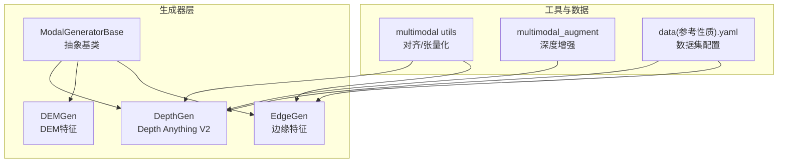
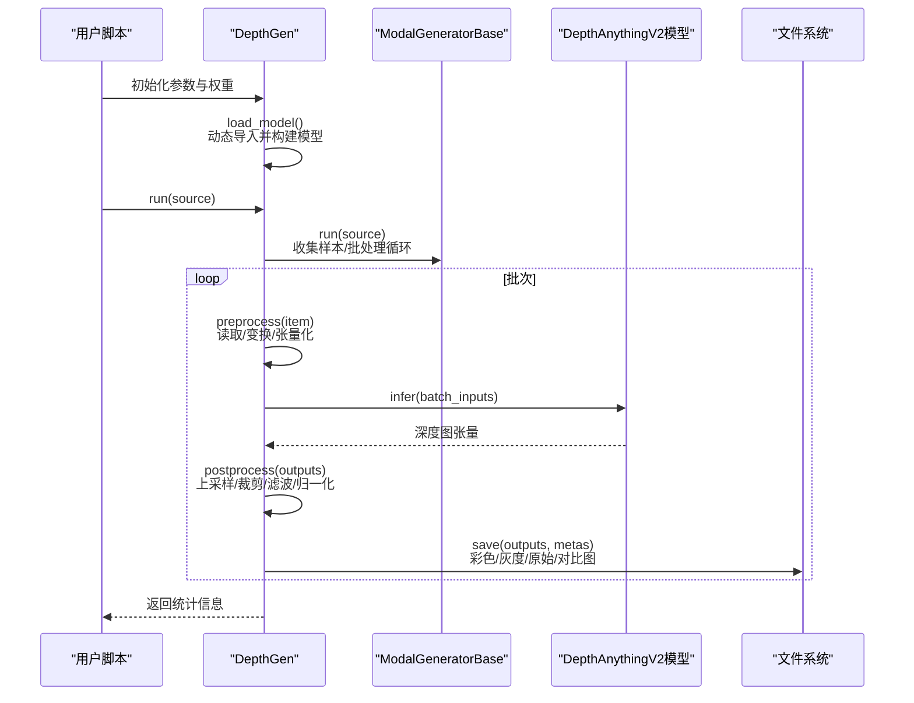
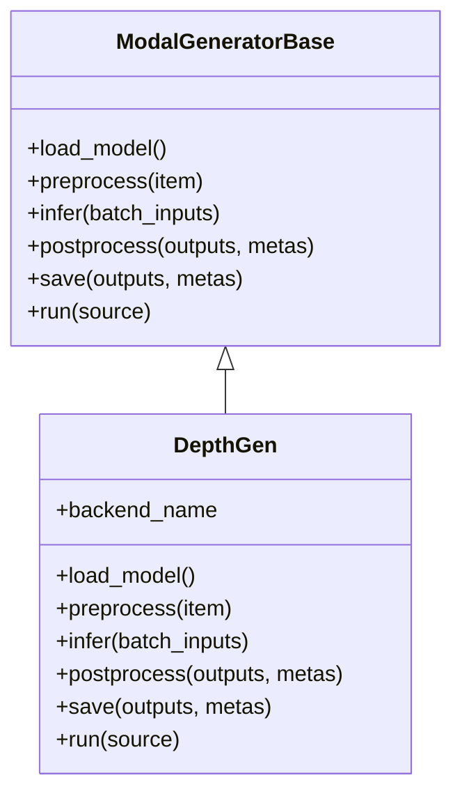
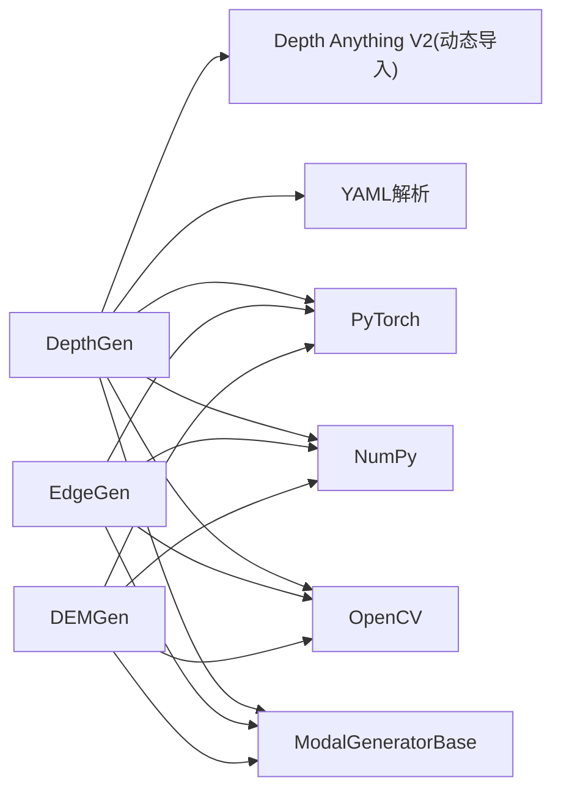

# 深度模态生成器

<cite>
**本文引用的文件**
- [depthGen.py](file://depthGen.py)
- [edgeGen.py](file://edgeGen.py)
- [depth_anything_v2.py](file://ultralytics/nn/mm/generators/depth_anything_v2.py)
- [base.py](file://ultralytics/nn/mm/generators/base.py)
- [dem_features.py](file://ultralytics/nn/mm/generators/dem_features.py)
- [edge.py](file://ultralytics/nn/mm/generators/edge.py)
- [__init__.py](file://ultralytics/nn/mm/generators/__init__.py)
- [utils.py](file://ultralytics/data/multimodal/utils.py)
- [multimodal_augment.py](file://ultralytics/data/multimodal_augment.py)
- [data(参考性质).yaml](file://data(参考性质).yaml)
</cite>

## 目录
1. [简介](#简介)
2. [项目结构](#项目结构)
3. [核心组件](#核心组件)
4. [架构总览](#架构总览)
5. [详细组件分析](#详细组件分析)
6. [依赖分析](#依赖分析)
7. [性能考虑](#性能考虑)
8. [故障排查指南](#故障排查指南)
9. [结论](#结论)
10. [附录](#附录)

## 简介
本指南面向希望基于 Ultralytics 多模态框架开发“深度模态生成器”的工程师与研究者。文档聚焦于深度图生成器的实现原理、算法选择（尤其是 Depth Anything V2）、输入输出规范、数据预处理流程、模型加载与推理过程，并提供继承 ModalGeneratorBase 开发自定义深度生成器的实践路径。同时涵盖质量评估方法、性能优化技巧、常见问题与调试技巧，以及配置参数说明。

## 项目结构
围绕“深度模态生成器”的核心代码位于 ultralytics/nn/mm/generators 目录下，对外通过 generators/__init__.py 暴露 DepthGen、DEMGen、EdgeGen 三大生成器；examples 位于仓库根目录下的 depthGen.py、edgeGen.py 提供快速上手示例；数据层面的多模态工具与增强逻辑位于 ultralytics/data 下。

图表来源
- [base.py:77-224](file://ultralytics/nn/mm/generators/base.py#L77-L224)
- [depth_anything_v2.py:72-520](file://ultralytics/nn/mm/generators/depth_anything_v2.py#L72-L520)
- [dem_features.py:212-470](file://ultralytics/nn/mm/generators/dem_features.py#L212-L470)
- [edge.py:190-506](file://ultralytics/nn/mm/generators/edge.py#L190-L506)
- [utils.py:13-180](file://ultralytics/data/multimodal/utils.py#L13-L180)
- [multimodal_augment.py:777-1014](file://ultralytics/data/multimodal_augment.py#L777-L1014)
- [data(参考性质).yaml](file://data(参考性质).yaml#L1-L28)

章节来源
- [__init__.py:1-14](file://ultralytics/nn/mm/generators/__init__.py#L1-L14)
- [depthGen.py:1-24](file://depthGen.py#L1-L24)
- [edgeGen.py:1-46](file://edgeGen.py#L1-L46)

## 核心组件
- ModalGeneratorBase：定义统一的离线模态生成器接口与运行流程，子类需实现 load_model、preprocess、infer、postprocess、save。
- DepthGen：基于 Depth Anything V2 的深度图生成器，支持 YAML 数据集、自动 encoder 推断、多种后处理与保存格式。
- DEMGen：离线生成 6 通道 DEM-like 特征（高程、坡度、坡向、曲率、粗糙度、局部差异）。
- EdgeGen：离线生成边缘强度图，支持 Sobel/Scharr、伽马校正、二值化、多通道输出。
- 多模态工具与增强：align_and_validate_x、to_tensor_rgb/to_tensor_x 等，以及针对深度图的增强策略。

章节来源
- [base.py:77-224](file://ultralytics/nn/mm/generators/base.py#L77-L224)
- [depth_anything_v2.py:72-520](file://ultralytics/nn/mm/generators/depth_anything_v2.py#L72-L520)
- [dem_features.py:212-470](file://ultralytics/nn/mm/generators/dem_features.py#L212-L470)
- [edge.py:190-506](file://ultralytics/nn/mm/generators/edge.py#L190-L506)
- [utils.py:13-180](file://ultralytics/data/multimodal/utils.py#L13-L180)
- [multimodal_augment.py:777-1014](file://ultralytics/data/multimodal_augment.py#L777-L1014)

## 架构总览
深度模态生成器遵循“离线批量生成 + 统一接口”的设计：子类通过 YAML 或路径列表收集样本，依次执行预处理、推理、后处理与保存，期间可灵活配置保存目录、格式与后处理策略。

图表来源
- [depth_anything_v2.py:263-516](file://ultralytics/nn/mm/generators/depth_anything_v2.py#L263-L516)
- [base.py:174-216](file://ultralytics/nn/mm/generators/base.py#L174-L216)

## 详细组件分析

### DepthGen（Depth Anything V2）
- 算法与特性
  - 默认后端为 Depth Anything V2，支持 vits/vitb/vitl/vitg encoder。
  - 自动推断 encoder：显式传入 > 权重文件名 > 权重兼容性 > 默认 vitb。
  - 支持 YAML 数据集（train/val/test），自动推导 images_depth 默认输出目录。
  - 预处理：Resize（可保持宽高比并按倍数对齐）、Normalize、PrepareForNet。
  - 推理：直接前向得到深度图张量。
  - 后处理：可选 scale/offset、百分位裁剪、高斯/中值/双边滤波、反转、归一化。
  - 保存：彩色深度图（可灰度着色）、16bit 原始 PNG、npy、对比图（可选）。
- 关键参数
  - 模型与设备：weights、encoder、input_size、device。
  - 保存控制：save_dir、keep_structure、overwrite、save_color、save_raw16、save_npy、save_comparison、grayscale_color。
  - 后处理：clamp_percentile、depth_scale、depth_offset、invert、gaussian_blur、median_filter、bilateral_filter 等。
  - 图像尺寸与对齐：keep_aspect_ratio、ensure_multiple_of、resize_method。
- 输入输出
  - 输入：单张或多张图像路径，或 data.yaml（train/val/test）。
  - 输出：深度图（float32，范围取决于后处理），可保存为 png/npy/tif 等格式。
- 使用示例
  - 参考根目录示例脚本，传入权重路径、设备、保存开关与 split 等参数，调用 run(data.yaml) 即可批量生成。

图表来源
- [base.py:77-224](file://ultralytics/nn/mm/generators/base.py#L77-L224)
- [depth_anything_v2.py:72-520](file://ultralytics/nn/mm/generators/depth_anything_v2.py#L72-L520)

章节来源
- [depthGen.py:1-24](file://depthGen.py#L1-L24)
- [depth_anything_v2.py:72-520](file://ultralytics/nn/mm/generators/depth_anything_v2.py#L72-L520)

### DEMGen（DEM 特征）
- 功能概述
  - 生成 6 通道 DEM-like 特征（高程、坡度、坡向、曲率、粗糙度、局部差异）。
  - 支持 YAML 数据集与 split 过滤，输出默认为 .npy/.npz 或 .png（通道切片）。
- 关键参数
  - 源模态：source_modality（默认 rgb）。
  - 保存格式：save_format（npy/npz/png）。
  - 卷积核大小：gaussian_ksize、sobel_ksize、roughness_ksize、local_diff_ksize。
  - 梯度算子：use_scharr（Sobel/Scharr）。
  - 归一化：normalize。
- 使用场景
  - 与 RGB 图像空间对齐后，作为多模态输入的高维特征通道。

章节来源
- [dem_features.py:212-470](file://ultralytics/nn/mm/generators/dem_features.py#L212-L470)

### EdgeGen（边缘特征）
- 功能概述
  - 从 RGB 生成边缘强度图，支持 1/3 通道输出，保存为 png/npy/tif。
  - 支持 Sobel/Scharr、伽马校正、二值化、通道适配。
- 关键参数
  - 源模态：source_modality（默认 rgb）。
  - 保存格式：save_format（png/npy/npz/tif）。
  - 输出通道：xch（1 或 3）。
  - 算法参数：gaussian_ksize、sobel_ksize、use_scharr、normalize、gamma、binarize、threshold。
- 使用场景
  - 作为多模态输入的边缘通道，或用于下游边缘检测任务。

章节来源
- [edge.py:190-506](file://ultralytics/nn/mm/generators/edge.py#L190-L506)

### 多模态数据工具与增强
- 对齐与张量化
  - align_and_validate_x：将 X 模态对齐到 RGB 尺寸并校验通道数（1/3 通道间显式转换）。
  - to_tensor_rgb/to_tensor_x：将图像转换为张量并归一化。
- 深度图增强策略
  - multimodal_augment：提供窗口化、校准漂移、量化、噪声、伽马、CLAHE、孔洞等操作的配置与应用逻辑，便于在深度图上进行数据增强。

章节来源
- [utils.py:13-180](file://ultralytics/data/multimodal/utils.py#L13-L180)
- [multimodal_augment.py:777-1014](file://ultralytics/data/multimodal_augment.py#L777-L1014)

## 依赖分析
- 模块耦合
  - 生成器均继承 ModalGeneratorBase，共享统一的 run 流程与错误处理。
  - DepthGen 依赖外部 Depth Anything V2 代码库（通过动态导入），并与 YAML 解析、OpenCV、NumPy、PyTorch 强耦合。
  - DEMGen/EdgeGen 为纯 PyTorch 实现，依赖卷积核与 CUDA（如可用）。
- 外部依赖
  - OpenCV、NumPy、PyTorch、Matplotlib（可选）、YAML。
- 循环依赖
  - generators/__init__.py 导出各生成器，未见循环导入。

图表来源
- [depth_anything_v2.py:47-65](file://ultralytics/nn/mm/generators/depth_anything_v2.py#L47-L65)
- [edge.py:190-506](file://ultralytics/nn/mm/generators/edge.py#L190-L506)
- [dem_features.py:212-470](file://ultralytics/nn/mm/generators/dem_features.py#L212-L470)
- [base.py:77-224](file://ultralytics/nn/mm/generators/base.py#L77-L224)

章节来源
- [__init__.py:1-14](file://ultralytics/nn/mm/generators/__init__.py#L1-L14)

## 性能考虑
- 设备与批大小
  - 优先使用 GPU（CUDA），合理设置 batch_size 与 num_workers。
  - 注意批内样本尺寸不一致时会退化为逐样本推理，影响吞吐。
- 预处理与后处理
  - Resize 时启用 keep_aspect_ratio 并设置 ensure_multiple_of，减少上采样开销。
  - 后处理中的滤波（高斯/中值/双边）会增加耗时，按需开启。
- I/O 与存储
  - 保存为 16bit PNG 或 .npy 可保留更高精度，但占用更大；对比图可选保存。
  - 保持目录结构（keep_structure）便于组织，但可能增加磁盘 IO。
- 模型加载
  - DepthGen 在首次 run 时动态导入外部模块并加载权重，建议提前准备权重与路径，避免重复导入。

[本节为通用指导，不直接分析具体文件]

## 故障排查指南
- 无法找到外部模块
  - DepthGen 需要 ref/Depth-Anything-V2-main 完整存在，否则动态导入失败。检查路径与安装状态。
- 权重文件不存在或不兼容
  - 若 weights 未指定，将尝试默认路径；若 encoder 无法唯一推断，需显式传入。
- 输入路径与格式
  - YAML 中 train/val/test 路径需存在且包含支持的图像扩展名；普通路径需为文件或包含图像的目录。
- 保存冲突
  - save_color/save_raw16/save_npy 互斥，仅能开启一项；overwrite 控制覆盖行为。
- 运行时错误
  - run 方法捕获异常并记录失败样本路径与错误信息；可通过统计信息定位问题。

章节来源
- [depth_anything_v2.py:47-65](file://ultralytics/nn/mm/generators/depth_anything_v2.py#L47-L65)
- [depth_anything_v2.py:263-346](file://ultralytics/nn/mm/generators/depth_anything_v2.py#L263-L346)
- [base.py:174-216](file://ultralytics/nn/mm/generators/base.py#L174-L216)

## 结论
本文档系统梳理了基于 Ultralytics 的深度模态生成器实现方案，重点围绕 DepthGen（Depth Anything V2）展开，覆盖算法原理、输入输出、预处理/推理/后处理/保存全流程，并给出继承 ModalGeneratorBase 的扩展思路、质量评估与性能优化建议。结合 DEMGen/EdgeGen 与多模态工具链，可构建完整的多模态深度学习数据管线。

[本节为总结性内容，不直接分析具体文件]

## 附录

### A. 自定义深度生成器开发步骤（继承 ModalGeneratorBase）
- 步骤概览
  - 新建类继承 ModalGeneratorBase，实现 load_model、preprocess、infer、postprocess、save。
  - 在 load_model 中加载/构建模型与变换；在 preprocess 中完成读取、归一化与张量化；在 infer 中执行前向；在 postprocess 中进行后处理；在 save 中写入文件。
  - 如需支持 YAML 数据集，重载 _gather_sources 并维护元信息（如 split、images_root、默认输出目录）。
  - 在 generators/__init__.py 中注册导出，或在业务代码中直接构造实例。
- 参考实现位置
  - 基类与运行流程：[base.py:77-224](file://ultralytics/nn/mm/generators/base.py#L77-L224)
  - 示例实现（DepthGen）：[depth_anything_v2.py:72-520](file://ultralytics/nn/mm/generators/depth_anything_v2.py#L72-L520)
  - 示例实现（EdgeGen）：[edge.py:190-506](file://ultralytics/nn/mm/generators/edge.py#L190-L506)
  - 示例实现（DEMGen）：[dem_features.py:212-470](file://ultralytics/nn/mm/generators/dem_features.py#L212-L470)

章节来源
- [base.py:77-224](file://ultralytics/nn/mm/generators/base.py#L77-L224)
- [depth_anything_v2.py:72-520](file://ultralytics/nn/mm/generators/depth_anything_v2.py#L72-L520)
- [edge.py:190-506](file://ultralytics/nn/mm/generators/edge.py#L190-L506)
- [dem_features.py:212-470](file://ultralytics/nn/mm/generators/dem_features.py#L212-L470)

### B. 输入输出与数据预处理
- 输入
  - 单张图像路径、目录（递归搜索支持的扩展名）、data.yaml（train/val/test）。
- 输出
  - 深度图（float32），可保存为 png/npy/tif 等；支持彩色/灰度/16bit 原始/对比图。
- 预处理
  - DepthGen：BGR->RGB、归一化到 [0,1]、Resize（可保持宽高比并按倍数对齐）、Normalize、PrepareForNet。
  - EdgeGen/DEMGen：BGR->RGB 或灰度、张量化、可选平滑与梯度计算。
- 参考实现位置
  - [depth_anything_v2.py:348-367](file://ultralytics/nn/mm/generators/depth_anything_v2.py#L348-L367)
  - [edge.py:376-387](file://ultralytics/nn/mm/generators/edge.py#L376-L387)
  - [dem_features.py:378-391](file://ultralytics/nn/mm/generators/dem_features.py#L378-L391)

章节来源
- [depth_anything_v2.py:348-367](file://ultralytics/nn/mm/generators/depth_anything_v2.py#L348-L367)
- [edge.py:376-387](file://ultralytics/nn/mm/generators/edge.py#L376-L387)
- [dem_features.py:378-391](file://ultralytics/nn/mm/generators/dem_features.py#L378-L391)

### C. 模型加载与推理流程
- 模型加载
  - DepthGen：动态导入外部模块，构建 DepthAnythingV2，加载权重，构建变换列表。
- 推理
  - DepthGen：合并批次，前向得到深度图张量，逐样本上采样至原图尺寸。
- 后处理
  - DepthGen：scale/offset、百分位裁剪、滤波、反转、归一化。
- 保存
  - DepthGen：彩色/灰度/原始/对比图，支持覆盖与结构保持。
- 参考实现位置
  - [depth_anything_v2.py:263-346](file://ultralytics/nn/mm/generators/depth_anything_v2.py#L263-L346)
  - [depth_anything_v2.py:369-412](file://ultralytics/nn/mm/generators/depth_anything_v2.py#L369-L412)
  - [depth_anything_v2.py:414-501](file://ultralytics/nn/mm/generators/depth_anything_v2.py#L414-L501)

章节来源
- [depth_anything_v2.py:263-346](file://ultralytics/nn/mm/generators/depth_anything_v2.py#L263-L346)
- [depth_anything_v2.py:369-412](file://ultralytics/nn/mm/generators/depth_anything_v2.py#L369-L412)
- [depth_anything_v2.py:414-501](file://ultralytics/nn/mm/generators/depth_anything_v2.py#L414-L501)

### D. 质量评估与性能优化
- 质量评估
  - 视觉检查：彩色深度图与原图对比、边缘一致性。
  - 数值指标：与 GT 的深度误差（如 RMSE、MAE、相对误差）。
  - 稳健性：不同光照/尺度/遮挡下的鲁棒性。
- 性能优化
  - 批处理与多进程：num_workers、batch_size。
  - 预处理优化：保持宽高比、对齐倍数、减少上采样。
  - 后处理按需：滤波、反转等仅在需要时启用。
  - I/O 优化：16bit PNG 与 .npy 的权衡。
- 参考实现位置
  - [depth_anything_v2.py:80-165](file://ultralytics/nn/mm/generators/depth_anything_v2.py#L80-L165)
  - [depth_anything_v2.py:390-410](file://ultralytics/nn/mm/generators/depth_anything_v2.py#L390-L410)

章节来源
- [depth_anything_v2.py:80-165](file://ultralytics/nn/mm/generators/depth_anything_v2.py#L80-L165)
- [depth_anything_v2.py:390-410](file://ultralytics/nn/mm/generators/depth_anything_v2.py#L390-L410)

### E. 配置参数说明（节选）
- DepthGen（部分）
  - weights：权重路径（可省略，自动推断）。
  - encoder：vits/vitb/vitl/vitg（可省略，自动推断）。
  - input_size：输入尺寸（默认 518）。
  - device：设备（如 cuda:0）。
  - save_dir/keep_structure/overwrite：保存控制。
  - save_color/save_raw16/save_npy/save_comparison/grayscale_color：保存格式互斥。
  - clamp_percentile/depth_scale/depth_offset/invert：后处理。
  - gaussian_blur/median_filter/bilateral_filter：滤波。
  - colormap：彩色映射。
  - keep_aspect_ratio/ensure_multiple_of/resize_method：尺寸与对齐。
- EdgeGen（部分）
  - source_modality：源模态（默认 rgb）。
  - save_format：png/npy/npz/tif。
  - xch：输出通道（1/3）。
  - gaussian_ksize/sobel_ksize/use_scharr/normalize/gamma/binarize/threshold：边缘算法参数。
- DEMGen（部分）
  - source_modality：源模态（默认 rgb）。
  - save_format：npy/npz/png。
  - gaussian_ksize/sobel_ksize/roughness_ksize/local_diff_ksize/use_scharr/normalize：特征参数。
- 参考实现位置
  - [depth_anything_v2.py:80-165](file://ultralytics/nn/mm/generators/depth_anything_v2.py#L80-L165)
  - [edge.py:200-262](file://ultralytics/nn/mm/generators/edge.py#L200-L262)
  - [dem_features.py:221-282](file://ultralytics/nn/mm/generators/dem_features.py#L221-L282)

章节来源
- [depth_anything_v2.py:80-165](file://ultralytics/nn/mm/generators/depth_anything_v2.py#L80-L165)
- [edge.py:200-262](file://ultralytics/nn/mm/generators/edge.py#L200-L262)
- [dem_features.py:221-282](file://ultralytics/nn/mm/generators/dem_features.py#L221-L282)

### F. 调试技巧
- 日志与进度
  - run 方法每处理一定数量样本打印进度日志；失败样本记录到统计信息。
- 目录与结构
  - 保存目录首次访问时会打印提示，便于确认输出位置。
- 错误定位
  - 失败列表包含路径与错误信息，可据此修复输入路径、格式或依赖。
- 参考实现位置
  - [base.py:200-216](file://ultralytics/nn/mm/generators/base.py#L200-L216)
  - [depth_anything_v2.py:436-439](file://ultralytics/nn/mm/generators/depth_anything_v2.py#L436-L439)

章节来源
- [base.py:200-216](file://ultralytics/nn/mm/generators/base.py#L200-L216)
- [depth_anything_v2.py:436-439](file://ultralytics/nn/mm/generators/depth_anything_v2.py#L436-L439)