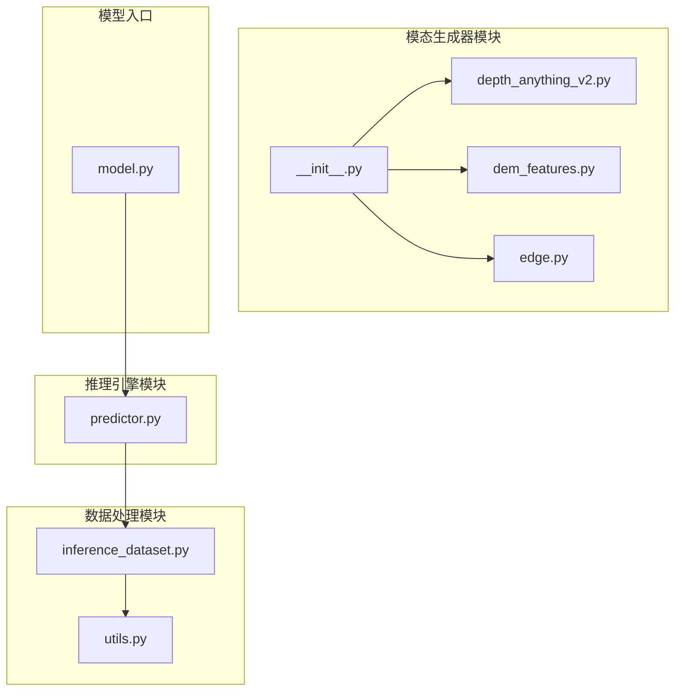
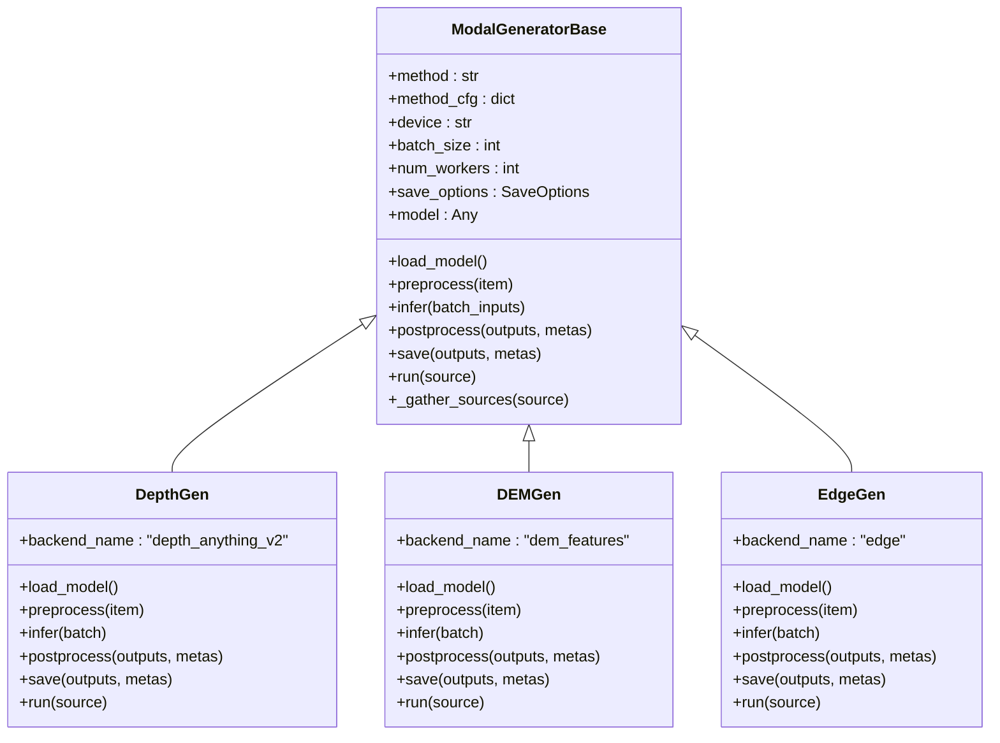
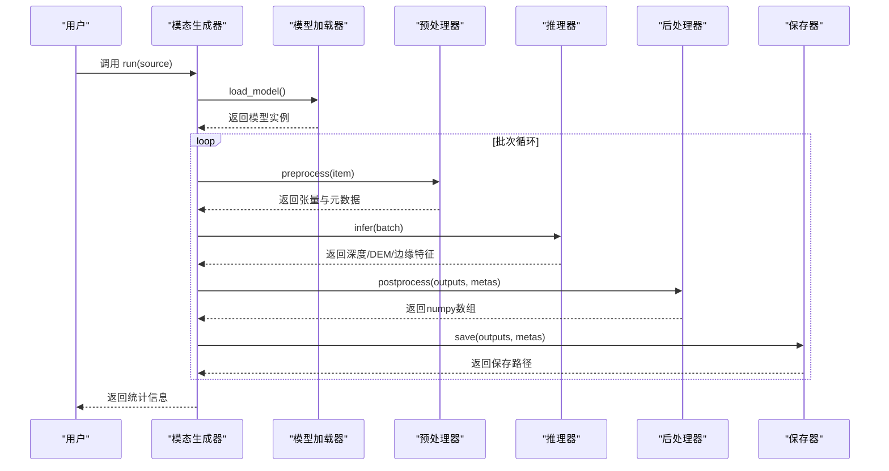
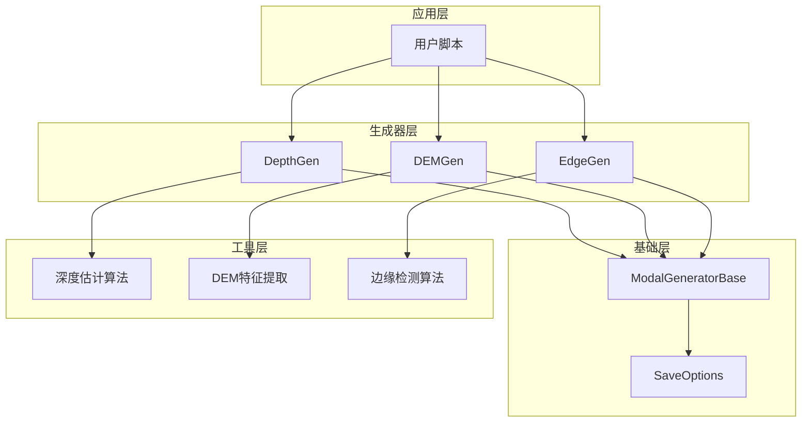
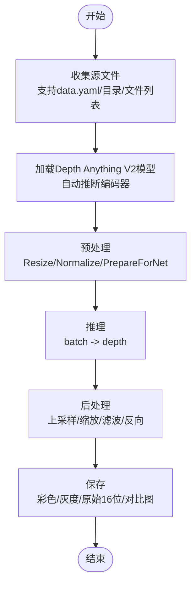
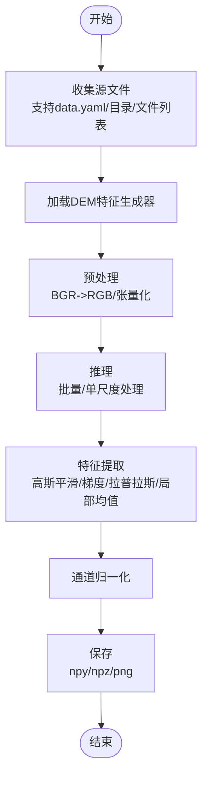
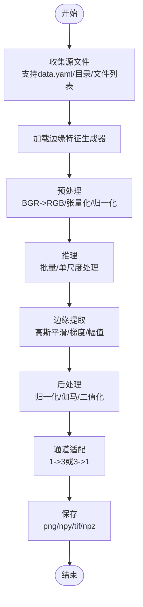
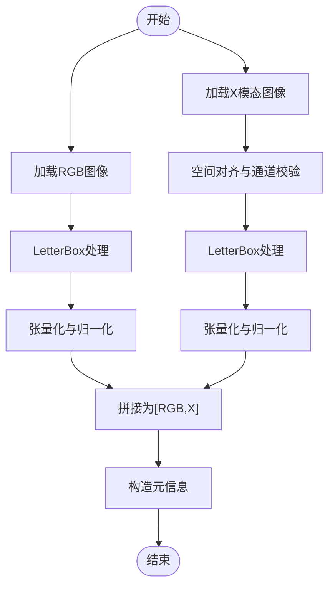
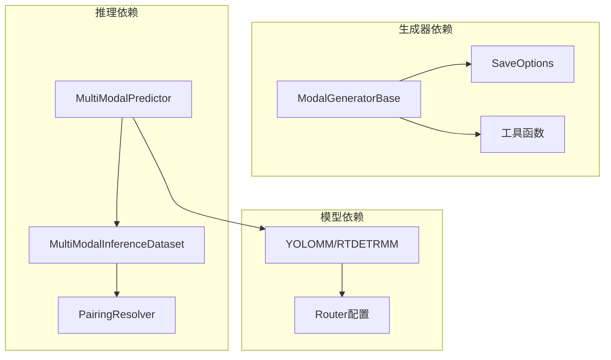

# 自定义模态生成器开发

<cite>
**本文档引用的文件**
- [depthGen.py](file://depthGen.py)
- [edgeGen.py](file://edgeGen.py)
- [ultralytics\nn\mm\generators\__init__.py](file://ultralytics\nn\mm\generators\__init__.py)
- [ultralytics\nn\mm\generators\depth_anything_v2.py](file://ultralytics\nn\mm\generators\depth_anything_v2.py)
- [ultralytics\nn\mm\generators\dem_features.py](file://ultralytics\nn\mm\generators\dem_features.py)
- [ultralytics\nn\mm\generators\edge.py](file://ultralytics\nn\mm\generators\edge.py)
- [ultralytics\nn\mm\generators\base.py](file://ultralytics\nn\mm\generators\base.py)
- [ultralytics\data\multimodal\inference_dataset.py](file://ultralytics\data\multimodal\inference_dataset.py)
- [ultralytics\data\multimodal\utils.py](file://ultralytics\data\multimodal\utils.py)
- [ultralytics\engine\multimodal\predictor.py](file://ultralytics\engine\multimodal\predictor.py)
- [ultralytics\models\yolo\model.py](file://ultralytics\models\yolo\model.py)
</cite>

## 目录
1. [简介](#简介)
2. [项目结构](#项目结构)
3. [核心组件](#核心组件)
4. [架构概览](#架构概览)
5. [详细组件分析](#详细组件分析)
6. [依赖关系分析](#依赖关系分析)
7. [性能考虑](#性能考虑)
8. [故障排除指南](#故障排除指南)
9. [结论](#结论)

## 简介

本文档面向希望开发自定义模态生成器的开发者，系统性介绍如何基于现有框架创建新的模态生成器，包括深度图生成器、DEM数据生成器、边缘特征提取器等。文档重点阐述模态生成器的架构设计原则、基类继承模式、接口规范、数据流处理流程，并提供具体的代码实现示例路径，涵盖深度估计算法、地理信息处理、边缘检测技术等。

## 项目结构

该项目采用模块化设计，模态生成器位于 `ultralytics\nn\mm\generators` 目录下，配套的数据处理与推理引擎位于 `ultralytics\data\multimodal` 和 `ultralytics\engine\multimodal` 目录中。

**图表来源**
- [ultralytics\nn\mm\generators\__init__.py:1-15](file://ultralytics\nn\mm\generators\__init__.py#L1-L15)
- [ultralytics\nn\mm\generators\depth_anything_v2.py:1-520](file://ultralytics\nn\mm\generators\depth_anything_v2.py#L1-L520)
- [ultralytics\nn\mm\generators\dem_features.py:1-470](file://ultralytics\nn\mm\generators\dem_features.py#L1-L470)
- [ultralytics\nn\mm\generators\edge.py:1-506](file://ultralytics\nn\mm\generators\edge.py#L1-L506)
- [ultralytics\data\multimodal\inference_dataset.py:1-252](file://ultralytics\data\multimodal\inference_dataset.py#L1-L252)
- [ultralytics\data\multimodal\utils.py:1-180](file://ultralytics\data\multimodal\utils.py#L1-L180)
- [ultralytics\engine\multimodal\predictor.py:1-494](file://ultralytics\engine\multimodal\predictor.py#L1-L494)
- [ultralytics\models\yolo\model.py:1-800](file://ultralytics\models\yolo\model.py#L1-L800)

**章节来源**
- [ultralytics\nn\mm\generators\__init__.py:1-15](file://ultralytics\nn\mm\generators\__init__.py#L1-L15)
- [ultralytics\data\multimodal\inference_dataset.py:1-252](file://ultralytics\data\multimodal\inference_dataset.py#L1-L252)
- [ultralytics\engine\multimodal\predictor.py:1-494](file://ultralytics\engine\multimodal\predictor.py#L1-L494)

## 核心组件

### 模态生成器基类架构

所有模态生成器均继承自统一的基类，遵循相同的生命周期：源收集 → 模型加载 → 预处理 → 推理 → 后处理 → 保存。基类提供了批处理、设备管理、保存选项等通用能力。

**图表来源**
- [ultralytics\nn\mm\generators\depth_anything_v2.py:72-520](file://ultralytics\nn\mm\generators\depth_anything_v2.py#L72-L520)
- [ultralytics\nn\mm\generators\dem_features.py:212-470](file://ultralytics\nn\mm\generators\dem_features.py#L212-L470)
- [ultralytics\nn\mm\generators\edge.py:190-506](file://ultralytics\nn\mm\generators\edge.py#L190-L506)

### 数据处理与推理管道

多模态推理引擎负责从模型读取路由器配置，构建数据集并执行流式推理，支持YOLO与RTDETR两种后处理路径。

**图表来源**
- [ultralytics\nn\mm\generators\depth_anything_v2.py:369-516](file://ultralytics\nn\mm\generators\depth_anything_v2.py#L369-L516)
- [ultralytics\nn\mm\generators\dem_features.py:393-466](file://ultralytics\nn\mm\generators\dem_features.py#L393-L466)
- [ultralytics\nn\mm\generators\edge.py:408-502](file://ultralytics\nn\mm\generators\edge.py#L408-L502)

**章节来源**
- [ultralytics\nn\mm\generators\depth_anything_v2.py:72-520](file://ultralytics\nn\mm\generators\depth_anything_v2.py#L72-L520)
- [ultralytics\nn\mm\generators\dem_features.py:212-470](file://ultralytics\nn\mm\generators\dem_features.py#L212-L470)
- [ultralytics\nn\mm\generators\edge.py:190-506](file://ultralytics\nn\mm\generators\edge.py#L190-L506)

## 架构概览

模态生成器体系遵循“统一基类 + 后端实现”的设计模式，所有生成器共享相同的生命周期与接口规范，便于扩展新的模态类型。

**图表来源**
- [ultralytics\nn\mm\generators\__init__.py:1-15](file://ultralytics\nn\mm\generators\__init__.py#L1-L15)
- [ultralytics\nn\mm\generators\depth_anything_v2.py:72-520](file://ultralytics\nn\mm\generators\depth_anything_v2.py#L72-L520)
- [ultralytics\nn\mm\generators\dem_features.py:212-470](file://ultralytics\nn\mm\generators\dem_features.py#L212-L470)
- [ultralytics\nn\mm\generators\edge.py:190-506](file://ultralytics\nn\mm\generators\edge.py#L190-L506)

## 详细组件分析

### 深度图生成器（DepthGen）

深度图生成器基于Depth Anything V2实现，支持多种编码器（vits/vitb/vitl/vitg），提供灵活的预处理与后处理选项。

**图表来源**
- [ultralytics\nn\mm\generators\depth_anything_v2.py:186-516](file://ultralytics\nn\mm\generators\depth_anything_v2.py#L186-L516)

**章节来源**
- [ultralytics\nn\mm\generators\depth_anything_v2.py:72-520](file://ultralytics\nn\mm\generators\depth_anything_v2.py#L72-L520)
- [depthGen.py:1-24](file://depthGen.py#L1-L24)

### DEM特征生成器（DEMGen）

DEM生成器实现六通道地理特征提取，包括高程、坡度、坡向、曲率、粗糙度和局部高度差。

**图表来源**
- [ultralytics\nn\mm\generators\dem_features.py:300-466](file://ultralytics\nn\mm\generators\dem_features.py#L300-L466)

**章节来源**
- [ultralytics\nn\mm\generators\dem_features.py:212-470](file://ultralytics\nn\mm\generators\dem_features.py#L212-L470)

### 边缘特征生成器（EdgeGen）

边缘生成器提供单通道或三通道边缘强度输出，支持Sobel/Scharr算子、伽马变换、二值化等选项。

**图表来源**
- [ultralytics\nn\mm\generators\edge.py:295-502](file://ultralytics\nn\mm\generators\edge.py#L295-L502)

**章节来源**
- [ultralytics\nn\mm\generators\edge.py:190-506](file://ultralytics\nn\mm\generators\edge.py#L190-L506)
- [edgeGen.py:1-46](file://edgeGen.py#L1-L46)

### 数据加载与预处理

多模态推理数据集负责RGB与X模态的对齐、通道校验与统一预处理。

**图表来源**
- [ultralytics\data\multimodal\inference_dataset.py:94-183](file://ultralytics\data\multimodal\inference_dataset.py#L94-L183)
- [ultralytics\data\multimodal\utils.py:13-179](file://ultralytics\data\multimodal\utils.py#L13-L179)

**章节来源**
- [ultralytics\data\multimodal\inference_dataset.py:16-252](file://ultralytics\data\multimodal\inference_dataset.py#L16-L252)
- [ultralytics\data\multimodal\utils.py:1-180](file://ultralytics\data\multimodal\utils.py#L1-L180)

## 依赖关系分析

模态生成器与推理引擎之间通过统一的基类接口耦合，数据处理模块提供严格的输入契约与预处理保障。

**图表来源**
- [ultralytics\nn\mm\generators\depth_anything_v2.py:25-25](file://ultralytics\nn\mm\generators\depth_anything_v2.py#L25-L25)
- [ultralytics\engine\multimodal\predictor.py:16-98](file://ultralytics\engine\multimodal\predictor.py#L16-L98)
- [ultralytics\models\yolo\model.py:456-741](file://ultralytics\models\yolo\model.py#L456-L741)

**章节来源**
- [ultralytics\engine\multimodal\predictor.py:1-494](file://ultralytics\engine\multimodal\predictor.py#L1-L494)
- [ultralytics\models\yolo\model.py:456-741](file://ultralytics\models\yolo\model.py#L456-L741)

## 性能考虑

- 批处理优化：合理设置batch_size与num_workers，充分利用GPU并行能力
- 内存管理：及时释放中间张量，避免内存泄漏
- 预处理加速：使用向量化操作与GPU计算
- 保存策略：根据需求选择合适的保存格式（uint8/png vs uint16/tif）
- 设备选择：优先使用CUDA设备，确保显存充足

## 故障排除指南

### 常见问题与解决方案

1. **模型加载失败**
   - 检查权重文件路径与编码器兼容性
   - 确认Depth-Anything-V2仓库完整存在

2. **通道数不匹配**
   - 使用align_and_validate_x进行空间对齐与通道校验
   - 支持1↔3显式转换与严格Xch校验

3. **推理结果异常**
   - 检查预处理参数（输入尺寸、归一化范围）
   - 验证后处理流程（插值、滤波、反向）

4. **保存路径问题**
   - 确认输出目录权限与磁盘空间
   - 使用相对路径时注意工作目录

**章节来源**
- [ultralytics\nn\mm\generators\depth_anything_v2.py:263-346](file://ultralytics\nn\mm\generators\depth_anything_v2.py#L263-L346)
- [ultralytics\data\multimodal\utils.py:13-83](file://ultralytics\data\multimodal\utils.py#L13-L83)
- [ultralytics\engine\multimodal\predictor.py:163-243](file://ultralytics\engine\multimodal\predictor.py#L163-L243)

## 结论

通过统一的基类架构与标准化的生命周期，该模态生成器体系为开发者提供了清晰的扩展路径。深度图、DEM特征与边缘检测三大生成器展示了不同的算法实现思路，开发者可以基于此模式快速开发新的模态生成器。建议在扩展时重点关注数据契约、算法鲁棒性与性能优化，确保生成的模态数据能够稳定服务于多模态下游任务。