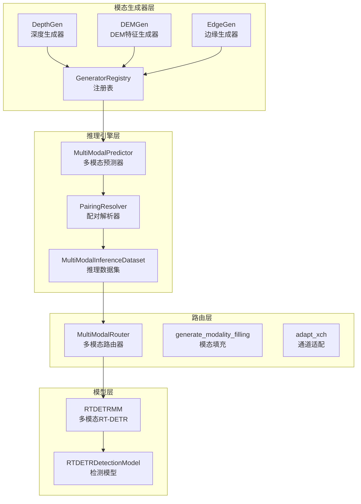
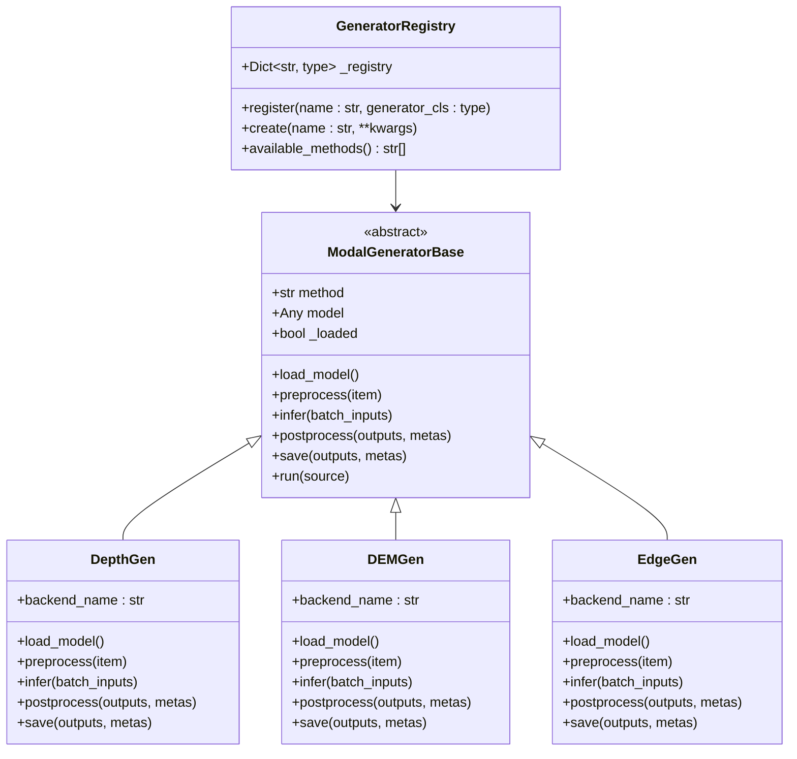
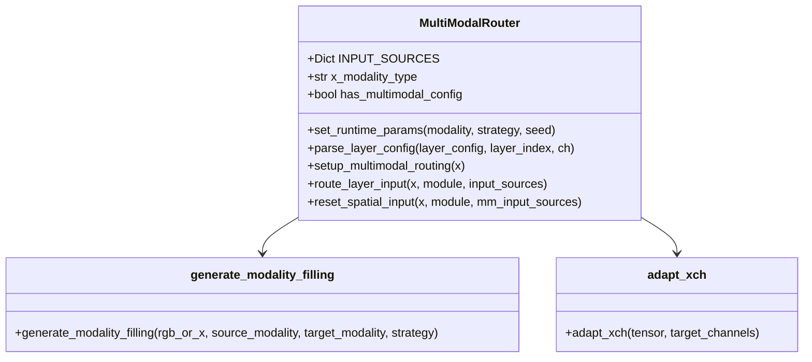
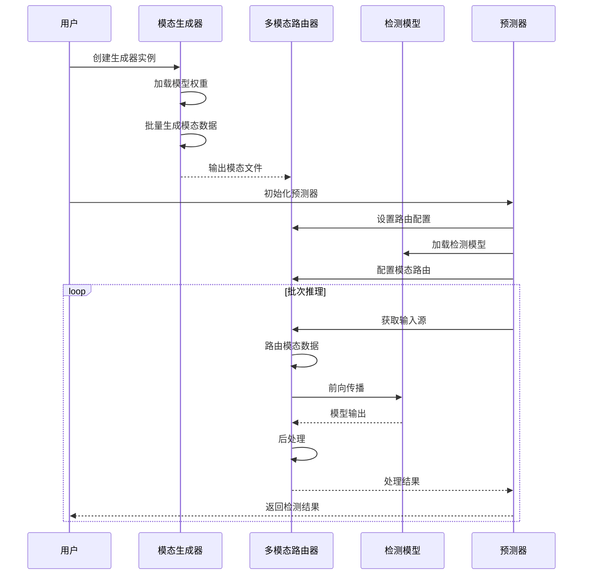
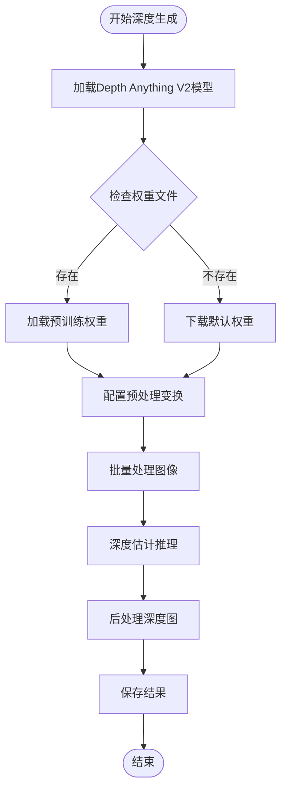
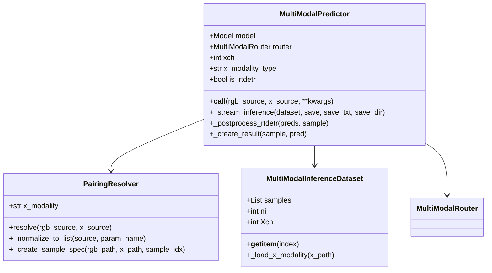
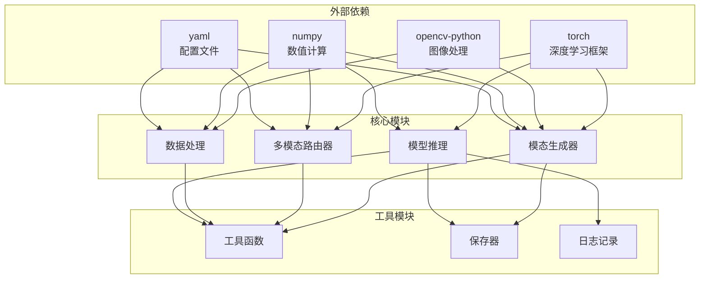

# 自定义模态集成与测试

<cite>
**本文档引用的文件**
- [model.py](file://ultralytics/models/rtdetrmm/model.py)
- [predictor.py](file://ultralytics/engine/multimodal/predictor.py)
- [generators/__init__.py](file://ultralytics/nn/mm/generators/__init__.py)
- [base.py](file://ultralytics/nn/mm/generators/base.py)
- [depth_anything_v2.py](file://ultralytics/nn/mm/generators/depth_anything_v2.py)
- [dem_features.py](file://ultralytics/nn/mm/generators/dem_features.py)
- [edge.py](file://ultralytics/nn/mm/generators/edge.py)
- [router.py](file://ultralytics/nn/mm/router.py)
- [inference_dataset.py](file://ultralytics/data/multimodal/inference_dataset.py)
- [pairing.py](file://ultralytics/data/multimodal/pairing.py)
- [README.md](file://ultralytics/cfg/models/README.md)
</cite>

## 目录
1. [简介](#简介)
2. [项目结构](#项目结构)
3. [核心组件](#核心组件)
4. [架构概览](#架构概览)
5. [详细组件分析](#详细组件分析)
6. [依赖关系分析](#依赖关系分析)
7. [性能考虑](#性能考虑)
8. [故障排除指南](#故障排除指南)
9. [结论](#结论)
10. [附录](#附录)

## 简介

本指南详细介绍了如何将新的模态生成器集成到现有的多模态系统中。该系统基于Ultralytics框架，支持RGB和X模态的多模态推理，包括深度学习模型的训练、验证和推理流程。

系统的核心特性包括：
- 支持多种模态生成器（深度、DEM特征、边缘检测）
- 灵活的路由机制，支持RGB、X和双模态输入
- 完整的推理流水线，从数据加载到结果保存
- 可扩展的注册表机制，便于添加新的模态生成器

## 项目结构

多模态系统采用模块化设计，主要分为以下几个核心部分：

**图表来源**
- [generators/__init__.py:1-15](file://ultralytics/nn/mm/generators/__init__.py#L1-L15)
- [predictor.py:16-494](file://ultralytics/engine/multimodal/predictor.py#L16-L494)
- [router.py:11-471](file://ultralytics/nn/mm/router.py#L11-L471)

**章节来源**
- [generators/__init__.py:1-15](file://ultralytics/nn/mm/generators/__init__.py#L1-L15)
- [README.md:1-66](file://ultralytics/cfg/models/README.md#L1-L66)

## 核心组件

### 模态生成器注册表

系统提供了统一的模态生成器注册表机制，支持动态注册和创建不同的模态生成器：

**图表来源**
- [base.py:51-71](file://ultralytics/nn/mm/generators/base.py#L51-L71)
- [base.py:77-137](file://ultralytics/nn/mm/generators/base.py#L77-L137)
- [depth_anything_v2.py:72-116](file://ultralytics/nn/mm/generators/depth_anything_v2.py#L72-L116)
- [dem_features.py:212-268](file://ultralytics/nn/mm/generators/dem_features.py#L212-L268)
- [edge.py:190-262](file://ultralytics/nn/mm/generators/edge.py#L190-L262)

### 多模态路由器

路由器是系统的核心组件，负责管理RGB和X模态之间的数据路由：

**图表来源**
- [router.py:11-63](file://ultralytics/nn/mm/router.py#L11-L63)
- [router.py:157-240](file://ultralytics/nn/mm/router.py#L157-L240)
- [router.py:242-318](file://ultralytics/nn/mm/router.py#L242-L318)

**章节来源**
- [router.py:11-471](file://ultralytics/nn/mm/router.py#L11-L471)

## 架构概览

系统采用分层架构设计，从底层的数据加载到上层的推理服务形成完整的处理链路：

**图表来源**
- [predictor.py:99-143](file://ultralytics/engine/multimodal/predictor.py#L99-L143)
- [router.py:157-240](file://ultralytics/nn/mm/router.py#L157-L240)
- [model.py:25-57](file://ultralytics/models/rtdetrmm/model.py#L25-L57)

## 详细组件分析

### 模态生成器实现

#### 深度生成器（DepthGen）

深度生成器基于Depth Anything V2架构，提供高质量的深度估计能力：

**图表来源**
- [depth_anything_v2.py:263-347](file://ultralytics/nn/mm/generators/depth_anything_v2.py#L263-L347)
- [depth_anything_v2.py:369-413](file://ultralytics/nn/mm/generators/depth_anything_v2.py#L369-L413)

#### DEM特征生成器（DEMGen）

DEM特征生成器计算地形相关的6通道特征：

| 通道 | 特征含义 | 用途 |
|------|----------|------|
| 1 | 伪高程 | 地形高度表示 |
| 2 | 梯度幅值 | 坡度信息 |
| 3 | 梯度方向 | 方位角信息 |
| 4 | 拉普拉斯二阶导 | 凹凸性分析 |
| 5 | 局部标准差 | 粗糙度测量 |
| 6 | 高通局部差分 | 细节增强 |

**章节来源**
- [dem_features.py:111-210](file://ultralytics/nn/mm/generators/dem_features.py#L111-L210)
- [dem_features.py:367-405](file://ultralytics/nn/mm/generators/dem_features.py#L367-L405)

### 推理引擎组件

#### 多模态预测器

预测器负责协调整个推理流程，包括数据加载、模型推理和结果后处理：

**图表来源**
- [predictor.py:16-98](file://ultralytics/engine/multimodal/predictor.py#L16-L98)
- [pairing.py:11-64](file://ultralytics/data/multimodal/pairing.py#L11-L64)
- [inference_dataset.py:16-92](file://ultralytics/data/multimodal/inference_dataset.py#L16-L92)

**章节来源**
- [predictor.py:16-494](file://ultralytics/engine/multimodal/predictor.py#L16-L494)
- [pairing.py:11-203](file://ultralytics/data/multimodal/pairing.py#L11-L203)
- [inference_dataset.py:16-252](file://ultralytics/data/multimodal/inference_dataset.py#L16-L252)

## 依赖关系分析

系统采用松耦合的设计，各组件之间通过清晰的接口进行交互：

**图表来源**
- [base.py:18-21](file://ultralytics/nn/mm/generators/base.py#L18-L21)
- [depth_anything_v2.py:17-25](file://ultralytics/nn/mm/generators/depth_anything_v2.py#L17-L25)
- [router.py:5-8](file://ultralytics/nn/mm/router.py#L5-L8)

**章节来源**
- [base.py:1-225](file://ultralytics/nn/mm/generators/base.py#L1-L225)
- [router.py:1-471](file://ultralytics/nn/mm/router.py#L1-L471)

## 性能考虑

### 计算优化策略

1. **批处理优化**：模态生成器支持批量处理，减少GPU内存碎片化
2. **零拷贝路由**：路由器使用零拷贝技术，避免不必要的数据复制
3. **内存管理**：合理设置batch_size和num_workers参数
4. **设备选择**：自动选择最优设备（CUDA优先）

### 内存使用优化

| 组件 | 内存优化策略 | 预期收益 |
|------|-------------|---------|
| 模态生成器 | 批处理、异步I/O | 减少内存峰值 |
| 路由器 | 零拷贝视图 | 降低内存占用 |
| 推理引擎 | 流式处理 | 减少缓存需求 |
| 数据集 | 按需加载 | 控制内存使用 |

## 故障排除指南

### 常见问题及解决方案

#### 模态生成器问题

**问题1：深度生成器无法加载模型**
- 检查Depth-Anything-V2目录是否存在
- 验证权重文件完整性
- 确认Python路径包含ref目录

**问题2：DEM特征生成器报通道数错误**
- 确认输入图像格式支持
- 检查图像数据类型
- 验证通道数配置

**问题3：边缘生成器输出格式异常**
- 检查保存格式配置
- 验证输出通道数设置
- 确认图像编码参数

#### 推理引擎问题

**问题4：多模态推理失败**
- 检查RGB和X模态文件数量匹配
- 验证文件路径有效性
- 确认模态类型配置正确

**问题5：路由器路由错误**
- 检查模型配置中的5th字段
- 验证模态标识符
- 确认通道数配置

**章节来源**
- [depth_anything_v2.py:38-64](file://ultralytics/nn/mm/generators/depth_anything_v2.py#L38-L64)
- [dem_features.py:300-364](file://ultralytics/nn/mm/generators/dem_features.py#L300-L364)
- [edge.py:295-360](file://ultralytics/nn/mm/generators/edge.py#L295-L360)

## 结论

该多模态系统提供了完整的模态生成和推理解决方案。通过模块化的架构设计，系统具有良好的可扩展性和维护性。新的模态生成器可以通过简单的注册机制无缝集成到现有系统中。

关键优势包括：
- 灵活的模态生成器架构
- 高效的多模态路由机制  
- 完善的推理流水线
- 良好的性能表现
- 详细的错误处理和调试支持

## 附录

### 开发流程示例

#### 步骤1：创建模态生成器类

1. 继承`ModalGeneratorBase`抽象基类
2. 实现必需的抽象方法
3. 定义生成器配置参数
4. 实现`run`方法

#### 步骤2：注册生成器

1. 在`generators/__init__.py`中导入新生成器
2. 将生成器添加到`__all__`列表
3. 在注册表中注册新生成器

#### 步骤3：配置模型

1. 更新模型配置文件
2. 配置路由参数
3. 设置模态通道数

#### 步骤4：测试集成

1. 运行单元测试
2. 执行集成测试
3. 进行性能基准测试

### 测试方法

#### 单元测试
- 模态生成器功能测试
- 路由器逻辑测试
- 数据加载器测试

#### 集成测试
- 端到端推理测试
- 模态生成器集成测试
- 性能回归测试

#### 性能基准测试
- 推理速度测试
- 内存使用测试
- 批处理效率测试