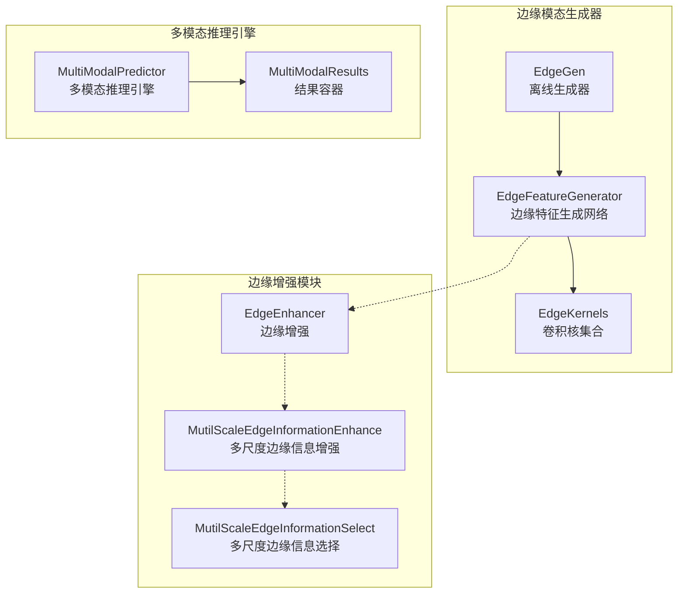
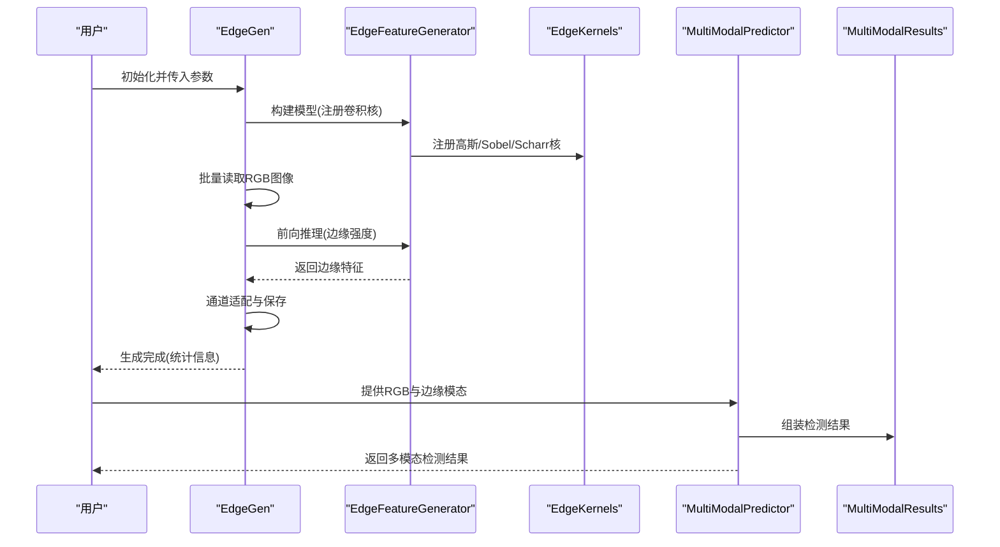
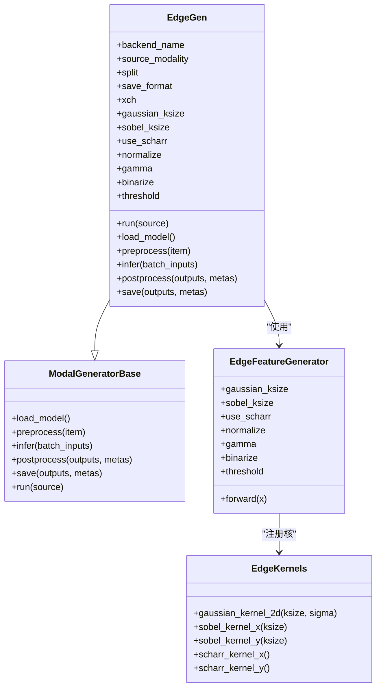
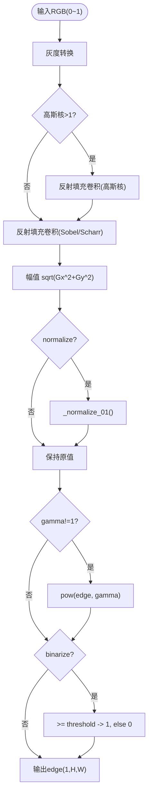
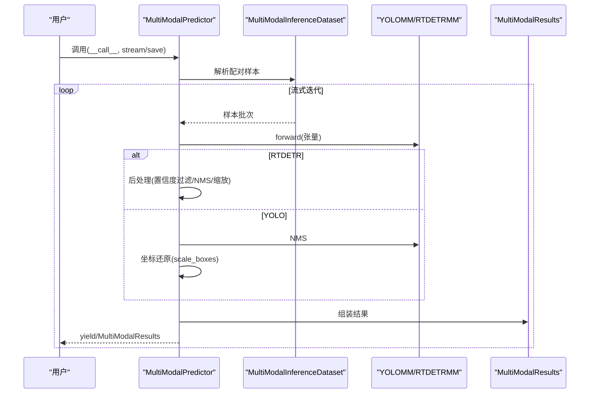
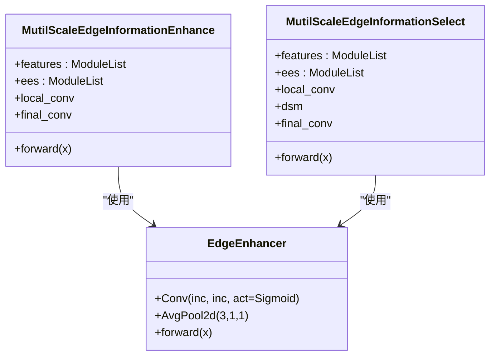
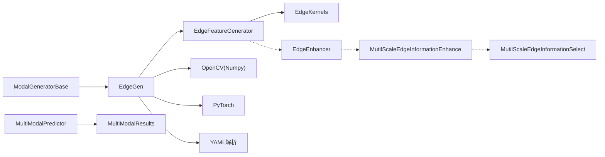

# 边缘模态生成器

<cite>
**本文档引用的文件**
- [edgeGen.py](file://edgeGen.py)
- [edge.py](file://ultralytics/nn/mm/generators/edge.py)
- [base.py](file://ultralytics/nn/mm/generators/base.py)
- [edge_msie.py](file://ultralytics/nn/public/edge_msie.py)
- [self_modal_generator.py](file://ultralytics/models/yolo/multimodal/self_modal_generator.py)
- [predictor.py](file://ultralytics/engine/multimodal/predictor.py)
- [results.py](file://ultralytics/engine/multimodal/results.py)
</cite>

## 目录
1. [简介](#简介)
2. [项目结构](#项目结构)
3. [核心组件](#核心组件)
4. [架构总览](#架构总览)
5. [详细组件分析](#详细组件分析)
6. [依赖关系分析](#依赖关系分析)
7. [性能考虑](#性能考虑)
8. [故障排查指南](#故障排查指南)
9. [结论](#结论)
10. [附录](#附录)

## 简介
本指南面向边缘模态生成器的开发者与使用者，系统讲解基于深度学习与传统图像处理相结合的边缘特征提取与生成流程。文档涵盖以下要点：
- 经典边缘检测算法实现：Canny、Sobel、Scharr、Laplacian等
- 边缘特征的预处理、增强与后处理技术
- 边缘生成器的代码实现示例与最佳实践
- 多模态融合中边缘模态的作用与优势
- 边缘质量评估方法、参数调优技巧与常见问题解决方案

## 项目结构
本仓库围绕“多模态”目标检测体系，提供边缘模态生成器与配套的多模态推理引擎。边缘模态生成器位于多模态生成器子模块中，采用统一的离线生成框架，支持批量处理与多种保存格式。

**图表来源**
- [edge.py:35-506](file://ultralytics/nn/mm/generators/edge.py#L35-L506)
- [base.py:77-225](file://ultralytics/nn/mm/generators/base.py#L77-L225)
- [edge_msie.py:14-76](file://ultralytics/nn/public/edge_msie.py#L14-L76)
- [predictor.py:16-494](file://ultralytics/engine/multimodal/predictor.py#L16-L494)
- [results.py:14-357](file://ultralytics/engine/multimodal/results.py#L14-L357)

**章节来源**
- [edgeGen.py:1-46](file://edgeGen.py#L1-L46)
- [edge.py:1-506](file://ultralytics/nn/mm/generators/edge.py#L1-L506)
- [base.py:1-225](file://ultralytics/nn/mm/generators/base.py#L1-L225)
- [edge_msie.py:1-76](file://ultralytics/nn/public/edge_msie.py#L1-L76)
- [predictor.py:1-494](file://ultralytics/engine/multimodal/predictor.py#L1-L494)
- [results.py:1-357](file://ultralytics/engine/multimodal/results.py#L1-L357)

## 核心组件
- 边缘生成器（EdgeGen）：统一的离线生成器，支持从RGB图像生成边缘模态，提供多种保存格式与通道数配置。
- 边缘特征生成网络（EdgeFeatureGenerator）：基于卷积核的边缘强度计算，支持Sobel/Scharr平滑与伽马校正、二值化等后处理。
- 边缘卷积核（EdgeKernels）：提供高斯平滑核、Sobel核族、Scharr核族等。
- 多模态推理引擎（MultiModalPredictor）：对接生成的边缘模态，完成多模态目标检测推理。
- 边缘增强模块（EdgeEnhancer、MutilScaleEdgeInformationEnhance、MutilScaleEdgeInformationSelect）：在特征层面进一步增强边缘信息，服务于多尺度融合。

**章节来源**
- [edge.py:86-506](file://ultralytics/nn/mm/generators/edge.py#L86-L506)
- [base.py:77-225](file://ultralytics/nn/mm/generators/base.py#L77-L225)
- [edge_msie.py:14-76](file://ultralytics/nn/public/edge_msie.py#L14-L76)
- [predictor.py:16-494](file://ultralytics/engine/multimodal/predictor.py#L16-L494)

## 架构总览
下图展示了边缘模态生成器在整体多模态系统中的位置与交互关系。

**图表来源**
- [edge.py:190-506](file://ultralytics/nn/mm/generators/edge.py#L190-L506)
- [base.py:174-225](file://ultralytics/nn/mm/generators/base.py#L174-L225)
- [predictor.py:99-244](file://ultralytics/engine/multimodal/predictor.py#L99-L244)
- [results.py:30-131](file://ultralytics/engine/multimodal/results.py#L30-L131)

## 详细组件分析

### 边缘生成器（EdgeGen）
- 功能职责
  - 从data.yaml或直接路径收集RGB图像
  - 调用EdgeFeatureGenerator进行前向推理
  - 通道适配（1通道/3通道）
  - 多格式保存（PNG/NPY/TIF/NPZ）
- 关键参数
  - 源模态选择、设备、批大小、工作进程
  - 保存目录、结构保留、覆盖策略、分割切分
  - 输出通道数（xch）、保存格式
  - 算法参数：高斯核大小、Sobel核大小、是否使用Scharr、归一化、伽马校正、二值化与阈值
- 处理流程
  - gather_sources：解析YAML或路径，收集图像
  - load_model：构建EdgeFeatureGenerator
  - preprocess：读取BGR->RGB，归一化到[0,1]
  - infer/infer：统一或逐张推理，通道适配
  - postprocess/save：后处理与保存

**图表来源**
- [edge.py:86-506](file://ultralytics/nn/mm/generators/edge.py#L86-L506)
- [base.py:77-225](file://ultralytics/nn/mm/generators/base.py#L77-L225)

**章节来源**
- [edge.py:190-506](file://ultralytics/nn/mm/generators/edge.py#L190-L506)
- [base.py:77-225](file://ultralytics/nn/mm/generators/base.py#L77-L225)

### 边缘特征生成网络（EdgeFeatureGenerator）
- 输入约定：0~1范围的RGB张量
- 预处理：灰度转换（RGB/RGBA/灰度自适应）
- 平滑：高斯核（反射填充）
- 梯度：Sobel或Scharr核（反射填充卷积）
- 强度：幅值sqrt(Gx^2 + Gy^2)
- 后处理：可选归一化至[0,1]、伽马校正、二值化

**图表来源**
- [edge.py:86-188](file://ultralytics/nn/mm/generators/edge.py#L86-L188)

**章节来源**
- [edge.py:86-188](file://ultralytics/nn/mm/generators/edge.py#L86-L188)

### 边缘卷积核（EdgeKernels）
- 高斯核：支持ksize=3/5等，sigma自动推导
- Sobel核：支持ksize=3/5，X/Y方向
- Scharr核：X/Y方向
- 反射填充卷积：保证边界一致性

**章节来源**
- [edge.py:35-84](file://ultralytics/nn/mm/generators/edge.py#L35-L84)

### 多模态推理引擎（MultiModalPredictor）
- 负责从模型读取Router配置，构建数据集并流式推理
- 支持YOLO与RTDETR两类模型的不同后处理路径
- 输出MultiModalResults，支持可视化与保存

**图表来源**
- [predictor.py:99-244](file://ultralytics/engine/multimodal/predictor.py#L99-L244)
- [results.py:436-464](file://ultralytics/engine/multimodal/results.py#L436-L464)

**章节来源**
- [predictor.py:16-494](file://ultralytics/engine/multimodal/predictor.py#L16-L494)
- [results.py:14-357](file://ultralytics/engine/multimodal/results.py#L14-L357)

### 边缘增强模块（EdgeEnhancer、MutilScaleEdgeInformationEnhance、MutilScaleEdgeInformationSelect）
- EdgeEnhancer：局部池化差分得到边缘，经Sigmoid门控后残差融合
- MutilScaleEdgeInformationEnhance：多尺度自适应池化+卷积提取特征，与局部特征拼接后经最终卷积
- MutilScaleEdgeInformationSelect：在增强基础上引入DualDomainSelectionMechanism进行选择性融合

**图表来源**
- [edge_msie.py:14-76](file://ultralytics/nn/public/edge_msie.py#L14-L76)

**章节来源**
- [edge_msie.py:14-76](file://ultralytics/nn/public/edge_msie.py#L14-L76)

### 经典边缘检测算法实现与对比
- Sobel算子：通过水平/垂直Sobel核计算梯度，幅值作为边缘强度
- Scharr算子：相比Sobel对中心像素权重更精确，边缘更锐利
- Canny边缘检测：高斯平滑->梯度计算->非极大值抑制->双阈值与滞后连接
- Laplacian算子：二阶导数，对噪声敏感，常配合高斯平滑使用

上述算法在本项目中既有基于卷积核的实现（Sobel/Scharr/Laplacian），也有自包含的简化Canny流程（SelfModalGenerator）。

**章节来源**
- [edge.py:50-84](file://ultralytics/nn/mm/generators/edge.py#L50-L84)
- [self_modal_generator.py:238-296](file://ultralytics/models/yolo/multimodal/self_modal_generator.py#L238-L296)

## 依赖关系分析
- EdgeGen继承自ModalGeneratorBase，遵循统一的离线生成接口
- EdgeFeatureGenerator内部注册EdgeKernels，使用反射填充卷积保证边界一致性
- 多模态推理引擎通过PairingResolver与MultiModalInferenceDataset组织样本，支持流式推理
- 边缘增强模块作为公共组件，可被多尺度融合策略复用

**图表来源**
- [base.py:77-225](file://ultralytics/nn/mm/generators/base.py#L77-L225)
- [edge.py:190-506](file://ultralytics/nn/mm/generators/edge.py#L190-L506)
- [predictor.py:16-494](file://ultralytics/engine/multimodal/predictor.py#L16-L494)
- [results.py:14-357](file://ultralytics/engine/multimodal/results.py#L14-L357)
- [edge_msie.py:14-76](file://ultralytics/nn/public/edge_msie.py#L14-L76)

**章节来源**
- [base.py:77-225](file://ultralytics/nn/mm/generators/base.py#L77-L225)
- [edge.py:190-506](file://ultralytics/nn/mm/generators/edge.py#L190-L506)
- [predictor.py:16-494](file://ultralytics/engine/multimodal/predictor.py#L16-L494)
- [results.py:14-357](file://ultralytics/engine/multimodal/results.py#L14-L357)
- [edge_msie.py:14-76](file://ultralytics/nn/public/edge_msie.py#L14-L76)

## 性能考虑
- 批处理与设备选择：合理设置batch_size与device，充分利用GPU并行
- 输入尺寸与通道：统一输入尺寸，避免频繁形状变化；通道适配采用确定性线性投影
- 卷积边界：反射填充减少边界伪影，提高边缘连续性
- 伽马校正与二值化：在归一化后进行，避免数值溢出；阈值需结合任务分布调优
- 保存格式：PNG适合人类查看，TIFF可保留更高动态范围，NPZ压缩存储便于大规模生成
- 多尺度增强：在特征层面进行多尺度聚合与选择，兼顾细节与鲁棒性

[本节为通用指导，无需特定文件引用]

## 故障排查指南
- 无法读取图像：检查路径是否存在、图像格式是否受支持
- 设备不可用：确认CUDA可用性与驱动版本，必要时切换CPU
- 归一化异常：确保输入为0~1范围；若非此范围，先做clamp或标准化
- 通道不匹配：xch=1时输出单通道，xch=3时输出三通道；注意保存格式对通道的要求
- 保存失败：检查保存目录权限与磁盘空间；开启覆盖策略或调整输出路径
- 多模态推理错误：确认Router配置与X模态通道数一致；检查样本配对与路径

**章节来源**
- [edge.py:376-502](file://ultralytics/nn/mm/generators/edge.py#L376-L502)
- [predictor.py:16-98](file://ultralytics/engine/multimodal/predictor.py#L16-L98)

## 结论
本指南系统梳理了边缘模态生成器的实现与应用，结合经典边缘检测算法与现代多模态融合技术，提供了从离线生成到推理验证的完整链路。通过合理的参数调优与后处理策略，可在准确性和性能之间取得良好平衡，并为多模态目标检测提供稳定、可复现的边缘模态支撑。

[本节为总结性内容，无需特定文件引用]

## 附录

### 边缘质量评估方法
- 视觉评估：对比原始RGB与生成边缘，观察边缘连续性与噪声情况
- 数值指标：可采用边缘召回率、精确率与F1（需与人工标注或高质量边缘对比）
- 一致性评估：在相同场景下多次生成，评估结果稳定性
- 任务相关性：在下游检测任务中评估边缘模态带来的性能增益

[本节为通用指导，无需特定文件引用]

### 参数调优技巧
- 高斯核大小：图像噪声较大时增大ksize并适当增大sigma
- Sobel核大小：ksize=3适用于一般场景；ksize=5对复杂边缘更敏感
- Scharr替代Sobel：在边缘锐利度要求较高时优先考虑
- 归一化与伽马：normalize=True后伽马>1可增强边缘强度，<1可缓解过饱和
- 二值化阈值：在验证集上寻找最优阈值，避免过分割或欠分割

[本节为通用指导，无需特定文件引用]

### 常见问题与解决方案
- 生成速度慢：减小batch_size、关闭num_workers、使用更小分辨率
- 边缘断裂：增大高斯核或增加伽马校正；检查是否过度二值化
- 通道不一致：统一xch=3并保存为PNG；或在融合前做通道投影
- 多尺度融合效果不佳：尝试MutilScaleEdgeInformationEnhance/Select模块，结合任务需求选择增强或选择策略

[本节为通用指导，无需特定文件引用]