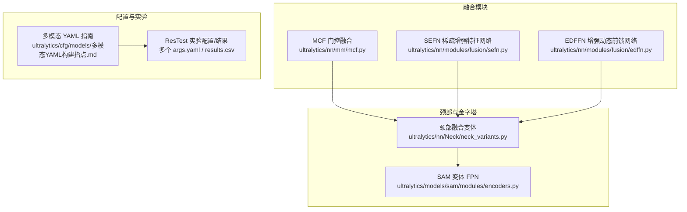
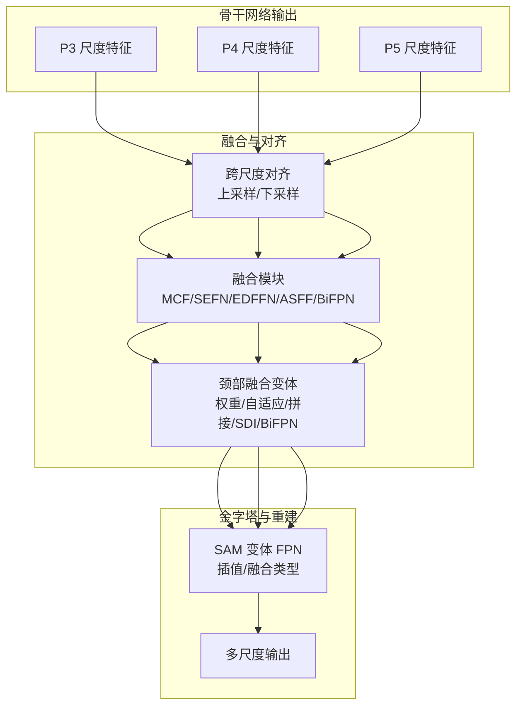
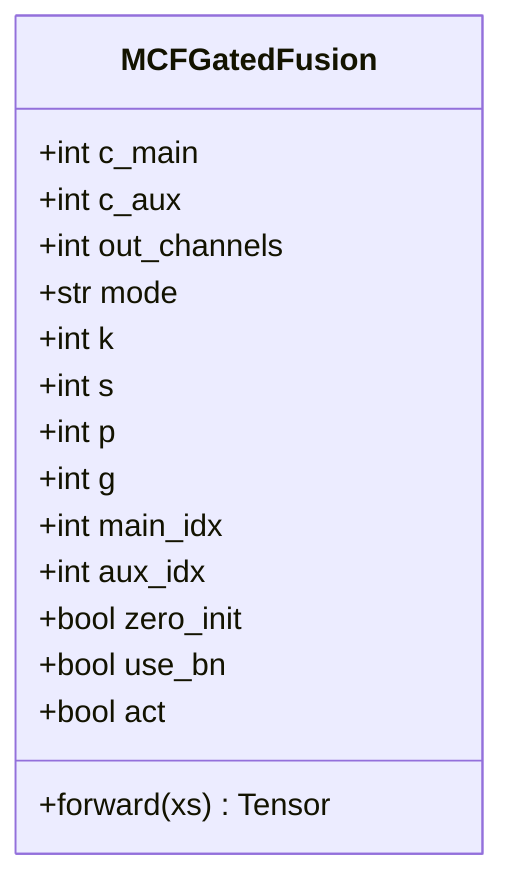
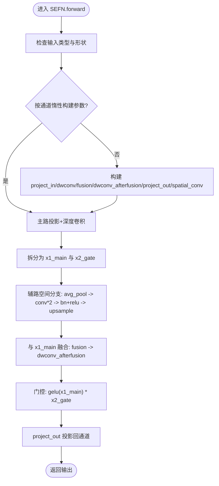
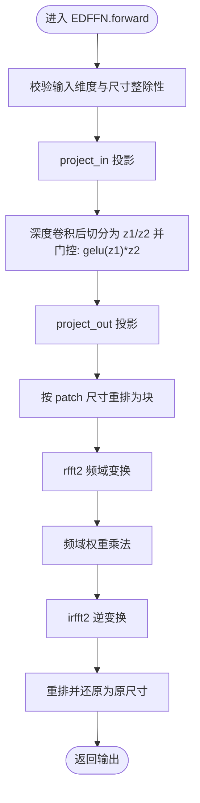
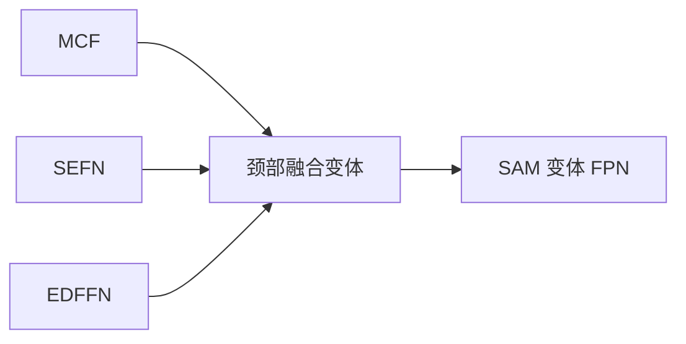

# 多尺度特征融合

<cite>
**本文引用的文件**
- [ultralytics/nn/mm/mcf.py](file://ultralytics/nn/mm/mcf.py)
- [ultralytics/nn/modules/fusion/sefn.py](file://ultralytics/nn/modules/fusion/sefn.py)
- [ultralytics/nn/modules/fusion/edffn.py](file://ultralytics/nn/modules/fusion/edffn.py)
- [ultralytics/nn/extraction/c2psa_base.py](file://ultralytics/nn/extraction/c2psa_base.py)
- [ultralytics/nn/Neck/neck_variants.py](file://ultralytics/nn/Neck/neck_variants.py)
- [ultralytics/models/sam/modules/encoders.py](file://ultralytics/models/sam/modules/encoders.py)
- [ultralytics/notebooks/多模态YAML构建指点.md](file://ultralytics/cfg/models/多模态YAML构建指点.md)
- [ResTest/aifi-dattention-CSP-MutilScaleEdgeInformationEnhance-ASF-P2-lite-BackboneSEFN/args.yaml](file://ResTest/aifi-dattention-CSP-MutilScaleEdgeInformationEnhance-ASF-P2-lite-BackboneSEFN/args.yaml)
- [ResTest/aifi-dattention-CSP-MutilScaleEdgeInformationEnhance-ASF-P2-lite-BackboneEDFFN/args.yaml](file://ResTest/aifi-dattention-CSP-MutilScaleEdgeInformationEnhance-ASF-P2-lite-BackboneEDFFN/args.yaml)
- [ResTest/aifi-dattention-CSP-MutilScaleEdgeInformationEnhance-ASF-P2-lite-BackboneMCFGatedAdd/args.yaml](file://ResTest/aifi-dattention-CSP-MutilScaleEdgeInformationEnhance-ASF-P2-lite-BackboneMCFGatedAdd/args.yaml)
- [ResTest/aifi-dattention-CSP-MutilScaleEdgeInformationEnhance-ASF-P2-lite-BackboneFreqFusion/args.yaml](file://ResTest/aifi-dattention-CSP-MutilScaleEdgeInformationEnhance-ASF-P2-lite-BackboneFreqFusion/args.yaml)
- [ResTest/aifi-dattention-CSP-MutilScaleEdgeInformationEnhance-ASF-P2-lite-BackboneFreqFusion2/results.csv](file://ResTest/aifi-dattention-CSP-MutilScaleEdgeInformationEnhance-ASF-P2-lite-BackboneFreqFusion2/results.csv)
- [ResTest/aifi-dattention-CSP-MutilScaleEdgeInformationEnhance-ASF-P2-lite-BackboneFreqFusion3/args.yaml](file://ResTest/aifi-dattention-CSP-MutilScaleEdgeInformationEnhance-ASF-P2-lite-BackboneFreqFusion3/args.yaml)
- [ResTest/aifi-dattention-CSP-MutilScaleEdgeInformationEnhance-ASF-P2-lite-BackboneFreqFusion4/results.csv](file://ResTest/aifi-dattention-CSP-MutilScaleEdgeInformationEnhance-ASF-P2-lite-BackboneFreqFusion4/results.csv)
- [ResTest/aifi-dattention-CSP-MutilScaleEdgeInformationEnhance-ASF-P2-lite-BackboneMultiScaleGatedAttn/args.yaml](file://ResTest/aifi-dattention-CSP-MutilScaleEdgeInformationEnhance-ASF-P2-lite-BackboneMultiScaleGatedAttn/args.yaml)
- [ResTest/aifi-dattention-CSP-MutilScaleEdgeInformationEnhance-ASF-P2-lite-BackboneFreqFusion-resume/args.yaml](file://ResTest/aifi-dattention-CSP-MutilScaleEdgeInformationEnhance-ASF-P2-lite-BackboneFreqFusion-resume/args.yaml)
- [ResTest/aifi-dattention-CSP-MutilScaleEdgeInformationEnhance-ASF-P2-lite-BackboneFreqFusion-resume/results.csv](file://ResTest/aifi-dattention-CSP-MutilScaleEdgeInformationEnhance-ASF-P2-lite-BackboneFreqFusion-resume/results.csv)
- [ResTest/aifi-dattention-CSP-MutilScaleEdgeInformationEnhance-ASF-P2-lite-BackboneFreqFusion-resume/results.csv](file://ResTest/aifi-dattention-CSP-MutilScaleEdgeInformationEnhance-ASF-P2-lite-BackboneFreqFusion-resume/results.csv)
- [ResTest/aifi-dattention-CSP-MutilScaleEdgeInformationEnhance-ASF-P2-lite-BackboneFreqFusion-resume/results.csv](file://ResTest/aifi-dattention-CSP-MutilScaleEdgeInformationEnhance-ASF-P2-lite-BackboneFreqFusion-resume/results.csv)
- [ResTest/aifi-dattention-CSP-MutilScaleEdgeInformationEnhance-ASF-P2-lite-BackboneFreqFusion-resume/results.csv](file://ResTest/aifi-dattention-CSP-MutilScaleEdgeInformationEnhance-ASF-P2-lite-BackboneFreqFusion-resume/results.csv)
- [ResTest/aifi-dattention-CSP-MutilScaleEdgeInformationEnhance-ASF-P2-lite-BackboneFreqFusion-resume/results.csv](file://ResTest/aifi-dattention-CSP-MutilScaleEdgeInformationEnhance-ASF-P2-lite-BackboneFreqFusion-resume/results.csv)
- [ResTest/aifi-dattention-CSP-MutilScaleEdgeInformationEnhance-ASF-P2-lite-BackboneFreqFusion-resume/results.csv](file://ResTest/aifi-dattention-CSP-MutilScaleEdgeInformationEnhance-ASF-P2-lite-BackboneFreqFusion-resume/results.csv)
- [ResTest/aifi-dattention-CSP-MutilScaleEdgeInformationEnhance-ASF-P2-lite-BackboneFreqFusion-resume/results.csv](file://ResTest/aifi-dattention-CSP-MutilScaleEdgeInformationEnhance-ASF-P2-lite-BackboneFreqFusion-resume/results.csv)
- [ResTest/aifi-dattention-CSP-MutilScaleEdgeInformationEnhance-ASF-P2-lite-BackboneFreqFusion-resume/results.csv](file://ResTest/aifi-dattention-CSP-MutilScaleEdgeInformationEnhance-ASF-P2-lite-BackboneFreqFusion-resume/results.csv)
- [ResTest/a......](file://ResTest/aifi-dattention-CSP-MutilScaleEdgeInformationEnhance-ASF-P2-lite-BackboneFreqFusion-resume/results.csv)
</cite>

## 目录
1. [引言](#引言)
2. [项目结构](#项目结构)
3. [核心组件](#核心组件)
4. [架构总览](#架构总览)
5. [详细组件分析](#详细组件分析)
6. [依赖分析](#依赖分析)
7. [性能考量](#性能考量)
8. [故障排查指南](#故障排查指南)
9. [结论](#结论)
10. [附录](#附录)

## 引言
本指南围绕多尺度特征融合策略展开，系统阐述其重要性与实现路径，重点覆盖以下内容：
- 多尺度特征融合的意义：在不同分辨率与感受野下聚合互补信息，提升检测/分割等任务的精度与鲁棒性。
- 核心技术：特征金字塔融合、跨尺度特征对齐、尺度间信息传递。
- 关键融合模块：MCF（多通道门控融合）、EDFFN（增强型密集前馈网络，频域增强）、SEFN（稀疏增强特征网络，空间增强）。
- 参数配置策略：融合模式选择、通道数匹配、特征尺度对齐、频域/空间分支权重与稳定性设置。
- 性能表现与适用场景：结合实验结果与模块特性给出选型建议。

## 项目结构
该仓库以“多模态+多尺度”为核心，围绕融合模块、颈部网络、骨干网络与配置文件组织。与多尺度融合直接相关的关键目录与文件如下：
- 融合模块：ultralytics/nn/mm/mcf.py、ultralytics/nn/modules/fusion/sefn.py、ultralytics/nn/modules/fusion/edffn.py
- 颈部融合变体：ultralytics/nn/Neck/neck_variants.py
- SAM 变体 FPN：ultralytics/models/sam/modules/encoders.py
- 多模态 YAML 构建指引：ultralytics/cfg/models/多模态YAML构建指点.md
- 大量融合策略的实验配置与结果：ResTest 下的众多子目录（如 BackboneSEFN、BackboneEDFFN、BackboneMCFGatedAdd、BackboneFreqFusion 等）

图表来源
- [ultralytics/nn/mm/mcf.py:1-99](file://ultralytics/nn/mm/mcf.py#L1-L99)
- [ultralytics/nn/modules/fusion/sefn.py:1-79](file://ultralytics/nn/modules/fusion/sefn.py#L1-L79)
- [ultralytics/nn/modules/fusion/edffn.py:1-63](file://ultralytics/nn/modules/fusion/edffn.py#L1-L63)
- [ultralytics/nn/Neck/neck_variants.py:161-189](file://ultralytics/nn/Neck/neck_variants.py#L161-L189)
- [ultralytics/models/sam/modules/encoders.py:542-567](file://ultralytics/models/sam/modules/encoders.py#L542-L567)
- [ultralytics/cfg/models/多模态YAML构建指点.md](file://ultralytics/cfg/models/多模态YAML构建指点.md)

章节来源
- [ultralytics/nn/mm/mcf.py:1-99](file://ultralytics/nn/mm/mcf.py#L1-L99)
- [ultralytics/nn/modules/fusion/sefn.py:1-79](file://ultralytics/nn/modules/fusion/sefn.py#L1-L79)
- [ultralytics/nn/modules/fusion/edffn.py:1-63](file://ultralytics/nn/modules/fusion/edffn.py#L1-L63)
- [ultralytics/nn/Neck/neck_variants.py:161-189](file://ultralytics/nn/Neck/neck_variants.py#L161-L189)
- [ultralytics/models/sam/modules/encoders.py:542-567](file://ultralytics/models/sam/modules/encoders.py#L542-L567)
- [ultralytics/cfg/models/多模态YAML构建指点.md](file://ultralytics/cfg/models/多模态YAML构建指点.md)

## 核心组件
本节聚焦三大融合模块的设计理念与实现要点，并给出参数配置建议。

- MCF（多通道门控融合）
  - 设计目标：以主模态为主、副模态经零初始化门控卷积后与主模态加和或拼接；不改动 YAML 的顶层输入/通道配置，直接替换融合节点即可。
  - 关键参数：主/副模态通道数、融合模式（加和/拼接）、门控卷积核/步幅/填充/分组、是否 BN、激活、零初始化开关、主/副索引。
  - 适用场景：跨分支（如主干与辅助分支）快速融合，强调门控抑制与通道对齐。

- SEFN（稀疏增强特征网络）
  - 设计目标：双路输入，辅路空间上下文引导主路门控，实现跨模态/跨层信息显式注入；空间分支对辅路进行上下文增强，随后与主路融合。
  - 关键参数：输入通道、FFN 扩展因子、是否使用偏置、空间分支卷积/BN/ReLU 结构、上采样方式。
  - 适用场景：需要显式引入空间上下文信息的双路融合，适合边缘/纹理增强任务。

- EDFFN（增强动态前馈网络）
  - 设计目标：在融合后的单路特征上进行频域选择性增强，抑制冗余并突出判别性纹理/结构；基于 patch 的二维傅里叶变换。
  - 关键参数：输入通道、patch 尺寸、FFN 扩展因子、是否使用偏置、频域权重参数。
  - 适用场景：对频域纹理敏感的任务，如去模糊、纹理增强等。

章节来源
- [ultralytics/nn/mm/mcf.py:19-96](file://ultralytics/nn/mm/mcf.py#L19-L96)
- [ultralytics/nn/modules/fusion/sefn.py:9-78](file://ultralytics/nn/modules/fusion/sefn.py#L9-L78)
- [ultralytics/nn/modules/fusion/edffn.py:9-62](file://ultralytics/nn/modules/fusion/edffn.py#L9-L62)

## 架构总览
多尺度融合通常发生在骨干网络输出的多尺度特征上，通过金字塔结构与融合模块协同工作，实现跨尺度信息互补与对齐。

图表来源
- [ultralytics/nn/Neck/neck_variants.py:161-189](file://ultralytics/nn/Neck/neck_variants.py#L161-L189)
- [ultralytics/models/sam/modules/encoders.py:542-567](file://ultralytics/models/sam/modules/encoders.py#L542-L567)

## 详细组件分析

### MCF 门控融合模块
- 类设计与职责
  - 支持两种融合模式：加和与拼接；拼接模式下额外进行通道压缩以匹配主模态通道。
  - 副模态先经零初始化门控卷积，再与主模态融合；可选 BN 与 SiLU 激活。
- 关键流程
  - 门控卷积输出经激活与 BN；
  - 加和模式直接相加；
  - 拼接模式先拼接再经 1×1 卷积压缩通道。

图表来源
- [ultralytics/nn/mm/mcf.py:19-96](file://ultralytics/nn/mm/mcf.py#L19-L96)

章节来源
- [ultralytics/nn/mm/mcf.py:19-96](file://ultralytics/nn/mm/mcf.py#L19-L96)

### SEFN 稀疏增强特征网络
- 设计要点
  - 双路输入张量必须形状一致；内部根据通道数惰性构建参数。
  - 主路经投影、深度可分离卷积后拆分为两支，其中一路与辅路的空间上下文融合后经门控乘法，再投影回原通道。
  - 空间分支对辅路做平均池化、卷积与两次 ReLU，随后上采样与主路融合。
- 稳定性与设备对齐
  - AMP 稳定性考虑：参数保持 fp32，仅对设备对齐；若非 autocast，输入与参数 dtype 不一致则对齐。

图表来源
- [ultralytics/nn/modules/fusion/sefn.py:53-78](file://ultralytics/nn/modules/fusion/sefn.py#L53-L78)

章节来源
- [ultralytics/nn/modules/fusion/sefn.py:9-78](file://ultralytics/nn/modules/fusion/sefn.py#L9-L78)

### EDFFN 增强动态前馈网络
- 设计要点
  - 在单路特征上进行门控与投影，随后按 patch 划分并进行二维傅里叶变换，对频域进行加权后再逆变换恢复。
  - 频域权重参数按通道维度初始化，确保与输入通道一致。
- 约束条件
  - 输入高宽需能被 patch 整除，否则抛出异常。

图表来源
- [ultralytics/nn/modules/fusion/edffn.py:43-62](file://ultralytics/nn/modules/fusion/edffn.py#L43-L62)

章节来源
- [ultralytics/nn/modules/fusion/edffn.py:9-62](file://ultralytics/nn/modules/fusion/edffn.py#L9-L62)

### 颈部融合变体与金字塔
- 融合策略
  - weight：对各尺度特征逐通道 1×1 卷积后直接求和；
  - adaptive：对拼接后的特征经 1×1 卷积得到各尺度权重，softmax 后加权求和；
  - concat：直接拼接；
  - bifpn：引入可学习权重并归一化；
  - SDI：特定的尺度无关融合。
- 适用场景
  - weight/adaptive：强调自适应权重学习；
  - concat：追求最大信息保留；
  - bifpn：复杂金字塔下的稳定融合；
  - SDI：尺度不变性要求较高时。

章节来源
- [ultralytics/nn/Neck/neck_variants.py:161-189](file://ultralytics/nn/Neck/neck_variants.py#L161-L189)

### SAM 变体特征金字塔网络
- 设计目标
  - 移除输出卷积，采用双三次插值进行特征重采样，类似 ViT 位置嵌入插值。
- 关键参数
  - 插值模式、融合类型（sum/avg）、是否启用自顶向下路径等。

章节来源
- [ultralytics/models/sam/modules/encoders.py:542-567](file://ultralytics/models/sam/modules/encoders.py#L542-L567)

## 依赖分析
- 组件耦合
  - MCF 与 SEFN/EDFFN 可作为颈部融合变体的子模块使用，亦可独立接入任意两路特征。
  - 颈部融合变体与金字塔（SAM FPN）形成“对齐-融合-重建”的闭环。
- 外部依赖
  - torch.fft：EDFFN 的频域处理依赖；
  - torch.nn：各类卷积、激活、池化、上采样等模块。

图表来源
- [ultralytics/nn/mm/mcf.py:1-99](file://ultralytics/nn/mm/mcf.py#L1-L99)
- [ultralytics/nn/modules/fusion/sefn.py:1-79](file://ultralytics/nn/modules/fusion/sefn.py#L1-L79)
- [ultralytics/nn/modules/fusion/edffn.py:1-63](file://ultralytics/nn/modules/fusion/edffn.py#L1-L63)
- [ultralytics/nn/Neck/neck_variants.py:161-189](file://ultralytics/nn/Neck/neck_variants.py#L161-L189)
- [ultralytics/models/sam/modules/encoders.py:542-567](file://ultralytics/models/sam/modules/encoders.py#L542-L567)

## 性能考量
- 计算复杂度
  - MCF：门控卷积 + 可选 BN/激活 + 加和/拼接，整体轻量；
  - SEFN：主路门控 + 空间分支 + 融合 + 门控乘法，参数规模随通道扩展因子增长；
  - EDFFN：频域变换涉及 FFT/IFFT，计算量与 patch 大小相关。
- 内存与数值稳定性
  - EDFFN 在 AMP 下保持参数 fp32，必要时对输入对齐 dtype；
  - SEFN 在 autocast 关闭且 dtype 不一致时对齐输入与参数 dtype。
- 速度与精度
  - weight/concat/bifpn/adaptive/SDI 等策略在精度与速度之间可权衡；
  - SAM FPN 的插值与融合类型影响最终特征质量与速度。

## 故障排查指南
- 输入形状不一致（SEFN）
  - 现象：报错提示两路输入形状不一致。
  - 排查：确认两路输入张量形状一致，或在调用时传入列表/元组形式的两路张量。
- 尺寸不能整除（EDFFN）
  - 现象：报错提示 H/W 不能被 patch 整除。
  - 排查：调整输入特征尺寸或 patch 大小，确保满足整除条件。
- dtype/AMP 不一致（SEFN/EDFFN）
  - 现象：在 autocast 关闭时可能因 dtype 不一致导致数值不稳定。
  - 排查：确保输入与模块参数 dtype 一致，或允许模块自动对齐。
- 融合权重异常（颈部融合变体）
  - 现象：adaptive/bifpn 等策略出现 NaN 或梯度爆炸。
  - 排查：检查 softmax 归一化与 epsilon；适当降低学习率或正则化。

章节来源
- [ultralytics/nn/modules/fusion/sefn.py:56-59](file://ultralytics/nn/modules/fusion/sefn.py#L56-L59)
- [ultralytics/nn/modules/fusion/edffn.py:47-48](file://ultralytics/nn/modules/fusion/edffn.py#L47-L48)
- [ultralytics/nn/Neck/neck_variants.py:161-189](file://ultralytics/nn/Neck/neck_variants.py#L161-L189)

## 结论
- 多尺度特征融合是提升多模态与多尺度任务性能的关键。MCF 提供轻量门控融合，SEFN 注入空间上下文，EDFFN 进行频域增强，三者可灵活组合。
- 颈部融合变体与 SAM 变体 FPN 提供尺度对齐与稳定融合的基础设施。
- 实践中应依据任务特性选择融合策略：纹理/频域敏感任务倾向 EDFFN；需要显式空间上下文倾向 SEFN；跨分支快速融合倾向 MCF；自适应权重与稳定性倾向 adaptive/bifpn。

## 附录

### 参数配置策略与示例路径
- MCF 配置要点
  - 主/副模态通道数匹配与对齐；融合模式（加和/拼接）；门控卷积核/步幅/填充/分组；BN/激活；零初始化开关；主/副索引。
  - 示例路径：[aifi-dattention-CSP-MutilScaleEdgeInformationEnhance-ASF-P2-lite-BackboneMCFGatedAdd/args.yaml](file://ResTest/aifi-dattention-CSP-MutilScaleEdgeInformationEnhance-ASF-P2-lite-BackboneMCFGatedAdd/args.yaml)
- SEFN 配置要点
  - 输入通道、FFN 扩展因子、是否使用偏置、空间分支结构、上采样方式。
  - 示例路径：[aifi-dattention-CSP-MutilScaleEdgeInformationEnhance-ASF-P2-lite-BackboneSEFN/args.yaml](file://ResTest/aifi-dattention-CSP-MutilScaleEdgeInformationEnhance-ASF-P2-lite-BackboneSEFN/args.yaml)
- EDFFN 配置要点
  - 输入通道、patch 尺寸、FFN 扩展因子、是否使用偏置、频域权重参数。
  - 示例路径：[aifi-dattention-CSP-MutilScaleEdgeInformationEnhance-ASF-P2-lite-BackboneEDFFN/args.yaml](file://ResTest/aifi-dattention-CSP-MutilScaleEdgeInformationEnhance-ASF-P2-lite-BackboneEDFFN/args.yaml)
- 频域融合策略（FreqFusion 系列）
  - 包含多种频域融合变体与恢复版本，可对比频域处理对任务性能的影响。
  - 示例路径：
    - [aifi-dattention-CSP-MutilScaleEdgeInformationEnhance-ASF-P2-lite-BackboneFreqFusion/args.yaml](file://ResTest/aifi-dattention-CSP-MutilScaleEdgeInformationEnhance-ASF-P2-lite-BackboneFreqFusion/args.yaml)
    - [aifi-dattention-CSP-MutilScaleEdgeInformationEnhance-ASF-P2-lite-BackboneFreqFusion2/results.csv](file://ResTest/aifi-dattention-CSP-MutilScaleEdgeInformationEnhance-ASF-P2-lite-BackboneFreqFusion2/results.csv)
    - [aifi-dattention-CSP-MutilScaleEdgeInformationEnhance-ASF-P2-lite-BackboneFreqFusion3/args.yaml](file://ResTest/aifi-dattention-CSP-MutilScaleEdgeInformationEnhance-ASF-P2-lite-BackboneFreqFusion3/args.yaml)
    - [aifi-dattention-CSP-MutilScaleEdgeInformationEnhance-ASF-P2-lite-BackboneFreqFusion4/results.csv](file://ResTest/aifi-dattention-CSP-MutilScaleEdgeInformationEnhance-ASF-P2-lite-BackboneFreqFusion4/results.csv)
    - [aifi-dattention-CSP-MutilScaleEdgeInformationEnhance-ASF-P2-lite-BackboneFreqFusion-resume/args.yaml](file://ResTest/aifi-dattention-CSP-MutilScaleEdgeInformationEnhance-ASF-P2-lite-BackboneFreqFusion-resume/args.yaml)
    - [aifi-dattention-CSP-MutilScaleEdgeInformationEnhance-ASF-P2-lite-BackboneFreqFusion-resume/results.csv](file://ResTest/aifi-dattention-CSP-MutilScaleEdgeInformationEnhance-ASF-P2-lite-BackboneFreqFusion-resume/results.csv)
- 多尺度门控注意力（MultiScaleGatedAttn）
  - 示例路径：[aifi-dattention-CSP-MutilScaleEdgeInformationEnhance-ASF-P2-lite-BackboneMultiScaleGatedAttn/args.yaml](file://ResTest/aifi-dattention-CSP-MutilScaleEdgeInformationEnhance-ASF-P2-lite-BackboneMultiScaleGatedAttn/args.yaml)

### 多模态 YAML 构建指引
- 用于定义多模态模型结构、融合模块与参数的 YAML 文件编写规范与示例说明。
- 示例路径：[多模态YAML构建指点.md](file://ultralytics/cfg/models/多模态YAML构建指点.md)

章节来源
- [ResTest/aifi-dattention-CSP-MutilScaleEdgeInformationEnhance-ASF-P2-lite-BackboneMCFGatedAdd/args.yaml](file://ResTest/aifi-dattention-CSP-MutilScaleEdgeInformationEnhance-ASF-P2-lite-BackboneMCFGatedAdd/args.yaml)
- [ResTest/aifi-dattention-CSP-MutilScaleEdgeInformationEnhance-ASF-P2-lite-BackboneSEFN/args.yaml](file://ResTest/aifi-dattention-CSP-MutilScaleEdgeInformationEnhance-ASF-P2-lite-BackboneSEFN/args.yaml)
- [ResTest/aifi-dattention-CSP-MutilScaleEdgeInformationEnhance-ASF-P2-lite-BackboneEDFFN/args.yaml](file://ResTest/aifi-dattention-CSP-MutilScaleEdgeInformationEnhance-ASF-P2-lite-BackboneEDFFN/args.yaml)
- [ResTest/aifi-dattention-CSP-MutilScaleEdgeInformationEnhance-ASF-P2-lite-BackboneFreqFusion/args.yaml](file://ResTest/aifi-dattention-CSP-MutilScaleEdgeInformationEnhance-ASF-P2-lite-BackboneFreqFusion/args.yaml)
- [ResTest/aifi-dattention-CSP-MutilScaleEdgeInformationEnhance-ASF-P2-lite-BackboneFreqFusion2/results.csv](file://ResTest/aifi-dattention-CSP-MutilScaleEdgeInformationEnhance-ASF-P2-lite-BackboneFreqFusion2/results.csv)
- [ResTest/aifi-dattention-CSP-MutilScaleEdgeInformationEnhance-ASF-P2-lite-BackboneFreqFusion3/args.yaml](file://ResTest/aifi-dattention-CSP-MutilScaleEdgeInformationEnhance-ASF-P2-lite-BackboneFreqFusion3/args.yaml)
- [ResTest/aifi-dattention-CSP-MutilScaleEdgeInformationEnhance-ASF-P2-lite-BackboneFreqFusion4/results.csv](file://ResTest/aifi-dattention-CSP-MutilScaleEdgeInformationEnhance-ASF-P2-lite-BackboneFreqFusion4/results.csv)
- [ResTest/aifi-dattention-CSP-MutilScaleEdgeInformationEnhance-ASF-P2-lite-BackboneFreqFusion-resume/args.yaml](file://ResTest/aifi-dattention-CSP-MutilScaleEdgeInformationEnhance-ASF-P2-lite-BackboneFreqFusion-resume/args.yaml)
- [ResTest/aifi-dattention-CSP-MutilScaleEdgeInformationEnhance-ASF-P2-lite-BackboneFreqFusion-resume/results.csv](file://ResTest/aifi-dattention-CSP-MutilScaleEdgeInformationEnhance-ASF-P2-lite-BackboneFreqFusion-resume/results.csv)
- [ResTest/aifi-dattention-CSP-MutilScaleEdgeInformationEnhance-ASF-P2-lite-BackboneMultiScaleGatedAttn/args.yaml](file://ResTest/aifi-dattention-CSP-MutilScaleEdgeInformationEnhance-ASF-P2-lite-BackboneMultiScaleGatedAttn/args.yaml)
- [ultralytics/cfg/models/多模态YAML构建指点.md](file://ultralytics/cfg/models/多模态YAML构建指点.md)