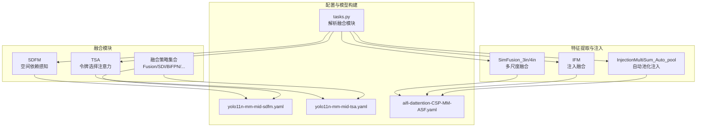
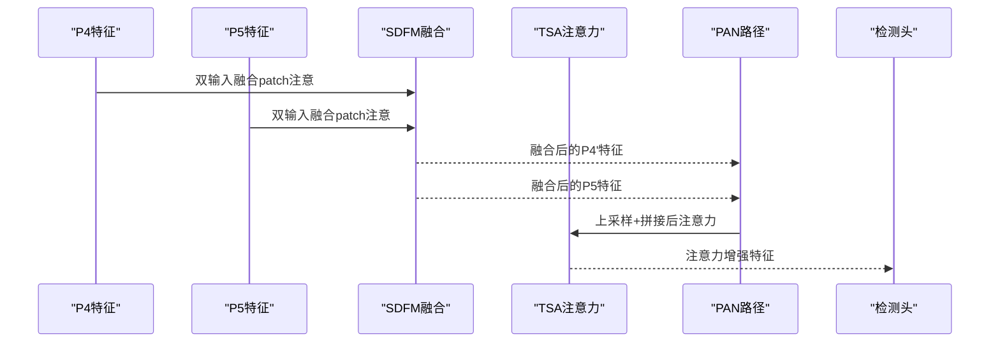
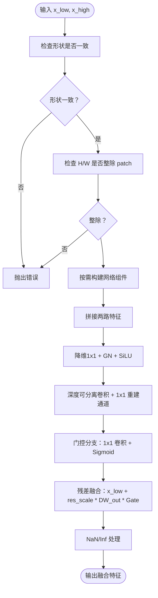
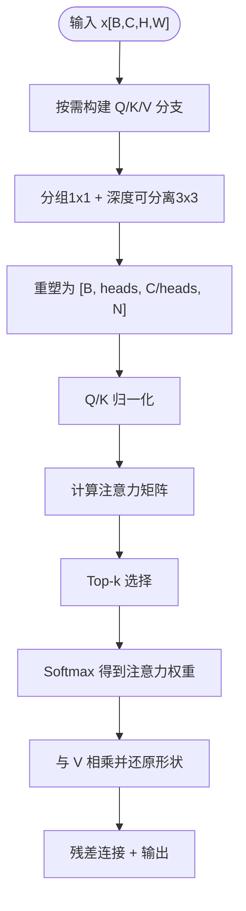
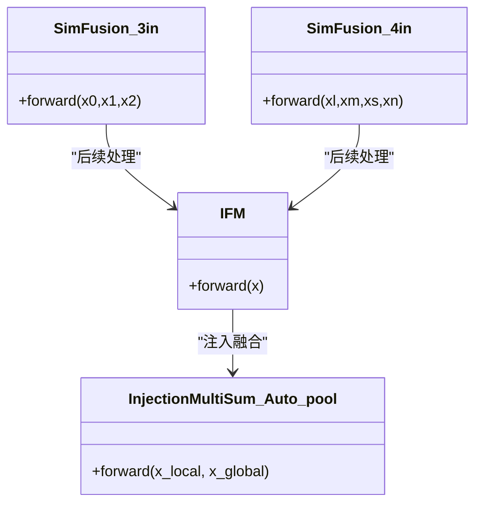
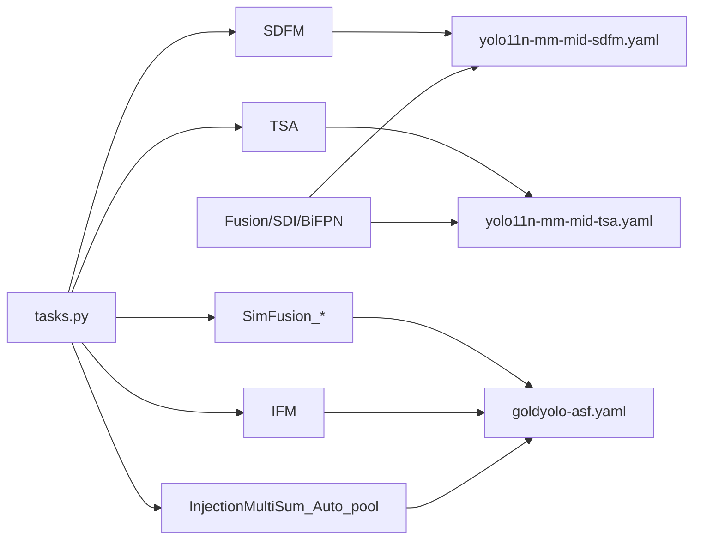

# 空间注意力融合

<cite>
**本文引用的文件**
- [sdfm.py](file://ultralytics/nn/modules/fusion/sdfm.py)
- [tsa.py](file://ultralytics/nn/modules/fusion/tsa.py)
- [neck_variants.py](file://ultralytics/nn/Neck/neck_variants.py)
- [sppf_base.py](file://ultralytics/nn/extraction/sppf_base.py)
- [yolo11n-mm-mid-sdfm.yaml](file://ultralytics/cfg/models/mm/change/yolo11n-mm-mid-sdfm.yaml)
- [yolo11n-mm-mid-tsa.yaml](file://ultralytics/cfg/models/mm/change/yolo11n-mm-mid-tsa.yaml)
- [aifi-dattention-CSP-MutilScaleEdgeInformationEnhance-goldyolo-asf.yaml](file://ultralytics/cfg/models/rtmm/r18/aifi-dattention-CSP-MutilScaleEdgeInformationEnhance-goldyolo-asf.yaml)
- [tasks.py](file://ultralytics/nn/tasks.py)
- [fca.py](file://ultralytics/nn/public/fca.py)
- [fdconv.py](file://ultralytics/nn/public/fdconv.py)
</cite>

## 目录
1. [引言](#引言)
2. [项目结构](#项目结构)
3. [核心组件](#核心组件)
4. [架构总览](#架构总览)
5. [详细组件分析](#详细组件分析)
6. [依赖分析](#依赖分析)
7. [性能考量](#性能考量)
8. [故障排查指南](#故障排查指南)
9. [结论](#结论)
10. [附录](#附录)

## 引言
本文件系统化梳理并阐述空间注意力融合策略在多模态目标检测中的设计与实现，重点覆盖以下内容：
- 空间注意力机制的核心思想：通过评估空间位置的重要性，对特征图进行加权融合，从而提升跨模态或多尺度特征的表达能力。
- 关键融合模块：SDFM（空间动态特征调制）、TSA（令牌选择注意力）以及与之协同的特征提取与融合组件（如SimFusion、IFM、InjectionMultiSum_Auto_pool等）。
- 参数调优方法：注意力窗口大小、池化策略、特征映射维度等关键配置的建议与影响。
- 不同模态下的效果与最佳实践：结合多模态配置文件与实验结果，总结在RGB、红外、可见光等模态下的融合策略。
- 完整实现与使用示例：提供代码片段路径与配置文件引用，便于快速定位与复用。

## 项目结构
围绕空间注意力融合的相关代码主要分布在以下模块：
- 融合模块：sdfm.py（SDFM）、tsa.py（TSA）、neck_variants.py（多种融合策略与辅助模块）
- 特征提取与注入：sppf_base.py（SimFusion、IFM、InjectionMultiSum_Auto_pool等）
- 配置文件：yolo11n-mm-mid-sdfm.yaml（SDFM融合配置）、yolo11n-mm-mid-tsa.yaml（TSA融合配置）、aifi-dattention-CSP-MutilScaleEdgeInformationEnhance-goldyolo-asf.yaml（GOLD-YOLO融合链路）
- 模型构建：tasks.py（解析融合模块并计算输出通道）

**图表来源**
- [sdfm.py:6-83](file://ultralytics/nn/modules/fusion/sdfm.py#L6-L83)
- [tsa.py:9-70](file://ultralytics/nn/modules/fusion/tsa.py#L9-L70)
- [neck_variants.py:152-189](file://ultralytics/nn/Neck/neck_variants.py#L152-L189)
- [sppf_base.py:399-624](file://ultralytics/nn/extraction/sppf_base.py#L399-L624)
- [yolo11n-mm-mid-sdfm.yaml:1-74](file://ultralytics/cfg/models/mm/change/yolo11n-mm-mid-sdfm.yaml#L1-L74)
- [yolo11n-mm-mid-tsa.yaml:50-79](file://ultralytics/cfg/models/mm/change/yolo11n-mm-mid-tsa.yaml#L50-L79)
- [aifi-dattention-CSP-MutilScaleEdgeInformationEnhance-goldyolo-asf.yaml:32-56](file://ultralytics/cfg/models/rtmm/r18/aifi-dattention-CSP-MutilScaleEdgeInformationEnhance-goldyolo-asf.yaml#L32-L56)
- [tasks.py:3247-3268](file://ultralytics/nn/tasks.py#L3247-L3268)

**章节来源**
- [sdfm.py:6-83](file://ultralytics/nn/modules/fusion/sdfm.py#L6-L83)
- [tsa.py:9-70](file://ultralytics/nn/modules/fusion/tsa.py#L9-L70)
- [neck_variants.py:152-189](file://ultralytics/nn/Neck/neck_variants.py#L152-L189)
- [sppf_base.py:399-624](file://ultralytics/nn/extraction/sppf_base.py#L399-L624)
- [yolo11n-mm-mid-sdfm.yaml:1-74](file://ultralytics/cfg/models/mm/change/yolo11n-mm-mid-sdfm.yaml#L1-L74)
- [yolo11n-mm-mid-tsa.yaml:50-79](file://ultralytics/cfg/models/mm/change/yolo11n-mm-mid-tsa.yaml#L50-L79)
- [aifi-dattention-CSP-MutilScaleEdgeInformationEnhance-goldyolo-asf.yaml:32-56](file://ultralytics/cfg/models/rtmm/r18/aifi-dattention-CSP-MutilScaleEdgeInformationEnhance-goldyolo-asf.yaml#L32-L56)
- [tasks.py:3247-3268](file://ultralytics/nn/tasks.py#L3247-L3268)

## 核心组件
- SDFM（空间动态特征调制）：基于分块unfold的稳定融合模块，采用门控路径与数值稳定性处理，确保混合精度训练的鲁棒性。
- TSA（令牌选择注意力）：在空间注意力中引入Top-k令牌选择，限制注意力交互范围，提高效率与鲁棒性。
- SimFusion/IFM/InjectionMultiSum_Auto_pool：用于多尺度特征融合与全局-局部特征注入，支撑复杂融合链路。
- 多种融合策略：Fusion（权重/自适应/拼接/BiFPN/SDI）等，满足不同场景的融合需求。

**章节来源**
- [sdfm.py:6-83](file://ultralytics/nn/modules/fusion/sdfm.py#L6-L83)
- [tsa.py:9-70](file://ultralytics/nn/modules/fusion/tsa.py#L9-L70)
- [neck_variants.py:152-189](file://ultralytics/nn/Neck/neck_variants.py#L152-L189)
- [sppf_base.py:399-624](file://ultralytics/nn/extraction/sppf_base.py#L399-L624)

## 架构总览
下图展示了多模态检测中空间注意力融合的整体流程：在P4/P5层进行特征融合，SDFM/TSA分别负责空间依赖感知与令牌选择注意力，随后进入检测头。

**图表来源**
- [yolo11n-mm-mid-sdfm.yaml:49-74](file://ultralytics/cfg/models/mm/change/yolo11n-mm-mid-sdfm.yaml#L49-L74)
- [yolo11n-mm-mid-tsa.yaml:50-79](file://ultralytics/cfg/models/mm/change/yolo11n-mm-mid-tsa.yaml#L50-L79)

## 详细组件分析

### SDFM（空间动态特征调制）
- 设计理念：以patch为单位进行空间依赖感知，通过门控路径对低分辨率与高分辨率特征进行加权融合，提升跨尺度特征的语义一致性。
- 实现要点：
  - 输入两路相同尺寸的特征张量，通道数需一致。
  - 通过1×1卷积降维、深度可分离卷积与逐点卷积重构通道，再经门控模块生成融合权重。
  - 数值稳定性：在混合精度环境下，显式切换到更高精度进行中间计算，避免数值不稳定。
  - 形状约束：输入特征的高度与宽度必须能被patch整除。
- 关键参数：
  - dim：输出通道（可为null，自动继承左分支通道）
  - patch：patch大小（默认8）
  - inter_dim：中间通道（可为null，与输入通道一致）

**图表来源**
- [sdfm.py:55-83](file://ultralytics/nn/modules/fusion/sdfm.py#L55-L83)

**章节来源**
- [sdfm.py:6-83](file://ultralytics/nn/modules/fusion/sdfm.py#L6-L83)
- [yolo11n-mm-mid-sdfm.yaml:1-10](file://ultralytics/cfg/models/mm/change/yolo11n-mm-mid-sdfm.yaml#L1-L10)
- [yolo11n-mm-mid-sdfm.yaml:49-51](file://ultralytics/cfg/models/mm/change/yolo11n-mm-mid-sdfm.yaml#L49-L51)

### TSA（令牌选择注意力）
- 设计理念：在空间注意力中引入Top-k令牌选择，仅保留最相关的token交互，降低计算开销并提升鲁棒性。
- 实现要点：
  - 通道数需同时被num_heads与group整除。
  - 通过分组1×1卷积与深度可分离卷积生成Q/K/V，归一化后计算注意力矩阵。
  - 选取top-k个最大注意力值，其余置为负无穷，再Softmax得到稀疏注意力。
  - 输出经1×1卷积投影回原通道并残差接入。
- 关键参数：
  - num_heads：注意力头数
  - k_ratio：保留比例（0,1]，默认0.8
  - group：分组数（与通道数整除约束）

**图表来源**
- [tsa.py:28-69](file://ultralytics/nn/modules/fusion/tsa.py#L28-L69)

**章节来源**
- [tsa.py:9-70](file://ultralytics/nn/modules/fusion/tsa.py#L9-L70)
- [yolo11n-mm-mid-tsa.yaml:50-58](file://ultralytics/cfg/models/mm/change/yolo11n-mm-mid-tsa.yaml#L50-L58)

### SimFusion/IFM/InjectionMultiSum_Auto_pool（特征注入与融合）
- SimFusion_3in/4in：多尺度特征自适应池化融合，将不同分辨率特征对齐到同一尺寸后拼接，适用于GOLD-YOLO等多尺度融合链路。
- IFM：通过嵌入网络对融合特征进行进一步处理，支持多输出分支。
- InjectionMultiSum_Auto_pool：局部特征与全局池化特征的加权融合，依据相对分辨率自动选择池化或插值策略。

**图表来源**
- [sppf_base.py:399-476](file://ultralytics/nn/extraction/sppf_base.py#L399-L476)
- [sppf_base.py:537-556](file://ultralytics/nn/extraction/sppf_base.py#L537-L556)
- [sppf_base.py:559-624](file://ultralytics/nn/extraction/sppf_base.py#L559-L624)

**章节来源**
- [sppf_base.py:399-476](file://ultralytics/nn/extraction/sppf_base.py#L399-L476)
- [sppf_base.py:537-556](file://ultralytics/nn/extraction/sppf_base.py#L537-L556)
- [sppf_base.py:559-624](file://ultralytics/nn/extraction/sppf_base.py#L559-L624)
- [aifi-dattention-CSP-MutilScaleEdgeInformationEnhance-goldyolo-asf.yaml:32-56](file://ultralytics/cfg/models/rtmm/r18/aifi-dattention-CSP-MutilScaleEdgeInformationEnhance-goldyolo-asf.yaml#L32-L56)

### 多种融合策略（Fusion/SDI/BiFPN/...）
- 支持权重融合、自适应融合、拼接、BiFPN、SDI等多种策略，满足不同骨干与颈部的融合需求。
- 自适应融合通过1×1卷积与softmax生成各分支权重，实现动态平衡。

**章节来源**
- [neck_variants.py:152-189](file://ultralytics/nn/Neck/neck_variants.py#L152-L189)

## 依赖分析
- 模块耦合关系：
  - SDFM/TSA作为独立注意力模块，可插入到任意融合路径中。
  - SimFusion/IFM/InjectionMultiSum_Auto_pool与GOLD-YOLO链路紧密耦合，共同构成多尺度注入融合。
  - Fusion/SDI/BiFPN等策略可作为通用融合器，服务于不同骨干输出。
- 解析与构建：
  - tasks.py在模型解析阶段识别上述融合模块并正确计算输出通道，确保下游模块输入维度匹配。

**图表来源**
- [tasks.py:3247-3268](file://ultralytics/nn/tasks.py#L3247-L3268)
- [yolo11n-mm-mid-sdfm.yaml:49-74](file://ultralytics/cfg/models/mm/change/yolo11n-mm-mid-sdfm.yaml#L49-L74)
- [yolo11n-mm-mid-tsa.yaml:50-79](file://ultralytics/cfg/models/mm/change/yolo11n-mm-mid-tsa.yaml#L50-L79)
- [aifi-dattention-CSP-MutilScaleEdgeInformationEnhance-goldyolo-asf.yaml:32-56](file://ultralytics/cfg/models/rtmm/r18/aifi-dattention-CSP-MutilScaleEdgeInformationEnhance-goldyolo-asf.yaml#L32-L56)

**章节来源**
- [tasks.py:3247-3268](file://ultralytics/nn/tasks.py#L3247-L3268)

## 性能考量
- 计算复杂度：
  - SDFM：主要由1×1降维、深度可分离卷积与门控分支组成，整体复杂度与输入通道数线性相关。
  - TSA：Top-k选择显著降低注意力矩阵的非零元素数量，减少Softmax与矩阵乘法的计算量。
- 内存与数值稳定性：
  - SDFM在混合精度下显式切换到更高精度进行中间计算，避免NaN/Inf传播。
  - 注入融合模块（IFM/InjectionMultiSum_Auto_pool）在分辨率不一致时采用自适应池化或插值，平衡精度与速度。
- 通道与分组约束：
  - TSA要求通道数同时被num_heads与group整除，否则会抛出异常；合理设置可避免运行时错误并提升吞吐。

**章节来源**
- [sdfm.py:69-82](file://ultralytics/nn/modules/fusion/sdfm.py#L69-L82)
- [tsa.py:31-34](file://ultralytics/nn/modules/fusion/tsa.py#L31-L34)
- [sppf_base.py:603-624](file://ultralytics/nn/extraction/sppf_base.py#L603-L624)

## 故障排查指南
- 形状不一致：
  - SDFM要求两路输入特征形状完全一致，若不一致会抛出错误。请检查上游特征提取或上采样/下采样是否对齐。
- H/W不可整除patch：
  - SDFM要求输入高度与宽度能被patch整除，否则会报错。可通过调整输入尺寸或修改patch大小解决。
- 通道数不满足整除约束：
  - TSA要求通道数同时被num_heads与group整除，否则会报错。请调整通道数或参数组合。
- 分辨率不一致导致的融合问题：
  - 注入融合模块会根据相对分辨率自动选择池化或插值，若出现细节丢失，可尝试调整插值模式或分辨率对齐策略。

**章节来源**
- [sdfm.py:59-66](file://ultralytics/nn/modules/fusion/sdfm.py#L59-L66)
- [tsa.py:31-34](file://ultralytics/nn/modules/fusion/tsa.py#L31-L34)
- [sppf_base.py:603-624](file://ultralytics/nn/extraction/sppf_base.py#L603-L624)

## 结论
空间注意力融合策略通过SDFM与TSA等模块，在多模态与多尺度场景中实现了高效且稳定的特征融合。SDFM强调空间依赖与数值稳健性，TSA强调注意力的稀疏性与效率。结合SimFusion/IFM/InjectionMultiSum_Auto_pool等注入融合组件，可在RGB、红外等多模态任务中取得更优的检测性能。参数调优方面，建议优先从patch大小、注意力头数、保留比例与通道数入手，确保满足整除约束并兼顾精度与速度。

## 附录
- 参数调优清单
  - SDFM：patch（默认8）、inter_dim（默认与输入一致）、res_scale（默认0.2）
  - TSA：num_heads、k_ratio（默认0.8）、group
  - 注入融合：局部/全局特征分辨率差异、池化/插值策略
- 最佳实践
  - 在P4/P5层使用SDFM进行跨尺度融合，随后可叠加TSA提升注意力效率。
  - 多尺度融合链路中优先保证分辨率对齐，必要时使用自适应池化或插值。
  - 合理设置通道数与分组，确保满足整除约束，避免运行时错误。