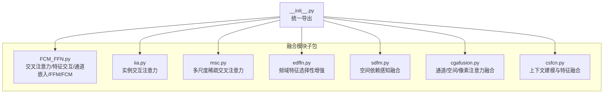
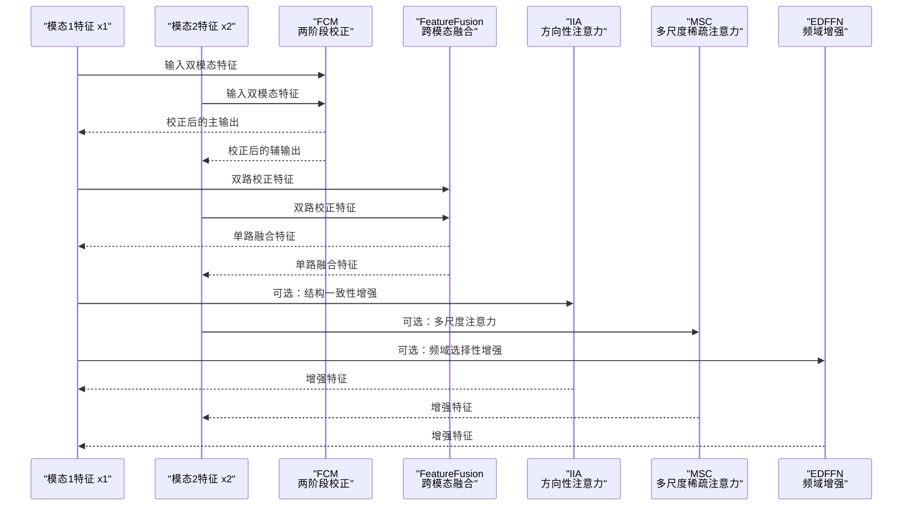
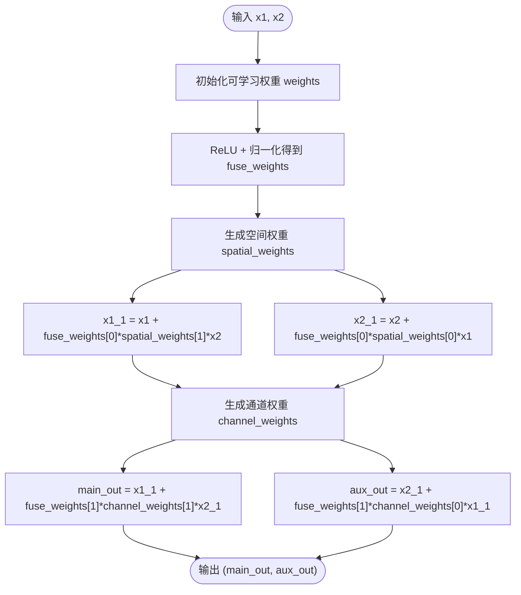
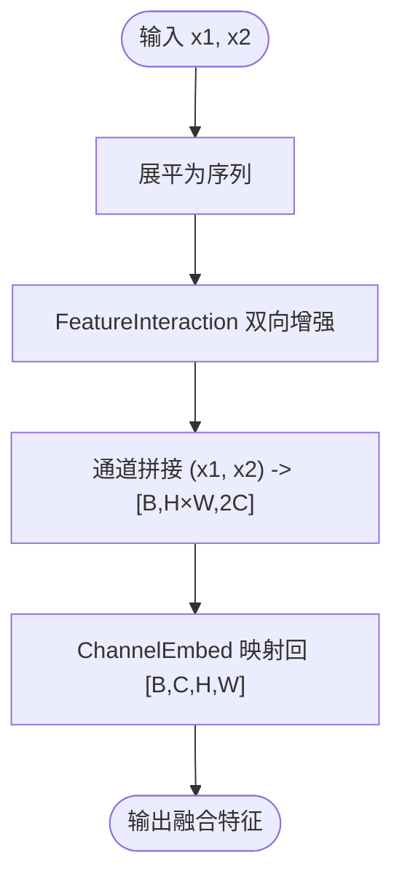
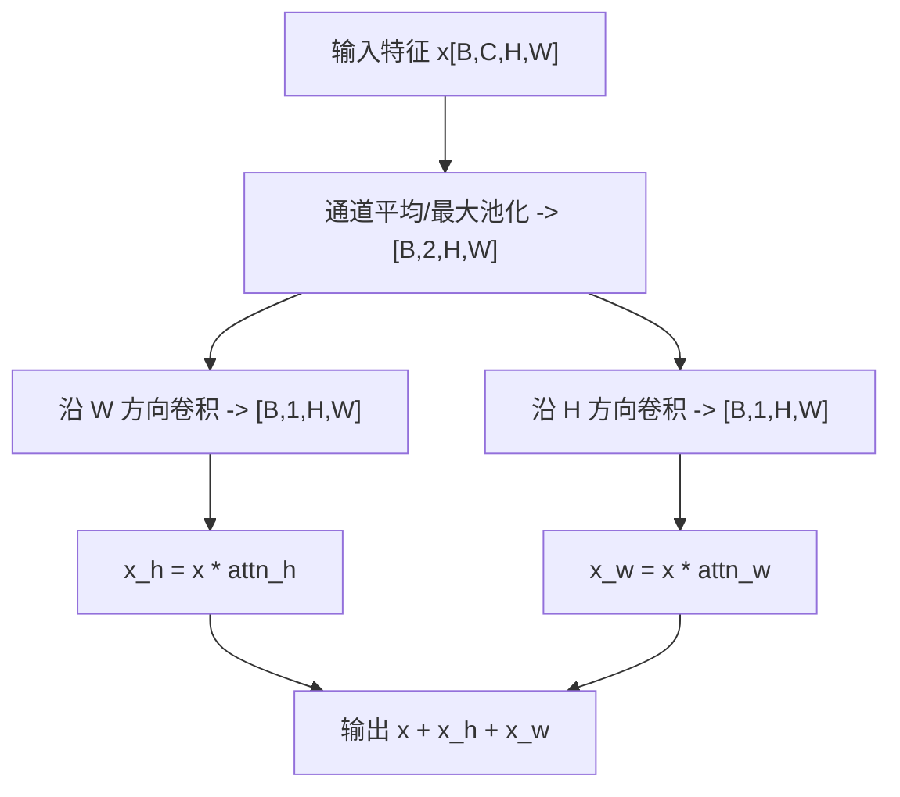
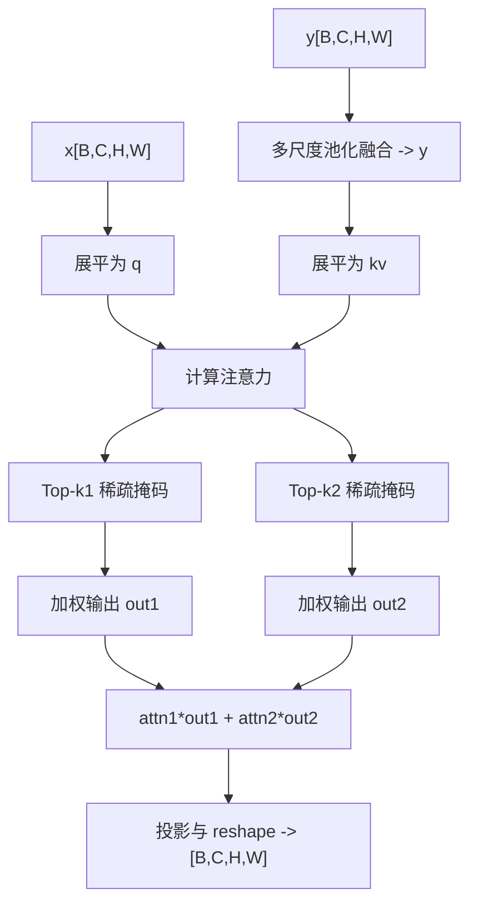
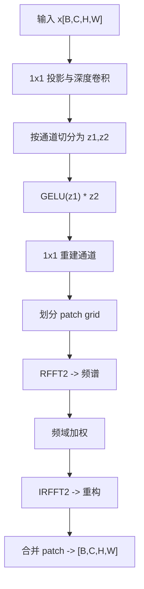
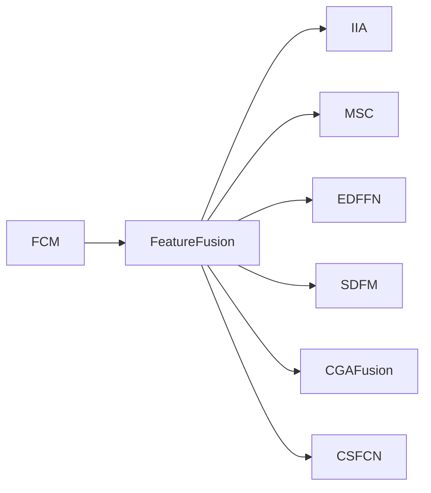

# 自适应融合策略

<cite>
**本文引用的文件**
- [FCM_FFN.py](file://ultralytics/nn/modules/fusion/FCM_FFN.py)
- [iia.py](file://ultralytics/nn/modules/fusion/iia.py)
- [msc.py](file://ultralytics/nn/modules/fusion/msc.py)
- [edffn.py](file://ultralytics/nn/modules/fusion/edffn.py)
- [__init__.py](file://ultralytics/nn/modules/fusion/__init__.py)
- [cgafusion.py](file://ultralytics/nn/modules/fusion/cgafusion.py)
- [csfcn.py](file://ultralytics/nn/modules/fusion/csfcn.py)
- [sdfm.py](file://ultralytics/nn/modules/fusion/sdfm.py)
- [args.yaml](file://ResTest/aifi-dattention-CSP-MutilScaleEdgeInformationEnhance-ASF-P2-lite-AdaptiveFusion/args.yaml)
- [results.csv](file://ResTest/aifi-dattention-CSP-MutilScaleEdgeInformationEnhance-ASF-P2-lite-AdaptiveFusion/results.csv)
</cite>

## 目录
1. [引言](#引言)
2. [项目结构](#项目结构)
3. [核心组件](#核心组件)
4. [架构总览](#架构总览)
5. [详细组件分析](#详细组件分析)
6. [依赖分析](#依赖分析)
7. [性能考量](#性能考量)
8. [故障排查指南](#故障排查指南)
9. [结论](#结论)
10. [附录](#附录)

## 引言
本文件系统化阐述自适应融合策略，聚焦动态权重分配、模态重要性评估与自适应参数调整三大核心机制。围绕 CFFormer 的 FCM（特征校正模块）与 FFN（特征融合网络）体系，以及 IIA（实例交互注意力）、MSC（多尺度通道）与 EDFFN（频域特征选择性增强）等自适应融合模块，给出实现原理、配置调优与性能验证路径。文档同时提供可视化架构图与流程图，帮助读者快速掌握从理论到工程落地的完整闭环。

## 项目结构
本仓库在融合模块层面提供了多种自适应融合策略的实现，主要集中在 ultralytics/nn/modules/fusion 子包中，并通过 __init__.py 对外统一导出。典型文件职责如下：
- FCM_FFN.py：实现交叉注意力、特征交互、通道嵌入与端到端特征融合，以及 FCM 两阶段校正与 FCMFeatureFusion 串联封装。
- iia.py：实现 IIA（实例交互注意力），沿空间维度注入方向先验，强化结构一致性。
- msc.py：实现 MSC（多尺度稀疏交叉注意力），通过多尺度池化与 Top-k 稀疏匹配突出高相关区域。
- edffn.py：实现 EDFFN（频域特征选择性增强），在单路融合后进行频域加权与重构。
- sdfm.py：实现空间依赖感知融合（SDFM 稳定版本），提供数值稳定的门控融合路径。
- cgafusion.py、csfcn.py：提供通道/空间/像素注意力引导的融合与上下文建模模块。
- __init__.py：统一导出上述模块，便于外部按名称引用。

**图表来源**
- [__init__.py:1-58](file://ultralytics/nn/modules/fusion/__init__.py#L1-L58)
- [FCM_FFN.py:1-800](file://ultralytics/nn/modules/fusion/FCM_FFN.py#L1-L800)
- [iia.py:1-49](file://ultralytics/nn/modules/fusion/iia.py#L1-L49)
- [msc.py:1-91](file://ultralytics/nn/modules/fusion/msc.py#L1-L91)
- [edffn.py:1-63](file://ultralytics/nn/modules/fusion/edffn.py#L1-L63)
- [sdfm.py:1-83](file://ultralytics/nn/modules/fusion/sdfm.py#L1-L83)
- [cgafusion.py:1-64](file://ultralytics/nn/modules/fusion/cgafusion.py#L1-L64)
- [csfcn.py:1-111](file://ultralytics/nn/modules/fusion/csfcn.py#L1-L111)

**章节来源**
- [__init__.py:1-58](file://ultralytics/nn/modules/fusion/__init__.py#L1-L58)

## 核心组件
本节聚焦自适应融合策略的三大核心：动态权重分配、模态重要性评估、自适应参数调整，并结合具体模块说明其实现要点。

- 动态权重分配
  - FCM 中的可学习权重向量，经 ReLU 与归一化后作为两阶段校正的全局融合权重，控制空间与通道校正强度。
  - LearnableWeights（来自 icafusion.py）提供两个可学习标量权重，实现两路特征的自适应加权融合。
  - MSC 中的 attn1、attn2 参数作为两种稀疏注意力的混合权重，实现多尺度上下文对齐的自适应融合。

- 模态重要性评估
  - FCM 的 ChannelWeights 基于平均、最大、标准差三种统计特征，通过 MLP 生成通道级权重，评估模态重要性。
  - FCM 的 SpatialWeights 基于卷积生成空间权重图，评估位置级重要性。
  - IIA 通过方向性卷积对空间特征进行加权，强调结构一致性，间接反映模态间空间一致性。

- 自适应参数调整
  - FCM 的 reduction、sr_ratio 控制计算复杂度与通道压缩比。
  - MSC 的 kernel、s、pad、k1、k2 控制多尺度池化与 Top-k 稀疏度。
  - EDFFN 的 patch_size、ffn_expansion 控制频域块大小与扩张比。
  - SDFM 的 patch、inter_dim 控制门控融合的中间维度与数值稳定性策略。

**章节来源**
- [FCM_FFN.py:610-700](file://ultralytics/nn/modules/fusion/FCM_FFN.py#L610-L700)
- [FCM_FFN.py:485-548](file://ultralytics/nn/modules/fusion/FCM_FFN.py#L485-L548)
- [FCM_FFN.py:550-608](file://ultralytics/nn/modules/fusion/FCM_FFN.py#L550-L608)
- [iia.py:9-49](file://ultralytics/nn/modules/fusion/iia.py#L9-L49)
- [msc.py:9-91](file://ultralytics/nn/modules/fusion/msc.py#L9-L91)
- [edffn.py:9-63](file://ultralytics/nn/modules/fusion/edffn.py#L9-L63)
- [sdfm.py:6-83](file://ultralytics/nn/modules/fusion/sdfm.py#L6-L83)
- [icafusion.py:121-137](file://ultralytics/nn/modules/fusion/icafusion.py#L121-L137)

## 架构总览
下图展示了自适应融合策略在多模态遥感图像语义分割中的端到端流程：先通过 FCM 进行两阶段特征校正，再经 FFN 完成跨模态融合，随后可选地接入 IIA/MSC/EDFFN 等模块进行结构一致性、多尺度注意力与频域增强，最终输出单路特征图。

**图表来源**
- [FCM_FFN.py:610-700](file://ultralytics/nn/modules/fusion/FCM_FFN.py#L610-L700)
- [FCM_FFN.py:354-471](file://ultralytics/nn/modules/fusion/FCM_FFN.py#L354-L471)
- [iia.py:9-49](file://ultralytics/nn/modules/fusion/iia.py#L9-L49)
- [msc.py:9-91](file://ultralytics/nn/modules/fusion/msc.py#L9-L91)
- [edffn.py:9-63](file://ultralytics/nn/modules/fusion/edffn.py#L9-L63)

## 详细组件分析

### FCM（特征校正模块）
FCM 采用“空间校正 → 通道校正”的两阶段递进策略，通过可学习融合权重与空间/通道权重生成模块，实现跨模态特征的系统性校正与增强。

- 关键机制
  - 可学习融合权重：weights 经 ReLU 与归一化，得到两阶段校正强度 fuse_weights。
  - 空间校正：SpatialWeights 生成空间权重图，实现 x1 与 x2 的互校正。
  - 通道校正：ChannelWeights 基于统计特征生成通道权重，实现跨模态通道级校正。
  - 输出双路增强特征，兼顾模态独立性与互补增强。

**图表来源**
- [FCM_FFN.py:610-690](file://ultralytics/nn/modules/fusion/FCM_FFN.py#L610-L690)
- [FCM_FFN.py:550-608](file://ultralytics/nn/modules/fusion/FCM_FFN.py#L550-L608)
- [FCM_FFN.py:485-548](file://ultralytics/nn/modules/fusion/FCM_FFN.py#L485-L548)

**章节来源**
- [FCM_FFN.py:610-690](file://ultralytics/nn/modules/fusion/FCM_FFN.py#L610-L690)

### FeatureFusion（特征融合网络）
FeatureFusion 将交叉注意力交互与通道嵌入整合，实现从双模态输入到单模态输出的端到端处理，支持 reduction 与 sr_ratio 的灵活配置以平衡精度与效率。

- 关键机制
  - 输入展平：将 [B, C, H, W] 展平为序列 [B, H×W, C]。
  - 交叉交互：FeatureInteraction 基于 CrossAttention 实现双向增强。
  - 特征拼接：将两路增强特征在通道维度拼接为 [B, H×W, 2C]。
  - 通道嵌入：ChannelEmbed 将序列映射回 [B, C, H, W]，完成维度调整与融合。

**图表来源**
- [FCM_FFN.py:354-471](file://ultralytics/nn/modules/fusion/FCM_FFN.py#L354-L471)
- [FCM_FFN.py:163-257](file://ultralytics/nn/modules/fusion/FCM_FFN.py#L163-L257)
- [FCM_FFN.py:17-161](file://ultralytics/nn/modules/fusion/FCM_FFN.py#L17-L161)
- [FCM_FFN.py:258-352](file://ultralytics/nn/modules/fusion/FCM_FFN.py#L258-L352)

**章节来源**
- [FCM_FFN.py:354-471](file://ultralytics/nn/modules/fusion/FCM_FFN.py#L354-L471)

### IIA（实例交互注意力）
IIA 在单路融合特征上沿 H/W 方向进行信息整合与加权，强化方向性结构一致性并减弱跨模态错配。

- 关键机制
  - 通道维池化得到 2 通道的空间描述，分别通过 (1,k) 与 (k,1) 卷积注入横向/纵向先验。
  - 生成方向性注意力图并在对应方向与原特征相乘，最后与原特征相加。

**图表来源**
- [iia.py:9-49](file://ultralytics/nn/modules/fusion/iia.py#L9-L49)

**章节来源**
- [iia.py:9-49](file://ultralytics/nn/modules/fusion/iia.py#L9-L49)

### MSC（多尺度稀疏交叉注意力）
MSC 通过多尺度池化与 Top-k 稀疏匹配，对齐跨模态关键 token，突出高相关区域融合并输出单路表征。

- 关键机制
  - 对 y 进行多尺度池化并融合，得到上下文 y。
  - 将 x 展平为序列 q，y 展平为 kv，计算注意力并进行两次 Top-k 稀疏掩码。
  - 两种稀疏注意力加权融合，再经投影与 reshape 输出。

**图表来源**
- [msc.py:9-91](file://ultralytics/nn/modules/fusion/msc.py#L9-L91)

**章节来源**
- [msc.py:9-91](file://ultralytics/nn/modules/fusion/msc.py#L9-L91)

### EDFFN（频域特征选择性增强）
EDFFN 在融合后单路特征上执行频域选择性增强，抑制跨模态冗余并突出判别性纹理/结构。

- 关键机制
  - 通过 1×1 卷积与深度可分离卷积进行通道扩张与非线性混合。
  - 将特征划分为 patch，计算二维实数傅里叶变换，对频谱进行加权后再逆变换重构。

**图表来源**
- [edffn.py:9-63](file://ultralytics/nn/modules/fusion/edffn.py#L9-L63)

**章节来源**
- [edffn.py:9-63](file://ultralytics/nn/modules/fusion/edffn.py#L9-L63)

### SDFM（空间依赖感知融合）
SDFM 提供数值稳定的门控融合路径，通过分组归一化与门控机制，提升混合精度训练的鲁棒性。

- 关键机制
  - 将两路特征拼接后经 reduce 与 dw 卷积，得到融合特征。
  - 通过 sigmoid 门控 g 对 (x_high - x_low) 加权，实现稳定融合。

**章节来源**
- [sdfm.py:6-83](file://ultralytics/nn/modules/fusion/sdfm.py#L6-L83)

### CGAFusion（通道/空间/像素注意力融合）
CGAFusion 通过空间注意力、通道注意力与像素注意力的联合，实现对初始融合的进一步引导与增强。

- 关键机制
  - 生成空间注意力与通道注意力的叠加作为像素注意力的上下文。
  - 通过像素注意力对两路特征进行加权融合，并经卷积输出。

**章节来源**
- [cgafusion.py:46-64](file://ultralytics/nn/modules/fusion/cgafusion.py#L46-L64)

### CSFCN（上下文建模与特征融合）
CSFCN 提供上下文金字塔（PSP）与局部注意力模块，增强跨尺度上下文建模与局部细节保持。

- 关键机制
  - 通过多尺度池化聚合上下文，结合注意力模块进行局部调制，实现更丰富的上下文感知。

**章节来源**
- [csfcn.py:40-111](file://ultralytics/nn/modules/fusion/csfcn.py#L40-L111)

## 依赖分析
自适应融合模块之间的耦合关系与依赖如下：

- FCM 与 FeatureFusion：FCMFeatureFusion 将 FCM 与 FeatureFusion 顺序串联，形成“纠偏→融合”的端到端模块。
- IIA/MSC/EDFFN：作为可选后处理模块，依序或并行接入融合输出，增强结构一致性、多尺度注意力与频域判别性。
- SDFM/CGAFusion/CSFCN：作为替代或补充融合路径，提供门控融合、注意力引导与上下文建模能力。

**图表来源**
- [FCM_FFN.py:712-796](file://ultralytics/nn/modules/fusion/FCM_FFN.py#L712-L796)
- [iia.py:9-49](file://ultralytics/nn/modules/fusion/iia.py#L9-L49)
- [msc.py:9-91](file://ultralytics/nn/modules/fusion/msc.py#L9-L91)
- [edffn.py:9-63](file://ultralytics/nn/modules/fusion/edffn.py#L9-L63)
- [sdfm.py:6-83](file://ultralytics/nn/modules/fusion/sdfm.py#L6-L83)
- [cgafusion.py:46-64](file://ultralytics/nn/modules/fusion/cgafusion.py#L46-L64)
- [csfcn.py:40-111](file://ultralytics/nn/modules/fusion/csfcn.py#L40-L111)

**章节来源**
- [FCM_FFN.py:712-796](file://ultralytics/nn/modules/fusion/FCM_FFN.py#L712-L796)

## 性能考量
- 计算复杂度控制
  - FCM 的 reduction 与 sr_ratio 可降低注意力计算复杂度；建议在高分辨率输入时适度增大 sr_ratio。
  - MSC 的 k1、k2 控制稀疏度，较小值提升效率但可能损失细节；应结合任务需求折中。
  - EDFFN 的 patch_size 增大可提升频域分辨率但增加计算；需与硬件能力匹配。
- 数值稳定性
  - SDFM 在混合精度下通过 autocast 与 dtype 对齐保障稳定；建议在 AMP 场景下启用。
  - FCM 的权重归一化与 ChannelEmbed/LayerNorm 提升训练稳定性。
- 内存与带宽
  - IIA/MSC/EDFFN 均为轻量模块，适合在融合后阶段逐步增强特征表达，避免在骨干网络中过度堆叠。

## 故障排查指南
- 输入形状与类型错误
  - IIA/MSC/EDFFN/SDFM 均对输入类型与形状有严格要求，若报错请检查通道数、空间分辨率与批大小。
- 分辨率与 patch 对齐
  - EDFFN 与 SDFM 均要求 H、W 能被 patch_size 整除；否则会抛出异常。
- 设备与 dtype 不一致
  - FCMFeatureFusion 在前向时会自动对齐设备与 dtype，确保 AMP 稳定；若出现异常，请确认模块已正确移动至目标设备。
- 模块未构建
  - FCMFeatureFusion 支持延迟构建，首次前向时按输入通道数构建子模块；若提前使用请确保 dim 参数正确。

**章节来源**
- [iia.py:35-49](file://ultralytics/nn/modules/fusion/iia.py#L35-L49)
- [msc.py:49-91](file://ultralytics/nn/modules/fusion/msc.py#L49-L91)
- [edffn.py:43-63](file://ultralytics/nn/modules/fusion/edffn.py#L43-L63)
- [sdfm.py:55-83](file://ultralytics/nn/modules/fusion/sdfm.py#L55-L83)
- [FCM_FFN.py:766-796](file://ultralytics/nn/modules/fusion/FCM_FFN.py#L766-L796)

## 结论
自适应融合策略通过动态权重分配、模态重要性评估与自适应参数调整，实现了多模态特征在空间与通道维度上的系统性校正与增强。FCM 提供两阶段校正框架，FFN 实现端到端融合，IIA/MSC/EDFFN 等模块进一步强化结构一致性、多尺度注意力与频域判别性。配合合理的参数配置与数值稳定性策略，可在多源遥感图像语义分割等任务中取得稳健的性能提升。

## 附录

### 配置与调优方法
- 自适应阈值设置
  - FCM：通过 weights 的归一化得到两阶段强度阈值，建议在训练初期以较小值启动，随收敛逐步调整。
  - MSC：通过 k1/k2 控制稀疏度，建议先用较大值保证覆盖，再逐步收紧。
- 动态权重计算
  - FCM：利用可学习权重与统计特征权重，自动学习模态与通道重要性。
  - LearnableWeights：两个标量权重可端到端学习，无需人工设定。
- 融合强度控制
  - FCM/reduction/sr_ratio：控制计算与精度平衡。
  - IIA/MSC/EDFFN：按需选择模块，逐步叠加以观察性能变化。
- 实验验证
  - 参考 ResTest 中的配置与结果文件，可复现实验流程并对比不同融合策略的效果。

**章节来源**
- [FCM_FFN.py:610-690](file://ultralytics/nn/modules/fusion/FCM_FFN.py#L610-L690)
- [msc.py:22-47](file://ultralytics/nn/modules/fusion/msc.py#L22-L47)
- [icafusion.py:131-137](file://ultralytics/nn/modules/fusion/icafusion.py#L131-L137)
- [args.yaml:1-135](file://ResTest/aifi-dattention-CSP-MutilScaleEdgeInformationEnhance-ASF-P2-lite-AdaptiveFusion/args.yaml#L1-L135)
- [results.csv:1-7](file://ResTest/aifi-dattention-CSP-MutilScaleEdgeInformationEnhance-ASF-P2-lite-AdaptiveFusion/results.csv#L1-L7)