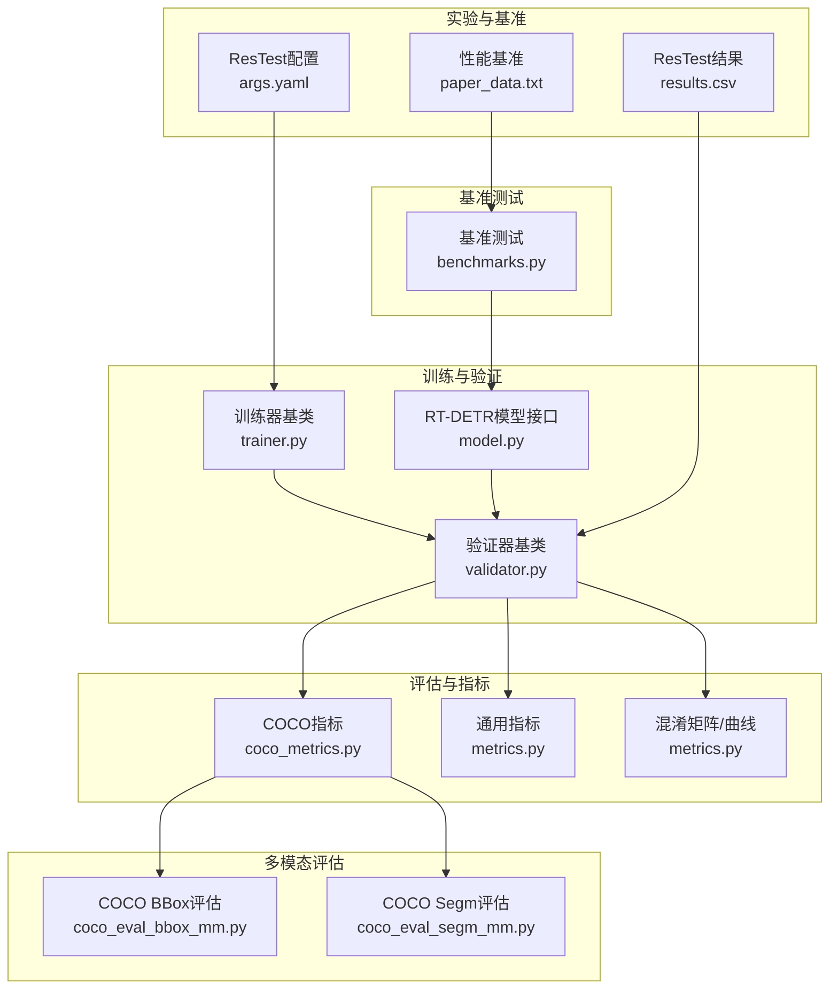
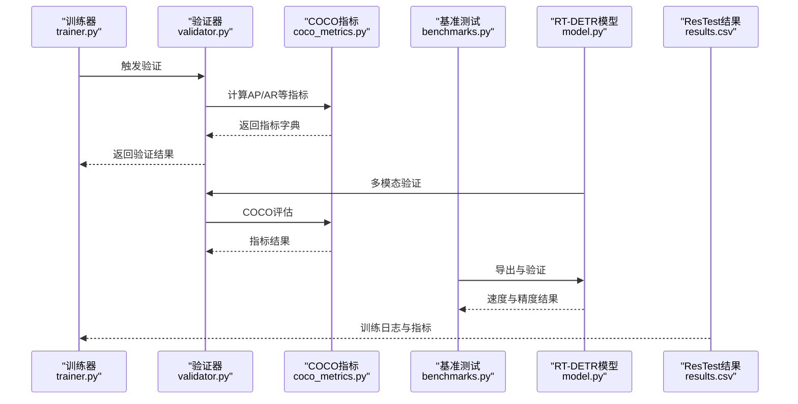
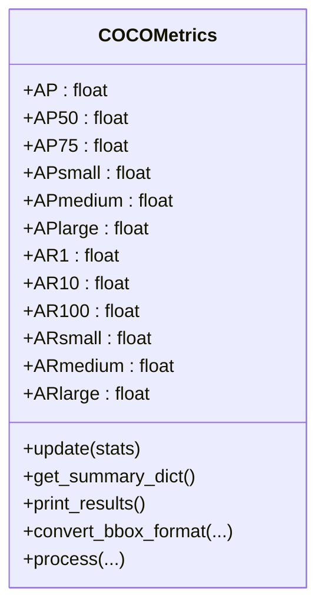
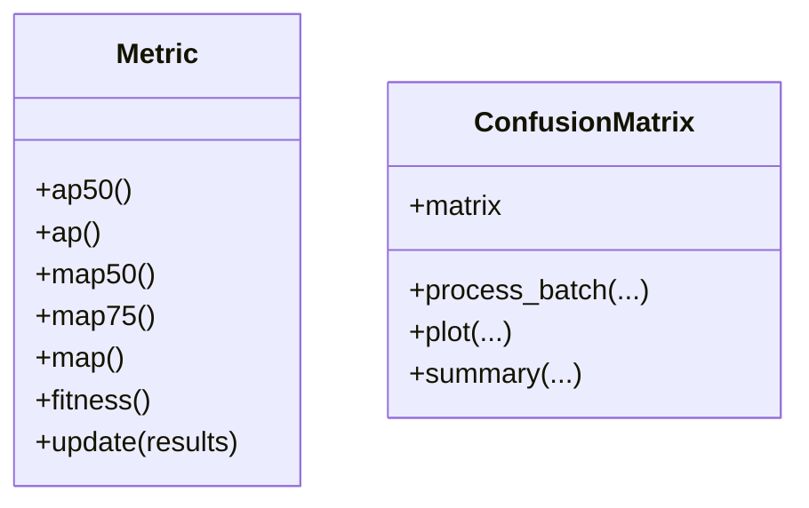
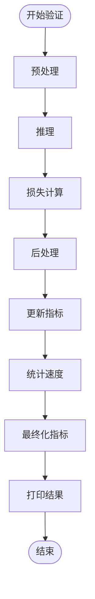
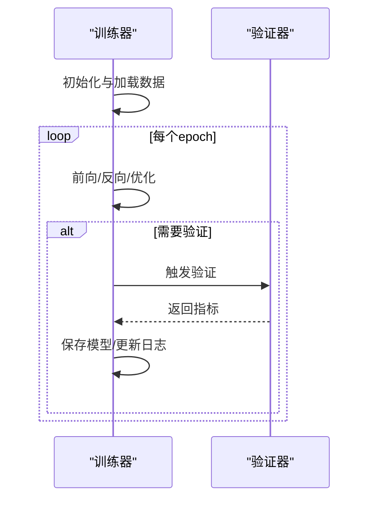
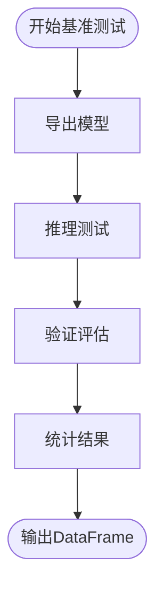
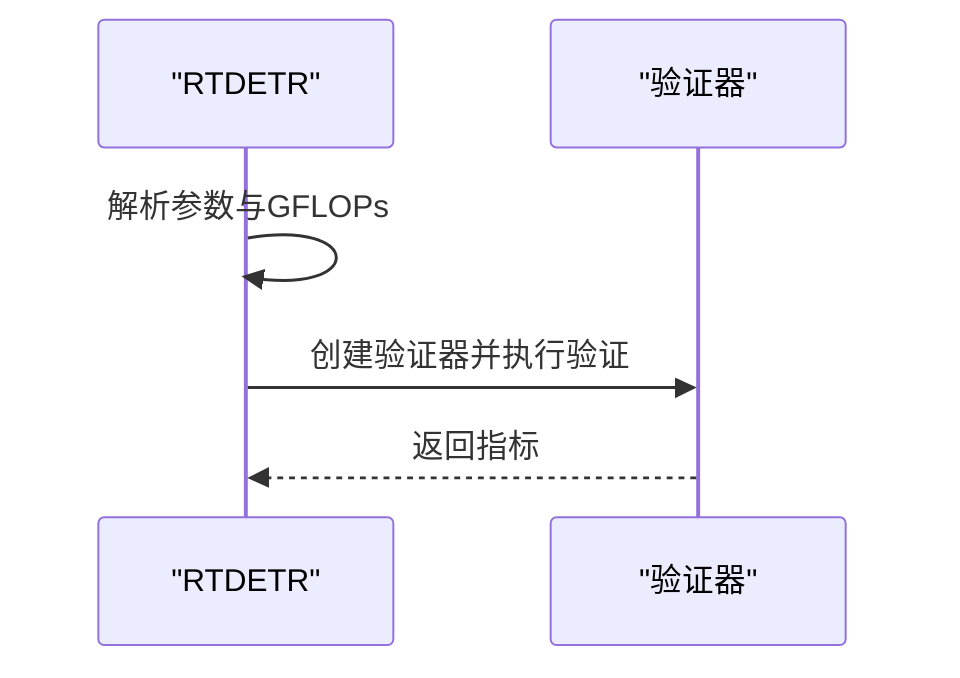
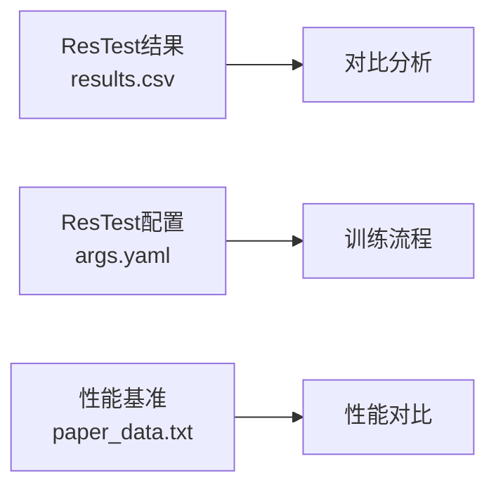
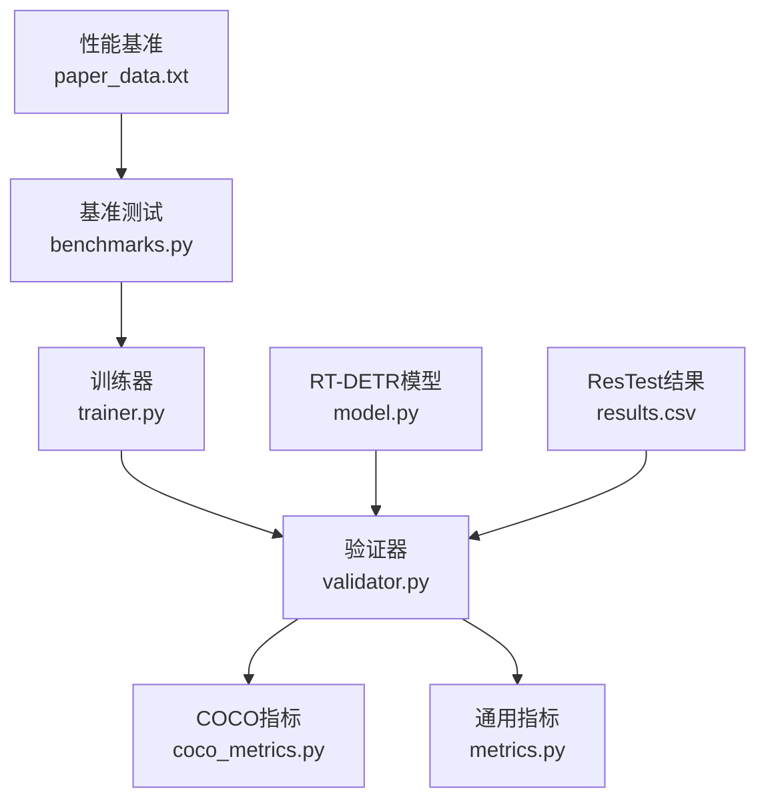

# 融合策略性能评估

<cite>
**本文档引用的文件**
- [coco_metrics.py](file://ultralytics/utils/coco_metrics.py)
- [metrics.py](file://ultralytics/utils/metrics.py)
- [validator.py](file://ultralytics/engine/validator.py)
- [benchmarks.py](file://ultralytics/utils/benchmarks.py)
- [trainer.py](file://ultralytics/engine/trainer.py)
- [model.py](file://ultralytics/models/rtdetr/model.py)
- [coco_eval_bbox_mm.py](file://ultralytics/utils/coco_eval_bbox_mm.py)
- [coco_eval_segm_mm.py](file://ultralytics/utils/coco_eval_segm_mm.py)
- [results.csv](file://ResTest/RTDETR-mid/results.csv)
- [args.yaml](file://ResTest/RTDETR-mid/args.yaml)
- [paper_data.txt](file://val/RTDETRval/paper_data.txt)
</cite>

## 目录
1. [简介](#简介)
2. [项目结构](#项目结构)
3. [核心组件](#核心组件)
4. [架构概览](#架构概览)
5. [详细组件分析](#详细组件分析)
6. [依赖关系分析](#依赖关系分析)
7. [性能考量](#性能考量)
8. [故障排查指南](#故障排查指南)
9. [结论](#结论)
10. [附录](#附录)

## 简介
本指南面向多模态融合策略的性能评估，系统阐述融合策略的评估指标体系、不同任务类型（目标检测、实例分割、旋转框检测）的评估方法与标准，提供融合策略对比分析的方法论（A/B测试设计、统计显著性检验、性能差异分析），展示ResTest实验结果的分析方法与解读技巧，并给出性能基准测试的实施步骤与最佳实践，最终形成融合策略选择的决策框架与评估工具。

## 项目结构
该项目围绕Ultralytics YOLO生态构建，包含：
- 评估与指标：COCO指标计算、通用检测指标、混淆矩阵与曲线绘制
- 训练与验证：训练器基类、验证器基类、模型封装
- 基准测试：跨格式模型的速度与精度基准
- 多模态RT-DETR：多模态检测模型接口与验证流程
- ResTest实验：大量融合策略的训练与结果记录
- 性能基准：推理耗时与FPS等性能指标

**图表来源**
- [coco_metrics.py:23-190](file://ultralytics/utils/coco_metrics.py#L23-L190)
- [metrics.py:312-542](file://ultralytics/utils/metrics.py#L312-L542)
- [validator.py:42-371](file://ultralytics/engine/validator.py#L42-L371)
- [benchmarks.py:52-212](file://ultralytics/utils/benchmarks.py#L52-L212)
- [model.py:31-120](file://ultralytics/models/rtdetr/model.py#L31-L120)
- [coco_eval_bbox_mm.py:27-266](file://ultralytics/utils/coco_eval_bbox_mm.py#L27-L266)
- [coco_eval_segm_mm.py:124-336](file://ultralytics/utils/coco_eval_segm_mm.py#L124-L336)
- [results.csv:1-152](file://ResTest/RTDETR-mid/results.csv#L1-L152)
- [args.yaml:1-135](file://ResTest/RTDETR-mid/args.yaml#L1-L135)
- [paper_data.txt:1-21](file://val/RTDETRval/paper_data.txt#L1-L21)

**章节来源**
- [coco_metrics.py:1-800](file://ultralytics/utils/coco_metrics.py#L1-L800)
- [metrics.py:1-800](file://ultralytics/utils/metrics.py#L1-L800)
- [validator.py:1-371](file://ultralytics/engine/validator.py#L1-L371)
- [benchmarks.py:1-721](file://ultralytics/utils/benchmarks.py#L1-L721)
- [model.py:1-120](file://ultralytics/models/rtdetr/model.py#L1-L120)
- [coco_eval_bbox_mm.py:1-441](file://ultralytics/utils/coco_eval_bbox_mm.py#L1-L441)
- [coco_eval_segm_mm.py:1-476](file://ultralytics/utils/coco_eval_segm_mm.py#L1-L476)
- [results.csv:1-152](file://ResTest/RTDETR-mid/results.csv#L1-L152)
- [args.yaml:1-135](file://ResTest/RTDETR-mid/args.yaml#L1-L135)
- [paper_data.txt:1-21](file://val/RTDETRval/paper_data.txt#L1-L21)

## 核心组件
- COCO指标计算：支持AP/AP50/AP75、按尺寸分类的AP/AR、AR1/AR10/AR100等标准指标，以及按IoU阈值插值的精确计算。
- 通用检测指标：提供IoU、Mask IoU、Keypoint OKS、概率IoU等计算函数，支持OBB（旋转框）场景。
- 验证器基类：统一的验证流程，包含预处理、推理、损失计算、后处理、指标更新与结果输出。
- 训练器基类：训练循环、学习率调度、早停、EMA集成、日志与可视化。
- 基准测试：跨格式模型（ONNX/TensorRT等）的速度与精度对比，支持导出、推理、验证与统计。
- 多模态RT-DETR：多模态检测模型接口，支持COCO评估与GFLOPs分析。
- ResTest实验：大量融合策略的训练配置与结果CSV，支撑对比分析。
- 性能基准：包含前处理/推理/后处理耗时、FPS、模型大小等指标。

**章节来源**
- [coco_metrics.py:23-190](file://ultralytics/utils/coco_metrics.py#L23-L190)
- [metrics.py:52-293](file://ultralytics/utils/metrics.py#L52-L293)
- [validator.py:129-250](file://ultralytics/engine/validator.py#L129-L250)
- [trainer.py:191-504](file://ultralytics/engine/trainer.py#L191-L504)
- [benchmarks.py:52-212](file://ultralytics/utils/benchmarks.py#L52-L212)
- [model.py:31-120](file://ultralytics/models/rtdetr/model.py#L31-L120)
- [coco_eval_bbox_mm.py:27-266](file://ultralytics/utils/coco_eval_bbox_mm.py#L27-L266)
- [coco_eval_segm_mm.py:124-336](file://ultralytics/utils/coco_eval_segm_mm.py#L124-L336)
- [results.csv:1-152](file://ResTest/RTDETR-mid/results.csv#L1-L152)
- [paper_data.txt:1-21](file://val/RTDETRval/paper_data.txt#L1-L21)

## 架构概览
下图展示了从训练到验证再到基准测试的整体流程，以及多模态RT-DETR的评估路径。

**图表来源**
- [trainer.py:671-684](file://ultralytics/engine/trainer.py#L671-L684)
- [validator.py:129-250](file://ultralytics/engine/validator.py#L129-L250)
- [coco_metrics.py:724-800](file://ultralytics/utils/coco_metrics.py#L724-L800)
- [benchmarks.py:52-212](file://ultralytics/utils/benchmarks.py#L52-L212)
- [model.py:77-114](file://ultralytics/models/rtdetr/model.py#L77-L114)
- [results.csv:1-152](file://ResTest/RTDETR-mid/results.csv#L1-L152)

## 详细组件分析

### COCO指标计算组件
- 支持标准12项指标：AP（IoU=0.5:0.05:0.95）、AP50、AP75、APsmall/medium/large、AR1/10/100及对应尺寸分类。
- 提供按尺寸与IoU阈值扩展的指标（如APsmall50、APmedium75等）。
- 支持按最大检测数限制（AR1/AR10/AR100）与按尺寸过滤（APsmall/medium/large）。
- 提供PR曲线、F1曲线、MC曲线等可视化辅助。

**图表来源**
- [coco_metrics.py:23-190](file://ultralytics/utils/coco_metrics.py#L23-L190)

**章节来源**
- [coco_metrics.py:23-190](file://ultralytics/utils/coco_metrics.py#L23-L190)

### 通用检测指标组件
- 提供IoU、GIoU、DIoU、CIoU、Mask IoU、Keypoint OKS、概率IoU（OBB）等计算。
- 支持ConfusionMatrix、PR/F1/MC曲线绘制与混淆矩阵导出。
- 支持按类别AP计算与曲线插值。

**图表来源**
- [metrics.py:772-797](file://ultralytics/utils/metrics.py#L772-L797)
- [metrics.py:312-426](file://ultralytics/utils/metrics.py#L312-L426)

**章节来源**
- [metrics.py:52-293](file://ultralytics/utils/metrics.py#L52-L293)
- [metrics.py:312-542](file://ultralytics/utils/metrics.py#L312-L542)

### 验证器基类组件
- 统一验证流程：预处理、推理、损失、后处理、指标更新、结果打印与保存。
- 支持速度统计（预处理/推理/损失/后处理）。
- 支持回调机制与可视化。

**图表来源**
- [validator.py:129-250](file://ultralytics/engine/validator.py#L129-L250)

**章节来源**
- [validator.py:42-371](file://ultralytics/engine/validator.py#L42-L371)

### 训练器基类组件
- 训练循环：学习率调度、梯度累积、优化器步进、早停、EMA集成。
- 验证与保存：周期性验证、保存最佳/最后模型、CSV日志。
- 内存管理：自动清理与缓存清空。

**图表来源**
- [trainer.py:344-504](file://ultralytics/engine/trainer.py#L344-L504)

**章节来源**
- [trainer.py:191-504](file://ultralytics/engine/trainer.py#L191-L504)

### 基准测试组件
- 支持多种导出格式（ONNX、TensorRT等）的速度与精度对比。
- 自动导出、推理、验证与统计，输出DataFrame结果。
- 提供RF100基准评估流程（多数据集）。

**图表来源**
- [benchmarks.py:52-212](file://ultralytics/utils/benchmarks.py#L52-L212)

**章节来源**
- [benchmarks.py:52-212](file://ultralytics/utils/benchmarks.py#L52-L212)

### 多模态RT-DETR组件
- 提供RT-DETR模型接口，支持多模态验证与COCO评估。
- 输出GFLOPs（架构级与路由感知）信息，便于性能分析。

**图表来源**
- [model.py:77-114](file://ultralytics/models/rtdetr/model.py#L77-L114)

**章节来源**
- [model.py:31-120](file://ultralytics/models/rtdetr/model.py#L31-L120)

### ResTest实验与性能基准
- ResTest目录包含大量融合策略的训练配置与结果CSV，可直接用于对比分析。
- paper_data.txt提供推理耗时、FPS、模型大小等性能基准数据。

**图表来源**
- [results.csv:1-152](file://ResTest/RTDETR-mid/results.csv#L1-L152)
- [args.yaml:1-135](file://ResTest/RTDETR-mid/args.yaml#L1-L135)
- [paper_data.txt:1-21](file://val/RTDETRval/paper_data.txt#L1-L21)

**章节来源**
- [results.csv:1-152](file://ResTest/RTDETR-mid/results.csv#L1-L152)
- [args.yaml:1-135](file://ResTest/RTDETR-mid/args.yaml#L1-L135)
- [paper_data.txt:1-21](file://val/RTDETRval/paper_data.txt#L1-L21)

## 依赖关系分析
- 验证器依赖COCO指标与通用指标模块进行评估。
- 训练器驱动验证器执行验证与保存。
- 基准测试依赖模型导出与验证流程。
- 多模态RT-DETR通过验证器执行COCO评估。
- ResTest实验与性能基准为对比分析提供数据基础。

**图表来源**
- [validator.py:129-250](file://ultralytics/engine/validator.py#L129-L250)
- [coco_metrics.py:724-800](file://ultralytics/utils/coco_metrics.py#L724-L800)
- [metrics.py:312-542](file://ultralytics/utils/metrics.py#L312-L542)
- [trainer.py:671-684](file://ultralytics/engine/trainer.py#L671-L684)
- [benchmarks.py:52-212](file://ultralytics/utils/benchmarks.py#L52-L212)
- [model.py:77-114](file://ultralytics/models/rtdetr/model.py#L77-L114)
- [results.csv:1-152](file://ResTest/RTDETR-mid/results.csv#L1-L152)
- [paper_data.txt:1-21](file://val/RTDETRval/paper_data.txt#L1-L21)

**章节来源**
- [validator.py:1-371](file://ultralytics/engine/validator.py#L1-L371)
- [coco_metrics.py:1-800](file://ultralytics/utils/coco_metrics.py#L1-L800)
- [metrics.py:1-800](file://ultralytics/utils/metrics.py#L1-L800)
- [trainer.py:1-901](file://ultralytics/engine/trainer.py#L1-L901)
- [benchmarks.py:1-721](file://ultralytics/utils/benchmarks.py#L1-L721)
- [model.py:1-120](file://ultralytics/models/rtdetr/model.py#L1-L120)
- [results.csv:1-152](file://ResTest/RTDETR-mid/results.csv#L1-L152)
- [paper_data.txt:1-21](file://val/RTDETRval/paper_data.txt#L1-L21)

## 性能考量
- 推理速度：通过验证器的speed统计与基准测试的FPS输出进行量化。
- 内存占用：训练器的内存清理与缓存清空机制有助于控制显存峰值。
- 模型大小：基准测试输出模型文件大小，结合精度进行权衡。
- 多尺度与多模态：ResTest配置中的多尺度增强与多模态增强参数影响性能与精度。

**章节来源**
- [validator.py:228-249](file://ultralytics/engine/validator.py#L228-L249)
- [benchmarks.py:194-211](file://ultralytics/utils/benchmarks.py#L194-L211)
- [trainer.py:528-541](file://ultralytics/engine/trainer.py#L528-L541)
- [args.yaml:108-134](file://ResTest/RTDETR-mid/args.yaml#L108-L134)

## 故障排查指南
- 验证失败：检查数据集路径、任务类型与验证参数，确认验证器回调与日志输出。
- 指标异常：核对COCO指标输入格式（归一化坐标、类别映射），确保按尺寸与IoU阈值正确过滤。
- 性能瓶颈：查看验证器速度统计，定位瓶颈阶段（预处理/推理/后处理）；必要时调整批大小与设备。
- 基准测试错误：确认导出格式支持与设备兼容性，检查断言条件与异常日志。

**章节来源**
- [validator.py:191-250](file://ultralytics/engine/validator.py#L191-L250)
- [coco_metrics.py:724-800](file://ultralytics/utils/coco_metrics.py#L724-L800)
- [benchmarks.py:188-193](file://ultralytics/utils/benchmarks.py#L188-L193)

## 结论
本指南提供了融合策略性能评估的完整方法论与工具链：以COCO指标为核心，结合通用检测指标与验证器流程，辅以基准测试与多模态RT-DETR评估，形成覆盖精度、召回、F1、推理速度与内存占用的综合评估体系。ResTest实验与性能基准为策略对比与决策提供了可靠的数据基础。

## 附录

### 评估指标体系与任务类型
- 目标检测（BBox）：AP/AP50/AP75、AR1/AR10/AR100、按尺寸分类AP/AR。
- 实例分割（Segm）：基于RLE的IoU评估，支持Crowd规则与面积桶过滤。
- 旋转框检测（OBB）：概率IoU与CIoU，支持角度信息。

**章节来源**
- [coco_metrics.py:23-190](file://ultralytics/utils/coco_metrics.py#L23-L190)
- [coco_eval_segm_mm.py:124-336](file://ultralytics/utils/coco_eval_segm_mm.py#L124-L336)
- [metrics.py:210-253](file://ultralytics/utils/metrics.py#L210-L253)

### 融合策略对比分析方法论
- A/B测试设计：固定随机种子与数据划分，对比同一配置下的不同融合策略。
- 统计显著性检验：采用配对t检验或Mann–Whitney U检验，比较AP/AP50等关键指标。
- 性能差异分析：关注mAP变化、推理速度变化与内存占用变化，结合置信区间进行判断。

**章节来源**
- [coco_metrics.py:724-800](file://ultralytics/utils/coco_metrics.py#L724-L800)
- [metrics.py:675-770](file://ultralytics/utils/metrics.py#L675-L770)

### ResTest实验结果分析与解读
- 结果CSV解读：epoch、训练/验证损失、精度、召回、mAP等指标随训练过程的变化趋势。
- 配置参数解读：多尺度增强、多模态增强、学习率调度、早停等参数对性能的影响。
- 基准对比：结合paper_data.txt中的FPS与耗时，评估策略在速度与精度上的平衡。

**章节来源**
- [results.csv:1-152](file://ResTest/RTDETR-mid/results.csv#L1-L152)
- [args.yaml:1-135](file://ResTest/RTDETR-mid/args.yaml#L1-L135)
- [paper_data.txt:1-21](file://val/RTDETRval/paper_data.txt#L1-L21)

### 性能基准测试实施步骤与最佳实践
- 步骤：选择模型与格式 → 导出模型 → 推理测试 → 验证评估 → 统计结果。
- 最佳实践：固定图像尺寸与批大小，启用半精度（如适用），记录前处理/推理/后处理耗时，对比不同硬件平台。

**章节来源**
- [benchmarks.py:52-212](file://ultralytics/utils/benchmarks.py#L52-L212)

### 融合策略选择的决策框架与评估工具
- 决策框架：以mAP为主要目标，兼顾推理速度与内存占用，结合业务场景（实时性/精度优先）进行权衡。
- 评估工具：COCO指标、通用指标、验证器、基准测试、ResTest结果与性能基准。

**章节来源**
- [coco_metrics.py:23-190](file://ultralytics/utils/coco_metrics.py#L23-L190)
- [metrics.py:312-542](file://ultralytics/utils/metrics.py#L312-L542)
- [validator.py:129-250](file://ultralytics/engine/validator.py#L129-L250)
- [benchmarks.py:52-212](file://ultralytics/utils/benchmarks.py#L52-L212)
- [results.csv:1-152](file://ResTest/RTDETR-mid/results.csv#L1-L152)
- [paper_data.txt:1-21](file://val/RTDETRval/paper_data.txt#L1-L21)