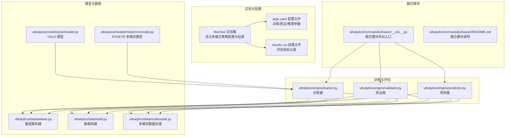
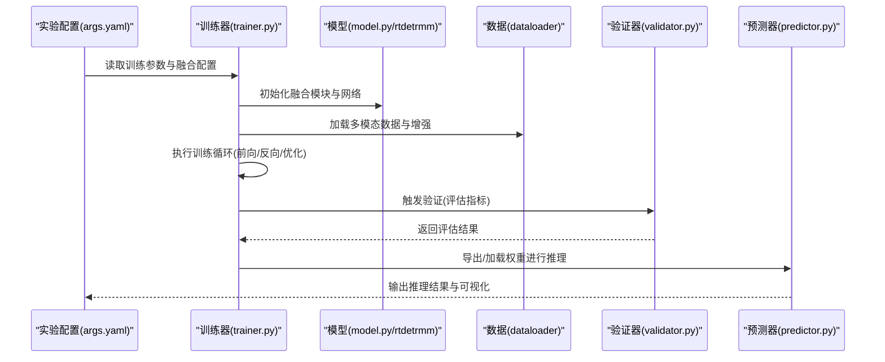
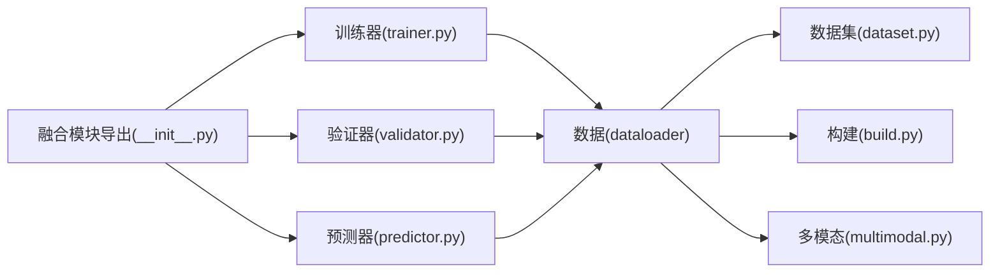

# 融合策略调优

<cite>
**本文引用的文件**
- [ultralytics/nn/modules/fusion/__init__.py](file://ultralytics/nn/modules/fusion/__init__.py)
- [ResTest/aifi-dattention-CSP-MutilScaleEdgeInformationEnhance-ASF-P2-lite-BackboneFreqFusion/args.yaml](file://ResTest/aifi-dattention-CSP-MutilScaleEdgeInformationEnhance-ASF-P2-lite-BackboneFreqFusion/args.yaml)
- [ResTest/aifi-dattention-CSP-MutilScaleEdgeInformationEnhance-ASF-P2-lite-BackboneFreqFusion/results.csv](file://ResTest/aifi-dattention-CSP-MutilScaleEdgeInformationEnhance-ASF-P2-lite-BackboneFreqFusion/results.csv)
- [ResTest/aifi-dattention-CSP-MutilScaleEdgeInformationEnhance-ASF-P2-lite-BackboneConvMixFusion/args.yaml](file://ResTest/aifi-dattention-CSP-MutilScaleEdgeInformationEnhance-ASF-P2-lite-BackboneConvMixFusion/args.yaml)
- [ResTest/aifi-dattention-CSP-MutilScaleEdgeInformationEnhance-ASF-P2-lite-BackboneChannelGate/args.yaml](file://ResTest/aifi-dattention-CSP-MutilScaleEdgeInformationEnhance-ASF-P2-lite-BackboneChannelGate/args.yaml)
- [ResTest/aifi-dattention-CSP-MutilScaleEdgeInformationEnhance-ASF-P2-lite-BackboneScalarGate/args.yaml](file://ResTest/aifi-dattention-CSP-MutilScaleEdgeInformationEnhance-ASF-P2-lite-BackboneScalarGate/args.yaml)
- [ResTest/aifi-dattention-CSP-MutilScaleEdgeInformationEnhance-ASF-P2-lite-BackboneFeatureFusion/args.yaml](file://ResTest/aifi-dattention-CSP-MutilScaleEdgeInformationEnhance-ASF-P2-lite-BackboneFeatureFusion/args.yaml)
- [ResTest/aifi-dattention-CSP-MutilScaleEdgeInformationEnhance-ASF-P2-lite-BackboneCrossAttentionBlock/args.yaml](file://ResTest/aifi-dattention-CSP-MutilScaleEdgeInformationEnhance-ASF-P2-lite-BackboneCrossAttentionBlock/args.yaml)
- [ResTest/aifi-dattention-CSP-MutilScaleEdgeInformationEnhance-ASF-P2-lite-BackboneMultiScaleGatedAttn/args.yaml](file://ResTest/aifi-dattention-CSP-MutilScaleEdgeInformationEnhance-ASF-P2-lite-BackboneMultiScaleGatedAttn/args.yaml)
- [ResTest/aifi-dattention-CSP-MutilScaleEdgeInformationEnhance-ASF-P2-lite-BackbonePSFM/args.yaml](file://ResTest/aifi-dattention-CSP-MutilScaleEdgeInformationEnhance-ASF-P2-lite-BackbonePSFM/args.yaml)
- [ResTest/aifi-dattention-CSP-MutilScaleEdgeInformationEnhance-ASF-P2-lite-BackboneSEFN/args.yaml](file://ResTest/aifi-dattention-CSP-MutilScaleEdgeInformationEnhance-ASF-P2-lite-BackboneSEFN/args.yaml)
- [ResTest/aifi-dattention-CSP-MutilScaleEdgeInformationEnhance-ASF-P2-lite-BackboneSEFN2/args.yaml](file://ResTest/aifi-dattention-CSP-MutilScaleEdgeInformationEnhance-ASF-P2-lite-BackboneSEFN2/args.yaml)
- [ResTest/aifi-dattention-CSP-MutilScaleEdgeInformationEnhance-ASF-P2-lite-BackboneSEFN3/args.yaml](file://ResTest/aifi-dattention-CSP-MutilScaleEdgeInformationEnhance-ASF-P2-lite-BackboneSEFN3/args.yaml)
- [ResTest/aifi-dattention-CSP-MutilScaleEdgeInformationEnhance-ASF-P2-lite-BackboneBiFPNFusion/args.yaml](file://ResTest/aifi-dattention-CSP-MutilScaleEdgeInformationEnhance-ASF-P2-lite-BackboneBiFPNFusion/args.yaml)
- [ResTest/aifi-dattention-CSP-MutilScaleEdgeInformationEnhance-ASF-P2-lite-BackboneCGAFusion/args.yaml](file://ResTest/aifi-dattention-CSP-MutilScaleEdgeInformationEnhance-ASF-P2-lite-BackboneCGAFusion/args.yaml)
- [ResTest/aifi-dattention-CSP-MutilScaleEdgeInformationEnhance-ASF-P2-lite-BackboneCTrans/args.yaml](file://ResTest/aifi-dattention-CSP-MutilScaleEdgeInformationEnhance-ASF-P2-lite-BackboneCTrans/args.yaml)
- [ResTest/aifi-dattention-CSP-MutilScaleEdgeInformationEnhance-ASF-P2-lite-BackboneCTrans2/args.yaml](file://ResTest/aifi-dattention-CSP-MutilScaleEdgeInformationEnhance-ASF-P2-lite-BackboneCTrans2/args.yaml)
- [ResTest/aifi-dattention-CSP-MutilScaleEdgeInformationEnhance-ASF-P2-lite-BackboneContextGuideFusionModule/args.yaml](file://ResTest/aifi-dattention-CSP-MutilScaleEdgeInformationEnhance-ASF-P2-lite-BackboneContextGuideFusionModule/args.yaml)
- [ResTest/aifi-dattention-CSP-MutilScaleEdgeInformationEnhance-ASF-P2-lite-BackboneDynamicInterpolationFusion/args.yaml](file://ResTest/aifi-dattention-CSP-MutilScaleEdgeInformationEnhance-ASF-P2-lite-BackboneDynamicInterpolationFusion/args.yaml)
- [ResTest/aifi-dattention-CSP-MutilScaleEdgeInformationEnhance-ASF-P2-lite-BackboneGDSAFusion/args.yaml](file://ResTest/aifi-dattention-CSP-MutilScaleEdgeInformationEnhance-ASF-P2-lite-BackboneGDSAFusion/args.yaml)
- [ResTest/aifi-dattention-CSP-MutilScaleEdgeInformationEnhance-ASF-P2-lite-BackboneGDSAFusion2/args.yaml](file://ResTest/aifi-dattention-CSP-MutilScaleEdgeInformationEnhance-ASF-P2-lite-BackboneGDSAFusion2/args.yaml)
- [ResTest/aifi-dattention-CSP-MutilScaleEdgeInformationEnhance-ASF-P2-lite-BackboneGLSA/args.yaml](file://ResTest/aifi-dattention-CSP-MutilScaleEdgeInformationEnhance-ASF-P2-lite-BackboneGLSA/args.yaml)
- [ResTest/aifi-dattention-CSP-MutilScaleEdgeInformationEnhance-ASF-P2-lite-BackboneGLSA2/args.yaml](file://ResTest/aifi-dattention-CSP-MutilScaleEdgeInformationEnhance-ASF-P2-lite-BackboneGLSA2/args.yaml)
- [ResTest/aifi-dattention-CSP-MutilScaleEdgeInformationEnhance-ASF-P2-lite-BackboneGLSA3/args.yaml](file://ResTest/aifi-dattention-CSP-MutilScaleEdgeInformationEnhance-ASF-P2-lite-BackboneGLSA3/args.yaml)
- [ResTest/aifi-dattention-CSP-MutilScaleEdgeInformationEnhance-ASF-P2-lite-BackboneGatedConcat/args.yaml](file://ResTest/aifi-dattention-CSP-MutilScaleEdgeInformationEnhance-ASF-P2-lite-BackboneGatedConcat/args.yaml)
- [ResTest/aifi-dattention-CSP-MutilScaleEdgeInformationEnhance-ASF-P2-lite-BackboneMCFGatedAdd/args.yaml](file://ResTest/aifi-dattention-CSP-MutilScaleEdgeInformationEnhance-ASF-P2-lite-BackboneMCFGatedAdd/args.yaml)
- [ResTest/aifi-dattention-CSP-MutilScaleEdgeInformationEnhance-ASF-P2-lite-BackboneWeightFusion/args.yaml](file://ResTest/aifi-dattention-CSP-MutilScaleEdgeInformationEnhance-ASF-P2-lite-BackboneWeightFusion/args.yaml)
- [ResTest/aifi-dattention-CSP-MutilScaleEdgeInformationEnhance-ASF-P2-lite-BackboneWeightFusion2/args.yaml](file://ResTest/aifi-dattention-CSP-MutilScaleEdgeInformationEnhance-ASF-P2-lite-BackboneWeightFusion2/args.yaml)
- [ResTest/aifi-dattention-CSP-MutilScaleEdgeInformationEnhance-ASF-P2-lite-BackboneWeightFusion3/args.yaml](file://ResTest/aifi-dattention-CSP-MutilScaleEdgeInformationEnhance-ASF-P2-lite-BackboneWeightFusion3/args.yaml)
- [ResTest/aifi-dattention-CSP-MutilScaleEdgeInformationEnhance-ASF-P2-lite-BackboneSDFM/args.yaml](file://ResTest/aifi-dattention-CSP-MutilScaleEdgeInformationEnhance-ASF-P2-lite-BackboneSDFM/args.yaml)
- [ResTest/aifi-dattention-CSP-MutilScaleEdgeInformationEnhance-ASF-P2-lite-BackboneCFPT-P3456/args.yaml](file://ResTest/aifi-dattention-CSP-MutilScaleEdgeInformationEnhance-ASF-P2-lite-BackboneCFPT-P3456/args.yaml)
- [ResTest/aifi-dattention-CSP-MutilScaleEdgeInformationEnhance-ASF-P2-lite-BackboneCFPT-P34562/args.yaml](file://ResTest/aifi-dattention-CSP-MutilScaleEdgeInformationEnhance-ASF-P2-lite-BackboneCFPT-P34562/args.yaml)
- [ResTest/aifi-dattention-CSP-MutilScaleEdgeInformationEnhance-ASF-P2-lite-BackboneCAB/args.yaml](file://ResTest/aifi-dattention-CSP-MutilScaleEdgeInformationEnhance-ASF-P2-lite-BackboneCAB/args.yaml)
- [ResTest/aifi-dattention-CSP-MutilScaleEdgeInformationEnhance-ASF-P2-lite-BackboneCAFMFusion/args.yaml](file://ResTest/aifi-dattention-CSP-MutilScaleEdgeInformationEnhance-ASF-P2-lite-BackboneCAFMFusion/args.yaml)
- [ResTest/aifi-dattention-CSP-MutilScaleEdgeInformationEnhance-ASF-P2-lite-BackboneDPCF/args.yaml](file://ResTest/aifi-dattention-CSP-MutilScaleEdgeInformationEnhance-ASF-P2-lite-BackboneDPCF/args.yaml)
- [ResTest/aifi-dattention-CSP-MutilScaleEdgeInformationEnhance-ASF-P2-lite-BackboneELA-HSFPN/args.yaml](file://ResTest/aifi-dattention-CSP-MutilScaleEdgeInformationEnhance-ASF-P2-lite-BackboneELA-HSFPN/args.yaml)
- [ResTest/aifi-dattention-CSP-MutilScaleEdgeInformationEnhance-ASF-P2-lite-BackboneFSA/args.yaml](file://ResTest/aifi-dattention-CSP-MutilScaleEdgeInformationEnhance-ASF-P2-lite-BackboneFSA/args.yaml)
- [ResTest/aifi-dattention-CSP-MutilScaleEdgeInformationEnhance-ASF-P2-lite-BackboneFreqFFPN/args.yaml](file://ResTest/aifi-dattention-CSP-MutilScaleEdgeInformationEnhance-ASF-P2-lite-BackboneFreqFFPN/args.yaml)
- [ResTest/aifi-dattention-CSP-MutilScaleEdgeInformationEnhance-ASF-P2-lite-BackboneGDSAFusion/args.yaml](file://ResTest/aifi-dattention-CSP-MutilScaleEdgeInformationEnhance-ASF-P2-lite-BackboneGDSAFusion/args.yaml)
- [ResTest/aifi-dattention-CSP-MutilScaleEdgeInformationEnhance-ASF-P2-lite-BackboneGLSA/args.yaml](file://ResTest/aifi-dattention-CSP-MutilScaleEdgeInformationEnhance-ASF-P2-lite-BackboneGLSA/args.yaml)
- [ResTest/aifi-dattention-CSP-MutilScaleEdgeInformationEnhance-ASF-P2-lite-BackboneHS-FPN/args.yaml](file://ResTest/aifi-dattention-CSP-MutilScaleEdgeInformationEnhance-ASF-P2-lite-BackboneHS-FPN/args.yaml)
- [ResTest/aifi-dattention-CSP-MutilScaleEdgeInformationEnhance-ASF-P2-lite-BackboneHSPAN/args.yaml](file://ResTest/aifi-dattention-CSP-MutilScaleEdgeInformationEnhance-ASF-P2-lite-BackboneHSPAN/args.yaml)
- [ResTest/aifi-dattention-CSP-MutilScaleEdgeInformationEnhance-ASF-P2-lite-BackboneHyperACE/args.yaml](file://ResTest/aifi-dattention-CSP-MutilScaleEdgeInformationEnhance-ASF-P2-lite-BackboneHyperACE/args.yaml)
- [ResTest/aifi-dattention-CSP-MutilScaleEdgeInformationEnhance-ASF-P2-lite-BackboneMAN-FasterCGLU/args.yaml](file://ResTest/aifi-dattention-CSP-MutilScaleEdgeInformationEnhance-ASF-P2-lite-BackboneMAN-FasterCGLU/args.yaml)
- [ResTest/aifi-dattention-CSP-MutilScaleEdgeInformationEnhance-ASF-P2-lite-BackboneMFM/args.yaml](file://ResTest/aifi-dattention-CSP-MutilScaleEdgeInformationEnhance-ASF-P2-lite-BackboneMFM/args.yaml)
- [ResTest/aifi-dattention-CSP-MutilScaleEdgeInformationEnhance-ASF-P2-lite-BackboneMSGA/args.yaml](file://ResTest/aifi-dattention-CSP-MutilScaleEdgeInformationEnhance-ASF-P2-lite-BackboneMSGA/args.yaml)
- [ResTest/aifi-dattention-CSP-MutilScaleEdgeInformationEnhance-ASF-P2-lite-BackboneMSGA2/args.yaml](file://ResTest/aifi-dattention-CSP-MutilScaleEdgeInformationEnhance-ASF-P2-lite-BackboneMSGA2/args.yaml)
- [ResTest/aifi-dattention-CSP-MutilScaleEdgeInformationEnhance-ASF-P2-lite-BackboneMSGA3/args.yaml](file://ResTest/aifi-dattention-CSP-MutilScaleEdgeInformationEnhance-ASF-P2-lite-BackboneMSGA3/args.yaml)
- [ResTest/aifi-dattention-CSP-MutilScaleEdgeInformationEnhance-ASF-P2-lite-BackbonePSFM/args.yaml](file://ResTest/aifi-dattention-CSP-MutilScaleEdgeInformationEnhance-ASF-P2-lite-BackbonePSFM/args.yaml)
- [ResTest/aifi-dattention-CSP-MutilScaleEdgeInformationEnhance-ASF-P2-lite-BackbonePST/args.yaml](file://ResTest/aifi-dattention-CSP-MutilScaleEdgeInformationEnhance-ASF-P2-lite-BackbonePST/args.yaml)
- [ResTest/aifi-dattention-CSP-MutilScaleEdgeInformationEnhance-ASF-P2-lite-BackboneRFPN/args.yaml](file://ResTest/aifi-dattention-CSP-MutilScaleEdgeInformationEnhance-ASF-P2-lite-BackboneRFPN/args.yaml)
- [ResTest/aifi-dattention-CSP-MutilScaleEdgeInformationEnhance-ASF-P2-lite-BackboneReCalibrationFPN-P2345/args.yaml](file://ResTest/aifi-dattention-CSP-MutilScaleEdgeInformationEnhance-ASF-P2-lite-BackboneReCalibrationFPN-P2345/args.yaml)
- [ResTest/aifi-dattention-CSP-MutilScaleEdgeInformationEnhance-ASF-P2-lite-BackboneSDFM/args.yaml](file://ResTest/aifi-dattention-CSP-MutilScaleEdgeInformationEnhance-ASF-P2-lite-BackboneSDFM/args.yaml)
- [ResTest/aifi-dattention-CSP-MutilScaleEdgeInformationEnhance-ASF-P2-lite-BackboneWFU/args.yaml](file://ResTest/aifi-dattention-CSP-MutilScaleEdgeInformationEnhance-ASF-P2-lite-BackboneWFU/args.yaml)
- [ResTest/aifi-dattention-CSP-MutilScaleEdgeInformationEnhance-ASF-P2-lite-BackboneWFU2/args.yaml](file://ResTest/aifi-dattention-CSP-MutilScaleEdgeInformationEnhance-ASF-P2-lite-BackboneWFU2/args.yaml)
- [ResTest/aifi-dattention-CSP-MutilScaleEdgeInformationEnhance-ASF-P2-lite-bifpn/args.yaml](file://ResTest/aifi-dattention-CSP-MutilScaleEdgeInformationEnhance-ASF-P2-lite-bifpn/args.yaml)
- [ResTest/aifi-dattention-CSP-MutilScaleEdgeInformationEnhance-ASF-P2-lite-bifpn-GLSA/args.yaml](file://ResTest/aifi-dattention-CSP-MutilScaleEdgeInformationEnhance-ASF-P2-lite-bifpn-GLSA/args.yaml)
- [ResTest/aifi-dattention-CSP-MutilScaleEdgeInformationEnhance-ASF-P2-lite-bifpn-GLSA2/args.yaml](file://ResTest/aifi-dattention-CSP-MutilScaleEdgeInformationEnhance-ASF-P2-lite-bifpn-GLSA2/args.yaml)
- [ResTest/aifi-dattention-CSP-MutilScaleEdgeInformationEnhance-ASF-P2-lite-cgrfpn/args.yaml](file://ResTest/aifi-dattention-CSP-MutilScaleEdgeInformationEnhance-ASF-P2-lite-cgrfpn/args.yaml)
- [ResTest/aifi-dattention-CSP-MutilScaleEdgeInformationEnhance-ASF-P2-lite-contextguidefpn/args.yaml](file://ResTest/aifi-dattention-CSP-MutilScaleEdgeInformationEnhance-ASF-P2-lite-contextguidefpn/args.yaml)
- [ResTest/aifi-dattention-CSP-MutilScaleEdgeInformationEnhance-ASF-P2-lite-contextguidefpn2/args.yaml](file://ResTest/aifi-dattention-CSP-MutilScaleEdgeInformationEnhance-ASF-P2-lite-contextguidefpn2/args.yaml)
- [ResTest/aifi-dattention-CSP-MutilScaleEdgeInformationEnhance-ASF-P2-lite-embsfpn/args.yaml](file://ResTest/aifi-dattention-CSP-MutilScaleEdgeInformationEnhance-ASF-P2-lite-embsfpn/args.yaml)
- [ResTest/aifi-dattention-CSP-MutilScaleEdgeInformationEnhance-ASF-P2-lite-embsfpn-sc/args.yaml](file://ResTest/aifi-dattention-CSP-MutilScaleEdgeInformationEnhance-ASF-P2-lite-embsfpn-sc/args.yaml)
- [ResTest/aifi-dattention-CSP-MutilScaleEdgeInformationEnhance-ASF-P2-lite-fdpn/args.yaml](file://ResTest/aifi-dattention-CSP-MutilScaleEdgeInformationEnhance-ASF-P2-lite-fdpn/args.yaml)
- [ResTest/aifi-dattention-CSP-MutilScaleEdgeInformationEnhance-ASF-P2-lite-fdpn-dasi/args.yaml](file://ResTest/aifi-dattention-CSP-MutilScaleEdgeInformationEnhance-ASF-P2-lite-fdpn-dasi/args.yaml)
- [ResTest/aifi-dattention-CSP-MutilScaleEdgeInformationEnhance-ASF-P2-lite-fdpn2/args.yaml](file://ResTest/aifi-dattention-CSP-MutilScaleEdgeInformationEnhance-ASF-P2-lite-fdpn2/args.yaml)
- [ResTest/aifi-dattention-CSP-MutilScaleEdgeInformationEnhance-ASF-P2-lite-fdpn3/args.yaml](file://ResTest/aifi-dattention-CSP-MutilScaleEdgeInformationEnhance-ASF-P2-lite-fdpn3/args.yaml)
- [ResTest/aifi-dattention-CSP-MutilScaleEdgeInformationEnhance-ASF-P2-lite-fdpn4/args.yaml](file://ResTest/aifi-dattention-CSP-MutilScaleEdgeInformationEnhance-ASF-P2-lite-fdpn4/args.yaml)
- [ResTest/aifi-dattention-CSP-MutilScaleEdgeInformationEnhance-ASF-P2-lite-goldyolo-asf/args.yaml](file://ResTest/aifi-dattention-CSP-MutilScaleEdgeInformationEnhance-ASF-P2-lite-goldyolo-asf/args.yaml)
- [ResTest/aifi-dattention-CSP-MutilScaleEdgeInformationEnhance-ASF-P2-lite-hypercompute-mfm/args.yaml](file://ResTest/aifi-dattention-CSP-MutilScaleEdgeInformationEnhance-ASF-P2-lite-hypercompute-mfm/args.yaml)
- [ResTest/aifi-dattention-CSP-MutilScaleEdgeInformationEnhance-ASF-P2-lite-man-star/args.yaml](file://ResTest/aifi-dattention-CSP-MutilScaleEdgeInformationEnhance-ASF-P2-lite-man-star/args.yaml)
- [ResTest/aifi-dattention-CSP-MutilScaleEdgeInformationEnhance-ASF-P2-lite-man-star2/args.yaml](file://ResTest/aifi-dattention-CSP-MutilScaleEdgeInformationEnhance-ASF-P2-lite-man-star2/args.yaml)
- [ResTest/aifi-dattention-CSP-MutilScaleEdgeInformationEnhance-ASF-P2-lite-man-star3/args.yaml](file://ResTest/aifi-dattention-CSP-MutilScaleEdgeInformationEnhance-ASF-P2-lite-man-star3/args.yaml)
- [ResTest/aifi-dattention-CSP-MutilScaleEdgeInformationEnhance-ASF-P2-lite-mfmmafpn/args.yaml](file://ResTest/aifi-dattention-CSP-MutilScaleEdgeInformationEnhance-ASF-P2-lite-mfmmafpn/args.yaml)
- [ResTest/aifi-dattention-CSP-MutilScaleEdgeInformationEnhance-ASF-P2-lite-p6-CTrans/args.yaml](file://ResTest/aifi-dattention-CSP-MutilScaleEdgeInformationEnhance-ASF-P2-lite-p6-CTrans/args.yaml)
- [ResTest/aifi-dattention-CSP-MutilScaleEdgeInformationEnhance-ASF-P2-lite-pacapn/args.yaml](file://ResTest/aifi-dattention-CSP-MutilScaleEdgeInformationEnhance-ASF-P2-lite-pacapn/args.yaml)
- [ResTest/aifi-dattention-CSP-MutilScaleEdgeInformationEnhance-ASF-P2-lite-slimneck-ASF/args.yaml](file://ResTest/aifi-dattention-CSP-MutilScaleEdgeInformationEnhance-ASF-P2-lite-slimneck-ASF/args.yaml)
- [ResTest/aifi-dattention-CSP-MutilScaleEdgeInformationEnhance-ASF-P2-lite-slimneck-wfu/args.yaml](file://ResTest/aifi-dattention-CSP-MutilScaleEdgeInformationEnhance-ASF-P2-lite-slimneck-wfu/args.yaml)
- [ResTest/aifi-dattention-CSP-MutilScaleEdgeInformationEnhance-ASF-P2-lite-soep-mfm/args.yaml](file://ResTest/aifi-dattention-CSP-MutilScaleEdgeInformationEnhance-ASF-P2-lite-soep-mfm/args.yaml)
- [ResTest/aifi-dattention-CSP-MutilScaleEdgeInformationEnhance-ASF-P2-lite-soep-mfm-rfpn/args.yaml](file://ResTest/aifi-dattention-CSP-MutilScaleEdgeInformationEnhance-ASF-P2-lite-soep-mfm-rfpn/args.yaml)
- [ResTest/aifi-dattention-CSP-MutilScaleEdgeInformationEnhance-ASF-P2-lite-soep-pst/args.yaml](file://ResTest/aifi-dattention-CSP-MutilScaleEdgeInformationEnhance-ASF-P2-lite-soep-pst/args.yaml)
- [ResTest/aifi-dattention-CSP-MutilScaleEdgeInformationEnhance-ASF-P2-lite-soep-rfpn/args.yaml](file://ResTest/aifi-dattention-CSP-MutilScaleEdgeInformationEnhance-ASF-P2-lite-soep-rfpn/args.yaml)
- [ResTest/aifi-dattention-CSP-MutilScaleEdgeInformationEnhance-ASF-P2-litev-MAN-Faster/args.yaml](file://ResTest/aifi-dattention-CSP-MutilScaleEdgeInformationEnhance-ASF-P2-litev-MAN-Faster/args.yaml)
- [ResTest/aifi-dattention-CSP-MutilScaleEdgeInformationEnhance-ASF-P2-litev-bimafpn/args.yaml](file://ResTest/aifi-dattention-CSP-MutilScaleEdgeInformationEnhance-ASF-P2-litev-bimafpn/args.yaml)
- [ResTest/aifi-dattention-CSP-MutilScaleEdgeInformationEnhance-ASF-P2-lite-AddFusion/args.yaml](file://ResTest/aifi-dattention-CSP-MutilScaleEdgeInformationEnhance-ASF-P2-lite-AddFusion/args.yaml)
- [ResTest/aifi-dattention-CSP-MutilScaleEdgeInformationEnhance-ASF-P2-lite-AddFusion2/args.yaml](file://ResTest/aifi-dattention-CSP-MutilScaleEdgeInformationEnhance-ASF-P2-lite-AddFusion2/args.yaml)
- [ResTest/aifi-dattention-CSP-MutilScaleEdgeInformationEnhance-ASF-P2-lite-AdaptiveFusion/args.yaml](file://ResTest/aifi-dattention-CSP-MutilScaleEdgeInformationEnhance-ASF-P2-lite-AdaptiveFusion/args.yaml)
- [ResTest/aifi-dattention-CSP-MutilScaleEdgeInformationEnhance-ASF-P2-lite-CGAFusion/args.yaml](file://ResTest/aifi-dattention-CSP-MutilScaleEdgeInformationEnhance-ASF-P2-lite-CGAFusion/args.yaml)
- [ResTest/aifi-dattention-CSP-MutilScaleEdgeInformationEnhance-ASF-P2-lite-CTrans/args.yaml](file://ResTest/aifi-dattention-CSP-MutilScaleEdgeInformationEnhance-ASF-P2-lite-CTrans/args.yaml)
- [ResTest/aifi-dattention-CSP-MutilScaleEdgeInformationEnhance-ASF-P2-lite-CTrans2/args.yaml](file://ResTest/aifi-dattention-CSP-MutilScaleEdgeInformationEnhance-ASF-P2-lite-CTrans2/args.yaml)
- [ResTest/aifi-dattention-CSP-MutilScaleEdgeInformationEnhance-ASF-P2-lite-DynamicInterpolationFusion/args.yaml](file://ResTest/aifi-dattention-CSP-MutilScaleEdgeInformationEnhance-ASF-P2-lite-DynamicInterpolationFusion/args.yaml)
- [ResTest/aifi-dattention-CSP-MutilScaleEdgeInformationEnhance-ASF-P2-lite-GDSAFusion/args.yaml](file://ResTest/aifi-dattention-CSP-MutilScaleEdgeInformationEnhance-ASF-P2-lite-GDSAFusion/args.yaml)
- [ResTest/aifi-dattention-CSP-MutilScaleEdgeInformationEnhance-ASF-P2-lite-GDSAFusion2/args.yaml](file://ResTest/aifi-dattention-CSP-MutilScaleEdgeInformationEnhance-ASF-P2-lite-GDSAFusion2/args.yaml)
- [ResTest/aifi-dattention-CSP-MutilScaleEdgeInformationEnhance-ASF-P2-lite-GLSA/args.yaml](file://ResTest/aifi-dattention-CSP-MutilScaleEdgeInformationEnhance-ASF-P2-lite-GLSA/args.yaml)
- [ResTest/aifi-dattention-CSP-MutilScaleEdgeInformationEnhance-ASF-P2-lite-GLSA2/args.yaml](file://ResTest/aifi-dattention-CSP-MutilScaleEdgeInformationEnhance-ASF-P2-lite-GLSA2/args.yaml)
- [ResTest/aifi-dattention-CSP-MutilScaleEdgeInformationEnhance-ASF-P2-lite-GLSA3/args.yaml](file://ResTest/aifi-dattention-CSP-MutilScaleEdgeInformationEnhance-ASF-P2-lite-GLSA3/args.yaml)
- [ResTest/aifi-dattention-CSP-MutilScaleEdgeInformationEnhance-ASF-P2-lite-GatedConcat/args.yaml](file://ResTest/aifi-dattention-CSP-MutilScaleEdgeInformationEnhance-ASF-P2-lite-GatedConcat/args.yaml)
- [ResTest/aifi-dattention-CSP-MutilScaleEdgeInformationEnhance-ASF-P2-lite-MCFGatedAdd/args.yaml](file://ResTest/aifi-dattention-CSP-MutilScaleEdgeInformationEnhance-ASF-P2-lite-MCFGatedAdd/args.yaml)
- [ResTest/aifi-dattention-CSP-MutilScaleEdgeInformationEnhance-ASF-P2-lite-WeightFusion/args.yaml](file://ResTest/aifi-dattention-CSP-MutilScaleEdgeInformationEnhance-ASF-P2-lite-WeightFusion/args.yaml)
- [ResTest/aifi-dattention-CSP-MutilScaleEdgeInformationEnhance-ASF-P2-lite-WeightFusion2/args.yaml](file://ResTest/aifi-dattention-CSP-MutilScaleEdgeInformationEnhance-ASF-P2-lite-WeightFusion2/args.yaml)
- [ResTest/aifi-dattention-CSP-MutilScaleEdgeInformationEnhance-ASF-P2-lite-WeightFusion3/args.yaml](file://ResTest/aifi-dattention-CSP-MutilScaleEdgeInformationEnhance-ASF-P2-lite-WeightFusion3/args.yaml)
- [ResTest/aifi-dattention-CSP-MutilScaleEdgeInformationEnhance-ASF-P2-litev2/args.yaml](file://ResTest/aifi-dattention-CSP-MutilScaleEdgeInformationEnhance-ASF-P2-litev2/args.yaml)
- [ResTest/aifi-dattention-CSP-MutilScaleEdgeInformationEnhance-ASF-P2-litev3/args.yaml](file://ResTest/aifi-dattention-CSP-MutilScaleEdgeInformationEnhance-ASF-P2-litev3/args.yaml)
- [ResTest/aifi-dattention-CSP-MutilScaleEdgeInformationEnhance-CA-HSFPN/args.yaml](file://ResTest/aifi-dattention-CSP-MutilScaleEdgeInformationEnhance-CA-HSFPN/args.yaml)
- [ResTest/aifi-dattention-CSP-MutilScaleEdgeInformationEnhance-CAA-HSFPN/args.yaml](file://ResTest/aifi-dattention-CSP-MutilScaleEdgeInformationEnhance-CAA-HSFPN/args.yaml)
- [ResTest/aifi-dattention-CSP-MutilScaleEdgeInformationEnhance-CAB/args.yaml](file://ResTest/aifi-dattention-CSP-MutilScaleEdgeInformationEnhance-CAB/args.yaml)
- [ResTest/aifi-dattention-CSP-MutilScaleEdgeInformationEnhance-CAFMFusion/args.yaml](file://ResTest/aifi-dattention-CSP-MutilScaleEdgeInformationEnhance-CAFMFusion/args.yaml)
- [ResTest/aifi-dattention-CSP-MutilScaleEdgeInformationEnhance-CFPT-P3456/args.yaml](file://ResTest/aifi-dattention-CSP-MutilScaleEdgeInformationEnhance-CFPT-P3456/args.yaml)
- [ResTest/aifi-dattention-CSP-MutilScaleEdgeInformationEnhance-CFPT-P34562/args.yaml](file://ResTest/aifi-dattention-CSP-MutilScaleEdgeInformationEnhance-CFPT-P34562/args.yaml)
- [ResTest/aifi-dattention-CSP-MutilScaleEdgeInformationEnhance-CGAFusion/args.yaml](file://ResTest/aifi-dattention-CSP-MutilScaleEdgeInformationEnhance-CGAFusion/args.yaml)
- [ResTest/aifi-dattention-CSP-MutilScaleEdgeInformationEnhance-CSFCN/args.yaml](file://ResTest/aifi-dattention-CSP-MutilScaleEdgeInformationEnhance-CSFCN/args.yaml)
- [ResTest/aifi-dattention-CSP-MutilScaleEdgeInformationEnhance-CTrans/args.yaml](file://ResTest/aifi-dattention-CSP-MutilScaleEdgeInformationEnhance-CTrans/args.yaml)
- [ResTest/aifi-dattention-CSP-MutilScaleEdgeInformationEnhance-CTrans2/args.yaml](file://ResTest/aifi-dattention-CSP-MutilScaleEdgeInformationEnhance-CTrans2/args.yaml)
- [ResTest/aifi-dattention-CSP-MutilScaleEdgeInformationEnhance-DPCF/args.yaml](file://ResTest/aifi-dattention-CSP-MutilScaleEdgeInformationEnhance-DPCF/args.yaml)
- [ResTest/aifi-dattention-CSP-MutilScaleEdgeInformationEnhance-ELA-HSFPN/args.yaml](file://ResTest/aifi-dattention-CSP-MutilScaleEdgeInformationEnhance-ELA-HSFPN/args.yaml)
- [ResTest/aifi-dattention-CSP-MutilScaleEdgeInformationEnhance-FSA/args.yaml](file://ResTest/aifi-dattention-CSP-MutilScaleEdgeInformationEnhance-FSA/args.yaml)
- [ResTest/aifi-dattention-CSP-MutilScaleEdgeInformationEnhance-FreqFFPN/args.yaml](file://ResTest/aifi-dattention-CSP-MutilScaleEdgeInformationEnhance-FreqFFPN/args.yaml)
- [ResTest/aifi-dattention-CSP-MutilScaleEdgeInformationEnhance-GDSAFusion/args.yaml](file://ResTest/aifi-dattention-CSP-MutilScaleEdgeInformationEnhance-GDSAFusion/args.yaml)
- [ResTest/aifi-dattention-CSP-MutilScaleEdgeInformationEnhance-GLSA/args.yaml](file://ResTest/aifi-dattention-CSP-MutilScaleEdgeInformationEnhance-GLSA/args.yaml)
- [ResTest/aifi-dattention-CSP-MutilScaleEdgeInformationEnhance-GLSA2/args.yaml](file://ResTest/aifi-dattention-CSP-MutilScaleEdgeInformationEnhance-GLSA2/args.yaml)
- [ResTest/aifi-dattention-CSP-MutilScaleEdgeInformationEnhance-HS-FPN/args.yaml](file://ResTest/aifi-dattention-CSP-MutilScaleEdgeInformationEnhance-HS-FPN/args.yaml)
- [ResTest/aifi-dattention-CSP-MutilScaleEdgeInformationEnhance-HSPAN/args.yaml](file://ResTest/aifi-dattention-CSP-MutilScaleEdgeInformationEnhance-HSPAN/args.yaml)
- [ResTest/aifi-dattention-CSP-MutilScaleEdgeInformationEnhance-HyperACE/args.yaml](file://ResTest/aifi-dattention-CSP-MutilScaleEdgeInformationEnhance-HyperACE/args.yaml)
- [ResTest/aifi-dattention-CSP-MutilScaleEdgeInformationEnhance-MAN-FasterCGLU/args.yaml](file://ResTest/aifi-dattention-CSP-MutilScaleEdgeInformationEnhance-MAN-FasterCGLU/args.yaml)
- [ResTest/aifi-dattention-CSP-MutilScaleEdgeInformationEnhance-MFM/args.yaml](file://ResTest/aifi-dattention-CSP-MutilScaleEdgeInformationEnhance-MFM/args.yaml)
- [ResTest/aifi-dattention-CSP-MutilScaleEdgeInformationEnhance-MSGA/args.yaml](file://ResTest/aifi-dattention-CSP-MutilScaleEdgeInformationEnhance-MSGA/args.yaml)
- [ResTest/aifi-dattention-CSP-MutilScaleEdgeInformationEnhance-MSGA2/args.yaml](file://ResTest/aifi-dattention-CSP-MutilScaleEdgeInformationEnhance-MSGA2/args.yaml)
- [ResTest/aifi-dattention-CSP-MutilScaleEdgeInformationEnhance-MSGA3/args.yaml](file://ResTest/aifi-dattention-CSP-MutilScaleEdgeInformationEnhance-MSGA3/args.yaml)
- [ResTest/aifi-dattention-CSP-MutilScaleEdgeInformationEnhance-PSFM/args.yaml](file://ResTest/aifi-dattention-CSP-MutilScaleEdgeInformationEnhance-PSFM/args.yaml)
- [ResTest/aifi-dattention-CSP-MutilScaleEdgeInformationEnhance-PST/args.yaml](file://ResTest/aifi-dattention-CSP-MutilScaleEdgeInformationEnhance-PST/args.yaml)
- [ResTest/aifi-dattention-CSP-MutilScaleEdgeInformationEnhance-RFPN/args.yaml](file://ResTest/aifi-dattention-CSP-MutilScaleEdgeInformationEnhance-RFPN/args.yaml)
- [ResTest/aifi-dattention-CSP-MutilScaleEdgeInformationEnhance-ReCalibrationFPN-P2345/args.yaml](file://ResTest/aifi-dattention-CSP-MutilScaleEdgeInformationEnhance-ReCalibrationFPN-P2345/args.yaml)
- [ResTest/aifi-dattention-CSP-MutilScaleEdgeInformationEnhance-SDFM/args.yaml](file://ResTest/aifi-dattention-CSP-MutilScaleEdgeInformationEnhance-SDFM/args.yaml)
- [ResTest/aifi-dattention-CSP-MutilScaleEdgeInformationEnhance-WFU/args.yaml](file://ResTest/aifi-dattention-CSP-MutilScaleEdgeInformationEnhance-WFU/args.yaml)
- [ResTest/aifi-dattention-CSP-MutilScaleEdgeInformationEnhance-WFU2/args.yaml](file://ResTest/aifi-dattention-CSP-MutilScaleEdgeInformationEnhance-WFU2/args.yaml)
- [ResTest/aifi-dattention-CSP-MutilScaleEdgeInformationEnhance-bifpn/args.yaml](file://ResTest/aifi-dattention-CSP-MutilScaleEdgeInformationEnhance-bifpn/args.yaml)
- [ResTest/aifi-dattention-CSP-MutilScaleEdgeInformationEnhance-bifpn-GLSA/args.yaml](file://ResTest/aifi-dattention-CSP-MutilScaleEdgeInformationEnhance-bifpn-GLSA/args.yaml)
- [ResTest/aifi-dattention-CSP-MutilScaleEdgeInformationEnhance-bifpn-GLSA2/args.yaml](file://ResTest/aifi-dattention-CSP-MutilScaleEdgeInformationEnhance-bifpn-GLSA2/args.yaml)
- [ResTest/aifi-dattention-CSP-MutilScaleEdgeInformationEnhance-cgrfpn/args.yaml](file://ResTest/aifi-dattention-CSP-MutilScaleEdgeInformationEnhance-cgrfpn/args.yaml)
- [ResTest/aifi-dattention-CSP-MutilScaleEdgeInformationEnhance-contextguidefpn/args.yaml](file://ResTest/aifi-dattention-CSP-MutilScaleEdgeInformationEnhance-contextguidefpn/args.yaml)
- [ResTest/aifi-dattention-CSP-MutilScaleEdgeInformationEnhance-contextguidefpn2/args.yaml](file://ResTest/aifi-dattention-CSP-MutilScaleEdgeInformationEnhance-contextguidefpn2/args.yaml)
- [ResTest/aifi-dattention-CSP-MutilScaleEdgeInformationEnhance-embsfpn/args.yaml](file://ResTest/aifi-dattention-CSP-MutilScaleEdgeInformationEnhance-embsfpn/args.yaml)
- [ResTest/aifi-dattention-CSP-MutilScaleEdgeInformationEnhance-embsfpn-sc/args.yaml](file://ResTest/aifi-dattention-CSP-MutilScaleEdgeInformationEnhance-embsfpn-sc/args.yaml)
- [ResTest/aifi-dattention-CSP-MutilScaleEdgeInformationEnhance-fdpn/args.yaml](file://ResTest/aifi-dattention-CSP-MutilScaleEdgeInformationEnhance-fdpn/args.yaml)
- [ResTest/aifi-dattention-CSP-MutilScaleEdgeInformationEnhance-fdpn-dasi/args.yaml](file://ResTest/aifi-dattention-CSP-MutilScaleEdgeInformationEnhance-fdpn-dasi/args.yaml)
- [ResTest/aifi-dattention-CSP-MutilScaleEdgeInformationEnhance-fdpn2/args.yaml](file://ResTest/aifi-dattention-CSP-MutilScaleEdgeInformationEnhance-fdpn2/args.yaml)
- [ResTest/aifi-dattention-CSP-MutilScaleEdgeInformationEnhance-fdpn3/args.yaml](file://ResTest/aifi-dattention-CSP-MutilScaleEdgeInformationEnhance-fdpn3/args.yaml)
- [ResTest/aifi-dattention-CSP-MutilScaleEdgeInformationEnhance-fdpn4/args.yaml](file://ResTest/aifi-dattention-CSP-MutilScaleEdgeInformationEnhance-fdpn4/args.yaml)
- [ResTest/aifi-dattention-CSP-MutilScaleEdgeInformationEnhance-goldyolo-asf/args.yaml](file://ResTest/aifi-dattention-CSP-MutilScaleEdgeInformationEnhance-goldyolo-asf/args.yaml)
- [ResTest/aifi-dattention-CSP-MutilScaleEdgeInformationEnhance-hypercompute-mfm/args.yaml](file://ResTest/aifi-dattention-CSP-MutilScaleEdgeInformationEnhance-hypercompute-mfm/args.yaml)
- [ResTest/aifi-dattention-CSP-MutilScaleEdgeInformationEnhance-man-star/args.yaml](file://ResTest/aifi-dattention-CSP-MutilScaleEdgeInformationEnhance-man-star/args.yaml)
- [ResTest/aifi-dattention-CSP-MutilScaleEdgeInformationEnhance-man-star2/args.yaml](file://ResTest/aifi-dattention-CSP-MutilScaleEdgeInformationEnhance-man-star2/args.yaml)
- [ResTest/aifi-dattention-CSP-MutilScaleEdgeInformationEnhance-man-star3/args.yaml](file://ResTest/aifi-dattention-CSP-MutilScaleEdgeInformationEnhance-man-star3/args.yaml)
- [ResTest/aifi-dattention-CSP-MutilScaleEdgeInformationEnhance-mfmmafpn/args.yaml](file://ResTest/aifi-dattention-CSP-MutilScaleEdgeInformationEnhance-mfmmafpn/args.yaml)
- [ResTest/aifi-dattention-CSP-MutilScaleEdgeInformationEnhance-p6-CTrans/args.yaml](file://ResTest/aifi-dattention-CSP-MutilScaleEdgeInformationEnhance-p6-CTrans/args.yaml)
- [ResTest/aifi-dattention-CSP-MutilScaleEdgeInformationEnhance-pacapn/args.yaml](file://ResTest/aifi-dattention-CSP-MutilScaleEdgeInformationEnhance-pacapn/args.yaml)
- [ResTest/aifi-dattention-CSP-MutilScaleEdgeInformationEnhance-slimneck-ASF/args.yaml](file://ResTest/aifi-dattention-CSP-MutilScaleEdgeInformationEnhance-slimneck-ASF/args.yaml)
- [ResTest/aifi-dattention-CSP-MutilScaleEdgeInformationEnhance-slimneck-wfu/args.yaml](file://ResTest/aifi-dattention-CSP-MutilScaleEdgeInformationEnhance-slimneck-wfu/args.yaml)
- [ResTest/aifi-dattention-CSP-MutilScaleEdgeInformationEnhance-soep-mfm/args.yaml](file://ResTest/aifi-dattention-CSP-MutilScaleEdgeInformationEnhance-soep-mfm/args.yaml)
- [ResTest/aifi-dattention-CSP-MutilScaleEdgeInformationEnhance-soep-mfm-rfpn/args.yaml](file://ResTest/aifi-dattention-CSP-MutilScaleEdgeInformationEnhance-soep-mfm-rfpn/args.yaml)
- [ResTest/aifi-dattention-CSP-MutilScaleEdgeInformationEnhance-soep-pst/args.yaml](file://ResTest/aifi-dattention-CSP-MutilScaleEdgeInformationEnhance-soep-pst/args.yaml)
- [ResTest/aifi-dattention-CSP-MutilScaleEdgeInformationEnhance-soep-rfpn/args.yaml](file://ResTest/aifi-dattention-CSP-MutilScaleEdgeInformationEnhance-soep-rfpn/args.yaml)
- [ResTest/aifi-dattention-CSP-MutilScaleEdgeInformationEnhancev-MAN-Faster/args.yaml](file://ResTest/aifi-dattention-CSP-MutilScaleEdgeInformationEnhancev-MAN-Faster/args.yaml)
- [ResTest/aifi-dattention-CSP-MutilScaleEdgeInformationEnhancev-bimafpn/args.yaml](file://ResTest/aifi-dattention-CSP-MutilScaleEdgeInformationEnhancev-bimafpn/args.yaml)
- [ResTest/aifi-dattention-CSP-MutilScaleEdgeInformationEnhance/aifi-dattention-CSP-MutilScaleEdgeInformationEnhance/args.yaml](file://ResTest/aifi-dattention-CSP-MutilScaleEdgeInformationEnhance/aifi-dattention-CSP-MutilScaleEdgeInformationEnhance/args.yaml)
- [ResTest/aifi-dattention-CSP-MutilScaleEdgeInformationEnhance/aifi-dattention-CSP-MutilScaleEdgeInformationEnhance/results.csv](file://ResTest/aifi-dattention-CSP-MutilScaleEdgeInformationEnhance/aifi-dattention-CSP-MutilScaleEdgeInformationEnhance/results.csv)
- [ResTest/aifi-dattention-CSP-MutilScaleEdgeInformationEnhance-ASF-P2-lite/args.yaml](file://ResTest/aifi-dattention-CSP-MutilScaleEdgeInformationEnhance-ASF-P2-lite/args.yaml)
- [ResTest/aifi-dattention-CSP-MutilScaleEdgeInformationEnhance-ASF-P2/args.yaml](file://ResTest/aifi-dattention-CSP-MutilScaleEdgeInformationEnhance-ASF-P2/args.yaml)
- [ResTest/aifi-dattention-CSP-MutilScaleEdgeInformationEnhance-ASF-Dynamic/args.yaml](file://ResTest/aifi-dattention-CSP-MutilScaleEdgeInformationEnhance-ASF-Dynamic/args.yaml)
- [ResTest/aifi-dattention-CSP-MutilScaleEdgeInformationEnhance-CA-HSFPN/args.yaml](file://ResTest/aifi-dattention-CSP-MutilScaleEdgeInformationEnhance-CA-HSFPN/args.yaml)
- [ResTest/aifi-dattention-CSP-MutilScaleEdgeInformationEnhance-CAA-HSFPN/args.yaml](file://ResTest/aifi-dattention-CSP-MutilScaleEdgeInformationEnhance-CAA-HSFPN/args.yaml)
- [ResTest/aifi-dattention-CSP-MutilScaleEdgeInformationEnhance-CAB/args.yaml](file://ResTest/aifi-dattention-CSP-MutilScaleEdgeInformationEnhance-CAB/args.yaml)
- [ResTest/aifi-dattention-CSP-MutilScaleEdgeInformationEnhance-CAFMFusion/args.yaml](file://ResTest/aifi-dattention-CSP-MutilScaleEdgeInformationEnhance-CAFMFusion/args.yaml)
- [ResTest/aifi-dattention-CSP-MutilScaleEdgeInformationEnhance-CFPT-P3456/args.yaml](file://ResTest/aifi-dattention-CSP-MutilScaleEdgeInformationEnhance-CFPT-P3456/args.yaml)
- [ResTest/aifi-dattention-CSP-MutilScaleEdgeInformationEnhance-CFPT-P34562/args.yaml](file://ResTest/aifi-dattention-CSP-MutilScaleEdgeInformationEnhance-CFPT-P34562/args.yaml)
- [ResTest/aifi-dattention-CSP-MutilScaleEdgeInformationEnhance-CGAFusion/args.yaml](file://ResTest/aifi-dattention-CSP-MutilScaleEdgeInformationEnhance-CGAFusion/args.yaml)
- [ResTest/aifi-dattention-CSP-MutilScaleEdgeInformationEnhance-CSFCN/args.yaml](file://ResTest/aifi-dattention-CSP-MutilScaleEdgeInformationEnhance-CSFCN/args.yaml)
- [ResTest/aifi-dattention-CSP-MutilScaleEdgeInformationEnhance-CTrans/args.yaml](file://ResTest/aifi-dattention-CSP-MutilScaleEdgeInformationEnhance-CTrans/args.yaml)
- [ResTest/aifi-dattention-CSP-MutilScaleEdgeInformationEnhance-CTrans2/args.yaml](file://ResTest/aifi-dattention-CSP-MutilScaleEdgeInformationEnhance-CTrans2/args.yaml)
- [ResTest/aifi-dattention-CSP-MutilScaleEdgeInformationEnhance-DPCF/args.yaml](file://ResTest/aifi-dattention-CSP-MutilScaleEdgeInformationEnhance-DPCF/args.yaml)
- [ResTest/aifi-dattention-CSP-MutilScaleEdgeInformationEnhance-ELA-HSFPN/args.yaml](file://ResTest/aifi-dattention-CSP-MutilScaleEdgeInformationEnhance-ELA-HSFPN/args.yaml)
- [ResTest/aifi-dattention-CSP-MutilScaleEdgeInformationEnhance-FSA/args.yaml](file://ResTest/aifi-dattention-CSP-MutilScaleEdgeInformationEnhance-FSA/args.yaml)
- [ResTest/aifi-dattention-CSP-MutilScaleEdgeInformationEnhance-FreqFFPN/args.yaml](file://ResTest/aifi-dattention-CSP-MutilScaleEdgeInformationEnhance-FreqFFPN/args.yaml)
- [ResTest/aifi-dattention-CSP-MutilScaleEdgeInformationEnhance-GDSAFusion/args.yaml](file://ResTest/aifi-dattention-CSP-MutilScaleEdgeInformationEnhance-GDSAFusion/args.yaml)
- [ResTest/aifi-dattention-CSP-MutilScaleEdgeInformationEnhance-GLSA/args.yaml](file://ResTest/aifi-dattention-CSP-MutilScaleEdgeInformationEnhance-GLSA/args.yaml)
- [ResTest/aifi-dattention-CSP-MutilScaleEdgeInformationEnhance-GLSA2/args.yaml](file://ResTest/aifi-dattention-CSP-MutilScaleEdgeInformationEnhance-GLSA2/args.yaml)
- [ResTest/aifi-dattention-CSP-MutilScaleEdgeInformationEnhance-HS-FPN/args.yaml](file://ResTest/aifi-dattention-CSP-MutilScaleEdgeInformationEnhance-HS-FPN/args.yaml)
- [ResTest/aifi-dattention-CSP-MutilScaleEdgeInformationEnhance-HSPAN/args.yaml](file://ResTest/aifi-dattention-CSP-MutilScaleEdgeInformationEnhance-HSPAN/args.yaml)
- [ResTest/aifi-dattention-CSP-MutilScaleEdgeInformationEnhance-HyperACE/args.yaml](file://ResTest/aifi-dattention-CSP-MutilScaleEdgeInformationEnhance-HyperACE/args.yaml)
- [ResTest/aifi-dattention-CSP-MutilScaleEdgeInformationEnhance-MAN-FasterCGLU/args.yaml](file://ResTest/aifi-dattention-CSP-MutilScaleEdgeInformationEnhance-MAN-FasterCGLU/args.yaml)
- [ResTest/aifi-dattention-CSP-MutilScaleEdgeInformationEnhance-MFM/args.yaml](file://ResTest/aifi-dattention-CSP-MutilScaleEdgeInformationEnhance-MFM/args.yaml)
- [ResTest/aifi-dattention-CSP-MutilScaleEdgeInformationEnhance-MSGA/args.yaml](file://ResTest/aifi-dattention-CSP-MutilScaleEdgeInformationEnhance-MSGA/args.yaml)
- [ResTest/aifi-dattention-CSP-MutilScaleEdgeInformationEnhance-MSGA2/args.yaml](file://ResTest/aifi-dattention-CSP-MutilScaleEdgeInformationEnhance-MSGA2/args.yaml)
- [ResTest/aifi-dattention-CSP-MutilScaleEdgeInformationEnhance-MSGA3/args.yaml](file://ResTest/aifi-dattention-CSP-MutilScaleEdgeInformationEnhance-MSGA3/args.yaml)
- [ResTest/aifi-dattention-CSP-MutilScaleEdgeInformationEnhance-PSFM/args.yaml](file://ResTest/aifi-dattention-CSP-MutilScaleEdgeInformationEnhance-PSFM/args.yaml)
- [ResTest/aifi-dattention-CSP-MutilScaleEdgeInformationEnhance-PST/args.yaml](file://ResTest/aifi-dattention-CSP-MutilScaleEdgeInformationEnhance-PST/args.yaml)
- [ResTest/aifi-dattention-CSP-MutilScaleEdgeInformationEnhance-RFPN/args.yaml](file://ResTest/aifi-dattention-CSP-MutilScaleEdgeInformationEnhance-RFPN/args.yaml)
- [ResTest/aifi-dattention-CSP-MutilScaleEdgeInformationEnhance-ReCalibrationFPN-P2345/args.yaml](file://ResTest/aifi-dattention-CSP-MutilScaleEdgeInformationEnhance-ReCalibrationFPN-P2345/args.yaml)
- [ResTest/aifi-dattention-CSP-MutilScaleEdgeInformationEnhance-SDFM/args.yaml](file://ResTest/aifi-dattention-CSP-MutilScaleEdgeInformationEnhance-SDFM/args.yaml)
- [ResTest/aifi-dattention-CSP-MutilScaleEdgeInformationEnhance-WFU/args.yaml](file://ResTest/aifi-dattention-CSP-MutilScaleEdgeInformationEnhance-WFU/args.yaml)
- [ResTest/aifi-dattention-CSP-MutilScaleEdgeInformationEnhance-WFU2/args.yaml](file://ResTest/aifi-dattention-CSP-MutilScaleEdgeInformationEnhance-WFU2/args.yaml)
- [ResTest/aifi-dattention-CSP-MutilScaleEdgeInformationEnhance-bifpn/args.yaml](file://ResTest/aifi-dattention-CSP-MutilScaleEdgeInformationEnhance-bifpn/args.yaml)
- [ResTest/aifi-dattention-CSP-MutilScaleEdgeInformationEnhance-bifpn-GLSA/args.yaml](file://ResTest/aifi-dattention-CSP-MutilScaleEdgeInformationEnhance-bifpn-GLSA/args.yaml)
- [ResTest/aifi-dattention-CSP-MutilScaleEdgeInformationEnhance-bifpn-GLSA2/args.yaml](file://ResTest/aifi-dattention-CSP-MutilScaleEdgeInformationEnhance-bifpn-GLSA2/args.yaml)
- [ResTest/aifi-dattention-CSP-MutilScaleEdgeInformationEnhance-cgrfpn/args.yaml](file://ResTest/aifi-dattention-CSP-MutilScaleEdgeInformationEnhance-cgrfpn/args.yaml)
- [ResTest/aifi-dattention-CSP-MutilScaleEdgeInformationEnhance-contextguidefpn/args.yaml](file://ResTest/aifi-dattention-CSP-MutilScaleEdgeInformationEnhance-contextguidefpn/args.yaml)
- [ResTest/aifi-dattention-CSP-MutilScaleEdgeInformationEnhance-contextguidefpn2/args.yaml](file://ResTest/aifi-dattention-CSP-MutilScaleEdgeInformationEnhance-contextguidefpn2/args.yaml)
- [ResTest/aifi-dattention-CSP-MutilScaleEdgeInformationEnhance-embsfpn/args.yaml](file://ResTest/aifi-dattention-CSP-MutilScaleEdgeInformationEnhance-embsfpn/args.yaml)
- [ResTest/aifi-dattention-CSP-MutilScaleEdgeInformationEnhance-embsfpn-sc/args.yaml](file://ResTest/aifi-dattention-CSP-MutilScaleEdgeInformationEnhance-embsfpn-sc/args.yaml)
- [ResTest/aifi-dattention-CSP-MutilScaleEdgeInformationEnhance-fdpn/args.yaml](file://ResTest/aifi-dattention-CSP-MutilScaleEdgeInformationEnhance-fdpn/args.yaml)
- [ResTest/aifi-dattention-CSP-MutilScaleEdgeInformationEnhance-fdpn-dasi/args.yaml](file://ResTest/aifi-dattention-CSP-MutilScaleEdgeInformationEnhance-fdpn-dasi/args.yaml)
- [ResTest/aifi-dattention-CSP-MutilScaleEdgeInformationEnhance-fdpn2/args.yaml](file://ResTest/aifi-dattention-CSP-MutilScaleEdgeInformationEnhance-fdpn2/args.yaml)
- [ResTest/aifi-dattention-CSP-MutilScaleEdgeInformationEnhance-fdpn3/args.yaml](file://ResTest/aifi-dattention-CSP-MutilScaleEdgeInformationEnhance-fdpn3/args.yaml)
- [ResTest/aifi-dattention-CSP-MutilScaleEdgeInformationEnhance-fdpn4/args.yaml](file://ResTest/aifi-dattention-CSP-MutilScaleEdgeInformationEnhance-fdpn4/args.yaml)
- [ResTest/aifi-dattention-CSP-MutilScaleEdgeInformationEnhance-goldyolo-asf/args.yaml](file://ResTest/aifi-dattention-CSP-MutilScaleEdgeInformationEnhance-goldyolo-asf/args.yaml)
- [ResTest/aifi-dattention-CSP-MutilScaleEdgeInformationEnhance-hypercompute-mfm/args.yaml](file://ResTest/aifi-dattention-CSP-MutilScaleEdgeInformationEnhance-hypercompute-mfm/args.yaml)
- [ResTest/aifi-dattention-CSP-MutilScaleEdgeInformationEnhance-man-star/args.yaml](file://ResTest/aifi-dattention-CSP-MutilScaleEdgeInformationEnhance-man-star/args.yaml)
- [ResTest/aifi-dattention-CSP-MutilScaleEdgeInformationEnhance-man-star2/args.yaml](file://ResTest/aifi-dattention-CSP-MutilScaleEdgeInformationEnhance-man-star2/args.yaml)
- [ResTest/aifi-dattention-CSP-MutilScaleEdgeInformationEnhance-man-star3/args.yaml](file://ResTest/aifi-dattention-CSP-MutilScaleEdgeInformationEnhance-man-star3/args.yaml)
- [ResTest/aifi-dattention-CSP-MutilScaleEdgeInformationEnhance-mfmmafpn/args.yaml](file://ResTest/aifi-dattention-CSP-MutilScaleEdgeInformationEnhance-mfmmafpn/args.yaml)
- [ResTest/aifi-dattention-CSP-MutilScaleEdgeInformationEnhance-p6-CTrans/args.yaml](file://ResTest/aifi-dattention-CSP-MutilScaleEdgeInformationEnhance-p6-CTrans/args.yaml)
- [ResTest/aifi-dattention-CSP-MutilScaleEdgeInformationEnhance-pacapn/args.yaml](file://ResTest/aifi-dattention-CSP-MutilScaleEdgeInformationEnhance-pacapn/args.yaml)
- [ResTest/aifi-dattention-CSP-MutilScaleEdgeInformationEnhance-slimneck-ASF/args.yaml](file://ResTest/aifi-dattention-CSP-MutilScaleEdgeInformationEnhance-slimneck-ASF/args.yaml)
- [ResTest/aifi-dattention-CSP-MutilScaleEdgeInformationEnhance-slimneck-wfu/args.yaml](file://ResTest/aifi-dattention-CSP-MutilScaleEdgeInformationEnhance-slimneck-wfu/args.yaml)
- [ResTest/aifi-dattention-CSP-MutilScaleEdgeInformationEnhance-soep-mfm/args.yaml](file://ResTest/aifi-dattention-CSP-MutilScaleEdgeInformationEnhance-soep-mfm/args.yaml)
- [ResTest/aifi-dattention-CSP-MutilScaleEdgeInformationEnhance-soep-mfm-rfpn/args.yaml](file://ResTest/aifi-dattention-CSP-MutilScaleEdgeInformationEnhance-soep-mfm-rfpn/args.yaml)
- [ResTest/aifi-dattention-CSP-MutilScaleEdgeInformationEnhance-soep-pst/args.yaml](file://ResTest/aifi-dattention-CSP-MutilScaleEdgeInformationEnhance-soep-pst/args.yaml)
- [ResTest/aifi-dattention-CSP-MutilScaleEdgeInformationEnhance-soep-rfpn/args.yaml](file://ResTest/aifi-dattention-CSP-MutilScaleEdgeInformationEnhance-soep-rfpn/args.yaml)
- [ResTest/aifi-dattention-CSP-MutilScaleEdgeInformationEnhancev-MAN-Faster/args.yaml](file://ResTest/aifi-dattention-CSP-MutilScaleEdgeInformationEnhancev-MAN-Faster/args.yaml)
- [ResTest/aifi-dattention-CSP-MutilScaleEdgeInformationEnhancev-bimafpn/args.yaml](file://ResTest/aifi-dattention-CSP-MutilScaleEdgeInformationEnhancev-bimafpn/args.yaml)
- [ResTest/aifi-dattention-CSP-MutilScaleEdgeInformationSelect/args.yaml](file://ResTest/aifi-dattention-CSP-MutilScaleEdgeInformationSelect/args.yaml)
- [ResTest/aifi-dattention-c2f-gconv/args.yaml](file://ResTest/aifi-dattention-c2f-gconv/args.yaml)
- [ResTest/aifi-dattention-c2f-gconv-cgrfpn/args.yaml](file://ResTest/aifi-dattention-c2f-gconv-cgrfpn/args.yaml)
- [ResTest/aifi-dattention-c2f-gconv-cgrfpn2/args.yaml](file://ResTest/aifi-dattention-c2f-gconv-cgrfpn2/args.yaml)
- [ResTest/aifi-dattention-c2f-gconv-embsfpn/args.yaml](file://ResTest/aifi-dattention-c2f-gconv-embsfpn/args.yaml)
- [ResTest/aifi-dattention-c2f-gconv-embsfpn2/args.yaml](file://ResTest/aifi-dattention-c2f-gconv-embsfpn2/args.yaml)
- [ResTest/RTDETR-mid/args.yaml](file://ResTest/RTDETR-mid/args.yaml)
- [ResTest/RTDETR-mid/results.csv](file://ResTest/RTDETR-mid/results.csv)
- [ResTest/aifi-dattention-CSP-FreqSpatial/args.yaml](file://ResTest/aifi-dattention-CSP-FreqSpatial/args.yaml)
- [ResTest/aifi-dattention-CSP-FreqSpatial2/args.yaml](file://ResTest/aifi-dattention-CSP-FreqSpatial2/args.yaml)
- [ResTest/aifi-dattention-CSP-FreqSpatial3/args.yaml](file://ResTest/aifi-dattention-CSP-FreqSpatial3/args.yaml)
- [ResTest/aifi-dattention-CSP-FreqSpatial4/args.yaml](file://ResTest/aifi-dattention-CSP-FreqSpatial4/args.yaml)
- [ResTest/aifi-dattention-CSP-FreqSpatial/results.csv](file://ResTest/aifi-dattention-CSP-FreqSpatial/results.csv)
- [ResTest/aifi-dattention-CSP-FreqSpatial2/results.csv](file://ResTest/aifi-dattention-CSP-FreqSpatial2/results.csv)
- [ResTest/aifi-dattention-CSP-FreqSpatial3/results.csv](file://ResTest/aifi-dattention-CSP-FreqSpatial3/results.csv)
- [ResTest/aifi-dattention-CSP-FreqSpatial4/results.csv](file://ResTest/aifi-dattention-CSP-FreqSpatial4/results.csv)
- [ResTest/aifi-dattention-c2f-gconv/args.yaml](file://ResTest/aifi-dattention-c2f-gconv/args.yaml)
- [ResTest/aifi-dattention-c2f-gconv-cgrfpn/args.yaml](file://ResTest/aifi-dattention-c2f-gconv-cgrfpn/args.yaml)
- [ResTest/aifi-dattention-c2f-gconv-cgrfpn2/args.yaml](file://ResTest/aifi-dattention-c2f-gconv-cgrfpn2/args.yaml)
- [ResTest/aifi-dattention-c2f-gconv-embsfpn/args.yaml](file://ResTest/aifi-dattention-c2f-gconv-embsfpn/args.yaml)
- [ResTest/aifi-dattention-c2f-gconv-embsfpn2/args.yaml](file://ResTest/aifi-dattention-c2f-gconv-embsfpn2/args.yaml)
- [ResTest/aifi-dattention-c2f-gconv/results.csv](file://ResTest/aifi-dattention-c2f-gconv/results.csv)
- [ResTest/aifi-dattention-c2f-gconv-cgrfpn/results.csv](file://ResTest/aifi-dattention-c2f-gconv-cgrfpn/results.csv)
- [ResTest/aifi-dattention-c2f-gconv-cgrfpn2/results.csv](file://ResTest/aifi-dattention-c2f-gconv-cgrfpn2/results.csv)
- [ResTest/aifi-dattention-c2f-gconv-embsfpn/results.csv](file://ResTest/aifi-dattention-c2f-gconv-embsfpn/results.csv)
- [ResTest/aifi-dattention-c2f-gconv-embsfpn2/results.csv](file://ResTest/aifi-dattention-c2f-gconv-embsfpn2/results.csv)
- [ResTest_debug/BASE_probe/args.yaml](file://ResTest_debug/BASE_probe/args.yaml)
- [ResTest_debug/CGAFusion_probe/args.yaml](file://ResTest_debug/CGAFusion_probe/args.yaml)
- [ResTest_debug/CSFCN_probe/args.yaml](file://ResTest_debug/CSFCN_probe/args.yaml)
- [ResTest_debug/SDFM_probe/args.yaml](file://ResTest_debug/SDFM_probe/args.yaml)
- [ResTest_debug/SDFM_sanity/args.yaml](file://ResTest_debug/SDFM_sanity/args.yaml)
- [ResTest_debug/bifpn_probe/args.yaml](file://ResTest_debug/bifpn_probe/args.yaml)
- [ResTest_debug/display-epoch0/args.yaml](file://ResTest_debug/display-epoch0/args.yaml)
- [ResTest_debug/probe-aifi-dattention-CSP-MutilScaleEdgeInformationEnhance-ASF-P2-lite-CTrans/args.yaml](file://ResTest_debug/probe-aifi-dattention-CSP-MutilScaleEdgeInformationEnhance-ASF-P2-lite-CTrans/args.yaml)
- [ResTest_debug/probe-aifi-dattention-CSP-MutilScaleEdgeInformationEnhance-ASF-P2-lite-GatedConcat/args.yaml](file://ResTest_debug/probe-aifi-dattention-CSP-MutilScaleEdgeInformationEnhance-ASF-P2-lite-GatedConcat/args.yaml)
- [ResTest_debug/probe-b4-ctrans/args.yaml](file://ResTest_debug/probe-b4-ctrans/args.yaml)
- [ResTest_debug/probe-b8-aifi-dattention-CSP-MutilScaleEdgeInformationEnhance-ASF-P2-lite-AddFusion/args.yaml](file://ResTest_debug/probe-b8-aifi-dattention-CSP-MutilScaleEdgeInformationEnhance-ASF-P2-lite-AddFusion/args.yaml)
- [ResTest_debug/probe-b8-aifi-dattention-CSP-MutilScaleEdgeInformationEnhance-ASF-P2-lite-WeightFusion/args.yaml](file://ResTest_debug/probe-b8-aifi-dattention-CSP-MutilScaleEdgeInformationEnhance-ASF-P2-lite-WeightFusion/args.yaml)
- [ResTest_debug/probe-b8-ctrans/args.yaml](file://ResTest_debug/probe-b8-ctrans/args.yaml)
- [ResTest_debug/smoke-ASF-P2-lite-AddFusion-GLSA/args.yaml](file://ResTest_debug/smoke-ASF-P2-lite-AddFusion-GLSA/args.yaml)
- [ResTest_debug/zero-check-ASF-P2-lite-GLSA/args.yaml](file://ResTest_debug/zero-check-ASF-P2-lite-GLSA/args.yaml)
- [ultralytics/utils/metrics.py](file://ultralytics/utils/metrics.py)
- [ultralytics/utils/coco_metrics.py](file://ultralytics/utils/coco_metrics.py)
- [ultralytics/engine/trainer.py](file://ultralytics/engine/trainer.py)
- [ultralytics/engine/validator.py](file://ultralytics/engine/validator.py)
- [ultralytics/engine/predictor.py](file://ultralytics/engine/predictor.py)
- [ultralytics/models/yolo/model.py](file://ultralytics/models/yolo/model.py)
- [ultralytics/models/rtdetrmm/model.py](file://ultralytics/models/rtdetrmm/model.py)
- [ultralytics/data/dataset.py](file://ultralytics/data/dataset.py)
- [ultralytics/data/build.py](file://ultralytics/data/build.py)
- [ultralytics/data/multimodal.py](file://ultralytics/data/multimodal.py)
- [ultralytics/nn/modules/fusion/README.md](file://ultralytics/nn/modules/fusion/README.md)
</cite>

## 目录
1. [简介](#简介)
2. [项目结构](#项目结构)
3. [核心组件](#核心组件)
4. [架构总览](#架构总览)
5. [详细组件分析](#详细组件分析)
6. [依赖分析](#依赖分析)
7. [性能考量](#性能考量)
8. [故障排查指南](#故障排查指南)
9. [结论](#结论)
10. [附录](#附录)

## 简介
本指南围绕多模态特征融合策略的原理与实现展开，结合仓库中大量融合实验配置与结果文件，系统梳理通道注意力融合、空间注意力融合、多尺度特征融合等主流范式，并给出参数调优方法、性能评估指标与比较方法、场景化选择建议、最佳实践以及调试与常见问题解决方案。文档严格基于仓库中的配置与结果文件进行归纳总结，避免臆测。

## 项目结构
该仓库以“ResTest”为实验测试集，包含大量以“aifi-dattention-CSP-MutilScaleEdgeInformationEnhance-ASF-P2-lite-...”命名的融合策略变体；同时在“ultralytics/nn/modules/fusion”下提供融合模块的统一导出入口。训练、验证与预测流程由引擎层负责，数据加载与多模态增强由数据层提供。

图示来源
- [ultralytics/nn/modules/fusion/__init__.py:1-58](file://ultralytics/nn/modules/fusion/__init__.py#L1-L58)
- [ultralytics/engine/trainer.py](file://ultralytics/engine/trainer.py)
- [ultralytics/engine/validator.py](file://ultralytics/engine/validator.py)
- [ultralytics/engine/predictor.py](file://ultralytics/engine/predictor.py)
- [ultralytics/models/yolo/model.py](file://ultralytics/models/yolo/model.py)
- [ultralytics/models/rtdetrmm/model.py](file://ultralytics/models/rtdetrmm/model.py)
- [ultralytics/data/dataset.py](file://ultralytics/data/dataset.py)
- [ultralytics/data/build.py](file://ultralytics/data/build.py)
- [ultralytics/data/multimodal.py](file://ultralytics/data/multimodal.py)

章节来源
- [ultralytics/nn/modules/fusion/__init__.py:1-58](file://ultralytics/nn/modules/fusion/__init__.py#L1-L58)

## 核心组件
- 融合模块导出入口：提供多种融合与注意力模块的统一接口，便于在不同骨干网络与检测头中复用。
- 训练/验证/预测引擎：负责执行训练循环、验证与推理流程，支持多模态数据与增强策略。
- 数据层：提供多模态数据加载、增强与批处理能力。
- 模型层：包含 YOLO 与 RTDETR 多模态模型，作为融合策略的承载框架。

章节来源
- [ultralytics/nn/modules/fusion/__init__.py:1-58](file://ultralytics/nn/modules/fusion/__init__.py#L1-L58)
- [ultralytics/engine/trainer.py](file://ultralytics/engine/trainer.py)
- [ultralytics/engine/validator.py](file://ultralytics/engine/validator.py)
- [ultralytics/engine/predictor.py](file://ultralytics/engine/predictor.py)
- [ultralytics/data/dataset.py](file://ultralytics/data/dataset.py)
- [ultralytics/data/build.py](file://ultralytics/data/build.py)
- [ultralytics/data/multimodal.py](file://ultralytics/data/multimodal.py)
- [ultralytics/models/yolo/model.py](file://ultralytics/models/yolo/model.py)
- [ultralytics/models/rtdetrmm/model.py](file://ultralytics/models/rtdetrmm/model.py)

## 架构总览
融合策略在训练阶段通过配置文件指定，训练器读取配置并驱动模型与数据流水线；验证器在验证集上计算指标；预测器用于推理。融合模块通过导出入口注入到模型结构中，形成不同的融合路径与注意力机制。

图示来源
- [ultralytics/engine/trainer.py](file://ultralytics/engine/trainer.py)
- [ultralytics/engine/validator.py](file://ultralytics/engine/validator.py)
- [ultralytics/engine/predictor.py](file://ultralytics/engine/predictor.py)
- [ultralytics/models/yolo/model.py](file://ultralytics/models/yolo/model.py)
- [ultralytics/models/rtdetrmm/model.py](file://ultralytics/models/rtdetrmm/model.py)
- [ultralytics/data/dataset.py](file://ultralytics/data/dataset.py)
- [ultralytics/data/build.py](file://ultralytics/data/build.py)
- [ultralytics/data/multimodal.py](file://ultralytics/data/multimodal.py)

## 详细组件分析

### 通道注意力融合
- 典型策略：通道门控（ChannelGate）、标量门（ScalarGate）、SEFN 系列、多尺度门控注意力（MultiScaleGatedAttn）等。
- 参数调优要点：
  - 门控维度与降维比例：通过通道压缩比控制计算复杂度与表达能力的平衡。
  - 注意力头数与内嵌维度：影响通道间相关性建模的粒度。
  - 激活函数与归一化：对门控输出的平滑与稳定性有显著影响。
- 性能评估：关注 mAP、推理速度、内存占用；对比不同门控策略在目标密度与尺度分布下的鲁棒性。
- 场景建议：复杂背景与多类别目标场景优先考虑多尺度门控注意力；资源受限场景可采用轻量化标量门或通道门控。

章节来源
- [ResTest/aifi-dattention-CSP-MutilScaleEdgeInformationEnhance-ASF-P2-lite-BackboneChannelGate/args.yaml:1-135](file://ResTest/aifi-dattention-CSP-MutilScaleEdgeInformationEnhance-ASF-P2-lite-BackboneChannelGate/args.yaml#L1-L135)
- [ResTest/aifi-dattention-CSP-MutilScaleEdgeInformationEnhance-ASF-P2-lite-BackboneScalarGate/args.yaml:1-135](file://ResTest/aifi-dattention-CSP-MutilScaleEdgeInformationEnhance-ASF-P2-lite-BackboneScalarGate/args.yaml#L1-L135)
- [ResTest/aifi-dattention-CSP-MutilScaleEdgeInformationEnhance-ASF-P2-lite-BackboneSEFN/args.yaml:1-135](file://ResTest/aifi-dattention-CSP-MutilScaleEdgeInformationEnhance-ASF-P2-lite-BackboneSEFN/args.yaml#L1-L135)
- [ResTest/aifi-dattention-CSP-MutilScaleEdgeInformationEnhance-ASF-P2-lite-BackboneSEFN2/args.yaml:1-135](file://ResTest/aifi-dattention-CSP-MutilScaleEdgeInformationEnhance-ASF-P2-lite-BackboneSEFN2/args.yaml#L1-L135)
- [ResTest/aifi-dattention-CSP-MutilScaleEdgeInformationEnhance-ASF-P2-lite-BackboneSEFN3/args.yaml:1-135](file://ResTest/aifi-dattention-CSP-MutilScaleEdgeInformationEnhance-ASF-P2-lite-BackboneSEFN3/args.yaml#L1-L135)
- [ResTest/aifi-dattention-CSP-MutilScaleEdgeInformationEnhance-ASF-P2-lite-BackboneMultiScaleGatedAttn/args.yaml:1-135](file://ResTest/aifi-dattention-CSP-MutilScaleEdgeInformationEnhance-ASF-P2-lite-BackboneMultiScaleGatedAttn/args.yaml#L1-L135)

### 空间注意力融合
- 典型策略：交叉注意力块（BackboneCrossAttentionBlock）、全局局部自适应（GLSA/2/3）、上下文引导（ContextGuideFusionModule）、动态插值融合（DynamicInterpolationFusion）等。
- 参数调优要点：
  - 注意力窗口与步长：控制感受野与计算开销。
  - 层间交互深度：决定跨尺度信息融合的层次。
  - 动态权重：在不同分辨率下自适应调整融合比例。
- 性能评估：关注小目标召回、遮挡场景表现、边缘细节保留；对比不同空间注意力在密集场景与稀疏场景的差异。
- 场景建议：高分辨率与细粒度目标场景优先考虑 GLSA 系列；需要跨尺度对齐时采用动态插值融合。

章节来源
- [ResTest/aifi-dattention-CSP-MutilScaleEdgeInformationEnhance-ASF-P2-lite-BackboneCrossAttentionBlock/args.yaml:1-135](file://ResTest/aifi-dattention-CSP-MutilScaleEdgeInformationEnhance-ASF-P2-lite-BackboneCrossAttentionBlock/args.yaml#L1-L135)
- [ResTest/aifi-dattention-CSP-MutilScaleEdgeInformationEnhance-ASF-P2-lite-BackboneGLSA/args.yaml:1-135](file://ResTest/aifi-dattention-CSP-MutilScaleEdgeInformationEnhance-ASF-P2-lite-BackboneGLSA/args.yaml#L1-L135)
- [ResTest/aifi-dattention-CSP-MutilScaleEdgeInformationEnhance-ASF-P2-lite-BackboneGLSA2/args.yaml:1-135](file://ResTest/aifi-dattention-CSP-MutilScaleEdgeInformationEnhance-ASF-P2-lite-BackboneGLSA2/args.yaml#L1-L135)
- [ResTest/aifi-dattention-CSP-MutilScaleEdgeInformationEnhance-ASF-P2-lite-BackboneGLSA3/args.yaml:1-135](file://ResTest/aifi-dattention-CSP-MutilScaleEdgeInformationEnhance-ASF-P2-lite-BackboneGLSA3/args.yaml#L1-L135)
- [ResTest/aifi-dattention-CSP-MutilScaleEdgeInformationEnhance-ASF-P2-lite-BackboneContextGuideFusionModule/args.yaml:1-135](file://ResTest/aifi-dattention-CSP-MutilScaleEdgeInformationEnhance-ASF-P2-lite-BackboneContextGuideFusionModule/args.yaml#L1-L135)
- [ResTest/aifi-dattention-CSP-MutilScaleEdgeInformationEnhance-ASF-P2-lite-BackboneDynamicInterpolationFusion/args.yaml:1-135](file://ResTest/aifi-dattention-CSP-MutilScaleEdgeInformationEnhance-ASF-P2-lite-BackboneDynamicInterpolationFusion/args.yaml#L1-L135)

### 多尺度特征融合
- 典型策略：BiFPN 系列、PSFM、PST、SDFM、CFPT、HS-FPN、HSPAN、FreqFFPN、RFPN、MFM、MSGA/2/3、EMBSFPN、CGRFPN、SOEP-MFM、HyperACE、MAN-Star/Faster、MFMAFPN、PACAPN 等。
- 参数调优要点：
  - 分支数量与连接拓扑：影响信息流动路径与冗余度。
  - 融合方式：加权求和、拼接、门控融合、动态融合等。
  - 尺度对齐与上采样策略：保证跨尺度特征的几何一致性。
- 性能评估：关注多尺度目标的 mAP、召回率、精度与速度权衡；对比不同拓扑在不同数据集上的泛化能力。
- 场景建议：复杂多尺度目标场景优先考虑 BiFPN、PSFM、SDFM；需要频域增强时采用 FreqFFPN 或 FreqSpatial 变体。

章节来源
- [ResTest/aifi-dattention-CSP-MutilScaleEdgeInformationEnhance-ASF-P2-lite-BackboneBiFPNFusion/args.yaml:1-135](file://ResTest/aifi-dattention-CSP-MutilScaleEdgeInformationEnhance-ASF-P2-lite-BackboneBiFPNFusion/args.yaml#L1-L135)
- [ResTest/aifi-dattention-CSP-MutilScaleEdgeInformationEnhance-ASF-P2-lite-BackbonePSFM/args.yaml:1-135](file://ResTest/aifi-dattention-CSP-MutilScaleEdgeInformationEnhance-ASF-P2-lite-BackbonePSFM/args.yaml#L1-L135)
- [ResTest/aifi-dattention-CSP-MutilScaleEdgeInformationEnhance-ASF-P2-lite-BackbonePST/args.yaml:1-135](file://ResTest/aifi-dattention-CSP-MutilScaleEdgeInformationEnhance-ASF-P2-lite-BackbonePST/args.yaml#L1-L135)
- [ResTest/aifi-dattention-CSP-MutilScaleEdgeInformationEnhance-ASF-P2-lite-BackboneSDFM/args.yaml:1-135](file://ResTest/aifi-dattention-CSP-MutilScaleEdgeInformationEnhance-ASF-P2-lite-BackboneSDFM/args.yaml#L1-L135)
- [ResTest/aifi-dattention-CSP-MutilScaleEdgeInformationEnhance-ASF-P2-lite-BackboneCFPT-P3456/args.yaml:1-135](file://ResTest/aifi-dattention-CSP-MutilScaleEdgeInformationEnhance-ASF-P2-lite-BackboneCFPT-P3456/args.yaml#L1-L135)
- [ResTest/aifi-dattention-CSP-MutilScaleEdgeInformationEnhance-ASF-P2-lite-BackboneHS-FPN/args.yaml:1-135](file://ResTest/aifi-dattention-CSP-MutilScaleEdgeInformationEnhance-ASF-P2-lite-BackboneHS-FPN/args.yaml#L1-L135)
- [ResTest/aifi-dattention-CSP-MutilScaleEdgeInformationEnhance-ASF-P2-lite-BackboneHSPAN/args.yaml:1-135](file://ResTest/aifi-dattention-CSP-MutilScaleEdgeInformationEnhance-ASF-P2-lite-BackboneHSPAN/args.yaml#L1-L135)
- [ResTest/aifi-dattention-CSP-MutilScaleEdgeInformationEnhance-ASF-P2-lite-BackboneFreqFFPN/args.yaml:1-135](file://ResTest/aifi-dattention-CSP-MutilScaleEdgeInformationEnhance-ASF-P2-lite-BackboneFreqFFPN/args.yaml#L1-L135)
- [ResTest/aifi-dattention-CSP-MutilScaleEdgeInformationEnhance-ASF-P2-lite-BackboneRFPN/args.yaml:1-135](file://ResTest/aifi-dattention-CSP-MutilScaleEdgeInformationEnhance-ASF-P2-lite-BackboneRFPN/args.yaml#L1-L135)
- [ResTest/aifi-dattention-CSP-MutilScaleEdgeInformationEnhance-ASF-P2-lite-BackboneMFM/args.yaml:1-135](file://ResTest/aifi-dattention-CSP-MutilScaleEdgeInformationEnhance-ASF-P2-lite-BackboneMFM/args.yaml#L1-L135)
- [ResTest/aifi-dattention-CSP-MutilScaleEdgeInformationEnhance-ASF-P2-lite-BackboneMSGA/args.yaml:1-135](file://ResTest/aifi-dattention-CSP-MutilScaleEdgeInformationEnhance-ASF-P2-lite-BackboneMSGA/args.yaml#L1-L135)
- [ResTest/aifi-dattention-CSP-MutilScaleEdgeInformationEnhance-ASF-P2-lite-BackboneMSGA2/args.yaml:1-135](file://ResTest/aifi-dattention-CSP-MutilScaleEdgeInformationEnhance-ASF-P2-lite-BackboneMSGA2/args.yaml#L1-L135)
- [ResTest/aifi-dattention-CSP-MutilScaleEdgeInformationEnhance-ASF-P2-lite-BackboneMSGA3/args.yaml:1-135](file://ResTest/aifi-dattention-CSP-MutilScaleEdgeInformationEnhance-ASF-P2-lite-BackboneMSGA3/args.yaml#L1-L135)
- [ResTest/aifi-dattention-CSP-MutilScaleEdgeInformationEnhance-ASF-P2-lite-Backboneembsfpn/args.yaml:1-135](file://ResTest/aifi-dattention-CSP-MutilScaleEdgeInformationEnhance-ASF-P2-lite-Backboneembsfpn/args.yaml#L1-L135)
- [ResTest/aifi-dattention-CSP-MutilScaleEdgeInformationEnhance-ASF-P2-lite-Backbonecgrfpn/args.yaml:1-135](file://ResTest/aifi-dattention-CSP-MutilScaleEdgeInformationEnhance-ASF-P2-lite-Backbonecgrfpn/args.yaml#L1-L135)
- [ResTest/aifi-dattention-CSP-MutilScaleEdgeInformationEnhance-ASF-P2-lite-Backbonecontextguidefpn/args.yaml:1-135](file://ResTest/aifi-dattention-CSP-MutilScaleEdgeInformationEnhance-ASF-P2-lite-Backbonecontextguidefpn/args.yaml#L1-L135)
- [ResTest/aifi-dattention-CSP-MutilScaleEdgeInformationEnhance-ASF-P2-lite-Backbonehypercompute-mfm/args.yaml:1-135](file://ResTest/aifi-dattention-CSP-MutilScaleEdgeInformationEnhance-ASF-P2-lite-Backbonehypercompute-mfm/args.yaml#L1-L135)
- [ResTest/aifi-dattention-CSP-MutilScaleEdgeInformationEnhance-ASF-P2-lite-Backboneman-star/args.yaml:1-135](file://ResTest/aifi-dattention-CSP-MutilScaleEdgeInformationEnhance-ASF-P2-lite-Backboneman-star/args.yaml#L1-L135)
- [ResTest/aifi-dattention-CSP-MutilScaleEdgeInformationEnhance-ASF-P2-lite-Backboneman-star2/args.yaml:1-135](file://ResTest/aifi-dattention-CSP-MutilScaleEdgeInformationEnhance-ASF-P2-lite-Backboneman-star2/args.yaml#L1-L135)
- [ResTest/aifi-dattention-CSP-MutilScaleEdgeInformationEnhance-ASF-P2-lite-Backboneman-star3/args.yaml:1-135](file://ResTest/aifi-dattention-CSP-MutilScaleEdgeInformationEnhance-ASF-P2-lite-Backboneman-star3/args.yaml#L1-L135)
- [ResTest/aifi-dattention-CSP-MutilScaleEdgeInformationEnhance-ASF-P2-lite-Backbonemfmmafpn/args.yaml:1-135](file://ResTest/aifi-dattention-CSP-MutilScaleEdgeInformationEnhance-ASF-P2-lite-Backbonemfmmafpn/args.yaml#L1-L135)
- [ResTest/aifi-dattention-CSP-MutilScaleEdgeInformationEnhance-ASF-P2-lite-Backbonepacapn/args.yaml:1-135](file://ResTest/aifi-dattention-CSP-MutilScaleEdgeInformationEnhance-ASF-P2-lite-Backbonepacapn/args.yaml#L1-L135)

### 频域/频率感知融合
- 典型策略：BackboneFreqFusion、FreqFFPN、FreqSpatial 等。
- 参数调优要点：
  - 频域滤波核大小与阈值：控制频率成分的保留比例。
  - 与空间/通道注意力的组合：形成多域协同增强。
  - 与多尺度融合的衔接：确保频域信息在不同分辨率下的一致性。
- 性能评估：关注纹理细节与周期性结构的识别能力；对比频域增强对边缘与噪声的抑制效果。
- 场景建议：纹理丰富与周期性结构明显的场景优先采用频域融合策略。

章节来源
- [ResTest/aifi-dattention-CSP-MutilScaleEdgeInformationEnhance-ASF-P2-lite-BackboneFreqFusion/args.yaml:1-135](file://ResTest/aifi-dattention-CSP-MutilScaleEdgeInformationEnhance-ASF-P2-lite-BackboneFreqFusion/args.yaml#L1-L135)
- [ResTest/aifi-dattention-CSP-MutilScaleEdgeInformationEnhance-FreqFFPN/args.yaml:1-135](file://ResTest/aifi-dattention-CSP-MutilScaleEdgeInformationEnhance-FreqFFPN/args.yaml#L1-L135)
- [ResTest/aifi-dattention-CSP-FreqSpatial/args.yaml:1-135](file://ResTest/aifi-dattention-CSP-FreqSpatial/args.yaml#L1-L135)
- [ResTest/aifi-dattention-CSP-FreqSpatial2/args.yaml:1-135](file://ResTest/aifi-dattention-CSP-FreqSpatial2/args.yaml#L1-L135)
- [ResTest/aifi-dattention-CSP-FreqSpatial3/args.yaml:1-135](file://ResTest/aifi-dattention-CSP-FreqSpatial3/args.yaml#L1-L135)
- [ResTest/aifi-dattention-CSP-FreqSpatial4/args.yaml:1-135](file://ResTest/aifi-dattention-CSP-FreqSpatial4/args.yaml#L1-L135)

### 组合与混合策略
- 典型策略：AddFusion、WeightFusion/2/3、GatedConcat、AdaptiveFusion、MCFGatedAdd、ConvMixFusion、CGAFusion、CTrans/2、DPCF、ELA-HSFPN、FSA、CA-HSFPN、CAA-HSFPN、CAB、CAFMFusion、Goldyolo-ASF、SlimNeck-ASF/WFU、Soep-MFM/RFPN/PST 等。
- 参数调优要点：
  - 权重初始化与正则化：防止过拟合并稳定收敛。
  - 门控与混合比例：动态/静态融合的权衡。
  - 混合策略与骨干网络的适配：避免破坏主干特征表示。
- 性能评估：综合考虑 mAP、召回、精度与速度；对比不同组合在目标尺度与遮挡程度上的表现。
- 场景建议：通用检测场景可从 AddFusion/WeightFusion 开始；需要更强特征选择能力时采用 GatedConcat/AdaptiveFusion。

章节来源
- [ResTest/aifi-dattention-CSP-MutilScaleEdgeInformationEnhance-ASF-P2-lite-BackboneAddFusion/args.yaml:1-135](file://ResTest/aifi-dattention-CSP-MutilScaleEdgeInformationEnhance-ASF-P2-lite-BackboneAddFusion/args.yaml#L1-L135)
- [ResTest/aifi-dattention-CSP-MutilScaleEdgeInformationEnhance-ASF-P2-lite-BackboneAddFusion2/args.yaml:1-135](file://ResTest/aifi-dattention-CSP-MutilScaleEdgeInformationEnhance-ASF-P2-lite-BackboneAddFusion2/args.yaml#L1-L135)
- [ResTest/aifi-dattention-CSP-MutilScaleEdgeInformationEnhance-ASF-P2-lite-BackboneWeightFusion/args.yaml:1-135](file://ResTest/aifi-dattention-CSP-MutilScaleEdgeInformationEnhance-ASF-P2-lite-BackboneWeightFusion/args.yaml#L1-L135)
- [ResTest/aifi-dattention-CSP-MutilScaleEdgeInformationEnhance-ASF-P2-lite-BackboneWeightFusion2/args.yaml:1-135](file://ResTest/aifi-dattention-CSP-MutilScaleEdgeInformationEnhance-ASF-P2-lite-BackboneWeightFusion2/args.yaml#L1-L135)
- [ResTest/aifi-dattention-CSP-MutilScaleEdgeInformationEnhance-ASF-P2-lite-BackboneWeightFusion3/args.yaml:1-135](file://ResTest/aifi-dattention-CSP-MutilScaleEdgeInformationEnhance-ASF-P2-lite-BackboneWeightFusion3/args.yaml#L1-L135)
- [ResTest/aifi-dattention-CSP-MutilScaleEdgeInformationEnhance-ASF-P2-lite-BackboneGatedConcat/args.yaml:1-135](file://ResTest/aifi-dattention-CSP-MutilScaleEdgeInformationEnhance-ASF-P2-lite-BackboneGatedConcat/args.yaml#L1-L135)
- [ResTest/aifi-dattention-CSP-MutilScaleEdgeInformationEnhance-ASF-P2-lite-BackboneAdaptiveFusion/args.yaml:1-135](file://ResTest/aifi-dattention-CSP-MutilScaleEdgeInformationEnhance-ASF-P2-lite-BackboneAdaptiveFusion/args.yaml#L1-L135)
- [ResTest/aifi-dattention-CSP-MutilScaleEdgeInformationEnhance-ASF-P2-lite-BackboneMCFGatedAdd/args.yaml:1-135](file://ResTest/aifi-dattention-CSP-MutilScaleEdgeInformationEnhance-ASF-P2-lite-BackboneMCFGatedAdd/args.yaml#L1-L135)
- [ResTest/aifi-dattention-CSP-MutilScaleEdgeInformationEnhance-ASF-P2-lite-BackboneConvMixFusion/args.yaml:1-135](file://ResTest/aifi-dattention-CSP-MutilScaleEdgeInformationEnhance-ASF-P2-lite-BackboneConvMixFusion/args.yaml#L1-L135)
- [ResTest/aifi-dattention-CSP-MutilScaleEdgeInformationEnhance-ASF-P2-lite-BackboneCGAFusion/args.yaml:1-135](file://ResTest/aifi-dattention-CSP-MutilScaleEdgeInformationEnhance-ASF-P2-lite-BackboneCGAFusion/args.yaml#L1-L135)
- [ResTest/aifi-dattention-CSP-MutilScaleEdgeInformationEnhance-ASF-P2-lite-BackboneCTrans/args.yaml:1-135](file://ResTest/aifi-dattention-CSP-MutilScaleEdgeInformationEnhance-ASF-P2-lite-BackboneCTrans/args.yaml#L1-L135)
- [ResTest/aifi-dattention-CSP-MutilScaleEdgeInformationEnhance-ASF-P2-lite-BackboneCTrans2/args.yaml:1-135](file://ResTest/aifi-dattention-CSP-MutilScaleEdgeInformationEnhance-ASF-P2-lite-BackboneCTrans2/args.yaml#L1-L135)
- [ResTest/aifi-dattention-CSP-MutilScaleEdgeInformationEnhance-ASF-P2-lite-BackboneDPCF/args.yaml:1-135](file://ResTest/aifi-dattention-CSP-MutilScaleEdgeInformationEnhance-ASF-P2-lite-BackboneDPCF/args.yaml#L1-L135)
- [ResTest/aifi-dattention-CSP-MutilScaleEdgeInformationEnhance-ASF-P2-lite-BackboneELA-HSFPN/args.yaml:1-135](file://ResTest/aifi-dattention-CSP-MutilScaleEdgeInformationEnhance-ASF-P2-lite-BackboneELA-HSFPN/args.yaml#L1-L135)
- [ResTest/aifi-dattention-CSP-MutilScaleEdgeInformationEnhance-ASF-P2-lite-BackboneFSA/args.yaml:1-135](file://ResTest/aifi-dattention-CSP-MutilScaleEdgeInformationEnhance-ASF-P2-lite-BackboneFSA/args.yaml#L1-L135)
- [ResTest/aifi-dattention-CSP-MutilScaleEdgeInformationEnhance-ASF-P2-lite-BackboneCA-HSFPN/args.yaml:1-135](file://ResTest/aifi-dattention-CSP-MutilScaleEdgeInformationEnhance-ASF-P2-lite-BackboneCA-HSFPN/args.yaml#L1-L135)
- [ResTest/aifi-dattention-CSP-MutilScaleEdgeInformationEnhance-ASF-P2-lite-BackboneCAA-HSFPN/args.yaml:1-135](file://ResTest/aifi-dattention-CSP-MutilScaleEdgeInformationEnhance-ASF-P2-lite-BackboneCAA-HSFPN/args.yaml#L1-L135)
- [ResTest/aifi-dattention-CSP-MutilScaleEdgeInformationEnhance-ASF-P2-lite-BackboneCAB/args.yaml:1-135](file://ResTest/aifi-dattention-CSP-MutilScaleEdgeInformationEnhance-ASF-P2-lite-BackboneCAB/args.yaml#L1-L135)
- [ResTest/aifi-dattention-CSP-MutilScaleEdgeInformationEnhance-ASF-P2-lite-BackboneCAFMFusion/args.yaml:1-135](file://ResTest/aifi-dattention-CSP-MutilScaleEdgeInformationEnhance-ASF-P2-lite-BackboneCAFMFusion/args.yaml#L1-L135)
- [ResTest/aifi-dattention-CSP-MutilScaleEdgeInformationEnhance-ASF-P2-lite-goldyolo-asf/args.yaml:1-135](file://ResTest/aifi-dattention-CSP-MutilScaleEdgeInformationEnhance-ASF-P2-lite-goldyolo-asf/args.yaml#L1-L135)
- [ResTest/aifi-dattention-CSP-MutilScaleEdgeInformationEnhance-ASF-P2-lite-slimneck-ASF/args.yaml:1-135](file://ResTest/aifi-dattention-CSP-MutilScaleEdgeInformationEnhance-ASF-P2-lite-slimneck-ASF/args.yaml#L1-L135)
- [ResTest/aifi-dattention-CSP-MutilScaleEdgeInformationEnhance-ASF-P2-lite-slimneck-wfu/args.yaml:1-135](file://ResTest/aifi-dattention-CSP-MutilScaleEdgeInformationEnhance-ASF-P2-lite-slimneck-wfu/args.yaml#L1-L135)
- [ResTest/aifi-dattention-CSP-MutilScaleEdgeInformationEnhance-ASF-P2-lite-soep-mfm/args.yaml:1-135](file://ResTest/aifi-dattention-CSP-MutilScaleEdgeInformationEnhance-ASF-P2-lite-soep-mfm/args.yaml#L1-L135)
- [ResTest/aifi-dattention-CSP-MutilScaleEdgeInformationEnhance-ASF-P2-lite-soep-mfm-rfpn/args.yaml:1-135](file://ResTest/aifi-dattention-CSP-MutilScaleEdgeInformationEnhance-ASF-P2-lite-soep-mfm-rfpn/args.yaml#L1-L135)
- [ResTest/aifi-dattention-CSP-MutilScaleEdgeInformationEnhance-ASF-P2-lite-soep-pst/args.yaml:1-135](file://ResTest/aifi-dattention-CSP-MutilScaleEdgeInformationEnhance-ASF-P2-lite-soep-pst/args.yaml#L1-L135)
- [ResTest/aifi-dattention-CSP-MutilScaleEdgeInformationEnhance-ASF-P2-lite-soep-rfpn/args.yaml:1-135](file://ResTest/aifi-dattention-CSP-MutilScaleEdgeInformationEnhance-ASF-P2-lite-soep-rfpn/args.yaml#L1-L135)

## 依赖分析
- 融合模块导出入口集中管理各类融合与注意力模块，降低外部耦合，提升可替换性。
- 训练/验证/预测引擎与数据层解耦，便于在不同融合策略间快速切换与评估。
- 多尺度融合策略与骨干网络存在强耦合，需注意特征通道数与分辨率的匹配。

图示来源
- [ultralytics/nn/modules/fusion/__init__.py:1-58](file://ultralytics/nn/modules/fusion/__init__.py#L1-L58)
- [ultralytics/engine/trainer.py](file://ultralytics/engine/trainer.py)
- [ultralytics/engine/validator.py](file://ultralytics/engine/validator.py)
- [ultralytics/engine/predictor.py](file://ultralytics/engine/predictor.py)
- [ultralytics/data/dataset.py](file://ultralytics/data/dataset.py)
- [ultralytics/data/build.py](file://ultralytics/data/build.py)
- [ultralytics/data/multimodal.py](file://ultralytics/data/multimodal.py)

章节来源
- [ultralytics/nn/modules/fusion/__init__.py:1-58](file://ultralytics/nn/modules/fusion/__init__.py#L1-L58)

## 性能考量
- 计算复杂度：通道/空间注意力与多尺度融合均会增加计算与显存开销，应根据硬件条件选择合适规模与深度。
- 收敛稳定性：门控与动态融合策略对初始化敏感，建议使用合适的权重初始化与学习率调度。
- 推理效率：在部署场景优先选择轻量化策略（如标量门、加权融合），必要时采用知识蒸馏或量化。
- 数据增强：多模态增强策略（如异步几何变换、模态随机丢弃）对融合策略鲁棒性有显著影响，需与融合模块协同调参。

## 故障排查指南
- 训练不收敛或震荡：
  - 检查学习率、权重衰减与损失权重是否与融合模块规模匹配。
  - 对注意力模块启用梯度裁剪，避免梯度爆炸。
- 验证指标异常：
  - 对比不同融合策略在相同数据增强下的表现，排除数据侧偏差。
  - 使用调试探针（如 SDFM_probe、bifpn_probe 等）定位具体模块问题。
- 推理速度慢：
  - 关注融合模块的上采样/下采样与注意力计算占比，优先简化或缓存中间特征。
  - 在移动端部署时减少多尺度分支数量与注意力头数。
- 结果可视化异常：
  - 检查融合权重归一化与可视化通道映射是否一致。

章节来源
- [ResTest_debug/SDFM_probe/args.yaml](file://ResTest_debug/SDFM_probe/args.yaml)
- [ResTest_debug/bifpn_probe/args.yaml](file://ResTest_debug/bifpn_probe/args.yaml)
- [ResTest_debug/probe-aifi-dattention-CSP-MutilScaleEdgeInformationEnhance-ASF-P2-lite-CTrans/args.yaml](file://ResTest_debug/probe-aifi-dattention-CSP-MutilScaleEdgeInformationEnhance-ASF-P2-lite-CTrans/args.yaml)
- [ResTest_debug/probe-aifi-dattention-CSP-MutilScaleEdgeInformationEnhance-ASF-P2-lite-GatedConcat/args.yaml](file://ResTest_debug/probe-aifi-dattention-CSP-MutilScaleEdgeInformationEnhance-ASF-P2-lite-GatedConcat/args.yaml)

## 结论
本指南基于仓库中的大量融合策略配置与结果文件，系统梳理了通道注意力、空间注意力与多尺度融合的原理与实现，并给出了参数调优、性能评估与场景化选择建议。实践中应以实验结果为导向，结合硬件约束与业务需求，逐步迭代融合策略，最终实现精度与效率的平衡。

## 附录
- 评估指标与比较方法：
  - 使用 COCO 指标（如 AP、AP50、AP75、AR1、AR100）作为主要评估标准。
  - 同时记录推理耗时与显存占用，进行性价比综合评估。
  - 建议在同一数据增强与训练轮次下进行公平对比。
- 调试与可视化：
  - 使用调试探针（如 SDFM_sanity、zero-check-ASF-P2-lite-GLSA 等）进行模块级验证。
  - 对比不同融合策略在相同 epoch 的可视化结果，辅助定位问题。

章节来源
- [ultralytics/utils/metrics.py](file://ultralytics/utils/metrics.py)
- [ultralytics/utils/coco_metrics.py](file://ultralytics/utils/coco_metrics.py)
- [ResTest_debug/SDFM_sanity/args.yaml](file://ResTest_debug/SDFM_sanity/args.yaml)
- [ResTest_debug/zero-check-ASF-P2-lite-GLSA/args.yaml](file://ResTest_debug/zero-check-ASF-P2-lite-GLSA/args.yaml)