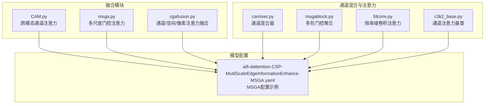
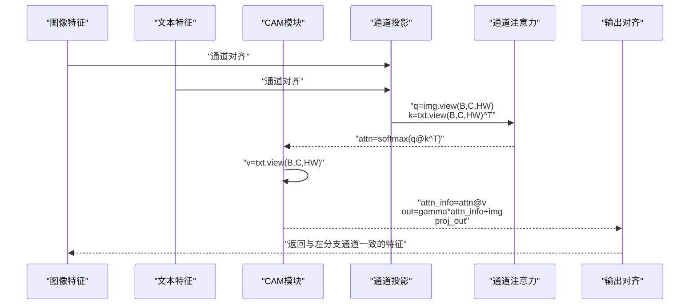
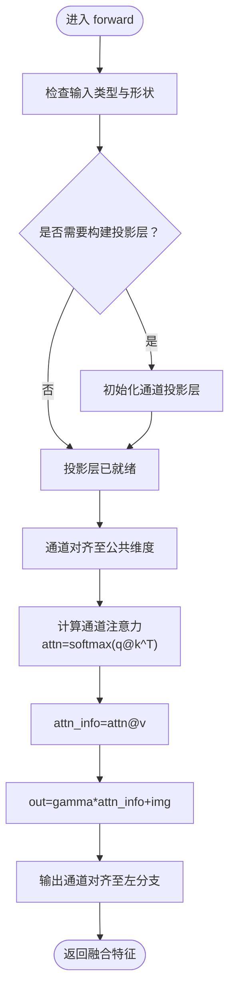
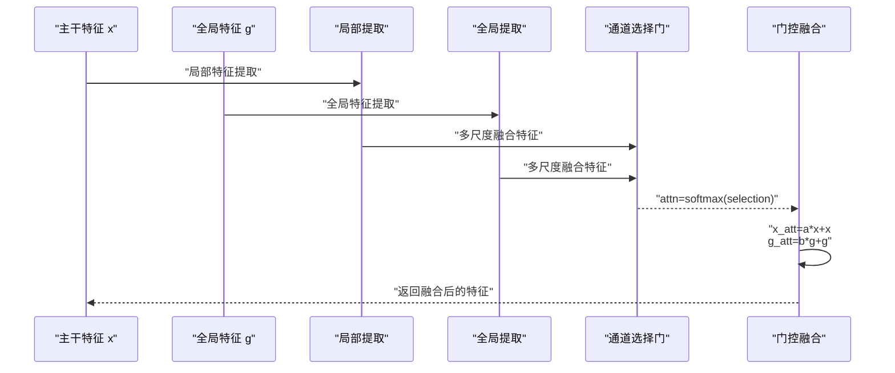
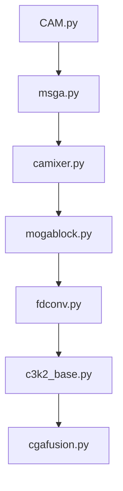

# 通道注意力融合

<cite>
**本文引用的文件**
- [CAM.py](file://ultralytics/nn/modules/fusion/CAM.py)
- [msga.py](file://ultralytics/nn/modules/fusion/msga.py)
- [mogablock.py](file://ultralytics/nn/public/mogablock.py)
- [c3k2_base.py](file://ultralytics/nn/extraction/c3k2_base.py)
- [fdconv.py](file://ultralytics/nn/public/fdconv.py)
- [cgafusion.py](file://ultralytics/nn/modules/fusion/cgafusion.py)
- [aifi-dattention-CSP-MutilScaleEdgeInformationEnhance-MSGA.yaml](file://ultralytics/cfg/models/rtmm/r18/aifi-dattention-CSP-MutilScaleEdgeInformationEnhance-MSGA.yaml)
- [results.csv](file://ResTest/aifi-dattention-CSP-MutilScaleEdgeInformationEnhance-MSGA/results.csv)
- [args.yaml](file://ResTest/aifi-dattention-CSP-MutilScaleEdgeInformationEnhance-MSGA/args.yaml)
</cite>

## 目录
1. [简介](#简介)
2. [项目结构](#项目结构)
3. [核心组件](#核心组件)
4. [架构总览](#架构总览)
5. [详细组件分析](#详细组件分析)
6. [依赖分析](#依赖分析)
7. [性能考虑](#性能考虑)
8. [故障排查指南](#故障排查指南)
9. [结论](#结论)
10. [附录](#附录)

## 简介
本文件系统化梳理多模态检测框架中的通道注意力融合策略，重点覆盖以下内容：
- 通道注意力机制的核心原理：注意力权重计算、通道特征重加权、跨模态/多尺度门控融合
- 核心模块实现：CAM（跨模态通道注意力）、MSGA（多步门控注意力）、以及与之相关的通道混合器、多阶门控聚合等
- 参数配置指南：注意力头数量、降维比例、激活函数选择、温度系数、通道分组策略等
- 性能对比与适用场景：基于实验配置与结果文件进行策略评估
- 实际调优建议：从网络结构、损失函数、数据增强到训练技巧的综合建议

## 项目结构
围绕通道注意力融合的相关代码主要分布在以下路径：
- 融合模块：ultralytics/nn/modules/fusion/
- 通道混合与注意力：ultralytics/nn/public/
- 特征提取与通道注意力：ultralytics/nn/extraction/
- 模型配置样例：ultralytics/cfg/models/rtmm/r18/

**图表来源**
- [CAM.py:1-93](file://ultralytics/nn/modules/fusion/CAM.py#L1-L93)
- [msga.py:56-84](file://ultralytics/nn/modules/fusion/msga.py#L56-L84)
- [cgafusion.py:1-47](file://ultralytics/nn/modules/fusion/cgafusion.py#L1-L47)
- [mogablock.py:79-115](file://ultralytics/nn/public/mogablock.py#L79-L115)
- [fdconv.py:87-174](file://ultralytics/nn/public/fdconv.py#L87-L174)
- [c3k2_base.py:440-457](file://ultralytics/nn/extraction/c3k2_base.py#L440-L457)
- [aifi-dattention-CSP-MutilScaleEdgeInformationEnhance-MSGA.yaml:48-65](file://ultralytics/cfg/models/rtmm/r18/aifi-dattention-CSP-MutilScaleEdgeInformationEnhance-MSGA.yaml#L48-L65)

**章节来源**
- [CAM.py:1-93](file://ultralytics/nn/modules/fusion/CAM.py#L1-L93)
- [msga.py:56-84](file://ultralytics/nn/modules/fusion/msga.py#L56-L84)
- [cgafusion.py:1-47](file://ultralytics/nn/modules/fusion/cgafusion.py#L1-L47)
- [mogablock.py:79-115](file://ultralytics/nn/public/mogablock.py#L79-L115)
- [fdconv.py:87-174](file://ultralytics/nn/public/fdconv.py#L87-L174)
- [c3k2_base.py:440-457](file://ultralytics/nn/extraction/c3k2_base.py#L440-L457)
- [aifi-dattention-CSP-MutilScaleEdgeInformationEnhance-MSGA.yaml:48-65](file://ultralytics/cfg/models/rtmm/r18/aifi-dattention-CSP-MutilScaleEdgeInformationEnhance-MSGA.yaml#L48-L65)

## 核心组件
本节聚焦于通道注意力融合的关键模块及其职责：
- CAM（跨模态通道注意力）：双输入（图像与文本特征）经通道对齐后执行C×C注意力，输出与左分支通道对齐，支持残差融合与动态通道投影
- MSGA（多步门控注意力）：多尺度上下文提取与全局聚合，结合通道选择门生成两路注意力权重，实现跨尺度特征的门控融合
- 通道混合器（CAMixer）：将通道注意力与特征混合策略结合，提升通道维度的表达能力
- 多阶门控聚合（MOGA）：多顺序深度可分离卷积与门控机制，实现多尺度特征的门控融合
- 频率域卷积注意力（FDConv）：基于频率分解的通道/滤波器/空间/核选择注意力，支持多种激活类型与温度控制
- 通道注意力基类（C3k2_base）：提供通用的通道注意力计算接口与温度更新机制

**章节来源**
- [CAM.py:17-93](file://ultralytics/nn/modules/fusion/CAM.py#L17-L93)
- [msga.py:56-84](file://ultralytics/nn/modules/fusion/msga.py#L56-L84)
- [mogablock.py:79-115](file://ultralytics/nn/public/mogablock.py#L79-L115)
- [fdconv.py:87-174](file://ultralytics/nn/public/fdconv.py#L87-L174)
- [c3k2_base.py:440-457](file://ultralytics/nn/extraction/c3k2_base.py#L440-L457)

## 架构总览
下图展示了通道注意力融合在多模态检测中的整体流程：输入特征经通道注意力模块计算权重，再与原特征进行重加权融合，最终输出增强后的特征。

**图表来源**
- [CAM.py:57-92](file://ultralytics/nn/modules/fusion/CAM.py#L57-L92)

## 详细组件分析

### CAM（跨模态通道注意力）
- 工作原理
  - 输入两路特征，若通道不一致则通过1×1卷积对齐至公共维度；输出通道对齐至左分支
  - 将特征展平为序列，计算通道间的注意力矩阵，再映射回特征图
  - 使用可学习缩放因子与残差连接实现特征重加权
- 关键特性
  - 惰性构建：仅在首次前向或通道变化时构建投影层
  - 形状约束：两路输入的空间尺寸必须一致，batch需一致
- 适用场景
  - 跨模态特征融合（如视觉-语言）
  - 需要通道级对齐与残差增强的轻量化融合

**图表来源**
- [CAM.py:41-92](file://ultralytics/nn/modules/fusion/CAM.py#L41-L92)

**章节来源**
- [CAM.py:17-93](file://ultralytics/nn/modules/fusion/CAM.py#L17-L93)

### MSGA（多步门控注意力）
- 工作原理
  - 对两路输入分别进行局部与全局特征提取，随后进行通道选择门控制
  - 通过softmax生成两路注意力权重，分别对原特征进行门控加权
  - 输出通道维度统一后进行逐元素融合
- 关键特性
  - 支持不同通道维度的输入，自动进行通道对齐
  - 选择门输出二通道权重，实现显式的选择性融合
- 适用场景
  - 多尺度特征融合（如FPN不同层级）
  - 需要显式通道选择与门控增强的任务

**图表来源**
- [msga.py:56-84](file://ultralytics/nn/modules/fusion/msga.py#L56-L84)

**章节来源**
- [msga.py:56-84](file://ultralytics/nn/modules/fusion/msga.py#L56-L84)

### 通道混合器（CAMixer）
- 工作原理
  - 结合通道注意力与特征混合策略，提升通道维度的表达能力
  - 通过多分支处理与融合，增强通道间的信息交互
- 适用场景
  - 需要提升通道维度表达力的骨干网络模块
  - 与注意力模块配合，实现更精细的通道重加权

**章节来源**
- [camixer.py:124-124](file://ultralytics/nn/public/camixer.py#L124-L124)

### 多阶门控聚合（MOGA）
- 工作原理
  - 采用多顺序深度可分离卷积与门控机制，对特征进行分解与聚合
  - 通过门控与值分支的乘法实现门控融合，并加入残差连接
- 关键特性
  - 支持强制浮点运算以提升数值稳定性
  - 提供元素缩放参数，控制门控强度
- 适用场景
  - 需要多尺度门控与高效融合的骨干模块
  - 对数值稳定性和融合强度有要求的任务

**章节来源**
- [mogablock.py:79-115](file://ultralytics/nn/public/mogablock.py#L79-L115)

### 频率域卷积注意力（FDConv）
- 工作原理
  - 基于频率分解的通道/滤波器/空间/核选择注意力
  - 支持多种激活类型（如sigmoid/tanh），并通过温度系数控制分布
- 关键特性
  - 可配置通道/滤波器/空间/核注意力的开关
  - 支持仅核注意力模式与空间频率分解模式
- 适用场景
  - 需要频率域特征增强与注意力控制的复杂任务
  - 对注意力分布与计算效率有较高要求的场景

**章节来源**
- [fdconv.py:87-174](file://ultralytics/nn/public/fdconv.py#L87-L174)

### 通道注意力基类（C3k2_base）
- 工作原理
  - 提供通用的通道注意力计算接口与温度更新机制
  - 支持通道注意力的通用模板与扩展
- 适用场景
  - 作为其他通道注意力模块的基础实现
  - 需要统一通道注意力接口的模块

**章节来源**
- [c3k2_base.py:440-457](file://ultralytics/nn/extraction/c3k2_base.py#L440-L457)

### CGA融合模块（通道/空间/像素注意力）
- 工作原理
  - 提供通道注意力（基于全局平均池化与MLP）、空间注意力（基于通道拼接与卷积）、像素注意力（基于多尺度拼接与门控）
  - 三者协同实现多粒度注意力引导的双输入融合
- 适用场景
  - 需要多粒度注意力与多模态融合的复杂任务
  - 对通道与空间信息均衡关注的应用

**章节来源**
- [cgafusion.py:1-47](file://ultralytics/nn/modules/fusion/cgafusion.py#L1-L47)

## 依赖分析
通道注意力融合模块之间的依赖关系如下：

**图表来源**
- [CAM.py:17-93](file://ultralytics/nn/modules/fusion/CAM.py#L17-L93)
- [msga.py:56-84](file://ultralytics/nn/modules/fusion/msga.py#L56-L84)
- [mogablock.py:79-115](file://ultralytics/nn/public/mogablock.py#L79-L115)
- [fdconv.py:87-174](file://ultralytics/nn/public/fdconv.py#L87-L174)
- [c3k2_base.py:440-457](file://ultralytics/nn/extraction/c3k2_base.py#L440-L457)
- [cgafusion.py:1-47](file://ultralytics/nn/modules/fusion/cgafusion.py#L1-L47)

**章节来源**
- [CAM.py:17-93](file://ultralytics/nn/modules/fusion/CAM.py#L17-L93)
- [msga.py:56-84](file://ultralytics/nn/modules/fusion/msga.py#L56-L84)
- [mogablock.py:79-115](file://ultralytics/nn/public/mogablock.py#L79-L115)
- [fdconv.py:87-174](file://ultralytics/nn/public/fdconv.py#L87-L174)
- [c3k2_base.py:440-457](file://ultralytics/nn/extraction/c3k2_base.py#L440-L457)
- [cgafusion.py:1-47](file://ultralytics/nn/modules/fusion/cgafusion.py#L1-L47)

## 性能考虑
- 计算复杂度
  - CAM：主要由通道注意力矩阵乘法主导，复杂度约为O(C^2·HW)，其中C为通道数，HW为空间像素数
  - MSGA：包含多尺度提取与通道选择门，整体复杂度受通道选择门与融合操作影响
  - FDConv：频率域注意力与多分支注意力，计算开销较大但可配置
- 内存占用
  - 投影层与注意力矩阵会增加显存占用，建议根据硬件条件调整通道维度
- 数值稳定性
  - MOGA支持强制浮点运算以提升数值稳定性，适用于对精度敏感的任务
- 训练稳定性
  - 温度系数与激活函数选择对收敛速度与精度有显著影响，建议在验证集上进行调优

## 故障排查指南
- 形状不匹配
  - 症状：报错提示两路输入空间尺寸不一致或batch不一致
  - 处理：确保两路输入特征的空间尺寸与batch一致，必要时使用上采样或下采样对齐
- 通道不可整除
  - 症状：GCBAM等模块报错提示通道数不能被分组整除
  - 处理：调整通道数使其能被指定分组整除，或修改分组数
- 投影层未构建
  - 症状：首次前向失败或通道对齐异常
  - 处理：确认输入通道维度变化触发了惰性构建逻辑，或手动设置公共通道维度
- 数值不稳定
  - 症状：梯度爆炸或NaN
  - 处理：启用MOGA的强制浮点运算选项，调整学习率与归一化策略

**章节来源**
- [CAM.py:65-71](file://ultralytics/nn/modules/fusion/CAM.py#L65-L71)
- [mogablock.py:100-115](file://ultralytics/nn/public/mogablock.py#L100-L115)

## 结论
通道注意力融合策略在多模态检测中扮演着关键角色。CAM通过跨模态通道注意力实现特征对齐与重加权，MSGA通过多尺度门控实现显式选择性融合，MOGA与FDConv进一步增强了门控与频率域注意力的能力。合理配置参数（如通道维度、激活类型、温度系数、分组策略）并结合具体任务需求，可在精度与效率之间取得良好平衡。

## 附录

### 参数配置指南
- 注意力头数量
  - CAM：无显式注意力头概念，通过通道维度控制注意力规模
  - MSGA：通过通道选择门输出二通道权重，实现显式选择
- 降维比例
  - CAM：通过公共通道维度控制降维，建议与左分支通道保持一致
  - FDConv：通过中间层维度与温度系数控制降维与分布
- 激活函数选择
  - FDConv：支持sigmoid/tanh两类激活，影响注意力分布的锐利程度
  - MOGA：门控与值分支均采用SiLU激活，可提升非线性表达能力
- 通道分组策略
  - GCBAM：要求通道数能被分组整除，建议按8或16等常见分组设置
- 温度系数
  - FDConv：通过温度系数控制注意力分布，建议在验证集上进行网格搜索
- 残差与投影
  - CAM：可学习缩放因子与残差连接，有助于稳定训练与特征复用

**章节来源**
- [CAM.py:26-30](file://ultralytics/nn/modules/fusion/CAM.py#L26-L30)
- [msga.py:56-84](file://ultralytics/nn/modules/fusion/msga.py#L56-L84)
- [mogablock.py:80-92](file://ultralytics/nn/public/mogablock.py#L80-L92)
- [fdconv.py:145-174](file://ultralytics/nn/public/fdconv.py#L145-L174)

### 性能对比与适用场景
- 实验配置与结果
  - MSGA配置示例：见[aifi-dattention-CSP-MutilScaleEdgeInformationEnhance-MSGA.yaml:48-65](file://ultralytics/cfg/models/rtmm/r18/aifi-dattention-CSP-MutilScaleEdgeInformationEnhance-MSGA.yaml#L48-L65)
  - 实验结果：见[results.csv](file://ResTest/aifi-dattention-CSP-MutilScaleEdgeInformationEnhance-MSGA/results.csv)
  - 配置参数：见[args.yaml](file://ResTest/aifi-dattention-CSP-MutilScaleEdgeInformationEnhance-MSGA/args.yaml)
- 适用场景建议
  - CAM：跨模态特征融合、需要通道对齐与残差增强的任务
  - MSGA：多尺度特征融合、需要显式选择性融合的场景
  - MOGA：对数值稳定性与门控强度有要求的任务
  - FDConv：需要频率域注意力与高表达力的复杂任务

**章节来源**
- [aifi-dattention-CSP-MutilScaleEdgeInformationEnhance-MSGA.yaml:48-65](file://ultralytics/cfg/models/rtmm/r18/aifi-dattention-CSP-MutilScaleEdgeInformationEnhance-MSGA.yaml#L48-L65)
- [results.csv](file://ResTest/aifi-dattention-CSP-MutilScaleEdgeInformationEnhance-MSGA/results.csv)
- [args.yaml](file://ResTest/aifi-dattention-CSP-MutilScaleEdgeInformationEnhance-MSGA/args.yaml)

### 实际调优建议
- 数据增强与损失函数
  - 在多模态场景中，建议结合MixUp、CutMix等增强策略，提升泛化能力
  - 注意损失函数的平衡，避免某一模态主导训练过程
- 学习率与优化器
  - 建议使用Warmup与余弦退火策略，结合梯度裁剪防止梯度爆炸
- 网络结构
  - 在骨干网络中插入CAM/MSGA/MOGA模块，逐步验证融合效果
  - 对于计算受限场景，优先选择轻量化的注意力模块（如CAM）
- 可视化与监控
  - 使用Grad-CAM等可视化工具观察注意力分布，辅助调试与优化