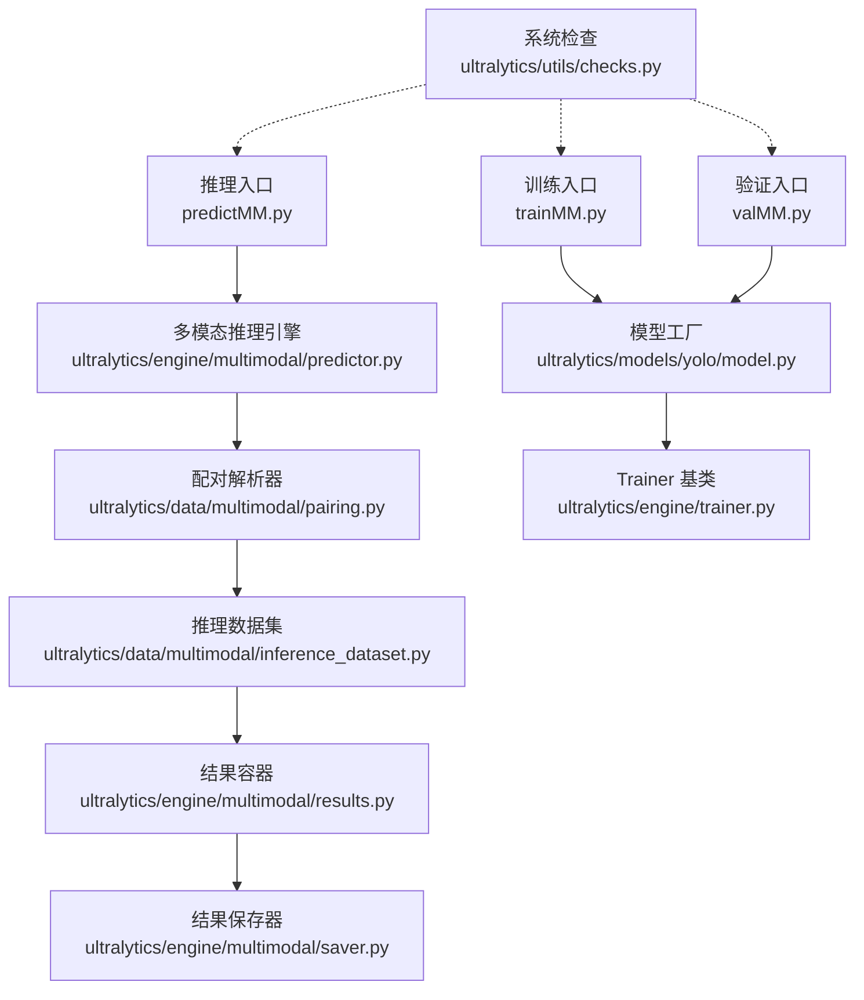
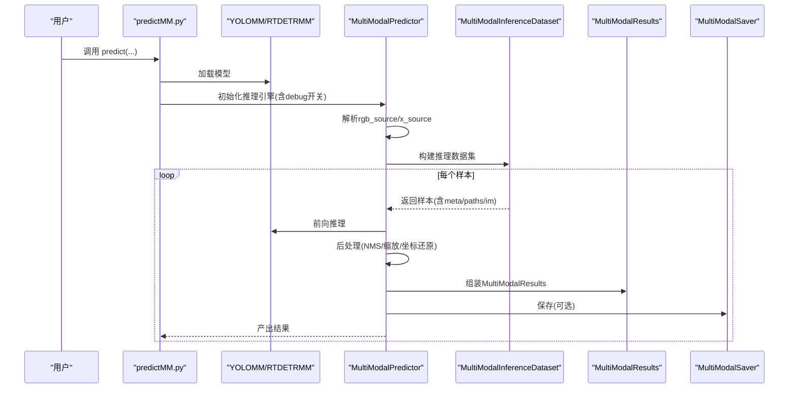
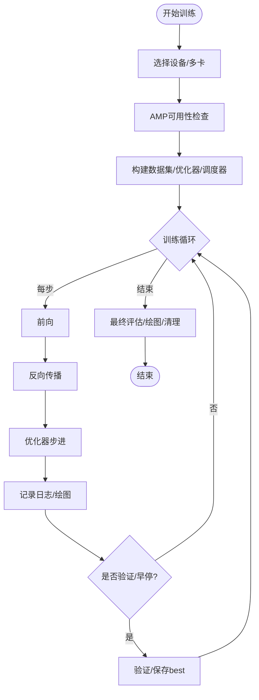
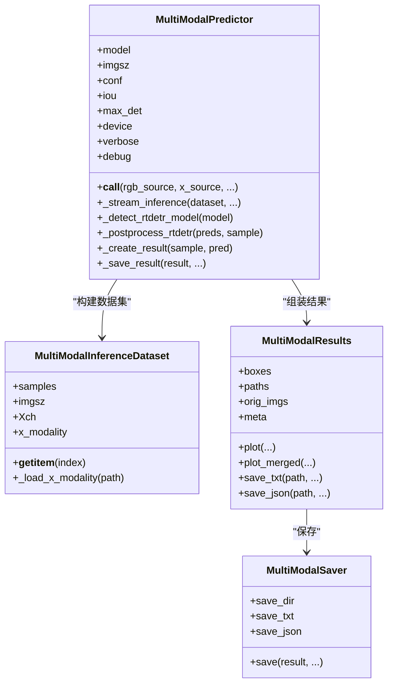
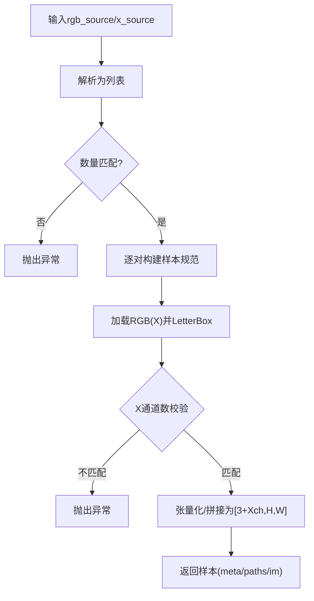
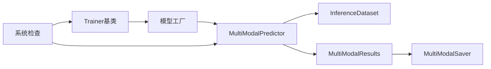

# 调试与故障排除

<cite>
**本文引用的文件**   
- [ultralytics/__init__.py](file://ultralytics/__init__.py)
- [trainMM.py](file://trainMM.py)
- [predictMM.py](file://predictMM.py)
- [valMM.py](file://valMM.py)
- [ultralytics/engine/trainer.py](file://ultralytics/engine/trainer.py)
- [ultralytics/models/yolo/model.py](file://ultralytics/models/yolo/model.py)
- [ultralytics/engine/multimodal/predictor.py](file://ultralytics/engine/multimodal/predictor.py)
- [ultralytics/engine/multimodal/results.py](file://ultralytics/engine/multimodal/results.py)
- [ultralytics/data/multimodal/inference_dataset.py](file://ultralytics/data/multimodal/inference_dataset.py)
- [ultralytics/data/multimodal/pairing.py](file://ultralytics/data/multimodal/pairing.py)
- [ultralytics/engine/multimodal/saver.py](file://ultralytics/engine/multimodal/saver.py)
- [ultralytics/utils/checks.py](file://ultralytics/utils/checks.py)
</cite>

## 目录
1. [简介](#简介)
2. [项目结构](#项目结构)
3. [核心组件](#核心组件)
4. [架构总览](#架构总览)
5. [详细组件分析](#详细组件分析)
6. [依赖分析](#依赖分析)
7. [性能考虑](#性能考虑)
8. [故障排除指南](#故障排除指南)
9. [结论](#结论)
10. [附录](#附录)

## 简介
本指南面向多模态检测系统（YOLOMM/RTDETRMM）的调试与故障排除，覆盖模型训练异常、推理错误、内存泄漏等常见问题的诊断与修复方法；介绍日志分析、性能分析、内存分析等调试工具与手段；给出错误处理与异常恢复机制的设计建议；明确数据加载、模型训练、推理三个阶段的调试重点，并提供针对不同硬件与软件环境的故障排除方案。

## 项目结构
该仓库围绕“多模态检测”组织，核心模块包括：
- 训练与验证入口：trainMM.py、valMM.py
- 推理入口：predictMM.py
- 多模态模型封装：YOLOMM/RTDETRMM（通过模型工厂自动识别）
- 多模态推理引擎：MultiModalPredictor
- 多模态数据管线：PairingResolver、MultiModalInferenceDataset
- 结果容器与保存：MultiModalResults、MultiModalSaver
- 系统与环境检查：ultralytics/utils/checks.py

**图示来源**
- [trainMM.py:1-15](file://trainMM.py#L1-L15)
- [valMM.py:1-22](file://valMM.py#L1-L22)
- [predictMM.py:1-40](file://predictMM.py#L1-L40)
- [ultralytics/models/yolo/model.py:456-740](file://ultralytics/models/yolo/model.py#L456-L740)
- [ultralytics/engine/multimodal/predictor.py:16-98](file://ultralytics/engine/multimodal/predictor.py#L16-L98)
- [ultralytics/data/multimodal/pairing.py:11-64](file://ultralytics/data/multimodal/pairing.py#L11-L64)
- [ultralytics/data/multimodal/inference_dataset.py:16-92](file://ultralytics/data/multimodal/inference_dataset.py#L16-L92)
- [ultralytics/engine/multimodal/results.py:14-60](file://ultralytics/engine/multimodal/results.py#L14-L60)
- [ultralytics/engine/multimodal/saver.py:12-53](file://ultralytics/engine/multimodal/saver.py#L12-L53)
- [ultralytics/engine/trainer.py:59-177](file://ultralytics/engine/trainer.py#L59-L177)
- [ultralytics/utils/checks.py:632-724](file://ultralytics/utils/checks.py#L632-L724)

**章节来源**
- [trainMM.py:1-15](file://trainMM.py#L1-L15)
- [valMM.py:1-22](file://valMM.py#L1-L22)
- [predictMM.py:1-40](file://predictMM.py#L1-L40)
- [ultralytics/models/yolo/model.py:456-740](file://ultralytics/models/yolo/model.py#L456-L740)
- [ultralytics/engine/multimodal/predictor.py:16-98](file://ultralytics/engine/multimodal/predictor.py#L16-L98)
- [ultralytics/data/multimodal/pairing.py:11-64](file://ultralytics/data/multimodal/pairing.py#L11-L64)
- [ultralytics/data/multimodal/inference_dataset.py:16-92](file://ultralytics/data/multimodal/inference_dataset.py#L16-L92)
- [ultralytics/engine/multimodal/results.py:14-60](file://ultralytics/engine/multimodal/results.py#L14-L60)
- [ultralytics/engine/multimodal/saver.py:12-53](file://ultralytics/engine/multimodal/saver.py#L12-L53)
- [ultralytics/engine/trainer.py:59-177](file://ultralytics/engine/trainer.py#L59-L177)
- [ultralytics/utils/checks.py:632-724](file://ultralytics/utils/checks.py#L632-L724)

## 核心组件
- 模型工厂与多模态识别：自动识别 YOLOMM/RTDETRMM 并初始化对应模型与任务映射。
- 训练基类：统一训练循环、验证、早停、权重保存、内存清理等。
- 多模态推理引擎：显式RGB/X输入、数据集构建、前向推理、后处理、结果组装与保存。
- 数据管线：配对解析、空间对齐、LetterBox预处理、张量化与归一化。
- 结果容器与保存：统一的检测框、元数据、可视化与导出。

**章节来源**
- [ultralytics/models/yolo/model.py:456-740](file://ultralytics/models/yolo/model.py#L456-L740)
- [ultralytics/engine/trainer.py:59-177](file://ultralytics/engine/trainer.py#L59-L177)
- [ultralytics/engine/multimodal/predictor.py:16-98](file://ultralytics/engine/multimodal/predictor.py#L16-L98)
- [ultralytics/data/multimodal/inference_dataset.py:16-92](file://ultralytics/data/multimodal/inference_dataset.py#L16-L92)
- [ultralytics/engine/multimodal/results.py:14-60](file://ultralytics/engine/multimodal/results.py#L14-L60)
- [ultralytics/engine/multimodal/saver.py:12-53](file://ultralytics/engine/multimodal/saver.py#L12-L53)

## 架构总览
多模态检测系统采用“显式配对 + 独立推理引擎”的设计，保证RGB与X模态的解耦与可插拔性。训练与验证沿用通用Trainer基类，推理通过MultiModalPredictor完成端到端流程。

**图示来源**
- [predictMM.py:1-40](file://predictMM.py#L1-L40)
- [ultralytics/engine/multimodal/predictor.py:99-142](file://ultralytics/engine/multimodal/predictor.py#L99-L142)
- [ultralytics/data/multimodal/inference_dataset.py:94-183](file://ultralytics/data/multimodal/inference_dataset.py#L94-L183)
- [ultralytics/engine/multimodal/results.py:436-464](file://ultralytics/engine/multimodal/results.py#L436-L464)
- [ultralytics/engine/multimodal/saver.py:54-112](file://ultralytics/engine/multimodal/saver.py#L54-L112)

## 详细组件分析

### 训练阶段（Trainer 基类）
- 关键职责：设备选择、数据集加载、优化器/调度器、训练循环、验证、早停、权重保存、内存清理。
- 调试要点：
  - 设备与多卡：确认设备字符串、world_size推断、DDP命令生成与清理。
  - AMP：AMP可用性检查，异常时自动禁用。
  - 内存管理：每epoch后清理缓存，防止显存/系统内存增长。
  - 验证时机：按配置或早停触发，最终评估best.pt。
- 常见问题定位：
  - OOM：降低batch、关闭mosaic、启用自动批大小、检查数据增强。
  - 学习率/收敛异常：检查warmup、scheduler、冻结层设置。
  - 分布式训练：NCCL/Gloo后端、超时、rank/device映射。

**图示来源**
- [ultralytics/engine/trainer.py:191-503](file://ultralytics/engine/trainer.py#L191-L503)
- [ultralytics/engine/trainer.py:528-541](file://ultralytics/engine/trainer.py#L528-L541)
- [ultralytics/utils/checks.py:727-800](file://ultralytics/utils/checks.py#L727-L800)

**章节来源**
- [ultralytics/engine/trainer.py:191-503](file://ultralytics/engine/trainer.py#L191-L503)
- [ultralytics/engine/trainer.py:528-541](file://ultralytics/engine/trainer.py#L528-L541)
- [ultralytics/utils/checks.py:727-800](file://ultralytics/utils/checks.py#L727-L800)

### 推理阶段（MultiModalPredictor）
- 关键职责：显式RGB/X输入、Router配置读取、数据集构建、前向推理、后处理（YOLO/RTDETR）、结果组装与保存。
- 调试要点：
  - debug开关：打印模型输出类型/形状、RTDETR专用分支、NMS前后框数、坐标还原参数。
  - 模型类型检测：自动区分YOLO与RTDETR，避免输出格式误判。
  - X模态通道：x_modality与xch，单通道/三通道可视化条件。
- 常见问题定位：
  - 输入通道不匹配：X通道数与Router配置不符。
  - 坐标还原异常：ratio_pad格式、letterbox尺寸不一致。
  - RTDETR后处理：查询数、置信度过滤、NMS阈值。

**图示来源**
- [ultralytics/engine/multimodal/predictor.py:16-98](file://ultralytics/engine/multimodal/predictor.py#L16-L98)
- [ultralytics/data/multimodal/inference_dataset.py:16-92](file://ultralytics/data/multimodal/inference_dataset.py#L16-L92)
- [ultralytics/engine/multimodal/results.py:14-60](file://ultralytics/engine/multimodal/results.py#L14-L60)
- [ultralytics/engine/multimodal/saver.py:12-53](file://ultralytics/engine/multimodal/saver.py#L12-L53)

**章节来源**
- [ultralytics/engine/multimodal/predictor.py:16-98](file://ultralytics/engine/multimodal/predictor.py#L16-L98)
- [ultralytics/data/multimodal/inference_dataset.py:16-92](file://ultralytics/data/multimodal/inference_dataset.py#L16-L92)
- [ultralytics/engine/multimodal/results.py:14-60](file://ultralytics/engine/multimodal/results.py#L14-L60)
- [ultralytics/engine/multimodal/saver.py:12-53](file://ultralytics/engine/multimodal/saver.py#L12-L53)

### 数据加载与配对（PairingResolver + InferenceDataset）
- 关键职责：显式配对RGB与X，校验文件存在性，构建样本规范，LetterBox预处理，张量化与通道校验。
- 调试要点：
  - 输入合法性：RGB/X数量匹配、路径存在、文件类型正确。
  - X通道一致性：与Router配置一致，灰度/单通道自动扩展。
  - LetterBox参数：scale_fill=false、scaleup=false、stride对齐。
- 常见问题定位：
  - 文件读取失败：路径不存在、格式不支持、TIFF深度图读取异常。
  - 通道数不匹配：X通道数与预期不符。
  - 尺寸不一致：RGB与X未对齐导致报错。

**图示来源**
- [ultralytics/data/multimodal/pairing.py:37-125](file://ultralytics/data/multimodal/pairing.py#L37-L125)
- [ultralytics/data/multimodal/inference_dataset.py:94-183](file://ultralytics/data/multimodal/inference_dataset.py#L94-L183)

**章节来源**
- [ultralytics/data/multimodal/pairing.py:37-125](file://ultralytics/data/multimodal/pairing.py#L37-L125)
- [ultralytics/data/multimodal/inference_dataset.py:94-183](file://ultralytics/data/multimodal/inference_dataset.py#L94-L183)

### 模型工厂与多模态识别（YOLOMM/RTDETRMM）
- 关键职责：根据模型文件名自动识别YOLOMM/RTDETRMM，设置任务映射与输入通道。
- 调试要点：
  - 模型类型识别：-mm/-rtdetr等后缀识别。
  - 输入通道推断：从配置或Dual模态层自动推断3/6通道。
  - 任务映射：detect/segment/pose/obb等任务的模型/训练器/验证器/预测器映射。
- 常见问题定位：
  - 不支持的输入通道：3/6以外通道会报错。
  - 配置文件不匹配：模型通道与配置不一致。

**章节来源**
- [ultralytics/models/yolo/model.py:456-740](file://ultralytics/models/yolo/model.py#L456-L740)

## 依赖分析
- 模块内聚与耦合：
  - MultiModalPredictor与数据集/结果/保存器松耦合，便于替换与扩展。
  - Trainer基类集中处理训练生命周期，多模态训练沿用其回调与保存机制。
- 外部依赖：
  - PyTorch/TorchVision、OpenCV、NumPy、Matplotlib等。
  - 系统检查模块提供环境与包版本校验。

**图示来源**
- [ultralytics/engine/trainer.py:59-177](file://ultralytics/engine/trainer.py#L59-L177)
- [ultralytics/models/yolo/model.py:456-740](file://ultralytics/models/yolo/model.py#L456-L740)
- [ultralytics/engine/multimodal/predictor.py:16-98](file://ultralytics/engine/multimodal/predictor.py#L16-L98)
- [ultralytics/data/multimodal/inference_dataset.py:16-92](file://ultralytics/data/multimodal/inference_dataset.py#L16-L92)
- [ultralytics/engine/multimodal/results.py:14-60](file://ultralytics/engine/multimodal/results.py#L14-L60)
- [ultralytics/engine/multimodal/saver.py:12-53](file://ultralytics/engine/multimodal/saver.py#L12-L53)
- [ultralytics/utils/checks.py:632-724](file://ultralytics/utils/checks.py#L632-L724)

**章节来源**
- [ultralytics/engine/trainer.py:59-177](file://ultralytics/engine/trainer.py#L59-L177)
- [ultralytics/models/yolo/model.py:456-740](file://ultralytics/models/yolo/model.py#L456-L740)
- [ultralytics/engine/multimodal/predictor.py:16-98](file://ultralytics/engine/multimodal/predictor.py#L16-L98)
- [ultralytics/data/multimodal/inference_dataset.py:16-92](file://ultralytics/data/multimodal/inference_dataset.py#L16-L92)
- [ultralytics/engine/multimodal/results.py:14-60](file://ultralytics/engine/multimodal/results.py#L14-L60)
- [ultralytics/engine/multimodal/saver.py:12-53](file://ultralytics/engine/multimodal/saver.py#L12-L53)
- [ultralytics/utils/checks.py:632-724](file://ultralytics/utils/checks.py#L632-L724)

## 性能考虑
- 训练阶段：
  - AMP：自动检测GPU兼容性，异常时禁用。
  - 内存清理：每epoch后清理缓存，避免显存碎片。
  - 批大小：自动批大小估算，结合数据集复杂度调整。
- 推理阶段：
  - LetterBox不放大、中心对齐，减少不必要的缩放开销。
  - 流式推理：边迭代边yield，降低内存峰值。
  - 后处理：YOLO/NMS与RTDETR专用分支分离，避免误判。

**章节来源**
- [ultralytics/engine/trainer.py:528-541](file://ultralytics/engine/trainer.py#L528-L541)
- [ultralytics/utils/checks.py:727-800](file://ultralytics/utils/checks.py#L727-L800)
- [ultralytics/engine/multimodal/predictor.py:144-243](file://ultralytics/engine/multimodal/predictor.py#L144-L243)
- [ultralytics/data/multimodal/inference_dataset.py:69-77](file://ultralytics/data/multimodal/inference_dataset.py#L69-L77)

## 故障排除指南

### 通用调试工具与方法
- 系统与环境检查：
  - 收集系统信息：CPU/GPU/CUDA/磁盘/内存/包版本。
  - 检查PyTorch/TorchVision兼容性。
  - 检查Python版本与依赖安装状态。
- 日志分析：
  - 使用LOGGER输出关键信息，配合debug开关打印中间结果。
  - 训练阶段关注损失、学习率、内存占用、验证指标。
  - 推理阶段关注模型输出类型/形状、NMS前后框数、坐标还原参数。
- 性能分析：
  - 训练阶段：观察每epoch耗时、早停触发、最终评估。
  - 推理阶段：对比流式与非流式、LetterBox参数影响。
- 内存分析：
  - 训练阶段：定期清理缓存，监控显存/系统内存。
  - 推理阶段：检查batch与imgsz，避免过大的输入尺寸。

**章节来源**
- [ultralytics/utils/checks.py:632-724](file://ultralytics/utils/checks.py#L632-L724)
- [ultralytics/engine/multimodal/predictor.py:170-243](file://ultralytics/engine/multimodal/predictor.py#L170-L243)
- [ultralytics/engine/trainer.py:528-541](file://ultralytics/engine/trainer.py#L528-L541)

### 训练异常
- 症状：OOM、NaN损失、零mAP、收敛异常。
- 诊断步骤：
  - 检查AMP兼容性，必要时禁用AMP。
  - 降低batch或imgsz，关闭mosaic，启用自动批大小。
  - 检查冻结层与学习率调度，确认warmup设置。
  - 查看验证指标与早停触发原因。
- 修复建议：
  - 调整数据增强强度，减少高风险操作。
  - 使用更小的学习率或更长warmup。
  - 分布式训练时检查NCCL/Gloo后端与超时设置。

**章节来源**
- [ultralytics/utils/checks.py:727-800](file://ultralytics/utils/checks.py#L727-L800)
- [ultralytics/engine/trainer.py:191-503](file://ultralytics/engine/trainer.py#L191-L503)

### 推理错误
- 症状：输入通道不匹配、坐标还原异常、RTDETR后处理失败。
- 诊断步骤：
  - 确认Router配置中的x_modality与xch。
  - 检查X通道数与预期一致，灰度图自动扩展。
  - 核对ratio_pad格式与letterbox尺寸。
  - 使用debug开关打印模型输出与后处理中间结果。
- 修复建议：
  - 调整X通道数或修改Router配置。
  - 确保RGB与X空间对齐，尺寸一致。
  - 调整NMS阈值与置信度阈值。

**章节来源**
- [ultralytics/engine/multimodal/predictor.py:170-434](file://ultralytics/engine/multimodal/predictor.py#L170-L434)
- [ultralytics/data/multimodal/inference_dataset.py:132-183](file://ultralytics/data/multimodal/inference_dataset.py#L132-L183)

### 内存泄漏
- 症状：长时间运行后显存/系统内存持续增长。
- 诊断步骤：
  - 训练阶段：每epoch后调用清理函数，监控内存占比。
  - 推理阶段：检查batch与imgsz，避免过大输入。
  - 检查是否保留了不需要的中间变量。
- 修复建议：
  - 定期清理缓存，使用with上下文管理资源。
  - 降低batch与imgsz，或启用流式推理。
  - 使用更小的模型或冻结部分层。

**章节来源**
- [ultralytics/engine/trainer.py:528-541](file://ultralytics/engine/trainer.py#L528-L541)
- [ultralytics/engine/multimodal/predictor.py:144-243](file://ultralytics/engine/multimodal/predictor.py#L144-L243)

### 数据加载问题
- 症状：文件不存在、格式不支持、通道数不匹配。
- 诊断步骤：
  - 检查路径是否存在、是否为文件。
  - 确认X模态文件格式（.npy/.npz/.tiff等）与键名。
  - 核对X通道数与Router配置一致。
- 修复建议：
  - 修正路径或文件格式。
  - 修改Router配置或数据预处理逻辑。
  - 确保RGB与X空间对齐。

**章节来源**
- [ultralytics/data/multimodal/pairing.py:175-187](file://ultralytics/data/multimodal/pairing.py#L175-L187)
- [ultralytics/data/multimodal/inference_dataset.py:185-245](file://ultralytics/data/multimodal/inference_dataset.py#L185-L245)

### 验证与评估
- 症状：验证指标异常、COCO指标缺失。
- 诊断步骤：
  - 确认验证数据集配置与split。
  - 检查modality参数（单模态验证时指定）。
  - 对比标准val与COCO专用验证方法。
- 修复建议：
  - 修正数据集路径与配置。
  - 指定正确的模态类型进行单模态验证。

**章节来源**
- [valMM.py:5-18](file://valMM.py#L5-L18)
- [ultralytics/models/yolo/model.py:742-799](file://ultralytics/models/yolo/model.py#L742-L799)

### 特定硬件与软件环境
- CUDA/GPU：
  - 检查GPU型号与AMP兼容性，必要时禁用AMP。
  - 分布式训练时检查NCCL/Gloo后端与超时。
- Python与依赖：
  - 使用系统检查收集Python版本、包版本与依赖状态。
  - 自动更新或修复不兼容的依赖组合。
- 系统资源：
  - 监控CPU/GPU/CUDA/磁盘/内存使用情况，避免资源瓶颈。

**章节来源**
- [ultralytics/utils/checks.py:632-724](file://ultralytics/utils/checks.py#L632-L724)
- [ultralytics/utils/checks.py:727-800](file://ultralytics/utils/checks.py#L727-L800)

## 结论
本指南提供了多模态检测系统从训练到推理的全链路调试与故障排除方法。通过系统检查、日志分析、性能与内存分析工具，以及针对数据加载、训练、推理各阶段的具体诊断步骤，能够快速定位并解决常见问题。建议在开发与部署过程中持续使用debug开关与系统检查，建立标准化的排障流程与回归测试。

## 附录
- 入口脚本参考：
  - 训练：trainMM.py
  - 推理：predictMM.py
  - 验证：valMM.py
- 模型工厂与多模态识别：YOLOMM/RTDETRMM自动识别与任务映射。
- 多模态推理引擎：显式RGB/X输入、数据集构建、后处理与结果保存。

**章节来源**
- [trainMM.py:1-15](file://trainMM.py#L1-L15)
- [predictMM.py:1-40](file://predictMM.py#L1-L40)
- [valMM.py:1-22](file://valMM.py#L1-L22)
- [ultralytics/models/yolo/model.py:456-740](file://ultralytics/models/yolo/model.py#L456-L740)
- [ultralytics/engine/multimodal/predictor.py:16-98](file://ultralytics/engine/multimodal/predictor.py#L16-L98)
- [ultralytics/data/multimodal/inference_dataset.py:16-92](file://ultralytics/data/multimodal/inference_dataset.py#L16-L92)
- [ultralytics/engine/multimodal/results.py:14-60](file://ultralytics/engine/multimodal/results.py#L14-L60)
- [ultralytics/engine/multimodal/saver.py:12-53](file://ultralytics/engine/multimodal/saver.py#L12-L53)