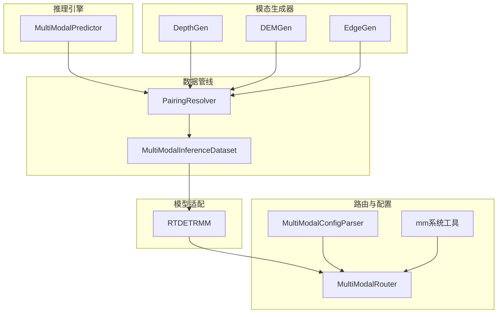
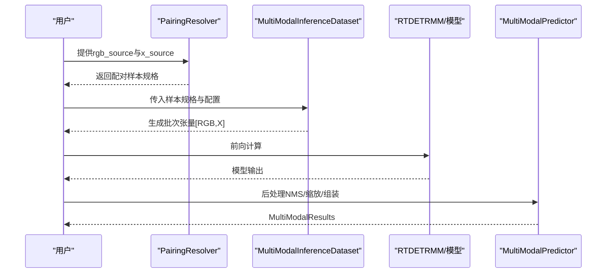
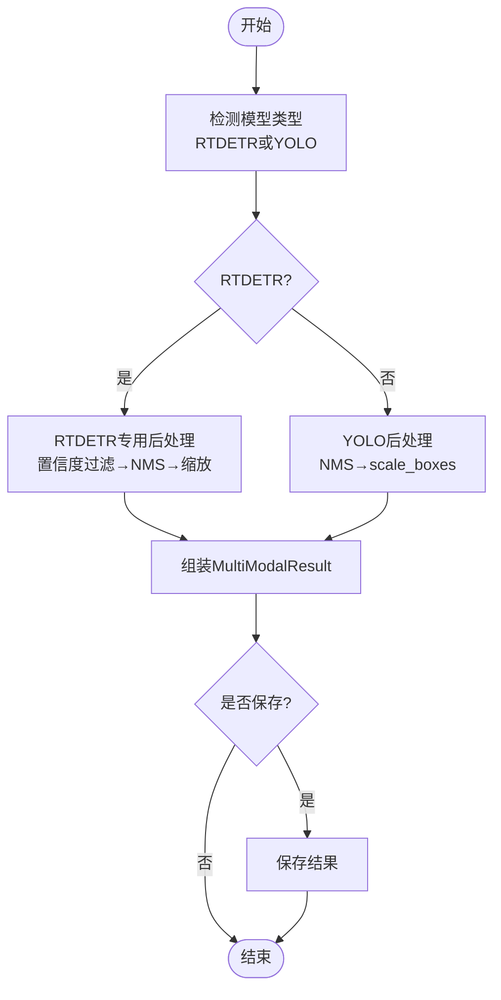
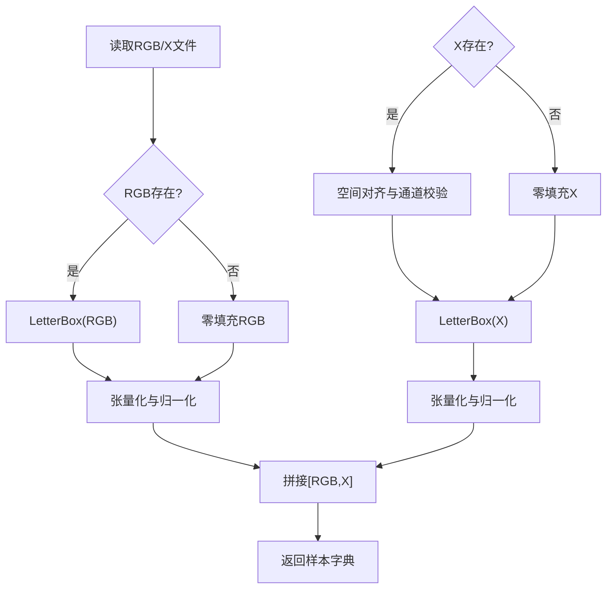
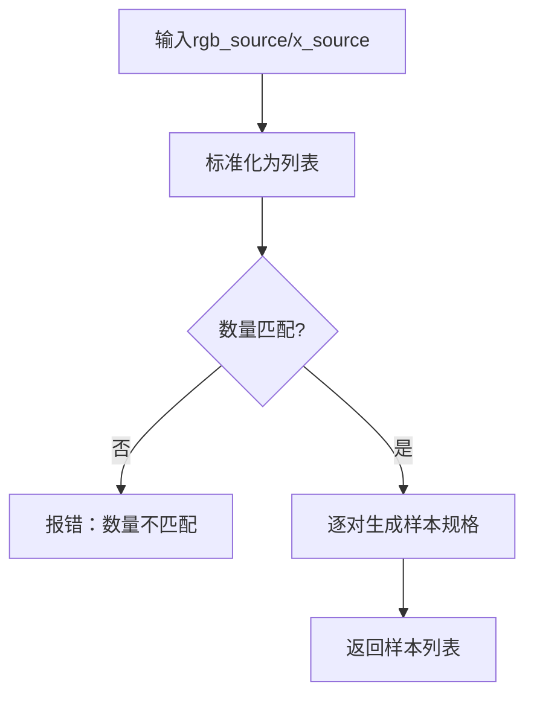
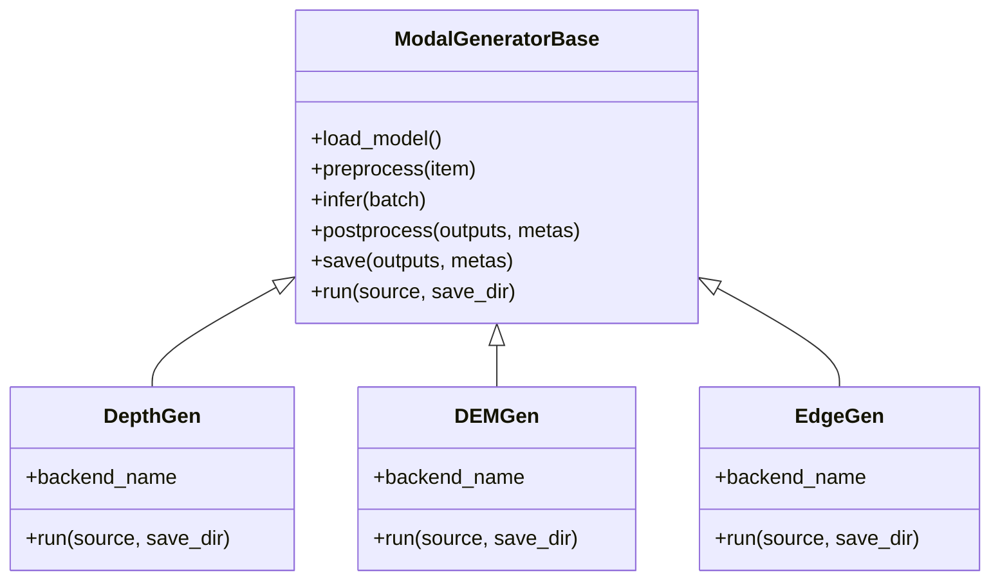
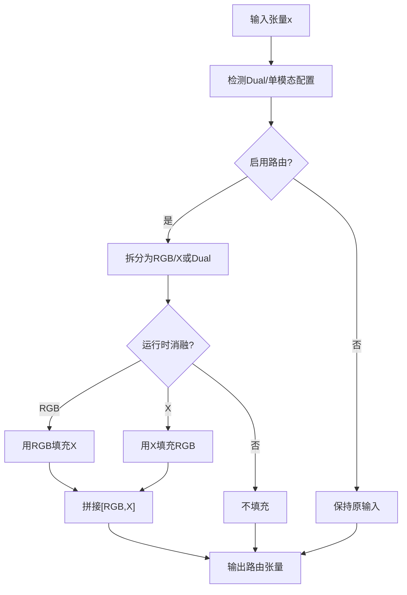
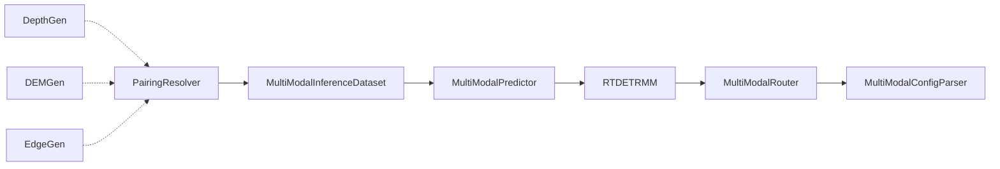

# 高级使用技巧

<cite>
**本文档引用的文件**
- [ultralytics/engine/multimodal/predictor.py](file://ultralytics/engine/multimodal/predictor.py)
- [ultralytics/data/multimodal/inference_dataset.py](file://ultralytics/data/multimodal/inference_dataset.py)
- [ultralytics/data/multimodal/pairing.py](file://ultralytics/data/multimodal/pairing.py)
- [ultralytics/models/rtdetrmm/model.py](file://ultralytics/models/rtdetrmm/model.py)
- [ultralytics/nn/mm/router.py](file://ultralytics/nn/mm/router.py)
- [ultralytics/nn/mm/parser.py](file://ultralytics/nn/mm/parser.py)
- [ultralytics/nn/mm/utils.py](file://ultralytics/nn/mm/utils.py)
- [ultralytics/nn/mm/generators/__init__.py](file://ultralytics/nn/mm/generators/__init__.py)
- [ultralytics/nn/mm/generators/depth_anything_v2.py](file://ultralytics/nn/mm/generators/depth_anything_v2.py)
- [ultralytics/nn/mm/generators/dem_features.py](file://ultralytics/nn/mm/generators/dem_features.py)
- [ultralytics/nn/mm/generators/edge.py](file://ultralytics/nn/mm/generators/edge.py)
- [trainMM.py](file://trainMM.py)
- [predictMM.py](file://predictMM.py)
</cite>

## 目录
1. [简介](#简介)
2. [项目结构](#项目结构)
3. [核心组件](#核心组件)
4. [架构总览](#架构总览)
5. [详细组件分析](#详细组件分析)
6. [依赖关系分析](#依赖关系分析)
7. [性能考虑](#性能考虑)
8. [故障排查指南](#故障排查指南)
9. [结论](#结论)
10. [附录](#附录)

## 简介
本文件面向多模态检测系统的高级用户，聚焦以下主题：
- 自定义模态生成器的开发方法：深度图生成、DEM数据处理、边缘特征提取等
- 融合策略的调优：不同特征融合算法的选择与参数优化
- 性能优化实践：训练加速、内存优化、推理优化
- 实验管理最佳实践：实验配置设计、结果记录分析、超参数搜索
- 面向特定场景的定制化方案与调试技巧

## 项目结构
该仓库围绕“多模态推理引擎 + 模态生成器 + 路由与配置解析”的架构组织，核心模块如下：
- 推理引擎：MultiModalPredictor（独立于基础预测器）
- 数据管线：PairingResolver（显式配对）、MultiModalInferenceDataset（统一预处理与拼接）
- 模型适配：RTDETRMM（独立多模态RT-DETR家族入口）
- 路由与配置：MultiModalRouter、MultiModalConfigParser、mm系统工具
- 模态生成器：DepthGen（深度）、DEMGen（DEM特征）、EdgeGen（边缘）

图表来源
- [ultralytics/engine/multimodal/predictor.py:16-244](file://ultralytics/engine/multimodal/predictor.py#L16-L244)
- [ultralytics/data/multimodal/pairing.py:11-203](file://ultralytics/data/multimodal/pairing.py#L11-L203)
- [ultralytics/data/multimodal/inference_dataset.py:16-184](file://ultralytics/data/multimodal/inference_dataset.py#L16-L184)
- [ultralytics/models/rtdetrmm/model.py:25-188](file://ultralytics/models/rtdetrmm/model.py#L25-L188)
- [ultralytics/nn/mm/router.py:11-404](file://ultralytics/nn/mm/router.py#L11-L404)
- [ultralytics/nn/mm/parser.py:9-198](file://ultralytics/nn/mm/parser.py#L9-L198)
- [ultralytics/nn/mm/utils.py:37-93](file://ultralytics/nn/mm/utils.py#L37-L93)
- [ultralytics/nn/mm/generators/depth_anything_v2.py:72-520](file://ultralytics/nn/mm/generators/depth_anything_v2.py#L72-L520)
- [ultralytics/nn/mm/generators/dem_features.py:212-470](file://ultralytics/nn/mm/generators/dem_features.py#L212-L470)
- [ultralytics/nn/mm/generators/edge.py:190-506](file://ultralytics/nn/mm/generators/edge.py#L190-L506)

章节来源
- [ultralytics/engine/multimodal/predictor.py:16-244](file://ultralytics/engine/multimodal/predictor.py#L16-L244)
- [ultralytics/data/multimodal/pairing.py:11-203](file://ultralytics/data/multimodal/pairing.py#L11-L203)
- [ultralytics/data/multimodal/inference_dataset.py:16-184](file://ultralytics/data/multimodal/inference_dataset.py#L16-L184)
- [ultralytics/models/rtdetrmm/model.py:25-188](file://ultralytics/models/rtdetrmm/model.py#L25-L188)
- [ultralytics/nn/mm/router.py:11-404](file://ultralytics/nn/mm/router.py#L11-L404)
- [ultralytics/nn/mm/parser.py:9-198](file://ultralytics/nn/mm/parser.py#L9-L198)
- [ultralytics/nn/mm/utils.py:37-93](file://ultralytics/nn/mm/utils.py#L37-L93)
- [ultralytics/nn/mm/generators/__init__.py:1-15](file://ultralytics/nn/mm/generators/__init__.py#L1-L15)

## 核心组件
- 多模态推理引擎（MultiModalPredictor）
  - 从模型读取Router配置，构建数据集并逐样本执行前向、NMS、坐标还原与结果组装
  - 支持RTDETR与YOLO两类后处理路径，具备真正的流式推理能力
- 多模态数据集（MultiModalInferenceDataset）
  - 严格校验RGB与X模态的存在性与通道数一致性，统一LetterBox预处理与张量化
  - 支持单模态零填充与多模态拼接（[RGB, X]）
- 配对解析器（PairingResolver）
  - 新版API强制显式提供rgb_source与x_source，支持单模态与双模态推理
- 模型适配（RTDETRMM）
  - 独立的多模态RT-DETR家族入口，负责配置解析、Router注入与验证入口
- 路由与配置（MultiModalRouter、MultiModalConfigParser）
  - 零拷贝张量路由、配置驱动的数据流、X模态新输入起点重定向、Hook DSL解析
- 模态生成器（DepthGen、DEMGen、EdgeGen）
  - 统一run接口，支持data.yaml与目录/文件列表，离线生成深度、DEM特征与边缘模态

章节来源
- [ultralytics/engine/multimodal/predictor.py:16-244](file://ultralytics/engine/multimodal/predictor.py#L16-L244)
- [ultralytics/data/multimodal/inference_dataset.py:16-184](file://ultralytics/data/multimodal/inference_dataset.py#L16-L184)
- [ultralytics/data/multimodal/pairing.py:11-203](file://ultralytics/data/multimodal/pairing.py#L11-L203)
- [ultralytics/models/rtdetrmm/model.py:25-188](file://ultralytics/models/rtdetrmm/model.py#L25-L188)
- [ultralytics/nn/mm/router.py:11-404](file://ultralytics/nn/mm/router.py#L11-L404)
- [ultralytics/nn/mm/parser.py:9-198](file://ultralytics/nn/mm/parser.py#L9-L198)
- [ultralytics/nn/mm/generators/depth_anything_v2.py:72-520](file://ultralytics/nn/mm/generators/depth_anything_v2.py#L72-L520)
- [ultralytics/nn/mm/generators/dem_features.py:212-470](file://ultralytics/nn/mm/generators/dem_features.py#L212-L470)
- [ultralytics/nn/mm/generators/edge.py:190-506](file://ultralytics/nn/mm/generators/edge.py#L190-L506)

## 架构总览
多模态系统的关键流程：显式配对 → 数据集统一预处理 → 模型前向 → 后处理（YOLO/NMS或RTDETR）→ 结果封装与保存。

图表来源
- [ultralytics/data/multimodal/pairing.py:37-125](file://ultralytics/data/multimodal/pairing.py#L37-L125)
- [ultralytics/data/multimodal/inference_dataset.py:94-184](file://ultralytics/data/multimodal/inference_dataset.py#L94-L184)
- [ultralytics/engine/multimodal/predictor.py:144-244](file://ultralytics/engine/multimodal/predictor.py#L144-L244)
- [ultralytics/models/rtdetrmm/model.py:25-188](file://ultralytics/models/rtdetrmm/model.py#L25-L188)

## 详细组件分析

### 多模态推理引擎（MultiModalPredictor）
- 职责与设计原则
  - 从模型读取Router配置，构建数据集并迭代样本
  - 对每个样本执行：forward → NMS（YOLO）或RTDETR专用后处理 → 坐标还原 → 组装结果
  - 支持真正的流式（边迭代边yield），stream=True为生成器
- 关键流程
  - 模型类型检测（RTDETR vs YOLO）
  - RTDETR后处理：置信度过滤、NMS、缩放到原图坐标
  - YOLO后处理：NMS、scale_boxes还原到原图
  - 结果封装与保存（可选）

图表来源
- [ultralytics/engine/multimodal/predictor.py:144-244](file://ultralytics/engine/multimodal/predictor.py#L144-L244)
- [ultralytics/engine/multimodal/predictor.py:279-322](file://ultralytics/engine/multimodal/predictor.py#L279-L322)
- [ultralytics/engine/multimodal/predictor.py:323-434](file://ultralytics/engine/multimodal/predictor.py#L323-L434)

章节来源
- [ultralytics/engine/multimodal/predictor.py:16-244](file://ultralytics/engine/multimodal/predictor.py#L16-L244)

### 多模态数据集（MultiModalInferenceDataset）
- 输入契约
  - 严格校验：存在性、可读性、X通道数一致性
  - 支持单模态零填充（RGB缺失或X缺失）
- 预处理
  - LetterBox（推理模式：不放大、居中对齐、stride对齐）
  - RGB通道翻转与归一化；X模态保持原通道顺序与归一化
- 输出
  - 拼接为[1, 3+Xch, H, W]张量，包含路径、原图、元信息（ori_shape、imgsz、ratio_pad）

图表来源
- [ultralytics/data/multimodal/inference_dataset.py:94-184](file://ultralytics/data/multimodal/inference_dataset.py#L94-L184)

章节来源
- [ultralytics/data/multimodal/inference_dataset.py:16-184](file://ultralytics/data/multimodal/inference_dataset.py#L16-L184)

### 配对解析器（PairingResolver）
- 新版API强制显式提供rgb_source与x_source，支持单模态与双模态
- 统一列表化处理与数量匹配校验，生成统一样本规格（含id、路径、x_modality）

图表来源
- [ultralytics/data/multimodal/pairing.py:37-125](file://ultralytics/data/multimodal/pairing.py#L37-L125)

章节来源
- [ultralytics/data/multimodal/pairing.py:11-203](file://ultralytics/data/multimodal/pairing.py#L11-L203)

### 模态生成器（DepthGen/DEMGen/EdgeGen）
- DepthGen（深度）
  - 基于Depth-Anything-V2，支持vits/vitb/vitl/vitg编码器
  - 支持YAML批量源、保存彩色/16位/数组等格式，提供对比图
- DEMGen（DEM特征）
  - 6通道特征：伪高程、坡度、坡向、曲率、粗糙度、局部高差
  - 支持高斯平滑、Sobel/Scharr梯度、拉普拉斯二阶导、局部均值等核
- EdgeGen（边缘）
  - 单通道或三通道边缘强度，支持高斯平滑、Scharr/Sobel梯度、伽马校正、二值化

图表来源
- [ultralytics/nn/mm/generators/depth_anything_v2.py:72-520](file://ultralytics/nn/mm/generators/depth_anything_v2.py#L72-L520)
- [ultralytics/nn/mm/generators/dem_features.py:212-470](file://ultralytics/nn/mm/generators/dem_features.py#L212-L470)
- [ultralytics/nn/mm/generators/edge.py:190-506](file://ultralytics/nn/mm/generators/edge.py#L190-L506)

章节来源
- [ultralytics/nn/mm/generators/depth_anything_v2.py:72-520](file://ultralytics/nn/mm/generators/depth_anything_v2.py#L72-L520)
- [ultralytics/nn/mm/generators/dem_features.py:212-470](file://ultralytics/nn/mm/generators/dem_features.py#L212-L470)
- [ultralytics/nn/mm/generators/edge.py:190-506](file://ultralytics/nn/mm/generators/edge.py#L190-L506)

### 路由与配置（MultiModalRouter/MultiModalConfigParser）
- MultiModalRouter
  - 零拷贝张量视图路由，支持RGB/X/Dual三种输入源
  - X模态新输入起点重定向与空间重置，支持运行时消融（runtime_modality）
- MultiModalConfigParser
  - 验证配置格式、统计RGB/X/Dual路由层数、解析Hook DSL（6th field）

图表来源
- [ultralytics/nn/mm/router.py:157-240](file://ultralytics/nn/mm/router.py#L157-L240)

章节来源
- [ultralytics/nn/mm/router.py:11-404](file://ultralytics/nn/mm/router.py#L11-L404)
- [ultralytics/nn/mm/parser.py:9-198](file://ultralytics/nn/mm/parser.py#L9-L198)
- [ultralytics/nn/mm/utils.py:37-93](file://ultralytics/nn/mm/utils.py#L37-L93)

### 模型适配（RTDETRMM）
- 独立多模态RT-DETR家族入口，Fail-Fast识别多模态结构
- 注入MultiModalRouter，解析YAML并填充modality_config
- 提供验证入口（rect默认False以避免RT-DETR在非方形输入下的缩放假设问题）

章节来源
- [ultralytics/models/rtdetrmm/model.py:25-269](file://ultralytics/models/rtdetrmm/model.py#L25-L269)

## 依赖关系分析
- 组件耦合
  - MultiModalPredictor依赖Router配置（Xch、x_modality），并根据模型类型选择后处理路径
  - MultiModalInferenceDataset依赖PairingResolver输出的样本规格，严格校验与预处理
  - 模态生成器与推理引擎解耦，通过文件系统对接（images_depth/images_dem/images_edge）
- 外部依赖
  - 深度生成器依赖Depth-Anything-V2参考实现（ref/Depth-Anything-V2-main）
  - OpenCV/NumPy/Torch用于图像读取、卷积与张量操作

图表来源
- [ultralytics/data/multimodal/pairing.py:37-125](file://ultralytics/data/multimodal/pairing.py#L37-L125)
- [ultralytics/data/multimodal/inference_dataset.py:94-184](file://ultralytics/data/multimodal/inference_dataset.py#L94-L184)
- [ultralytics/engine/multimodal/predictor.py:144-244](file://ultralytics/engine/multimodal/predictor.py#L144-L244)
- [ultralytics/models/rtdetrmm/model.py:25-188](file://ultralytics/models/rtdetrmm/model.py#L25-L188)
- [ultralytics/nn/mm/router.py:157-240](file://ultralytics/nn/mm/router.py#L157-L240)
- [ultralytics/nn/mm/parser.py:67-86](file://ultralytics/nn/mm/parser.py#L67-L86)
- [ultralytics/nn/mm/generators/depth_anything_v2.py:72-520](file://ultralytics/nn/mm/generators/depth_anything_v2.py#L72-L520)
- [ultralytics/nn/mm/generators/dem_features.py:212-470](file://ultralytics/nn/mm/generators/dem_features.py#L212-L470)
- [ultralytics/nn/mm/generators/edge.py:190-506](file://ultralytics/nn/mm/generators/edge.py#L190-L506)

章节来源
- [ultralytics/engine/multimodal/predictor.py:16-244](file://ultralytics/engine/multimodal/predictor.py#L16-L244)
- [ultralytics/data/multimodal/inference_dataset.py:16-184](file://ultralytics/data/multimodal/inference_dataset.py#L16-L184)
- [ultralytics/data/multimodal/pairing.py:11-203](file://ultralytics/data/multimodal/pairing.py#L11-L203)
- [ultralytics/models/rtdetrmm/model.py:25-188](file://ultralytics/models/rtdetrmm/model.py#L25-L188)
- [ultralytics/nn/mm/router.py:11-404](file://ultralytics/nn/mm/router.py#L11-L404)
- [ultralytics/nn/mm/parser.py:9-198](file://ultralytics/nn/mm/parser.py#L9-L198)
- [ultralytics/nn/mm/generators/__init__.py:1-15](file://ultralytics/nn/mm/generators/__init__.py#L1-L15)

## 性能考虑
- 训练加速
  - 使用RTDETRMM时，验证入口默认rect=False，避免非方形输入导致的缩放假设误差，有助于稳定mAP
  - 合理设置batch大小与num_workers，结合数据集LetterBox的stride对齐减少无效填充
- 内存优化
  - 模态生成器支持保存为uint16（TIFF）以提升动态范围与训练稳定性
  - 后处理阶段尽量使用in-place操作与合适的dtype，避免不必要的复制
- 推理优化
  - 使用流式推理（stream=True）边迭代边yield，降低峰值内存占用
  - 在MultiModalPredictor中合理设置conf/iou/max_det，减少后处理开销
  - 对于RTDETR，利用内置NMS与坐标还原路径，避免重复计算

[本节为通用指导，不直接分析具体文件]

## 故障排查指南
- 模型类型识别失败
  - 确保使用YOLOMM或RTDETRMM模型，MultiModalPredictor会从模型读取mm_router
- 输入通道不匹配
  - 检查X模态通道数（Xch）与Router配置一致；MultiModalInferenceDataset会在RGB缺失时对X进行通道校验
- 深度生成器依赖缺失
  - 确认ref/Depth-Anything-V2-main存在且包含所需权重与模块
- 配置格式错误
  - 使用MultiModalConfigParser.validate_config_format检查5th字段路由标记
- 运行时消融参数
  - 通过MultiModalRouter.set_runtime_params设置runtime_modality与strategy，避免意外填充

章节来源
- [ultralytics/engine/multimodal/predictor.py:60-68](file://ultralytics/engine/multimodal/predictor.py#L60-L68)
- [ultralytics/data/multimodal/inference_dataset.py:132-157](file://ultralytics/data/multimodal/inference_dataset.py#L132-L157)
- [ultralytics/nn/mm/generators/depth_anything_v2.py:38-59](file://ultralytics/nn/mm/generators/depth_anything_v2.py#L38-L59)
- [ultralytics/nn/mm/parser.py:20-46](file://ultralytics/nn/mm/parser.py#L20-L46)
- [ultralytics/nn/mm/router.py:64-69](file://ultralytics/nn/mm/router.py#L64-L69)

## 结论
本系统通过“显式配对 + 统一数据集 + 零拷贝路由 + 多模态生成器”的架构，实现了高扩展性的多模态检测流水线。高级用户可在以下方面进一步优化：
- 自定义模态生成器：遵循ModalGeneratorBase接口，统一run/source/save流程
- 融合策略调优：利用MultiModalRouter的RGB/X/Dual路由与Hook DSL，探索不同融合层位置与策略
- 性能优化：结合流式推理、合理的batch与预处理参数、以及RT-DETR验证入口的rect设置
- 实验管理：以data.yaml为数据入口，配合ResTest目录下的多组实验配置，系统化记录与对比

[本节为总结，不直接分析具体文件]

## 附录
- 实战参考
  - 训练：参考trainMM.py，按需调整YAML与数据路径
  - 推理：参考predictMM.py，使用显式rgb_source/x_source进行双/单模态测试
- 模态生成器入口
  - 通过ultralytics.nn.mm.generators导出DepthGen、DEMGen、EdgeGen

章节来源
- [trainMM.py:1-15](file://trainMM.py#L1-L15)
- [predictMM.py:1-40](file://predictMM.py#L1-L40)
- [ultralytics/nn/mm/generators/__init__.py:1-15](file://ultralytics/nn/mm/generators/__init__.py#L1-L15)