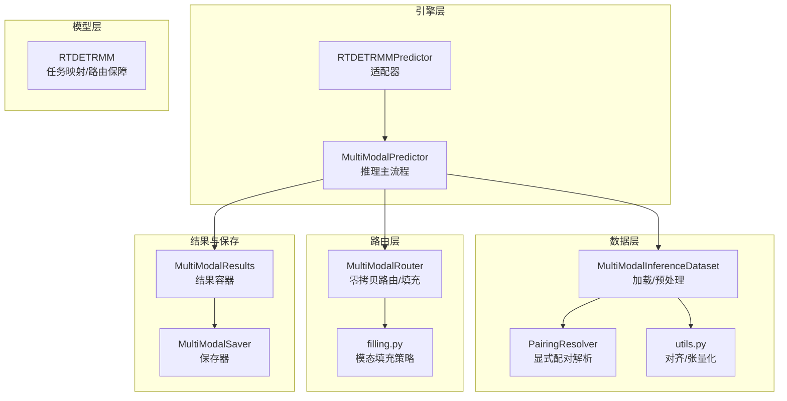
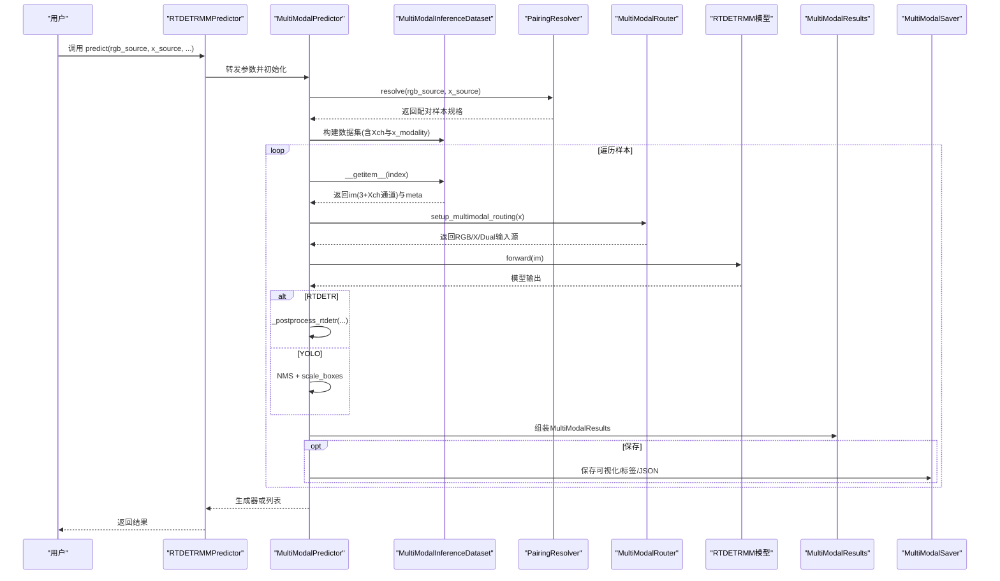
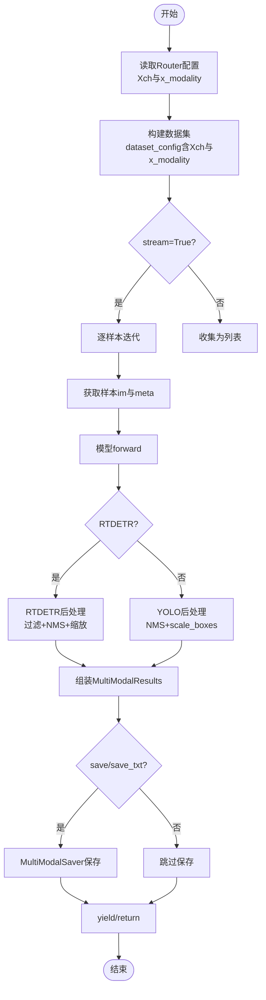
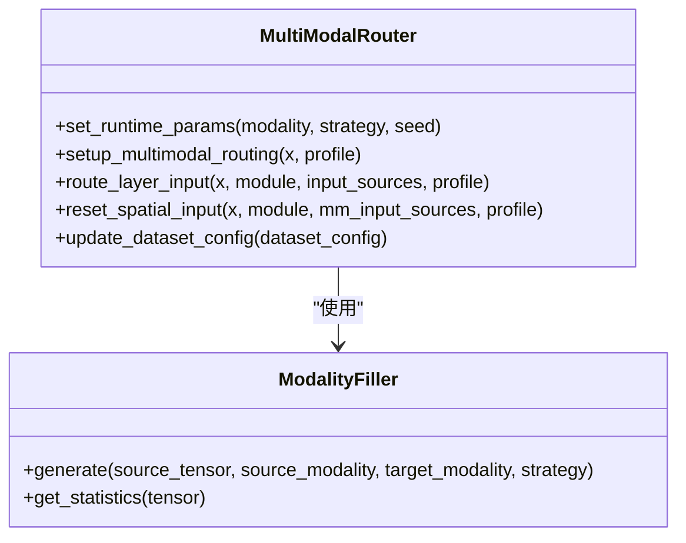
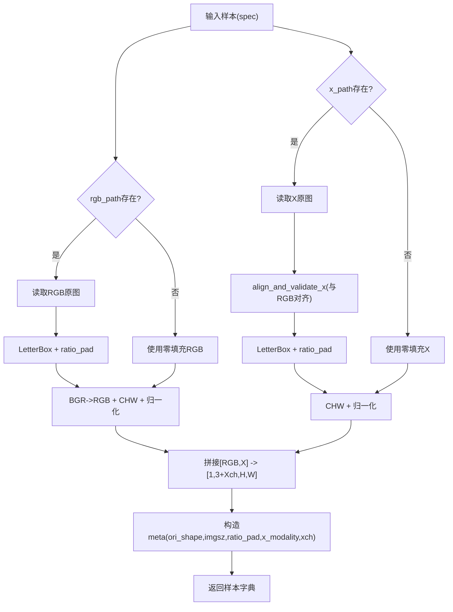
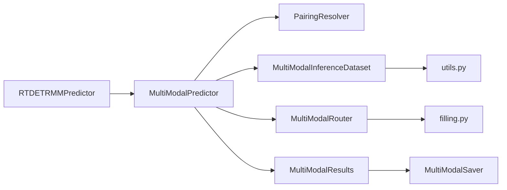
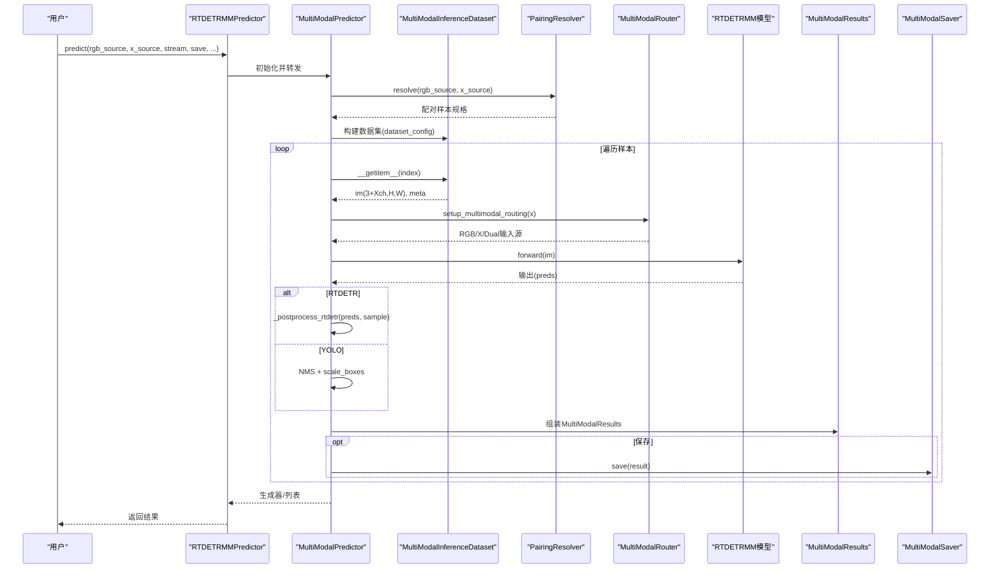

# 推理数据流

<cite>
**本文档引用的文件**
- [predictor.py](file://ultralytics/engine/multimodal/predictor.py)
- [mm_predictor.py](file://ultralytics/models/rtdetrmm/mm_predictor.py)
- [router.py](file://ultralytics/nn/mm/router.py)
- [inference_dataset.py](file://ultralytics/data/multimodal/inference_dataset.py)
- [pairing.py](file://ultralytics/data/multimodal/pairing.py)
- [results.py](file://ultralytics/engine/multimodal/results.py)
- [saver.py](file://ultralytics/engine/multimodal/saver.py)
- [filling.py](file://ultralytics/nn/mm/filling.py)
- [utils.py](file://ultralytics/data/multimodal/utils.py)
- [model.py](file://ultralytics/models/rtdetrmm/model.py)
- [predictMM.py](file://predictMM.py)
</cite>

## 目录
1. [简介](#简介)
2. [项目结构](#项目结构)
3. [核心组件](#核心组件)
4. [架构总览](#架构总览)
5. [详细组件分析](#详细组件分析)
6. [依赖关系分析](#依赖关系分析)
7. [性能考虑](#性能考虑)
8. [故障排查指南](#故障排查指南)
9. [结论](#结论)
10. [附录](#附录)

## 简介
本文件面向多模态推理场景，系统性梳理从输入数据准备到最终检测结果输出的完整数据流。重点覆盖：
- MultiModalRouter在推理模式下的工作原理：运行时模态选择、动态路由决策、实时数据处理
- 推理过程中的模态填充策略：单模态与双模态推理的差异化处理
- 推理数据流优化机制：内存管理、计算优化、性能监控
- 提供推理数据流图与实际推理示例代码路径，帮助快速落地不同输入与参数配置

## 项目结构
围绕多模态推理，核心模块分布如下：
- 引擎层：MultiModalPredictor负责推理主流程与后处理
- 适配层：RTDETRMMPredictor桥接BasePredictor接口
- 模型层：RTDETRMM封装任务映射与路由保障
- 数据层：PairingResolver解析显式配对；MultiModalInferenceDataset加载与预处理；工具函数对齐与张量化
- 路由层：MultiModalRouter在模型内部完成零拷贝路由与运行时填充
- 结果与保存：MultiModalResults封装结果；MultiModalSaver统一保存

图表来源
- [predictor.py:16-494](file://ultralytics/engine/multimodal/predictor.py#L16-L494)
- [mm_predictor.py:18-136](file://ultralytics/models/rtdetrmm/mm_predictor.py#L18-L136)
- [model.py:25-269](file://ultralytics/models/rtdetrmm/model.py#L25-L269)
- [inference_dataset.py:16-252](file://ultralytics/data/multimodal/inference_dataset.py#L16-L252)
- [pairing.py:11-203](file://ultralytics/data/multimodal/pairing.py#L11-L203)
- [router.py:11-471](file://ultralytics/nn/mm/router.py#L11-L471)
- [filling.py:14-175](file://ultralytics/nn/mm/filling.py#L14-L175)
- [results.py:14-357](file://ultralytics/engine/multimodal/results.py#L14-L357)
- [saver.py:12-112](file://ultralytics/engine/multimodal/saver.py#L12-L112)
- [utils.py:13-180](file://ultralytics/data/multimodal/utils.py#L13-L180)

章节来源
- [predictor.py:16-494](file://ultralytics/engine/multimodal/predictor.py#L16-L494)
- [mm_predictor.py:18-136](file://ultralytics/models/rtdetrmm/mm_predictor.py#L18-L136)
- [model.py:25-269](file://ultralytics/models/rtdetrmm/model.py#L25-L269)

## 核心组件
- MultiModalPredictor：推理引擎核心，负责从模型读取Router配置、构建数据集、迭代样本、执行forward与后处理、组装结果、可选保存
- RTDETRMMPredictor：适配器，将BasePredictor接口转换为新引擎所需格式
- MultiModalRouter：模型内路由核心，支持RGB/X/Dual三种输入，零拷贝视图路由，运行时模态选择与填充
- MultiModalInferenceDataset：推理专用数据集，严格校验与预处理，支持单模态零填充
- PairingResolver：显式配对解析器，强制rgb_source与x_source成对，支持单模态推理
- MultiModalResults：结果容器，封装boxes、paths、orig_imgs、meta，支持可视化与保存
- MultiModalSaver：保存器，按约定命名规则输出可视化与标注文件
- utils与filling：对齐与张量化、模态填充策略

章节来源
- [predictor.py:16-494](file://ultralytics/engine/multimodal/predictor.py#L16-L494)
- [router.py:11-471](file://ultralytics/nn/mm/router.py#L11-L471)
- [inference_dataset.py:16-252](file://ultralytics/data/multimodal/inference_dataset.py#L16-L252)
- [pairing.py:11-203](file://ultralytics/data/multimodal/pairing.py#L11-L203)
- [results.py:14-357](file://ultralytics/engine/multimodal/results.py#L14-L357)
- [saver.py:12-112](file://ultralytics/engine/multimodal/saver.py#L12-L112)
- [filling.py:14-175](file://ultralytics/nn/mm/filling.py#L14-L175)
- [utils.py:13-180](file://ultralytics/data/multimodal/utils.py#L13-L180)

## 架构总览
推理数据流自上而下分为三层：
- 控制层：RTDETRMMPredictor（适配器）与MultiModalPredictor（引擎）
- 数据层：PairingResolver解析配对，MultiModalInferenceDataset加载与预处理
- 模型层：RTDETRMM提供任务映射，MultiModalRouter在模型内部完成路由与填充

图表来源
- [mm_predictor.py:71-111](file://ultralytics/models/rtdetrmm/mm_predictor.py#L71-L111)
- [predictor.py:99-243](file://ultralytics/engine/multimodal/predictor.py#L99-L243)
- [inference_dataset.py:94-183](file://ultralytics/data/multimodal/inference_dataset.py#L94-L183)
- [router.py:157-240](file://ultralytics/nn/mm/router.py#L157-L240)
- [model.py:48-57](file://ultralytics/models/rtdetrmm/model.py#L48-L57)

## 详细组件分析

### MultiModalPredictor（推理引擎）
职责与流程要点：
- 从模型读取Router配置，识别X通道数与模态类型
- 通过PairingResolver解析显式配对，构建MultiModalInferenceDataset
- 流式迭代样本，执行forward，按模型类型选择后处理路径
- RTDETR专用后处理：拆分bbox与scores、置信度过滤、NMS、缩放至原图
- YOLO后处理：NMS、scale_boxes还原到原图尺寸
- 组装MultiModalResults并可选保存

图表来源
- [predictor.py:99-243](file://ultralytics/engine/multimodal/predictor.py#L99-L243)
- [predictor.py:323-434](file://ultralytics/engine/multimodal/predictor.py#L323-L434)

章节来源
- [predictor.py:16-494](file://ultralytics/engine/multimodal/predictor.py#L16-L494)

### MultiModalRouter（运行时模态选择与动态路由）
核心能力：
- 识别输入通道数，判定Dual或单模态配置
- setup_multimodal_routing：在运行时根据runtime_modality决定RGB/X/Dual输入源
- route_layer_input：按模块属性将输入路由到指定模态（RGB/X/Dual）
- reset_spatial_input：在特定层将X模态输入重置为原始空间尺寸
- generate_modality_filling/adapt_xch：在缺失模态时进行零填充或通道适配

图表来源
- [router.py:11-471](file://ultralytics/nn/mm/router.py#L11-L471)
- [filling.py:14-175](file://ultralytics/nn/mm/filling.py#L14-L175)

章节来源
- [router.py:11-471](file://ultralytics/nn/mm/router.py#L11-L471)
- [filling.py:14-175](file://ultralytics/nn/mm/filling.py#L14-L175)

### MultiModalInferenceDataset（数据加载与预处理）
要点：
- 严格校验：文件存在性、可读性、X通道数一致性
- 统一预处理：LetterBox + 转tensor + 归一化
- 支持单模态零填充：RGB或X缺失时使用零张量
- 对齐与通道适配：align_and_validate_x保证RGB与X空间与通道一致

图表来源
- [inference_dataset.py:94-183](file://ultralytics/data/multimodal/inference_dataset.py#L94-L183)
- [utils.py:13-180](file://ultralytics/data/multimodal/utils.py#L13-L180)

章节来源
- [inference_dataset.py:16-252](file://ultralytics/data/multimodal/inference_dataset.py#L16-L252)
- [utils.py:13-180](file://ultralytics/data/multimodal/utils.py#L13-L180)

### PairingResolver（显式配对解析）
- 强制显式提供rgb_source与x_source，支持单模态推理（任一为None）
- 统一转为列表，校验数量匹配
- 生成样本规格（含id、paths、x_modality）

章节来源
- [pairing.py:11-203](file://ultralytics/data/multimodal/pairing.py#L11-L203)

### MultiModalResults与MultiModalSaver（结果与保存）
- MultiModalResults：封装boxes、paths、orig_imgs、meta，支持RGB/X标注与并排合并
- MultiModalSaver：按约定命名规则保存可视化与标签/JSON

章节来源
- [results.py:14-357](file://ultralytics/engine/multimodal/results.py#L14-L357)
- [saver.py:12-112](file://ultralytics/engine/multimodal/saver.py#L12-L112)

## 依赖关系分析
- RTDETRMMPredictor依赖MultiModalPredictor，保持BasePredictor接口兼容
- MultiModalPredictor依赖PairingResolver与MultiModalInferenceDataset
- MultiModalInferenceDataset依赖utils对齐与张量化
- MultiModalRouter位于模型内部，被模型forward路径调用
- MultiModalResults与MultiModalSaver解耦于推理主流程

图表来源
- [mm_predictor.py:18-136](file://ultralytics/models/rtdetrmm/mm_predictor.py#L18-L136)
- [predictor.py:16-143](file://ultralytics/engine/multimodal/predictor.py#L16-L143)
- [inference_dataset.py:16-90](file://ultralytics/data/multimodal/inference_dataset.py#L16-L90)
- [router.py:11-63](file://ultralytics/nn/mm/router.py#L11-L63)
- [results.py:14-52](file://ultralytics/engine/multimodal/results.py#L14-L52)
- [saver.py:12-47](file://ultralytics/engine/multimodal/saver.py#L12-L47)

章节来源
- [mm_predictor.py:18-136](file://ultralytics/models/rtdetrmm/mm_predictor.py#L18-L136)
- [predictor.py:16-143](file://ultralytics/engine/multimodal/predictor.py#L16-L143)

## 性能考虑
- 内存管理
  - 零拷贝视图路由：MultiModalRouter在setup_multimodal_routing中通过切片与cat组合，避免重复复制
  - 单模态零填充：当某模态缺失时使用零张量，减少分支开销
  - LetterBox与张量化：统一在数据集侧完成，避免重复转换
- 计算优化
  - RTDETR后处理：先置信度过滤再NMS，减少无效计算
  - YOLO后处理：NMS与scale_boxes一次性完成，避免多次坐标变换
- 性能监控
  - MultiModalPredictor支持debug开关，输出中间张量形状与关键步骤日志
  - MultiModalRouter支持profile开关，记录路由与空间重置信息

章节来源
- [router.py:157-240](file://ultralytics/nn/mm/router.py#L157-L240)
- [predictor.py:170-177](file://ultralytics/engine/multimodal/predictor.py#L170-L177)
- [predictor.py:334-434](file://ultralytics/engine/multimodal/predictor.py#L334-L434)

## 故障排查指南
- 模型类型识别失败
  - 症状：无法检测模型类型
  - 处理：确认模型为RTDETRMM，检查模型类名或head类型
- X通道数不匹配
  - 症状：通道数不匹配或无法转换
  - 处理：确保X模态提供严格匹配通道数的文件；仅当Xch∈{1,3}时允许1↔3转换
- 输入源不可用
  - 症状：路由时报错“输入源不可用”
  - 处理：检查runtime_modality与实际输入是否一致；确认router.setup_multimodal_routing已正确初始化
- 保存路径问题
  - 症状：保存失败
  - 处理：确认save_dir存在且可写；labels/json子目录自动创建

章节来源
- [predictor.py:279-321](file://ultralytics/engine/multimodal/predictor.py#L279-L321)
- [inference_dataset.py:185-246](file://ultralytics/data/multimodal/inference_dataset.py#L185-L246)
- [router.py:255-317](file://ultralytics/nn/mm/router.py#L255-L317)
- [saver.py:45-53](file://ultralytics/engine/multimodal/saver.py#L45-L53)

## 结论
该多模态推理数据流以MultiModalPredictor为核心，结合PairingResolver与MultiModalInferenceDataset完成严格的输入解析与预处理；通过MultiModalRouter在模型内部实现零拷贝路由与运行时填充，支持单模态与双模态推理；后处理针对RTDETR与YOLO分别优化，最终以MultiModalResults与MultiModalSaver统一输出。整体设计兼顾灵活性与性能，适合在多模态场景下稳定落地。

## 附录

### 推理数据流图（代码级）

图表来源
- [mm_predictor.py:71-111](file://ultralytics/models/rtdetrmm/mm_predictor.py#L71-L111)
- [predictor.py:99-243](file://ultralytics/engine/multimodal/predictor.py#L99-L243)
- [inference_dataset.py:94-183](file://ultralytics/data/multimodal/inference_dataset.py#L94-L183)
- [router.py:157-240](file://ultralytics/nn/mm/router.py#L157-L240)

### 实际推理示例代码路径
- 双模态推理示例：[predictMM.py:9-18](file://predictMM.py#L9-L18)
- 单模态RGB推理示例：[predictMM.py:20-29](file://predictMM.py#L20-L29)
- 单模态X推理示例：[predictMM.py:31-40](file://predictMM.py#L31-L40)

章节来源
- [predictMM.py:1-40](file://predictMM.py#L1-L40)