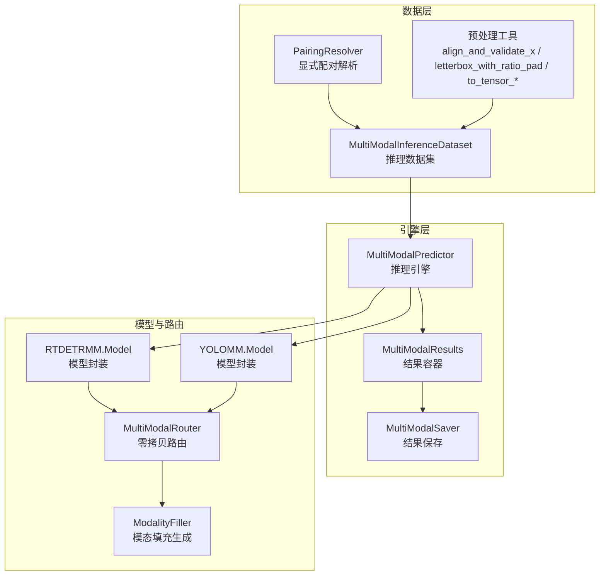
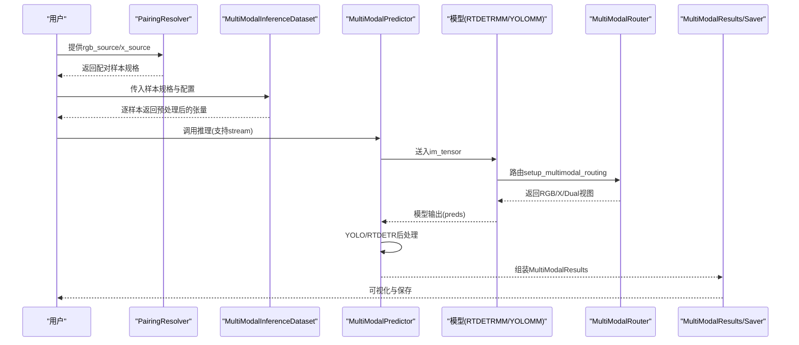
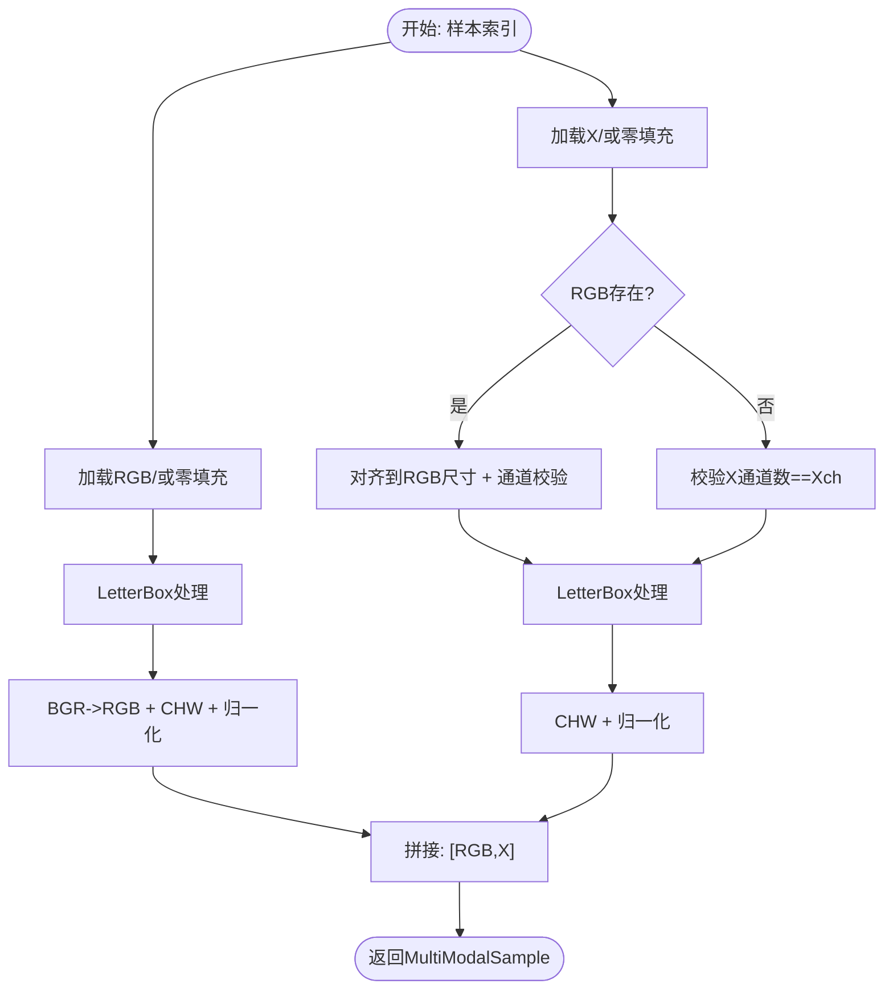
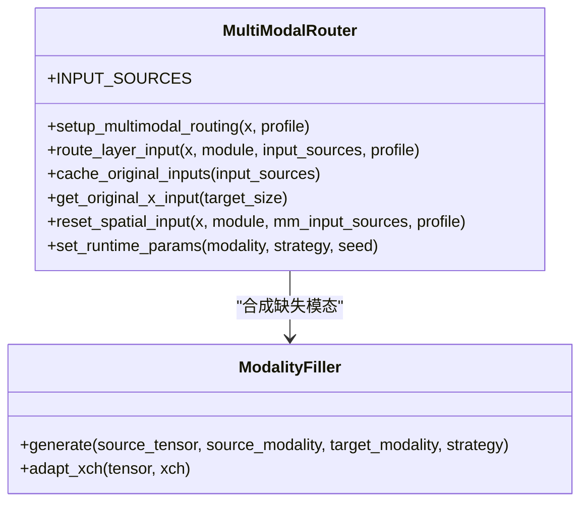
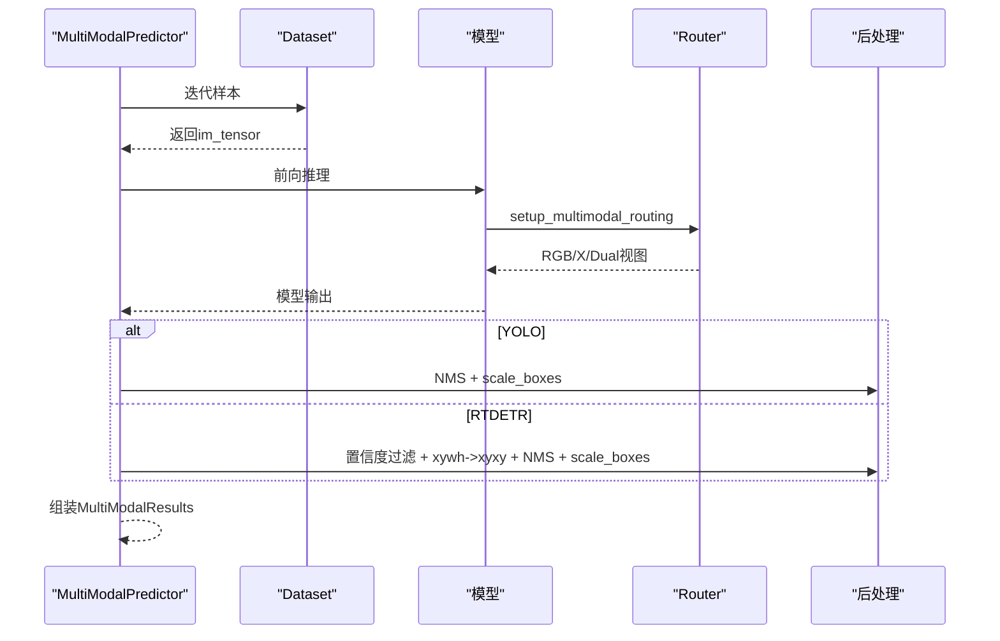
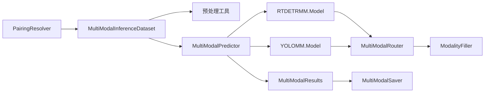

# 数据流架构

<cite>
**本文档引用的文件**
- [ultralytics/data/multimodal/__init__.py](file://ultralytics/data/multimodal/__init__.py)
- [ultralytics/data/multimodal/inference_dataset.py](file://ultralytics/data/multimodal/inference_dataset.py)
- [ultralytics/data/multimodal/pairing.py](file://ultralytics/data/multimodal/pairing.py)
- [ultralytics/data/multimodal/utils.py](file://ultralytics/data/multimodal/utils.py)
- [ultralytics/engine/multimodal/predictor.py](file://ultralytics/engine/multimodal/predictor.py)
- [ultralytics/engine/multimodal/results.py](file://ultralytics/engine/multimodal/results.py)
- [ultralytics/engine/multimodal/saver.py](file://ultralytics/engine/multimodal/saver.py)
- [ultralytics/models/rtdetrmm/model.py](file://ultralytics/models/rtdetrmm/model.py)
- [ultralytics/models/yolo/model.py](file://ultralytics/models/yolo/model.py)
- [ultralytics/nn/mm/router.py](file://ultralytics/nn/mm/router.py)
- [ultralytics/nn/mm/filling.py](file://ultralytics/nn/mm/filling.py)
</cite>

## 目录
1. [简介](#简介)
2. [项目结构](#项目结构)
3. [核心组件](#核心组件)
4. [架构总览](#架构总览)
5. [详细组件分析](#详细组件分析)
6. [依赖关系分析](#依赖关系分析)
7. [性能考量](#性能考量)
8. [故障排查指南](#故障排查指南)
9. [结论](#结论)
10. [附录](#附录)

## 简介
本文件面向多模态系统（RGB+X）的数据流架构，聚焦以下目标：
- 描述从输入模态到最终输出的完整数据处理链路
- 解释零拷贝张量路由机制如何实现高效数据传输
- 阐述模态填充策略在数据流中的作用与边界
- 分析并行处理能力、缓存机制与内存优化策略
- 展示训练与推理两种模式下的数据流向差异
- 覆盖数据验证、异常处理与性能监控机制

## 项目结构
多模态数据流相关模块主要分布在以下子系统：
- 数据准备与预处理：PairingResolver、MultiModalInferenceDataset、预处理工具
- 推理引擎：MultiModalPredictor、MultiModalResults、MultiModalSaver
- 模型与路由：RTDETRMM/YOLOMM模型封装、MultiModalRouter、模态填充生成器
- 工具与接口：multimodal包导出

**图表来源**
- [ultralytics/data/multimodal/pairing.py:11-203](file://ultralytics/data/multimodal/pairing.py#L11-L203)
- [ultralytics/data/multimodal/inference_dataset.py:16-252](file://ultralytics/data/multimodal/inference_dataset.py#L16-L252)
- [ultralytics/data/multimodal/utils.py:13-180](file://ultralytics/data/multimodal/utils.py#L13-L180)
- [ultralytics/engine/multimodal/predictor.py:16-494](file://ultralytics/engine/multimodal/predictor.py#L16-L494)
- [ultralytics/engine/multimodal/results.py:14-357](file://ultralytics/engine/multimodal/results.py#L14-L357)
- [ultralytics/engine/multimodal/saver.py:12-112](file://ultralytics/engine/multimodal/saver.py#L12-L112)
- [ultralytics/models/rtdetrmm/model.py:25-269](file://ultralytics/models/rtdetrmm/model.py#L25-L269)
- [ultralytics/models/yolo/model.py:456-741](file://ultralytics/models/yolo/model.py#L456-L741)
- [ultralytics/nn/mm/router.py:11-471](file://ultralytics/nn/mm/router.py#L11-L471)
- [ultralytics/nn/mm/filling.py:14-175](file://ultralytics/nn/mm/filling.py#L14-L175)

**章节来源**
- [ultralytics/data/multimodal/__init__.py:1-21](file://ultralytics/data/multimodal/__init__.py#L1-L21)

## 核心组件
- PairingResolver：接收显式RGB与X模态输入，校验文件存在性，生成配对样本规格，支持单模态推理（RGB或X缺失时以零填充占位）。
- MultiModalInferenceDataset：从样本规格构建可迭代数据集，加载RGB与X模态，执行空间对齐与通道校验，统一预处理（LetterBox、BGR->RGB、归一化），拼接为[1, 3+Xch, H, W]张量。
- 预处理工具：align_and_validate_x（空间对齐与通道校验）、letterbox_with_ratio_pad（LetterBox并返回ratio_pad）、to_tensor_rgb/to_tensor_x（张量化与归一化）。
- MultiModalPredictor：从模型读取Router配置，构建数据集并流式推理，分别针对YOLO与RTDETR采用不同的后处理路径，组装MultiModalResults。
- MultiModalResults：承载检测框、路径、原始图像与元数据，提供可视化与合并输出能力。
- MultiModalSaver：按约定命名规则保存RGB可视化、X可视化（xch∈{1,3}时）、双模态并排图、YOLO txt标签与JSON结果。
- MultiModalRouter：零拷贝张量视图路由，支持RGB/X/Dual三种输入模式，动态解析层配置中的模态标识，实现跨模态数据流的无缝衔接。
- ModalityFiller：轻量模态填充策略（复制、加噪、通道重复、边缘模糊、混合），用于单模态场景下的占位合成。

**章节来源**
- [ultralytics/data/multimodal/pairing.py:11-203](file://ultralytics/data/multimodal/pairing.py#L11-L203)
- [ultralytics/data/multimodal/inference_dataset.py:16-252](file://ultralytics/data/multimodal/inference_dataset.py#L16-L252)
- [ultralytics/data/multimodal/utils.py:13-180](file://ultralytics/data/multimodal/utils.py#L13-L180)
- [ultralytics/engine/multimodal/predictor.py:16-494](file://ultralytics/engine/multimodal/predictor.py#L16-L494)
- [ultralytics/engine/multimodal/results.py:14-357](file://ultralytics/engine/multimodal/results.py#L14-L357)
- [ultralytics/engine/multimodal/saver.py:12-112](file://ultralytics/engine/multimodal/saver.py#L12-L112)
- [ultralytics/nn/mm/router.py:11-471](file://ultralytics/nn/mm/router.py#L11-L471)
- [ultralytics/nn/mm/filling.py:14-175](file://ultralytics/nn/mm/filling.py#L14-L175)

## 架构总览
多模态数据流在“显式配对—统一预处理—模型路由—后处理—结果保存”的主干上，通过Router实现零拷贝张量视图路由，结合ModalityFiller在单模态场景下进行确定性合成，保证训练与推理的一致性。

**图表来源**
- [ultralytics/data/multimodal/pairing.py:37-125](file://ultralytics/data/multimodal/pairing.py#L37-L125)
- [ultralytics/data/multimodal/inference_dataset.py:94-183](file://ultralytics/data/multimodal/inference_dataset.py#L94-L183)
- [ultralytics/engine/multimodal/predictor.py:99-243](file://ultralytics/engine/multimodal/predictor.py#L99-L243)
- [ultralytics/models/rtdetrmm/model.py:25-57](file://ultralytics/models/rtdetrmm/model.py#L25-L57)
- [ultralytics/models/yolo/model.py:456-515](file://ultralytics/models/yolo/model.py#L456-L515)
- [ultralytics/nn/mm/router.py:157-240](file://ultralytics/nn/mm/router.py#L157-L240)

## 详细组件分析

### 数据准备与预处理链路
- PairingResolver.resolve：支持单RGB或单X模态推理，自动将None占位转换为零填充策略；双模态时严格校验数量一致。
- MultiModalInferenceDataset.__getitem__：对RGB先LetterBox再BGR->RGB+归一化；对X模态先空间对齐与通道校验，再CHW+归一化；最后拼接为[1, 3+Xch, H, W]。
- 预处理工具：
  - align_and_validate_x：以RGB为基准resize X，严格校验通道数；当Xch∈{1,3}时允许1↔3转换。
  - letterbox_with_ratio_pad：返回LetterBox结果与ratio_pad，便于后续坐标还原。
  - to_tensor_rgb/to_tensor_x：张量化与归一化，RGB通道翻转，X保持原通道顺序。

**图表来源**
- [ultralytics/data/multimodal/inference_dataset.py:94-183](file://ultralytics/data/multimodal/inference_dataset.py#L94-L183)
- [ultralytics/data/multimodal/utils.py:13-180](file://ultralytics/data/multimodal/utils.py#L13-L180)

**章节来源**
- [ultralytics/data/multimodal/pairing.py:37-125](file://ultralytics/data/multimodal/pairing.py#L37-L125)
- [ultralytics/data/multimodal/inference_dataset.py:94-183](file://ultralytics/data/multimodal/inference_dataset.py#L94-L183)
- [ultralytics/data/multimodal/utils.py:13-180](file://ultralytics/data/multimodal/utils.py#L13-L180)

### 零拷贝张量路由机制
- MultiModalRouter.setup_multimodal_routing：根据输入通道数判断Dual或RGB/X分离模式，动态切片/拼接得到RGB、X、Dual视图；在单模态场景下，通过ModalityFiller合成另一模态，仍保持零拷贝视图。
- route_layer_input：依据模块的_mm_input_source属性路由到对应模态输入，支持“X模态新输入起点”与“空间重置”等特殊层。
- cache_original_inputs/get_original_x_input/reset_spatial_input：缓存原始X输入以便空间重置，避免重复resize带来的额外开销。

**图表来源**
- [ultralytics/nn/mm/router.py:11-471](file://ultralytics/nn/mm/router.py#L11-L471)
- [ultralytics/nn/mm/filling.py:14-175](file://ultralytics/nn/mm/filling.py#L14-L175)

**章节来源**
- [ultralytics/nn/mm/router.py:157-404](file://ultralytics/nn/mm/router.py#L157-L404)
- [ultralytics/nn/mm/filling.py:35-175](file://ultralytics/nn/mm/filling.py#L35-L175)

### 推理引擎与后处理
- MultiModalPredictor.__call__：解析输入为样本规格，构建数据集，支持stream=True的生成器模式；每样本执行forward，随后根据模型类型选择后处理。
- YOLO后处理：non_max_suppression + scale_boxes坐标还原。
- RTDETR后处理：从AutoBackend输出提取Tensor，按查询置信度过滤、xywh转xyxy、缩放到letterbox尺寸、NMS去重、限制最大检测数、scale_boxes还原到原图坐标。

**图表来源**
- [ultralytics/engine/multimodal/predictor.py:144-243](file://ultralytics/engine/multimodal/predictor.py#L144-L243)
- [ultralytics/engine/multimodal/predictor.py:323-434](file://ultralytics/engine/multimodal/predictor.py#L323-L434)

**章节来源**
- [ultralytics/engine/multimodal/predictor.py:99-243](file://ultralytics/engine/multimodal/predictor.py#L99-L243)

### 结果容器与保存
- MultiModalResults.plot：始终输出RGB可视化；当xch∈{1,3}且X真实存在时输出X可视化；支持单模态时缺失模态不返回。
- MultiModalSaver.save：按约定命名规则保存RGB、X（xch∈{1,3}）、双模态并排图、YOLO txt标签与JSON结果。

**章节来源**
- [ultralytics/engine/multimodal/results.py:61-233](file://ultralytics/engine/multimodal/results.py#L61-L233)
- [ultralytics/engine/multimodal/saver.py:54-112](file://ultralytics/engine/multimodal/saver.py#L54-L112)

### 训练与推理模式差异
- 训练模式：通过RTDETRMM/YOLOMM模型封装，利用MultiModalRouter在层配置中声明模态来源，实现路由感知的GFLOPs统计与训练前可见的架构分析；批处理预处理在训练器中完成。
- 推理模式：强调显式配对与零拷贝路由，支持stream=True的边迭代边yield，减少内存占用与延迟。

**章节来源**
- [ultralytics/models/rtdetrmm/model.py:25-125](file://ultralytics/models/rtdetrmm/model.py#L25-L125)
- [ultralytics/models/yolo/model.py:456-515](file://ultralytics/models/yolo/model.py#L456-L515)
- [ultralytics/engine/multimodal/predictor.py:139-142](file://ultralytics/engine/multimodal/predictor.py#L139-L142)

## 依赖关系分析
- PairingResolver依赖文件系统与日志；MultiModalInferenceDataset依赖OpenCV/NumPy/Torch与LetterBox；预处理工具依赖OpenCV/NumPy/Torch。
- MultiModalPredictor依赖模型（RTDETRMM/YOLOMM）与Router；Router依赖Torch与ModalityFiller；Saver依赖OpenCV与结果容器。
- 模型封装通过task_map将predictor/validator/trainer与具体模型绑定，确保多模态配置与路由一致。

**图表来源**
- [ultralytics/data/multimodal/pairing.py:11-203](file://ultralytics/data/multimodal/pairing.py#L11-L203)
- [ultralytics/data/multimodal/inference_dataset.py:16-252](file://ultralytics/data/multimodal/inference_dataset.py#L16-L252)
- [ultralytics/engine/multimodal/predictor.py:16-98](file://ultralytics/engine/multimodal/predictor.py#L16-L98)
- [ultralytics/models/rtdetrmm/model.py:25-57](file://ultralytics/models/rtdetrmm/model.py#L25-L57)
- [ultralytics/models/yolo/model.py:456-515](file://ultralytics/models/yolo/model.py#L456-L515)
- [ultralytics/nn/mm/router.py:11-63](file://ultralytics/nn/mm/router.py#L11-L63)
- [ultralytics/nn/mm/filling.py:14-33](file://ultralytics/nn/mm/filling.py#L14-L33)
- [ultralytics/engine/multimodal/results.py:14-52](file://ultralytics/engine/multimodal/results.py#L14-L52)
- [ultralytics/engine/multimodal/saver.py:12-53](file://ultralytics/engine/multimodal/saver.py#L12-L53)

**章节来源**
- [ultralytics/data/multimodal/__init__.py:13-20](file://ultralytics/data/multimodal/__init__.py#L13-L20)
- [ultralytics/engine/multimodal/__init__.py:4-8](file://ultralytics/engine/multimodal/__init__.py#L4-L8)

## 性能考量
- 零拷贝张量路由：Router通过视图切片与拼接维持零拷贝，避免不必要的数据复制；ModalityFiller提供确定性合成策略，减少额外I/O。
- 流式推理：MultiModalPredictor支持stream=True，边迭代边yield，降低峰值内存占用，适合长序列或实时场景。
- 缓存机制：Router缓存原始X输入与空间尺寸，用于空间重置层，避免重复resize；Dataset缓存文件路径列表，便于日志与索引。
- 内存优化：预处理阶段统一CHW与归一化，减少中间变量；单模态推理时对缺失模态使用零填充张量而非加载真实文件，节省IO与内存。
- 并行处理：数据加载与预处理在CPU侧完成，模型推理在CUDA设备上执行；可通过增大batch与合理设置imgsz平衡吞吐与延迟。

[本节为通用性能讨论，不直接分析具体文件]

## 故障排查指南
- 文件存在性与格式错误：PairingResolver与Dataset在文件不存在或非文件时抛出异常；X模态加载支持.npy/.npz/.tiff/.tif等格式，需确保键或通道正确。
- 通道数不匹配：align_and_validate_x对Xch∈{1,3}允许1↔3转换，其他情况需严格匹配；Xch>3时建议使用.tif/.npy/.npz并提供严格匹配通道数。
- LetterBox与坐标还原：确保ratio_pad正确传递至scale_boxes，避免检测框坐标偏移；RTDETR后处理需注意查询数与最后一维为4+nc。
- 模型类型识别：MultiModalPredictor通过模型类名与head类型判断YOLO/RTDETR，若识别失败可启用debug模式查看详细日志。
- 保存路径与命名：MultiModalSaver按约定命名规则保存文件，确保目录存在且具有写权限；xch∉{1,3}时不输出X可视化。

**章节来源**
- [ultralytics/data/multimodal/pairing.py:175-187](file://ultralytics/data/multimodal/pairing.py#L175-L187)
- [ultralytics/data/multimodal/inference_dataset.py:199-245](file://ultralytics/data/multimodal/inference_dataset.py#L199-L245)
- [ultralytics/data/multimodal/utils.py:69-81](file://ultralytics/data/multimodal/utils.py#L69-L81)
- [ultralytics/engine/multimodal/predictor.py:170-233](file://ultralytics/engine/multimodal/predictor.py#L170-L233)
- [ultralytics/engine/multimodal/saver.py:72-111](file://ultralytics/engine/multimodal/saver.py#L72-L111)

## 结论
该多模态系统通过“显式配对—统一预处理—零拷贝路由—差异化后处理—结果保存”的闭环，实现了高效率、可扩展且可维护的数据流。Router与ModalityFiller在保证一致性的同时，兼顾了单模态场景下的灵活性；流式推理与缓存机制进一步提升了端到端性能。训练与推理模式在数据流上的差异清晰明确，便于针对性优化与监控。

[本节为总结性内容，不直接分析具体文件]

## 附录
- 关键API与职责概览
  - PairingResolver.resolve：显式输入配对与校验
  - MultiModalInferenceDataset.__getitem__：统一预处理与拼接
  - MultiModalPredictor._stream_inference：流式推理与后处理
  - MultiModalRouter.setup_multimodal_routing：零拷贝路由初始化
  - ModalityFiller.generate/adapt_xch：缺失模态合成与通道适配
  - MultiModalResults.plot/save_*：可视化与持久化

[本节为概览性内容，不直接分析具体文件]