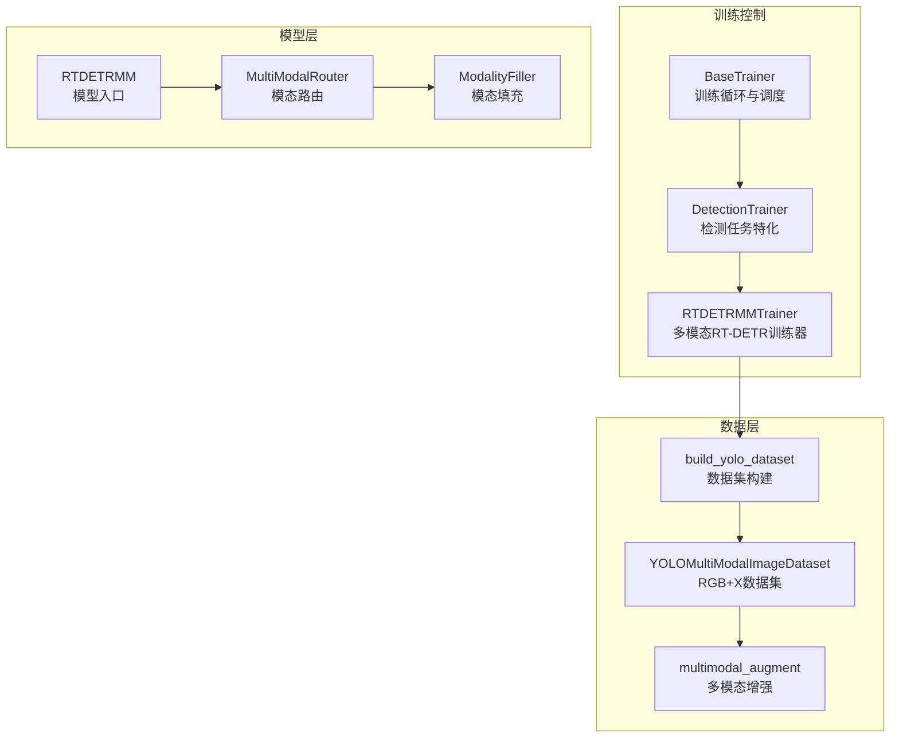
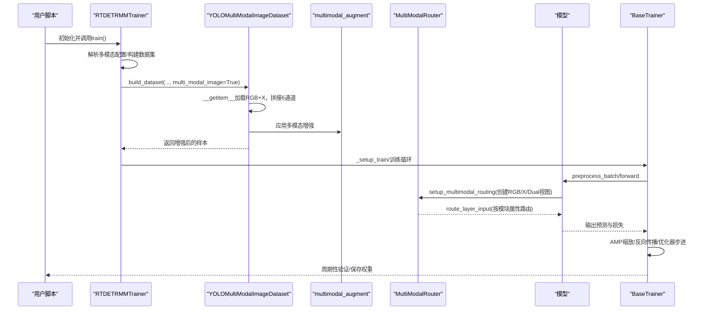
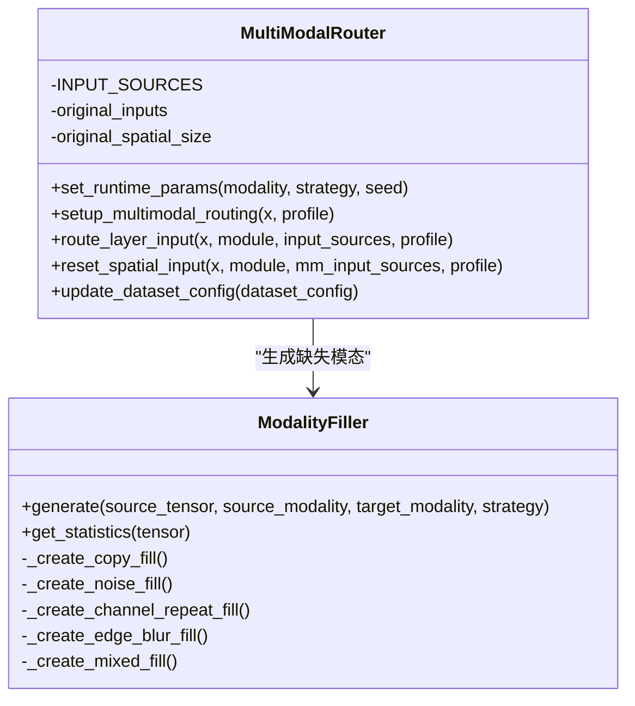
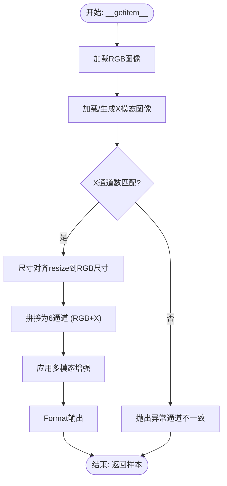
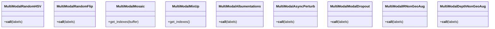
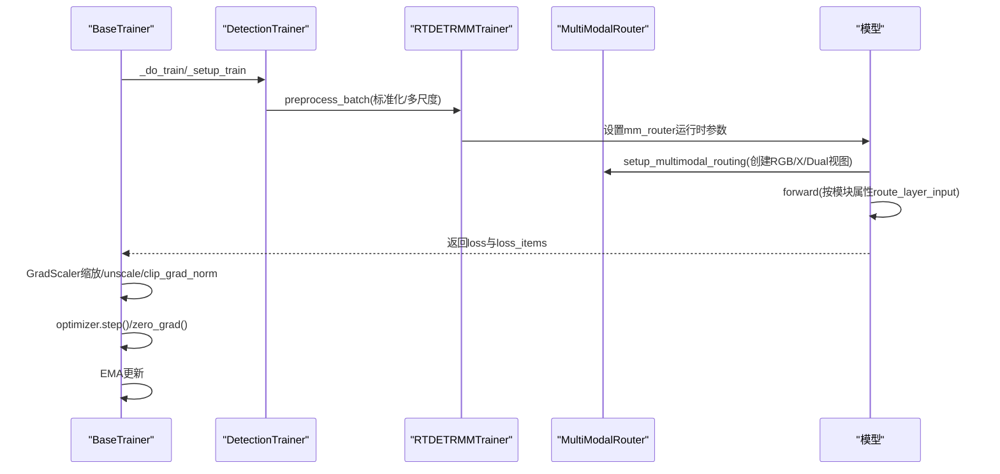
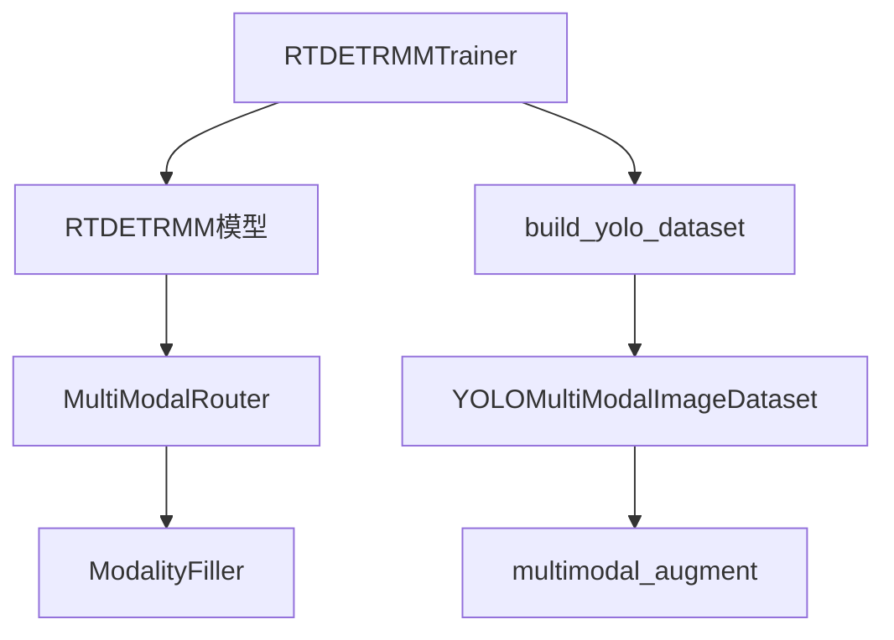

# 训练数据流

<cite>
**本文档引用的文件**
- [ultralytics/engine/trainer.py](file://ultralytics/engine/trainer.py)
- [ultralytics/models/yolo/detect/train.py](file://ultralytics/models/yolo/detect/train.py)
- [ultralytics/models/rtdetrmm/train.py](file://ultralytics/models/rtdetrmm/train.py)
- [ultralytics/data/build.py](file://ultralytics/data/build.py)
- [ultralytics/data/dataset.py](file://ultralytics/data/dataset.py)
- [ultralytics/data/multimodal_augment.py](file://ultralytics/data/multimodal_augment.py)
- [ultralytics/nn/mm/router.py](file://ultralytics/nn/mm/router.py)
- [ultralytics/nn/mm/filling.py](file://ultralytics/nn/mm/filling.py)
- [ultralytics/models/rtdetrmm/model.py](file://ultralytics/models/rtdetrmm/model.py)
- [trainMM.py](file://trainMM.py)
</cite>

## 目录
1. [简介](#简介)
2. [项目结构](#项目结构)
3. [核心组件](#核心组件)
4. [架构总览](#架构总览)
5. [详细组件分析](#详细组件分析)
6. [依赖关系分析](#依赖关系分析)
7. [性能考虑](#性能考虑)
8. [故障排除指南](#故障排除指南)
9. [结论](#结论)
10. [附录](#附录)

## 简介
本文件面向多模态训练数据流，系统化阐述从原始RGB与X模态输入到模型训练的完整数据通路。重点覆盖：
- MultiModalRouter在训练阶段的模态路由与数据分割，以及零拷贝张量视图的创建与传递机制
- 模态填充策略（随机填充、插值填充等）在训练中的应用与效果
- 训练数据批处理机制、数据增强流程与梯度传播过程
- 提供训练数据流图与具体代码示例路径，帮助读者快速定位实现细节

## 项目结构
多模态训练涉及以下关键层次：
- 训练入口与控制流：BaseTrainer、DetectionTrainer、RTDETRMMTrainer
- 数据构建与加载：build_yolo_dataset、YOLOMultiModalImageDataset
- 多模态增强：multimodal_augment中的多模态变换
- 路由与填充：MultiModalRouter、ModalityFiller
- 模型封装：RTDETRMM模型入口与路由配置

**图表来源**
- [ultralytics/engine/trainer.py:191-504](file://ultralytics/engine/trainer.py#L191-L504)
- [ultralytics/models/yolo/detect/train.py:21-200](file://ultralytics/models/yolo/detect/train.py#L21-L200)
- [ultralytics/models/rtdetrmm/train.py:24-568](file://ultralytics/models/rtdetrmm/train.py#L24-L568)
- [ultralytics/data/build.py:115-200](file://ultralytics/data/build.py#L115-L200)
- [ultralytics/data/dataset.py:423-1090](file://ultralytics/data/dataset.py#L423-L1090)
- [ultralytics/data/multimodal_augment.py:1-800](file://ultralytics/data/multimodal_augment.py#L1-L800)
- [ultralytics/models/rtdetrmm/model.py:25-269](file://ultralytics/models/rtdetrmm/model.py#L25-L269)
- [ultralytics/nn/mm/router.py:11-471](file://ultralytics/nn/mm/router.py#L11-L471)
- [ultralytics/nn/mm/filling.py:14-175](file://ultralytics/nn/mm/filling.py#L14-L175)

**章节来源**
- [ultralytics/engine/trainer.py:191-504](file://ultralytics/engine/trainer.py#L191-L504)
- [ultralytics/models/yolo/detect/train.py:21-200](file://ultralytics/models/yolo/detect/train.py#L21-L200)
- [ultralytics/models/rtdetrmm/train.py:24-568](file://ultralytics/models/rtdetrmm/train.py#L24-L568)
- [ultralytics/data/build.py:115-200](file://ultralytics/data/build.py#L115-L200)
- [ultralytics/data/dataset.py:423-1090](file://ultralytics/data/dataset.py#L423-L1090)
- [ultralytics/data/multimodal_augment.py:1-800](file://ultralytics/data/multimodal_augment.py#L1-L800)
- [ultralytics/models/rtdetrmm/model.py:25-269](file://ultralytics/models/rtdetrmm/model.py#L25-L269)
- [ultralytics/nn/mm/router.py:11-471](file://ultralytics/nn/mm/router.py#L11-L471)
- [ultralytics/nn/mm/filling.py:14-175](file://ultralytics/nn/mm/filling.py#L14-L175)

## 核心组件
- BaseTrainer：提供训练生命周期管理、DDP初始化、学习率调度、优化器步进、验证与保存等通用能力
- DetectionTrainer：针对检测任务的数据集构建、数据加载器构造、批次预处理（归一化、多尺度缩放）
- RTDETRMMTrainer：扩展检测训练器，支持RGB+X双模态输入，构建YOLOMultiModalImageDataset，注入MultiModalRouter运行时参数
- YOLOMultiModalImageDataset：实现RGB+X双模态图像加载、6通道拼接、多模态缓存、有效索引扫描、多模态增强
- MultiModalRouter：在setup_multimodal_routing中根据输入通道数与运行时参数，创建RGB/X/Dual三路零拷贝张量视图，并在route_layer_input中按模块属性路由
- ModalityFiller：提供copy、noise、channel_repeat、edge_blur、mixed等策略，生成缺失模态的合成数据，支持通道适配
- multimodal_augment：提供多模态HSV、随机翻转、Mosaic/MixUp、IR/Depth专属非空间增强等

**章节来源**
- [ultralytics/engine/trainer.py:191-504](file://ultralytics/engine/trainer.py#L191-L504)
- [ultralytics/models/yolo/detect/train.py:21-200](file://ultralytics/models/yolo/detect/train.py#L21-L200)
- [ultralytics/models/rtdetrmm/train.py:24-568](file://ultralytics/models/rtdetrmm/train.py#L24-L568)
- [ultralytics/data/dataset.py:423-1090](file://ultralytics/data/dataset.py#L423-L1090)
- [ultralytics/nn/mm/router.py:11-471](file://ultralytics/nn/mm/router.py#L11-L471)
- [ultralytics/nn/mm/filling.py:14-175](file://ultralytics/nn/mm/filling.py#L14-L175)
- [ultralytics/data/multimodal_augment.py:1-800](file://ultralytics/data/multimodal_augment.py#L1-L800)

## 架构总览
多模态训练数据流的关键路径如下：
- 训练启动：RTDETRMMTrainer在初始化时解析多模态配置，构建YOLOMultiModalImageDataset
- 数据加载：YOLOMultiModalImageDataset在__getitem__中加载RGB与X模态，拼接为6通道图像，应用多模态增强
- 路由与填充：DetectionTrainer预处理批次后，RTDETRMMTrainer设置MultiModalRouter运行时参数；模型内部在setup_multimodal_routing中创建RGB/X/Dual视图
- 前向传播：模型按模块属性route_layer_input进行模态路由，必要时使用ModalityFiller生成缺失模态
- 损失与反向：BaseTrainer执行损失计算、AMP缩放、反向传播与优化器步进
- 验证与保存：周期性验证、保存最佳/最后权重

**图表来源**
- [ultralytics/models/rtdetrmm/train.py:116-170](file://ultralytics/models/rtdetrmm/train.py#L116-L170)
- [ultralytics/data/dataset.py:567-594](file://ultralytics/data/dataset.py#L567-L594)
- [ultralytics/data/multimodal_augment.py:1-800](file://ultralytics/data/multimodal_augment.py#L1-L800)
- [ultralytics/nn/mm/router.py:157-240](file://ultralytics/nn/mm/router.py#L157-L240)
- [ultralytics/engine/trainer.py:404-421](file://ultralytics/engine/trainer.py#L404-L421)

**章节来源**
- [ultralytics/models/rtdetrmm/train.py:116-170](file://ultralytics/models/rtdetrmm/train.py#L116-L170)
- [ultralytics/data/dataset.py:567-594](file://ultralytics/data/dataset.py#L567-L594)
- [ultralytics/data/multimodal_augment.py:1-800](file://ultralytics/data/multimodal_augment.py#L1-L800)
- [ultralytics/nn/mm/router.py:157-240](file://ultralytics/nn/mm/router.py#L157-L240)
- [ultralytics/engine/trainer.py:404-421](file://ultralytics/engine/trainer.py#L404-L421)

## 详细组件分析

### MultiModalRouter：模态路由与零拷贝视图
- 初始化：从dataset_config读取Xch与x_modality，建立RGB/X/Dual通道映射
- setup_multimodal_routing：
  - 检测输入通道数，判断是否为Dual（3+Xch）或单模态（3）
  - 根据运行时参数（modality、strategy、seed）决定RGB/X填充策略
  - 通过切片创建RGB/X/Dual的零拷贝张量视图，并缓存original_inputs用于空间重置
- route_layer_input：
  - 依据模块属性_mm_input_source选择路由目标（RGB/X/Dual）
  - 特殊处理“X模态新输入起点”（from=-1），强制使用X模态输入并进行通道数校验
- reset_spatial_input：
  - 在需要空间重置的层，使用original_inputs中的X模态输入恢复原始空间尺寸

**图表来源**
- [ultralytics/nn/mm/router.py:11-471](file://ultralytics/nn/mm/router.py#L11-L471)
- [ultralytics/nn/mm/filling.py:14-175](file://ultralytics/nn/mm/filling.py#L14-L175)

**章节来源**
- [ultralytics/nn/mm/router.py:11-471](file://ultralytics/nn/mm/router.py#L11-L471)
- [ultralytics/nn/mm/filling.py:14-175](file://ultralytics/nn/mm/filling.py#L14-L175)

### YOLOMultiModalImageDataset：RGB+X数据加载与增强
- __getitem__：
  - 调用父类获取标签，加载RGB图像
  - load_multimodal_image拼接RGB+X为6通道，支持自体模态生成与通道整形
  - 应用多模态增强（mm_transforms/mm_seg_transforms），统一Format输出
- get_valid_indices：
  - 扫描有效样本索引，确保Mosaic/MixUp等增强使用的图像具备完整多模态
- cache_images/_cache_x_modality_images：
  - 支持RAM/磁盘缓存，分别缓存RGB与X模态图像，估算内存占用
- load_multimodal_image：
  - 严格校验X通道数（Xch），在启用多模态增强时禁止静默扩展
  - 通过cv2.resize保证RGB与X尺寸一致

**图表来源**
- [ultralytics/data/dataset.py:567-594](file://ultralytics/data/dataset.py#L567-L594)
- [ultralytics/data/dataset.py:693-780](file://ultralytics/data/dataset.py#L693-L780)
- [ultralytics/data/dataset.py:826-873](file://ultralytics/data/dataset.py#L826-L873)
- [ultralytics/data/dataset.py:901-1090](file://ultralytics/data/dataset.py#L901-L1090)

**章节来源**
- [ultralytics/data/dataset.py:567-594](file://ultralytics/data/dataset.py#L567-L594)
- [ultralytics/data/dataset.py:693-780](file://ultralytics/data/dataset.py#L693-L780)
- [ultralytics/data/dataset.py:826-873](file://ultralytics/data/dataset.py#L826-L873)
- [ultralytics/data/dataset.py:901-1090](file://ultralytics/data/dataset.py#L901-L1090)

### 多模态增强：策略与实现
- MultiModalRandomHSV：仅对RGB前3通道应用HSV变换，X通道保持不变
- MultiModalRandomFlip：同步对6通道图像进行水平/垂直翻转
- MultiModalMosaic/MultiModalMixUp：重写get_indexes，确保所选图像具备完整多模态
- MultiModalAlbumentations：按模态（rgb/x）选择允许的非空间算子
- MultiModalAsyncPerturb：对指定模态施加微小几何扰动
- MultiModalModalDropout：在指定模态随机矩形区域抹除
- MultiModalIRNonGeoAug/MultiModalDepthNonGeoAug：IR/Depth专属非空间增强

**图表来源**
- [ultralytics/data/multimodal_augment.py:40-148](file://ultralytics/data/multimodal_augment.py#L40-L148)
- [ultralytics/data/multimodal_augment.py:289-375](file://ultralytics/data/multimodal_augment.py#L289-L375)
- [ultralytics/data/multimodal_augment.py:378-473](file://ultralytics/data/multimodal_augment.py#L378-L473)
- [ultralytics/data/multimodal_augment.py:475-582](file://ultralytics/data/multimodal_augment.py#L475-L582)
- [ultralytics/data/multimodal_augment.py:584-766](file://ultralytics/data/multimodal_augment.py#L584-L766)
- [ultralytics/data/multimodal_augment.py:768-800](file://ultralytics/data/multimodal_augment.py#L768-L800)

**章节来源**
- [ultralytics/data/multimodal_augment.py:40-148](file://ultralytics/data/multimodal_augment.py#L40-L148)
- [ultralytics/data/multimodal_augment.py:289-375](file://ultralytics/data/multimodal_augment.py#L289-L375)
- [ultralytics/data/multimodal_augment.py:378-473](file://ultralytics/data/multimodal_augment.py#L378-L473)
- [ultralytics/data/multimodal_augment.py:475-582](file://ultralytics/data/multimodal_augment.py#L475-L582)
- [ultralytics/data/multimodal_augment.py:584-766](file://ultralytics/data/multimodal_augment.py#L584-L766)
- [ultralytics/data/multimodal_augment.py:768-800](file://ultralytics/data/multimodal_augment.py#L768-L800)

### 训练流程：批处理、前向与反向
- 批处理：DetectionTrainer.preprocess_batch将图像张量归一化到[0,1]，支持多尺度缩放
- 前向：RTDETRMMTrainer.preprocess_batch设置MultiModalRouter运行时参数，随后模型在setup_multimodal_routing中创建RGB/X/Dual视图并按模块属性路由
- 反向：BaseTrainer使用GradScaler进行AMP缩放，unscale后裁剪梯度，step优化器，周期性EMA更新

**图表来源**
- [ultralytics/models/yolo/detect/train.py:92-117](file://ultralytics/models/yolo/detect/train.py#L92-L117)
- [ultralytics/models/rtdetrmm/train.py:256-291](file://ultralytics/models/rtdetrmm/train.py#L256-L291)
- [ultralytics/nn/mm/router.py:157-240](file://ultralytics/nn/mm/router.py#L157-L240)
- [ultralytics/engine/trainer.py:414-421](file://ultralytics/engine/trainer.py#L414-L421)

**章节来源**
- [ultralytics/models/yolo/detect/train.py:92-117](file://ultralytics/models/yolo/detect/train.py#L92-L117)
- [ultralytics/models/rtdetrmm/train.py:256-291](file://ultralytics/models/rtdetrmm/train.py#L256-L291)
- [ultralytics/nn/mm/router.py:157-240](file://ultralytics/nn/mm/router.py#L157-L240)
- [ultralytics/engine/trainer.py:414-421](file://ultralytics/engine/trainer.py#L414-L421)

## 依赖关系分析
- RTDETRMMTrainer依赖RTDETRMM模型入口，后者在初始化时解析YAML/CKPT内容，确保识别多模态结构并创建MultiModalRouter
- YOLOMultiModalImageDataset依赖multimodal_augment进行多模态增强，同时与build_yolo_dataset配合，通过multi_modal_image参数启用
- MultiModalRouter与ModalityFiller协作，前者负责路由与视图管理，后者负责缺失模态合成与通道适配

**图表来源**
- [ultralytics/models/rtdetrmm/train.py:116-170](file://ultralytics/models/rtdetrmm/train.py#L116-L170)
- [ultralytics/models/rtdetrmm/model.py:25-269](file://ultralytics/models/rtdetrmm/model.py#L25-L269)
- [ultralytics/data/build.py:115-200](file://ultralytics/data/build.py#L115-L200)
- [ultralytics/data/dataset.py:423-1090](file://ultralytics/data/dataset.py#L423-L1090)
- [ultralytics/data/multimodal_augment.py:1-800](file://ultralytics/data/multimodal_augment.py#L1-L800)
- [ultralytics/nn/mm/router.py:11-471](file://ultralytics/nn/mm/router.py#L11-L471)
- [ultralytics/nn/mm/filling.py:14-175](file://ultralytics/nn/mm/filling.py#L14-L175)

**章节来源**
- [ultralytics/models/rtdetrmm/train.py:116-170](file://ultralytics/models/rtdetrmm/train.py#L116-L170)
- [ultralytics/models/rtdetrmm/model.py:25-269](file://ultralytics/models/rtdetrmm/model.py#L25-L269)
- [ultralytics/data/build.py:115-200](file://ultralytics/data/build.py#L115-L200)
- [ultralytics/data/dataset.py:423-1090](file://ultralytics/data/dataset.py#L423-L1090)
- [ultralytics/data/multimodal_augment.py:1-800](file://ultralytics/data/multimodal_augment.py#L1-L800)
- [ultralytics/nn/mm/router.py:11-471](file://ultralytics/nn/mm/router.py#L11-L471)
- [ultralytics/nn/mm/filling.py:14-175](file://ultralytics/nn/mm/filling.py#L14-L175)

## 性能考虑
- 零拷贝视图：MultiModalRouter通过切片创建RGB/X/Dual视图，避免数据复制，降低内存与带宽开销
- 缓存策略：YOLOMultiModalImageDataset支持RAM/磁盘缓存，估算X模态内存占用，平衡速度与内存
- 多模态增强：仅对RGB通道应用HSV与部分Albumentations，避免对X模态（如深度、热红外）引入不合适的颜色变换
- AMP与梯度裁剪：BaseTrainer使用GradScaler与梯度裁剪，提升稳定性与收敛速度

[本节为通用指导，无需特定文件引用]

## 故障排除指南
- 通道不一致异常：当X模态通道数与配置Xch不一致时，load_multimodal_image会抛出异常，需检查数据与配置
- 低有效样本比例：get_valid_indices扫描有效索引，若比例过低，建议启用自体模态生成或检查数据路径
- 多模态增强兼容性：Mosaic/MixUp会通过get_valid_indices确保所选图像具备完整多模态，否则采用重复选择策略
- 路由失败：route_layer_input在模块属性缺失或输入源不可用时会记录警告，需检查模型配置与运行时参数

**章节来源**
- [ultralytics/data/dataset.py:734-744](file://ultralytics/data/dataset.py#L734-L744)
- [ultralytics/data/dataset.py:631-691](file://ultralytics/data/dataset.py#L631-L691)
- [ultralytics/data/multimodal_augment.py:289-375](file://ultralytics/data/multimodal_augment.py#L289-L375)
- [ultralytics/nn/mm/router.py:242-317](file://ultralytics/nn/mm/router.py#L242-L317)

## 结论
本文档梳理了多模态训练数据流的全链路：从数据加载、多模态增强、模态路由与填充，到前向传播与梯度更新。MultiModalRouter通过零拷贝视图实现高效路由，ModalityFiller保障单模态场景下的鲁棒性，YOLOMultiModalImageDataset与multimodal_augment共同确保RGB+X数据的一致性与多样性。结合BaseTrainer与DetectionTrainer的训练框架，可稳定地支持多模态目标检测训练。

[本节为总结性内容，无需特定文件引用]

## 附录

### 训练配置与示例路径
- 训练入口示例：trainMM.py展示了YOLOMM训练器的基本使用方式
- 多模态RT-DETR训练器：RTDETRMMTrainer通过multi_modal_image=True启用RGB+X数据集
- 数据集构建：build_yolo_dataset根据参数选择YOLOMultiModalImageDataset
- 模型入口：RTDETRMM在初始化时解析YAML/CKPT，确保多模态结构识别并创建MultiModalRouter

**章节来源**
- [trainMM.py:1-15](file://trainMM.py#L1-L15)
- [ultralytics/models/rtdetrmm/train.py:116-170](file://ultralytics/models/rtdetrmm/train.py#L116-L170)
- [ultralytics/data/build.py:115-200](file://ultralytics/data/build.py#L115-L200)
- [ultralytics/models/rtdetrmm/model.py:25-269](file://ultralytics/models/rtdetrmm/model.py#L25-L269)