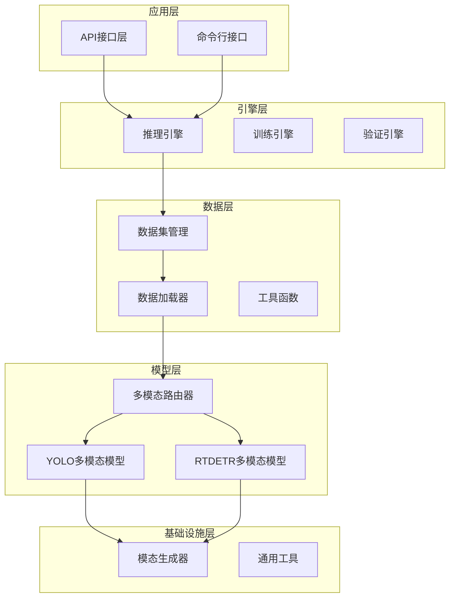
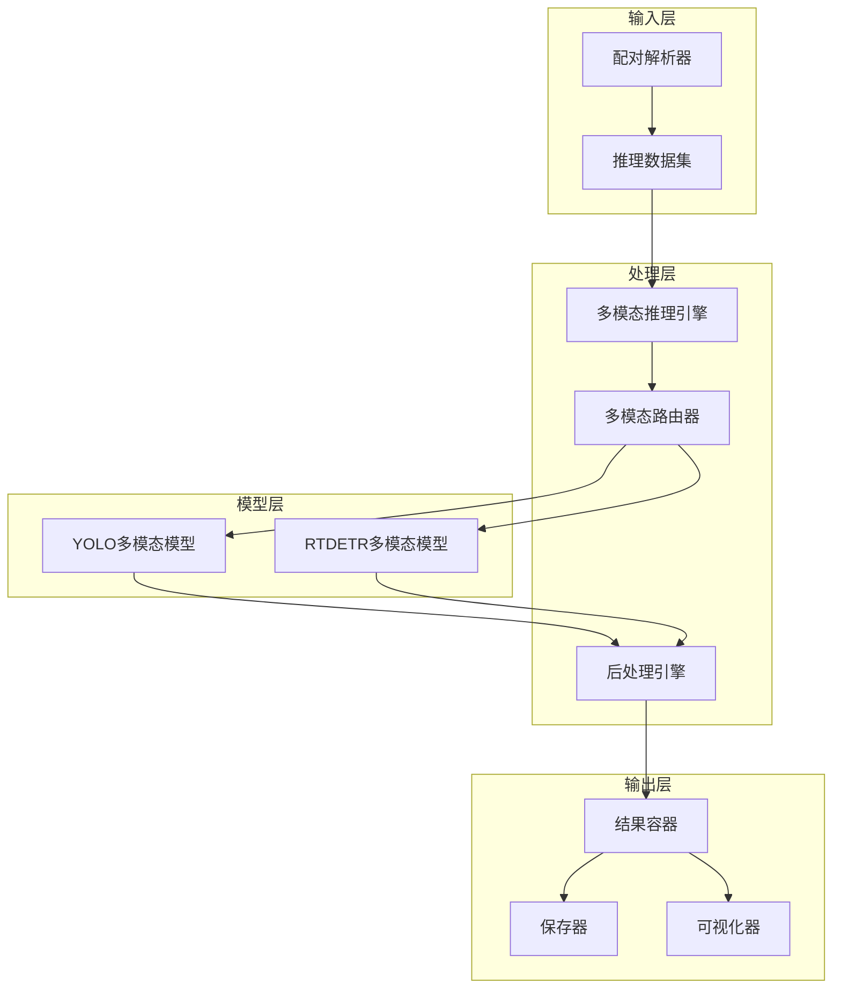
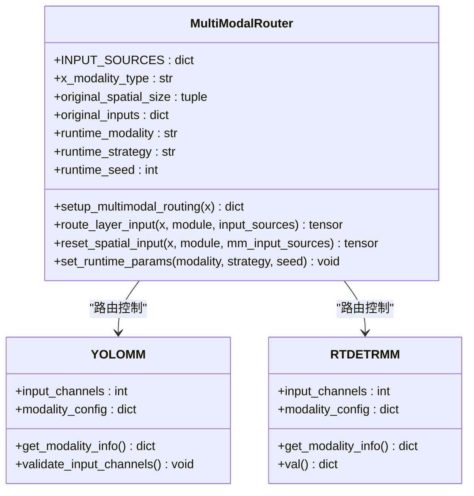
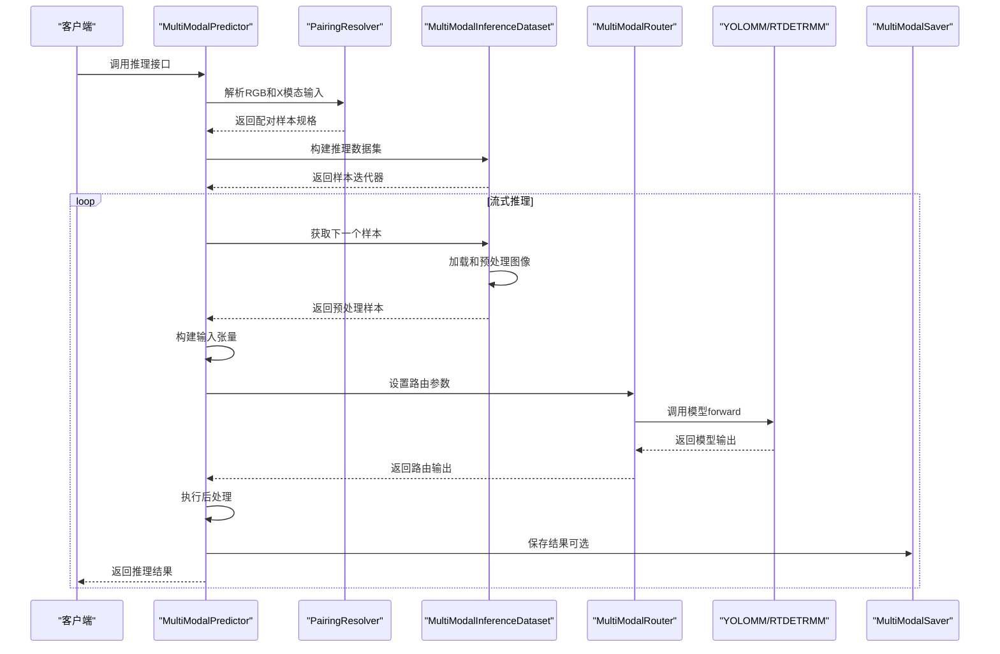
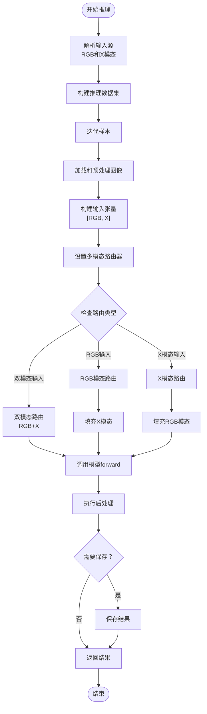
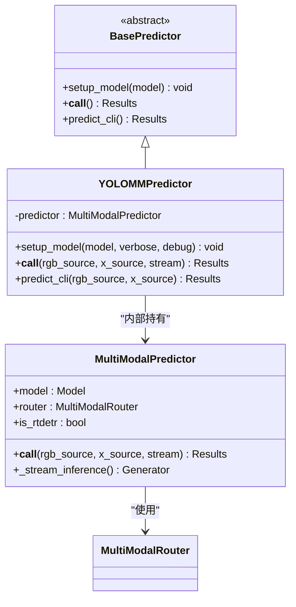
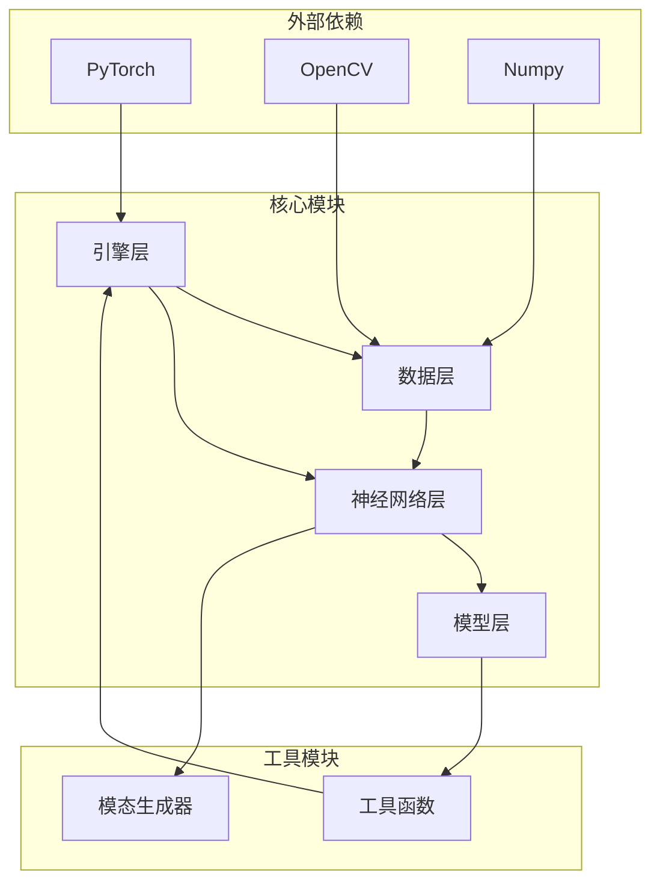

# 整体架构设计

<cite>
**本文档引用的文件**
- [ultralytics/__init__.py](file://ultralytics/__init__.py)
- [ultralytics/engine/multimodal/predictor.py](file://ultralytics/engine/multimodal/predictor.py)
- [ultralytics/engine/multimodal/results.py](file://ultralytics/engine/multimodal/results.py)
- [ultralytics/engine/multimodal/saver.py](file://ultralytics/engine/multimodal/saver.py)
- [ultralytics/data/multimodal/inference_dataset.py](file://ultralytics/data/multimodal/inference_dataset.py)
- [ultralytics/data/multimodal/pairing.py](file://ultralytics/data/multimodal/pairing.py)
- [ultralytics/data/multimodal/utils.py](file://ultralytics/data/multimodal/utils.py)
- [ultralytics/nn/mm/router.py](file://ultralytics/nn/mm/router.py)
- [ultralytics/models/yolo/model.py](file://ultralytics/models/yolo/model.py)
- [ultralytics/models/rtdetrmm/model.py](file://ultralytics/models/rtdetrmm/model.py)
- [ultralytics/models/yolo/multimodal/mm_predictor.py](file://ultralytics/models/yolo/multimodal/mm_predictor.py)
- [ultralytics/nn/mm/generators/__init__.py](file://ultralytics/nn/mm/generators/__init__.py)
</cite>

## 目录
1. [简介](#简介)
2. [项目结构](#项目结构)
3. [核心组件](#核心组件)
4. [架构概览](#架构概览)
5. [详细组件分析](#详细组件分析)
6. [依赖关系分析](#依赖关系分析)
7. [性能考虑](#性能考虑)
8. [故障排除指南](#故障排除指南)
9. [结论](#结论)

## 简介

本项目是一个基于Ultralytics框架的多模态检测系统，支持YOLO和RTDETR两种主流检测框架的多模态扩展。系统采用模块化设计原则，通过分层架构组织实现了组件解耦，支持零拷贝张量路由、配置驱动的数据流控制和运行时模态切换机制。

该系统的核心创新在于实现了统一的多模态推理引擎，能够同时支持RGB图像和任意X模态（深度、热成像、激光雷达等）的联合检测。通过MultiModalRouter组件，系统实现了灵活的模态路由和数据流控制，支持早期融合、中期融合和晚期融合等多种融合策略。

## 项目结构

系统采用清晰的分层架构设计，按照功能职责将代码组织为多个层次：

**图表来源**
- [ultralytics/__init__.py:15-28](file://ultralytics/__init__.py#L15-L28)
- [ultralytics/engine/multimodal/predictor.py:16-30](file://ultralytics/engine/multimodal/predictor.py#L16-L30)
- [ultralytics/nn/mm/router.py:11-24](file://ultralytics/nn/mm/router.py#L11-L24)

**章节来源**
- [ultralytics/__init__.py:15-28](file://ultralytics/__init__.py#L15-L28)
- [ultralytics/engine/multimodal/predictor.py:16-30](file://ultralytics/engine/multimodal/predictor.py#L16-L30)
- [ultralytics/nn/mm/router.py:11-24](file://ultralytics/nn/mm/router.py#L11-L24)

## 核心组件

### 多模态推理引擎

MultiModalPredictor是系统的核心组件，实现了完全独立的多模态推理能力：

- **零拷贝张量路由**：通过MultiModalRouter实现输入张量的零拷贝视图路由
- **配置驱动的数据流**：基于模型配置的动态数据流控制
- **运行时模态切换**：支持RGB、X模态和双模态的动态切换
- **流式推理支持**：真正的边迭代边返回的流式处理

### 数据处理管道

系统提供了完整的数据处理管道，包括：

- **显式配对解析器**：支持RGB和X模态的显式配对输入
- **推理数据集**：专为推理设计的数据集管理器
- **预处理工具**：统一的图像预处理和对齐工具

### 模型适配层

系统实现了两个主要模型的多模态适配：

- **YOLOMM**：YOLO架构的多模态扩展
- **RTDETRMM**：RTDETR架构的多模态扩展

**章节来源**
- [ultralytics/engine/multimodal/predictor.py:16-98](file://ultralytics/engine/multimodal/predictor.py#L16-L98)
- [ultralytics/data/multimodal/pairing.py:11-24](file://ultralytics/data/multimodal/pairing.py#L11-L24)
- [ultralytics/data/multimodal/inference_dataset.py:16-30](file://ultralytics/data/multimodal/inference_dataset.py#L16-L30)

## 架构概览

系统采用模块化分层架构，通过清晰的接口定义实现了组件间的松耦合：

**图表来源**
- [ultralytics/engine/multimodal/predictor.py:99-142](file://ultralytics/engine/multimodal/predictor.py#L99-L142)
- [ultralytics/nn/mm/router.py:157-240](file://ultralytics/nn/mm/router.py#L157-L240)
- [ultralytics/engine/multimodal/results.py:14-28](file://ultralytics/engine/multimodal/results.py#L14-L28)

## 详细组件分析

### 多模态路由器（MultiModalRouter）

MultiModalRouter是系统的核心路由组件，实现了零拷贝张量路由和配置驱动的数据流控制：

**图表来源**
- [ultralytics/nn/mm/router.py:11-63](file://ultralytics/nn/mm/router.py#L11-L63)
- [ultralytics/models/yolo/model.py:456-476](file://ultralytics/models/yolo/model.py#L456-L476)
- [ultralytics/models/rtdetrmm/model.py:25-47](file://ultralytics/models/rtdetrmm/model.py#L25-L47)

MultiModalRouter的关键特性包括：

1. **零拷贝张量路由**：通过张量视图实现数据的零拷贝传递
2. **配置驱动**：基于模型配置的动态路由决策
3. **运行时切换**：支持RGB、X模态和双模态的动态切换
4. **空间重置**：支持X模态的空间尺寸重置功能

### 推理引擎序列图

**图表来源**
- [ultralytics/engine/multimodal/predictor.py:99-243](file://ultralytics/engine/multimodal/predictor.py#L99-L243)
- [ultralytics/data/multimodal/pairing.py:37-125](file://ultralytics/data/multimodal/pairing.py#L37-L125)
- [ultralytics/data/multimodal/inference_dataset.py:94-183](file://ultralytics/data/multimodal/inference_dataset.py#L94-L183)

### 数据流控制算法

**图表来源**
- [ultralytics/engine/multimodal/predictor.py:144-243](file://ultralytics/engine/multimodal/predictor.py#L144-L243)
- [ultralytics/nn/mm/router.py:157-240](file://ultralytics/nn/mm/router.py#L157-L240)

**章节来源**
- [ultralytics/nn/mm/router.py:11-471](file://ultralytics/nn/mm/router.py#L11-L471)
- [ultralytics/engine/multimodal/predictor.py:144-243](file://ultralytics/engine/multimodal/predictor.py#L144-L243)

### 模型适配器

系统提供了两个主要的模型适配器，实现了与BasePredictor接口的兼容：

**图表来源**
- [ultralytics/models/yolo/multimodal/mm_predictor.py:18-31](file://ultralytics/models/yolo/multimodal/mm_predictor.py#L18-L31)
- [ultralytics/engine/multimodal/predictor.py:16-30](file://ultralytics/engine/multimodal/predictor.py#L16-L30)

**章节来源**
- [ultralytics/models/yolo/multimodal/mm_predictor.py:18-136](file://ultralytics/models/yolo/multimodal/mm_predictor.py#L18-L136)
- [ultralytics/models/yolo/model.py:456-476](file://ultralytics/models/yolo/model.py#L456-L476)

## 依赖关系分析

系统采用了清晰的依赖层次结构，避免了循环依赖：

**图表来源**
- [ultralytics/engine/multimodal/predictor.py:6-13](file://ultralytics/engine/multimodal/predictor.py#L6-L13)
- [ultralytics/data/multimodal/utils.py:6-10](file://ultralytics/data/multimodal/utils.py#L6-L10)

系统的主要依赖关系特点：

1. **单向依赖**：所有依赖都是单向的，避免了循环依赖问题
2. **接口隔离**：通过清晰的接口定义实现了模块间的解耦
3. **可替换性**：各个组件都设计为可替换的，便于扩展和维护

**章节来源**
- [ultralytics/engine/multimodal/predictor.py:6-13](file://ultralytics/engine/multimodal/predictor.py#L6-L13)
- [ultralytics/data/multimodal/utils.py:6-10](file://ultralytics/data/multimodal/utils.py#L6-L10)

## 性能考虑

系统在设计时充分考虑了性能优化：

### 零拷贝优化
- **张量视图路由**：MultiModalRouter使用张量视图而非数据复制
- **内存共享**：通过缓存原始输入实现内存共享
- **批处理优化**：支持流式批处理减少内存占用

### 计算效率
- **动态路由**：根据模型配置动态选择最优路由路径
- **条件执行**：只在需要时执行模态填充和转换操作
- **并行处理**：支持多线程和GPU加速

### 内存管理
- **延迟加载**：只在需要时加载和处理数据
- **资源池**：复用中间结果减少内存分配
- **垃圾回收**：及时释放临时张量和中间变量

## 故障排除指南

### 常见问题及解决方案

1. **模型类型检测失败**
   - 检查模型文件是否包含正确的多模态标记
   - 验证模型配置中的模态层定义
   - 确认模型权重文件完整性

2. **输入尺寸不匹配**
   - 检查RGB和X模态图像的尺寸一致性
   - 验证推理尺寸配置是否正确
   - 确认LetterBox预处理参数设置

3. **通道数不匹配**
   - 验证X模态的通道数配置
   - 检查模态转换规则是否适用
   - 确认输入张量的通道排列顺序

4. **推理性能问题**
   - 检查设备配置（CPU/GPU）
   - 验证批处理大小设置
   - 确认模型量化和优化选项

**章节来源**
- [ultralytics/engine/multimodal/predictor.py:279-321](file://ultralytics/engine/multimodal/predictor.py#L279-L321)
- [ultralytics/data/multimodal/utils.py:13-83](file://ultralytics/data/multimodal/utils.py#L13-L83)

## 结论

本多模态检测系统通过模块化设计和分层架构实现了YOLO和RTDETR框架的统一扩展。系统的核心优势包括：

1. **统一的多模态接口**：通过MultiModalPredictor实现了统一的推理接口
2. **灵活的路由机制**：MultiModalRouter支持多种融合策略和运行时切换
3. **高性能实现**：通过零拷贝和配置驱动优化实现了高效的推理性能
4. **良好的可扩展性**：清晰的模块划分便于添加新的模态和融合策略

系统的设计充分体现了现代深度学习框架的最佳实践，为多模态目标检测任务提供了一个强大而灵活的解决方案。通过配置驱动的数据流控制和运行时模态切换机制，系统能够在不同的应用场景中实现最优的性能表现。