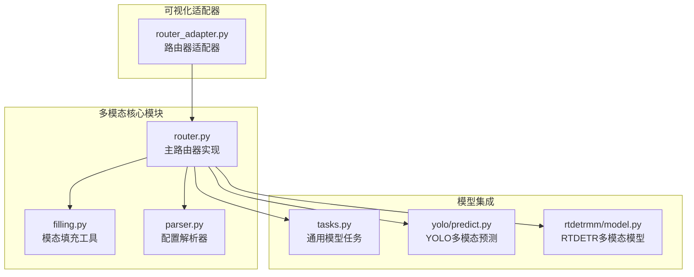
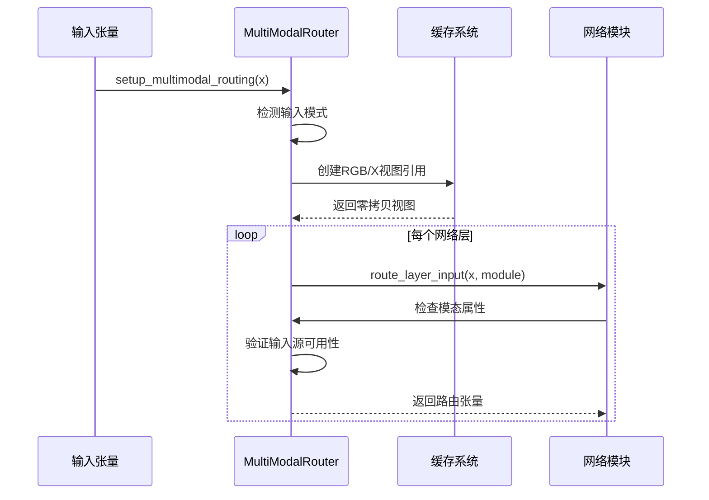
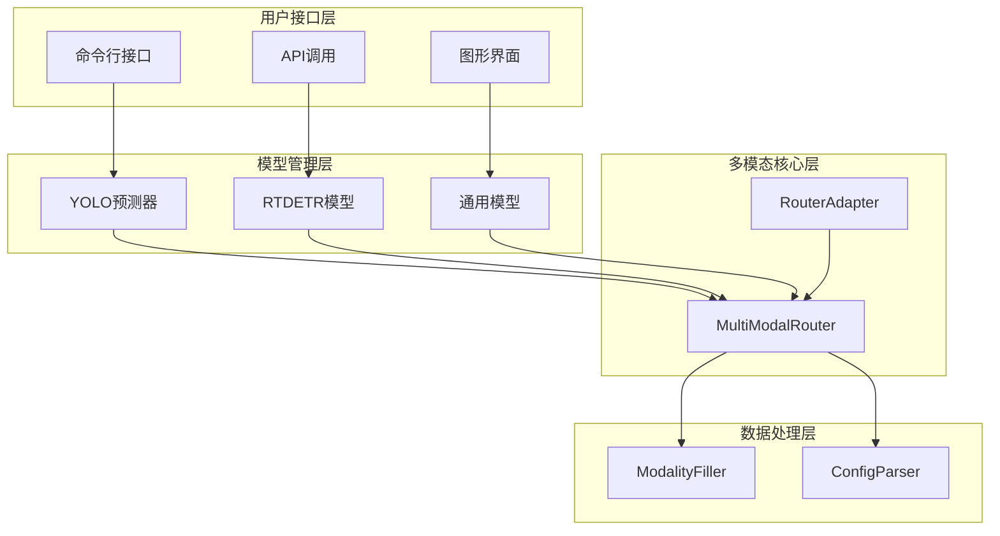
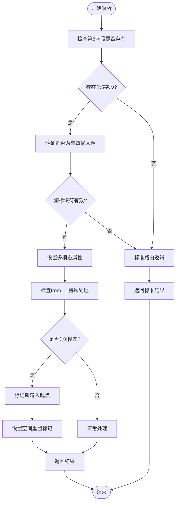
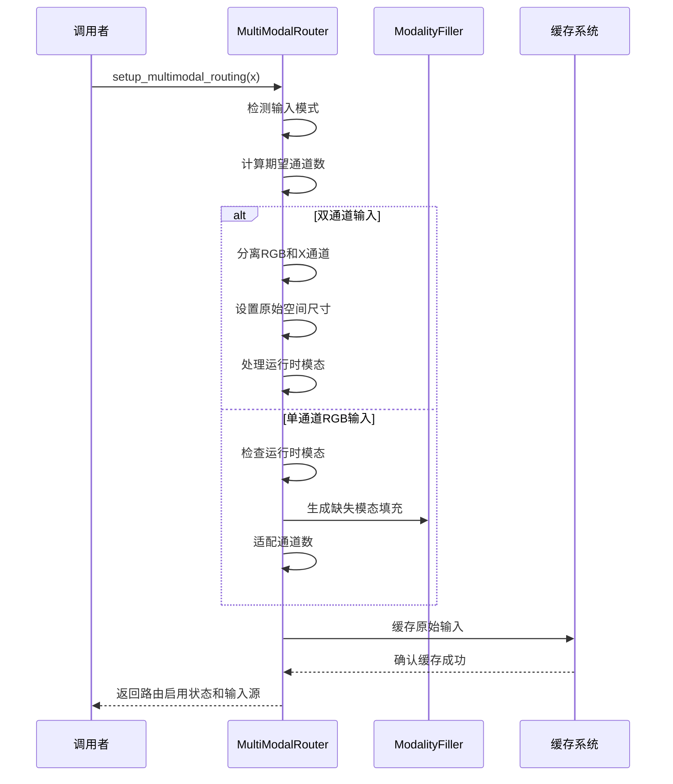
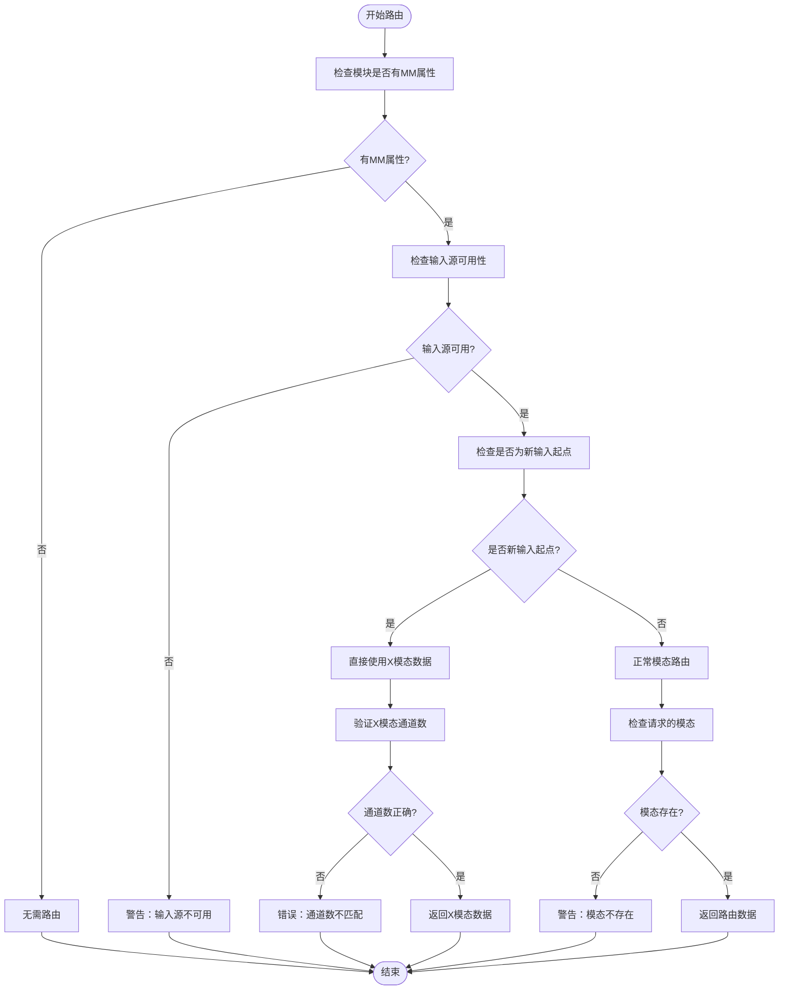
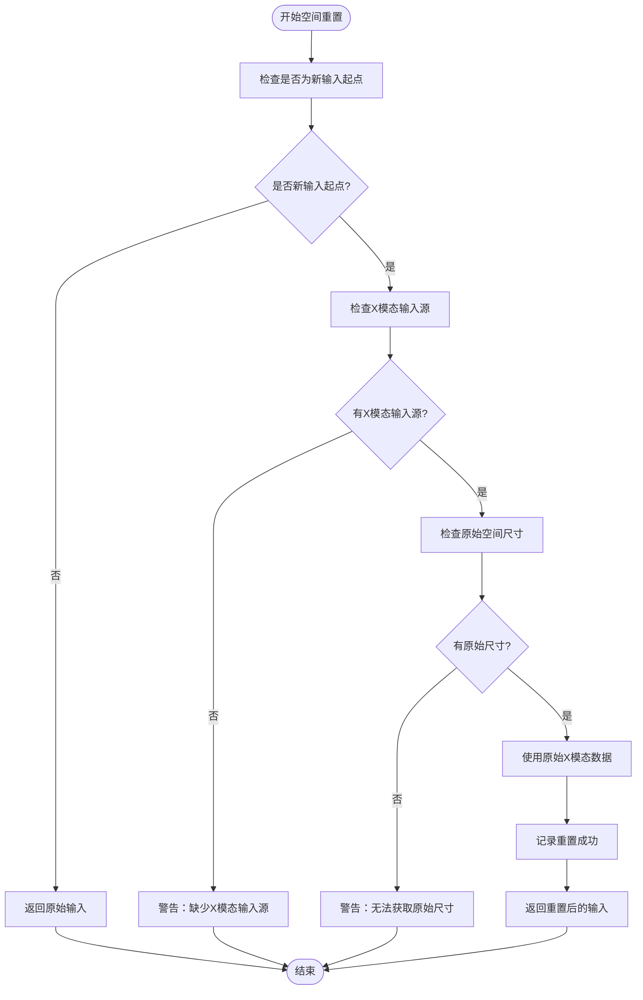
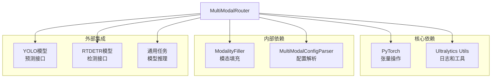

# MultiModalRouter核心模块

<cite>
**本文档引用的文件**
- [router.py](file://ultralytics/nn/mm/router.py)
- [filling.py](file://ultralytics/nn/mm/filling.py)
- [parser.py](file://ultralytics/nn/mm/parser.py)
- [tasks.py](file://ultralytics/nn/tasks.py)
- [predict.py](file://ultralytics/models/yolo/multimodal/predict.py)
- [model.py](file://ultralytics/models/rtdetrmm/model.py)
- [router_adapter.py](file://ultralytics/models/utils/multimodal/visualize_core/router_adapter.py)
</cite>

## 目录
1. [简介](#简介)
2. [项目结构](#项目结构)
3. [核心组件](#核心组件)
4. [架构概览](#架构概览)
5. [详细组件分析](#详细组件分析)
6. [依赖关系分析](#依赖关系分析)
7. [性能考虑](#性能考虑)
8. [故障排除指南](#故障排除指南)
9. [结论](#结论)
10. [附录](#附录)

## 简介

MultiModalRouter是Ultralytics多模态视觉检测系统的核心组件，专为支持RGB和X模态（深度、热成像、LiDAR等）的联合推理而设计。该模块实现了零拷贝张量视图路由机制，能够在不进行数据复制的情况下实现高效的多模态数据流管理。

该路由器支持三种输入模式：
- **RGB模式**：3通道可见光图像输入
- **X模态**：3通道统一其他模态输入（深度/热成像/激光雷达等）
- **双模态**：6通道RGB+X拼接输入

## 项目结构

MultiModalRouter位于Ultralytics项目的多模态神经网络模块中，主要文件组织如下：

**图表来源**
- [router.py:1-471](file://ultralytics/nn/mm/router.py#L1-L471)
- [filling.py:1-175](file://ultralytics/nn/mm/filling.py#L1-L175)
- [parser.py:67-97](file://ultralytics/nn/mm/parser.py#L67-L97)

**章节来源**
- [router.py:1-471](file://ultralytics/nn/mm/router.py#L1-L471)
- [filling.py:1-175](file://ultralytics/nn/mm/filling.py#L1-L175)
- [parser.py:67-97](file://ultralytics/nn/mm/parser.py#L67-L97)

## 核心组件

### MultiModalRouter类设计

MultiModalRouter采用面向对象的设计模式，提供了完整的多模态数据路由解决方案。其核心设计理念包括：

**初始化过程**：
1. 从配置字典中提取X模态通道数和类型信息
2. 建立输入源映射表（RGB、X、Dual）
3. 检测多模态配置并设置相应标志
4. 初始化运行时参数（模态、策略、种子）

**核心功能特性**：
- 零拷贝张量视图路由机制
- 配置驱动的数据流控制
- 支持YOLO和RTDETR架构
- 动态空间重置功能
- 模态消融和填充策略

**章节来源**
- [router.py:31-63](file://ultralytics/nn/mm/router.py#L31-L63)
- [router.py:11-24](file://ultralytics/nn/mm/router.py#L11-L24)

### 零拷贝张量视图路由机制

MultiModalRouter实现了高效的零拷贝张量视图路由，通过以下机制实现：

**图表来源**
- [router.py:157-240](file://ultralytics/nn/mm/router.py#L157-L240)
- [router.py:242-317](file://ultralytics/nn/mm/router.py#L242-L317)

**章节来源**
- [router.py:157-240](file://ultralytics/nn/mm/router.py#L157-L240)
- [router.py:242-317](file://ultralytics/nn/mm/router.py#L242-L317)

## 架构概览

MultiModalRouter在整个Ultralytics框架中的位置和交互关系：

**图表来源**
- [predict.py:100-136](file://ultralytics/models/yolo/multimodal/predict.py#L100-L136)
- [model.py:166-174](file://ultralytics/models/rtdetrmm/model.py#L166-L174)
- [tasks.py:902-951](file://ultralytics/nn/tasks.py#L902-L951)

**章节来源**
- [predict.py:100-136](file://ultralytics/models/yolo/multimodal/predict.py#L100-L136)
- [model.py:166-174](file://ultralytics/models/rtdetrmm/model.py#L166-L174)
- [tasks.py:902-951](file://ultralytics/nn/tasks.py#L902-L951)

## 详细组件分析

### 配置解析方法parse_layer_config

parse_layer_config方法负责解析层配置并处理第5字段的多模态路由标识符：

**图表来源**
- [router.py:90-155](file://ultralytics/nn/mm/router.py#L90-L155)

**章节来源**
- [router.py:90-155](file://ultralytics/nn/mm/router.py#L90-L155)

### setup_multimodal_routing方法

setup_multimodal_routing方法负责设置输入源并初始化路由系统：

**图表来源**
- [router.py:157-240](file://ultralytics/nn/mm/router.py#L157-L240)

**章节来源**
- [router.py:157-240](file://ultralytics/nn/mm/router.py#L157-L240)

### route_layer_input方法

route_layer_input方法实现了层输入的路由机制：

**图表来源**
- [router.py:242-317](file://ultralytics/nn/mm/router.py#L242-L317)

**章节来源**
- [router.py:242-317](file://ultralytics/nn/mm/router.py#L242-L317)

### reset_spatial_input方法

reset_spatial_input方法实现了空间重置功能：

**图表来源**
- [router.py:365-404](file://ultralytics/nn/mm/router.py#L365-L404)

**章节来源**
- [router.py:365-404](file://ultralytics/nn/mm/router.py#L365-L404)

## 依赖关系分析

MultiModalRouter与其他组件的依赖关系：

**图表来源**
- [router.py:5-8](file://ultralytics/nn/mm/router.py#L5-L8)
- [filling.py:10-11](file://ultralytics/nn/mm/filling.py#L10-L11)
- [parser.py:67-97](file://ultralytics/nn/mm/parser.py#L67-L97)

**章节来源**
- [router.py:5-8](file://ultralytics/nn/mm/router.py#L5-L8)
- [filling.py:10-11](file://ultralytics/nn/mm/filling.py#L10-L11)
- [parser.py:67-97](file://ultralytics/nn/mm/parser.py#L67-L97)

## 性能考虑

### 零拷贝优化策略

MultiModalRouter通过以下方式实现高性能：

1. **视图而非副本**：使用张量视图避免数据复制
2. **延迟计算**：仅在需要时生成填充数据
3. **内存池**：复用中间计算结果
4. **批处理优化**：支持批量推理减少开销

### 内存管理

- 原始输入缓存使用零拷贝引用
- 模态填充数据按需生成
- 空间重置避免重复内存分配

## 故障排除指南

### 常见问题及解决方案

**问题1：输入源不可用**
- 检查输入张量的通道数和形状
- 验证运行时模态设置是否正确
- 确认配置文件中的多模态标记

**问题2：通道数不匹配**
- 检查X模态的通道数配置
- 验证输入数据的预处理
- 确认模态填充策略的正确性

**问题3：空间重置失败**
- 检查原始空间尺寸是否正确设置
- 验证X模态输入源的存在性
- 确认新输入起点的标记

**章节来源**
- [router.py:255-317](file://ultralytics/nn/mm/router.py#L255-L317)
- [router.py:378-404](file://ultralytics/nn/mm/router.py#L378-L404)

## 结论

MultiModalRouter作为Ultralytics多模态视觉系统的核心组件，通过其精心设计的零拷贝张量视图路由机制，为RGB和X模态的联合推理提供了高效、灵活的解决方案。其模块化的架构设计使得不同类型的视觉模型（YOLO、RTDETR）都能无缝集成多模态能力。

该路由器的主要优势包括：
- **高性能**：零拷贝机制确保最小的内存和计算开销
- **灵活性**：支持多种输入模式和运行时配置
- **可扩展性**：模块化设计便于添加新的模态和功能
- **易用性**：简洁的API和完善的错误处理机制

## 附录

### 使用示例和最佳实践

**基本使用流程**：
1. 创建MultiModalRouter实例
2. 设置运行时参数
3. 调用setup_multimodal_routing进行初始化
4. 在推理过程中调用route_layer_input进行路由
5. 必要时使用reset_spatial_input进行空间重置

**最佳实践建议**：
- 在模型初始化时设置合适的运行时参数
- 确保输入数据的预处理符合预期格式
- 合理使用模态消融策略进行性能测试
- 定期检查内存使用情况避免泄漏

**章节来源**
- [predict.py:115-136](file://ultralytics/models/yolo/multimodal/predict.py#L115-L136)
- [tasks.py:902-951](file://ultralytics/nn/tasks.py#L902-L951)