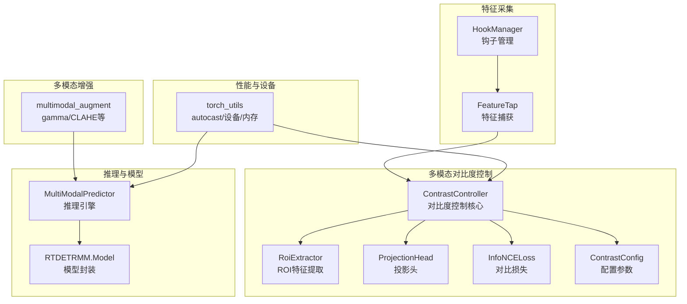
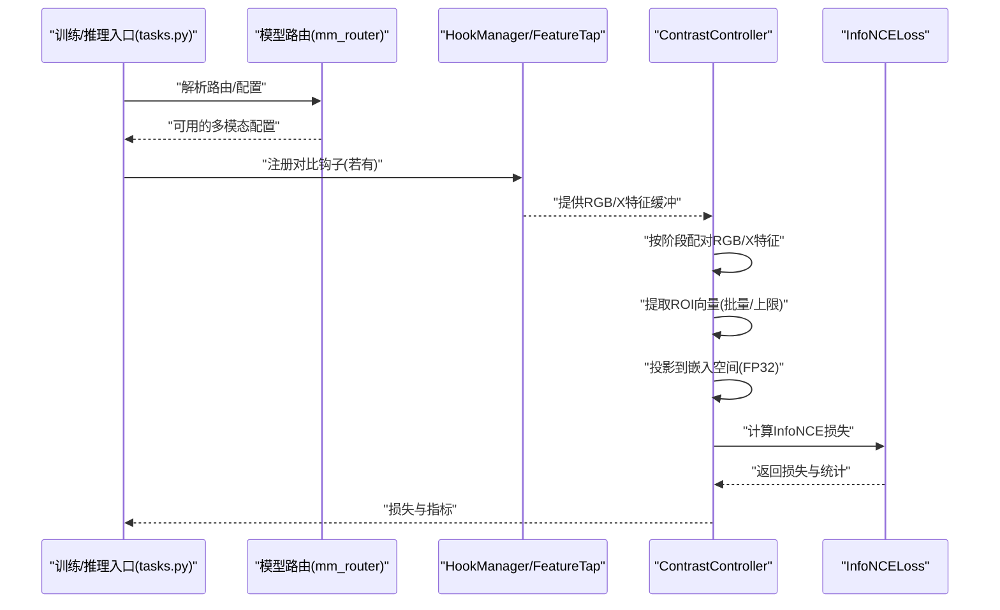
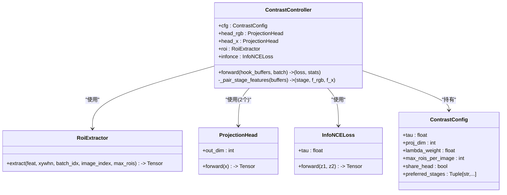
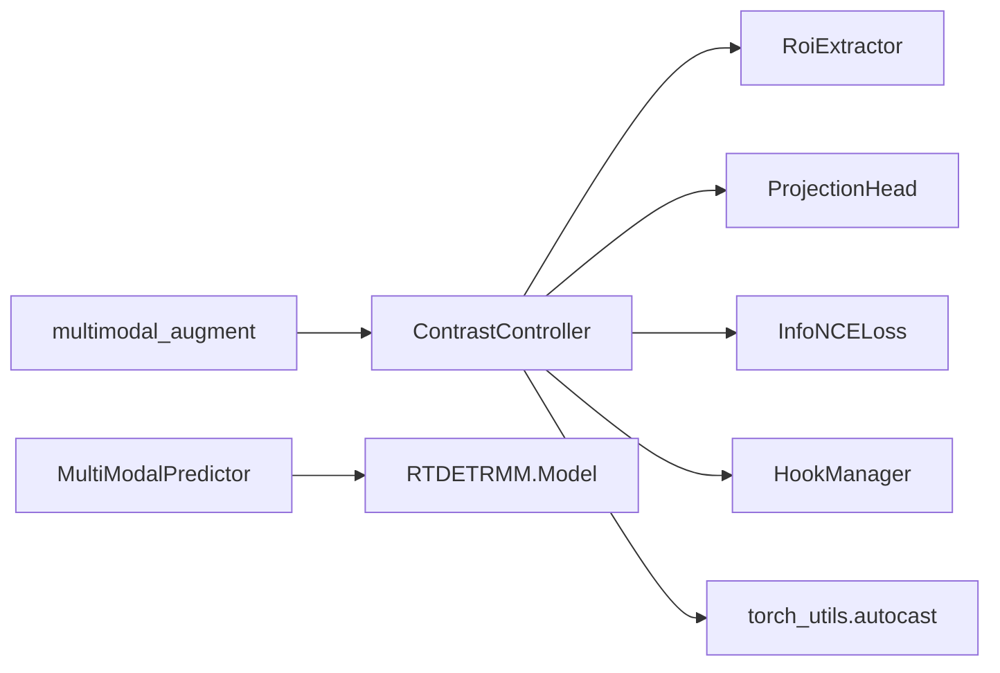

# 对比度控制系统

<cite>
**本文引用的文件**
- [ultralytics\nn\mm\contrast.py](file://ultralytics\nn\mm\contrast.py)
- [ultralytics\nn\mm\hook.py](file://ultralytics\nn\mm\hook.py)
- [ultralytics\nn\tasks.py](file://ultralytics\nn\tasks.py)
- [ultralytics\data\multimodal_augment.py](file://ultralytics\data\multimodal_augment.py)
- [ultralytics\utils\torch_utils.py](file://ultralytics\utils\torch_utils.py)
- [ultralytics\engine\multimodal\predictor.py](file://ultralytics\engine\multimodal\predictor.py)
- [ultralytics\models\rtdetrmm\model.py](file://ultralytics\models\rtdetrmm\model.py)
- [ultralytics\nn\modules\fusion\FCM_FFN.py](file://ultralytics\nn\modules\fusion\FCM_FFN.py)
- [ultralytics\nn\Neck\neck_variants.py](file://ultralytics\nn\Neck\neck_variants.py)
- [ultralytics\engine\tuner.py](file://ultralytics\engine\tuner.py)
- [ultralytics\cfg\default.yaml](file://ultralytics\cfg\default.yaml)
- [ultralytics\nn\mm\parser.py](file://ultralytics\nn\mm\parser.py)
- [ultralytics\nn\mm\router.py](file://ultralytics\nn\mm\router.py)
</cite>

## 目录
1. [简介](#简介)
2. [项目结构](#项目结构)
3. [核心组件](#核心组件)
4. [架构总览](#架构总览)
5. [详细组件分析](#详细组件分析)
6. [依赖分析](#依赖分析)
7. [性能考虑](#性能考虑)
8. [故障排查指南](#故障排查指南)
9. [结论](#结论)
10. [附录](#附录)

## 简介
本文件系统性阐述对比度控制系统的设计与实现，重点围绕 ContrastController 类及其配套组件，解释其在多模态融合场景中的作用、自适应对比度调节的数学原理与工程实现、参数动态调整机制、性能优化策略以及调优指南。对比度控制贯穿于特征抽取、投影与对比学习损失计算的全链路，既可用于训练阶段的对比学习增强，也可用于推理阶段的特征稳定性保障。

## 项目结构
对比度控制系统位于多模态框架的特征级对比学习子系统中，主要涉及以下模块：
- 对比度控制器与工具：ContrastController、RoiExtractor、ProjectionHead、InfoNCELoss、ContrastConfig
- 特征钩子与缓冲：HookManager、FeatureTap
- 训练/推理集成：tasks.py 中的控制器挂载逻辑
- 多模态增强（对比度相关）：multimodal_augment.py 中的 gamma、CLAHE 等算子
- 性能与设备：torch_utils 的 autocast、设备选择与内存监控
- 推理引擎与模型封装：multimodal\predictor.py、RTDETRMM\Model

图表来源
- [ultralytics\nn\mm\contrast.py:149-290](file://ultralytics\nn\mm\contrast.py#L149-L290)
- [ultralytics\nn\mm\hook.py:172-310](file://ultralytics\nn\mm\hook.py#L172-L310)
- [ultralytics\data\multimodal_augment.py:673-1014](file://ultralytics\data\multimodal_augment.py#L673-L1014)
- [ultralytics\utils\torch_utils.py:77-104](file://ultralytics\utils\torch_utils.py#L77-L104)
- [ultralytics\engine\multimodal\predictor.py:16-494](file://ultralytics\engine\multimodal\predictor.py#L16-L494)
- [ultralytics\models\rtdetrmm\model.py:25-188](file://ultralytics\models\rtdetrmm\model.py#L25-L188)

章节来源
- [ultralytics\nn\mm\contrast.py:1-290](file://ultralytics\nn\mm\contrast.py#L1-L290)
- [ultralytics\nn\mm\hook.py:1-310](file://ultralytics\nn\mm\hook.py#L1-L310)
- [ultralytics\nn\tasks.py:1123-1143](file://ultralytics\nn\tasks.py#L1123-L1143)
- [ultralytics\data\multimodal_augment.py:673-1014](file://ultralytics\data\multimodal_augment.py#L673-L1014)
- [ultralytics\utils\torch_utils.py:1-200](file://ultralytics\utils\torch_utils.py#L1-L200)

## 核心组件
- ContrastController：负责从钩子缓冲中配对 RGB 与 X 模态特征，提取 ROI 向量，经投影头得到归一化嵌入，并计算 InfoNCE 对比损失，输出损失与统计信息。
- RoiExtractor：基于 GT 框在特征图上进行平均池化提取 ROI 向量，支持批量与最大 ROI 数限制。
- ProjectionHead：两层 MLP 投影头，使用 FP32 计算以提升数值稳定性和 AMP 兼容性。
- InfoNCELoss：对称的 NT-Xent 损失，温度参数 tau 控制相似度分布。
- ContrastConfig：对比度控制的超参数容器，包括温度、投影维度、正则权重、最大 ROI 数、共享投影头、优选特征阶段等。
- HookManager/FeatureTap：轻量钩子管理与特征捕获，自动命名缓冲区，支持 detach 与 L2 归一化，提供数值护栏（NaN/Inf 有限化）。

章节来源
- [ultralytics\nn\mm\contrast.py:39-290](file://ultralytics\nn\mm\contrast.py#L39-L290)
- [ultralytics\nn\mm\hook.py:51-310](file://ultralytics\nn\mm\hook.py#L51-L310)

## 架构总览
ContrastController 通过 HookManager 注册的特征钩子收集 RGB 与 X 的特征，按阶段（如 P3/P4/P5）配对，提取 ROI 向量，分别通过投影头映射到同一嵌入空间，最后计算对比损失。该过程在 tasks.py 中根据是否存在对比钩子与参数自动创建控制器，并将其放置在与模型相同的设备上，确保前向调用时的设备一致性。

图表来源
- [ultralytics\nn\tasks.py:1123-1143](file://ultralytics\nn\tasks.py#L1123-L1143)
- [ultralytics\nn\mm\hook.py:172-310](file://ultralytics\nn\mm\hook.py#L172-L310)
- [ultralytics\nn\mm\contrast.py:149-290](file://ultralytics\nn\mm\contrast.py#L149-L290)

## 详细组件分析

### ContrastController 类设计与实现
- 设计目标
  - 在多模态检测中，通过对比学习增强 RGB 与 X 模态特征的一致性，提升跨模态特征对齐能力。
  - 通过 ROI 级别的对比学习，使模型在弱监督或少量标注情况下也能获得稳健的特征表示。
- 核心流程
  - 钩子特征配对：按阶段（P3/P4/P5）与模态（RGB/X）配对，优先使用配置中的首选阶段。
  - ROI 提取：对每张图像的 GT 框进行特征图上的平均池化，限制最大 ROI 数。
  - 投影与归一化：使用 ProjectionHead 将 ROI 向量映射到单位球面，提升对比学习稳定性。
  - 对比损失：使用 InfoNCELoss 计算对称的对比损失，统计相似度均值与配对数量。
- 动态调整与自适应
  - 通过 ContrastConfig 的 tau、proj_dim、lambda_weight 等参数控制对比学习强度与嵌入空间规模。
  - preferred_stages 可根据任务特性动态调整优先使用的特征阶段。
- 数值护栏与稳定性
  - 在钩子捕获、ROI 提取、投影与损失计算过程中，均进行 NaN/Inf 有限化与数值检查，避免训练不稳定。

图表来源
- [ultralytics\nn\mm\contrast.py:149-290](file://ultralytics\nn\mm\contrast.py#L149-L290)

章节来源
- [ultralytics\nn\mm\contrast.py:149-290](file://ultralytics\nn\mm\contrast.py#L149-L290)

### ROI 提取与投影头
- ROI 提取
  - 将 GT 框从归一化坐标转换到特征图坐标，进行整数裁剪，确保至少 1x1 的区域，然后对每个 ROI 进行平均池化得到向量。
  - 支持批量图像与最大 ROI 数限制，避免过量计算。
- 投影头
  - 使用 LazyLinear 在首次前向时确定参数位置与设备，FP32 计算以提升数值稳定性。
  - 输出 L2 归一化嵌入，便于对比学习。

章节来源
- [ultralytics\nn\mm\contrast.py:45-116](file://ultralytics\nn\mm\contrast.py#L45-L116)

### 对比损失与温度控制
- InfoNCELoss
  - 对称的 NT-Xent 损失，使用温度参数 tau 控制相似度分布的锐利程度。
  - 在 FP32 下计算 logits，避免数值溢出。
- 统计输出
  - 返回相似度均值与配对数量，便于监控对比学习效果。

章节来源
- [ultralytics\nn\mm\contrast.py:118-137](file://ultralytics\nn\mm\contrast.py#L118-L137)

### 钩子系统与特征缓冲
- 自动命名与解析
  - 通过 CL.RGB.P4.L6.output 等命名规范自动解析模态与阶段，支持重复钩子的后缀编号。
- 数值护栏
  - 在捕获时进行 NaN/Inf 有限化，并可选择 L2 归一化与 detach，避免主干网络被污染。
- 与控制器协作
  - ContrastController 通过解析钩子名称，自动选择可用的 RGB/X 特征对。

章节来源
- [ultralytics\nn\mm\hook.py:31-310](file://ultralytics\nn\mm\hook.py#L31-L310)

### 多模态增强中的对比度控制
- gamma 校正
  - 通过幂律变换调整亮度分布，适合在深度/热红外等模态中进行对比度增强。
- CLAHE（自适应直方图均衡化）
  - 针对局部区域进行直方图均衡化，抑制噪声放大，适合红外/深度图像的细节增强。
- 与对比学习的协同
  - 增强后的特征更有利于 ROI 级别的对比学习，提升跨模态一致性。

章节来源
- [ultralytics\data\multimodal_augment.py:673-765](file://ultralytics\data\multimodal_augment.py#L673-L765)
- [ultralytics\data\multimodal_augment.py:935-1014](file://ultralytics\data\multimodal_augment.py#L935-L1014)

### 训练/推理集成与设备管理
- 控制器挂载
  - 在 tasks.py 中根据是否存在对比钩子与参数自动创建 ContrastController，并放置在与模型相同的设备上。
- 推理引擎
  - MultiModalPredictor 负责多模态数据加载、模型前向与后处理，支持流式推理与可视化。
- 设备与 AMP
  - torch_utils 提供 autocast 上下文与设备选择，profile_ops 支持速度/内存/FLOPs 分析。

章节来源
- [ultralytics\nn\tasks.py:1123-1143](file://ultralytics\nn\tasks.py#L1123-L1143)
- [ultralytics\engine\multimodal\predictor.py:16-494](file://ultralytics\engine\multimodal\predictor.py#L16-L494)
- [ultralytics\utils\torch_utils.py:77-104](file://ultralytics\utils\torch_utils.py#L77-L104)
- [ultralytics\utils\torch_utils.py:880-952](file://ultralytics\utils\torch_utils.py#L880-L952)

## 依赖分析
- 组件耦合
  - ContrastController 依赖 HookManager 的缓冲区命名与解析，依赖 RoiExtractor/ProjectionHead/InfoNCELoss 的具体实现。
  - 与 torch_utils 的 autocast 协作，确保 FP32 计算与 AMP 兼容。
- 外部依赖
  - OpenCV（cv2）用于 CLAHE 与查找表（LUT）应用。
  - NumPy 用于多模态增强中的数组操作与类型转换。
- 潜在循环依赖
  - 当前模块间为单向依赖（ContrastController -> 工具模块），未见循环依赖迹象。

图表来源
- [ultralytics\nn\mm\contrast.py:149-290](file://ultralytics\nn\mm\contrast.py#L149-L290)
- [ultralytics\nn\mm\hook.py:172-310](file://ultralytics\nn\mm\hook.py#L172-L310)
- [ultralytics\utils\torch_utils.py:77-104](file://ultralytics\utils\torch_utils.py#L77-L104)
- [ultralytics\data\multimodal_augment.py:673-1014](file://ultralytics\data\multimodal_augment.py#L673-L1014)
- [ultralytics\engine\multimodal\predictor.py:16-494](file://ultralytics\engine\multimodal\predictor.py#L16-L494)
- [ultralytics\models\rtdetrmm\model.py:25-188](file://ultralytics\models\rtdetrmm\model.py#L25-L188)

章节来源
- [ultralytics\nn\mm\contrast.py:1-290](file://ultralytics\nn\mm\contrast.py#L1-L290)
- [ultralytics\nn\mm\hook.py:1-310](file://ultralytics\nn\mm\hook.py#L1-L310)
- [ultralytics\utils\torch_utils.py:1-200](file://ultralytics\utils\torch_utils.py#L1-L200)

## 性能考虑
- GPU 加速与内存管理
  - 使用 autocast 在混合精度下运行，减少显存占用与提高吞吐。
  - torch_utils 提供 cuda_memory_usage 上下文，可在性能分析中监控显存保留量。
  - profile_ops 支持前向/反向耗时与显存统计，辅助定位瓶颈。
- 数值稳定性
  - 在投影与对比损失计算中强制 FP32，避免 AMP 导致的数值问题。
  - 钩子捕获阶段进行 NaN/Inf 有限化，防止无效特征进入后续计算。
- 计算复杂度
  - ROI 提取与平均池化复杂度与 ROI 数线性相关，可通过 max_rois_per_image 控制。
  - 投影头为稠密层，参数规模受 proj_dim 控制；共享头可降低参数量。
- 多模态融合的影响
  - 对比学习增强的特征有助于多模态融合模块（如 FCM_FFN、SDI、BiFPN 等）在早期阶段就具备更强的跨模态一致性，减少后期融合的负担。

章节来源
- [ultralytics\utils\torch_utils.py:77-104](file://ultralytics\utils\torch_utils.py#L77-L104)
- [ultralytics\utils\torch_utils.py:854-878](file://ultralytics\utils\torch_utils.py#L854-L878)
- [ultralytics\utils\torch_utils.py:880-952](file://ultralytics\utils\torch_utils.py#L880-L952)
- [ultralytics\nn\mm\contrast.py:109-116](file://ultralytics\nn\mm\contrast.py#L109-L116)
- [ultralytics\nn\modules\fusion\FCM_FFN.py:773-786](file://ultralytics\nn\modules\fusion\FCM_FFN.py#L773-L786)
- [ultralytics\nn\Neck\neck_variants.py:161-189](file://ultralytics\nn\Neck\neck_variants.py#L161-L189)

## 故障排查指南
- 非有限特征警告
  - 在钩子捕获、ROI 提取、投影与损失计算阶段，若检测到 NaN/Inf，系统会记录警告并包含统计信息（如最小/最大值、dtype、device），便于快速定位问题来源。
- 钩子命名与配对失败
  - 若未找到匹配的 RGB/X 特征对，ContrastController 返回 None，需检查 YAML 中的钩子字段与阶段配置。
- 设备不一致
  - 控制器创建时会尝试获取模型参数所在设备，若模型无参数则回退到图像设备，确保前向调用时的设备一致性。
- 多模态增强异常
  - gamma/CLAHE 等增强算子对 dtype 与范围敏感，需确保输入类型与最大值正确传递。

章节来源
- [ultralytics\nn\mm\contrast.py:194-281](file://ultralytics\nn\mm\contrast.py#L194-L281)
- [ultralytics\nn\mm\hook.py:110-154](file://ultralytics\nn\mm\hook.py#L110-L154)
- [ultralytics\nn\tasks.py:1135-1143](file://ultralytics\nn\tasks.py#L1135-L1143)
- [ultralytics\data\multimodal_augment.py:673-765](file://ultralytics\data\multimodal_augment.py#L673-L765)

## 结论
对比度控制系统通过 ContrastController 将多模态特征在 ROI 级别进行对比学习，显著增强了 RGB 与 X 模态之间的对齐能力。结合 HookManager 的特征捕获、RoiExtractor 的 ROI 提取、ProjectionHead 的稳定投影与 InfoNCELoss 的对比损失，形成了一条完整的自适应对比度调节链路。配合 gamma/CLAHE 等多模态增强算子与性能优化策略（AMP、内存监控、设备选择），系统在不同场景下均能取得稳健的特征表示与良好的推理效率。

## 附录

### 参数动态调整与自适应学习
- 温度参数 tau
  - 控制相似度分布的锐利程度，较小的 tau 使分布更集中，有利于区分正负样本；较大的 tau 使分布更平滑，可能提升鲁棒性。
- 投影维度 proj_dim
  - 嵌入空间规模，过大增加计算与显存开销，过小可能导致表达能力不足。
- 正则权重 lambda_weight
  - 对比损失在总损失中的占比，需与任务目标权衡。
- 最大 ROI 数 max_rois_per_image
  - 控制每张图像参与对比学习的 ROI 数，平衡性能与稳定性。
- 首选阶段 preferred_stages
  - 根据任务特性选择 P3/P4/P5 等阶段，优先使用更具判别性的特征层。

章节来源
- [ultralytics\nn\mm\contrast.py:139-147](file://ultralytics\nn\mm\contrast.py#L139-L147)

### 多模态融合中的对比度控制
- 对比学习增强的特征在早期阶段就具备跨模态一致性，有助于后续融合模块（如 FCM_FFN、SDI、BiFPN 等）更好地整合信息。
- 在 Neck 层的变体中，对比度控制可与注意力/加权策略协同，进一步提升融合质量。

章节来源
- [ultralytics\nn\modules\fusion\FCM_FFN.py:365-391](file://ultralytics\nn\modules\fusion\FCM_FFN.py#L365-L391)
- [ultralytics\nn\Neck\neck_variants.py:161-189](file://ultralytics\nn\Neck\neck_variants.py#L161-L189)

### 性能优化策略
- AMP 与 FP32 计算
  - 在对比学习关键路径（投影与损失）使用 FP32，其他路径使用 autocast，兼顾速度与稳定性。
- 内存监控
  - 使用 cuda_memory_usage 与 profile_ops 监控显存与性能，定位瓶颈。
- 设备选择
  - 自动选择空闲 GPU，避免资源争用。

章节来源
- [ultralytics\utils\torch_utils.py:77-104](file://ultralytics\utils\torch_utils.py#L77-L104)
- [ultralytics\utils\torch_utils.py:854-878](file://ultralytics\utils\torch_utils.py#L854-L878)
- [ultralytics\utils\torch_utils.py:880-952](file://ultralytics\utils\torch_utils.py#L880-L952)

### 调优指南与最佳实践
- 场景化参数建议
  - 可见光+红外：tau=0.05~0.07，proj_dim=128~256，max_rois=32~64，优先 P4/P5。
  - 深度+可见光：适当增大 gamma/CLAHE 的 clip_limit 与 tile_grid，提升局部对比度。
- 超参搜索
  - 使用 Tuner 进行超参进化搜索，结合 tune_results.csv 与 best_hyperparameters.yaml 保存最优配置。
- YAML 路由与钩子
  - 通过 YAML 第 5 字段标注 input_source（RGB/X/Dual），第 6 字段配置对比钩子，确保钩子注册与控制器创建正确。

章节来源
- [ultralytics\engine\tuner.py:110-156](file://ultralytics\engine\tuner.py#L110-L156)
- [ultralytics\cfg\models\多模态YAML构建指点.md:20-29](file://ultralytics\cfg\models\多模态YAML构建指点.md#L20-L29)
- [ultralytics\nn\mm\parser.py:67-97](file://ultralytics\nn\mm\parser.py#L67-L97)
- [ultralytics\nn\mm\router.py:64-79](file://ultralytics\nn\mm\router.py#L64-L79)