# 模块关系设计

<cite>
**本文档引用的文件**
- [ultralytics/models/rtdetrmm/model.py](file://ultralytics/models/rtdetrmm/model.py)
- [ultralytics/models/rtdetrmm/mm_predictor.py](file://ultralytics/models/rtdetrmm/mm_predictor.py)
- [ultralytics/engine/multimodal/predictor.py](file://ultralytics/engine/multimodal/predictor.py)
- [ultralytics/nn/mm/router.py](file://ultralytics/nn/mm/router.py)
- [ultralytics/nn/mm/filling.py](file://ultralytics/nn/mm/filling.py)
- [ultralytics/nn/mm/contrast.py](file://ultralytics/nn/mm/contrast.py)
- [ultralytics/data/multimodal/inference_dataset.py](file://ultralytics/data/multimodal/inference_dataset.py)
- [ultralytics/data/multimodal/pairing.py](file://ultralytics/data/multimodal/pairing.py)
- [ultralytics/nn/mm/utils.py](file://ultralytics/nn/mm/utils.py)
- [ultralytics/nn/mm/generators/__init__.py](file://ultralytics/nn/mm/generators/__init__.py)
- [ultralytics/nn/mm/generators/depth_anything_v2.py](file://ultralytics/nn/mm/generators/depth_anything_v2.py)
- [ultralytics/nn/mm/generators/dem_features.py](file://ultralytics/nn/mm/generators/dem_features.py)
- [ultralytics/nn/mm/generators/edge.py](file://ultralytics/nn/mm/generators/edge.py)
</cite>

## 目录
1. [简介](#简介)
2. [项目结构](#项目结构)
3. [核心组件](#核心组件)
4. [架构总览](#架构总览)
5. [详细组件分析](#详细组件分析)
6. [依赖关系分析](#依赖关系分析)
7. [性能考量](#性能考量)
8. [故障排查指南](#故障排查指南)
9. [结论](#结论)
10. [附录](#附录)

## 简介
本设计文档聚焦于多模态系统的核心模块关系与协作机制，围绕以下关键组件展开：RTDETRMM 模型入口、RTDETRMMPredictor 推理适配器、MultiModalPredictor 推理引擎、MultiModalRouter 数据路由、ModalityFiller 模态填充器、对比度控制器 ContrastController，以及模态生成器（DepthGen、DEMGen、EdgeGen）与数据集构建工具 PairingResolver/MultiModalInferenceDataset。文档阐述模块间的接口契约、数据传递协议、错误处理机制、职责边界与单一职责原则的应用，并提供模块依赖图与交互序列图，覆盖典型工作流程与模块生命周期管理。

## 项目结构
多模态系统采用“模型入口 + 推理适配层 + 推理引擎 + 路由与填充 + 对比度学习 + 数据准备 + 模态生成”的分层组织方式。核心文件分布如下：
- 模型入口与适配层：RTDETRMM 模型类与 RTDETRMMPredictor 适配器
- 推理引擎：MultiModalPredictor（独立于 BasePredictor）
- 路由与填充：MultiModalRouter（零拷贝路由、运行时填充）、ModalityFiller（多种合成策略）
- 对比度学习：RoiExtractor、ProjectionHead、InfoNCELoss、ContrastController
- 数据准备：PairingResolver（显式配对）、MultiModalInferenceDataset（LetterBox 预处理）
- 模态生成器：DepthGen、DEMGen、EdgeGen（离线生成 X 模态）
- 工具与配置：mm 系统状态检查、配置格式校验、Xch 适配

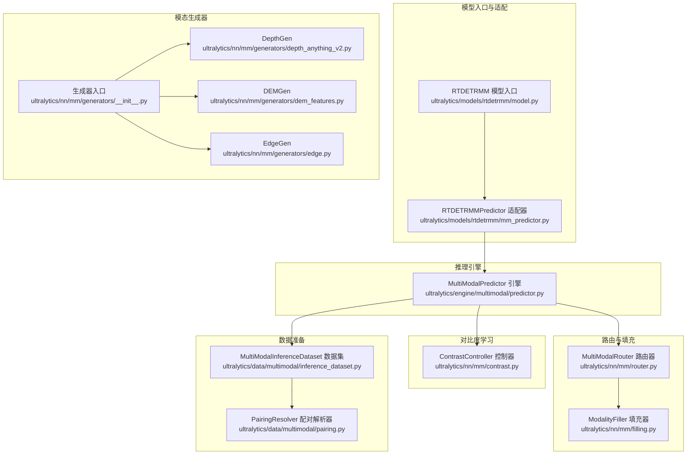

图表来源
- [ultralytics/models/rtdetrmm/model.py:25-57](file://ultralytics/models/rtdetrmm/model.py#L25-L57)
- [ultralytics/models/rtdetrmm/mm_predictor.py:18-66](file://ultralytics/models/rtdetrmm/mm_predictor.py#L18-L66)
- [ultralytics/engine/multimodal/predictor.py:16-88](file://ultralytics/engine/multimodal/predictor.py#L16-L88)
- [ultralytics/nn/mm/router.py:11-62](file://ultralytics/nn/mm/router.py#L11-L62)
- [ultralytics/nn/mm/filling.py:14-49](file://ultralytics/nn/mm/filling.py#L14-L49)
- [ultralytics/nn/mm/contrast.py:149-158](file://ultralytics/nn/mm/contrast.py#L149-L158)
- [ultralytics/data/multimodal/pairing.py:11-35](file://ultralytics/data/multimodal/pairing.py#L11-L35)
- [ultralytics/data/multimodal/inference_dataset.py:16-89](file://ultralytics/data/multimodal/inference_dataset.py#L16-L89)
- [ultralytics/nn/mm/generators/__init__.py:6-14](file://ultralytics/nn/mm/generators/__init__.py#L6-L14)

章节来源
- [ultralytics/models/rtdetrmm/model.py:25-57](file://ultralytics/models/rtdetrmm/model.py#L25-L57)
- [ultralytics/models/rtdetrmm/mm_predictor.py:18-66](file://ultralytics/models/rtdetrmm/mm_predictor.py#L18-L66)
- [ultralytics/engine/multimodal/predictor.py:16-88](file://ultralytics/engine/multimodal/predictor.py#L16-L88)
- [ultralytics/nn/mm/router.py:11-62](file://ultralytics/nn/mm/router.py#L11-L62)
- [ultralytics/nn/mm/filling.py:14-49](file://ultralytics/nn/mm/filling.py#L14-L49)
- [ultralytics/nn/mm/contrast.py:149-158](file://ultralytics/nn/mm/contrast.py#L149-L158)
- [ultralytics/data/multimodal/pairing.py:11-35](file://ultralytics/data/multimodal/pairing.py#L11-L35)
- [ultralytics/data/multimodal/inference_dataset.py:16-89](file://ultralytics/data/multimodal/inference_dataset.py#L16-L89)
- [ultralytics/nn/mm/generators/__init__.py:6-14](file://ultralytics/nn/mm/generators/__init__.py#L6-L14)

## 核心组件
- RTDETRMM 模型入口：负责 Fail-Fast 多模态结构识别、YAML 配置解析、模态信息注入与 mm_router 确保，提供可视化与验证入口。
- RTDETRMMPredictor 适配器：桥接 BasePredictor 接口与 MultiModalPredictor 引擎，延迟初始化推理引擎，保持 API 兼容。
- MultiModalPredictor 推理引擎：独立于 BasePredictor，构建数据集、执行 forward、后处理（YOLO/NMS 或 RTDETR）、组装结果、保存。
- MultiModalRouter 路由器：零拷贝张量视图路由，配置驱动的数据流，支持 RGB/X/Dual 三模态，运行时填充与空间重置。
- ModalityFiller 填充器：提供 copy/noise/channel_repeat/edge_blur/mixed 等策略，保证缺失模态合成的一致性与确定性。
- ContrastController 对比度控制器：通过 Hook 捕获特征，ROI 提取，投影头编码，InfoNCE 损失计算，支持 RGB/X 特征对齐。
- PairingResolver/MultiModalInferenceDataset：显式配对解析，严格校验与 LetterBox 预处理，支持单模态与双模态推理。
- 模态生成器：DepthGen、DEMGen、EdgeGen 提供离线 X 模态生成，统一 run 接口与保存选项。

章节来源
- [ultralytics/models/rtdetrmm/model.py:25-188](file://ultralytics/models/rtdetrmm/model.py#L25-L188)
- [ultralytics/models/rtdetrmm/mm_predictor.py:18-136](file://ultralytics/models/rtdetrmm/mm_predictor.py#L18-L136)
- [ultralytics/engine/multimodal/predictor.py:16-494](file://ultralytics/engine/multimodal/predictor.py#L16-L494)
- [ultralytics/nn/mm/router.py:11-471](file://ultralytics/nn/mm/router.py#L11-L471)
- [ultralytics/nn/mm/filling.py:14-175](file://ultralytics/nn/mm/filling.py#L14-L175)
- [ultralytics/nn/mm/contrast.py:149-290](file://ultralytics/nn/mm/contrast.py#L149-L290)
- [ultralytics/data/multimodal/pairing.py:11-203](file://ultralytics/data/multimodal/pairing.py#L11-L203)
- [ultralytics/data/multimodal/inference_dataset.py:16-252](file://ultralytics/data/multimodal/inference_dataset.py#L16-L252)
- [ultralytics/nn/mm/generators/__init__.py:6-14](file://ultralytics/nn/mm/generators/__init__.py#L6-L14)

## 架构总览
多模态系统遵循“入口适配 + 引擎独立 + 路由填充 + 数据准备 + 对比度学习 + 生成器”的分层设计。RTDETRMM 作为模型入口，通过 task_map 注入 RTDETRMMPredictor；后者持有 MultiModalPredictor 实例，后者负责数据集构建与推理流程；Router 在模型内部完成零拷贝路由与运行时填充；ContrastController 与对比度学习模块协同；PairingResolver 与 Dataset 保障输入严格契约；生成器模块提供离线 X 模态合成能力。

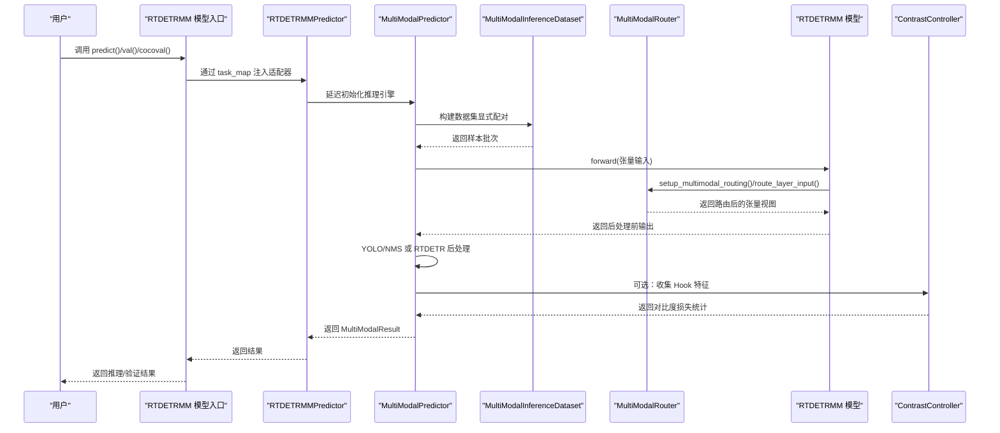

图表来源
- [ultralytics/models/rtdetrmm/model.py:48-57](file://ultralytics/models/rtdetrmm/model.py#L48-L57)
- [ultralytics/models/rtdetrmm/mm_predictor.py:56-66](file://ultralytics/models/rtdetrmm/mm_predictor.py#L56-L66)
- [ultralytics/engine/multimodal/predictor.py:99-143](file://ultralytics/engine/multimodal/predictor.py#L99-L143)
- [ultralytics/data/multimodal/inference_dataset.py:94-183](file://ultralytics/data/multimodal/inference_dataset.py#L94-L183)
- [ultralytics/nn/mm/router.py:157-240](file://ultralytics/nn/mm/router.py#L157-L240)
- [ultralytics/nn/mm/contrast.py:189-290](file://ultralytics/nn/mm/contrast.py#L189-L290)

## 详细组件分析

### RTDETRMM 模型入口
- 职责边界：Fail-Fast 多模态结构识别、YAML 解析、模态配置注入、mm_router 确保、任务映射注册、可视化与验证入口。
- 接口契约：通过 task_map 提供 predictor/validator/trainer/model；get_modality_info 返回模态信息；val/cocoval 提供默认 rect 策略。
- 错误处理：输入通道校验、配置失败回退、mm_router 构建失败警告。

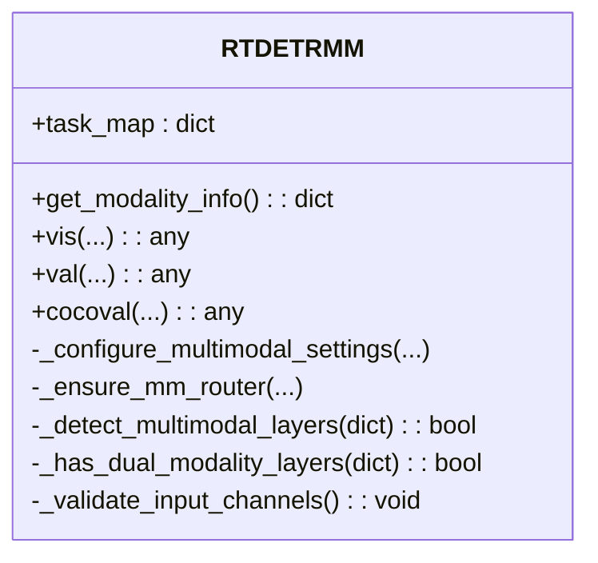

图表来源
- [ultralytics/models/rtdetrmm/model.py:25-188](file://ultralytics/models/rtdetrmm/model.py#L25-L188)

章节来源
- [ultralytics/models/rtdetrmm/model.py:25-188](file://ultralytics/models/rtdetrmm/model.py#L25-L188)

### RTDETRMMPredictor 推理适配器
- 职责边界：桥接 BasePredictor 接口与 MultiModalPredictor 引擎，延迟初始化，保持 API 兼容。
- 接口契约：setup_model/setup_model(model,...)、__call__(rgb_source, x_source, ...)、predict_cli(...)。
- 错误处理：未初始化抛出运行时错误，参数读取 fallback。

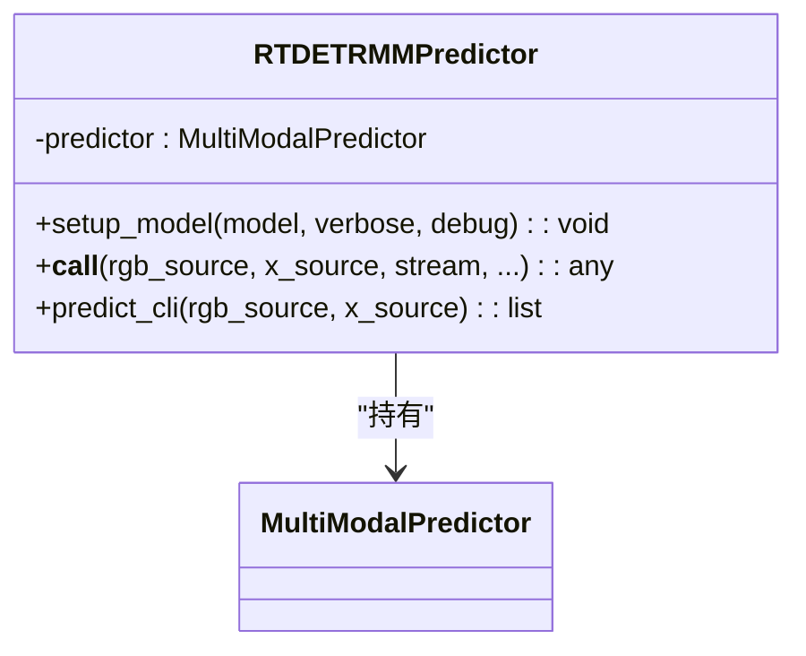

图表来源
- [ultralytics/models/rtdetrmm/mm_predictor.py:18-136](file://ultralytics/models/rtdetrmm/mm_predictor.py#L18-L136)

章节来源
- [ultralytics/models/rtdetrmm/mm_predictor.py:18-136](file://ultralytics/models/rtdetrmm/mm_predictor.py#L18-L136)

### MultiModalPredictor 推理引擎
- 职责边界：独立推理引擎，构建数据集、执行 forward、后处理（YOLO/NMS 或 RTDETR）、组装 MultiModalResult、保存。
- 接口契约：__call__(rgb_source, x_source, stream, save, save_txt, save_dir, ...)。
- 错误处理：模型类型检测失败、输出格式判断、NMS/scale_boxes 参数校验、调试日志开关。

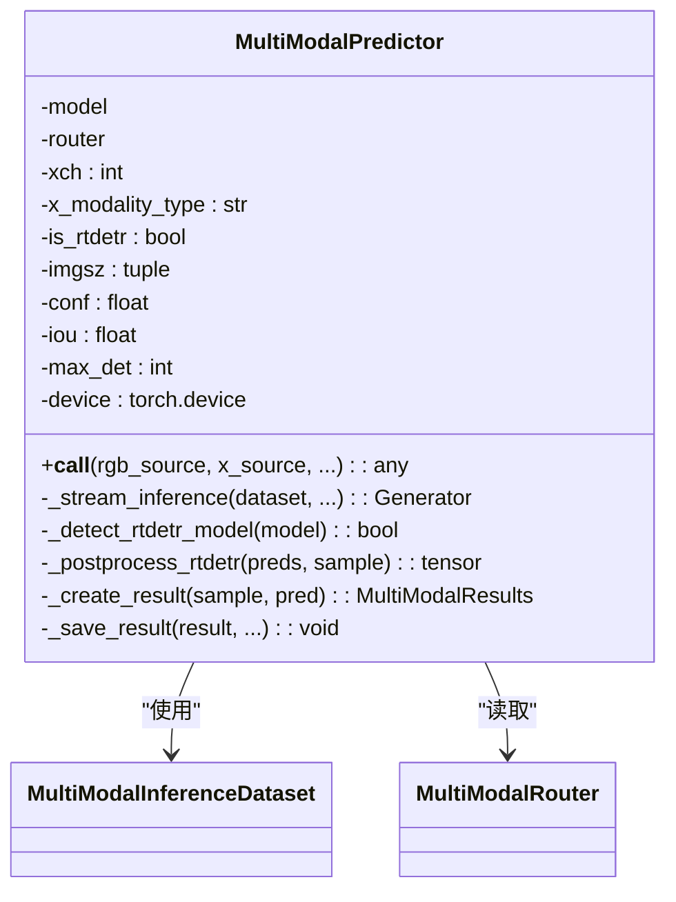

图表来源
- [ultralytics/engine/multimodal/predictor.py:16-494](file://ultralytics/engine/multimodal/predictor.py#L16-L494)

章节来源
- [ultralytics/engine/multimodal/predictor.py:16-494](file://ultralytics/engine/multimodal/predictor.py#L16-L494)

### MultiModalRouter 数据路由
- 职责边界：零拷贝张量视图路由，配置驱动，支持 RGB/X/Dual；运行时填充（generate_modality_filling/adapt_xch）；空间重置（reset_spatial_input）。
- 接口契约：parse_layer_config(layer_config, layer_index, ch, ...)、setup_multimodal_routing(x, ...)、route_layer_input(x, module, input_sources, ...)、reset_spatial_input(x, module, ...)。
- 错误处理：输入源不可用、通道数不匹配、空间尺寸缺失警告。

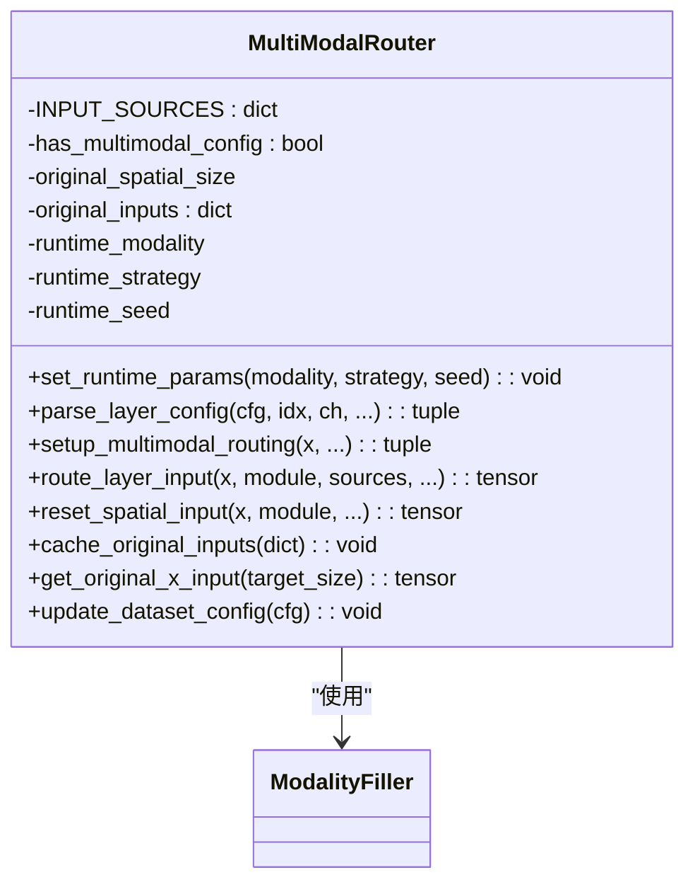

图表来源
- [ultralytics/nn/mm/router.py:11-471](file://ultralytics/nn/mm/router.py#L11-L471)
- [ultralytics/nn/mm/filling.py:14-175](file://ultralytics/nn/mm/filling.py#L14-L175)

章节来源
- [ultralytics/nn/mm/router.py:11-471](file://ultralytics/nn/mm/router.py#L11-L471)
- [ultralytics/nn/mm/filling.py:14-175](file://ultralytics/nn/mm/filling.py#L14-L175)

### ModalityFiller 模态填充器
- 职责边界：提供多种合成策略（copy/noise/channel_repeat/edge_blur/mixed），可选随机权重，支持通道适配（adapt_xch）。
- 接口契约：generate(source_tensor, source_modality, target_modality, strategy)、adapt_xch(tensor, xch)。
- 错误处理：默认策略 fallback、通道不匹配时线性投影。

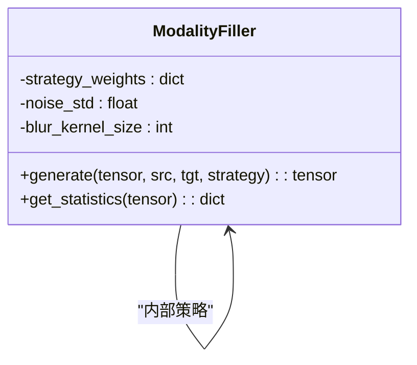

图表来源
- [ultralytics/nn/mm/filling.py:14-175](file://ultralytics/nn/mm/filling.py#L14-L175)

章节来源
- [ultralytics/nn/mm/filling.py:14-175](file://ultralytics/nn/mm/filling.py#L14-L175)

### 对比度控制器 ContrastController
- 职责边界：Hook 特征收集、ROI 提取、投影头编码、InfoNCE 损失计算，支持 RGB/X 特征对齐与统计。
- 接口契约：forward(hook_buffers, batch) -> (loss, stats)。
- 错误处理：非有限特征警告、形状不匹配、批大小不一致、设备/张量类型校验。

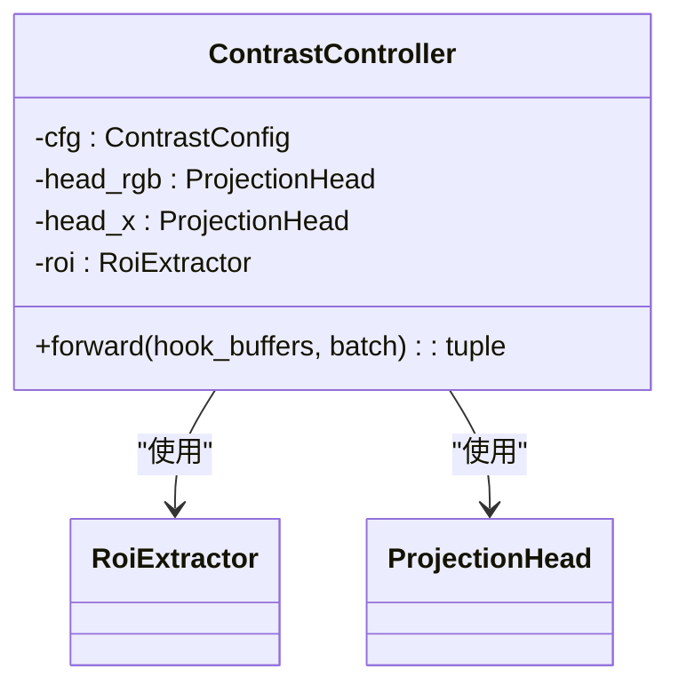

图表来源
- [ultralytics/nn/mm/contrast.py:149-290](file://ultralytics/nn/mm/contrast.py#L149-L290)

章节来源
- [ultralytics/nn/mm/contrast.py:149-290](file://ultralytics/nn/mm/contrast.py#L149-L290)

### 数据准备：PairingResolver 与 MultiModalInferenceDataset
- PairingResolver：显式配对解析，支持单模态与双模态，严格文件存在性校验，生成样本规格。
- MultiModalInferenceDataset：LetterBox 预处理、RGB/X 加载与通道校验、拼接 [RGB,X]、构造样本字典。

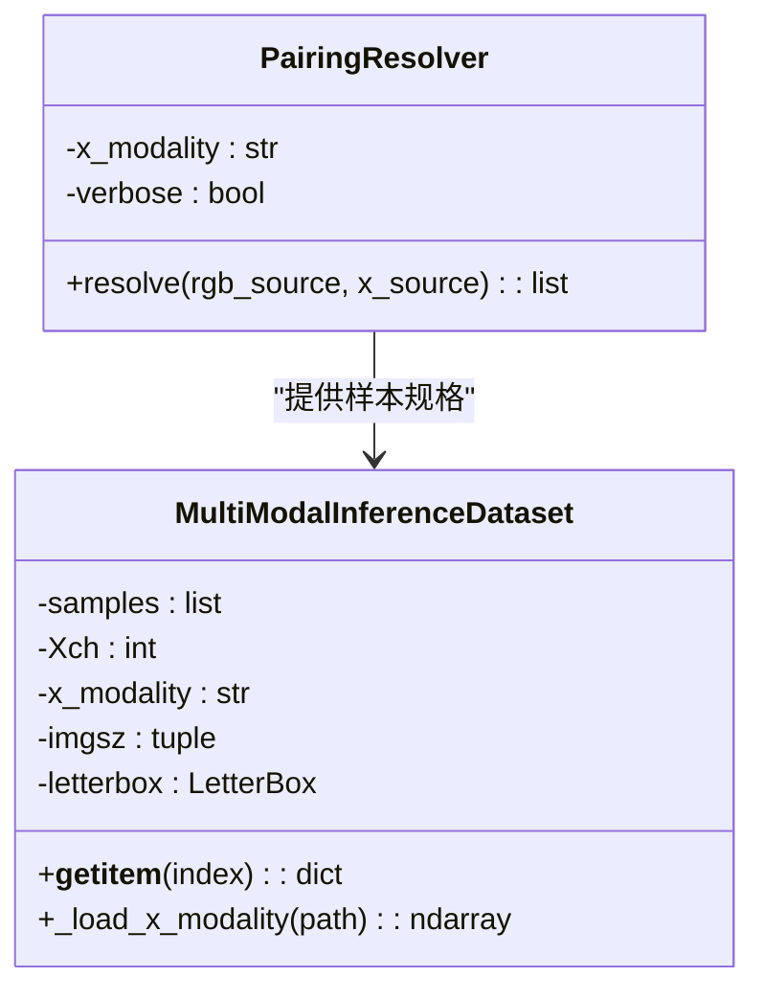

图表来源
- [ultralytics/data/multimodal/pairing.py:11-203](file://ultralytics/data/multimodal/pairing.py#L11-L203)
- [ultralytics/data/multimodal/inference_dataset.py:16-252](file://ultralytics/data/multimodal/inference_dataset.py#L16-L252)

章节来源
- [ultralytics/data/multimodal/pairing.py:11-203](file://ultralytics/data/multimodal/pairing.py#L11-L203)
- [ultralytics/data/multimodal/inference_dataset.py:16-252](file://ultralytics/data/multimodal/inference_dataset.py#L16-L252)

### 模态生成器：DepthGen、DEMGen、EdgeGen
- DepthGen：Depth Anything V2 后端，支持多种 encoder，run(source, save_dir) 接口，保存彩色/16位/数组等格式。
- DEMGen：离线 DEM 特征（6 通道），统一 run 接口与保存策略。
- EdgeGen：从 RGB 离线生成 Edge 模态，支持 1/3 通道输出与多种后处理选项。

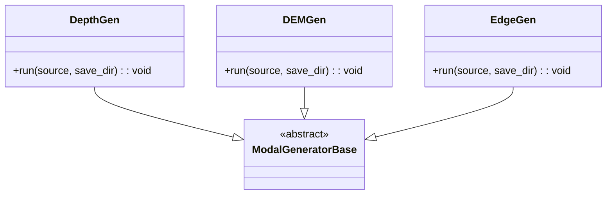

图表来源
- [ultralytics/nn/mm/generators/depth_anything_v2.py:72-165](file://ultralytics/nn/mm/generators/depth_anything_v2.py#L72-L165)
- [ultralytics/nn/mm/generators/dem_features.py:111-200](file://ultralytics/nn/mm/generators/dem_features.py#L111-L200)
- [ultralytics/nn/mm/generators/edge.py:190-200](file://ultralytics/nn/mm/generators/edge.py#L190-L200)

章节来源
- [ultralytics/nn/mm/generators/depth_anything_v2.py:72-165](file://ultralytics/nn/mm/generators/depth_anything_v2.py#L72-L165)
- [ultralytics/nn/mm/generators/dem_features.py:111-200](file://ultralytics/nn/mm/generators/dem_features.py#L111-L200)
- [ultralytics/nn/mm/generators/edge.py:190-200](file://ultralytics/nn/mm/generators/edge.py#L190-L200)

## 依赖关系分析
- 模型入口依赖推理适配器与 mm_router；适配器依赖推理引擎；推理引擎依赖数据集与 Router；Router 依赖填充器；对比度控制器依赖 Hook 与投影头；数据集依赖配对解析器；生成器模块相互独立并通过入口统一导出。
- 耦合与内聚：各模块职责清晰，耦合主要体现在 Router 与填充器、推理引擎与数据集、对比度控制器与 Hook；内聚性良好，遵循单一职责原则。

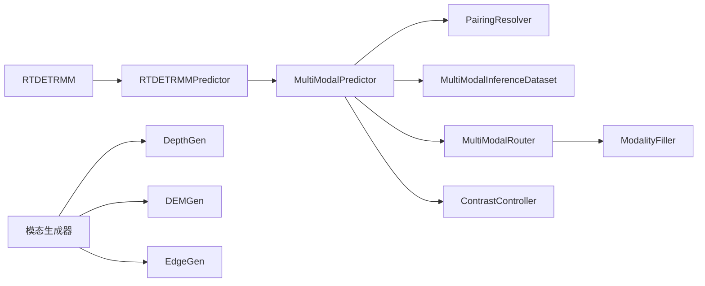

图表来源
- [ultralytics/models/rtdetrmm/model.py:48-57](file://ultralytics/models/rtdetrmm/model.py#L48-L57)
- [ultralytics/models/rtdetrmm/mm_predictor.py:56-66](file://ultralytics/models/rtdetrmm/mm_predictor.py#L56-L66)
- [ultralytics/engine/multimodal/predictor.py:60-68](file://ultralytics/engine/multimodal/predictor.py#L60-L68)
- [ultralytics/nn/mm/router.py:166-180](file://ultralytics/nn/mm/router.py#L166-L180)
- [ultralytics/nn/mm/contrast.py:149-158](file://ultralytics/nn/mm/contrast.py#L149-L158)
- [ultralytics/nn/mm/generators/__init__.py:6-14](file://ultralytics/nn/mm/generators/__init__.py#L6-L14)

章节来源
- [ultralytics/models/rtdetrmm/model.py:48-57](file://ultralytics/models/rtdetrmm/model.py#L48-L57)
- [ultralytics/models/rtdetrmm/mm_predictor.py:56-66](file://ultralytics/models/rtdetrmm/mm_predictor.py#L56-L66)
- [ultralytics/engine/multimodal/predictor.py:60-68](file://ultralytics/engine/multimodal/predictor.py#L60-L68)
- [ultralytics/nn/mm/router.py:166-180](file://ultralytics/nn/mm/router.py#L166-L180)
- [ultralytics/nn/mm/contrast.py:149-158](file://ultralytics/nn/mm/contrast.py#L149-L158)
- [ultralytics/nn/mm/generators/__init__.py:6-14](file://ultralytics/nn/mm/generators/__init__.py#L6-L14)

## 性能考量
- 零拷贝路由：MultiModalRouter 使用张量视图进行路由，避免不必要的数据复制，提升推理效率。
- 运行时填充策略：ModalityFiller 提供轻量策略，避免在热路径引入重型依赖；通道适配采用线性投影，兼顾精度与速度。
- LetterBox 预处理：推理模式禁用放大、居中对齐，减少缩放开销；X 模态通道校验与空间对齐在必要时进行。
- RTDETR 后处理：针对查询数与输出维度的快速检测，减少不必要的张量操作。
- 对比度学习：投影头与损失计算在 FP32 下进行，保证数值稳定；ROI 提取与特征拼接尽量向量化。

## 故障排查指南
- 模型未初始化：RTDETRMMPredictor 在调用推理前需先 setup_model，否则抛出运行时错误。
- 输入通道不支持：RTDETRMM 校验输入通道（3/6），不支持时抛出异常；Router 在运行时也进行通道数校验。
- 文件不存在/非文件：PairingResolver 与 Dataset 在构建阶段严格校验文件存在性与类型，抛出 FileNotFoundError/ValueError。
- 非有限特征：ContrastController 在捕获 Hook 特征后进行非有限性检查，记录警告并跳过无效对。
- X 模态通道不匹配：Dataset 在加载 X 模态时进行通道数校验，不匹配时报错；Router.update_dataset_config 动态更新 Xch。
- mm_router 构建失败：RTDETRMM._ensure_mm_router 在模型内部尝试补建，失败时记录警告。

章节来源
- [ultralytics/models/rtdetrmm/mm_predictor.py:91-92](file://ultralytics/models/rtdetrmm/mm_predictor.py#L91-L92)
- [ultralytics/models/rtdetrmm/model.py:140-146](file://ultralytics/models/rtdetrmm/model.py#L140-L146)
- [ultralytics/data/multimodal/pairing.py:175-187](file://ultralytics/data/multimodal/pairing.py#L175-L187)
- [ultralytics/data/multimodal/inference_dataset.py:139-148](file://ultralytics/data/multimodal/inference_dataset.py#L139-L148)
- [ultralytics/nn/mm/contrast.py:195-208](file://ultralytics/nn/mm/contrast.py#L195-L208)
- [ultralytics/nn/mm/router.py:175-180](file://ultralytics/nn/mm/router.py#L175-L180)
- [ultralytics/models/rtdetrmm/model.py:175-179](file://ultralytics/models/rtdetrmm/model.py#L175-L179)

## 结论
多模态系统通过明确的模块边界与清晰的接口契约，实现了 RTDETRMM 的独立家族化、推理引擎的解耦与零拷贝路由、运行时填充与空间重置、严格的输入契约与错误处理、以及对比度学习与离线模态生成的完整链路。该设计既满足了工程上的可维护性与可扩展性，又在性能上通过零拷贝与向量化操作提供了高效支撑。

## 附录
- 模块系统状态检查：mm_system_status 提供系统功能概览与特性清单。
- 配置格式校验：validate_mm_config_format 统计 RGB/X/Dual 路由层数量。
- 属性检查：check_mm_model_attributes 检查模型中多模态层属性。

章节来源
- [ultralytics/nn/mm/utils.py:37-92](file://ultralytics/nn/mm/utils.py#L37-L92)