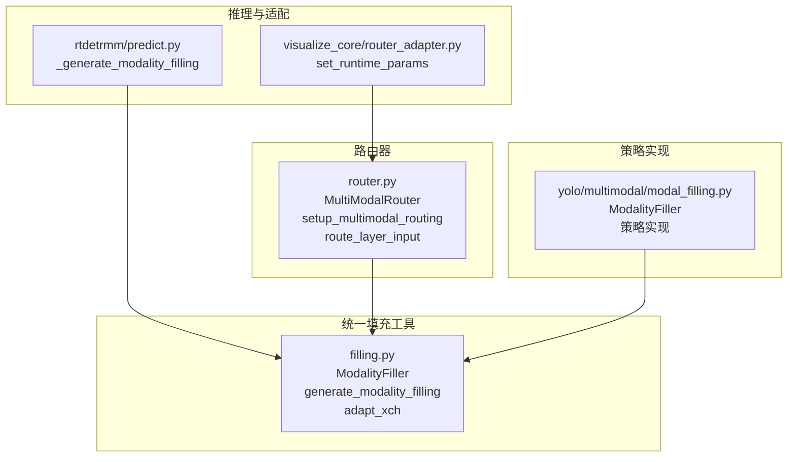
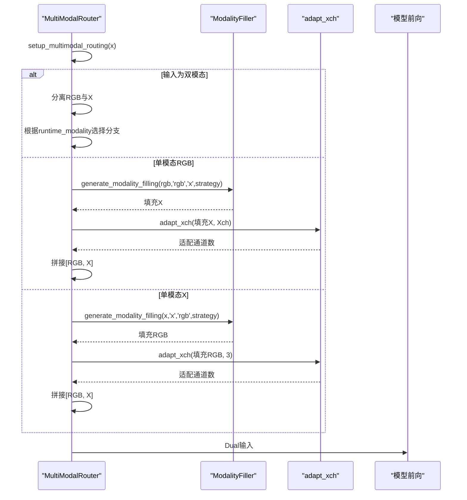
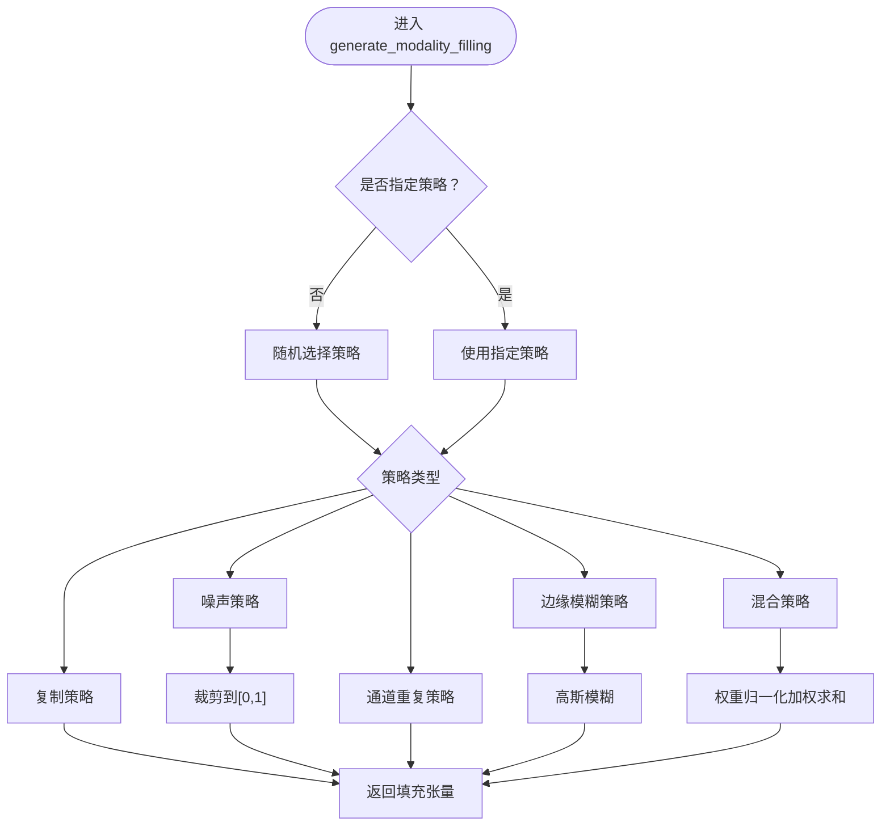
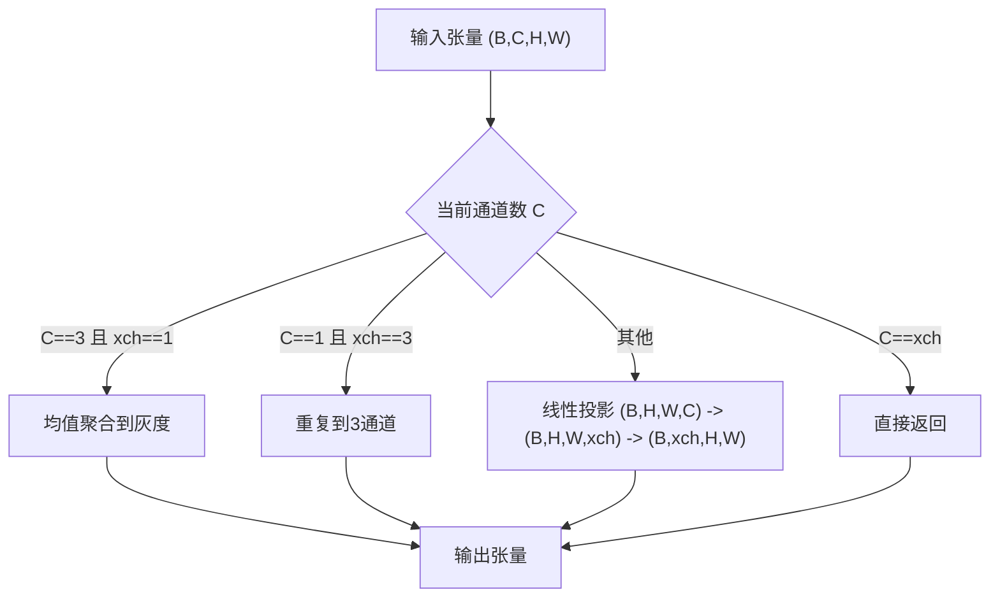
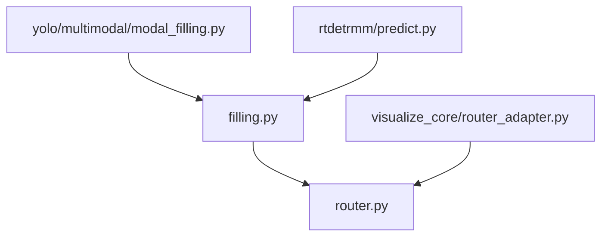

# 模态填充系统

<cite>
**本文档引用的文件**
- [ultralytics\nn\mm\filling.py](file://ultralytics\nn\mm\filling.py)
- [ultralytics\models\yolo\multimodal\modal_filling.py](file://ultralytics\models\yolo\multimodal\modal_filling.py)
- [ultralytics\nn\mm\router.py](file://ultralytics\nn\mm\router.py)
- [ultralytics\models\rtdetrmm\predict.py](file://ultralytics\models\rtdetrmm\predict.py)
- [ultralytics\models\utils\multimodal\visualize_core\router_adapter.py](file://ultralytics\models\utils\multimodal\visualize_core\router_adapter.py)
- [ultralytics\nn\mm\filling.py](file://ultralytics\nn\mm\filling.py)
- [ultralytics\nn\mm\router.py](file://ultralytics\nn\mm\router.py)
- [ultralytics\models\yolo\multimodal\modal_filling.py](file://ultralytics\models\yolo\multimodal\modal_filling.py)
- [ultralytics\models\rtdetrmm\predict.py](file://ultralytics\models\rtdetrmm\predict.py)
- [ultralytics\models\utils\multimodal\visualize_core\router_adapter.py](file://ultralytics\models\utils\multimodal\visualize_core\router_adapter.py)
</cite>

## 目录
1. [简介](#简介)
2. [项目结构](#项目结构)
3. [核心组件](#核心组件)
4. [架构概览](#架构概览)
5. [详细组件分析](#详细组件分析)
6. [依赖分析](#依赖分析)
7. [性能考虑](#性能考虑)
8. [故障排除指南](#故障排除指南)
9. [结论](#结论)
10. [附录](#附录)

## 简介
本文件系统性地文档化了模态填充系统，重点覆盖以下方面：
- generate_modality_filling 函数的实现原理与策略选择机制
- adapt_xch 函数的通道适配机制（通道数量转换与数据格式标准化）
- 零填充策略的实现细节（全零张量创建与内存优化思路）
- 插值填充方法的数学原理与实现算法
- 运行时参数设置 set_runtime_params 的功能与使用场景
- 不同填充策略的性能对比与适用场景分析
- 实际代码示例：在训练与推理过程中的使用方式

该系统通过统一的填充工具模块与路由器协同工作，确保在单模态输入场景下，能够在前向路径中智能生成缺失模态，从而保持双模态模型的一致行为。

## 项目结构
模态填充系统主要分布在以下模块：
- 统一填充工具：提供策略化的模态合成与通道适配能力
- 路由器：负责在前向过程中根据运行时参数决定是否进行模态填充与通道适配
- 预测器与适配器：在推理阶段调用统一填充工具并规范化运行时参数

**图表来源**
- [ultralytics\nn\mm\filling.py:14-175](file://ultralytics\nn\mm\filling.py#L14-L175)
- [ultralytics\nn\mm\router.py:11-471](file://ultralytics\nn\mm\router.py#L11-L471)
- [ultralytics\models\rtdetrmm\predict.py:586-607](file://ultralytics\models\rtdetrmm\predict.py#L586-L607)
- [ultralytics\models\utils\multimodal\visualize_core\router_adapter.py:45-79](file://ultralytics\models\utils\multimodal\visualize_core\router_adapter.py#L45-L79)
- [ultralytics\models\yolo\multimodal\modal_filling.py:12-295](file://ultralytics\models\yolo\multimodal\modal_filling.py#L12-L295)

**章节来源**
- [ultralytics\nn\mm\filling.py:1-175](file://ultralytics\nn\mm\filling.py#L1-L175)
- [ultralytics\nn\mm\router.py:1-471](file://ultralytics\nn\mm\router.py#L1-L471)
- [ultralytics\models\rtdetrmm\predict.py:586-607](file://ultralytics\models\rtdetrmm\predict.py#L586-L607)
- [ultralytics\models\utils\multimodal\visualize_core\router_adapter.py:45-79](file://ultralytics\models\utils\multimodal\visualize_core\router_adapter.py#L45-L79)
- [ultralytics\models\yolo\multimodal\modal_filling.py:1-295](file://ultralytics\models\yolo\multimodal\modal_filling.py#L1-L295)

## 核心组件
- ModalityFiller：提供多种填充策略（复制、噪声、通道重复、边缘模糊、混合），并支持统计输出与权重配置
- generate_modality_filling：便捷函数，封装 ModalityFiller 的调用，返回与源张量同形状的填充张量
- adapt_xch：通道适配函数，支持 3→1、1→3 以及通用 C→xch 的线性投影
- MultiModalRouter：在前向路径中根据运行时参数选择是否进行模态填充与通道适配，并保证通道顺序一致性
- set_runtime_params：运行时参数设置接口，支持模态消融与策略选择

**章节来源**
- [ultralytics\nn\mm\filling.py:14-175](file://ultralytics\nn\mm\filling.py#L14-L175)
- [ultralytics\nn\mm\router.py:64-240](file://ultralytics\nn\mm\router.py#L64-L240)
- [ultralytics\models\utils\multimodal\visualize_core\router_adapter.py:49-70](file://ultralytics\models\utils\multimodal\visualize_core\router_adapter.py#L49-L70)

## 架构概览
统一填充工具与路由器协同工作，形成如下流程：
- 在路由器 setup_multimodal_routing 中，根据输入通道数判断是否为双模态或单模态
- 若为单模态，依据运行时参数选择填充策略（copy/noise/channel_repeat/edge_blur/mixed）
- 通过 adapt_xch 将生成的模态调整为目标通道数
- 最终以标准顺序 [RGB, X] 拼接为 Dual 输入

**图表来源**
- [ultralytics\nn\mm\router.py:157-240](file://ultralytics\nn\mm\router.py#L157-L240)
- [ultralytics\nn\mm\filling.py:35-49](file://ultralytics\nn\mm\filling.py#L35-L49)
- [ultralytics\nn\mm\filling.py:151-174](file://ultralytics\nn\mm\filling.py#L151-L174)

**章节来源**
- [ultralytics\nn\mm\router.py:157-240](file://ultralytics\nn\mm\router.py#L157-L240)
- [ultralytics\nn\mm\filling.py:35-49](file://ultralytics\nn\mm\filling.py#L35-L49)
- [ultralytics\nn\mm\filling.py:151-174](file://ultralytics\nn\mm\filling.py#L151-L174)

## 详细组件分析

### generate_modality_filling 函数与策略实现
- 功能：根据源模态与目标模态，选择策略生成与源张量同形状的填充张量
- 策略选择：
  - 随机策略：基于权重配置随机选择策略
  - 策略实现：
    - 复制：直接 clone 源张量
    - 噪声：添加高斯噪声并裁剪至有效范围
    - 通道重复：将3通道转为灰度后重复3通道；或将1通道重复到3通道
    - 边缘模糊：Sobel边缘检测后对每个通道应用高斯模糊
    - 混合：随机选择2-3种策略，使用权重归一化后加权求和
- 统计输出：提供均值、标准差、最大值、最小值与形状等统计信息

**图表来源**
- [ultralytics\nn\mm\filling.py:35-49](file://ultralytics\nn\mm\filling.py#L35-L49)
- [ultralytics\nn\mm\filling.py:69-118](file://ultralytics\nn\mm\filling.py#L69-L118)
- [ultralytics\nn\mm\filling.py:121-135](file://ultralytics\nn\mm\filling.py#L121-L135)

**章节来源**
- [ultralytics\nn\mm\filling.py:35-118](file://ultralytics\nn\mm\filling.py#L35-L118)
- [ultralytics\nn\mm\filling.py:121-135](file://ultralytics\nn\mm\filling.py#L121-L135)

### adapt_xch 通道适配机制
- 功能：将输入张量的通道数适配为目标通道数
- 适配规则：
  - 3→1：对3通道进行均值聚合得到灰度图
  - 1→3：将单通道重复3次
  - 通用映射：通过固定权重矩阵进行线性投影，避免复杂的插值计算
- 数据格式标准化：确保输出张量通道数与目标模态一致，便于后续拼接与模型处理

**图表来源**
- [ultralytics\nn\mm\filling.py:151-174](file://ultralytics\nn\mm\filling.py#L151-L174)

**章节来源**
- [ultralytics\nn\mm\filling.py:151-174](file://ultralytics\nn\mm\filling.py#L151-L174)

### 零填充策略实现细节
- 数学原理：零填充即用全零张量替代缺失模态，保持输入张量形状不变
- 实现要点：
  - 直接创建与源张量同形状的全零张量
  - 通过张量运算实现，避免额外的插值开销
- 内存优化：
  - 使用张量的零填充构造，减少中间变量分配
  - 与 adapt_xch 结合时，先生成零张量再进行通道适配
- 适用场景：当目标模态对模型影响较小或需要严格控制填充强度时

**章节来源**
- [ultralytics\nn\mm\filling.py:151-174](file://ultralytics\nn\mm\filling.py#L151-L174)

### 插值填充方法的数学原理与实现算法
- 数学原理：插值填充通过在通道维度进行线性插值，将 C 通道映射到 xch 通道
- 实现算法：
  - 固定权重矩阵：沿对角线放置1，其余为0，实现“选择性复制”
  - 线性投影：将 (B,C,H,W) 展平为 (B*H*W, C)，乘以权重矩阵 W_{xch×C}，再重塑为 (B,xch,H,W)
- 优点：计算简单、无额外依赖、可避免复杂插值核
- 注意事项：当 C > xch 时，多余通道会被截断；当 C < xch 时，多余通道为零

**章节来源**
- [ultralytics\nn\mm\filling.py:163-174](file://ultralytics\nn\mm\filling.py#L163-L174)

### 运行时参数设置 set_runtime_params
- 功能：设置运行时的模态消融与填充策略
- 参数规范：
  - modality：None/auto/dual 表示不消融；'rgb'/'x' 表示消融对应模态
  - strategy：填充策略名称（可选）
  - seed：随机种子（可选）
- 使用场景：
  - 训练阶段：通过消融实验评估各模态贡献
  - 推理阶段：在单模态输入时自动填充缺失模态
  - 调试阶段：快速切换策略与种子以观察效果

**章节来源**
- [ultralytics\models\utils\multimodal\visualize_core\router_adapter.py:49-70](file://ultralytics\models\utils\multimodal\visualize_core\router_adapter.py#L49-L70)
- [ultralytics\nn\mm\router.py:64-68](file://ultralytics\nn\mm\router.py#L64-L68)

## 依赖分析
- 统一填充工具依赖关系：ModalityFiller 与 generate_modality_filling 位于同一模块，提供策略实现与便捷调用
- 路由器依赖关系：MultiModalRouter 依赖统一填充工具与通道适配函数，在 setup_multimodal_routing 中协调填充与拼接
- 预测器与适配器：推理阶段通过 _generate_modality_filling 调用统一填充工具；router_adapter 负责规范化运行时参数

**图表来源**
- [ultralytics\nn\mm\filling.py:1-175](file://ultralytics\nn\mm\filling.py#L1-L175)
- [ultralytics\nn\mm\router.py:1-471](file://ultralytics\nn\mm\router.py#L1-L471)
- [ultralytics\models\rtdetrmm\predict.py:586-607](file://ultralytics\models\rtdetrmm\predict.py#L586-L607)
- [ultralytics\models\utils\multimodal\visualize_core\router_adapter.py:45-79](file://ultralytics\models\utils\multimodal\visualize_core\router_adapter.py#L45-L79)
- [ultralytics\models\yolo\multimodal\modal_filling.py:1-295](file://ultralytics\models\yolo\multimodal\modal_filling.py#L1-L295)

**章节来源**
- [ultralytics\nn\mm\filling.py:1-175](file://ultralytics\nn\mm\filling.py#L1-L175)
- [ultralytics\nn\mm\router.py:1-471](file://ultralytics\nn\mm\router.py#L1-L471)
- [ultralytics\models\rtdetrmm\predict.py:586-607](file://ultralytics\models\rtdetrmm\predict.py#L586-L607)
- [ultralytics\models\utils\multimodal\visualize_core\router_adapter.py:45-79](file://ultralytics\models\utils\multimodal\visualize_core\router_adapter.py#L45-L79)
- [ultralytics\models\yolo\multimodal\modal_filling.py:1-295](file://ultralytics\models\yolo\multimodal\modal_filling.py#L1-L295)

## 性能考虑
- 策略选择：
  - 复制与通道重复：O(BHW) 时间，内存占用低
  - 噪声：O(BHW) 时间，增加少量随机数生成开销
  - 边缘模糊：O(BHWC) 时间，卷积核大小影响性能
  - 混合：随机选择2-3种策略并加权，整体仍为 O(BHW)
- 通道适配：
  - 3→1：均值聚合，O(BHWC)
  - 1→3：重复，O(BHWC)
  - 通用投影：线性矩阵乘法，O(BHWC·min(C,xch))
- 内存优化：
  - 使用 in-place 裁剪与张量复用，减少临时对象分配
  - 通道适配采用固定权重矩阵，避免动态插值核创建
- 并发与设备：
  - 所有操作在张量层面进行，可充分利用 GPU 并行

[本节为通用性能讨论，无需具体文件来源]

## 故障排除指南
- 策略权重总和不为1：
  - 现象：警告提示权重总和异常
  - 处理：检查自定义权重配置，确保总和为1
- 通道数不匹配：
  - 现象：X模态新输入起点通道数校验失败
  - 处理：确认输入张量通道数与配置一致，或先通过 adapt_xch 适配
- 模态消融参数错误：
  - 现象：set_runtime_params 抛出不支持的模态值
  - 处理：使用 'rgb'/'x'/None/'auto'/'dual' 等受支持的值

**章节来源**
- [ultralytics\nn\mm\filling.py:30-32](file://ultralytics\nn\mm\filling.py#L30-L32)
- [ultralytics\nn\mm\router.py:278-287](file://ultralytics\nn\mm\router.py#L278-L287)
- [ultralytics\models\utils\multimodal\visualize_core\router_adapter.py:65-66](file://ultralytics\models\utils\multimodal\visualize_core\router_adapter.py#L65-L66)

## 结论
模态填充系统通过统一的填充工具与路由器协作，实现了在单模态输入场景下的智能填充与通道适配。其策略设计兼顾性能与稳定性，既支持快速复制与通道重复，也支持噪声与边缘模糊等更复杂的合成策略。运行时参数设置使得在训练与推理阶段均可灵活控制模态消融与填充策略，满足多样化的实验与部署需求。

[本节为总结性内容，无需具体文件来源]

## 附录

### 实际使用示例（训练与推理）
- 训练阶段：
  - 使用 YOLOMM 训练器，可通过 modality 参数进行模态消融实验
  - 示例路径：[trainMM.py:1-15](file://trainMM.py#L1-L15)
- 推理阶段：
  - 双模态预测：显式提供 rgb_source 与 x_source
  - 单模态预测：提供 rgb 或 x，系统自动填充另一模态
  - 示例路径：[predictMM.py:1-40](file://predictMM.py#L1-L40)

**章节来源**
- [trainMM.py:1-15](file://trainMM.py#L1-L15)
- [predictMM.py:1-40](file://predictMM.py#L1-L40)