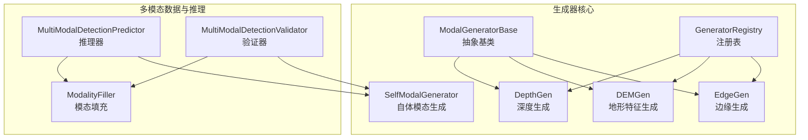
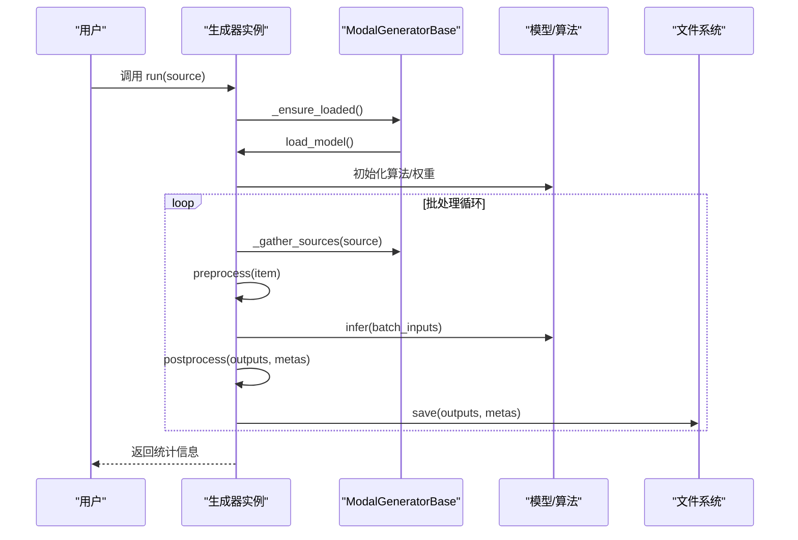
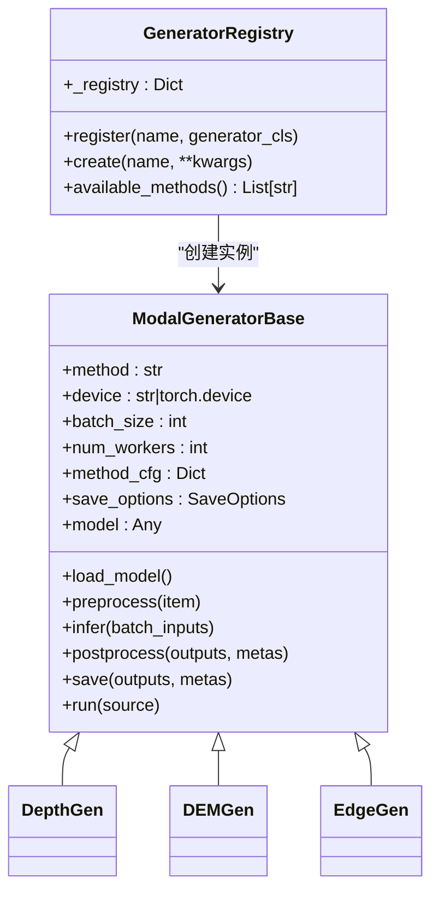
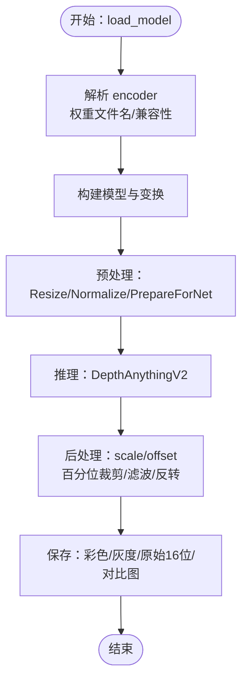
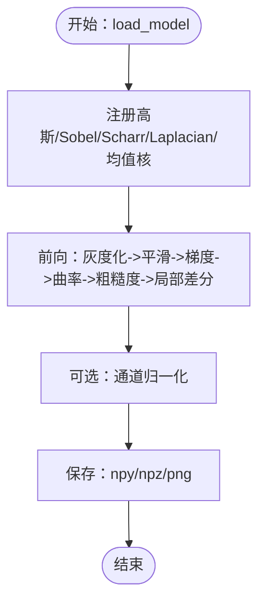
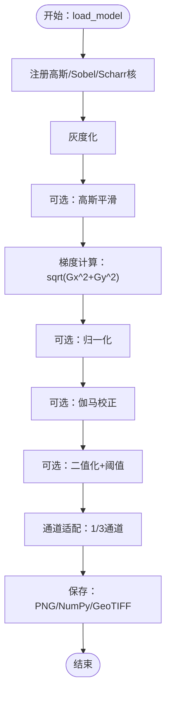
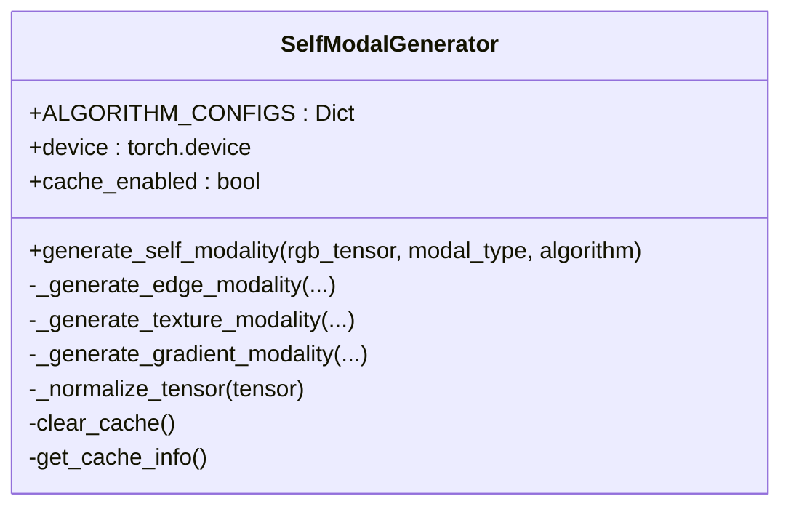
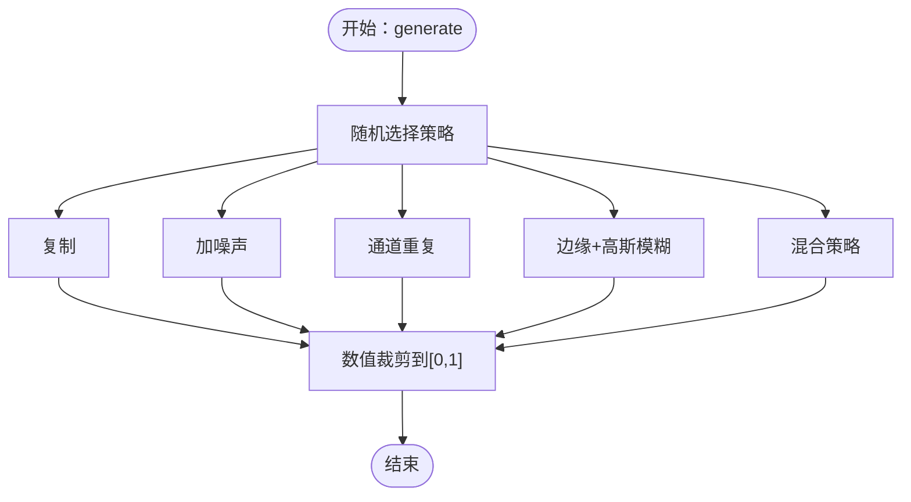
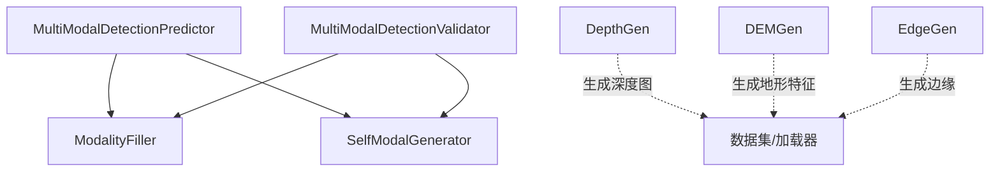

# 模态生成器组件

<cite>
**本文档引用的文件**
- [ultralytics/models/yolo/multimodal/__init__.py](file://ultralytics/models/yolo/multimodal/__init__.py)
- [ultralytics/models/yolo/multimodal/predict.py](file://ultralytics/models/yolo/multimodal/predict.py)
- [ultralytics/models/yolo/multimodal/val.py](file://ultralytics/models/yolo/multimodal/val.py)
- [ultralytics/engine/multimodal/__init__.py](file://ultralytics/engine/multimodal/__init__.py)
- [ultralytics/data/multimodal/__init__.py](file://ultralytics/data/multimodal/__init__.py)
- [ultralytics/nn/mm/filling.py](file://ultralytics/nn/mm/filling.py)
- [ultralytics/nn/mm/generators/__init__.py](file://ultralytics/nn/mm/generators/__init__.py)
- [ultralytics/nn/mm/generators/base.py](file://ultralytics/nn/mm/generators/base.py)
- [ultralytics/nn/mm/generators/depth_anything_v2.py](file://ultralytics/nn/mm/generators/depth_anything_v2.py)
- [ultralytics/nn/mm/generators/dem_features.py](file://ultralytics/nn/mm/generators/dem_features.py)
- [ultralytics/nn/mm/generators/edge.py](file://ultralytics/nn/mm/generators/edge.py)
- [ultralytics/models/yolo/multimodal/self_modal_generator.py](file://ultralytics/models/yolo/multimodal/self_modal_generator.py)
- [depthGen.py](file://depthGen.py)
</cite>

## 目录
1. [简介](#简介)
2. [项目结构](#项目结构)
3. [核心组件](#核心组件)
4. [架构总览](#架构总览)
5. [详细组件分析](#详细组件分析)
6. [依赖关系分析](#依赖关系分析)
7. [性能考虑](#性能考虑)
8. [故障排除指南](#故障排除指南)
9. [结论](#结论)
10. [附录](#附录)

## 简介
本文件系统性阐述多模态生成器组件的架构与实现，重点覆盖以下方面：
- 基础架构与继承体系：以 ModalGeneratorBase 为抽象基类，定义统一的离线生成流程与注册表机制。
- 深度生成器 DepthGen：基于 Depth Anything V2 的深度估计实现，包含权重推断、预处理、推理、后处理与保存策略。
- 地形特征生成器 DEMGen：提取高程、坡度、坡向、曲率、粗糙度与局部高度差等六通道地形特征。
- 边缘生成器 EdgeGen：基于 Sobel/Scharr 算子的边缘强度提取，支持单通道与三通道输出。
- 自体模态生成器 SelfModalGenerator：从 RGB 图像生成边缘、纹理、梯度等辅助模态，服务于自体多模态检测。
- 插件化架构：通过注册表支持自定义生成算法扩展。
- 配置与参数调优：提供生成器配置、参数调优与质量控制方法。

## 项目结构
多模态生成器位于 `ultralytics/nn/mm/generators/` 目录，采用“离线生成 + 统一接口”的设计，与训练/推理管线解耦。核心文件组织如下：
- generators/__init__.py：对外暴露 DepthGen、DEMGen、EdgeGen。
- generators/base.py：定义 ModalGeneratorBase 抽象基类、注册表与运行统计。
- generators/depth_anything_v2.py：DepthGen 实现，集成 Depth Anything V2。
- generators/dem_features.py：DEMGen 实现，提取地形特征。
- generators/edge.py：EdgeGen 实现，提取边缘特征。
- models/yolo/multimodal/self_modal_generator.py：自体模态生成器，支持边缘/纹理/梯度生成。
- data/multimodal/__init__.py 与 engine/multimodal/__init__.py：多模态数据与推理引擎组件入口。
- depthGen.py：DepthGen 的使用示例脚本。

图表来源
- [ultralytics/nn/mm/generators/base.py:77-225](file://ultralytics/nn/mm/generators/base.py#L77-L225)
- [ultralytics/nn/mm/generators/depth_anything_v2.py:72-520](file://ultralytics/nn/mm/generators/depth_anything_v2.py#L72-L520)
- [ultralytics/nn/mm/generators/dem_features.py:212-470](file://ultralytics/nn/mm/generators/dem_features.py#L212-L470)
- [ultralytics/nn/mm/generators/edge.py:190-506](file://ultralytics/nn/mm/generators/edge.py#L190-L506)
- [ultralytics/models/yolo/multimodal/self_modal_generator.py:10-505](file://ultralytics/models/yolo/multimodal/self_modal_generator.py#L10-L505)
- [ultralytics/nn/mm/filling.py:14-175](file://ultralytics/nn/mm/filling.py#L14-L175)
- [ultralytics/models/yolo/multimodal/predict.py:15-800](file://ultralytics/models/yolo/multimodal/predict.py#L15-L800)
- [ultralytics/models/yolo/multimodal/val.py:20-852](file://ultralytics/models/yolo/multimodal/val.py#L20-L852)

章节来源
- [ultralytics/nn/mm/generators/__init__.py:1-15](file://ultralytics/nn/mm/generators/__init__.py#L1-L15)
- [ultralytics/nn/mm/generators/base.py:1-225](file://ultralytics/nn/mm/generators/base.py#L1-L225)

## 核心组件
本节概述各生成器组件的功能职责与关键特性。

- ModalGeneratorBase（抽象基类）
  - 规范化离线生成流程：load_model → preprocess → infer → postprocess → save。
  - 提供注册表 GeneratorRegistry，支持按名称创建生成器实例。
  - 统一运行统计 GeneratorRunStats 与保存选项 SaveOptions。
  - 支持从目录/文件列表或 data.yaml 收集样本，具备批处理与错误记录能力。

- DepthGen（深度生成器）
  - 基于 Depth Anything V2，支持 vits/vitb/vitl/vitg 编码器。
  - 自动推断 encoder：权重文件名 > 权重兼容性 > 默认 vitb。
  - 预处理包含 Resize/Normalize/PrepareForNet；推理输出深度图；后处理支持尺度/偏移、百分位裁剪、高斯/中值/双边滤波、反转等；保存彩色/灰度/原始16位/NumPy等格式。
  - 支持与 data.yaml 集成，自动推断 images_depth 目录结构。

- DEMGen（地形特征生成器）
  - 提取六通道地形特征：伪高程、坡度、坡向、曲率、粗糙度、局部高度差。
  - 使用高斯平滑、Sobel/Scharr 梯度、拉普拉斯二阶导、局部均值等核实现。
  - 输出可保存为 npy/npz/png，支持标准化与通道适配。

- EdgeGen（边缘生成器）
  - 基于 Sobel/Scharr 梯度计算边缘强度，支持伽马校正、二值化与阈值。
  - 输出通道可配置为 1 或 3，支持 PNG/NumPy/NumPy压缩/GeoTIFF 等保存格式。
  - 与 data.yaml 集成，自动推断 images_edge 目录结构。

- SelfModalGenerator（自体模态生成器）
  - 从 RGB 图像生成边缘、纹理、梯度等辅助模态，内部参数可控。
  - 支持缓存机制，提供便捷函数 generate_self_modality。

- ModalityFiller（模态填充器）
  - 在单模态场景下，将已有的模态（如 RGB）智能合成缺失模态（如 X）。
  - 提供 copy/noise/channel_repeat/edge_blur/mixed 等策略，支持统计信息与通道适配。

章节来源
- [ultralytics/nn/mm/generators/base.py:77-225](file://ultralytics/nn/mm/generators/base.py#L77-L225)
- [ultralytics/nn/mm/generators/depth_anything_v2.py:72-520](file://ultralytics/nn/mm/generators/depth_anything_v2.py#L72-L520)
- [ultralytics/nn/mm/generators/dem_features.py:212-470](file://ultralytics/nn/mm/generators/dem_features.py#L212-L470)
- [ultralytics/nn/mm/generators/edge.py:190-506](file://ultralytics/nn/mm/generators/edge.py#L190-L506)
- [ultralytics/models/yolo/multimodal/self_modal_generator.py:10-505](file://ultralytics/models/yolo/multimodal/self_modal_generator.py#L10-L505)
- [ultralytics/nn/mm/filling.py:14-175](file://ultralytics/nn/mm/filling.py#L14-L175)

## 架构总览
多模态生成器采用“离线生成 + 统一接口 + 插件化扩展”的架构：
- 离线生成：生成器独立于训练/推理，专注于读取源数据、生成目标模态并保存。
- 统一接口：所有生成器实现 ModalGeneratorBase 的统一生命周期。
- 插件化扩展：通过注册表按名称创建实例，便于新增自定义生成算法。
- 与多模态管线解耦：生成的模态文件由数据加载器在训练/推理时读取，不参与模型前向。

图表来源
- [ultralytics/nn/mm/generators/base.py:174-216](file://ultralytics/nn/mm/generators/base.py#L174-L216)
- [ultralytics/nn/mm/generators/depth_anything_v2.py:263-375](file://ultralytics/nn/mm/generators/depth_anything_v2.py#L263-L375)
- [ultralytics/nn/mm/generators/dem_features.py:367-414](file://ultralytics/nn/mm/generators/dem_features.py#L367-L414)
- [ultralytics/nn/mm/generators/edge.py:363-432](file://ultralytics/nn/mm/generators/edge.py#L363-L432)

## 详细组件分析

### 基类与注册表：ModalGeneratorBase 与 GeneratorRegistry
- 抽象方法约定：load_model、preprocess、infer、postprocess、save。
- 生命周期管理：_ensure_loaded 确保模型仅加载一次；run 提供批处理与进度统计。
- 注册表：GeneratorRegistry.create(name, ...) 支持按名称创建生成器实例，便于扩展。

图表来源
- [ultralytics/nn/mm/generators/base.py:77-225](file://ultralytics/nn/mm/generators/base.py#L77-L225)
- [ultralytics/nn/mm/generators/depth_anything_v2.py:72-116](file://ultralytics/nn/mm/generators/depth_anything_v2.py#L72-L116)
- [ultralytics/nn/mm/generators/dem_features.py:212-239](file://ultralytics/nn/mm/generators/dem_features.py#L212-L239)
- [ultralytics/nn/mm/generators/edge.py:190-223](file://ultralytics/nn/mm/generators/edge.py#L190-L223)

章节来源
- [ultralytics/nn/mm/generators/base.py:51-216](file://ultralytics/nn/mm/generators/base.py#L51-L216)

### 深度生成器：DepthGen（Depth Anything V2）
- 模型加载与 encoder 推断：优先从权重文件名/内容推断，否则报错提示显式指定。
- 预处理：Resize（可保持宽高比并按倍数对齐）、Normalize、PrepareForNet。
- 推理：模型前向输出深度图张量。
- 后处理：支持 scale/offset、百分位裁剪、高斯/中值/双边滤波、反转等。
- 保存：彩色深度图、灰度深度图、原始16位深度图、NumPy数组，以及可选对比图。
- YAML 集成：自动解析 data.yaml 的 train/val/test split，推断 images_depth 目录结构。

图表来源
- [ultralytics/nn/mm/generators/depth_anything_v2.py:263-346](file://ultralytics/nn/mm/generators/depth_anything_v2.py#L263-L346)
- [ultralytics/nn/mm/generators/depth_anything_v2.py:348-412](file://ultralytics/nn/mm/generators/depth_anything_v2.py#L348-L412)
- [ultralytics/nn/mm/generators/depth_anything_v2.py:414-501](file://ultralytics/nn/mm/generators/depth_anything_v2.py#L414-L501)

章节来源
- [ultralytics/nn/mm/generators/depth_anything_v2.py:72-520](file://ultralytics/nn/mm/generators/depth_anything_v2.py#L72-L520)
- [depthGen.py:1-24](file://depthGen.py#L1-L24)

### 地形特征生成器：DEMGen
- 特征通道：伪高程、坡度、坡向、曲率、粗糙度、局部高度差。
- 算法核：高斯平滑、Sobel/Scharr 梯度、拉普拉斯二阶导、局部均值。
- 输出：可保存为 npy/npz/png，支持标准化与通道适配。
- YAML 集成：自动解析 data.yaml，推断 images_dem 目录结构。

图表来源
- [ultralytics/nn/mm/generators/dem_features.py:111-210](file://ultralytics/nn/mm/generators/dem_features.py#L111-L210)
- [ultralytics/nn/mm/generators/dem_features.py:367-414](file://ultralytics/nn/mm/generators/dem_features.py#L367-L414)
- [ultralytics/nn/mm/generators/dem_features.py:416-466](file://ultralytics/nn/mm/generators/dem_features.py#L416-L466)

章节来源
- [ultralytics/nn/mm/generators/dem_features.py:212-470](file://ultralytics/nn/mm/generators/dem_features.py#L212-L470)

### 边缘生成器：EdgeGen
- 算法：Sobel/Scharr 梯度计算边缘强度，支持高斯平滑、伽马校正、二值化与阈值。
- 输出：1 通道或 3 通道，支持 PNG/NumPy/NumPy压缩/GeoTIFF。
- YAML 集成：自动解析 data.yaml，推断 images_edge 目录结构。

图表来源
- [ultralytics/nn/mm/generators/edge.py:86-188](file://ultralytics/nn/mm/generators/edge.py#L86-L188)
- [ultralytics/nn/mm/generators/edge.py:363-432](file://ultralytics/nn/mm/generators/edge.py#L363-L432)
- [ultralytics/nn/mm/generators/edge.py:434-502](file://ultralytics/nn/mm/generators/edge.py#L434-L502)

章节来源
- [ultralytics/nn/mm/generators/edge.py:190-506](file://ultralytics/nn/mm/generators/edge.py#L190-L506)

### 自体模态生成器：SelfModalGenerator
- 支持模态类型：edge、texture、gradient。
- 算法选择：auto/sobel/canny/scharr 等边缘算法；lbp/gabor/variance 等纹理算法；magnitude/direction/combined 等梯度算法。
- 缓存机制：可选缓存，提升重复输入的处理效率。
- 便捷函数：generate_self_modality 提供全局默认实例。

图表来源
- [ultralytics/models/yolo/multimodal/self_modal_generator.py:10-505](file://ultralytics/models/yolo/multimodal/self_modal_generator.py#L10-L505)

章节来源
- [ultralytics/models/yolo/multimodal/self_modal_generator.py:10-505](file://ultralytics/models/yolo/multimodal/self_modal_generator.py#L10-L505)

### 模态填充器：ModalityFiller
- 策略：copy/noise/channel_repeat/edge_blur/mixed，权重可配置。
- 通道适配：支持 3→1（均值）与 1→3（重复）及通用线性投影。
- 边缘模糊：基于 Sobel 算子提取边缘并进行高斯模糊，作为填充策略之一。

图表来源
- [ultralytics/nn/mm/filling.py:35-148](file://ultralytics/nn/mm/filling.py#L35-L148)

章节来源
- [ultralytics/nn/mm/filling.py:14-175](file://ultralytics/nn/mm/filling.py#L14-L175)

## 依赖关系分析
- 生成器与多模态推理/验证的关系
  - MultiModalDetectionPredictor 与 MultiModalDetectionValidator 在单模态场景下通过 ModalityFiller 进行智能填充，确保输入通道数与训练一致。
  - SelfModalGenerator 可在推理前生成自体模态，补充缺失模态。
- 生成器与数据加载
  - 生成器与数据加载器解耦，生成的模态文件由数据集构建器按约定目录读取。
- 生成器与外部库
  - DepthGen 依赖 Depth Anything V2 的第三方实现，需确保 ref/Depth-Anything-V2-main 目录完整。

图表来源
- [ultralytics/models/yolo/multimodal/predict.py:15-800](file://ultralytics/models/yolo/multimodal/predict.py#L15-L800)
- [ultralytics/models/yolo/multimodal/val.py:20-852](file://ultralytics/models/yolo/multimodal/val.py#L20-L852)
- [ultralytics/nn/mm/filling.py:14-175](file://ultralytics/nn/mm/filling.py#L14-L175)
- [ultralytics/models/yolo/multimodal/self_modal_generator.py:10-505](file://ultralytics/models/yolo/multimodal/self_modal_generator.py#L10-L505)

章节来源
- [ultralytics/models/yolo/multimodal/predict.py:15-800](file://ultralytics/models/yolo/multimodal/predict.py#L15-L800)
- [ultralytics/models/yolo/multimodal/val.py:20-852](file://ultralytics/models/yolo/multimodal/val.py#L20-L852)
- [ultralytics/nn/mm/filling.py:14-175](file://ultralytics/nn/mm/filling.py#L14-L175)

## 性能考虑
- 设备选择
  - DepthGen/DEMGen/EdgeGen 均支持自动设备选择（CUDA/CPU），建议在 GPU 上运行以获得最佳吞吐。
- 批处理与并行
  - 通过 batch_size 与 num_workers 调整吞吐；注意内存占用与 GPU 显存上限。
- 后处理成本
  - 高斯/中值/双边滤波会增加计算开销；可根据需求选择性启用。
- 保存格式
  - PNG/NumPy/GeoTIFF 的 I/O 成本不同，建议根据下游使用场景选择合适格式。
- 缓存与去重
  - SelfModalGenerator 的缓存机制可显著降低重复输入的处理时间；注意内存占用。

## 故障排除指南
- 深度生成器（DepthGen）
  - 未找到 Depth-Anything-V2 目录：确保 ref/Depth-Anything-V2-main 完整存在。
  - 权重文件不存在：检查 weights 路径或 encoder 指定是否正确。
  - 无法唯一推断 encoder：根据权重文件名或兼容性推断失败时，需显式传入 encoder。
- 地形特征生成器（DEMGen）
  - 未找到图像文件：检查 data.yaml 的 path 与 modality 配置，确认 images 目录结构。
  - 保存格式错误：save_format 仅支持 npy/npz/png。
- 边缘生成器（EdgeGen）
  - 保存格式错误：save_format 仅支持 png/npy/npz/tif。
  - 设备为空：EdgeFeatureGenerator 构造时 device 必须显式指定。
- 模态填充器（ModalityFiller）
  - 策略权重非法：strategy_weights 为 None 时使用默认权重，或提供合法字典。
- 自体模态生成器（SelfModalGenerator）
  - 输入形状不匹配：输入必须为 [B, 3, H, W] 的张量。
  - 算法类型不支持：modal_type 仅支持 edge/texture/gradient。

章节来源
- [ultralytics/nn/mm/generators/depth_anything_v2.py:278-318](file://ultralytics/nn/mm/generators/depth_anything_v2.py#L278-L318)
- [ultralytics/nn/mm/generators/dem_features.py:242-243](file://ultralytics/nn/mm/generators/dem_features.py#L242-L243)
- [ultralytics/nn/mm/generators/edge.py:230-235](file://ultralytics/nn/mm/generators/edge.py#L230-L235)
- [ultralytics/nn/mm/filling.py:21-27](file://ultralytics/nn/mm/filling.py#L21-L27)
- [ultralytics/models/yolo/multimodal/self_modal_generator.py:74-79](file://ultralytics/models/yolo/multimodal/self_modal_generator.py#L74-L79)

## 结论
本组件体系以 ModalGeneratorBase 为核心，提供了深度、地形与边缘三大类离线生成器，并通过注册表实现插件化扩展。结合 ModalityFiller 与 SelfModalGenerator，可在单模态场景下智能合成缺失模态，满足多模态训练与推理的需求。通过合理的参数配置与后处理策略，可在保证质量的同时兼顾性能与存储成本。

## 附录
- 生成器配置与参数调优建议
  - DepthGen
    - encoder：优先显式指定，避免权重兼容性推断失败。
    - 后处理：根据场景选择滤波策略；百分位裁剪有助于去除异常值。
    - 保存：训练场景推荐原始16位深度图，可视化推荐彩色深度图。
  - DEMGen
    - 核尺寸：高斯平滑与局部均值核尺寸影响粗糙度与局部差分效果。
    - 归一化：建议开启以保证通道间一致性。
  - EdgeGen
    - Sobel/Scharr：Sobel 更稳定，Scharr 对边缘更敏感。
    - 伽马校正：提升边缘强度分布的对比度。
    - 二值化：在需要二值边缘时启用阈值。
  - SelfModalGenerator
    - 缓存：在重复输入场景下启用，注意内存占用。
    - 算法权重：根据任务需求调整边缘/纹理/梯度的相对重要性。
  - ModalityFiller
    - 策略权重：根据数据分布与下游任务选择合适的合成策略。
    - 通道适配：确保输出通道数与目标模态一致。