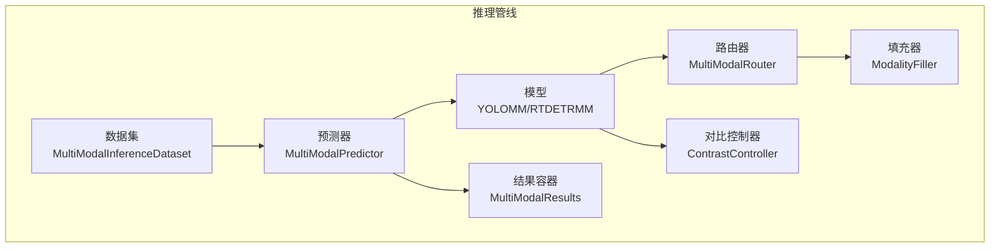
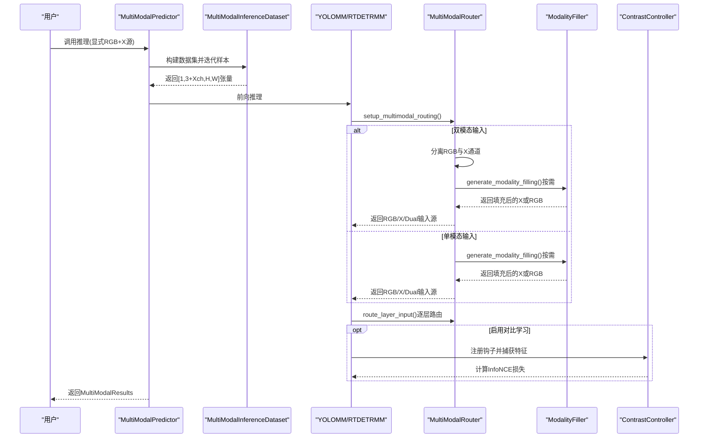
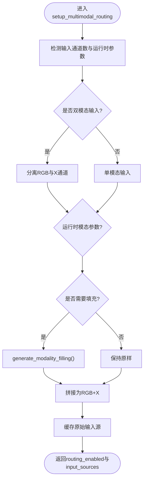
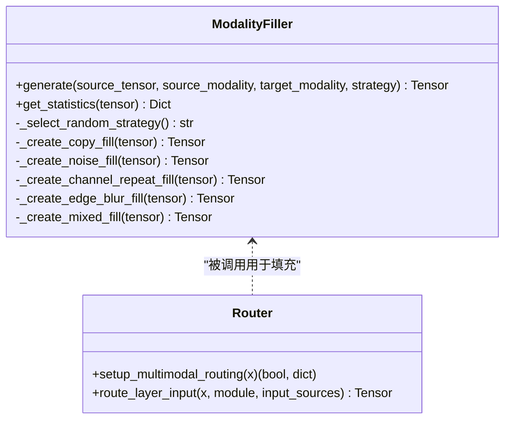
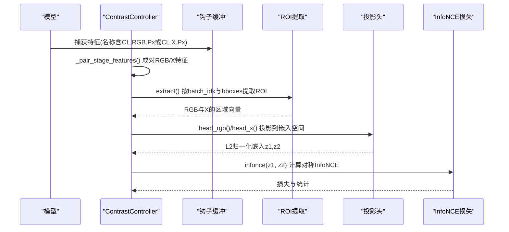
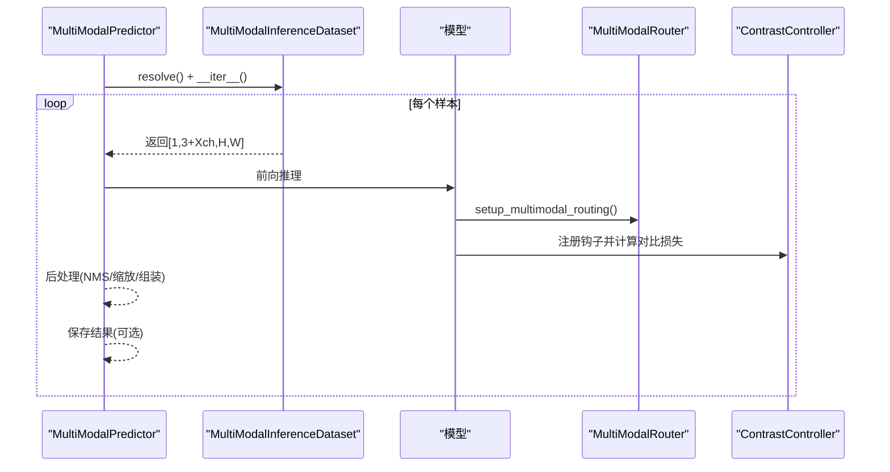
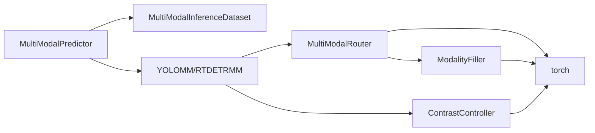
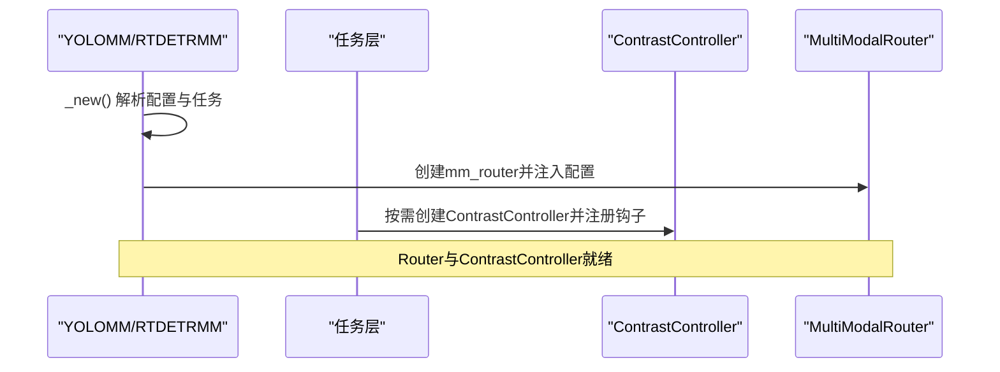

# 组件交互模式

<cite>
**本文档引用的文件**
- [router.py](file://ultralytics/nn/mm/router.py)
- [filling.py](file://ultralytics/nn/mm/filling.py)
- [contrast.py](file://ultralytics/models/rtdetrmm/contrast.py)
- [predictor.py](file://ultralytics/engine/multimodal/predictor.py)
- [inference_dataset.py](file://ultralytics/data/multimodal/inference_dataset.py)
- [results.py](file://ultralytics/engine/multimodal/results.py)
- [model.py](file://ultralytics/models/yolo/model.py)
- [model.py](file://ultralytics/models/rtdetrmm/model.py)
- [tasks.py](file://ultralytics/nn/tasks.py)
- [parser.py](file://ultralytics/nn/mm/parser.py)
</cite>

## 目录
1. [简介](#简介)
2. [项目结构](#项目结构)
3. [核心组件](#核心组件)
4. [架构总览](#架构总览)
5. [详细组件分析](#详细组件分析)
6. [依赖关系分析](#依赖关系分析)
7. [性能考虑](#性能考虑)
8. [故障排查指南](#故障排查指南)
9. [结论](#结论)
10. [附录](#附录)

## 简介
本文件聚焦于多模态系统中的三个关键组件：MultiModalRouter（多模态路由器）、ModalityFiller（模态填充器）与ContrastController（对比学习控制器）。文档系统化阐述三者之间的协作机制、数据流传递、接口契约与通信协议，覆盖初始化流程、数据路由过程、错误处理与生命周期管理，并给出调试与监控建议。

## 项目结构
围绕多模态推理与训练的关键模块分布如下：
- 路由与填充：ultralytics/nn/mm/router.py、ultralytics/nn/mm/filling.py
- 对比学习：ultralytics/models/rtdetrmm/contrast.py
- 推理引擎：ultralytics/engine/multimodal/predictor.py、ultralytics/data/multimodal/inference_dataset.py、ultralytics/engine/multimodal/results.py
- 模型封装：ultralytics/models/yolo/model.py、ultralytics/models/rtdetrmm/model.py
- 任务与钩子：ultralytics/nn/tasks.py、ultralytics/nn/mm/parser.py

**图表来源**
- [predictor.py:16-494](file://ultralytics/engine/multimodal/predictor.py#L16-L494)
- [inference_dataset.py:16-252](file://ultralytics/data/multimodal/inference_dataset.py#L16-L252)
- [router.py:11-471](file://ultralytics/nn/mm/router.py#L11-L471)
- [filling.py:14-175](file://ultralytics/nn/mm/filling.py#L14-L175)
- [contrast.py:149-290](file://ultralytics/models/rtdetrmm/contrast.py#L149-L290)
- [results.py:14-357](file://ultralytics/engine/multimodal/results.py#L14-L357)

**章节来源**
- [predictor.py:16-494](file://ultralytics/engine/multimodal/predictor.py#L16-L494)
- [inference_dataset.py:16-252](file://ultralytics/data/multimodal/inference_dataset.py#L16-L252)
- [router.py:11-471](file://ultralytics/nn/mm/router.py#L11-L471)
- [filling.py:14-175](file://ultralytics/nn/mm/filling.py#L14-L175)
- [contrast.py:149-290](file://ultralytics/models/rtdetrmm/contrast.py#L149-L290)
- [results.py:14-357](file://ultralytics/engine/multimodal/results.py#L14-L357)

## 核心组件
- MultiModalRouter：负责多模态输入的解析、路由与空间重置，支持RGB、X与Dual三种输入模式，提供零拷贝张量视图路由与运行时参数注入。
- ModalityFiller：提供轻量、确定性的模态填充策略（复制、噪声、通道重复、边缘模糊、混合），用于在单模态输入时合成另一模态。
- ContrastController：基于ROI特征对齐与InfoNCE损失实现跨模态对比学习，通过钩子捕获特征并在合适阶段计算对比损失。

**章节来源**
- [router.py:11-471](file://ultralytics/nn/mm/router.py#L11-L471)
- [filling.py:14-175](file://ultralytics/nn/mm/filling.py#L14-L175)
- [contrast.py:149-290](file://ultralytics/models/rtdetrmm/contrast.py#L149-L290)

## 架构总览
多模态系统采用“数据驱动 + 配置驱动”的路由机制。推理阶段由MultiModalPredictor驱动，数据集统一预处理RGB与X模态，模型内部通过MultiModalRouter解析配置并进行模态路由；当启用对比学习时，ContrastController通过钩子收集特征并计算损失。

**图表来源**
- [predictor.py:99-244](file://ultralytics/engine/multimodal/predictor.py#L99-L244)
- [inference_dataset.py:94-184](file://ultralytics/data/multimodal/inference_dataset.py#L94-L184)
- [router.py:157-240](file://ultralytics/nn/mm/router.py#L157-L240)
- [filling.py:141-148](file://ultralytics/nn/mm/filling.py#L141-L148)
- [contrast.py:189-290](file://ultralytics/models/rtdetrmm/contrast.py#L189-L290)

## 详细组件分析

### MultiModalRouter（多模态路由器）
- 职责
  - 解析层配置中的第5字段（RGB/X/Dual）以决定输入模态
  - 在setup_multimodal_routing中根据输入张量通道数与运行时参数，生成RGB、X与Dual输入源
  - 在route_layer_input中按模块属性将当前层输入路由到对应模态
  - 支持X模态“新输入起点”与空间重置
- 接口契约
  - 输入：张量x、模块module、输入源字典input_sources
  - 输出：路由后的张量或None
  - 属性：_mm_input_source、_mm_layer_index、_mm_x_modality、_mm_new_input_start、_mm_spatial_reset
- 数据流
  - setup_multimodal_routing：检测输入类型，分离/合成通道，缓存原始输入
  - route_layer_input：按模块属性路由，支持X起点切换与空间重置
- 错误处理
  - 输入源缺失、通道数不匹配、模块未标记多模态属性时返回None并记录警告

**图表来源**
- [router.py:157-240](file://ultralytics/nn/mm/router.py#L157-L240)

**章节来源**
- [router.py:11-471](file://ultralytics/nn/mm/router.py#L11-L471)

### ModalityFiller（模态填充器）
- 职责
  - 提供多种轻量填充策略，保证与源张量相同形状
  - 支持随机策略权重与可配置噪声强度与模糊核大小
- 接口契约
  - 输入：源张量、源模态、目标模态、策略
  - 输出：目标模态的合成张量
- 数据流
  - generate_modality_filling()包装调用，内部委派给ModalityFiller.generate()

**图表来源**
- [filling.py:14-175](file://ultralytics/nn/mm/filling.py#L14-L175)
- [router.py:157-240](file://ultralytics/nn/mm/router.py#L157-L240)

**章节来源**
- [filling.py:14-175](file://ultralytics/nn/mm/filling.py#L14-L175)

### ContrastController（对比学习控制器）
- 职责
  - 通过钩子名称解析阶段与模态，成对提取RGB与X特征
  - ROI池化提取区域向量，投影到嵌入空间，计算InfoNCE损失
- 接口契约
  - 输入：钩子缓冲区字典、批次字典（含img、batch_idx、bboxes）
  - 输出：损失张量与统计字典
- 数据流
  - _pair_stage_features：按阶段聚合RGB/X特征
  - ROI提取：按批处理提取每张图的感兴趣区域向量
  - 投影与损失：FP32计算，L2归一化嵌入，InfoNCE对称交叉熵

**图表来源**
- [contrast.py:149-290](file://ultralytics/models/rtdetrmm/contrast.py#L149-L290)

**章节来源**
- [contrast.py:149-290](file://ultralytics/models/rtdetrmm/contrast.py#L149-L290)

### 推理引擎与数据集
- MultiModalPredictor
  - 从模型读取mm_router配置，构建数据集并流式推理
  - 支持YOLO与RTDETR两类后处理路径
  - 可选保存结果与可视化
- MultiModalInferenceDataset
  - 严格校验输入存在性与通道数一致性
  - 统一LetterBox预处理与张量化
  - 支持单模态零填充

**图表来源**
- [predictor.py:144-244](file://ultralytics/engine/multimodal/predictor.py#L144-L244)
- [inference_dataset.py:94-184](file://ultralytics/data/multimodal/inference_dataset.py#L94-L184)

**章节来源**
- [predictor.py:16-494](file://ultralytics/engine/multimodal/predictor.py#L16-L494)
- [inference_dataset.py:16-252](file://ultralytics/data/multimodal/inference_dataset.py#L16-L252)

## 依赖关系分析
- 组件耦合与内聚
  - MultiModalRouter与ModalityFiller：弱耦合，Router通过函数调用使用填充能力，便于替换与扩展
  - ContrastController与模型：通过钩子解耦，仅依赖特征名称约定
  - MultiModalPredictor与数据集：强内聚，共同完成输入准备与后处理
- 外部依赖
  - torch、torch.nn.functional、re、numpy、cv2等基础库
  - ultralytics.utils与ultralytics.data模块提供的工具函数

**图表来源**
- [router.py:11-471](file://ultralytics/nn/mm/router.py#L11-L471)
- [filling.py:14-175](file://ultralytics/nn/mm/filling.py#L14-L175)
- [contrast.py:149-290](file://ultralytics/models/rtdetrmm/contrast.py#L149-L290)
- [predictor.py:16-494](file://ultralytics/engine/multimodal/predictor.py#L16-L494)
- [inference_dataset.py:16-252](file://ultralytics/data/multimodal/inference_dataset.py#L16-L252)

**章节来源**
- [router.py:11-471](file://ultralytics/nn/mm/router.py#L11-L471)
- [filling.py:14-175](file://ultralytics/nn/mm/filling.py#L14-L175)
- [contrast.py:149-290](file://ultralytics/models/rtdetrmm/contrast.py#L149-L290)
- [predictor.py:16-494](file://ultralytics/engine/multimodal/predictor.py#L16-L494)
- [inference_dataset.py:16-252](file://ultralytics/data/multimodal/inference_dataset.py#L16-L252)

## 性能考虑
- 零拷贝路由：Router通过张量视图分离RGB与X通道，避免额外内存分配
- 轻量填充：ModalityFiller策略均为纯CPU/GPU张量运算，策略权重可调，平衡质量与速度
- 对比学习：ROI提取与InfoNCE计算在FP32下进行以保证数值稳定，注意显存占用
- 推理优化：LetterBox与张量化在数据集侧完成，模型侧减少预处理开销

## 故障排查指南
- 路由失败
  - 症状：route_layer_input返回None并记录警告
  - 排查：确认模块是否具备_mm_input_source属性；检查input_sources是否为空；核对通道数与Xch配置
- 空间重置失败
  - 症状：reset_spatial_input未生效
  - 排查：确认模块标记了_mm_new_input_start；检查original_inputs是否缓存成功
- 对比损失异常
  - 症状：Inf/Nan警告或损失为0
  - 排查：检查钩子名称是否符合CL.RGB.Px/CL.X.Px格式；确认ROI提取非空；检查设备与dtype一致性
- 数据集加载异常
  - 症状：X通道数不匹配或读取失败
  - 排查：确认X模态路径存在且格式正确；核对Xch配置与实际通道数

**章节来源**
- [router.py:242-317](file://ultralytics/nn/mm/router.py#L242-L317)
- [contrast.py:189-290](file://ultralytics/models/rtdetrmm/contrast.py#L189-L290)
- [inference_dataset.py:185-246](file://ultralytics/data/multimodal/inference_dataset.py#L185-L246)

## 结论
MultiModalRouter、ModalityFiller与ContrastController在多模态系统中分别承担“路由与空间管理”、“模态合成”与“对比学习”的职责。通过配置驱动的路由与钩子约定，系统实现了松耦合与高内聚，既支持灵活的多模态输入，又能在训练阶段引入对比学习增强表征。建议在生产环境中结合日志与性能分析工具持续监控各组件行为，确保稳定性与效率。

## 附录

### 组件生命周期与初始化顺序
- 初始化
  - 模型加载：YOLOMM/RTDETRMM根据配置检测多模态层并设置input_channels与modality_config
  - Router创建：在RTDETRMM中确保底层模型持有mm_router实例
  - 对比学习：在任务层按需创建ContrastController并注册钩子
- 运行时
  - 预测器驱动数据集迭代，模型前向调用Router进行路由，必要时调用ContrastController计算损失
- 清理
  - 推理完成后释放中间张量与钩子缓冲

**章节来源**
- [model.py:456-741](file://ultralytics/models/yolo/model.py#L456-L741)
- [model.py:25-188](file://ultralytics/models/rtdetrmm/model.py#L25-L188)
- [tasks.py:1123-1143](file://ultralytics/nn/tasks.py#L1123-L1143)

### 接口契约与通信协议
- MultiModalRouter
  - 输入：x（张量）、module（模块）、input_sources（字典）
  - 输出：路由后的张量或None
  - 属性：_mm_input_source、_mm_layer_index、_mm_x_modality、_mm_new_input_start、_mm_spatial_reset
- ModalityFiller
  - 输入：source_tensor、source_modality、target_modality、strategy
  - 输出：same-shape张量
- ContrastController
  - 输入：hook_buffers（字典）、batch（字典）
  - 输出：loss（张量或None）、stats（字典）

**章节来源**
- [router.py:90-156](file://ultralytics/nn/mm/router.py#L90-L156)
- [filling.py:34-148](file://ultralytics/nn/mm/filling.py#L34-L148)
- [contrast.py:189-290](file://ultralytics/models/rtdetrmm/contrast.py#L189-L290)

### 典型交互序列（初始化流程）

**图表来源**
- [model.py:660-741](file://ultralytics/models/yolo/model.py#L660-L741)
- [model.py:148-188](file://ultralytics/models/rtdetrmm/model.py#L148-L188)
- [tasks.py:1123-1143](file://ultralytics/nn/tasks.py#L1123-L1143)