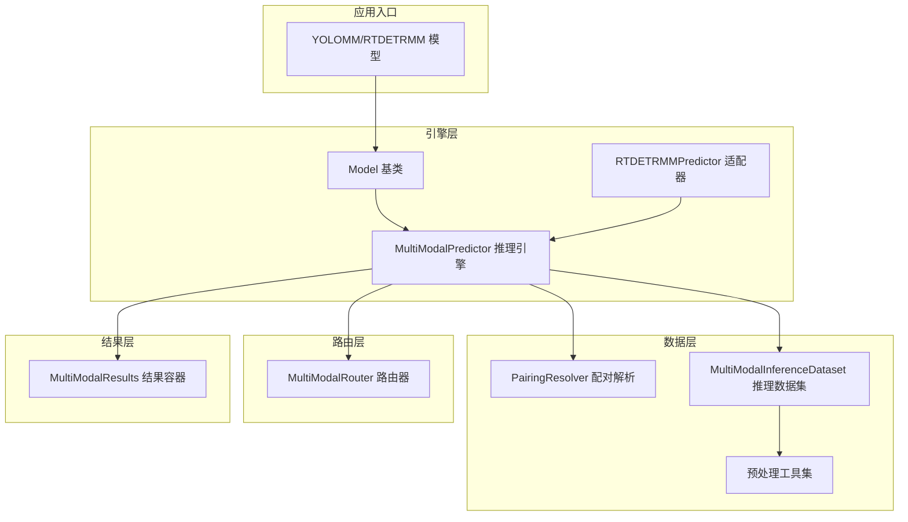
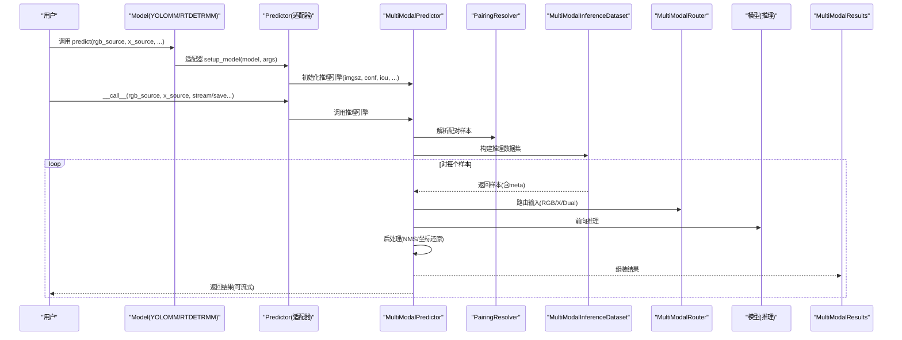
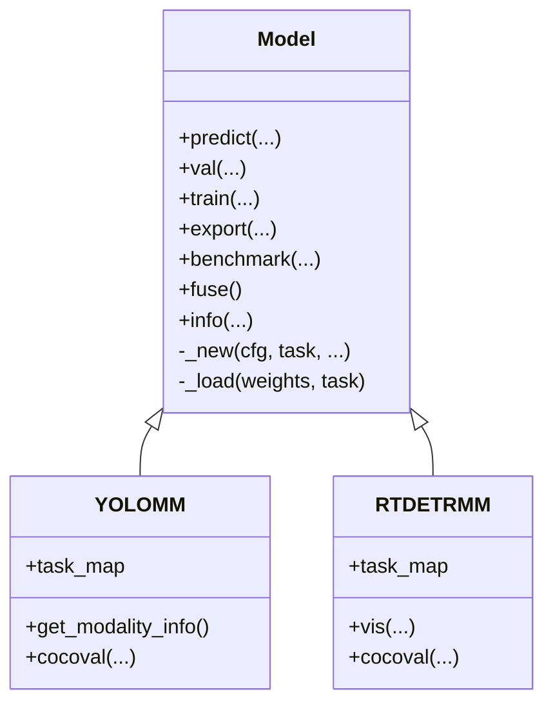
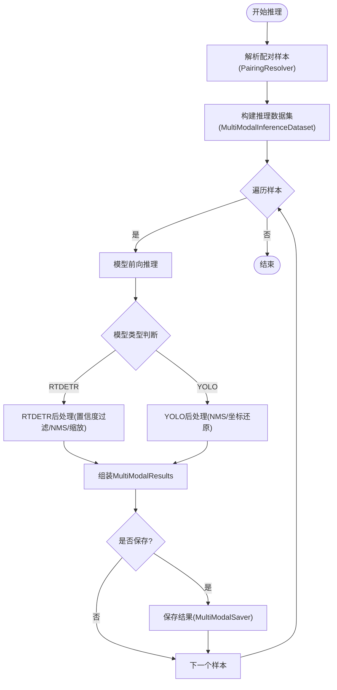
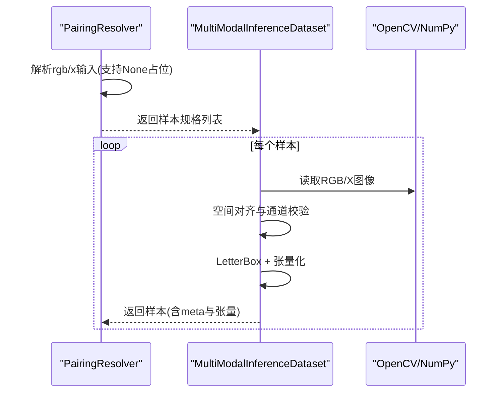
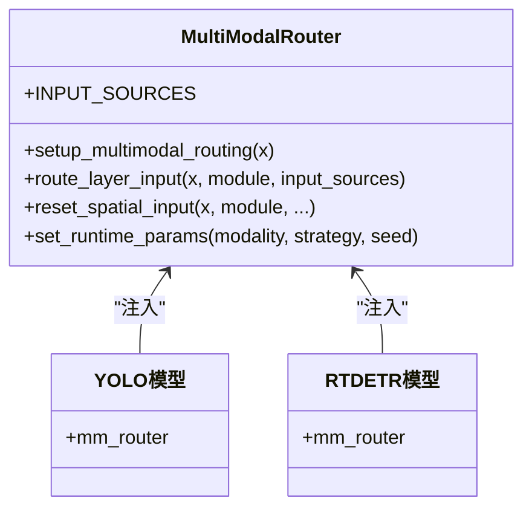
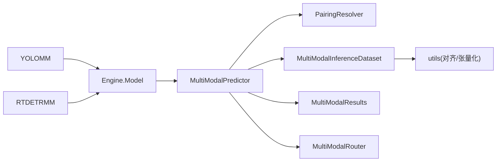

# 系统架构设计

<cite>
**本文档引用的文件**
- [ultralytics/__init__.py](file://ultralytics/__init__.py)
- [ultralytics/engine/model.py](file://ultralytics/engine/model.py)
- [ultralytics/engine/multimodal/predictor.py](file://ultralytics/engine/multimodal/predictor.py)
- [ultralytics/engine/multimodal/results.py](file://ultralytics/engine/multimodal/results.py)
- [ultralytics/models/yolo/model.py](file://ultralytics/models/yolo/model.py)
- [ultralytics/models/rtdetrmm/model.py](file://ultralytics/models/rtdetrmm/model.py)
- [ultralytics/models/rtdetrmm/mm_predictor.py](file://ultralytics/models/rtdetrmm/mm_predictor.py)
- [ultralytics/data/multimodal/pairing.py](file://ultralytics/data/multimodal/pairing.py)
- [ultralytics/data/multimodal/inference_dataset.py](file://ultralytics/data/multimodal/inference_dataset.py)
- [ultralytics/data/multimodal/utils.py](file://ultralytics/data/multimodal/utils.py)
- [ultralytics/nn/mm/router.py](file://ultralytics/nn/mm/router.py)
- [ultralytics/cfg/default.yaml](file://ultralytics/cfg/default.yaml)
- [predictMM.py](file://predictMM.py)
- [trainMM.py](file://trainMM.py)
</cite>

## 目录
1. [简介](#简介)
2. [项目结构](#项目结构)
3. [核心组件](#核心组件)
4. [架构总览](#架构总览)
5. [详细组件分析](#详细组件分析)
6. [依赖关系分析](#依赖关系分析)
7. [性能考量](#性能考量)
8. [故障排查指南](#故障排查指南)
9. [结论](#结论)
10. [附录](#附录)

## 简介
本架构设计文档面向多模态检测系统，聚焦于RGB与X（如热成像、深度、激光雷达等）模态的联合推理与训练框架。系统采用模块化设计，围绕“模型抽象层-推理引擎-数据管线-路由与融合-结果封装”五大层次展开，既保证与现有YOLO生态的兼容，又提供独立的多模态推理能力。文档将阐述高层架构、模块边界、组件交互、数据流与处理流程，并给出性能优化、可扩展性与解耦策略建议。

## 项目结构
系统采用分层与功能域结合的组织方式：
- 引擎层：统一的Model基类与各任务的Predictor/Validator/Trainer映射
- 模型层：YOLO家族与RTDETR家族的多模态变体（YOLOMM、RTDETRMM）
- 数据层：多模态配对解析、推理数据集与预处理工具
- 路由层：多模态路由器，负责通道与空间维度的路由与融合
- 结果层：多模态结果容器与可视化/保存工具

**图表来源**
- [ultralytics/engine/model.py](file://ultralytics/engine/model.py)
- [ultralytics/engine/multimodal/predictor.py](file://ultralytics/engine/multimodal/predictor.py)
- [ultralytics/models/rtdetrmm/mm_predictor.py](file://ultralytics/models/rtdetrmm/mm_predictor.py)
- [ultralytics/data/multimodal/pairing.py](file://ultralytics/data/multimodal/pairing.py)
- [ultralytics/data/multimodal/inference_dataset.py](file://ultralytics/data/multimodal/inference_dataset.py)
- [ultralytics/nn/mm/router.py](file://ultralytics/nn/mm/router.py)
- [ultralytics/engine/multimodal/results.py](file://ultralytics/engine/multimodal/results.py)

**章节来源**
- [ultralytics/engine/model.py](file://ultralytics/engine/model.py)
- [ultralytics/models/yolo/model.py](file://ultralytics/models/yolo/model.py)
- [ultralytics/models/rtdetrmm/model.py](file://ultralytics/models/rtdetrmm/model.py)

## 核心组件
- Model基类：统一训练/验证/预测/导出/基准测试入口，支持从本地权重、HUB、Triton加载模型，提供predict/val/export等方法。
- MultiModalPredictor：独立的多模态推理引擎，支持显式RGB与X模态输入，内置流式推理、YOLO/RTDETR后处理、坐标还原与结果封装。
- PairingResolver：显式配对解析器，接收rgb_source与x_source，生成配对样本规格，支持单模态与双模态推理。
- MultiModalInferenceDataset：多模态推理数据集，负责RGB/X图像加载、空间对齐、通道校验、LetterBox预处理与张量化。
- MultiModalRouter：多模态路由器，依据配置与运行时参数，将输入按RGB/X/Dual进行路由与融合，支持空间重置与零拷贝视图。
- MultiModalResults：多模态结果容器，封装检测框、路径、原图与元数据，提供可视化与保存能力。
- RTDETRMMPredictor：RTDETRMM的适配器，桥接BasePredictor接口与MultiModalPredictor引擎。

**章节来源**
- [ultralytics/engine/model.py](file://ultralytics/engine/model.py)
- [ultralytics/engine/multimodal/predictor.py](file://ultralytics/engine/multimodal/predictor.py)
- [ultralytics/data/multimodal/pairing.py](file://ultralytics/data/multimodal/pairing.py)
- [ultralytics/data/multimodal/inference_dataset.py](file://ultralytics/data/multimodal/inference_dataset.py)
- [ultralytics/nn/mm/router.py](file://ultralytics/nn/mm/router.py)
- [ultralytics/engine/multimodal/results.py](file://ultralytics/engine/multimodal/results.py)
- [ultralytics/models/rtdetrmm/mm_predictor.py](file://ultralytics/models/rtdetrmm/mm_predictor.py)

## 架构总览
系统采用“统一模型抽象 + 独立推理引擎 + 配对数据管线 + 路由融合”的架构。Model基类负责任务映射与生命周期管理；MultiModalPredictor承担推理主流程；PairingResolver与MultiModalInferenceDataset构成数据管线；MultiModalRouter贯穿模型内部实现多模态路由；MultiModalResults提供统一的结果表达与持久化。

**图表来源**
- [ultralytics/engine/model.py](file://ultralytics/engine/model.py)
- [ultralytics/models/rtdetrmm/mm_predictor.py](file://ultralytics/models/rtdetrmm/mm_predictor.py)
- [ultralytics/engine/multimodal/predictor.py](file://ultralytics/engine/multimodal/predictor.py)
- [ultralytics/data/multimodal/pairing.py](file://ultralytics/data/multimodal/pairing.py)
- [ultralytics/data/multimodal/inference_dataset.py](file://ultralytics/data/multimodal/inference_dataset.py)
- [ultralytics/nn/mm/router.py](file://ultralytics/nn/mm/router.py)

## 详细组件分析

### Model基类与任务映射
- 统一入口：支持从.pt/.yaml/HUB/Triton加载模型，提供predict/val/train/export/benchmark等方法。
- 任务映射：通过task_map将detect/segment/classify/pose/obb等任务映射到对应模型/训练器/验证器/预测器。
- 多模态支持：YOLOMM/RTDETRMM在Model子类中注册各自的任务映射与特化行为。

**图表来源**
- [ultralytics/engine/model.py](file://ultralytics/engine/model.py)
- [ultralytics/models/yolo/model.py](file://ultralytics/models/yolo/model.py)
- [ultralytics/models/rtdetrmm/model.py](file://ultralytics/models/rtdetrmm/model.py)

**章节来源**
- [ultralytics/engine/model.py](file://ultralytics/engine/model.py)
- [ultralytics/models/yolo/model.py](file://ultralytics/models/yolo/model.py)
- [ultralytics/models/rtdetrmm/model.py](file://ultralytics/models/rtdetrmm/model.py)

### MultiModalPredictor推理引擎
- 职责：从模型读取Router配置，构建数据集，逐样本执行forward/NMS/scale_boxes/组装结果，支持真正流式输出。
- 特性：自动识别YOLO/RTDETR后处理差异，支持debug模式输出中间信息，支持保存可视化与文本标签。
- 设计：不依赖BasePredictor，独立性强，便于扩展与维护。

**图表来源**
- [ultralytics/engine/multimodal/predictor.py](file://ultralytics/engine/multimodal/predictor.py)
- [ultralytics/data/multimodal/pairing.py](file://ultralytics/data/multimodal/pairing.py)
- [ultralytics/data/multimodal/inference_dataset.py](file://ultralytics/data/multimodal/inference_dataset.py)

**章节来源**
- [ultralytics/engine/multimodal/predictor.py](file://ultralytics/engine/multimodal/predictor.py)

### PairingResolver与MultiModalInferenceDataset
- PairingResolver：显式接收rgb_source与x_source，支持单模态与双模态，生成统一样本规格并校验文件存在性。
- MultiModalInferenceDataset：加载RGB/X图像，进行空间对齐与通道校验，LetterBox预处理，张量化，最终拼接为[RGB,X]输入张量。

**图表来源**
- [ultralytics/data/multimodal/pairing.py](file://ultralytics/data/multimodal/pairing.py)
- [ultralytics/data/multimodal/inference_dataset.py](file://ultralytics/data/multimodal/inference_dataset.py)
- [ultralytics/data/multimodal/utils.py](file://ultralytics/data/multimodal/utils.py)

**章节来源**
- [ultralytics/data/multimodal/pairing.py](file://ultralytics/data/multimodal/pairing.py)
- [ultralytics/data/multimodal/inference_dataset.py](file://ultralytics/data/multimodal/inference_dataset.py)
- [ultralytics/data/multimodal/utils.py](file://ultralytics/data/multimodal/utils.py)

### MultiModalRouter路由与融合
- 功能：依据配置与运行时参数，将输入按RGB/X/Dual进行路由；支持X模态新输入起点的空间重置；提供零拷贝视图缓存。
- 机制：解析层配置中的第5字段标识RGB/X/Dual输入源，动态切分与拼接输入张量，确保通道与空间一致性。

**图表来源**
- [ultralytics/nn/mm/router.py](file://ultralytics/nn/mm/router.py)

**章节来源**
- [ultralytics/nn/mm/router.py](file://ultralytics/nn/mm/router.py)

### MultiModalResults结果容器
- 字段：boxes、paths、orig_imgs、meta、names；支持plot/plot_merged/save_txt/save_json。
- 规则：始终输出RGB可视化；当xch为1或3且X真实存在时输出X可视化；双模态合并图需满足条件。

**章节来源**
- [ultralytics/engine/multimodal/results.py](file://ultralytics/engine/multimodal/results.py)

### RTDETRMMPredictor适配器
- 职责：桥接BasePredictor接口与MultiModalPredictor引擎，保持与Model.predict()一致的调用方式。
- 行为：setup_model中初始化MultiModalPredictor；__call__/predict_cli转发参数至引擎。

**章节来源**
- [ultralytics/models/rtdetrmm/mm_predictor.py](file://ultralytics/models/rtdetrmm/mm_predictor.py)

## 依赖关系分析
- 模块内聚：引擎层与数据层通过明确接口耦合；路由层与模型层通过mm_router弱耦合。
- 外部依赖：OpenCV/NumPy/Torch；配置来自default.yaml与模型配置文件。
- 循环依赖：未发现循环导入；适配器通过组合而非继承降低耦合。

**图表来源**
- [ultralytics/models/yolo/model.py](file://ultralytics/models/yolo/model.py)
- [ultralytics/models/rtdetrmm/model.py](file://ultralytics/models/rtdetrmm/model.py)
- [ultralytics/engine/model.py](file://ultralytics/engine/model.py)
- [ultralytics/engine/multimodal/predictor.py](file://ultralytics/engine/multimodal/predictor.py)
- [ultralytics/data/multimodal/pairing.py](file://ultralytics/data/multimodal/pairing.py)
- [ultralytics/data/multimodal/inference_dataset.py](file://ultralytics/data/multimodal/inference_dataset.py)
- [ultralytics/data/multimodal/utils.py](file://ultralytics/data/multimodal/utils.py)
- [ultralytics/nn/mm/router.py](file://ultralytics/nn/mm/router.py)
- [ultralytics/engine/multimodal/results.py](file://ultralytics/engine/multimodal/results.py)

**章节来源**
- [ultralytics/cfg/default.yaml](file://ultralytics/cfg/default.yaml)

## 性能考量
- 推理性能
  - 模型融合：调用fuse()减少卷积与BN融合操作，提升推理速度。
  - 设备选择：优先CUDA，合理设置imgsz与batch，避免不必要的放大与填充。
  - 流式推理：启用stream=True可边生成边消费，降低内存峰值。
- 训练性能
  - 多模态增强：default.yaml中提供异步几何扰动与模态擦除等增强策略，注意与任务匹配。
  - 分辨率与批大小：根据GPU显存调整imgsz与batch，平衡吞吐与精度。
- 可扩展性
  - 路由器：通过配置与运行时参数灵活切换模态，支持Xch>3场景的多通道输入。
  - 适配器：RTDETRMMPredictor桥接BasePredictor，便于统一接入与扩展。

[本节为通用指导，无需特定文件引用]

## 故障排查指南
- 常见问题
  - 模型类型识别：确认使用YOLOMM或RTDETRMM模型，MultiModalPredictor依赖模型的mm_router。
  - 输入通道不匹配：X模态通道数需与配置一致；1/3通道可在限定条件下自动转换。
  - 文件路径错误：PairingResolver会校验文件存在性与类型，确保路径有效。
  - 设备与dtype：确保设备可用且输入张量dtype符合预期。
- 调试手段
  - debug参数：MultiModalPredictor支持debug模式输出中间信息，辅助定位问题。
  - 日志：各组件均输出详细日志，便于追踪数据流与路由行为。

**章节来源**
- [ultralytics/engine/multimodal/predictor.py](file://ultralytics/engine/multimodal/predictor.py)
- [ultralytics/data/multimodal/pairing.py](file://ultralytics/data/multimodal/pairing.py)
- [ultralytics/data/multimodal/inference_dataset.py](file://ultralytics/data/multimodal/inference_dataset.py)

## 结论
该多模态检测系统以清晰的分层架构实现了RGB与X模态的统一推理与训练。通过独立的MultiModalPredictor、严格的配对解析与数据集预处理、以及可配置的MultiModalRouter，系统在保证易用性的同时具备良好的扩展性与性能潜力。建议在生产环境中结合具体硬件与任务特点，合理配置imgsz、batch与增强策略，并充分利用流式推理与模型融合以获得最佳效果。

[本节为总结性内容，无需特定文件引用]

## 附录
- 使用示例
  - 推理：参考predictMM.py中的双模态、单RGB、单X三种调用方式。
  - 训练：参考trainMM.py中的训练入口与参数设置。
- 配置要点
  - default.yaml中提供多模态相关参数（如模态消融、异步几何扰动、模态擦除等），可根据实验需求调整。

**章节来源**
- [predictMM.py](file://predictMM.py)
- [trainMM.py](file://trainMM.py)
- [ultralytics/cfg/default.yaml](file://ultralytics/cfg/default.yaml)