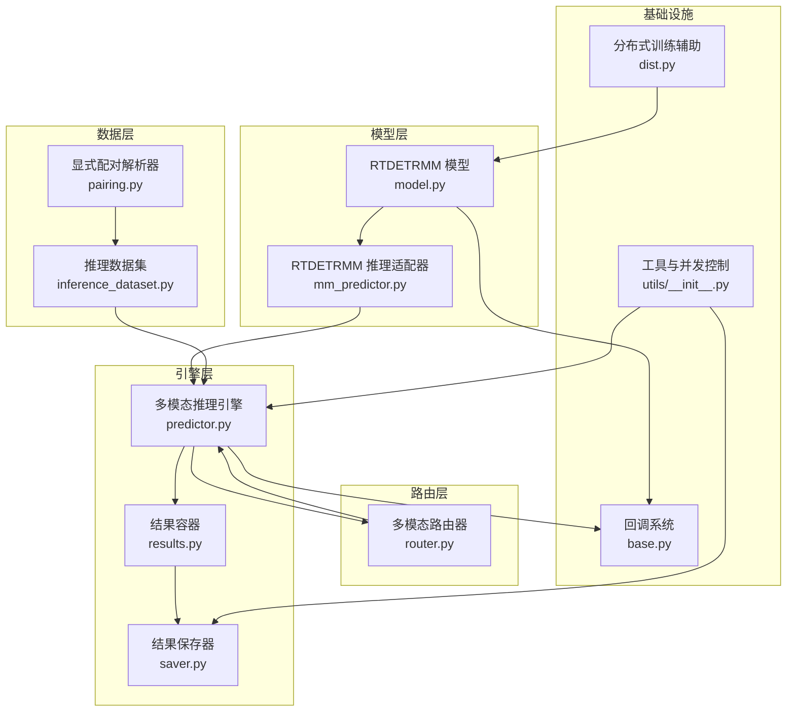
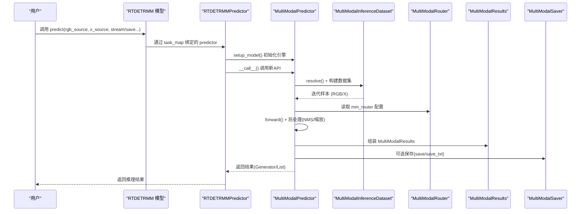
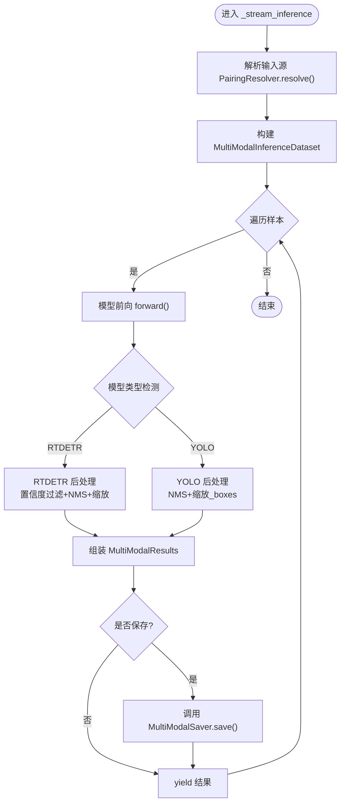
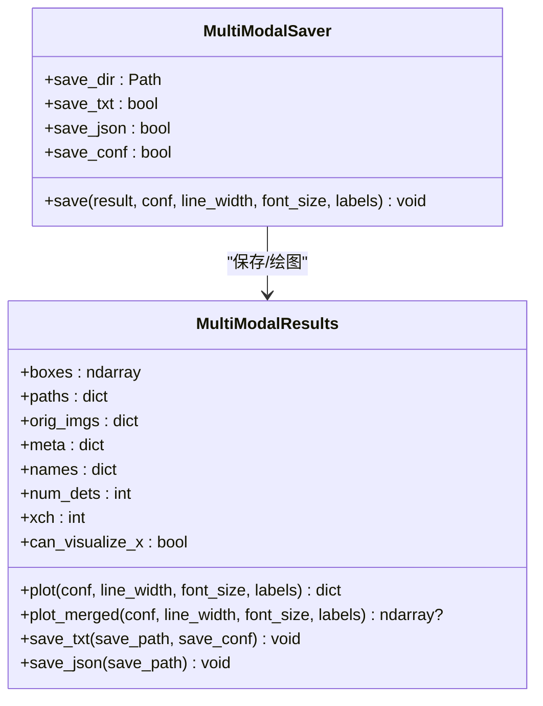
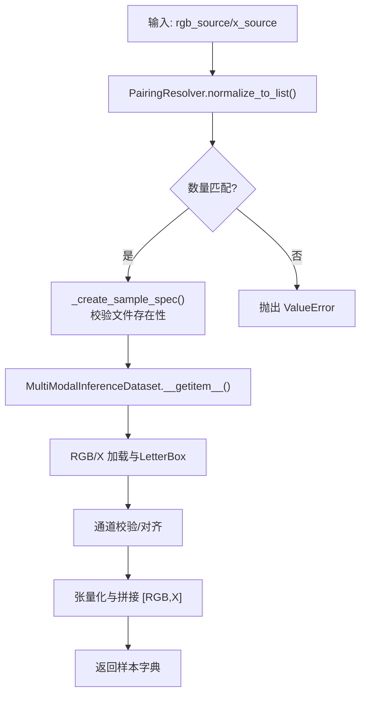
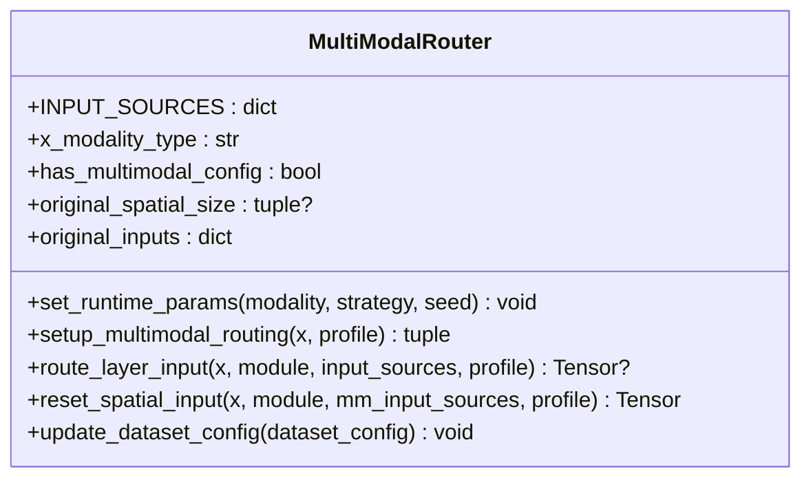
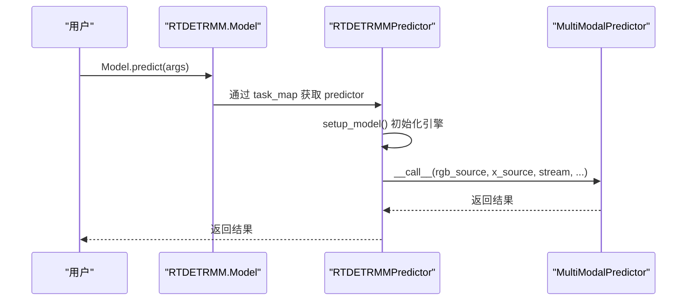
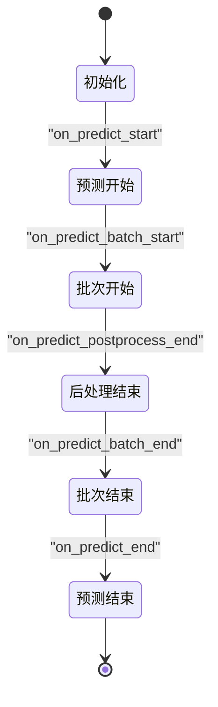
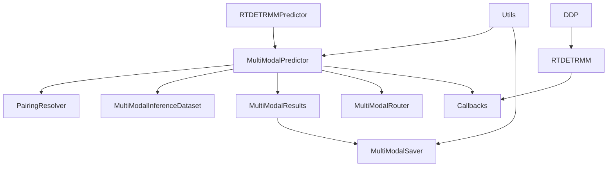

# 组件交互模式

<cite>
**本文档引用的文件**
- [predictor.py](file://ultralytics/engine/multimodal/predictor.py)
- [results.py](file://ultralytics/engine/multimodal/results.py)
- [saver.py](file://ultralytics/engine/multimodal/saver.py)
- [mm_predictor.py](file://ultralytics/models/rtdetrmm/mm_predictor.py)
- [model.py](file://ultralytics/models/rtdetrmm/model.py)
- [inference_dataset.py](file://ultralytics/data/multimodal/inference_dataset.py)
- [pairing.py](file://ultralytics/data/multimodal/pairing.py)
- [router.py](file://ultralytics/nn/mm/router.py)
- [base.py](file://ultralytics/utils/callbacks/base.py)
- [model.py](file://ultralytics/engine/model.py)
- [__init__.py](file://ultralytics/utils/__init__.py)
- [dist.py](file://ultralytics/utils/dist.py)
</cite>

## 目录
1. [简介](#简介)
2. [项目结构](#项目结构)
3. [核心组件](#核心组件)
4. [架构总览](#架构总览)
5. [详细组件分析](#详细组件分析)
6. [依赖关系分析](#依赖关系分析)
7. [性能考虑](#性能考虑)
8. [故障排查指南](#故障排查指南)
9. [结论](#结论)
10. [附录](#附录)

## 简介
本文件聚焦于多模态系统中的组件交互模式，围绕事件驱动机制、回调函数模式、观察者模式、同步与异步交互策略、消息传递与状态共享机制展开，结合组件生命周期管理、初始化顺序与销毁流程，提供交互序列图与状态转换图，覆盖并发控制、死锁预防与资源竞争处理策略。目标读者既包括工程实践者，也包括对系统架构感兴趣的非专业读者。

## 项目结构
多模态系统采用“适配层 + 引擎层 + 数据层 + 结果层 + 可视化/保存层”的分层组织，配合路由器（Router）实现跨模态数据路由与零拷贝张量转发，保证推理过程的模块解耦与可扩展性。

图表来源
- [model.py:25-57](file://ultralytics/models/rtdetrmm/model.py#L25-L57)
- [mm_predictor.py:18-31](file://ultralytics/models/rtdetrmm/mm_predictor.py#L18-L31)
- [predictor.py:16-30](file://ultralytics/engine/multimodal/predictor.py#L16-L30)
- [results.py:14-28](file://ultralytics/engine/multimodal/results.py#L14-L28)
- [saver.py:12-22](file://ultralytics/engine/multimodal/saver.py#L12-L22)
- [pairing.py:11-24](file://ultralytics/data/multimodal/pairing.py#L11-L24)
- [inference_dataset.py:16-30](file://ultralytics/data/multimodal/inference_dataset.py#L16-L30)
- [router.py:11-24](file://ultralytics/nn/mm/router.py#L11-L24)
- [base.py:144-174](file://ultralytics/utils/callbacks/base.py#L144-L174)
- [__init__.py:591-622](file://ultralytics/utils/__init__.py#L591-L622)
- [dist.py:29-99](file://ultralytics/utils/dist.py#L29-L99)

章节来源
- [model.py:25-57](file://ultralytics/models/rtdetrmm/model.py#L25-L57)
- [mm_predictor.py:18-31](file://ultralytics/models/rtdetrmm/mm_predictor.py#L18-L31)
- [predictor.py:16-30](file://ultralytics/engine/multimodal/predictor.py#L16-L30)
- [results.py:14-28](file://ultralytics/engine/multimodal/results.py#L14-L28)
- [saver.py:12-22](file://ultralytics/engine/multimodal/saver.py#L12-L22)
- [pairing.py:11-24](file://ultralytics/data/multimodal/pairing.py#L11-L24)
- [inference_dataset.py:16-30](file://ultralytics/data/multimodal/inference_dataset.py#L16-L30)
- [router.py:11-24](file://ultralytics/nn/mm/router.py#L11-L24)
- [base.py:144-174](file://ultralytics/utils/callbacks/base.py#L144-L174)
- [__init__.py:591-622](file://ultralytics/utils/__init__.py#L591-L622)
- [dist.py:29-99](file://ultralytics/utils/dist.py#L29-L99)

## 核心组件
- 多模态推理引擎（MultiModalPredictor）：负责从模型读取 Router 配置、构建数据集、执行前向、后处理、组装结果与保存。
- 结果容器（MultiModalResults）：封装检测框、路径、原始图像与元数据，提供绘图与合并能力。
- 结果保存器（MultiModalSaver）：根据配置保存可视化图像、文本标签与 JSON 结果。
- 显式配对解析器（PairingResolver）：将显式 RGB/X 输入解析为配对样本规格。
- 推理数据集（MultiModalInferenceDataset）：加载与预处理 RGB/X，统一 LetterBox 尺寸与张量化。
- 多模态路由器（MultiModalRouter）：在 YOLO/RTDETR 架构中实现零拷贝张量路由与空间重置。
- RTDETRMM 模型与适配器：RTDETRMM 模型通过任务映射绑定适配器，适配器桥接 BasePredictor 接口与新引擎。
- 回调系统（Callbacks）：提供训练/验证/预测/导出阶段的事件回调钩子。
- 工具与并发控制（Utils）：线程安全装饰器、重试装饰器、线程化执行等。
- 分布式训练辅助（DDP）：生成临时 DDP 文件、端口探测与清理。

章节来源
- [predictor.py:16-98](file://ultralytics/engine/multimodal/predictor.py#L16-L98)
- [results.py:14-60](file://ultralytics/engine/multimodal/results.py#L14-L60)
- [saver.py:12-53](file://ultralytics/engine/multimodal/saver.py#L12-L53)
- [pairing.py:11-36](file://ultralytics/data/multimodal/pairing.py#L11-L36)
- [inference_dataset.py:16-89](file://ultralytics/data/multimodal/inference_dataset.py#L16-L89)
- [router.py:11-63](file://ultralytics/nn/mm/router.py#L11-L63)
- [model.py:25-57](file://ultralytics/models/rtdetrmm/model.py#L25-L57)
- [mm_predictor.py:18-44](file://ultralytics/models/rtdetrmm/mm_predictor.py#L18-L44)
- [base.py:144-174](file://ultralytics/utils/callbacks/base.py#L144-L174)
- [__init__.py:591-622](file://ultralytics/utils/__init__.py#L591-L622)
- [dist.py:29-99](file://ultralytics/utils/dist.py#L29-L99)

## 架构总览
系统采用“事件驱动 + 适配器 + 路由器”的交互模式：
- 事件驱动：通过回调系统在推理开始/批次开始/批次结束/后处理结束/结束等节点触发用户自定义逻辑。
- 适配器：RTDETRMMPredictor 将 BasePredictor 接口转换为新引擎 MultiModalPredictor 的显式 RGB/X 输入。
- 路由器：MultiModalRouter 在模型内部实现零拷贝张量视图路由，支持 RGB/X/Dual 三种输入源与空间重置。
- 同步/异步：推理支持流式（Generator）与批式两种模式；保存与绘图为同步操作，可通过工具进行线程化。

图表来源
- [model.py:48-57](file://ultralytics/models/rtdetrmm/model.py#L48-L57)
- [mm_predictor.py:71-111](file://ultralytics/models/rtdetrmm/mm_predictor.py#L71-L111)
- [predictor.py:99-142](file://ultralytics/engine/multimodal/predictor.py#L99-L142)
- [inference_dataset.py:94-183](file://ultralytics/data/multimodal/inference_dataset.py#L94-L183)
- [router.py:157-240](file://ultralytics/nn/mm/router.py#L157-L240)
- [results.py:436-464](file://ultralytics/engine/multimodal/results.py#L436-L464)
- [saver.py:54-111](file://ultralytics/engine/multimodal/saver.py#L54-L111)

## 详细组件分析

### 多模态推理引擎（MultiModalPredictor）
职责与交互要点：
- 从模型读取 Router 配置，识别 X 模态类型与通道数。
- 通过 PairingResolver 与 MultiModalInferenceDataset 构建样本流。
- 执行前向、后处理（YOLO/NMS 或 RTDETR 专用流程）、坐标还原与结果组装。
- 支持流式（Generator）与批式两种返回模式；可选保存。

图表来源
- [predictor.py:144-243](file://ultralytics/engine/multimodal/predictor.py#L144-L243)
- [pairing.py:37-125](file://ultralytics/data/multimodal/pairing.py#L37-L125)
- [inference_dataset.py:94-183](file://ultralytics/data/multimodal/inference_dataset.py#L94-L183)
- [results.py:436-464](file://ultralytics/engine/multimodal/results.py#L436-L464)
- [saver.py:54-111](file://ultralytics/engine/multimodal/saver.py#L54-L111)

章节来源
- [predictor.py:16-98](file://ultralytics/engine/multimodal/predictor.py#L16-L98)
- [predictor.py:144-243](file://ultralytics/engine/multimodal/predictor.py#L144-L243)
- [predictor.py:245-321](file://ultralytics/engine/multimodal/predictor.py#L245-L321)
- [predictor.py:323-434](file://ultralytics/engine/multimodal/predictor.py#L323-L434)
- [predictor.py:436-493](file://ultralytics/engine/multimodal/predictor.py#L436-L493)

### 结果容器与保存器（MultiModalResults/MultiModalSaver）
- MultiModalResults：封装 boxes、paths、orig_imgs、meta 与 names；提供绘图（plot/plot_merged）、YOLO 文本标签保存与 JSON 结果保存。
- MultiModalSaver：根据配置保存 RGB/X/双模态合并图，以及 labels 与 json。

图表来源
- [results.py:14-60](file://ultralytics/engine/multimodal/results.py#L14-L60)
- [results.py:61-130](file://ultralytics/engine/multimodal/results.py#L61-L130)
- [results.py:186-233](file://ultralytics/engine/multimodal/results.py#L186-L233)
- [results.py:235-272](file://ultralytics/engine/multimodal/results.py#L235-L272)
- [results.py:273-357](file://ultralytics/engine/multimodal/results.py#L273-L357)
- [saver.py:12-53](file://ultralytics/engine/multimodal/saver.py#L12-L53)
- [saver.py:54-111](file://ultralytics/engine/multimodal/saver.py#L54-L111)

章节来源
- [results.py:14-60](file://ultralytics/engine/multimodal/results.py#L14-L60)
- [results.py:61-130](file://ultralytics/engine/multimodal/results.py#L61-L130)
- [results.py:186-233](file://ultralytics/engine/multimodal/results.py#L186-L233)
- [results.py:235-272](file://ultralytics/engine/multimodal/results.py#L235-L272)
- [results.py:273-357](file://ultralytics/engine/multimodal/results.py#L273-L357)
- [saver.py:12-53](file://ultralytics/engine/multimodal/saver.py#L12-L53)
- [saver.py:54-111](file://ultralytics/engine/multimodal/saver.py#L54-L111)

### 显式配对解析器与推理数据集（PairingResolver/MultiModalInferenceDataset）
- PairingResolver：强制显式提供 rgb_source 与 x_source，支持单模态与双模态配对，生成样本规格列表。
- MultiModalInferenceDataset：加载 RGB/X，执行 LetterBox 对齐、通道校验与张量化，支持零填充与空间对齐。

图表来源
- [pairing.py:37-125](file://ultralytics/data/multimodal/pairing.py#L37-L125)
- [pairing.py:127-152](file://ultralytics/data/multimodal/pairing.py#L127-L152)
- [pairing.py:154-202](file://ultralytics/data/multimodal/pairing.py#L154-L202)
- [inference_dataset.py:94-183](file://ultralytics/data/multimodal/inference_dataset.py#L94-L183)
- [inference_dataset.py:185-246](file://ultralytics/data/multimodal/inference_dataset.py#L185-L246)

章节来源
- [pairing.py:11-36](file://ultralytics/data/multimodal/pairing.py#L11-L36)
- [pairing.py:37-125](file://ultralytics/data/multimodal/pairing.py#L37-L125)
- [pairing.py:127-202](file://ultralytics/data/multimodal/pairing.py#L127-L202)
- [inference_dataset.py:16-89](file://ultralytics/data/multimodal/inference_dataset.py#L16-L89)
- [inference_dataset.py:94-183](file://ultralytics/data/multimodal/inference_dataset.py#L94-L183)
- [inference_dataset.py:185-246](file://ultralytics/data/multimodal/inference_dataset.py#L185-L246)

### 多模态路由器（MultiModalRouter）
- 功能：在 YOLO/RTDETR 架构中实现零拷贝张量视图路由，支持 RGB/X/Dual 三路输入；具备空间重置与运行时填充策略。
- 关键点：通过模块属性标记（_mm_input_source/_mm_new_input_start）实现逐层路由与空间重置。

图表来源
- [router.py:11-63](file://ultralytics/nn/mm/router.py#L11-L63)
- [router.py:157-240](file://ultralytics/nn/mm/router.py#L157-L240)
- [router.py:242-317](file://ultralytics/nn/mm/router.py#L242-L317)
- [router.py:365-404](file://ultralytics/nn/mm/router.py#L365-L404)
- [router.py:406-447](file://ultralytics/nn/mm/router.py#L406-L447)

章节来源
- [router.py:11-63](file://ultralytics/nn/mm/router.py#L11-L63)
- [router.py:157-240](file://ultralytics/nn/mm/router.py#L157-L240)
- [router.py:242-317](file://ultralytics/nn/mm/router.py#L242-L317)
- [router.py:365-404](file://ultralytics/nn/mm/router.py#L365-L404)
- [router.py:406-447](file://ultralytics/nn/mm/router.py#L406-L447)

### RTDETRMM 模型与适配器
- RTDETRMM：通过 task_map 将 predict/val/train 等任务映射到适配器、验证器与训练器。
- RTDETRMMPredictor：作为适配层，内部持有 MultiModalPredictor 实例，桥接 BasePredictor 接口与新引擎。

图表来源
- [model.py:48-57](file://ultralytics/models/rtdetrmm/model.py#L48-L57)
- [mm_predictor.py:33-70](file://ultralytics/models/rtdetrmm/mm_predictor.py#L33-L70)
- [mm_predictor.py:71-111](file://ultralytics/models/rtdetrmm/mm_predictor.py#L71-L111)

章节来源
- [model.py:25-57](file://ultralytics/models/rtdetrmm/model.py#L25-L57)
- [mm_predictor.py:18-44](file://ultralytics/models/rtdetrmm/mm_predictor.py#L18-L44)
- [mm_predictor.py:45-70](file://ultralytics/models/rtdetrmm/mm_predictor.py#L45-L70)
- [mm_predictor.py:71-111](file://ultralytics/models/rtdetrmm/mm_predictor.py#L71-L111)

### 回调系统与生命周期管理
- 回调系统：提供 on_predict_* 系列事件钩子，用户可在推理开始、批次开始/结束、后处理结束、结束等节点注册自定义逻辑。
- 生命周期：Model 初始化时注入默认回调；适配器与引擎在关键节点触发回调；分布式训练时生成临时文件并在结束后清理。

图表来源
- [base.py:103-128](file://ultralytics/utils/callbacks/base.py#L103-L128)
- [model.py:1054-1082](file://ultralytics/engine/model.py#L1054-L1082)

章节来源
- [base.py:144-174](file://ultralytics/utils/callbacks/base.py#L144-L174)
- [base.py:103-128](file://ultralytics/utils/callbacks/base.py#L103-L128)
- [model.py:1054-1082](file://ultralytics/engine/model.py#L1054-L1082)

## 依赖关系分析
- 组件耦合与内聚：
  - 适配器与引擎：弱耦合（组合关系），通过接口桥接，便于替换与扩展。
  - 引擎与数据集/结果/保存器：高内聚（单一职责），通过明确的输入输出接口交互。
  - 路由器与模型：通过模块属性标记实现松耦合路由，零拷贝视图减少内存压力。
- 外部依赖与集成点：
  - 回调系统：统一事件钩子，便于接入第三方观测与监控。
  - 分布式训练：通过 DDP 临时文件与端口探测实现多 GPU 训练。
  - 并发控制：线程安全装饰器与重试装饰器提升稳定性。

图表来源
- [mm_predictor.py:42-66](file://ultralytics/models/rtdetrmm/mm_predictor.py#L42-L66)
- [predictor.py:125-136](file://ultralytics/engine/multimodal/predictor.py#L125-L136)
- [results.py:436-464](file://ultralytics/engine/multimodal/results.py#L436-L464)
- [saver.py:54-111](file://ultralytics/engine/multimodal/saver.py#L54-L111)
- [router.py:157-240](file://ultralytics/nn/mm/router.py#L157-L240)
- [model.py:48-57](file://ultralytics/models/rtdetrmm/model.py#L48-L57)
- [base.py:144-174](file://ultralytics/utils/callbacks/base.py#L144-L174)
- [__init__.py:591-622](file://ultralytics/utils/__init__.py#L591-L622)
- [dist.py:29-99](file://ultralytics/utils/dist.py#L29-L99)

章节来源
- [mm_predictor.py:42-66](file://ultralytics/models/rtdetrmm/mm_predictor.py#L42-L66)
- [predictor.py:125-136](file://ultralytics/engine/multimodal/predictor.py#L125-L136)
- [results.py:436-464](file://ultralytics/engine/multimodal/results.py#L436-L464)
- [saver.py:54-111](file://ultralytics/engine/multimodal/saver.py#L54-L111)
- [router.py:157-240](file://ultralytics/nn/mm/router.py#L157-L240)
- [model.py:48-57](file://ultralytics/models/rtdetrmm/model.py#L48-L57)
- [base.py:144-174](file://ultralytics/utils/callbacks/base.py#L144-L174)
- [__init__.py:591-622](file://ultralytics/utils/__init__.py#L591-L622)
- [dist.py:29-99](file://ultralytics/utils/dist.py#L29-L99)

## 性能考虑
- 流式推理：引擎支持 Generator 返回，边迭代边产出结果，降低内存峰值。
- 零拷贝路由：路由器通过张量视图实现 RGB/X 路由，避免重复内存分配。
- LetterBox 对齐：推理模式禁用放大、居中对齐，减少不必要的计算。
- 线程化与重试：工具模块提供线程化与指数退避重试，提升 I/O 与网络相关操作的鲁棒性。
- 分布式训练：自动生成 DDP 临时文件并清理，避免残留文件影响后续训练。

## 故障排查指南
- 模型类型识别失败：检查模型是否包含 mm_router 与正确的 YAML/CKPT 内容，确保能从内容判据识别多模态结构。
- 输入通道不匹配：确认 X 模态通道数与 Router 配置一致；推理数据集会在 RGB 缺失时对 X 独立校验。
- 文件不存在/非文件：显式配对解析器与数据集均会抛出明确异常，检查路径与权限。
- 保存失败：检查保存目录权限与磁盘空间；保存器会按配置创建 labels/json 子目录。
- 回调未生效：确认回调事件名称正确，且在适配器/引擎对应节点触发。

章节来源
- [model.py:34-46](file://ultralytics/models/rtdetrmm/model.py#L34-L46)
- [inference_dataset.py:144-148](file://ultralytics/data/multimodal/inference_dataset.py#L144-L148)
- [pairing.py:175-187](file://ultralytics/data/multimodal/pairing.py#L175-L187)
- [saver.py:45-52](file://ultralytics/engine/multimodal/saver.py#L45-L52)
- [base.py:144-174](file://ultralytics/utils/callbacks/base.py#L144-L174)

## 结论
该多模态系统通过“适配器 + 引擎 + 路由器 + 数据/结果/保存”的清晰分层，实现了事件驱动与回调机制、同步与异步交互策略、消息传递与状态共享的统一抽象。路由器的零拷贝路由与推理数据集的空间对齐优化显著提升了性能与稳定性；回调系统与工具模块为可观测性与可靠性提供了基础保障。整体架构具备良好的扩展性与可维护性，适合在多模态场景下持续演进。

## 附录
- 并发控制与资源竞争：
  - 使用线程安全装饰器保护临界区访问。
  - 使用重试装饰器处理瞬时失败的 I/O/网络操作。
  - 分布式训练时通过临时文件与端口探测避免冲突。
- 死锁预防：
  - 路由器在模块属性标记中明确路由与空间重置，避免循环依赖。
  - 保存器与绘图为同步操作，建议在外部通过线程化或队列解耦。
- 初始化与销毁：
  - 模型初始化注入默认回调；适配器/引擎在关键节点触发回调。
  - DDP 临时文件在训练结束后清理，避免资源泄漏。

章节来源
- [__init__.py:591-622](file://ultralytics/utils/__init__.py#L591-L622)
- [__init__.py:1206-1237](file://ultralytics/utils/__init__.py#L1206-L1237)
- [dist.py:29-99](file://ultralytics/utils/dist.py#L29-L99)
- [router.py:266-317](file://ultralytics/nn/mm/router.py#L266-L317)
- [saver.py:54-111](file://ultralytics/engine/multimodal/saver.py#L54-L111)